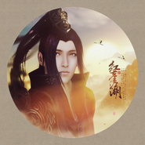

红尘江湖天涯明月刀OL真武同人
============================

|  |  |
| :--: | :-- |
| [ 红尘江湖天涯明月刀OL真武同人](https://emumo.xiami.com/album/1631936390) | **艺人**: [冬子](../index.md) **语种**: 国语 **唱片公司**: 独立发行 **发行时间**: 2015年05月18日 **专辑类别**: EP, 单曲 **专辑风格**: 中国风 China-Wave **播放数**: 16376 **收藏数**: 31 **评论数**: 3  |

## 简介

 多灾多难的真武终于出来了。  
真武同人是以笑道人为视角而创作的，描绘了他与曲无忆，以及这红尘江湖的种种纠葛。  
原本是设想是比较燃一些热血一点的风格，不过后来觉得，真武嘛，应该仙风道骨一些，所以就有了这版清雅致远的编曲，再加上比较高亢的旋律，来营造笑道人的内心纠葛，到无奈，到种种。  
我处身红尘之中，本就作红尘一颗。你又要我如何看破？  
  
转发微博歌曲宣传内容，会抽一位粉丝送激活码一枚哦！  
<a href="http://weibo.com/wsdz" target="_blank" style="color: rgb(116, 181, 50); font-family: &amp;quote;Microsoft Yahei&amp;quote;, 微软雅黑; line-height: 28px;">微博：</a><a href="http://weibo.com/wsdz" target="_blank" rel="nofollow noreferrer noopener">http://weibo.com/wsdz</a>  
冬花粉丝群：②群：376638788 ③群：413371277  

## 曲目

## 评论

|  |  |  |
| :-- | :-- | :-- |
|  [虾米用户](https://emumo.xiami.com/u/47540928) 此人为博爱党ˊ_ˋ 2015-09-03 13:16 赞(0) 踩(0) | 
真武的终于出来了(ಡωಡ)
 |
|  [虾米用户](https://emumo.xiami.com/u/2448735)  2015-07-17 08:19 赞(0) 踩(0) | 
加油加油！
 |
|  [虾米用户](https://emumo.xiami.com/u/35469647) 日饭/核狗/v系大爱。最... 2015-05-18 16:27 赞(0) 踩(0) | 
好听
 |
