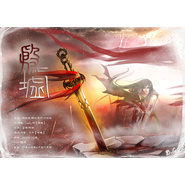

殷墟
============================

|  |  |
| :--: | :-- |
| [ 殷墟](https://emumo.xiami.com/album/2100190082) | **艺人**: [冬子](../index.md) **语种**: 国语 **唱片公司**: 独立发行 **发行时间**: 2015年09月02日 **专辑类别**: EP, 单曲 **专辑风格**: 中国风 China-Wave **播放数**: 3231 **收藏数**: 25 **评论数**: 2  |

## 简介

 殷墟  
  
策划：周鹤吾/锦衣夜行/炒饭殿  
作词：翟谦&amp;颜澈  
作曲/编曲：winky诗【特邀】  
演唱/混音：冬子【特邀】  
海报绘制：BREEZE果  
PS：静璎  
出品：归家工作室&amp;中国风家族  

## 曲目

## 评论

|  |  |  |
| :-- | :-- | :-- |
|  [虾米用户](https://emumo.xiami.com/u/47540928) 此人为博爱党ˊ_ˋ 2015-09-03 13:15 赞(0) 踩(0) | 
男神我来了！
 |
|  [虾米用户](https://emumo.xiami.com/u/49025905) 我曾是你最心爱的玩具。 ... 2015-09-03 12:47 赞(0) 踩(0) | 
男神！！！
 |
