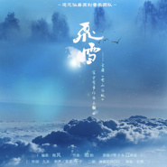

飞雪金庸《雪山飞狐》官方有声作品主题曲
============================

|  |  |
| :--: | :-- |
| [ 飞雪金庸《雪山飞狐》官方有声作品主题曲](https://emumo.xiami.com/album/2100217336) | **艺人**: [冬子](../index.md) **语种**: 国语 **唱片公司**: 独立发行 **发行时间**: 2015年10月12日 **专辑类别**: EP, 单曲 **专辑风格**: 中国风 China-Wave **播放数**: 19764 **收藏数**: 18 **评论数**: 3  |

## 简介

 硬盘坏了，所有混音工程全没了，还有若干未发布的内容也都没了。  
幸好这首大仙居的作品手里有的人多幸免于难。发出来压压惊。。让我去哭一会。。。  
感谢长倾美人的海报 

## 曲目

## 评论

|  |  |  |  |
| :-- | :-- | :-- | :-- |
|  [虾米用户](https://emumo.xiami.com/u/99484518)  2016-05-11 19:57 赞(0) 踩(0) | 
词写得拖沓，白搭节奏感这么强的曲子了。
 |
|  [虾米用户](https://emumo.xiami.com/u/3330666) 哦？ 2015-10-12 19:32 赞(0) 踩(0) | 
江南诚！！！江南诚！！！江南诚！！！诚叔回来了？
 |
|  [虾米用户](https://emumo.xiami.com/u/40230602) 我还没想好要写什么... 2015-10-12 14:22 赞(0) 踩(0) | 
好听~✧(≖ ◡ ≖✿)
 |
