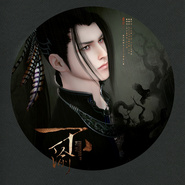

不渝— 天涯明月刀OL五毒同人
============================

|  |  |
| :--: | :-- |
| [ 不渝— 天涯明月刀OL五毒同人](https://emumo.xiami.com/album/2100240382) | **艺人**: [冬子](../index.md) **语种**: 国语 **唱片公司**: 独立发行 **发行时间**: 2015年11月22日 **专辑类别**: EP, 单曲 **专辑风格**: 国语流行 Mandarin Pop, 中国风 China-Wave **播放数**: 11837 **收藏数**: 45 **评论数**: 4  |

## 简介

 不渝—天涯明月刀OL五毒同人&nbsp;  
  
出品：逸恋仙居原创音乐团队&nbsp;  
作词：甘乐&nbsp;  
作曲/编曲/电吉他：papaw泡泡&nbsp;  
演唱/混音：冬子&nbsp;  
母带：空白&nbsp;  
海报：可小猫&nbsp;  
PV：冬子&amp;可小猫&nbsp;  
  
这首五毒的歌依然是逸恋仙居出品，老搭档合作，以五毒门派主线百里研阳和蓝奉月的故事来创作的，编曲上采用了五毒门派特色的乐器做引子，加入了摇滚元素来营造百里研阳内心里那种坚定。希望官方在后期的剧情里不了BE啊~~  

## 曲目

## 评论

|  |  |  |  |
| :-- | :-- | :-- | :-- |
|  [虾米用户](https://emumo.xiami.com/u/310229092) 若教眼底无离恨，不信人间... 2019-10-02 16:01 赞(0) 踩(0) | 
是看到五毒我才来的，这首歌挺不错就是唱的平了一点，最喜欢五毒了
 |
|  [虾米用户](https://emumo.xiami.com/u/353085) 。 2015-11-29 12:00 赞(0) 踩(0) | 
蓝奉月百里研阳 
 |
|  [虾米用户](https://emumo.xiami.com/u/47540928) 此人为博爱党ˊ_ˋ 2015-11-23 17:53 赞(0) 踩(0) | 
哦哦哦！ 
 |
|  [虾米用户](https://emumo.xiami.com/u/30349700) 不要吃太胖哦~会被杀掉的 2015-11-23 09:48 赞(0) 踩(0) | 
w
 |
