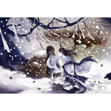

濯缨歌
============================

|  |  |
| :--: | :-- |
| [ 濯缨歌](https://emumo.xiami.com/album/2100251414) | **艺人**: [冬子](../index.md) **语种**: 国语 **唱片公司**: 独立发行 **发行时间**: 2015年12月27日 **专辑类别**: EP, 单曲 **专辑风格**: 流行摇滚 Pop Rock **播放数**: 6475 **收藏数**: 19 **评论数**: 3  |

## 简介

 

 
 

 
 

文案：
 

敌虏突攻边关，边关告急。他初入江湖少年豪气，应皇召出征，欲凭掌上青锋笑傲沙场，却因不晓兵法陷险境，幸得百夫长濯缨率队救回.
 

两人一擅武艺，一擅兵阵，互补所短，彼此钦佩并结为金兰。胡虏不敌退回，我军大胜。他得通知：江湖义士先行返乡待论功行赏。
 

临行之际，他二人于月下畅饮。回乡后不久，他却听说濯缨将他的军功占为己有，他未得半分封赏。
 

他不信，到濯缨营帐询问，却被濯缨逐出，还耻笑他一介草莽也妄想得赏。他愤然割袍断义，誓再不与濯缨相见。
 

过了几年，他收到来自边关的濯缨遗言，濯缨在一次与胡虏的冲突中不幸中箭身亡。信中说起当年官场小人当道，欲对他不利，濯缨迫不得已贬低他以
 

 
 

救其性命。
 

遗言最后写着：一朝兄弟，一世手足。他在坟头流泪不止。
 

 
 

## 曲目

## 评论

|  |  |  |
| :-- | :-- | :-- |
|  [虾米用户](https://emumo.xiami.com/u/34123893)  2016-01-01 10:32 赞(0) 踩(0) | 
W哦来了～！！
 |
|  [虾米用户](https://emumo.xiami.com/u/2043117) 口味很杂的 2015-12-31 13:23 赞(0) 踩(0) | 
第二！！！
 |
|  [虾米用户](https://emumo.xiami.com/u/1120071) 愛する者よ、死に候え 2015-12-27 22:19 赞(0) 踩(0) | 
第一!!!
 |
