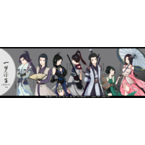

一梦浮生 — 天涯明月刀OL群像
============================

|  |  |
| :--: | :-- |
| [ 一梦浮生 — 天涯明月刀OL群像](https://emumo.xiami.com/album/2100269234) | **艺人**: [冬子](../index.md) **语种**: 国语 **唱片公司**: 独立发行 **发行时间**: 2016年02月01日 **专辑类别**: EP, 单曲 **专辑风格**: 流行 Pop, 古风 GuFeng Music, 中国风 China-Wave **播放数**: 44226 **收藏数**: 26 **评论数**: 2  |

## 简介

 感谢大家做出这么牛B的歌~喵  
八荒少一荒全门派系列，这首全门派群像做为收尾，正式完结了  
  
另外青龙乱舞，长生剑区，帝王州休闲帮派【乐府】继续招收各种活跃的养老玩家。 

## 曲目

## 评论

|  |  |  |  |
| :-- | :-- | :-- | :-- |
|  [虾米用户](https://emumo.xiami.com/u/46353928) 少年 孤独穿梭于二三次元 2016-02-05 22:12 赞(2) 踩(0) | 
马克一下，表示正在玩天刀~有没有同学一起来~
 |
|  [虾米用户](https://emumo.xiami.com/u/49025905) 我曾是你最心爱的玩具。 ... 2016-02-01 18:19 赞(0) 踩(0) | 
好听！！！！抢沙发咯！
 |
