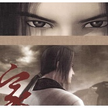

家国天下— 记秦时明月聂蓉
============================

|  |  |
| :--: | :-- |
| [ 家国天下— 记秦时明月聂蓉](https://emumo.xiami.com/album/2100304644) | **艺人**: [冬子](../index.md) **语种**: 国语 **唱片公司**: 独立发行 **发行时间**: 2016年04月01日 **专辑类别**: EP, 单曲 **专辑风格**: 流行 Pop, 古风 GuFeng Music, 中国风 China-Wave **播放数**: 231306 **收藏数**: 44 **评论数**: 4  |

## 简介

【家国天下】  
  
  
策划：梨衿  
作曲：宫钦白  
作词：渺含烟  
编曲：零小七  
演唱：重小烟、冬子  
分轨混音：冬子  
海报：Lynnsey  
  
端木蓉：“你要保护好自己……你太容易……受伤……了……”   
盖聂（略惊慌）：“在下还未报答你的救命之恩！”  
  
  
冬：  
00:22诸子百家 论谁的天下  
00:26九州乱起礼乐崩塌  
00:30纵横捭阖唱罢 谁挞伐  
  
  
烟  
00:40何以为家 居谁的天下   
00:44山河重砌归于戮杀  
00:48乾坤独断华夏 谁却游荡在天涯  
  
  
冬  
00:59倚剑 乱世为侠  
01:03生死奉于一诺为之赴汤蹈火  
01:07应这宿命劫难 负却身侧红颜  
01:12回应你只剩 誓言  
  
  
烟  
01:16誓言 还有多远  
01:21生死奉于一诺为之相守相伴  
01:25应这俗世牵绊 侠义两全  
  
  
--------------------  
  
冬  
01:53诸子百家 论谁的天下  
01:57九州乱起礼乐崩塌  
02:01纵横捭阖唱罢 谁挞伐  
  
烟  
02:10何以为家 居谁的天下  
02:14山河重砌归于戮杀  
02:19乾坤独断华夏 谁却游荡在天涯  
  
冬  
02:29倚剑 乱世为侠  
02:34生死奉于一诺为之赴汤蹈火  
02:38应这宿命劫难 负却身侧红颜  
02:42回应你只剩 誓言  
  
烟  
02:47誓言 还有多远  
02:51生死奉于一诺为之相守相伴  
02:55应这俗世牵绊 侠义两全  
  
冬  
03:04祈愿 家国天下  
03:08夜尽天明山河浸染红霞  
03:13寻得旧处 筑篱墙 弃剑携手 她  
  
烟  
03:22祈愿 家国天下  
03:26夜尽天明重砌世间万千繁华  
03:30不再游荡天涯 故庭飞花 

## 曲目

## 评论

|  |  |  |
| :-- | :-- | :-- |
|  [虾米用户](https://emumo.xiami.com/u/204585838)  2017-10-03 00:38 赞(0) 踩(0) | 

 |
|  [虾米用户](https://emumo.xiami.com/u/298974523)  2017-06-17 10:49 赞(0) 踩(0) | 
有呀
 |
|  [虾米用户](https://emumo.xiami.com/u/288917030)  2017-05-31 05:57 赞(0) 踩(0) | 
有人吗
 |
|  [虾米用户](https://emumo.xiami.com/u/52833865) 我还没想好要写什么... 2016-10-26 22:14 赞(1) 踩(0) | 
想哭
 |
