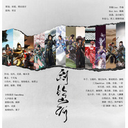

剑三 — 剑饮山河
============================

|  |  |
| :--: | :-- |
| [ 剑三 — 剑饮山河](https://emumo.xiami.com/album/2102659213) | **艺人**: [冬子](../index.md) **语种**: 国语 **唱片公司**: 独立发行 **发行时间**: 2016年12月01日 **专辑类别**: 录音室专辑 **专辑风格**: 古风 GuFeng Music **播放数**: 52224 **收藏数**: 49 **评论数**: 0  |

## 简介

 

剑三•剑饮山河
 

 
 

——————STAFF——————
 

策划：冰瑶、锦衣夜行
 

监制：祁言
 

作曲：东临linc
 

编曲：Mini Ant
 

念白编写：凉盏
 

和声编写：淋淋一韩王
 

和声：淋淋一韩王／一君
 

分轨混音:NamieMeng
 

人声修音:黧
 

剧情后期：画桥
 

题字：迟溪
 

美工：辛连七
 

视频制作：栗子
 

词作：
 

藏剑：结风
 

长歌：迟溪
 

少林：喃木昔
 

丐帮：千月兔
 

七秀：别角晚水
 

苍云：素昭
 

唐门：杨青云
 

万花：辛连七
 

明教：小玖州
 

纯阳：慕言
 

五毒：青砚
 

天策：倾筹
 

————————CAST——————
 

歌手【念白】
 

藏剑：冬子/【情桑】
 

长歌：三无Marblue【息九泱】
 

少林：一君【无痕】
 

丐帮：玉璇玑【青泉】
 

七秀：玄觞【七濑薰】
 

苍云：炽天使【阑珊梦】
 

唐门：祝贺【秦且歌】
 

万花：双笙【迈小步】
 

明教：紫幻如风【苏榭】
 

纯阳：妖扬【天海无贝】
 

五毒：齐栾【白鸦此去】
 

天策：紫凌孤君【今宵】
 

 
 

 
 

「稻香村场景诗，可加念白也可不加，看效果」
 

十里娉婷芙蕖路，大侠英名已作古，
 

竹林侧畔风云起，稻花香里亦江湖。
 

 
 

 
 

藏剑【结风】
 

冬子：
 

我持剑 独立湖色天光
 

银潮鸣岸 迭堆残雪隐香
 

山居四季 出则名动四方
 

铸君子之心 处江湖 无欲则刚
 

 
 

 
 

 
 

长歌【迟溪】
 

三无marblue：
 

微雨泛轻舟 月下
 

泠泠（ling）别宫商
 

我自倾杯盏 对月凉
 

侠气落半壶愁肠
 

叹国士无双
 

从此去 山河未敢忘
 

 
 

 
 

 
 

少林【喃木昔】
 

一君：
 

禅钟响 松梢塔影斜阳
 

青灯长伴 就我摩诃【he】无量
 

仁义万丈 难得浮世一趟
 

用半身袈裟 作戎装 豪杰可当
 

 
 

 
 

丐帮【千月兔】
 

玉璇玑：
 

清风浊酒也正当
 

浅醉逐天光
 

是非谗言我以身挡
 

君山几落杏香
 

再入俗世清狂
 

观 惊涛跌宕
 

 
 

 
 

七秀【别角晚水】
 

玄觞：
 

月来邀 又何妨 纵姮娥 效我霓裳【chang】
 

河汉浅 未满觞 携星芒醉一场
 

剑光凉 夺魄时 不过女儿香
 

 
 

 
 

苍云【素昭】
 

炽天使：
 

苍雪凉 烈酒烫 饮一壶 生死无常。
 

千魂殇 万骨葬 换就山河荣昌。
 

心未老 白马狂 映眸间浩荡。
 

 
 

 
 

 
 

——M——
 

 
 

藏剑【情桑】：若是有人胆敢来犯这灵山秀水，呵，我这一记风来吴山，可不似君子之风。
 

长歌【息九泱】：我长歌之门，不是只会弹弹琴而已。（弹琴肃杀的声音转场）
 

少林【无痕】：阿弥陀佛，虽说出家人不得犯杀生之过，但若施主非想尝一尝这少林绝学……那贫僧也只好，勉为其难超度施主了。（少林长鸣钟声，咚——）
 

丐帮【青泉】：好酒好酒——哈哈，待我解决了这等不知天高地厚的小儿，再与你痛饮三百坛子这好酒！
 

（酒坛砸地摔破的声音）
 

七秀【七濑薰】：若你觉得我秀坊女儿只会跳跳舞绣绣花，那你可就，大错特错了！（先柔再慢慢狠一点，“大错特错”四个字重音）（双剑擦过的声音，噌~）
 

苍云【阑珊梦】:尔等既执意来犯我大好河山，我苍云铁骑可不是好惹的！就是身死于此，你们，也别想从我们身上跨过去！（马的嘶鸣声）
 

 
 

——M——
 

 
 

 
 

唐门【杨青云】
 

祝贺：
 

伐诡道，人言蜀中无双
 

游龙影荡，惊弦破开流光
 

箭生轻狂，千机难辩虚妄
 

筹千变万化，徒留孤叶染血霜
 

 
 

 
 

万花【辛连七】
 

双笙：
 

晴昼落星几彷徨
 

笑把俗世忘
 

妙手天下花间余香
 

闲坐黑白显柔肠
 

书声墨染裳
 

凌云摘星终成绝响
 

 
 

 
 

明教【小玖州】
 

紫幻如风：
 

光明顶 圣火烙刻心上
 

业海汪洋 归寂腾焰飞芒
 

破敌千刃 孑然一身疯狂
 

纵马踏无疆 挡我者 休怪死伤
 

 
 

 
 

纯阳【慕言】
 

妖扬：
 

亭中飞雪伴过往
 

论剑笑语藏
 

饮罢浊酒后尽欢畅
 

踏过红尘一场
 

星雨梦过情长
 

叹    世态炎凉
 

 
 

天策【倾筹】
 

紫凌孤君：
 

烽火扬 战八方 谁横枪 苍穹裂张
 

血一腔 任疏狂 且以身守大唐
 

关河望 沧月凉 杳然一梦长
 

 
 

五毒【青砚】
 

齐栾：
 

天地玄 万物生 有虫鸣 鸟雀惊藏
 

“赐名蛊 ”有世人 唤为药女毒郎
 

过山林 踏沼泽 天下任我往
 

 
 

 
 

 
 

唐门【秦且歌】：一记穿心弩，一发追命箭，若你还有命活着，再来动我蜀中也不迟。（上机关的咔擦声）
 

万花【迈小步】：我万花谷弟子，本该行医济世，可倘使你定要毁了这万花谷的安宁，我手间这笔，也是能够取人性命的。
 

明教【苏榭】：三生树下定三生，就算死，下一生，我仍旧选择奋不顾身地，选择保护这一方净土。
 

（烈火烧得霹雳啪啦的声音，要是没有就算了_(:зゝ∠)_）
 

纯阳【天海无贝】：纯阳宫人向来闭世修道，以雪白头。竟不知世态炎凉至此，那也只好，红尘里走一遭了。
 

五毒【白鸦此去】：这中原人的山河之争本不该妨碍我苗疆山水，既然来了，我五仙教，也不是任人欺负的。（五毒吹笛子的声音）
 

天策：尔等贼子宵小也敢犯我大唐，我们天策军半生戎马，难道怕你不成！兄弟们！杀——（万马齐奔，沙场场景）
 

 
 

 
 

 
 

全体合唱【结风】
 

竞倜傥 忘炎凉 士与邦 伏惟皇唐
 

为侠者 血一腔 力挽千层巨浪
 

朝天阙 山河在 非独我高唱
 

 
 

全体合唱【杨青云】
 

守四方 破八荒 谁人书 青史残章
 

登楼望 旌辉扬 业火燃我无光
 

掩剑芒 度业障 傲骨换黄梁
 

 
 

「南屏山场景诗，可加念白也可不加，看效果」
 

南山秀色翠如玉，北辰清辉冷似霜，
 

古来多少英雄血，谱下青史一段香。
 

 
 

## 曲目

## 评论

|  |  |  |  |
| :-- | :-- | :-- | :-- |
