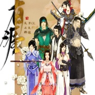

有涯 — 天涯明月刀OL七门派群像
============================

|  |  |
| :--: | :-- |
| [ 有涯 — 天涯明月刀OL七门派群像](https://emumo.xiami.com/album/2102659216) | **艺人**: [冬子](../index.md) **语种**: 国语 **唱片公司**: 独立发行 **发行时间**: 2016年12月03日 **专辑类别**: 录音室专辑 **专辑风格**:  **播放数**: 9213 **收藏数**: 10 **评论数**: 1  |

## 简介

过几天会有一首燕南飞为题的原创歌曲，以纪念陪伴少侠我一路的燕大侠~~  
“在下燕南飞，燕子的燕，不是孤雁的雁” 这句台词相信所有天刀玩家都印象深刻。  
  
“何为善恶？谁来定夺？” “哪有什么好人，哪有什么坏人"这种主旋律始终贯穿游戏主体，所以燕南飞是好是坏，也许只是角度不同罢~  
  
另外神刀的歌也一直在制作进行中，该来的早晚都会来。。。 

## 曲目

## 评论

|  |  |  |  |
| :-- | :-- | :-- | :-- |
|  [虾米用户](https://emumo.xiami.com/u/302872870)  2017-06-08 19:29 赞(0) 踩(0) | 
垃圾神刀，动作毫无美感
 |
