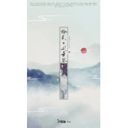

十二风华鉴
============================

|  |  |
| :--: | :-- |
| [ 十二风华鉴](https://emumo.xiami.com/album/2102852553) | **艺人**: [冬子](../index.md) **语种**: 国语 **唱片公司**: 独立发行 **发行时间**: 2017年09月07日 **专辑类别**: EP, 单曲 **专辑风格**: 流行 Pop, 古风 GuFeng Music **播放数**: 941332 **收藏数**: 41 **评论数**: 6  |

## 简介

 

十二风华鉴
 

 
 

策划：茶兮Ailsa
 

作曲/编曲：litterzy
 

作词：乘物游心/宁归尘
 

演唱：
 

中医-萧忆情Alex 
 

中国茶-大个壹玖三 
 

武术-Braska 
 

围棋-橙翼 
 

书法-梅粮新 
 

京剧-Assen捷 
 

国画-Amuro 
 

瓷器-吾恩
 

汉服-裂天 
 

丝绸-五音Jw 
 

剪纸-冬子 
 

刺绣-卡修Rui 
 

和声：玉采田/梅粮新 
 

混音/母带：子青
 

美工：舒念慈
 

题字：颜池
 

画师：香菇子
 

PV：夏淮笙
 

出品：汐音社
 

 
 

乘物游心-中医-萧忆情Alex 
 

天地之阴阳 医理中藏 望闻问切 博采众论众方
 

死生兆彰 于经络中藏 探微索隐 方能知五常
 

 
 

中国茶-大个壹玖三： 
 

月入琼杯 碧烟生回廊 客来时 松花正落窗
 

香叶嫩芽 竹炉沸翠汤 此夜更漏犹长
 

 
 

武术-Braska： 
 

静 当如岭上孤松 动 当如流云行大江
 

止戈为武 万山莫当
 

 
 

围棋-橙翼： 
 

来听 千秋一呼嗓 黑白山河间 溃散昂扬
 

观 六朝风雨事 残局里苍茫 点检消长
 

 
 

书法-梅粮新 
 

一气 挥毫写千行 笔走灵韵扬 回锋酣畅
 

曾令 黄庭换白鹅 信人间有痴狂
 

 
 

宁归尘-京剧-Assen捷： 
 

着笔众生相 诸色琳琅 水袖纷扬 进退自循章
 

 
 

国画-Amuro 
 

酝四时景 溶墨生松香 远山去 翠微描云上
 

浮生闲趣 枝头凝雀鸟 只怕惊了海棠
 

 
 

瓷器-吾恩： 
 

青 天水濯碧而藏 彩 漫消云雾窥盛唐
 

皎白若雪 灿若骄阳 
 

 
 

汉服-裂天： 
 

来看 血脉自炎黄 丝丝只读尽 春蚕绿桑
 

着缀玉配华裳 整襟高堂上 无一不往
 

 
 

丝绸-五音Jw
 

凭身 有七尺儿郎 清风盈满袖 端行四方
 

织锦 平纹分横竖 捧来折煞珠光
 

 
 

剪纸-冬子 
 

点染 一纸喜成双 雕镂人间事 拆条去框
 

剪 燕子衔花过 灯笼映萤火 佛陀百像 
 

 
 

刺绣-卡修Rui： 
 

绮云 浸色入绸丝 巧手捻花针 翻飞几行
 

彩线 勾勒千重样 绘锦绣挑月光
 

 
 

乘物游心-全体合： 
 

来唱 这九州浩荡 上下五千年 一脉泱泱
 

曾 过长街夜市 曾关河苍凉 曾立残阳
 

至此 等你我回望 回望这珍藏 风华绝赏
 

千年 不改旧模样 指引华夏未央
 

 
 

 
 

 
 

 
 

 
 

 
 

 
 

 
 

 
 

 
 

## 曲目

## 评论

|  |  |  |
| :-- | :-- | :-- |
|  [虾米用户](https://emumo.xiami.com/u/411463846)  2019-09-08 06:03 赞(0) 踩(0) | 
，1一线后
 |
|  [虾米用户](https://emumo.xiami.com/u/428775599)  2019-08-22 19:42 赞(0) 踩(0) | 
挺好听的呢。    
 |
|  [虾米用户](https://emumo.xiami.com/u/412177075) 随处流浪 2019-06-23 12:11 赞(0) 踩(0) | 
第一首喜欢的古风歌❤
 |
|  [虾米用户](https://emumo.xiami.com/u/356740228)  2019-04-01 16:24 赞(0) 踩(0) | 
好听！
 |
|  [虾米用户](https://emumo.xiami.com/u/96794356) 直到约定融化成笑颜 2017-09-08 10:06 赞(1) 踩(0) | 
表白男神
 |
|  [虾米用户](https://emumo.xiami.com/u/96794356) 直到约定融化成笑颜 2017-09-08 10:06 赞(1) 踩(0) | 
这阵容，给跪了。。。
 |
