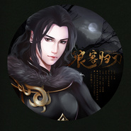

浪客归刀— 天涯明月刀OL神刀门派同人
============================

|  |  |
| :--: | :-- |
| [ 浪客归刀— 天涯明月刀OL神刀门派同人](https://emumo.xiami.com/album/2102863493) | **艺人**: [冬子](../index.md) **语种**: 国语 **唱片公司**: 独立发行 **发行时间**: 2017年09月25日 **专辑类别**: EP, 单曲 **专辑风格**: 古风 GuFeng Music, 同人音乐 DouJin, 流行摇滚 Pop Rock **播放数**: 2828 **收藏数**: 13 **评论数**: 0  |

## 简介

一首制作了一年半的歌曲，每个阶段都反复打磨了很久，  
就连前奏的音效都是进游戏里录了几十种效果最后选出来的，  
感谢大家的辛苦付出。  
神刀全原创同人曲，是以神刀大当家路小佳以及好基友傅红雪为线索来创作的，  
内容里结合了很多神刀的门派特色，  
整体非常有江湖气，希望你们喜欢。  
  
再次感谢制作过程中给予过帮助的朋友们。 

## 曲目

## 评论

