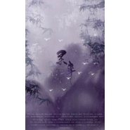

灵犀
============================

|  |  |
| :--: | :-- |
| [ 灵犀](https://emumo.xiami.com/album/2104962701) | **艺人**: [冬子](../index.md) **语种**: 国语 **唱片公司**:  **发行时间**: 2019年06月25日 **专辑类别**: 录音室专辑 **专辑风格**: 古风 GuFeng Music **播放数**: 2661 **收藏数**: 7 **评论数**: 2  |

## 简介

灵犀（剑网3十周年剧情歌）  
监制：麦萌对手戏  
出品：华夜音乐  
演唱：冬子＆龟娘   
策划/作曲：华月  
文案/编剧/作词：慕容玖夜  
编曲：SEA云  
混音：苦逼君  
剧情后期：zerone  
和声：白丁- -Mashiro  
题字：颜池  
美工：涵十六  
视频编辑师：鹿凹凹  
  
Cv组：  
青年灵犀/玄箴和尚：泽西锅  
青年莫迦：白鸦此去【KAU】  
幼年灵犀/幼年玄箴：龙咩  
天一教乌灵凤：息九泱【阁色惟一】  
五毒前教主魔刹罗：关鱼【阁色惟一】  
小沙弥明迟：zerone  
少林掌门玄正大师：木成  
江湖人甲：磁悬浮乌龟【恶人谷】  
江湖人乙：云踪【阁色惟一】  
  
  
灵犀(by:慕容玖夜)  
  
一.	风雨骤时，入梦中梦  
  
适逢七月初七，中元节，莲灯照夜，往生门开。  
不知道为什么，我又梦到多年前那个细雨轻濛的午后。  
记忆里有个眉目含愁的紫衣女子，她身侧萦绕着几只蝴蝶，步履轻盈地翩然而来，良久伫立在古寺山门外那棵冠盖如云的菩提树下，在淡烟疏雨中与年少的我两两遥望，像隔着一层说不清道不明的轻纱一般，感觉模糊又清晰。  
年仅十三岁的我有些惊讶，一边好奇地望向那个如同传奇话本里山鬼般身影绮丽的姑娘，一边怀疑自己到底是不是眼花。  
待我懵懂地揉了揉眼睛，抬头再瞧她，只见那人红唇微动，一双盈若春水的眼眸里好似盛满了泪，期期艾艾地望着我，像是想要说些什么。  
我情不自禁地想要走近那人，问问她究竟是谁，可否与我相识，缘何到此却又不走近……  
“玄箴!你在做什么？！今日的午课你还未做完，还不随我回去?”  
思及此处，冷不防听得身后一声怒喝，将我惊得连忙收回了刚想迈出门外的左脚。  
一回头，却见手持法杖的玄明师兄神色颇为紧张地看着我，他不由分说地想要将我拉回寺内。  
“我……玄明师兄，我刚刚在树下看到了个人，她像是认识我的……”  
听到这话，玄明师兄却笑了，他有些无奈地说：“傻孩子，定是你看错了，山雨下得这样大，哪儿有什么香客前来呢？若当真有……大抵也是红尘幻化出的精魅，非是我等空门中人可随意触碰的所在。唉，到头来，终究不过空梦一场啊。”  
“我没有骗人！是真的！她就在那儿……唉？”那时我未曾理解他的话，只顾着急辩解。  
然而，等我再回头时，山门外已是大雨滂沱，那葱茏树下早已空无一人了。  
“她走了？她去哪里了？！”不自觉地喃喃说出这句话，我不知道自己为什么突然觉得心里委屈得厉害，下一刻几乎是毫不犹豫地冒着瓢泼大雨疾奔到那树下，却发现地上有一只被雨水打湿的紫色蝴蝶，孤单地被人遗弃在草地上……  
它的主人，为什么不要它了？  
  
二.寂寥禅里，莲灯通明    
  
迷茫之间，忽闻山寺禅钟声声，似告诫又像是呼唤般，荡人心魄。  
待自梦中惊醒，我才发现自己依旧穿着那件被洗得泛白的僧衣，手中握着那副《佛说摩登女经》的画卷，独自端坐在古寺禅院内的蒲团中。  
蓦然抬眸，只见溶溶夜色里的大雄宝殿庄严巍峨，有风拂经幡如梦起落，盏盏莲灯璀璨得如星似火，映照着画壁中拈花微笑的诸天神佛。  
我终于知道，自己想起了什么……  
雨中树下那个人，是我心心念念安放在记忆最深处的心魔。  
她曾是我落发出家之前的师父，名叫莫迦。  
  
三.当时年少，尚不知愁  
  
假如岁月肯跟随思绪在寂寞红尘中如水倒流，倘若天意能够在一切灾祸发生之前稍作成全，我本应是那个名叫灵犀的五毒教少年，和我的师父莫迦一起生活在南疆苗寨的小竹楼里，快乐无忧地长大……而不是在记忆全失的情况下投身空门，成为少林寺的僧人玄箴。  
莫迦此人，从我幼年记事起，她对事对人都是一副唯唯诺诺、善意讨好的样子，委实让人觉得她有些缺心眼。故而，作为她身边唯一的徒弟，我还得时常在她遭遇一些拎不清的困难时，揉揉发愁的眉头，前去为这个笨蛋讨些公道……  
“灵犀，你怎么又给我闯祸了？南葛师兄说你在他的茶里下了致幻的灵蛊，将他吓得做了好几个晚上的噩梦，整整半个月都不敢睡觉……他虽然……之前对我是凶了点，不小心拿走了我的炼毒鼎，但是他平素为人还是很和善的……那个，我们做人呢，要多想一想旁人的好，你就不要总是欺负他了……”那个紫衣的少女连兴师问罪都是轻声细语的样子，看起来丝毫不像五毒教中别的严师那样具有威慑力。  
闻言，我不由撇了撇嘴，暗中将那条藏在袖中的碧眼毒蛇扔出了窗外，心道这次还有更好玩的东西等着那个顺手牵羊还热衷于恶人先告状的傻大个，这才转过身来，像往常那样装作委委屈屈的样子，在她面前慌忙低头解释道： “我一个十岁的孩子，怎么可能欺负他？师父，你是知道的，我连《毒经秘要》第一卷都尚且背不全，如何会和一个大人为难呢？一定是南葛师兄不小心在炼毒时自己中了招，产生了幻觉，才会这样同你说……”  
“又跟我装傻？！上次你捉弄齐师姐的时候也是这样，我不会再上你的当了！”说罢，她就将我推出了门外，像是真的生气了一样，大声道：“你今晚不许吃饭了，去把解毒方抄写五百遍，明天随我去同南葛赔礼！你要是敢耍赖不去……我就……就……”  
就在这时，我攀上竹楼间茂密的紫藤萝，轻而易举地趴到了她的窗前，歪着脑袋笑吟吟地说，“就什么？哎呀，糟了！师父，我忘了……我错将七星蝉和赤尾蝎放在那灵蛊茶里了，若南葛师兄喝了你配制的普通解药，不仅会继续做噩梦，怕是还要状若疯魔般围着五毒潭里的大槐树跑上一整天，就像一只被踩了尾巴的小野猪那样，哈哈哈哈……”  
“灵犀！你给我站住，今天为师非要把你绑在树上狠狠揍一顿！”   
话虽如此，可到最后，师父她终是不愿重罚我，也只是气恼地用藤条打了我掌心三下而已……  
在那时，年少无知的我并不懂得，这样一个柔善心软的人，为什么要在五毒教分裂之际，前去天一教投靠心术不正的乌蒙贵长老，还狠心地用断情蛊抹去我的记忆，丢下我一个人独自面对那凉薄可笑的命运。  
  
四.爱憎起时，缘劫牵生  
  
我与莫迦分别的那天，是在一个银月如钩的夜晚。  
那会儿，我正赤着脚追逐那些刚被捉来练蛊的胆小蝴蝶，像个小疯子一样，漫山遍野地跟随五彩斑斓的蝶群来回奔跑……  
“灵犀……”  
“师父，你瞧，这是我特地从犀牛涧的千蝶洞里为你捉的蝶王！费了我好大劲儿，用了诸多诱饵，它就是不肯出来，最后我钻进洞里差点被毒伤眼睛才到手……”  
听到身后那个熟悉的声音，我猛地回头，想要献宝一样地将手里那只美丽纤弱的紫色蝴蝶捧到她眼前，却在看到那个十五岁的少女满脸泪痕的时候，不由呆呆怔住，竟没发觉食指一松，悄然放走了那蝶王……  
“师父，你……怎么哭了?”  
莫迦慌乱地揉了揉红肿的双眼，故作平常般温柔道：“我没事……灵犀，若是有一天，我是说如果……师父不能在你身边，你能不能慢慢地，试着学会照顾好自己？”  
“师父，到底怎么了？你怎么突然这样说？”没来由的，难道她要我孤身去江湖游历么？  
只见她黯然垂下眼眸，咬了咬唇，慢慢道：“我……只是觉得自己已教不了你许多了。灵犀，你看，你自幼便天赋异禀，学什么东西都很快，你的武功和蛊术很快就会超越我，是时候，为你寻一位新的师父了。听闻少林古寺有位玄正大师，年纪轻轻便有大德，他不仅武功高深，心向正道，并且愿意收下你……我已致信于他，三日后，就会有人接你前去少林……”  
“我哪儿都不去！”一时之间，我急得红了眼睛，心里不由想起教中其他同我年纪相仿的弟子在闲谈时说的那些话，慌忙道，“师父，你是不是听旁人说了什么？！其实……我都知道，他们都说我生来就浑身带毒，是不详之人，将来若是毒乱心智，必成祸患。虽然我往常行事莽撞，可我从未害人……”  
见她一言不发，我越想越怕。思及往日里遭受的那些异样眼光和冷漠话语，顿时心如溺水般难受，我当即在她面前跪下，恨不得将额头狠狠磕破，恳求道，“师父，求你别赶我走，我会好好听你的话，哪怕要我废掉武功，斩断手脚，或者，你今日将我毒死在这里，我也绝不离开你！”   
那时那刻，令我万万没想到的是，一向最疼我的师父，居然会真的对我出手……   
她望了我许久，突然就闭上眼睛，像是做了什么决定一般，下一瞬，冷不防地抬手一掌便拍在我头顶的灵台处，就连声音也变得异常陌生而冰冷，“好……既然如此，那我就遂了你心意！如今我将要去投奔天一教，将你留在五毒也没有用处了，不如早早处置了，免得日后授人挟制……灵犀，我过去收留你，也不过是因为将你视为炼制蛊王的可造之材，师父原也不忍如此对你，可惜，你非要挡我的路，那就……别怪我无情了！”  
那一掌，几乎散去了我全身的武功。纵然心如乱麻，有汩汩鲜血从唇角溢出，我依然紧闭双眼，伏跪在地上，一声不吭.....  
其实，我知道她是在骗我。每次她骗人的时候，都会说话很快，言辞前后矛盾，语气反而愈发坚定，如今亦如是。可是，她究竟有着什么样的苦衷呢，竟然要将自己也逼到这样的境地……  
“你……你当真不肯走？！”她望着我的眸中尽是惊痛，随即凄然地笑了，“好……好……不愧是我的好徒弟！放你一条生路，可你竟这样不识好歹。今日我便将你逐出师门，你我今生，都不要相见了！”说罢，便欲转身离去。  
听闻此言，我心下一窒，慌忙踉跄着起身，紧紧捉住了她的衣袖，顾不上神志已经逐渐有些模糊，口齿含混地喃喃道：“师父，师父，别丢下我一个人……”         
“灵犀……”迷茫之际，那应当是她最后一次那样温柔的呼唤我。  
  
许是那天的夜色来得太早，亦或是我已累得精疲力竭，不然也不会产生那样的幻觉……  
时近午夜，只见那原本该在中天高悬的幽幽明月，忽然被无数翩然飞舞的紫色蝴蝶所遮蔽，匆匆隐去了光芒。那一瞬，天地之间，唯有无尽寂寥的黑暗，仿佛屏障一般蒙住了我的双眼。  
就在神思恍惚的刹那，耳畔有轻柔若雾的话语萦绕心怀，跟随那诡异的蛊术秘咒深深地烙印在我的脑海里。  
“听着，我永远都不会解开种在你身上的断情蛊，除非蝴蝶不再张开翅膀，时光肯在黄泉倒流，这誓言，将延续至我魂魄消亡那一刻……”  
就在那一刻，谁也没有料想到，颠倒梦想将自此起，因果缘劫将由此生。  
我中了五毒秘术里最为隐秘的断情蛊，失去了所有的记忆，忘记了此生最不该忘记的人，注定将要承受来日的诸多报业。  
  
五．逝者如斯，永不可得  
  
十年后，在我准备下山游历的那一天，年迈的玄正大师不由分说地拦住了我。  
他亲自去往藏经阁中，取出一副落满灰尘、微微泛黄的《佛说摩登女经》画像。他说，这是一位来自远道的故人多年前赠与我的礼物，让我在寺内细细参悟。可惜当时年少，我未能懂得他的深意，只是匆匆一瞥便将其随手放置在书案之上，离开了。  
随后，当我在巴陵偶遇身受重伤的莫迦时，不仅未能认出容貌尽毁的她，竟因武功不济而眼睁睁地看她在我面前逼退那些恶意寻衅的仇敌，用尽毕生功法解开那断情蛊，分外凄凉地死去……  
直到那时，我才知道，当年她是为了保住我的性命，不顾五毒前教主魔刹罗的劝阻，偷偷将我送去少林，而后甘愿以身为饵前去天一教潜伏，意图捣毁其圣坛，夺取被乌蒙贵带走的五毒秘籍。不料，她中途被叛徒出卖，不得已之下，侥幸连夜逃出天一教。奈何当时身为五毒教主的魔刹罗突然失踪，她已无法证明身份，只得日夜忍受万毒噬心之苦，在江湖之中小心翼翼地躲避两教教众的追杀，身不由己地四处藏匿……  
她这一生，无论生死，都在为保护我而苦心筹谋。可是我却白白荒废了这十年光阴，什么都不知道，什么都做不了，只因自私地追寻那些本该被时光尘封入土的可笑记忆，便教她落得如此结局……  
  
至此，我终于明白，为什么在我执意离开那日，回头却望见玄正大师像一尊身着法衣的罚恶罗汉那样愁眉紧锁，独立于空门高阶前，口中喃喃念着这样的话：“如今种种，皆是昨日因果。一切缘法自尔起，亦该由尔来化解。玄箴，你既如此执着追逐那过往云烟，你且去罢！只愿来日，莫要后悔才是。”  
原来，一个人，唯有吃过诸多苦，尝过锥心痛，经历过爱恨离别与希望绝望，才会明白，有些事和人，并非是拼尽全力和执迷不放就能挽回的。等到彻底失去一切的时候，无数的遗憾与悔恨将如同这世间至毒的蛇信子一样，时时缠绕在身，教人翻来覆去地不得安宁……顿生心魔。  
  
如是我闻，百态无相，魔由心生。  
是故，过去心不可得，现在心不可得，未来心不可得。唯有看空一切，方得自在喜乐。  
那我若心有挂碍，究竟还能得到什么？ 如今还剩下什么？此后还能奢望什么？  
  
师父，是不是，我真的错了？  
  
六.莲台座下，摩登伽女  
  
时光匆忙飞逝，又是一年初秋。  
八月金桂落，微风拂动禅院里的飘摇飞花，徒留一地香尘……  
已过而立之年的我穿着单薄的素衣，正在寺里的书斋同小沙弥们讲经，却见有个年幼的弟子自后窗调皮地翻了进来，一时之间，惹得讲堂之上不少人回头去看他。   
“慧难，今日你缘何又来迟了？！”我拿着戒尺，走到他跟前，沉声问道。  
“玄箴师父，我……我……”那孩子低下头，嗫嚅着想要回答，却下意识地抱紧了怀里的陈旧卷轴。  
“日前教你们的《楞严经》可曾背熟了？你手中拿的又是什么？”  
“弟子愚钝，抄了许多遍，还是未曾熟记。这幅画，是我在堆放于前院的杂物之间找到的，弟子之前从未见过这样好看的丹青，一心想要临摹，忘了时辰，故而……来迟了。还请玄箴师父责罚！”想来慧难许是被我的严厉吓着了，马上老老实实地将画卷交到了我手中。  
见他如此，我心生不忍，只淡淡说道：“罢了，你且坐下静思己过吧，如若再犯，便去将经文抄写三百遍”。  
待回过身来，我下意识地将那画卷打开，想要观瞻弟子口中那与众不同的浓墨重彩，却在看到画中人的那一瞬，恍然如梦地愣在原地。  
只见那淡墨渲染的缤纷层云间，一位蛇尾人身、容貌艳丽的少女正恭敬地手捧碧叶青荷，在佛祖面前婉然低眉，似是虔诚皈依神态。可若是细细端详，就会发现她的目光却是透过淡淡佛光，脉脉看向佛祖身后那名站立着的眉目淡然的年轻弟子，唇角若隐若现地流露出些许温柔笑意。  
这画，正是我自山下归来后，找遍了整间屋子都未曾寻见的那副《佛说摩登女经》。  
  
  
七．道阻且长，殊途同归  
  
摩登伽女，亦名摩睺罗伽,人面蛇身，是为佛前八部天龙之一。  
昔日，佛陀弟子阿难在人间历劫时，曾遇到一个名叫摩登伽的女子。那女子对其一见倾心，为他不惜跨越千难百劫来到佛祖面前。她说‘我爱阿难眼，爱阿难耳，爱阿难声，爱阿难行步’。佛祖笑那摩登伽女执着痴愚，意欲点醒她，他说，阿难本是凡人之躯，眼耳声形不过是浮生泡影，百年后也终将是尘下白骨…..没想到，那摩登伽女听闻此言，竟当即愿意了断尘缘，化为蟒神摩睺罗伽，皈依佛门。  
  
待我阖上经卷，讲完这个故事，忽见一名弟子站起身来，迷惑不解地发问：“玄箴师父，虽说心存善念而皈依我佛，当是正途。可不知道为什么，弟子总觉得有些奇怪……为何那摩登伽女能够为了阿难不顾艰险地来到佛前，却放弃的那样轻易呢？”  
“这…..”一时之间，我竟被问住，无法言语，心下顿觉自己还不如一个八岁孩童有慧根，过去的我居然从未细想过这些。  
  
是了，摩登伽女怎会只因看到阿难的凡俗之相而退却呢？她肯舍弃普通凡人的七情六欲、喜怒哀乐，也不过是想要皈依他心中的所思所想。  
她什么都知道，什么都懂得。一个普通凡人的放不下、忘不掉、舍不得，于神佛来说，不过蜉蝣般弹指即逝。哪怕不畏艰险地为他走过千难百劫，纵然也曾扮痴装傻地在他面前寻死觅活，就算这一路吃尽了苦头也受尽了折磨，这份注定爱而不得的执着将她逼得高燃心火、灼魂裂魄，她还能怎么办呢？  
罢了，算了，想好了，不回头了。活该躲不过这命运，不如就这样立地成佛，成全了他，也成全了自己。  
如此，是不是也算殊途同归了？  
然而，成佛之后，她再也感觉不到了……  
  
思及此，我又想起多年前那些陈旧往事，不由低头笑了，眼里蕴藏许久的泪却滴落在掌心那串紫檀佛珠上。  
蓦然之间，我听见自己的声音喑哑得不成样子，像是回答那弟子，又似喃喃自语，“那善女子心中所求已得，而阿难心中有佛。孰是孰非，对他们而言，都已不再重要了…….”  
最后的最后，什么都不必再说。  
情若深重，阖眼也闻梵音婆娑，心若如初，天地皆是无量净土……  
有人记得，就够了。  
  
 

## 曲目

## 评论

|  |  |  |
| :-- | :-- | :-- |
|  [虾米用户](https://emumo.xiami.com/u/72497474) 我喜欢古风歌曲哦⊙ω⊙！... 2019-06-30 10:22 赞(0) 踩(0) | 
好听
 |
|  [虾米用户](https://emumo.xiami.com/u/299790739)  2019-06-25 13:01 赞(1) 踩(0) | 
很好听，有些伤感，冬子和龟娘唱得都挺好，配音也不错，总体来说是值得听的。一个……很令人沉迷的故事，一个爱而不得的故事。
 |
