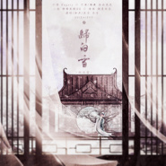

归白雪
============================

|  |  |
| :--: | :-- |
| [ 归白雪](https://emumo.xiami.com/album/5020550954) | **艺人**: [冬子](../index.md) **语种**: 国语 **唱片公司**: 独立发行 **发行时间**: 2020年05月07日 **专辑类别**: 录音室专辑 **专辑风格**: 古风 GuFeng Music, 中国风 China-Wave, 中国戏曲 Chinese Opera **播放数**: 444 **收藏数**: 4 **评论数**: 5  |

## 简介

## 曲目

## 评论

|  |  |  |  |
| :-- | :-- | :-- | :-- |
|  [虾米用户](https://emumo.xiami.com/u/322134065)  2020-05-31 15:07 赞(0) 踩(0) | 
好多个月没打开虾米了，刚刚解决登陆问题，一看到私信就来听冬子的新歌了 （别问我在某易听了没，我也一样好久没时间打开某易了 ）言归正传，歌和曲都很好听，冬子的歌声一出来就有种被锁定的感觉，很是沉溺在他的歌声里，但觉得Chorus部分的和声有点“抢镜头”了，显得有点吵，不能确定该集中去听平喉的主唱还是京腔的和声，听到这里会有点“出戏”了…
 |
|  [虾米用户](https://emumo.xiami.com/u/299790739)  2020-05-30 12:19 赞(0) 踩(0) | 
祝冬子大大永远幸幸福福
 |
|  [虾米用户](https://emumo.xiami.com/u/375311355) 猜猜头像是谁 2020-05-11 00:01 赞(0) 踩(0) | 
一如既往的那么好听，冬子，记得保护好自己，我永远支持你
 |
|  [虾米用户](https://emumo.xiami.com/u/269245815) 偷得浮生半日闲，写意潇洒... 2020-05-10 16:42 赞(0) 踩(0) | 
嗯嗯一贯古风，配乐依旧很有个性！喜欢冬子的风格，支持！希望多出好作品
 |
|  [虾米用户](https://emumo.xiami.com/u/38918617) 你相信我，我相信你 2020-05-10 15:28 赞(1) 踩(0) | 
请注意 10新歌才能叫录音室专辑 否则都是EP单曲 别被某易带坏 整得不专业
 |
