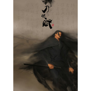

刀魂赋SQ品质
============================

|  |  |
| :--: | :-- |
| [ 刀魂赋SQ品质](https://emumo.xiami.com/album/716557773) | **艺人**: [冬子](../index.md) **语种**: 国语 **唱片公司**: 独立发行 **发行时间**: 2014年11月21日 **专辑类别**: EP, 单曲 **专辑风格**: 国语流行 Mandarin Pop, 中国风 China-Wave **播放数**: 20896 **收藏数**: 4 **评论数**: 1  |

## 简介

 刀魂赋SQ品质

## 曲目

## 评论

|  |  |  |
| :-- | :-- | :-- |
|  [虾米用户](https://emumo.xiami.com/u/5597903)  2016-01-04 13:44 赞(0) 踩(0) | 
封面非常非常非常好看！
 |
