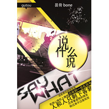

说什么说肖林朋作品
============================

|  |  |
| :--: | :-- |
| [ 说什么说肖林朋作品](https://emumo.xiami.com/album/5056200) | **艺人**: [幽恋冰人](../index.md) **语种**: 国语 **唱片公司**: 独立发行 **发行时间**: 2014年07月11日 **专辑类别**: EP, 单曲 **专辑风格**: 国语流行 Mandarin Pop **播放数**: 336 **收藏数**: 0 **评论数**: 0  |

## 简介

说什么说
 

演唱：昙骨  
作词：伊念忧  
作曲，编曲，混缩：肖林朋  
*****肖林朋作品（需要编曲联系qq1553990434）*****
 

这世界总纷纷扰扰  
惹得心情犯上糟糕  
总收到一些乱讯号
 

人和人只剩下客套  
还带着虚假的微笑  
转过身不过是玩笑  
---------------------------------  
说 说什么说 说了又不去做  
说了白说  
做 做什么做 除了这副躯壳  
你还剩什么
 

我们 没话好说  
那些推脱 我不想说 丢到角落  
我 不想再说  
请你别来打扰属于我的生活  
---------------------------------  
收起你虚伪的客套  
我早已看穿你面貌  
不过披着华丽外表
 

街角路灯都在嘲笑  
收起你可笑的骄傲  
施舍给你一丝嗤笑  
----------------------------------  
说 说什么说 说了又不去做  
说了白说  
做 做什么做 除了这副躯壳  
你还剩什么
 

我们 没话好说  
那些推脱 我不想说 丢到角落  
我 不想再说  
请你别来打扰属于我的生活
 

和你 没话好说  
那些推脱 我不想说 丢到角落  
我 不想再说  
请你快点滚出属于我的生活  
---------------------------------  
收起你虚伪的客套  
我早已看穿你面貌  
不过披着华丽外表
 

街角路灯都在嘲笑  
收起你可笑的骄傲  
施舍给你一丝嗤笑  
----------------------------------  
这世界总纷纷扰扰  
惹得心情犯上糟糕  
总收到一些乱讯号
 

人和人只剩下客套  
还带着虚假的微笑  
转过身不过是玩笑
 

&nbsp;

## 曲目

## 评论

|  |  |  |  |
| :-- | :-- | :-- | :-- |
