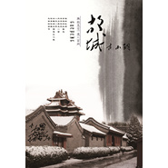

幽恋冰人
============================

|  |  |
| :--: | :-- |
| [ 幽恋冰人](https://i.xiami.com/xiaolinpeng) | **地区**: China 中国大陆 **风格**: 国语流行 Mandarin Pop **播放数**: 2410777 **粉丝数**: 57 **评论数**: 2  |

## 档案

爱音乐不需要理由，有想编曲或者想交流的朋友可以联系我：qq1553990434

## 专辑

| 名称 | 语种 | 唱片公司 | 发行时间 | 专辑类别 | 专辑风格 |
| :--: | :-- | :-- | :-- | :-- | :-- |
| [ Mr Right肖林朋作品](./albums/1806524480.md) | 韩语 | 独立发行 | 2014年07月28日 | EP, 单曲 | 韩国流行 K-Pop |
| [ 吻痕肖林朋作品](./albums/1906517792.md) | 国语 | 独立发行 | 2014年07月28日 | EP, 单曲 | 国语流行 Mandarin Pop |
| [ 这是爱情肖林朋作品](./albums/1606521514.md) | 粤语 | 独立发行 | 2014年07月28日 | EP, 单曲 | 粤语流行 Cantopop |
| [ 起风了肖林朋作品](./albums/806473737.md) | 国语 | 独立发行 | 2014年07月27日 | EP, 单曲 | 国语流行 Mandarin Pop |
| [ 一生入纸肖林朋作品](./albums/1606476446.md) | 国语 | 独立发行 | 2014年07月27日 | EP, 单曲 |  |
| [ 红妆肖林朋作品](./albums/306384454.md) | 国语 | 独立发行 | 2014年07月26日 | EP, 单曲 | 国语流行 Mandarin Pop |
| [ 超辣女神肖林朋作品](./albums/2006387390.md) | 国语 | 独立发行 | 2014年07月26日 | EP, 单曲 | 国语流行 Mandarin Pop |
| [ 这些年肖林朋作品](./albums/606341558.md) | 国语 | 独立发行 | 2014年07月26日 | EP, 单曲 | 国语流行 Mandarin Pop |
| [ 纯冰糖肖林朋作品](./albums/1806380609.md) | 国语 | 独立发行 | 2014年07月26日 | EP, 单曲 | 国语流行 Mandarin Pop |
| [ The Sunday of a Carpenter肖林朋作品](./albums/906359482.md) | 英语 | 独立发行 | 2014年07月26日 | EP, 单曲 | 爵士流行 Jazz Pop, 欧美流行 Western Pop |
| [ Tonight肖林朋作品](./albums/106367105.md) | 英语 | 独立发行 | 2014年07月26日 | EP, 单曲 | 欧美流行 Western Pop |
| [ 两种思念肖林朋作品](./albums/406388949.md) | 国语 | 独立发行 | 2014年07月26日 | EP, 单曲 | 国语流行 Mandarin Pop |
| [ Nita and Tina肖林朋作品](./albums/1506359305.md) | 国语 | 独立发行 | 2014年07月26日 | EP, 单曲 | 爵士流行 Jazz Pop, 国语流行 Mandarin Pop |
| [ 绽放肖林朋作品](./albums/1006261650.md) | 国语 | 独立发行 | 2014年07月25日 | EP, 单曲 | 国语流行 Mandarin Pop |
| [ 一纸相望肖林朋作品](./albums/1806213305.md) | 国语 | 独立发行 | 2014年07月24日 | EP, 单曲 | 国语流行 Mandarin Pop |
| [ 宝贝肖林朋作品](./albums/1205527503.md) | 国语 | 独立发行 | 2014年07月17日 | EP, 单曲 | 国语流行 Mandarin Pop |
| [ 如果还有如果肖林朋作品](./albums/405265475.md) | 国语 | 独立发行 | 2014年07月13日 | EP, 单曲 | 国语流行 Mandarin Pop |
| [ 致我们错过的爱情肖林朋作品](./albums/1305047827.md) | 国语 | 独立发行 | 2014年07月11日 | EP, 单曲 | 国语流行 Mandarin Pop |
| [ 好想和你去吹吹风肖林朋作品](./albums/1805010817.md) | 国语 | 独立发行 | 2014年07月11日 | EP, 单曲 | 国语流行 Mandarin Pop |
| [ 同心率肖林朋作品](./albums/1305056517.md) | 国语 | 独立发行 | 2014年07月11日 | EP, 单曲 | 国语流行 Mandarin Pop |
| [ 说什么说肖林朋作品](./albums/5056200.md) | 国语 | 独立发行 | 2014年07月11日 | EP, 单曲 | 国语流行 Mandarin Pop |
| [ 残梦肖林朋作品](./albums/1804449255.md) | 国语 | 独立发行 | 2014年07月04日 | EP, 单曲 | 国语流行 Mandarin Pop |
| [ 安吉丽娜肖林朋作品](./albums/1504277183.md) | 国语 | 独立发行 | 2014年07月02日 | EP, 单曲 | 国语流行 Mandarin Pop |
| [ 大小姐肖林朋作品](./albums/1904275172.md) | 国语 | 独立发行 | 2014年07月02日 | EP, 单曲 | 国语流行 Mandarin Pop |
| [ 红蔷薇肖林朋作品](./albums/404023030.md) | 国语 | 独立发行 | 2014年06月29日 | EP, 单曲 | 国语流行 Mandarin Pop |
| [ 故城肖林朋作品](./albums/304025800.md) | 国语 | 独立发行 | 2014年06月29日 | EP, 单曲 | 国语流行 Mandarin Pop |
| [ 傻瓜肖林朋作品](./albums/904030035.md) | 国语 | 独立发行 | 2014年06月29日 | EP, 单曲 | 国语流行 Mandarin Pop |

## 评论

|  |  |  |
| :-- | :-- | :-- |
|  [虾米用户](https://emumo.xiami.com/u/374355019)  2020-02-06 10:35 赞(0) 踩(0) | 
如果
 |
|  [虾米用户](https://emumo.xiami.com/u/309547206) 有限生命听无限音乐 2019-06-28 11:17 赞(0) 踩(0) | 
何以不用原名？？大丈夫行不改名。肖林朋不错 
 |
