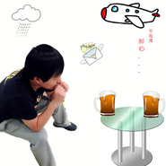

合久必分
============================

|  |  |
| :--: | :-- |
| [ 合久必分](https://emumo.xiami.com/album/1871276) | **艺人**: [韦海涛](../index.md) **语种**: 国语 **唱片公司**: 独立发行 **发行时间**: 2014年06月05日 **专辑类别**: 录音室专辑 **专辑风格**: 国语流行 Mandarin Pop **播放数**: 4060 **收藏数**: 4 **评论数**: 0  |

## 简介

 
 

合久必分
 

 
 

这张专辑延续了其个人以往的伤感路线，精妙的内心刻画和招牌式的伤感
 

 
 

嗓音，字字刻骨句句惊心，也许分久必合，也许合久必分，也许也许已没
 

 
 

有也许...
 

 

## 曲目

## 评论

|  |  |  |  |
| :-- | :-- | :-- | :-- |
