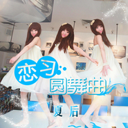

夏后
============================

|  |  |
| :--: | :-- |
| [ 夏后](https://i.xiami.com/xiahou) | **地区**: China 中国大陆 **风格**: 国语流行 Mandarin Pop **播放数**: 6773024 **粉丝数**: 2130 **评论数**: 85  |

## 档案

夏后签约新东家磅礴音乐后的首波主打歌【半月】 ,打开新专辑的阀门，放逐夏后音乐篇章的新鲜血液。 
作为专辑的同名主打， 【半月】拉开一个黎明前的故事，“半月”代表着夏后对自身音乐成就感知的一个状态，月半圆而未满，象征着还有很多需要努力的空间，也象征着一个漫长的黑夜，在等待它的黎明的到来。新专辑中各异的曲风更表现出了夏后在音乐上的多面性，不拘一泥的创作风格带着它时而内敛优雅，时而叛逆张扬，时而甜蜜清新的不同感官冲击着大众的听觉，治愈系的嗓音带着她甜美的梦想重新出发了

## 专辑

| 名称 | 语种 | 唱片公司 | 发行时间 | 专辑类别 | 专辑风格 |
| :--: | :-- | :-- | :-- | :-- | :-- |
| [ 夏后](./albums/2102851689.md) | 国语 | 华云在线 | 2017年09月04日 | EP, 单曲 |  |
| [ 半月](./albums/1990372106.md) | 国语 | 磅礴音乐 | 2014年06月10日 | 录音室专辑 | 国语流行 Mandarin Pop |
| [ 输给时间](./albums/678264513.md) | 国语 | 伯乐爱乐 | 2013年08月22日 | EP, 单曲 |  |
| [ 第二顺位](./albums/1367474250.md) | 国语 | 伯乐爱乐 | 2013年04月27日 | EP, 单曲 |  |
| [ 大话家](./albums/567625.md) | 国语 | 伯乐爱乐 | 2012年12月31日 | EP, 单曲 |  |
| [ 浅浅的笑](./albums/540243.md) | 国语 | 伯乐爱乐, 海蝶音乐 | 2012年09月04日 | EP, 单曲 | 节奏布鲁斯 R&B |
| [ 幸福的勇气](./albums/525209.md) | 国语 | 伯乐爱乐 | 2012年07月03日 | EP, 单曲 |  |
| [ 恋习圆舞曲](./albums/518716.md) | 国语 | 伯乐爱乐 | 2012年06月07日 | EP, 单曲 |  |
| [ 那年的我们](./albums/1817613892.md) | 国语 | 极韵文化 | 2012年01月26日 | 精选集 |  |

## 评论

|  |  |  |
| :-- | :-- | :-- |
|  [虾米用户](https://emumo.xiami.com/u/320589953) 金银珠宝有何用 千金难买... 2020-02-03 08:11 赞(0) 踩(0) | 
男声是谁啊，好好听
 |
|  [虾米用户](https://emumo.xiami.com/u/270082040) 看看小说，听听音乐，只为... 2018-08-31 21:27 赞(2) 踩(0) | 
已赞。怎么说呢，有点遗憾，似乎就差一首可以睥睨苍茫的歌
 |
|  [虾米用户](https://emumo.xiami.com/u/57904630) 加拿大王心凌真是名不虚传... 2018-04-11 22:17 赞(0) 踩(0) | 
已①崇拜姐姐
 |
|  [虾米用户](https://emumo.xiami.com/u/341988618)  2018-01-13 08:24 赞(0) 踩(0) | 
好听
 |
|  [虾米用户](https://emumo.xiami.com/u/335710389)  2017-12-11 19:14 赞(1) 踩(0) | 
好听又好看 
 |
|  [虾米用户](https://emumo.xiami.com/u/298948030) 中國詩音樂電影创始人作曲... 2017-10-17 22:11 赞(0) 踩(0) | 
你好
 |
|  [虾米用户](https://emumo.xiami.com/u/27594735)  2017-10-17 13:50 赞(0) 踩(0) | 
好看
 |
|  [虾米用户](https://emumo.xiami.com/u/316315208) 难不难过，都是自己过 2017-10-06 18:36 赞(0) 踩(0) | 
赞赞赞！超好听呐
 |
|  [虾米用户](https://emumo.xiami.com/u/2045618) 每天的太阳依旧照常升起 2017-09-09 11:20 赞(0) 踩(0) | 
好听
 |
|  [虾米用户](https://emumo.xiami.com/u/307611375)  2017-08-11 09:21 赞(0) 踩(0) | 
姐姐我想和你录合唱
 |
|  [虾米用户](https://emumo.xiami.com/u/313333388) 我是一个英俊而帅气的美男... 2017-08-05 18:45 赞(0) 踩(0) | 
好听好听好听，给100个赞
 |
|  [虾米用户](https://emumo.xiami.com/u/312170966)  2017-07-15 11:37 赞(1) 踩(0) | 
夏姐姐，我一被子都挺你和汪苏泷
 |
|  [虾米用户](https://emumo.xiami.com/u/312170966)  2017-07-15 11:35 赞(0) 踩(0) | 
我喜欢你，我一直都会挺你的，加油↖(^&amp;omega;^)↗
 |
|  [虾米用户](https://emumo.xiami.com/u/312170966)  2017-07-15 11:34 赞(0) 踩(0) | 
爱你
 |
|  [虾米用户](https://emumo.xiami.com/u/286909766) 白羊女生琉璃酱~ 2017-05-27 22:31 赞(1) 踩(0) | 
爱死你了
 |
|  [虾米用户](https://emumo.xiami.com/u/293062165)  2017-05-01 19:56 赞(1) 踩(0) | 
夏后的歌唱的好好听
 |
|  [虾米用户](https://emumo.xiami.com/u/287187989) 我喜欢你，傻逼 2017-04-09 11:08 赞(0) 踩(0) | 
夏后  
 |
|  [虾米用户](https://emumo.xiami.com/u/245630722)  2017-04-05 12:38 赞(0) 踩(0) | 
超好
 |
|  [虾米用户](https://emumo.xiami.com/u/245630722)  2017-04-05 12:37 赞(1) 踩(0) | 
和徐良合唱呀
 |
|  [虾米用户](https://emumo.xiami.com/u/255112643)  2017-03-25 10:44 赞(1) 踩(0) | 
好久不见
 |
|  [虾米用户](https://emumo.xiami.com/u/255112643)  2017-03-25 10:43 赞(1) 踩(0) | 
夏后
 |
|  [虾米用户](https://emumo.xiami.com/u/255112643)  2017-03-25 10:43 赞(1) 踩(0) | 
是你
 |
|  [虾米用户](https://emumo.xiami.com/u/257762542)  2017-02-09 19:16 赞(1) 踩(0) | 
不见了好久
 |
|  [虾米用户](https://emumo.xiami.com/u/269869356)  2017-02-05 20:27 赞(1) 踩(0) | 
好久没发新专辑了
 |
|  [虾米用户](https://emumo.xiami.com/u/74639208) Music is per... 2017-01-25 23:27 赞(1) 踩(0) | 
加油
 |
|  [虾米用户](https://emumo.xiami.com/u/102134352)  2017-01-25 16:54 赞(1) 踩(0) | 
漂亮 
 |
|  [虾米用户](https://emumo.xiami.com/u/261608976)  2017-01-13 17:46 赞(2) 踩(0) | 
夏后姐姐，你是最棒的加油!
 |
|  [虾米用户](https://emumo.xiami.com/u/259826188)  2017-01-06 11:26 赞(2) 踩(0) | 
暖楼 
 |
| ⇒ |  [虾米用户](https://emumo.xiami.com/u/258575117)  2017-01-18 19:39 赞(0) 踩(0) | 
是的
 |
|  [虾米用户](https://emumo.xiami.com/u/253516997)  2016-12-10 23:09 赞(0) 踩(0) | 
    
 |
|  [虾米用户](https://emumo.xiami.com/u/224402162)  2016-11-07 10:07 赞(1) 踩(0) | 
好美
 |
|  [虾米用户](https://emumo.xiami.com/u/232330206)  2016-10-02 13:49 赞(0) 踩(0) | 
还可以
 |
|  [虾米用户](https://emumo.xiami.com/u/138273984) （ˉ﹃ˉ）陌雪 2016-05-31 17:20 赞(0) 踩(0) | 
l
 |
|  [虾米用户](https://emumo.xiami.com/u/138273984) （ˉ﹃ˉ）陌雪 2016-05-31 17:20 赞(0) 踩(0) | 
夏后好漂亮   
 |
|  [虾米用户](https://emumo.xiami.com/u/5872773)   2015-11-19 14:01 赞(1) 踩(0) | 
吓死宝宝了
 |
|  [虾米用户](https://emumo.xiami.com/u/54180639)  2015-11-04 15:46 赞(0) 踩(0) | 
……i
 |
|  [虾米用户](https://emumo.xiami.com/u/73123334)  2015-10-11 13:45 赞(1) 踩(0) | 
加油
 |
|  [虾米用户](https://emumo.xiami.com/u/69638368)  2015-10-01 08:09 赞(1) 踩(0) | 
好听     加油↖(^ω^)↗
 |
|  [虾米用户](https://emumo.xiami.com/u/12178206) 你可曾听得见我心底的委婉 2015-09-30 10:11 赞(1) 踩(0) | 
长得美声音又这么美
 |
|  [虾米用户](https://emumo.xiami.com/u/25923000)  2015-08-28 11:09 赞(2) 踩(0) | 
真是什么人都能出专辑 我还是去看live派歌手好了。。
 |
| ⇒ |  [虾米用户](https://emumo.xiami.com/u/329061696)  2017-11-04 17:26 赞(0) 踩(0) | 
你什么意思啊，什么叫什么人都能出专辑，它既有颜值声音也好，受到别人的赞美，那都是理所应当的。
 |
|  [虾米用户](https://emumo.xiami.com/u/51983564)  2015-08-07 21:47 赞(1) 踩(0) | 
加油！好喜欢她的声音 
 |
|  [虾米用户](https://emumo.xiami.com/u/36912226) 就在你隔壁 2015-06-23 09:56 赞(1) 踩(0) | 
咬字嗲得让人想吐。。怎么现在都流行这么做作的唱歌？真的好吗？
 |
| ⇒ |  [虾米用户](https://emumo.xiami.com/u/329061696)  2017-11-04 17:27 赞(0) 踩(0) | 
别人有别人的唱法既然你不喜欢听他的歌，那你为什么要听呢，世界上就是多你们这样的人，听了还说别人
 |
|  [虾米用户](https://emumo.xiami.com/u/47237061)  2015-02-13 00:02 赞(1) 踩(0) | 
夏后加油
 |
|  [虾米用户](https://emumo.xiami.com/u/36086284)  2015-01-17 01:40 赞(1) 踩(0) | 
夏后
 |
|  [虾米用户](https://emumo.xiami.com/u/44277896) 暂无签名~ 2014-12-02 18:40 赞(1) 踩(0) | 
非主流  多多出
 |
|  [虾米用户](https://emumo.xiami.com/u/15463976) i want to be... 2014-08-24 22:37 赞(2) 踩(0) | 
典型的非主流
 |
|  [虾米用户](https://emumo.xiami.com/u/4935021) 没有音乐不能呼吸、 2014-07-01 21:17 赞(0) 踩(0) | 
!!
 |
|  [虾米用户](https://emumo.xiami.com/u/12820468) 虺 2014-05-12 09:05 赞(0) 踩(0) | 
加油
 |
|  [虾米用户](https://emumo.xiami.com/u/5429478) 唯有音乐和亲情不可遗落！ 2014-05-10 09:08 赞(0) 踩(0) | 
加油
 |
|  [虾米用户](https://emumo.xiami.com/u/2597520)  2014-02-16 09:30 赞(0) 踩(0) | 
好漂亮啊，果断收藏！
 |
|  [虾米用户](https://emumo.xiami.com/u/23989798)  2014-02-16 03:06 赞(0) 踩(0) | 
好聽,
 |
|  [虾米用户](https://emumo.xiami.com/u/31938757)  2014-01-22 13:49 赞(105) 踩(0) | 
我刚入驻了虾米音乐人，欢迎大家来我的个人主页，收听我的最新音乐
 |
| ⇒ |  [虾米用户](https://emumo.xiami.com/u/3846875)  2014-01-25 03:36 赞(0) 踩(0) | 
好
 |
| ⇒ |  [虾米用户](https://emumo.xiami.com/u/50384026)  2015-05-28 04:33 赞(0) 踩(0) | 

 |
| ⇒ |  [虾米用户](https://emumo.xiami.com/u/52795942)  2015-08-21 10:50 赞(0) 踩(0) | 
加油
 |
| ⇒ |  [虾米用户](https://emumo.xiami.com/u/52795942)  2015-08-21 10:50 赞(0) 踩(0) | 
加油
 |
| ⇒ |  [虾米用户](https://emumo.xiami.com/u/66811478) 喜欢你，可是我却无法靠近... 2015-10-30 06:22 赞(0) 踩(0) | 
夏姐姐 
 |
| ⇒ |  [虾米用户](https://emumo.xiami.com/u/102845022)  2016-02-14 19:07 赞(0) 踩(0) | 
我觉得歌很好听，但是还有一些不足
 |
| ⇒ |  [虾米用户](https://emumo.xiami.com/u/115354266)  2016-02-19 01:31 赞(0) 踩(0) | 
好想要个签名 
 |
| ⇒ |  [虾米用户](https://emumo.xiami.com/u/115354266)  2016-02-19 01:31 赞(0) 踩(0) | 
好想要个签名 
 |
| ⇒ |  [虾米用户](https://emumo.xiami.com/u/94527378) 虾米我有回来了   2017-02-14 20:49 赞(0) 踩(0) | 
你能收到我的信息么？
 |
| ⇒ |  [虾米用户](https://emumo.xiami.com/u/289006176)  2017-04-15 22:45 赞(0) 踩(0) | 
我爱你(ღ♡‿♡ღ)
 |
| ⇒ |  [虾米用户](https://emumo.xiami.com/u/286909766) 白羊女生琉璃酱~ 2017-05-27 22:31 赞(0) 踩(0) | 
么么踹，
 |
| ⇒ |  [虾米用户](https://emumo.xiami.com/u/265891243)  2017-09-04 11:28 赞(0) 踩(0) | 
   你不说我不懂
 |
| ⇒ |  [虾米用户](https://emumo.xiami.com/u/329061696)  2017-11-04 17:24 赞(0) 踩(0) | 
哦
 |
| ⇒ |  [虾米用户](https://emumo.xiami.com/u/265727927)  2018-04-05 17:18 赞(0) 踩(0) | 
哦
 |
| ⇒ |  [虾米用户](https://emumo.xiami.com/u/320298352)  2018-04-24 19:14 赞(0) 踩(0) | 
好吧！
 |
| ⇒ |  [虾米用户](https://emumo.xiami.com/u/440354408)  2020-10-13 21:18 赞(0) 踩(0) | 
喜欢夏后，因为夏天的午后格外美
 |
|  [虾米用户](https://emumo.xiami.com/u/6654966) 。。 2014-01-22 11:59 赞(0) 踩(0) | 
..
 |
|  [虾米用户](https://emumo.xiami.com/u/9741887)  2014-01-14 21:12 赞(0) 踩(0) | 
星星星星星
 |
|  [虾米用户](https://emumo.xiami.com/u/13693696)  2013-10-17 00:31 赞(0) 踩(0) | 
.
 |
|  [虾米用户](https://emumo.xiami.com/u/20782172) 用我一生换你十年天真无邪 2013-09-01 13:07 赞(0) 踩(0) | 
xxxx
 |
|  [虾米用户](https://emumo.xiami.com/u/9653208)  2013-07-30 09:38 赞(0) 踩(0) | 
甜甜的，声音。
 |
|  [虾米用户](https://emumo.xiami.com/u/14241943) 躲在 天籁 背后 2013-07-25 12:16 赞(0) 踩(0) | 
声音甜美的
 |
|  [虾米用户](https://emumo.xiami.com/u/2781286)  2013-06-29 21:44 赞(0) 踩(0) | 
^^
 |
|  [虾米用户](https://emumo.xiami.com/u/5646786) 我还没想好要写什么... 2013-06-26 12:26 赞(0) 踩(0) | 
喜欢这种跳跃的青春感觉。
 |
|  [虾米用户](https://emumo.xiami.com/u/10648874) ——谢谢大家，祝大家新年... 2013-04-26 18:55 赞(1) 踩(0) | 
胭脂笑 呢？？？？？？？？？？？？？？？？？？？？？？？？？？？？？？？？？？？？？？？？？？？？？？？？？？？？？？？？？？？？？？？？？？？？？？
 |
|  [虾米用户](https://emumo.xiami.com/u/9966674) 音乐伴我每一天 2013-03-23 11:39 赞(0) 踩(0) | 
小清新啊
 |
|  [虾米用户](https://emumo.xiami.com/u/5116782)  2013-03-09 20:34 赞(0) 踩(0) | 
我和贝贝都喜欢，阳光洒在脸上的感觉
 |
|  [虾米用户](https://emumo.xiami.com/u/1387539)  2013-02-04 23:42 赞(0) 踩(0) | 
和她名字一样美好，一种那年夏天的感觉
 |
|  [虾米用户](https://emumo.xiami.com/u/1674939) 开始素食 2012-12-15 15:57 赞(0) 踩(0) | 
CG- -#
 |
|  [虾米用户](https://emumo.xiami.com/u/4781064)  2012-09-07 19:09 赞(0) 踩(0) | 
！！！
 |
|  [虾米用户](https://emumo.xiami.com/u/5141630)  2012-07-07 16:20 赞(0) 踩(0) | 
还好吧，声音挺甜美的
 |
