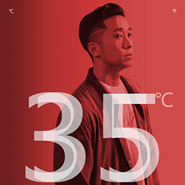
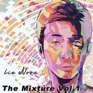

冰块先生
============================

|  |  |
| :--: | :-- |
| [ 冰块先生](https://i.xiami.com/brian) | **播放数**: 8815764 **粉丝数**: 6009 **评论数**: 279 **地区**: China 中国大陆 **风格**: 国语流行 Mandarin Pop, 爵士说唱 Jazz Rap, 流行说唱 Pop Rap, 抽象说唱 Abstract Hip Hop  |

## 档案

冰块先生，音乐制作人兼歌手，2003年17岁的他，音乐作品就已被京文唱片收录， 曾与纽约说唱歌手Novacane与黑人女歌手Twelve等一同创作演出;• 2015年，带着在纽约所创作的音乐专辑回国，并入围了当年的虾米音乐 “年度新人 / 年度华语嘻哈专辑”以及”阿比鹿“最受欢迎说唱唱片”; • 2016年，担任睿健时代等媒体的健康形象代表，入围虾米音乐年度最受 欢迎专辑 / 云音乐人气说唱单曲 / 登上echo回声音乐节;• 2015-2017年于平台发行单曲，半数以上得到”999+”以上 的评论数量;• 2017年，完成了全国6站巡演;• 2018年，发行了加盟索尼音乐的首张专辑《云层温度》，并完成了全国巡演。2019年登陆草莓音乐节与凤凰卫视春晚。2020年合作参与高晓松主办的疫情公益歌曲活动《爱从未离开》与相信未来在线义,并在12月发送了全新专辑《越界》

## 专辑

| 名称 | 语种 | 唱片公司 | 发行时间 | 专辑类别 | 专辑风格 |
| :--: | :-- | :-- | :-- | :-- | :-- |
| [ 越界](./albums/5022065358.md) | 国语 | StreetVoice, 影月文化 | 2020年12月01日 | 录音室专辑 | 国语流行 Mandarin Pop |
| [ 爱从未离开Love Never Left](./albums/2106043519.md) | 国语 | 索尼音乐娱乐 | 2020年02月15日 | EP, 单曲 |  |
| [ 幻想](./albums/2104095329.md) | 国语 | 索尼音乐娱乐 | 2018年09月28日 | EP, 单曲 | 国语流行 Mandarin Pop |
| [ 原本色彩](./albums/2104975913.md) | 英语 | Sony Music | 2018年09月14日 | EP, 单曲 |  |
| [ The End and the Beginning](./albums/2103464516.md) | 国语 | 独立发行 | 2017年12月27日 | EP, 单曲 | 嘻哈 Hip-Hop, 流行说唱 Pop Rap, 爵士嘻哈 Jazz Hip Hop |
| [ 暖冬](./albums/2102931474.md) | 国语 | 大象音乐 | 2017年11月15日 | EP, 单曲 |  |
| [ 上海1939](./albums/2102915676.md) | 国语 | 唐羽文化 | 2017年11月08日 | EP, 单曲 |  |
| [ 她的周六夜](./albums/2102856998.md) | 国语 | 独立发行 | 2017年09月14日 | EP, 单曲 |  |
| [ 凌晨4点4 A.M](./albums/2102853528.md) | 国语 | 独立发行 | 2017年09月08日 | 录音室专辑 | 嘻哈 Hip-Hop |
| [ 那些不能说的秘密与梦](./albums/2102742525.md) | 国语 | 独立发行 | 2017年05月04日 | EP, 单曲 | 嘻哈 Hip-Hop |
| [ 原本最幽默](./albums/2102691172.md) | 国语 | 独立发行 | 2017年02月09日 | EP, 单曲 | 爵士说唱 Jazz Rap |
| [ 公转定律](./albums/2102655301.md) | 国语 | 独立发行 | 2016年11月20日 | EP, 单曲 |  |
| [ 原本幽默Sad Story,Good Mind](./albums/2102403652.md) | 国语 |  | 2016年09月30日 | EP, 单曲 |  |
| [ 想见你](./albums/2100388314.md) | 国语 | 独立发行 | 2016年09月09日 | EP, 单曲 |  |
| [ 蜕变SHUT UP AND RUN](./albums/2100368863.md) | 国语 | 独立发行 | 2016年07月18日 | 录音室专辑 |  |
| [ 还无法忘记](./albums/2100366772.md) | 国语 | 独立发行 | 2016年07月13日 | EP, 单曲 |  |
| [ 混合体The Mixture](./albums/2100269638.md) | 国语 | Inyoxygene | 2016年02月04日 | 录音室专辑 |  |
| [ 纽约故事New York Story](./albums/1727739252.md) | 国语 | 独立发行 | 2015年04月01日 | 录音室专辑 | 流行说唱 Pop Rap |
| [ 丢失的磁带2007](./albums/1527278416.md) | 国语 | 独立发行 | 2015年03月25日 | EP, 单曲 | 东岸说唱 East Coast Hip Hop |
| [ 在雨里跳个舞Dancing in the rain](./albums/825920462.md) | 国语 | 独立发行 | 2015年03月10日 | EP, 单曲 | 爵士说唱 Jazz Rap, 流行说唱 Pop Rap |
| [ 让你赢（remix)let you win](./albums/920572281.md) | 国语 | 独立发行 | 2015年01月07日 | EP, 单曲 | 爵士说唱 Jazz Rap, 流行说唱 Pop Rap |
| [ 电脑On your pc](./albums/1020482454.md) | 国语 | 独立发行 | 2008年12月01日 | EP, 单曲 | 硬核说唱 Hardcore Hip Hop |

## 评论

|  |  |  |  |
| :-- | :-- | :-- | :-- |
|  [虾米用户](https://emumo.xiami.com/u/193075959) 。 2021-01-13 02:43 赞(0) 踩(0) | 
看到手机提示更新公告栏就想哭了 不管是冰块先生还是虾米都要加油啊 
 |
|  [虾米用户](https://emumo.xiami.com/u/358104299) 悲观的唯心存在现实解构虚... 2020-12-18 01:10 赞(1) 踩(0) | 
43246
 |
|  [虾米用户](https://emumo.xiami.com/u/299226398)  2020-06-17 20:45 赞(0) 踩(0) | 
好喜欢
 |
|  [虾米用户](https://emumo.xiami.com/u/196650790)   2019-07-05 09:58 赞(0) 踩(0) | 
挖到宝了 
 |
|  [虾米用户](https://emumo.xiami.com/u/47619989) 祝你运气很好 2018-12-11 23:34 赞(0) 踩(0) | 
希望你创作改编的时候能写上原著，并不是你改的唱的不好，而是原创也不容易。如果你有心，深圳演唱会是可以去的
 |
|  [虾米用户](https://emumo.xiami.com/u/121910914) 我想好好睡个觉 2018-11-16 09:33 赞(0) 踩(0) | 
❤️
 |
|  [虾米用户](https://emumo.xiami.com/u/1476458) 没有你是如水的生活 2018-11-15 21:16 赞(0) 踩(0) | 
喜欢喜欢喜欢
 |
|  [虾米用户](https://emumo.xiami.com/u/316813193) 我不喜欢你会飞 2018-11-13 07:44 赞(0) 踩(0) | 
最爱的清流
 |
|  [虾米用户](https://emumo.xiami.com/u/225048425) 直到把我埋进土里 2018-10-10 01:28 赞(1) 踩(0) | 
真的冰块 不一样的jazz风格 很喜欢
 |
|  [虾米用户](https://emumo.xiami.com/u/17146554) weibo：@L1RRO... 2018-08-19 18:39 赞(0) 踩(0) | 
补
 |
|  [虾米用户](https://emumo.xiami.com/u/11472475) 我还没想好要写什么... 2018-07-31 00:17 赞(0) 踩(0) | 
你才是真正的冰块先生，哈哈哈
 |
|  [虾米用户](https://emumo.xiami.com/u/301440150)  2018-04-25 13:49 赞(2) 踩(0) | 
钟意的好多歌他都有采样 
 |
|  [虾米用户](https://emumo.xiami.com/u/51545742)  2018-03-13 20:50 赞(0) 踩(0) | 
冰块先生教你说情话
 |
|  [虾米用户](https://emumo.xiami.com/u/316290646)  2018-03-08 12:21 赞(0) 踩(0) | 
真对自己的频道 好听 动听
 |
|  [虾米用户](https://emumo.xiami.com/u/142917010)  2018-03-01 01:10 赞(1) 踩(0) | 
今天才发现你，错过了昆明的演唱会，有点懊恼
 |
|  [虾米用户](https://emumo.xiami.com/u/212848793) 热带的悲伤少女 2018-02-03 19:26 赞(0) 踩(0) | 
ice k
 |
|  [虾米用户](https://emumo.xiami.com/u/313047493) 谁也抵不过时间，放不下想... 2018-01-21 08:30 赞(0) 踩(0) | 
羡慕可以听现场的人
 |
|  [虾米用户](https://emumo.xiami.com/u/48156160) 我还没想好要写什么... 2018-01-16 22:58 赞(0) 踩(0) | 
想去听你现场
 |
|  [虾米用户](https://emumo.xiami.com/u/52034644) 身体会跳舞 2018-01-01 10:15 赞(0) 踩(0) | 
好厉害的年轻人。
 |
|  [虾米用户](https://emumo.xiami.com/u/46758368)   2017-12-30 18:20 赞(0) 踩(0) | 
/
 |
|  [虾米用户](https://emumo.xiami.com/u/4466696)   2017-12-20 12:05 赞(0) 踩(0) | 
周六见
 |
|  [虾米用户](https://emumo.xiami.com/u/4707154) 唯有谢幕前尽力狂欢 2017-12-16 17:28 赞(0) 踩(0) | 
今晚昆明Mao见✌️
 |
|  [虾米用户](https://emumo.xiami.com/u/43710441) 清晨，被音乐唤醒 2017-12-01 18:33 赞(0) 踩(0) | 
12-9 从武汉去成都看你[带墨镜笑]
 |
|  [虾米用户](https://emumo.xiami.com/u/85928852) 穷极一生 追求快乐 2017-11-19 11:44 赞(0) 踩(0) | 
  
 |
|  [虾米用户](https://emumo.xiami.com/u/77526638) 您的SVIP还有一天就要... 2017-11-19 04:01 赞(0) 踩(0) | 
广州见
 |
|  [虾米用户](https://emumo.xiami.com/u/99586286) 歌单停滞在2017 2017-11-18 17:18 赞(0) 踩(0) | 
广州见
 |
|  [虾米用户](https://emumo.xiami.com/u/55804537) 到倒盗悼道 2017-11-17 18:37 赞(1) 踩(0) | 
十二月九号成都我根本回不去啊 呜呜呜
 |
|  [虾米用户](https://emumo.xiami.com/u/13111079) 有缘再见 2017-11-08 16:35 赞(1) 踩(0) | 
ෆ
 |
|  [虾米用户](https://emumo.xiami.com/u/8225159) 以前叫抖良 2017-10-28 15:44 赞(0) 踩(0) | 
。。。长得真的太像林依轮了。。。听着更像
 |
|  [虾米用户](https://emumo.xiami.com/u/70968462) 小情绪的瞎嘴王 2017-10-20 01:32 赞(0) 踩(0) | 
喜欢你
 |
|  [虾米用户](https://emumo.xiami.com/u/50869110) IG：77richiee... 2017-10-11 13:55 赞(0) 踩(0) | 
Chill
 |
|  [虾米用户](https://emumo.xiami.com/u/13603829) 喜欢就行 2017-09-23 13:08 赞(0) 踩(0) | 
+++
 |
|  [虾米用户](https://emumo.xiami.com/u/122253688) 震撼 2017-09-09 21:30 赞(1) 踩(0) | 
冰块先生可以说是非常成功的人了
 |
|  [虾米用户](https://emumo.xiami.com/u/33259660) 因上努力，果上随缘～ 2017-09-03 09:43 赞(0) 踩(0) | 
R&amp;amp;amp;b
 |
|  [虾米用户](https://emumo.xiami.com/u/79731678) 孙小乐 2017-08-31 09:19 赞(1) 踩(0) | 
这是一条表白评论
 |
|  [虾米用户](https://emumo.xiami.com/u/1133773) 我还没想好要写什么... 2017-08-28 22:36 赞(0) 踩(0) | 
本来对说唱不感冒，但是加上这爵士。也是醉醉的美嘿！！！大爱 
 |
|  [虾米用户](https://emumo.xiami.com/u/321810500) 你算什么 2017-08-28 09:12 赞(0) 踩(0) | 
超喜欢飞行外套  
 |
|  [虾米用户](https://emumo.xiami.com/u/47255516)   2017-08-09 02:23 赞(1) 踩(0) | 
出歌出歌 不够听了
 |
|  [虾米用户](https://emumo.xiami.com/u/241464355) 我还没想好要写什么... 2017-08-02 12:59 赞(1) 踩(0) | 
六级床震报道
 |
|  [虾米用户](https://emumo.xiami.com/u/49748006) Fly me to th... 2017-07-18 23:00 赞(0) 踩(0) | 
ッ
 |
|  [虾米用户](https://emumo.xiami.com/u/44509935) 我还没想好要写什么... 2017-07-18 08:34 赞(0) 踩(0) | 
真是受不了合唱版let you win&amp;hellip; 超难听
 |
|  [虾米用户](https://emumo.xiami.com/u/35797387) Ftw 2017-06-16 04:31 赞(0) 踩(0) | 
Kero One yall
 |
|  [虾米用户](https://emumo.xiami.com/u/282248842)  2017-05-27 20:22 赞(0) 踩(0) | 
感觉我好像见过你，在哪里？
 |
|  [虾米用户](https://emumo.xiami.com/u/1418202)  江山共老 2017-05-08 18:14 赞(0) 踩(0) | 
好玩
 |
|  [虾米用户](https://emumo.xiami.com/u/291711346)  2017-04-27 02:26 赞(0) 踩(0) | 
好听
 |
|  [虾米用户](https://emumo.xiami.com/u/3572878)  2017-04-16 17:41 赞(0) 踩(0) | 
还不错
 |
|  [虾米用户](https://emumo.xiami.com/u/282451253)  2017-03-22 16:44 赞(0) 踩(0) | 
Q
 |
|  [虾米用户](https://emumo.xiami.com/u/169060756)  2017-03-07 23:22 赞(0) 踩(0) | 
好稀饭 
 |
|  [虾米用户](https://emumo.xiami.com/u/118835234) 你好 2017-03-05 14:30 赞(0) 踩(0) | 
扎心
 |
|  [虾米用户](https://emumo.xiami.com/u/47989634) 地藏王1220 2017-03-05 11:58 赞(0) 踩(0) | 
喜欢
 |
|  [虾米用户](https://emumo.xiami.com/u/51667934) Honjok 2017-02-19 05:18 赞(1) 踩(0) | 
求原本最幽默里的女声 
 |
|  [虾米用户](https://emumo.xiami.com/u/23537273) 祝你愉快 2017-02-12 00:14 赞(0) 踩(0) | 

 |
|  [虾米用户](https://emumo.xiami.com/u/18250060)  2017-02-10 17:42 赞(0) 踩(0) | 
歌词用心
 |
|  [虾米用户](https://emumo.xiami.com/u/1115247) @Nebula_7293 2017-02-09 20:20 赞(0) 踩(0) | 
√
 |
|  [虾米用户](https://emumo.xiami.com/u/267044053) 虾米刷粉 2017-01-24 12:57 赞(0) 踩(0) | 
,./,./,.
 |
|  [虾米用户](https://emumo.xiami.com/u/68579740) 虾米云音乐 2017-01-18 18:37 赞(0) 踩(0) | 
爱你啊啊啊啊❤❤❤
 |
|  [虾米用户](https://emumo.xiami.com/u/85928852) 穷极一生 追求快乐 2017-01-13 23:24 赞(0) 踩(0) | 
No One But You 
 |
|  [虾米用户](https://emumo.xiami.com/u/40085852) Meow～ 2016-12-31 12:43 赞(2) 踩(0) | 
听到ice先生remix的let you win，一秒爱上，尤其那句先生的I see u again
 |
|  [虾米用户](https://emumo.xiami.com/u/91132580)  2016-12-21 16:18 赞(0) 踩(0) | 
超级喜欢
 |
|  [虾米用户](https://emumo.xiami.com/u/56435679)       Sun & ... 2016-11-23 20:23 赞(0) 踩(0) | 
大爱～ice。
 |
|  [虾米用户](https://emumo.xiami.com/u/9489670) 死了 2016-11-21 10:18 赞(0) 踩(0) | 
ʕ•ٹ•ʔ
 |
|  [虾米用户](https://emumo.xiami.com/u/105418490) 我还没想好要写什么... 2016-11-04 14:04 赞(0) 踩(0) | 
感觉和冰块先生似曾相识 特别想过成这样的人生
 |
|  [虾米用户](https://emumo.xiami.com/u/220124160) 武 藏 野SARU 20... 2016-10-04 10:43 赞(0) 踩(0) | 
声音太苏
 |
|  [虾米用户](https://emumo.xiami.com/u/222595531)   2016-10-01 16:57 赞(0) 踩(0) | 
666
 |
|  [虾米用户](https://emumo.xiami.com/u/45298985) Wechat:dqx19... 2016-10-01 10:11 赞(0) 踩(0) | 
+
 |
|  [虾米用户](https://emumo.xiami.com/u/38674805) BAT 2016-10-01 00:44 赞(0) 踩(0) | 
赞
 |
|  [虾米用户](https://emumo.xiami.com/u/211621569)  2016-09-28 19:45 赞(0) 踩(0) | 
爱冰块先生
 |
|  [虾米用户](https://emumo.xiami.com/u/212922807) ᴄᴏᴏʟ ᴀs ɪᴄᴇ ... 2016-09-27 20:28 赞(1) 踩(0) | 
么么哒 
 |
|  [虾米用户](https://emumo.xiami.com/u/88143972) Savage lady.... 2016-09-21 00:35 赞(1) 踩(0) | 
太舒服
 |
|  [虾米用户](https://emumo.xiami.com/u/12742496) So tell me h... 2016-09-09 22:33 赞(0) 踩(0) | 
想嫁给冰块
 |
|  [虾米用户](https://emumo.xiami.com/u/73857918) 在黎明之前 2016-09-04 16:41 赞(0) 踩(0) | 
相册第17张有点像邓超
 |
|  [虾米用户](https://emumo.xiami.com/u/53539296) よろしくね＾＾ 2016-08-15 17:29 赞(0) 踩(0) | 
在最寒冷的夏天 做最后的挣扎
 |
|  [虾米用户](https://emumo.xiami.com/u/40140506)   2016-08-05 00:50 赞(0) 踩(0) | 
冰冰
 |
|  [虾米用户](https://emumo.xiami.com/u/33066699)   2016-07-29 21:27 赞(0) 踩(0) | 
每个胖纸都是一个潜力股
 |
|  [虾米用户](https://emumo.xiami.com/u/67987990) 四块钱的小饼干喜欢你们 2016-07-27 15:09 赞(0) 踩(0) | 
冰块 
 |
|  [虾米用户](https://emumo.xiami.com/u/2719500) Bon Appetit. 2016-07-19 02:32 赞(0) 踩(0) | 

 |
|  [虾米用户](https://emumo.xiami.com/u/97747450) 我还没想好要写什么... 2016-07-05 00:20 赞(0) 踩(0) | 
1769
 |
|  [虾米用户](https://emumo.xiami.com/u/170191584) Pay 4 love 2016-07-04 02:36 赞(0) 踩(0) | 
太棒了
 |
|  [虾米用户](https://emumo.xiami.com/u/122380572) 我还没想好要写什么... 2016-06-24 17:02 赞(0) 踩(0) | 
英文部分听得内心都醉了
 |
|  [虾米用户](https://emumo.xiami.com/u/122380572) 我还没想好要写什么... 2016-06-24 17:01 赞(0) 踩(0) | 
喜欢得不得了
 |
|  [虾米用户](https://emumo.xiami.com/u/45298985) Wechat:dqx19... 2016-06-24 10:06 赞(0) 踩(0) | 
+
 |
|  [虾米用户](https://emumo.xiami.com/u/13154723) 脾气不太好 2016-06-22 22:56 赞(0) 踩(0) | 
⚙
 |
|  [虾米用户](https://emumo.xiami.com/u/13697681) 爱屋及乌 2016-06-21 21:42 赞(0) 踩(0) | 
女声咬字像阿肆
 |
|  [虾米用户](https://emumo.xiami.com/u/50642130) 很软 2016-05-30 00:28 赞(0) 踩(0) | 
嘻嘻
 |
|  [虾米用户](https://emumo.xiami.com/u/51756141)  2016-05-21 12:07 赞(0) 踩(0) | 
∞
 |
|  [虾米用户](https://emumo.xiami.com/u/109931046)  2016-05-20 20:10 赞(0) 踩(0) | 
冰块蜀黍好帅
 |
|  [虾米用户](https://emumo.xiami.com/u/40029564) 努力成为一个更好的人。 2016-05-20 15:01 赞(0) 踩(0) | 
冰块先生的歌好好听，收藏的歌曲也很赞，真和我的风格。
 |
|  [虾米用户](https://emumo.xiami.com/u/52127742) 呼。啦啦啦，啦啦啦， 2016-05-13 02:30 赞(1) 踩(0) | 
，
 |
|  [虾米用户](https://emumo.xiami.com/u/24037392) 我还没想好要写什么... 2016-05-09 00:17 赞(1) 踩(0) | 
棒
 |
|  [虾米用户](https://emumo.xiami.com/u/44003760) 聪明伶俐快高长大 2016-05-04 19:41 赞(1) 踩(0) | 
帅
 |
|  [虾米用户](https://emumo.xiami.com/u/118751910) ME 2016-05-04 09:26 赞(2) 踩(0) | 
很治愈
 |
|  [虾米用户](https://emumo.xiami.com/u/35687506)  2016-04-27 23:46 赞(1) 踩(0) | 
声音蛮胖的
 |
|  [虾米用户](https://emumo.xiami.com/u/138693994) 我...... 2016-04-26 21:51 赞(2) 踩(0) | 
听你的声音真的会感到温暖
 |
|  [虾米用户](https://emumo.xiami.com/u/43756932)  2016-04-23 16:09 赞(1) 踩(0) | 
下午好
 |
|  [虾米用户](https://emumo.xiami.com/u/7989473) Ground Contr... 2016-04-10 13:25 赞(1) 踩(0) | 
看了FitTime的推送，过来表白冰块先生✖‿✖
 |
|  [虾米用户](https://emumo.xiami.com/u/3268829) look sharp l... 2016-04-08 14:11 赞(1) 踩(0) | 
可以听多了阴三，感觉这冰块太没劲
 |
|  [虾米用户](https://emumo.xiami.com/u/55538100) ️ 2016-04-06 22:24 赞(0) 踩(0) | 
其实我就想给自己一个交代
 |
|  [虾米用户](https://emumo.xiami.com/u/2667796)   2016-04-05 15:27 赞(0) 踩(0) | 
好好创作就好了 干嘛还要整个温暖说……索性做网红直播好了
 |
|  [虾米用户](https://emumo.xiami.com/u/110701414) lovely girl ... 2016-04-02 13:42 赞(0) 踩(0) | 
好帅
 |
|  [虾米用户](https://emumo.xiami.com/u/1208315)   2016-03-18 08:01 赞(0) 踩(0) | 
@冰块先生 我想问下 丢失的磁带mix 第二段 是lu1的吗？什么歌
 |
|  [虾米用户](https://emumo.xiami.com/u/50555903) 我永失你爱，却有人高歌。 2016-03-13 18:44 赞(0) 踩(0) | 
好帅好帅！
 |
|  [虾米用户](https://emumo.xiami.com/u/7390483)   2016-03-13 17:14 赞(0) 踩(0) | 
喜欢冰块的嗓音...
 |
|  [虾米用户](https://emumo.xiami.com/u/118496874)   2016-03-10 17:09 赞(0) 踩(0) | 
欢迎加入虾米音乐人，群号码：245563426
 |
|  [虾米用户](https://emumo.xiami.com/u/39394031) 他是个饶舌歌手 2016-03-04 00:11 赞(2) 踩(0) | 
跟蛋堡有点像，慵懒的爵士HIPHOP、R&amp;amp;B、布鲁斯、pop缺了一点点FUNK。。。
 |
|  [虾米用户](https://emumo.xiami.com/u/39394031) 他是个饶舌歌手 2016-03-04 00:00 赞(0) 踩(0) | 
什么都很好 就是少了点FUNK。
 |
|  [虾米用户](https://emumo.xiami.com/u/118014284)   2016-02-27 18:55 赞(0) 踩(0) | 
虾米音乐人交流群 245563426 我们都在群里等你！
 |
|  [虾米用户](https://emumo.xiami.com/u/49001447)   2016-02-15 22:59 赞(0) 踩(0) | 
´͈ ᵕ `͈
 |
|  [虾米用户](https://emumo.xiami.com/u/29230195) Gubba nub nu... 2016-02-15 19:31 赞(0) 踩(0) | 
~
 |
|  [虾米用户](https://emumo.xiami.com/u/47372028) 期待更多 2016-02-14 23:49 赞(0) 踩(0) | 
每首都炒鸡好听！好喜欢！ 
 |
|  [虾米用户](https://emumo.xiami.com/u/1718509)  2016-02-13 14:13 赞(0) 踩(0) | 
听了不到一分钟就要点右上角的X了。
 |
| ⇒ |  [虾米用户](https://emumo.xiami.com/u/39394031) 他是个饶舌歌手 2016-03-04 00:07 赞(0) 踩(0) | 
给别人多几分钟，也许你会发现你想要的。。不要轻易的拒绝
 |
|  [虾米用户](https://emumo.xiami.com/u/9077266)  2016-02-07 12:14 赞(0) 踩(0) | 
你的中文名叫什么呢
 |
|  [虾米用户](https://emumo.xiami.com/u/32141588) ！！！ 2016-02-06 12:32 赞(0) 踩(0) | 
突然发现，很喜欢的感觉。
 |
|  [虾米用户](https://emumo.xiami.com/u/292888)  2016-02-05 15:17 赞(3) 踩(0) | 
幸好是先生，不是先森。
 |
|  [虾米用户](https://emumo.xiami.com/u/25985044)  2016-02-05 12:55 赞(0) 踩(0) | 
炒鸡炒鸡喜欢啊！！
 |
|  [虾米用户](https://emumo.xiami.com/u/6002883)  2016-02-05 07:57 赞(1) 踩(0) | 
第一次让我感觉到嘻哈音乐不浮躁，而是清新～
 |
|  [虾米用户](https://emumo.xiami.com/u/17684889)   2016-02-04 22:56 赞(0) 踩(0) | 
喜欢你好久好久，始终不变
 |
|  [虾米用户](https://emumo.xiami.com/u/50869110) IG：77richiee... 2016-02-04 20:24 赞(1) 踩(0) | 
Loveuuuuuuuu
 |
|  [虾米用户](https://emumo.xiami.com/u/70808970)  2016-02-04 16:55 赞(0) 踩(0) | 
等你新歌
 |
|  [虾米用户](https://emumo.xiami.com/u/45621221) 卸载状态。 2016-02-04 15:15 赞(0) 踩(0) | 
帅！
 |
|  [虾米用户](https://emumo.xiami.com/u/47736446) 上传了最后一首 2016-02-03 13:55 赞(1) 踩(0) | 
期待专辑！！！
 |
|  [虾米用户](https://emumo.xiami.com/u/52692216)  2016-01-31 14:55 赞(1) 踩(0) | 
风格很优雅
 |
|  [虾米用户](https://emumo.xiami.com/u/52581600) 艺名：Az 2016-01-22 17:05 赞(0) 踩(0) | 
很好，很喜欢
 |
|  [虾米用户](https://emumo.xiami.com/u/33066699)   2016-01-21 22:27 赞(2) 踩(0) | 
每首歌都那么好听 中毒ing 
 |
|  [虾米用户](https://emumo.xiami.com/u/6098035)  2016-01-13 10:56 赞(0) 踩(0) | 
；）
 |
|  [虾米用户](https://emumo.xiami.com/u/98524894) 每个人的心灵深处都有着只... 2016-01-09 01:34 赞(0) 踩(0) | 
喜欢曲风和声音。感觉很好，很温柔
 |
|  [虾米用户](https://emumo.xiami.com/u/50869110) IG：77richiee... 2016-01-08 09:37 赞(0) 踩(0) | 
混合体呢 
 |
|  [虾米用户](https://emumo.xiami.com/u/94571150) 种下梧桐 等候凤凰 2015-12-25 23:19 赞(1) 踩(0) | 
这声音听着好舒服
 |
|  [虾米用户](https://emumo.xiami.com/u/49914832) 威士忌二锅头 2015-12-23 22:00 赞(0) 踩(0) | 
喜欢
 |
|  [虾米用户](https://emumo.xiami.com/u/4998436) 人总是选择性忘记痛苦 2015-12-15 11:23 赞(0) 踩(0) | 
❤
 |
|  [虾米用户](https://emumo.xiami.com/u/50345864) 嘻嘻 2015-12-10 15:51 赞(1) 踩(0) | 
这人物背景介绍有点6啊
 |
|  [虾米用户](https://emumo.xiami.com/u/4201061)   2015-12-08 21:27 赞(2) 踩(0) | 
连续听了好几首，声音挺好听的，旋律和歌词都不错，但beat和节奏过于单一，希望能创作更多更好的音乐，毕竟国内现在专心做hiphop的人还是太少了，加油 
 |
|  [虾米用户](https://emumo.xiami.com/u/20483027)  2015-12-07 11:27 赞(0) 踩(0) | 
Just like it.
 |
|  [虾米用户](https://emumo.xiami.com/u/55196306)  2015-12-03 23:10 赞(0) 踩(0) | 
喜欢这个风格 
 |
|  [虾米用户](https://emumo.xiami.com/u/5058931)  2015-11-24 17:15 赞(0) 踩(0) | 
要上海啦~~
 |
|  [虾米用户](https://emumo.xiami.com/u/43710441) 清晨，被音乐唤醒 2015-11-24 08:52 赞(1) 踩(0) | 
为什么艺人公告总是看不到完整信息
 |
| ⇒ |  [虾米用户](https://emumo.xiami.com/u/55196306)  2015-12-03 23:10 赞(0) 踩(0) | 
我也看不到完整
 |
|  [虾米用户](https://emumo.xiami.com/u/2667796)   2015-11-17 22:15 赞(0) 踩(0) | 
“想把你抱紧”的beats简直让人难忘。
 |
|  [虾米用户](https://emumo.xiami.com/u/50869110) IG：77richiee... 2015-11-14 21:05 赞(0) 踩(0) | 
=)
 |
|  [虾米用户](https://emumo.xiami.com/u/12230374) Pinkfloydzh，... 2015-11-04 17:57 赞(0) 踩(0) | 
和蛋堡太像了。。。
 |
|  [虾米用户](https://emumo.xiami.com/u/45611067) 請叫我紅領巾！ 2015-10-22 22:08 赞(0) 踩(0) | 
爱死你   
 |
|  [虾米用户](https://emumo.xiami.com/u/10437744) 我还没想好要写什么..b... 2015-10-20 13:55 赞(0) 踩(0) | 
昂 耶
 |
|  [虾米用户](https://emumo.xiami.com/u/44784434) 变得和我一样库 2015-10-10 10:57 赞(0) 踩(0) | 
哇
 |
|  [虾米用户](https://emumo.xiami.com/u/50358782) 支持原创，支持糖糖 2015-10-09 23:23 赞(0) 踩(0) | 
不错
 |
|  [虾米用户](https://emumo.xiami.com/u/69813854)  2015-10-06 23:45 赞(1) 踩(0) | 
感觉和lu1像 但是beat部分弱啊
 |
| ⇒ |  [虾米用户](https://emumo.xiami.com/u/12742496) So tell me h... 2016-02-10 05:03 赞(0) 踩(0) | 
可是冰块声线更酥
 |
|  [虾米用户](https://emumo.xiami.com/u/30852950)  2015-09-23 16:20 赞(0) 踩(0) | 
You make good music Ice Nova!!! Keep going  
 |
|  [虾米用户](https://emumo.xiami.com/u/37840483) 再說吧 2015-09-20 13:05 赞(0) 踩(0) | 
真他妈喜欢…
 |
|  [虾米用户](https://emumo.xiami.com/u/6779127) 还好吧 2015-09-16 22:04 赞(0) 踩(0) | 
等你新专
 |
|  [虾米用户](https://emumo.xiami.com/u/45684180) 单身狗 2015-09-10 23:50 赞(1) 踩(0) | 
这声音听起来真舒服，这就是那种典型不能在工作时听的歌，因为听着听着就忘了工作
 |
|  [虾米用户](https://emumo.xiami.com/u/9806134)  2015-09-07 11:04 赞(0) 踩(0) | 
｡･ω･
 |
|  [虾米用户](https://emumo.xiami.com/u/37840483) 再說吧 2015-09-06 19:59 赞(1) 踩(0) | 
嗯呢
 |
|  [虾米用户](https://emumo.xiami.com/u/57999130) 周围环境隔离着喷子与刷存... 2015-08-26 15:35 赞(1) 踩(0) | 
还可以
 |
|  [虾米用户](https://emumo.xiami.com/u/6117817)  2015-08-22 01:59 赞(0) 踩(0) | 
《飞行外套》真好听
 |
|  [虾米用户](https://emumo.xiami.com/u/51610072) f@ck 5 cents... 2015-08-21 15:54 赞(0) 踩(0) | 
到处刷评论很有意思？
 |
|  [虾米用户](https://emumo.xiami.com/u/9404829)  2015-08-18 14:07 赞(1) 踩(0) | 
好听，
 |
|  [虾米用户](https://emumo.xiami.com/u/170751) 睡不醒 2015-07-21 10:00 赞(0) 踩(0) | 
Mind Trick - Jamie Cullum
 |
|  [虾米用户](https://emumo.xiami.com/u/36208991)   2015-07-14 02:12 赞(4) 踩(0) | 
声音好棒 B也好棒 听了些你的歌真的好喜欢 喜欢Jazzhipa 这种调调总会让人很舒胡很chilln 期待你新作品呀 对不起来晚了呜呜( •̥́ ˍ •̀ू )
 |
|  [虾米用户](https://emumo.xiami.com/u/2226860) ✨ 2015-07-12 23:10 赞(1) 踩(0) | 
你声音风格和以前那个MC蠢人好像。
 |
| ⇒ |  [虾米用户](https://emumo.xiami.com/u/55196306)  2015-12-03 23:11 赞(0) 踩(0) | 
他就是那个mc蠢人
 |
| ⇒ |  [虾米用户](https://emumo.xiami.com/u/2226860) ✨ 2015-12-03 23:33 赞(0) 踩(0) | 
<q><b>张笑恒说：</b></q>
 |
|  [虾米用户](https://emumo.xiami.com/u/38743446) 我还没想好要写什么... 2015-07-09 11:10 赞(1) 踩(0) | 
声音完全理想型
 |
|  [虾米用户](https://emumo.xiami.com/u/47372028) 期待更多 2015-07-06 16:04 赞(1) 踩(0) | 
重复循环(想把你抱紧)，期待新歌！up up up!加油，会一直支持你
 |
|  [虾米用户](https://emumo.xiami.com/u/6117817)  2015-06-02 15:34 赞(1) 踩(0) | 
什么时候发新歌阿！好期待！快来个演出什么的吧！
 |
|  [虾米用户](https://emumo.xiami.com/u/43354035)  2015-06-02 01:13 赞(4) 踩(0) | 
不要脸的冰块先生，整天去别人的评论里说什么人家曲风又和你很像，还是你的好一些，这样子刷自己有意思吗？
 |
| ⇒ |  [虾米用户](https://emumo.xiami.com/u/47372028) 期待更多 2015-07-06 16:21 赞(0) 踩(0) | 
可能是我们这样的粉丝发的吧，音乐只是用来听或喜欢的，你也太认真了吧，哈哈
 |
|  [虾米用户](https://emumo.xiami.com/u/87398) 藏不住的是你最珍贵的倔强 2015-05-26 16:08 赞(3) 踩(0) | 
声音太好听了。
 |
|  [虾米用户](https://emumo.xiami.com/u/65336)  2015-05-13 00:18 赞(0) 踩(0) | 
神秘女嘉宾是阿肆吧 
 |
| ⇒ |  [虾米用户](https://emumo.xiami.com/u/6117817)  2015-06-02 15:34 赞(0) 踩(0) | 
感觉肯定是阿！
 |
|  [虾米用户](https://emumo.xiami.com/u/38457675) 听，心所向。 2015-05-12 23:29 赞(2) 踩(0) | 
每一组和弦的重复。一直一直一直都听不腻。 
 |
|  [虾米用户](https://emumo.xiami.com/u/38457675) 听，心所向。 2015-05-12 23:28 赞(1) 踩(0) | 
你的歌循环整夜整夜…♻️♻️♻️♻️♻️
 |
|  [虾米用户](https://emumo.xiami.com/u/44557366) A1 2015-04-28 08:10 赞(0) 踩(0) | 
Let you win Instrumental taken ;)
 |
|  [虾米用户](https://emumo.xiami.com/u/2870774) 这地球已经不能待了。 2015-04-22 13:29 赞(1) 踩(0) | 
帅呆
 |
|  [虾米用户](https://emumo.xiami.com/u/7252584) 新的梦想 2015-04-13 19:46 赞(1) 踩(0) | 
其实真的不错啦，各人爱好，为什么会被吐槽呢？正能量的小子，再来赞下。
 |
| ⇒ |  [虾米用户](https://emumo.xiami.com/u/1384976) 永远年轻，永远热泪盈眶… 2015-04-21 15:09 赞(0) 踩(0) | 
因为太帅了
 |
| ⇒ |  [虾米用户](https://emumo.xiami.com/u/7252584) 新的梦想 2015-04-23 02:28 赞(0) 踩(0) | 
<q><b>Jeff.H说：</b></q>
 |
|  [虾米用户](https://emumo.xiami.com/u/49095263) 把谎话说给耳朵然后让眼睛... 2015-04-11 21:13 赞(0) 踩(0) | 
出发。
 |
| ⇒ |  [虾米用户](https://emumo.xiami.com/u/1384976) 永远年轻，永远热泪盈眶… 2015-04-16 14:10 赞(0) 踩(0) | 
好喜欢你的头像图片，能发给我吗！！
 |
| ⇒ |  [虾米用户](https://emumo.xiami.com/u/49095263) 把谎话说给耳朵然后让眼睛... 2015-04-16 23:00 赞(0) 踩(0) | 
<q><b>Jeff.H说：</b></q>
 |
|  [虾米用户](https://emumo.xiami.com/u/1786672)  2015-04-09 17:12 赞(0) 踩(0) | 
酣畅淋漓的舒爽
 |
|  [虾米用户](https://emumo.xiami.com/u/11870332) talk is chea... 2015-04-09 15:17 赞(0) 踩(0) | 
蛋堡兄弟
 |
|  [虾米用户](https://emumo.xiami.com/u/41340854) 快乐女孩 2015-04-08 10:01 赞(1) 踩(0) | 
要冰块微信
 |
|  [虾米用户](https://emumo.xiami.com/u/11670854) 平常心 2015-04-05 10:15 赞(1) 踩(0) | 
太棒了！
 |
|  [虾米用户](https://emumo.xiami.com/u/43092402) 暂无签名~ 2015-04-04 15:47 赞(3) 踩(0) | 
哈哈，这些评论，真是醉了，能不能再假点咯
 |
|  [虾米用户](https://emumo.xiami.com/u/369150) ♥︎stay hunge... 2015-04-03 10:40 赞(1) 踩(0) | 
台湾？
 |
|  [虾米用户](https://emumo.xiami.com/u/2226860) ✨ 2015-04-02 22:35 赞(6) 踩(0) | 
神秘女嘉宾是阿肆吧！
 |
|  [虾米用户](https://emumo.xiami.com/u/44013790)  2015-04-02 02:49 赞(1) 踩(0) | 
声音太像我朋友了，看了封面照片才确定不是
 |
|  [虾米用户](https://emumo.xiami.com/u/37322876) 口味杂到不行的小婊砸 2015-03-30 23:30 赞(2) 踩(0) | 
这声线  冰块先生我来摸摸你喉结
 |
|  [虾米用户](https://emumo.xiami.com/u/43250065) 我能想到最好的未来就是身... 2015-03-28 11:28 赞(1) 踩(0) | 
声音是喜欢的类型
 |
|  [虾米用户](https://emumo.xiami.com/u/43250065) 我能想到最好的未来就是身... 2015-03-28 11:28 赞(0) 踩(0) | 
会想到lu1
 |
| ⇒ |  [虾米用户](https://emumo.xiami.com/u/3202148) 牵着你的手，一阵莫名感动 2015-08-25 13:56 赞(0) 踩(0) | 
感觉lu1更好些
 |
|  [虾米用户](https://emumo.xiami.com/u/23703643) 热爱爵士蓝调的萨克斯学徒 2015-03-20 02:33 赞(1) 踩(0) | 
我的非常非常喜欢这种清新爵士做背景的饶舌，你们很棒。
 |
|  [虾米用户](https://emumo.xiami.com/u/7051141)   2015-03-17 09:16 赞(1) 踩(0) | 
想把你抱紧~~~balalalala~~~
 |
|  [虾米用户](https://emumo.xiami.com/u/8582967)   2015-03-15 16:26 赞(1) 踩(0) | 
100个赞~冰块儿君请继续加油(╯3╰)
 |
| ⇒ |  [虾米用户](https://emumo.xiami.com/u/4994826) 回国后第一首创作的歌曲就... 2015-03-16 00:28 赞(0) 踩(0) | 
感谢支持
 |
|  [虾米用户](https://emumo.xiami.com/u/39556280) o 2015-03-15 10:28 赞(2) 踩(0) | 
why dont you do English rap？
 |
| ⇒ |  [虾米用户](https://emumo.xiami.com/u/4994826) 回国后第一首创作的歌曲就... 2015-03-16 00:28 赞(0) 踩(0) | 
I am Chinese
 |
| ⇒ |  [虾米用户](https://emumo.xiami.com/u/27490798) 我还没想好要写什么... 2015-03-16 12:37 赞(0) 踩(0) | 
<q><b>冰块先生说：</b></q>
 |
| ⇒ |  [虾米用户](https://emumo.xiami.com/u/27490798) 我还没想好要写什么... 2015-03-17 11:04 赞(0) 踩(0) | 
<q><b>说：</b></q>
 |
|  [虾米用户](https://emumo.xiami.com/u/47855331)  2015-03-12 23:27 赞(1) 踩(0) | 
很触动内个人的内心~~很好听
 |
|  [虾米用户](https://emumo.xiami.com/u/47855331)  2015-03-12 23:27 赞(1) 踩(0) | 
很触动每个人的内心~~很好听~~~
 |
|  [虾米用户](https://emumo.xiami.com/u/11035851) 相遇相识相爱，拍拖同居养... 2015-03-11 09:28 赞(1) 踩(0) | 
加油哈！声音很好听，风格也喜欢
 |
|  [虾米用户](https://emumo.xiami.com/u/30994740) 当Coldplay已成往... 2015-03-10 22:50 赞(1) 踩(0) | 
想把你抱紧
 |
|  [虾米用户](https://emumo.xiami.com/u/47932116)  2015-03-08 21:00 赞(1) 踩(0) | 
好歌
 |
|  [虾米用户](https://emumo.xiami.com/u/3519170) 一直在寻找 2015-03-06 09:09 赞(3) 踩(0) | 
酷~  从此关注一下这个音乐人~
 |
|  [虾米用户](https://emumo.xiami.com/u/38428739)  2015-03-05 13:57 赞(0) 踩(0) | 
很喜欢这首歌，international
 |
|  [虾米用户](https://emumo.xiami.com/u/38428739)  2015-03-05 13:57 赞(0) 踩(0) | 
很好听，收藏了。
 |
|  [虾米用户](https://emumo.xiami.com/u/963639) l.love.you 2015-03-05 11:14 赞(0) 踩(0) | 
加油
 |
|  [虾米用户](https://emumo.xiami.com/u/36917973) love makes m... 2015-03-05 09:59 赞(2) 踩(0) | 
很奇怪，《想把你抱紧》这首歌，第一次听觉得很奇怪但声音很吸引我，第二次听觉得节奏很对FEEL，第三次听着听着微笑了，喜欢上这首歌了。
 |
| ⇒ |  [虾米用户](https://emumo.xiami.com/u/4994826) 回国后第一首创作的歌曲就... 2015-03-16 00:28 赞(0) 踩(0) | 
希望你一切顺利
 |
| ⇒ |  [虾米用户](https://emumo.xiami.com/u/36917973) love makes m... 2015-03-16 03:03 赞(0) 踩(0) | 
<q><b>冰块先生说：</b></q>
 |
|  [虾米用户](https://emumo.xiami.com/u/47820953)  2015-03-04 15:37 赞(3) 踩(0) | 
很好听
 |
|  [虾米用户](https://emumo.xiami.com/u/7252584) 新的梦想 2015-03-03 23:46 赞(1) 踩(0) | 
无意中看到有人分享，《想把你抱紧》歌名引起了我的兴趣，第一次被说唱差点弄哭，什么样的人能唱出这样的句子。
 |
| ⇒ |  [虾米用户](https://emumo.xiami.com/u/4994826) 回国后第一首创作的歌曲就... 2015-03-04 00:04 赞(0) 踩(0) | 
那个想要抱紧的人，也许是她，也许是我们自己；当岁月和时间的伤疤渐渐的在身上留下印记，那些过去的快乐与时光好希望能够抱紧它。谢谢你喜欢。
 |
| ⇒ |  [虾米用户](https://emumo.xiami.com/u/7252584) 新的梦想 2015-03-04 00:09 赞(0) 踩(0) | 
<q><b>冰块先生说：</b></q>
 |
| ⇒ |  [虾米用户](https://emumo.xiami.com/u/4994826) 回国后第一首创作的歌曲就... 2015-03-16 00:29 赞(0) 踩(0) | 
<q><b>弦小君说：</b></q>
 |
|  [虾米用户](https://emumo.xiami.com/u/26912337)  2015-03-03 21:47 赞(1) 踩(0) | 
听着很好听
 |
|  [虾米用户](https://emumo.xiami.com/u/27490798) 我还没想好要写什么... 2015-02-27 12:08 赞(1) 踩(0) | 
棒
 |
|  [虾米用户](https://emumo.xiami.com/u/30155409) 这家伙很傻什么都留下了… 2015-02-22 01:24 赞(1) 踩(0) | 
不错
 |
|  [虾米用户](https://emumo.xiami.com/u/4058296)  2015-02-19 05:18 赞(1) 踩(0) | 
咋办！完全能抓住歌词的点！那一个个的点！
 |
| ⇒ |  [虾米用户](https://emumo.xiami.com/u/4994826) 回国后第一首创作的歌曲就... 2015-03-16 00:30 赞(0) 踩(0) | 
那些都是人生经历吧
 |
|  [虾米用户](https://emumo.xiami.com/u/47429604)  2015-02-19 01:32 赞(0) 踩(0) | 
声音太好听了。。。毫无抵抗力。。。超级好听！！！
 |
|  [虾米用户](https://emumo.xiami.com/u/8785260)  2015-02-18 22:58 赞(0) 踩(0) | 
求crystal的微博~简介资料什么的也好
 |
| ⇒ |  [虾米用户](https://emumo.xiami.com/u/4994826) 回国后第一首创作的歌曲就... 2015-03-16 00:30 赞(0) 踩(0) | 
我催她多写点歌！
 |
|  [虾米用户](https://emumo.xiami.com/u/47372134)  2015-02-17 02:00 赞(1) 踩(0) | 
求伴奏
 |
|  [虾米用户](https://emumo.xiami.com/u/47253630)  2015-02-17 01:51 赞(3) 踩(0) | 
想把你抱紧的歌词写的特别棒，第一回听到能够像这样打动人心的说唱嘻哈歌曲音乐人，希望能够有更多类似 《想把你抱紧》 这种类型的歌，特别喜欢。！走心！
 |
|  [虾米用户](https://emumo.xiami.com/u/47372229)  2015-02-17 01:30 赞(7) 踩(0) | 
嘻哈公园的冠军歌曲，终于在虾米上找到了，期待心歌！喜欢！
 |
| ⇒ |  [虾米用户](https://emumo.xiami.com/u/6117817)  2015-02-17 01:34 赞(0) 踩(0) | 
我也是诶！
 |
| ⇒ |  [虾米用户](https://emumo.xiami.com/u/47253630)  2015-02-17 01:57 赞(0) 踩(0) | 
<q><b>被风吹过的蓝天说：</b></q>
 |
| ⇒ |  [虾米用户](https://emumo.xiami.com/u/47372134)  2015-02-17 02:00 赞(0) 踩(0) | 
下周会有采访吧》
 |
|  [虾米用户](https://emumo.xiami.com/u/47372134)  2015-02-17 01:18 赞(6) 踩(0) | 
起点很赞！
 |
|  [虾米用户](https://emumo.xiami.com/u/47372028) 期待更多 2015-02-17 01:11 赞(7) 踩(0) | 
跪求伴奏下载，请问哪里可以下载到《想把你抱紧》的音乐伴奏？
 |
| ⇒ |  [虾米用户](https://emumo.xiami.com/u/47253630)  2015-02-17 01:57 赞(0) 踩(0) | 
同样求伴奏
 |
|  [虾米用户](https://emumo.xiami.com/u/47372028) 期待更多 2015-02-17 01:11 赞(9) 踩(0) | 
好听，喜欢的风格，对胃口的声音
 |
|  [虾米用户](https://emumo.xiami.com/u/18314357) 肆叁贰 2015-02-14 17:45 赞(16) 踩(0) | 
好听 jazz
 |
| ⇒ |  [虾米用户](https://emumo.xiami.com/u/47372028) 期待更多 2015-02-17 01:10 赞(0) 踩(0) | 
jazz
 |
| ⇒ |  [虾米用户](https://emumo.xiami.com/u/6117817)  2015-02-17 01:31 赞(0) 踩(0) | 
<q><b>明晃晃的水饺说：</b></q>
 |
|  [虾米用户](https://emumo.xiami.com/u/6117817)  2015-02-10 23:43 赞(8) 踩(0) | 
期待希望早日能够出一张整个完整的新专辑
 |
| ⇒ |  [虾米用户](https://emumo.xiami.com/u/47372028) 期待更多 2015-02-17 01:11 赞(0) 踩(0) | 
期待
 |
| ⇒ |  [虾米用户](https://emumo.xiami.com/u/47372134)  2015-02-17 01:40 赞(0) 踩(0) | 
<q><b>明晃晃的水饺说：</b></q>
 |
|  [虾米用户](https://emumo.xiami.com/u/6117817)  2015-02-10 23:41 赞(7) 踩(0) | 
新单曲起点好好听！已经循环了一整天了！好棒！加油
 |
| ⇒ |  [虾米用户](https://emumo.xiami.com/u/47372134)  2015-02-17 01:40 赞(0) 踩(0) | 
喜欢这首歌的女声，很有气场的感觉
 |
|  [虾米用户](https://emumo.xiami.com/u/4723557)  2015-02-09 12:13 赞(12) 踩(0) | 
我也是在别的评论被骗过来的，可见这个歌手有多么不自信。
 |
| ⇒ |  [虾米用户](https://emumo.xiami.com/u/35275661)  2015-02-16 23:05 赞(0) 踩(0) | 
实话，找个水军到处去别的说唱歌手的版面刷，说什么他的风格和这个歌手很像。。。。根本不像好吗。。。。
 |
| ⇒ |  [虾米用户](https://emumo.xiami.com/u/47017228)  2015-03-09 23:28 赞(0) 踩(0) | 
被骗过来的，那你可真笨啊！~我现在骗你1000元钱,请问你给我吗？小黑粉别太过分了！！！~
 |
| ⇒ |  [虾米用户](https://emumo.xiami.com/u/1303937) . 2015-05-09 22:18 赞(0) 踩(0) | 
<q><b>布法罗鸡翅说：</b></q>
 |
|  [虾米用户](https://emumo.xiami.com/u/17277186) 暂无签名~ 2015-02-09 04:10 赞(8) 踩(0) | 
在别的rapper评论这样打广告不太好吧。。。醉了。。。
 |
| ⇒ |  [虾米用户](https://emumo.xiami.com/u/35275661)  2015-02-16 23:06 赞(0) 踩(0) | 
我也是对他的水军表示无语
 |
|  [虾米用户](https://emumo.xiami.com/u/40789573)  2015-02-08 15:31 赞(0) 踩(0) | 
..
 |
|  [虾米用户](https://emumo.xiami.com/u/35275661)  2015-02-02 23:13 赞(1) 踩(0) | 
水军真多，无语了
 |
|  [虾米用户](https://emumo.xiami.com/u/2034097) 也曾是少年呐…… 2015-02-02 01:37 赞(10) 踩(0) | 
很顺滑的节奏感和旋律，出手很国际范，加油～
 |
| ⇒ |  [虾米用户](https://emumo.xiami.com/u/6117817)  2015-02-13 15:34 赞(0) 踩(0) | 
顺滑的旋律，好听
 |
| ⇒ |  [虾米用户](https://emumo.xiami.com/u/47253630)  2015-02-13 15:43 赞(0) 踩(0) | 
非常喜欢
 |
| ⇒ |  [虾米用户](https://emumo.xiami.com/u/47372028) 期待更多 2015-02-17 01:10 赞(0) 踩(0) | 
加油
 |
| ⇒ |  [虾米用户](https://emumo.xiami.com/u/47372134)  2015-02-17 01:17 赞(0) 踩(0) | 
同感
 |
|  [虾米用户](https://emumo.xiami.com/u/10076598) 自然简单  理想自由 2015-01-31 23:13 赞(2) 踩(0) | 
我醉了～
 |
|  [虾米用户](https://emumo.xiami.com/u/46199694) 心有猛虎 细嗅蔷薇 2015-01-22 13:34 赞(50) 踩(0) | 
声音有种慵懒的感觉 淡淡的自嘲 模糊的情绪 节奏很棒！应该是个很爱自由 不羁的人。
 |
| ⇒ |  [虾米用户](https://emumo.xiami.com/u/6117817)  2015-02-13 15:35 赞(0) 踩(0) | 
节奏很棒！淡淡的自嘲 模糊的情绪
 |
| ⇒ |  [虾米用户](https://emumo.xiami.com/u/47253630)  2015-02-13 15:42 赞(0) 踩(0) | 
感觉很厉害
 |
| ⇒ |  [虾米用户](https://emumo.xiami.com/u/47372028) 期待更多 2015-02-17 01:09 赞(0) 踩(0) | 
声音对胃口
 |
|  [虾米用户](https://emumo.xiami.com/u/30886813) 一 轉 攻 勢 2015-01-21 00:46 赞(31) 踩(0) | 
曲风特别喜欢~！
 |
| ⇒ |  [虾米用户](https://emumo.xiami.com/u/47253630)  2015-02-13 15:43 赞(0) 踩(0) | 
有点小清新jazz
 |
| ⇒ |  [虾米用户](https://emumo.xiami.com/u/47372134)  2015-02-17 01:18 赞(0) 踩(0) | 
<q><b>鼓楼的夜晚说：</b></q>
 |
|  [虾米用户](https://emumo.xiami.com/u/46217732)  2015-01-19 07:59 赞(43) 踩(0) | 
这声音...无抵抗力
 |
| ⇒ |  [虾米用户](https://emumo.xiami.com/u/6117817)  2015-02-10 23:42 赞(0) 踩(0) | 
我也是这样觉得
 |
| ⇒ |  [虾米用户](https://emumo.xiami.com/u/6117817)  2015-02-13 15:36 赞(0) 踩(0) | 
无抵抗力
 |
| ⇒ |  [虾米用户](https://emumo.xiami.com/u/47253630)  2015-02-13 15:44 赞(0) 踩(0) | 
喜欢这个声音
 |
| ⇒ |  [虾米用户](https://emumo.xiami.com/u/47372134)  2015-02-17 01:18 赞(0) 踩(0) | 
<q><b>被风吹过的蓝天说：</b></q>
 |
| ⇒ |  [虾米用户](https://emumo.xiami.com/u/6117817)  2015-02-17 01:34 赞(0) 踩(0) | 
喜欢的声音
 |
|  [虾米用户](https://emumo.xiami.com/u/27490798) 我还没想好要写什么... 2015-01-05 19:07 赞(9) 踩(0) | 
感觉不错呐
 |
| ⇒ |  [虾米用户](https://emumo.xiami.com/u/47253630)  2015-02-13 15:44 赞(0) 踩(0) | 
感谢不错！
 |
| ⇒ |  [虾米用户](https://emumo.xiami.com/u/47372028) 期待更多 2015-02-17 01:12 赞(0) 踩(0) | 
感觉非常好
 |
| ⇒ |  [虾米用户](https://emumo.xiami.com/u/47372134)  2015-02-17 01:42 赞(0) 踩(0) | 
<q><b>明晃晃的水饺说：</b></q>
 |
|  [虾米用户](https://emumo.xiami.com/u/41408518)   2014-12-10 00:06 赞(12) 踩(0) | 
马上转发微信圈！加油！
 |
| ⇒ |  [虾米用户](https://emumo.xiami.com/u/47253630)  2015-02-13 15:44 赞(0) 踩(0) | 
可惜现在屏蔽了！！！！
 |
| ⇒ |  [虾米用户](https://emumo.xiami.com/u/47372028) 期待更多 2015-02-17 01:12 赞(0) 踩(0) | 
微信现在不能转发了
 |
| ⇒ |  [虾米用户](https://emumo.xiami.com/u/47372134)  2015-02-17 01:43 赞(0) 踩(0) | 
<q><b>鼓楼的夜晚说：</b></q>
 |
| ⇒ |  [虾米用户](https://emumo.xiami.com/u/41408518)   2015-02-17 21:46 赞(0) 踩(0) | 
<q><b>明晃晃的水饺说：</b></q>
 |
|  [虾米用户](https://emumo.xiami.com/u/4994826) 回国后第一首创作的歌曲就... 2014-12-04 16:54 赞(4) 踩(0) | 
我刚入驻了虾米音乐人，欢迎大家来我的个人主页，收听我的最新音乐
 |
