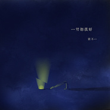
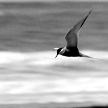
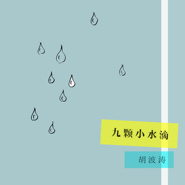
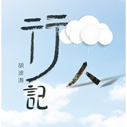
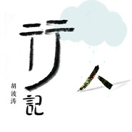
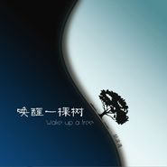

胡不一
============================

|  |  |
| :--: | :-- |
| [ 胡不一](https://i.xiami.com/kubotao) | **地区**: China 中国大陆 **风格**: 放克电子 Electro (Electro-Funk), 中国民乐 Chinese Folk Music, 独立流行 Indie Pop, 新世纪, 世界音乐 **播放数**: 1950893 **粉丝数**: 1419 **评论数**: 140  |

## 档案

独立音乐人，写写音乐，编编故事。

## 专辑

| 名称 | 语种 | 唱片公司 | 发行时间 | 专辑类别 | 专辑风格 |
| :--: | :-- | :-- | :-- | :-- | :-- |
| [ 一切都很好](./albums/2100180547.md) | 国语 | 独立发行 | 2016年06月19日 | 录音室专辑 | 华语唱作人 Chinese Singer-Songwriter |
| [ 树的迁徙每一次短暂的梦都是一次短暂的迁徙](./albums/1833637710.md) | 国语 | 独立发行 | 2015年06月07日 | EP, 单曲 | 轻音乐 Easy Listening |
| [ 壹四柒拾](./albums/830983998.md) | 国语 | 独立发行 | 2015年05月07日 | EP, 单曲 | 轻音乐 Easy Listening, 新世纪音乐 New Age |
| [ 九颗小水滴](./albums/625827458.md) | 其他 | 独立发行 | 2015年03月08日 | 录音室专辑 | 极简主义 Minimalism, 轻音乐 Easy Listening |
| [ 行人记](./albums/914482278.md) | 国语 | 独立发行 | 2014年09月20日 | 录音室专辑 | 后摇 Post-Rock, 轻音乐 Easy Listening |
| [ 行人记](./albums/1905392723.md) | 国语 |  | 2014年07月15日 | EP, 单曲 | 轻音乐 Easy Listening, 新世纪音乐 New Age |
| [ 唤醒一棵树Wake up a Tree](./albums/521474.md) | 国语 | 中国科学文化音像出版社 | 2012年06月12日 | 录音室专辑 | 中国风 China-Wave |

## 评论

|  |  |  |
| :-- | :-- | :-- |
|  [虾米用户](https://emumo.xiami.com/u/8337431) 以乐会友 2020-10-08 13:48 赞(0) 踩(0) | 
20201008.140
 |
|  [虾米用户](https://emumo.xiami.com/u/4270553) 我的黑暗是为早逝埋下的伏... 2020-09-21 22:09 赞(0) 踩(0) | 
。
 |
|  [虾米用户](https://emumo.xiami.com/u/4990721) 你对下限一无所知～～～ 2020-07-08 09:59 赞(0) 踩(0) | 
舒服~安逸~好听~
 |
|  [虾米用户](https://emumo.xiami.com/u/427384237) 我还没想好要写什么... 2020-05-10 13:18 赞(0) 踩(0) | 
➕
 |
|  [虾米用户](https://emumo.xiami.com/u/431193338)  2020-03-10 14:50 赞(0) 踩(0) | 
喜欢您的音乐在城市的喧嚣里有了静心一隅，期待您更多的作品。
 |
|  [虾米用户](https://emumo.xiami.com/u/329837824)  2019-12-10 07:56 赞(0) 踩(0) | 
你的音乐很好听
 |
|  [虾米用户](https://emumo.xiami.com/u/66823378)  2019-11-16 12:49 赞(0) 踩(0) | 

 |
|  [虾米用户](https://emumo.xiami.com/u/346676396)  2019-10-21 14:45 赞(0) 踩(0) | 
非常喜欢你的作品。加油 
 |
|  [虾米用户](https://emumo.xiami.com/u/46884940) 探险者 2019-08-13 11:09 赞(0) 踩(0) | 
一个多月，自从发现小胡以来，耳边只有他的专辑循环
 |
|  [虾米用户](https://emumo.xiami.com/u/344018512) 我还没想好要写什么... 2019-07-02 19:46 赞(0) 踩(0) | 
D
 |
|  [虾米用户](https://emumo.xiami.com/u/44161162) 音乐人生 2019-05-30 09:46 赞(0) 踩(0) | 
有才
 |
|  [虾米用户](https://emumo.xiami.com/u/425183456) 为了胡不一来的 2019-05-28 22:38 赞(0) 踩(0) | 
很喜欢！
 |
|  [虾米用户](https://emumo.xiami.com/u/46884940) 探险者 2019-05-25 18:31 赞(0) 踩(0) | 
太好听了吧，令人感觉到平静的音乐
 |
|  [虾米用户](https://emumo.xiami.com/u/5097408) 音乐是公平的 2019-04-26 21:31 赞(0) 踩(0) | 
想到david byrne，听着很惬意。
 |
|  [虾米用户](https://emumo.xiami.com/u/279516846)  2019-03-06 16:35 赞(0) 踩(0) | 
喜欢 
 |
|  [虾米用户](https://emumo.xiami.com/u/1365948)  2019-03-01 11:35 赞(1) 踩(0) | 
很小众的精神类范围内的小圈子里的，下个阶段就是跳出围城拓展欲望了。。
 |
|  [虾米用户](https://emumo.xiami.com/u/31696713) 轻音乐群88876205 2019-02-12 01:17 赞(0) 踩(0) | 
舒服的音乐，谢谢   
 |
|  [虾米用户](https://emumo.xiami.com/u/271699041)  2019-02-09 15:37 赞(0) 踩(0) | 
很喜欢50年(｡･ω･｡)ﾉ♡
 |
|  [虾米用户](https://emumo.xiami.com/u/20177386) 感谢一切美好的遇见❤️ 2018-02-24 10:16 赞(0) 踩(0) | 

 |
|  [虾米用户](https://emumo.xiami.com/u/49855874) 不二 2017-12-14 14:30 赞(1) 踩(0) | 
很舒服很舒服，清淡而不寡味。
 |
|  [虾米用户](https://emumo.xiami.com/u/40033516) 窗间过马，不负韶华。 2017-11-26 23:30 赞(1) 踩(0) | 
喜欢胡不一的音乐，百听不厌，令人宁静又心生欢喜。
 |
|  [虾米用户](https://emumo.xiami.com/u/301731671)  2017-11-05 08:57 赞(1) 踩(0) | 
******
 |
|  [虾米用户](https://emumo.xiami.com/u/32288678) 彩月 2017-10-28 00:41 赞(0) 踩(0) | 
涛哥，给我推荐和能放CD的设备或者是音响之类的呗
 |
|  [虾米用户](https://emumo.xiami.com/u/9597157) ， 2017-06-28 23:10 赞(0) 踩(0) | 
想起了韩国的李闰珉
 |
| ⇒ |  [虾米用户](https://emumo.xiami.com/u/301731671)  2017-11-05 19:45 赞(0) 踩(0) | 
******
 |
| ⇒ |  [虾米用户](https://emumo.xiami.com/u/9597157) ， 2017-11-05 21:20 赞(0) 踩(0) | 
<q><b>未知生物说：</b></q>
 |
|  [虾米用户](https://emumo.xiami.com/u/281918036)  2017-03-20 14:07 赞(0) 踩(0) | 
为什么虾米没有那首再见了少年，好喜欢那首
 |
|  [虾米用户](https://emumo.xiami.com/u/44140680) 旅途愉快 2017-01-21 23:54 赞(0) 踩(0) | 
⚫
 |
|  [虾米用户](https://emumo.xiami.com/u/14262858)   2016-11-26 13:25 赞(2) 踩(0) | 
希望不要唱歌，作曲挺好的，一出声有种画蛇添足的感觉
 |
|  [虾米用户](https://emumo.xiami.com/u/3516744)   2016-09-23 17:27 赞(1) 踩(0) | 
不错哦 棒
 |
|  [虾米用户](https://emumo.xiami.com/u/16745497) 我还没想好要写什么... 2016-09-06 14:59 赞(0) 踩(0) | 
国产国产
 |
|  [虾米用户](https://emumo.xiami.com/u/32288678) 彩月 2016-06-20 11:28 赞(0) 踩(0) | 
涛哥都不理我！
 |
| ⇒ |  [虾米用户](https://emumo.xiami.com/u/2188651) 出离的我的手，一去不复返 2016-06-21 01:47 赞(0) 踩(0) | 
我理你 哈哈  
 |
| ⇒ |  [虾米用户](https://emumo.xiami.com/u/2188651) 出离的我的手，一去不复返 2016-06-21 01:47 赞(0) 踩(0) | 
我理你  
 |
| ⇒ |  [虾米用户](https://emumo.xiami.com/u/32288678) 彩月 2016-06-21 07:09 赞(0) 踩(0) | 
<q><b>wong说：</b></q>
 |
|  [虾米用户](https://emumo.xiami.com/u/2279444) 爱在左，同情在右。 2016-06-19 15:29 赞(0) 踩(0) | 
生活中好想有你这样一个挚友
 |
|  [虾米用户](https://emumo.xiami.com/u/32288678) 彩月 2016-06-19 08:47 赞(0) 踩(0) | 
能买吗
 |
|  [虾米用户](https://emumo.xiami.com/u/32288678) 彩月 2016-06-12 13:34 赞(1) 踩(0) | 
赶紧出专辑，涛哥你够了，换什么照片
 |
|  [虾米用户](https://emumo.xiami.com/u/2188651) 出离的我的手，一去不复返 2016-05-22 01:16 赞(1) 踩(0) | 
        
 |
|  [虾米用户](https://emumo.xiami.com/u/16190782) 见怪不怪是最可怕的事情，... 2016-03-26 11:09 赞(2) 踩(0) | 
中国终于出了这样的音乐人了，太好了
 |
| ⇒ |  [虾米用户](https://emumo.xiami.com/u/279462990) 歌如人生 2018-10-11 09:45 赞(0) 踩(0) | 
惊喜
 |
|  [虾米用户](https://emumo.xiami.com/u/32288678) 彩月 2016-03-11 13:13 赞(0) 踩(0) | 
still waiting
 |
|  [虾米用户](https://emumo.xiami.com/u/32288678) 彩月 2016-02-29 13:27 赞(0) 踩(0) | 
100
 |
|  [虾米用户](https://emumo.xiami.com/u/32288678) 彩月 2016-02-29 13:27 赞(0) 踩(0) | 
99
 |
|  [虾米用户](https://emumo.xiami.com/u/32288678) 彩月 2016-02-09 16:40 赞(0) 踩(0) | 
新年好！
 |
|  [虾米用户](https://emumo.xiami.com/u/49125150) 一念心清净 2016-01-01 02:40 赞(0) 踩(0) | 
喜欢，很清新自然的纯音乐
 |
|  [虾米用户](https://emumo.xiami.com/u/32288678) 彩月 2015-12-15 23:15 赞(0) 踩(0) | 
有了这些我觉得灵魂才完整加，这两个月耳朵出毛病了不能戴耳机，痛苦万分啊！
 |
|  [虾米用户](https://emumo.xiami.com/u/32288678) 彩月 2015-12-15 23:06 赞(0) 踩(0) | 
坐等涛哥送我专辑！
 |
|  [虾米用户](https://emumo.xiami.com/u/32288678) 彩月 2015-12-01 22:31 赞(0) 踩(0) | 
999+
 |
|  [虾米用户](https://emumo.xiami.com/u/32288678) 彩月 2015-12-01 22:31 赞(0) 踩(0) | 
99
 |
|  [虾米用户](https://emumo.xiami.com/u/2188651) 出离的我的手，一去不复返 2015-11-22 03:02 赞(0) 踩(0) | 
99头牛路过
 |
|  [虾米用户](https://emumo.xiami.com/u/32288678) 彩月 2015-11-15 22:32 赞(0) 踩(0) | 
高三好辛苦啊，给我加加油写点文字呗！
 |
| ⇒ |  [虾米用户](https://emumo.xiami.com/u/2188651) 出离的我的手，一去不复返 2015-11-22 03:01 赞(0) 踩(0) | 
加橄榄油还是玉米油
 |
| ⇒ |  [虾米用户](https://emumo.xiami.com/u/32288678) 彩月 2015-11-22 12:22 赞(0) 踩(0) | 
<q><b>wong说：</b></q>
 |
|  [虾米用户](https://emumo.xiami.com/u/32288678) 彩月 2015-11-15 22:30 赞(0) 踩(0) | 
涛哥！
 |
|  [虾米用户](https://emumo.xiami.com/u/7769980) horseman, pa... 2015-10-31 21:03 赞(0) 踩(0) | 
原来我们还是有很多优秀的音乐人和作品，可惜受众太少。
 |
|  [虾米用户](https://emumo.xiami.com/u/77083286)  2015-10-26 23:52 赞(0) 踩(0) | 
百听不厌
 |
|  [虾米用户](https://emumo.xiami.com/u/32288678) 彩月 2015-10-12 22:23 赞(0) 踩(0) | 
涛哥你还删专辑我得赶紧去下demo要不你再删就木有了…我这就是绝版了！嘎嘎！
 |
| ⇒ |  [虾米用户](https://emumo.xiami.com/u/2800389)  2015-10-13 16:19 赞(0) 踩(0) | 
以后整理了再发~
 |
| ⇒ |  [虾米用户](https://emumo.xiami.com/u/32288678) 彩月 2017-10-28 00:13 赞(0) 踩(0) | 
<q><b>胡不一说：</b></q>
 |
|  [虾米用户](https://emumo.xiami.com/u/32288678) 彩月 2015-09-25 13:15 赞(0) 踩(0) | 
好长时间没留言了
 |
|  [虾米用户](https://emumo.xiami.com/u/12876004) ` 2015-09-23 07:32 赞(0) 踩(0) | 
。，。
 |
|  [虾米用户](https://emumo.xiami.com/u/12855410) 俺喜欢柔柔哒~软软哒音乐 2015-07-09 10:07 赞(1) 踩(0) | 
熬巫 赶脚是一个很古老又悠长还寂寥的故事 没有文本差评╭(╯^╰)╮
 |
| ⇒ |  [虾米用户](https://emumo.xiami.com/u/32288678) 彩月 2015-07-24 13:34 赞(0) 踩(0) | 
WTF       o(╯□╰)o
 |
|  [虾米用户](https://emumo.xiami.com/u/32288678) 彩月 2015-06-03 14:07 赞(0) 踩(0) | 
快放假了涛哥也不出曲子迎接学子们的假期？
 |
| ⇒ |  [虾米用户](https://emumo.xiami.com/u/2800389)  2015-06-03 17:16 赞(0) 踩(0) | 
~~
 |
| ⇒ |  [虾米用户](https://emumo.xiami.com/u/32288678) 彩月 2015-06-03 19:33 赞(0) 踩(0) | 
<q><b>胡不一说：</b></q>
 |
|  [虾米用户](https://emumo.xiami.com/u/2279444) 爱在左，同情在右。 2015-06-02 00:22 赞(1) 踩(0) | 
我十分吝啬收藏音乐人，你，是我收藏的第三位音乐人
 |
| ⇒ |  [虾米用户](https://emumo.xiami.com/u/2800389)  2015-06-02 08:43 赞(0) 踩(0) | 
哈哈，谢谢啊
 |
|  [虾米用户](https://emumo.xiami.com/u/10479392)  2015-05-29 22:05 赞(0) 踩(0) | 
喜欢长安一首，撩拨内心隐秘蛰伏的繁华梦幻。
 |
|  [虾米用户](https://emumo.xiami.com/u/32288678) 彩月 2015-05-27 14:08 赞(0) 踩(0) | 
…………
 |
|  [虾米用户](https://emumo.xiami.com/u/32288678) 彩月 2015-05-10 12:54 赞(0) 踩(0) | 
涛哥…突然发现你新砖封面上……是什么…果实 …波涛果？
 |
|  [虾米用户](https://emumo.xiami.com/u/32288678) 彩月 2015-05-05 13:42 赞(0) 踩(0) | 

 |
|  [虾米用户](https://emumo.xiami.com/u/32288678) 彩月 2015-04-20 13:37 赞(0) 踩(0) | 

 |
|  [虾米用户](https://emumo.xiami.com/u/32288678) 彩月 2015-03-17 13:33 赞(0) 踩(0) | 
励志攒钱买精装！
 |
|  [虾米用户](https://emumo.xiami.com/u/32288678) 彩月 2015-03-17 13:04 赞(0) 踩(0) | 
画册超棒！！！！！！！！！！！！！！！！！！！！！！！！！！！！！！！！！！！！！！！！！！！！！！！！！！
 |
|  [虾米用户](https://emumo.xiami.com/u/32288678) 彩月 2015-03-17 13:02 赞(0) 踩(0) | 
涛哥你这树画的好难看……^O^
 |
| ⇒ |  [虾米用户](https://emumo.xiami.com/u/2800389)  2015-03-24 13:55 赞(0) 踩(0) | 
咦？
 |
| ⇒ |  [虾米用户](https://emumo.xiami.com/u/32288678) 彩月 2015-04-02 13:07 赞(0) 踩(0) | 
<q><b>胡不一说：</b></q>
 |
| ⇒ |  [虾米用户](https://emumo.xiami.com/u/2800389)  2015-04-02 18:36 赞(0) 踩(0) | 
<q><b>Saigetsu说：</b></q>
 |
| ⇒ |  [虾米用户](https://emumo.xiami.com/u/32288678) 彩月 2015-04-17 22:35 赞(0) 踩(0) | 
<q><b>胡不一说：</b></q>
 |
| ⇒ |  [虾米用户](https://emumo.xiami.com/u/32288678) 彩月 2015-04-20 13:37 赞(0) 踩(0) | 
<q><b>胡不一说：</b></q>
 |
|  [虾米用户](https://emumo.xiami.com/u/4172307) 虾米forever 2015-03-17 03:21 赞(0) 踩(0) | 
三生有幸，发现东方new age~
 |
| ⇒ |  [虾米用户](https://emumo.xiami.com/u/2800389)  2015-03-17 06:07 赞(0) 踩(0) | 
那三分之二如何分配？
 |
| ⇒ |  [虾米用户](https://emumo.xiami.com/u/4172307) 虾米forever 2015-03-17 21:34 赞(0) 踩(0) | 
<q><b>胡不一说：</b></q>
 |
|  [虾米用户](https://emumo.xiami.com/u/32288678) 彩月 2015-03-16 22:32 赞(0) 踩(0) | 
对了！涛哥有娃没⊙▽⊙
 |
| ⇒ |  [虾米用户](https://emumo.xiami.com/u/2800389)  2015-03-17 06:04 赞(0) 踩(0) | 
你猜？
 |
| ⇒ |  [虾米用户](https://emumo.xiami.com/u/32288678) 彩月 2015-03-17 12:38 赞(0) 踩(0) | 
<q><b>胡不一说：</b></q>
 |
|  [虾米用户](https://emumo.xiami.com/u/32288678) 彩月 2015-03-16 22:30 赞(0) 踩(0) | 
我去虾米还有敏感词汇………yuan tong dai li打不出来
 |
|  [虾米用户](https://emumo.xiami.com/u/32288678) 彩月 2015-03-16 22:30 赞(0) 踩(0) | 
……明天就到了！！
 |
|  [虾米用户](https://emumo.xiami.com/u/32288678) 彩月 2015-03-16 22:29 赞(0) 踩(0) | 
…………
 |
|  [虾米用户](https://emumo.xiami.com/u/47785586)  2015-03-15 16:09 赞(0) 踩(0) | 
喜欢梦境
 |
|  [虾米用户](https://emumo.xiami.com/u/32288678) 彩月 2015-03-14 17:37 赞(0) 踩(0) | 
涛哥！！发货好慢！我要举报你！要是在星期天之前发不到就炸了啊！！！你得背锅！＠(￣-￣)＠
 |
| ⇒ |  [虾米用户](https://emumo.xiami.com/u/2800389)  2015-03-14 21:30 赞(0) 踩(0) | 
京东发货不应该慢啊~~
 |
|  [虾米用户](https://emumo.xiami.com/u/32288678) 彩月 2015-03-08 08:09 赞(0) 踩(0) | 
涛哥~~整个群儿呗…
 |
|  [虾米用户](https://emumo.xiami.com/u/32288678) 彩月 2015-03-07 10:02 赞(0) 踩(0) | 
！！！！！！！！
 |
|  [虾米用户](https://emumo.xiami.com/u/43759475)  2015-02-12 22:45 赞(0) 踩(0) | 
真美。 喜欢旅途。 加油 看好你。
 |
|  [虾米用户](https://emumo.xiami.com/u/29415569)  2015-02-10 15:43 赞(0) 踩(0) | 
喜欢你的《行人记》，还有那散文一样的文本歌词，有《南行记》的味道。
 |
| ⇒ |  [虾米用户](https://emumo.xiami.com/u/2800389)  2015-02-10 16:11 赞(0) 踩(0) | 
嘿嘿 谢谢哇
 |
|  [虾米用户](https://emumo.xiami.com/u/2964661) 飞上云端 2015-01-22 12:11 赞(1) 踩(0) | 
新民乐
 |
|  [虾米用户](https://emumo.xiami.com/u/43209601) 心随乐动 2015-01-08 16:57 赞(0) 踩(0) | 
很美，加油！
 |
|  [虾米用户](https://emumo.xiami.com/u/31608105) 人心是不待风吹而自落的花 2015-01-02 20:18 赞(1) 踩(0) | 
真的很好、好音乐总会被发现~
 |
|  [虾米用户](https://emumo.xiami.com/u/12855410) 俺喜欢柔柔哒~软软哒音乐 2014-12-25 15:01 赞(0) 踩(0) | 
喜欢不需要理由(╯‵□′)╯︵┻━┻
 |
|  [虾米用户](https://emumo.xiami.com/u/33495337) 暂无签名~ 2014-12-13 23:25 赞(0) 踩(0) | 
真心不错哦！会一直关注你的音乐
 |
|  [虾米用户](https://emumo.xiami.com/u/44073052)  2014-12-12 12:09 赞(0) 踩(0) | 
好音乐。应该更多人知道才好
 |
|  [虾米用户](https://emumo.xiami.com/u/30980939) djshortys 2014-05-25 02:13 赞(0) 踩(0) | 
nice
 |
|  [虾米用户](https://emumo.xiami.com/u/1963119) 全然的倾听。 2014-04-09 23:42 赞(0) 踩(0) | 
牛逼。 很喜欢永无岛。
 |
|  [虾米用户](https://emumo.xiami.com/u/1820887) 与虾米共生死~~ 2014-03-08 08:19 赞(0) 踩(0) | 
哈嘍啊老胡O(∩_∩)O~
 |
| ⇒ |  [虾米用户](https://emumo.xiami.com/u/2800389)  2014-03-08 12:30 赞(0) 踩(0) | 
哈喽啊老方~~
 |
| ⇒ |  [虾米用户](https://emumo.xiami.com/u/1820887) 与虾米共生死~~ 2014-03-08 19:43 赞(0) 踩(0) | 
<q><b>胡不一说：</b></q>
 |
| ⇒ |  [虾米用户](https://emumo.xiami.com/u/2800389)  2014-03-08 21:11 赞(0) 踩(0) | 
<q><b>十方说：</b></q>
 |
| ⇒ |  [虾米用户](https://emumo.xiami.com/u/1820887) 与虾米共生死~~ 2014-03-09 10:21 赞(0) 踩(0) | 
<q><b>胡不一说：</b></q>
 |
| ⇒ |  [虾米用户](https://emumo.xiami.com/u/2800389)  2014-03-09 10:42 赞(0) 踩(0) | 
<q><b>十方说：</b></q>
 |
|  [虾米用户](https://emumo.xiami.com/u/11862381) 死扛 2014-01-18 21:49 赞(1) 踩(0) | 
像一股清水流过，听后让我宁静下来，非常感谢！干散的很！
 |
|  [虾米用户](https://emumo.xiami.com/u/18773012) 卫道东升 2014-01-12 18:21 赞(1) 踩(0) | 
非常喜欢
 |
|  [虾米用户](https://emumo.xiami.com/u/7296333)  2013-12-22 14:40 赞(2) 踩(0) | 
我國很需要這種人才，更需要這種人才的群體
 |
|  [虾米用户](https://emumo.xiami.com/u/572626) 不能让好的被埋没，也不能... 2013-11-20 18:03 赞(11) 踩(0) | 
我是温金宝
 |
| ⇒ |  [虾米用户](https://emumo.xiami.com/u/2800389)  2014-01-13 02:49 赞(0) 踩(0) | 
温大人，最近没那么忙了吧？
 |
| ⇒ |  [虾米用户](https://emumo.xiami.com/u/572626) 不能让好的被埋没，也不能... 2014-01-13 08:50 赞(0) 踩(0) | 
<q><b>胡不一说：</b></q>
 |
| ⇒ |  [虾米用户](https://emumo.xiami.com/u/32288678) 彩月 2015-04-02 13:04 赞(0) 踩(0) | 
愁人你这  一年前的xx评论
 |
|  [虾米用户](https://emumo.xiami.com/u/7140003)  2013-11-18 15:31 赞(1) 踩(0) | 
《河》这首曲子很美，如果中间的滑音能去掉就更好了。感觉滑音似乎太不严肃从而似乎不太符合曲子的氛围。
 |
|  [虾米用户](https://emumo.xiami.com/u/12068445) · 2013-11-02 17:26 赞(1) 踩(0) | 
喜欢
 |
|  [虾米用户](https://emumo.xiami.com/u/871832)  2013-10-23 17:48 赞(1) 踩(0) | 
音乐质朴，有画面感，但不拘泥。
 |
|  [虾米用户](https://emumo.xiami.com/u/9394981) 还我一个如母亲般的领头羊 2013-10-16 13:22 赞(1) 踩(0) | 
不错的~
 |
|  [虾米用户](https://emumo.xiami.com/u/3807650) 我是街上的游魂你是闻到我... 2013-09-16 16:50 赞(1) 踩(0) | 
New Age
 |
|  [虾米用户](https://emumo.xiami.com/u/1700002) V5_ORZZZZZ 2013-09-01 23:58 赞(1) 踩(0) | 
不错...有意思的曲风
 |
|  [虾米用户](https://emumo.xiami.com/u/2709397)  2013-08-07 21:07 赞(1) 踩(0) | 
太有才！！
 |
|  [虾米用户](https://emumo.xiami.com/u/6849055)  2013-05-06 17:36 赞(1) 踩(0) | 
似初春发现一抹绿的惊喜。
 |
|  [虾米用户](https://emumo.xiami.com/u/2977748)  2012-11-16 22:27 赞(1) 踩(0) | 
涛哥
 |
|  [虾米用户](https://emumo.xiami.com/u/4717387)  2012-10-29 13:44 赞(1) 踩(0) | 
好听！
 |
|  [虾米用户](https://emumo.xiami.com/u/606241)  2012-10-22 22:30 赞(1) 踩(0) | 
谢谢，很好
 |
|  [虾米用户](https://emumo.xiami.com/u/7989378) -Inst- 2012-10-05 14:19 赞(1) 踩(0) | 
不错~
 |
|  [虾米用户](https://emumo.xiami.com/u/231797) 活着真好 好好活着 2012-09-12 13:01 赞(1) 踩(0) | 
留名~
 |
|  [虾米用户](https://emumo.xiami.com/u/7148029) 学吉他中... 2012-09-08 20:22 赞(5) 踩(0) | 
不小心看成胡X涛了
 |
| ⇒ |  [虾米用户](https://emumo.xiami.com/u/2800389)  2013-10-12 13:18 赞(0) 踩(0) | 
这个这个~~~~~
 |
|  [虾米用户](https://emumo.xiami.com/u/10377292)  2012-09-02 13:23 赞(4) 踩(0) | 
倒上一杯清澈的绿茶，躺在院子的躺椅上，轻轻闭上眼睛，一个人静静地聆听着专辑《唤醒一棵树》中悠扬的的曲子，仿佛自己已然置身**之上、森林之间… …
 |
|  [虾米用户](https://emumo.xiami.com/u/9959145) 流行摇滚,朋克 2012-07-25 21:08 赞(1) 踩(0) | 
很不错的 音乐。。今天听到了。中国有这样的音乐。。加油。。
 |
|  [虾米用户](https://emumo.xiami.com/u/8780063)  2012-07-04 13:23 赞(1) 踩(0) | 
NICE！
 |
|  [虾米用户](https://emumo.xiami.com/u/8246211) never know 2012-06-27 20:28 赞(2) 踩(0) | 
淡淡的，飘渺的中国味，灵动而又迷幻，无心无欲，这纯净不急不缓，轻轻淌来。
 |
|  [虾米用户](https://emumo.xiami.com/u/1013157)  2012-06-26 14:48 赞(1) 踩(0) | 
支持！！！
 |
