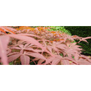

我彩色的世界
============================

|  |  |
| :--: | :-- |
| [ 我彩色的世界](https://emumo.xiami.com/album/2100367437) | **艺人**: [清风苑615](../index.md) **语种**: 国语 **唱片公司**: 独立发行 **发行时间**: 2016年07月14日 **专辑类别**: EP, 单曲 **专辑风格**:  **播放数**: 509 **收藏数**: 1 **评论数**: 0  |

## 简介

 

《我彩色的世界》
 

 
 

作曲编曲混音：清风苑615
 

 
 

作词：久陌
 

 
 

演唱：花沧
 

 
 

 
 

彩虹出现&nbsp;
 

雨下的新鲜
 

一觉醒来&nbsp;
 

又是个晴天
 

 
 

 
 

湛蓝的天&nbsp;
 

白衬衣少年
 

 
 

享受温暖&nbsp;
 

你的安全感
 

 
 

你像
 

阳光 照亮我的世界
 

真实&nbsp;
 

安然 就是这种感觉
 

 
 

 
 

夜晚海边&nbsp;
 

星星的笑脸
 

月光美满&nbsp;
 

与你的陪伴
 

 
 

 
 

梦有多甜&nbsp;
 

它比糖果更甜
 

你很特别&nbsp;
 

闯进我的世界
 

 
 

 
 

 
 

我爱晴天&nbsp;
 

爱这彩色世界
 

与你有关&nbsp;
 

我彩色的世界
 

## 曲目

## 评论

