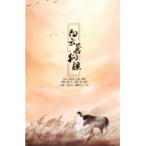

清风苑615的2017编曲集
============================

|  |  |
| :--: | :-- |
| [ 清风苑615的2017编曲集](https://emumo.xiami.com/album/2102726858) | **艺人**: [清风苑615](../index.md) **语种**: 国语 **唱片公司**: 独立发行 **发行时间**: 2017年04月04日 **专辑类别**: 录音室专辑 **专辑风格**: 古风 GuFeng Music, 中国风 China-Wave **播放数**: 518458 **收藏数**: 16 **评论数**: 1  |

## 简介

 
 

清风苑615的2017编曲作品
 

 

## 曲目

## 评论

|  |  |  |
| :-- | :-- | :-- |
|  [虾米用户](https://emumo.xiami.com/u/445639152)  2020-10-30 15:20 赞(0) 踩(0) | 
单曲循环无数遍
 |
