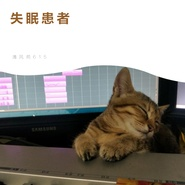

清风苑615
============================

|  |  |
| :--: | :-- |
| [ 清风苑615](https://i.xiami.com/qfy615) | **地区**: China 中国大陆 **风格**: 轻音乐 Easy Listening, 国语流行 Mandarin Pop **播放数**: 1107486 **粉丝数**: 64 **评论数**: 5  |

## 档案

来自重庆的编曲一枚0.0

## 专辑

| 名称 | 语种 | 唱片公司 | 发行时间 | 专辑类别 | 专辑风格 |
| :--: | :-- | :-- | :-- | :-- | :-- |
| [ 清风苑615的2019编曲集](./albums/2104669929.md) | 国语 |  | 2019年03月14日 | 录音室专辑 | 流行 Pop |
| [ 失眠患者夜不能寐](./albums/2104590488.md) | 国语 |  | 2019年02月11日 | 录音室专辑 | 轻音乐 Easy Listening |
| [ 清风苑615的2018作品集](./albums/2104262343.md) | 国语 |  | 2018年11月22日 | 录音室专辑 | 古风 GuFeng Music, 流行 Pop, 中国风 China-Wave |
| [ 清风苑615的2017编曲集](./albums/2102726858.md) | 国语 | 独立发行 | 2017年04月04日 | 录音室专辑 | 古风 GuFeng Music, 中国风 China-Wave |
| [ 愿君安好](./albums/2102680224.md) | 国语 | 独立发行 | 2017年01月13日 | 录音室专辑 | 流行 Pop |
| [ 且赋长歌](./albums/2102404356.md) | 国语 |  | 2016年10月05日 | EP, 单曲 |  |
| [ 《指尖星点》——逆袭之星途闪耀非橙同人曲](./albums/2100388897.md) | 国语 | 独立发行 | 2016年09月10日 | 录音室专辑 |  |
| [ 我彩色的世界](./albums/2100367437.md) | 国语 | 独立发行 | 2016年07月14日 | EP, 单曲 |  |
| [ 三春湖畔](./albums/2100358553.md) | 国语 | 独立发行 | 2016年06月25日 | EP, 单曲 |  |
| [ 南城](./albums/2100251146.md) | 国语 | 独立发行 | 2015年12月26日 | EP, 单曲 | 当代民谣 Contemporary Folk, 国语流行 Mandarin Pop |

## 评论

|  |  |  |
| :-- | :-- | :-- |
|  [虾米用户](https://emumo.xiami.com/u/358104299) 悲观的唯心存在现实解构虚... 2020-03-11 23:58 赞(1) 踩(0) | 
14904
 |
|  [虾米用户](https://emumo.xiami.com/u/365635281) 学识如吴邪，身手如胖爷，... 2018-12-07 21:24 赞(0) 踩(0) | 
听到声音就果断关注了     
 |
|  [虾米用户](https://emumo.xiami.com/u/375232219)  2018-06-10 13:33 赞(1) 踩(0) | 
声音好有磁性~
 |
|  [虾米用户](https://emumo.xiami.com/u/109918266)  2017-04-04 12:44 赞(0) 踩(0) | 
666
 |
|  [虾米用户](https://emumo.xiami.com/u/51631029)   2015-11-29 18:33 赞(0) 踩(0) | 
，
 |
