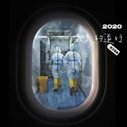
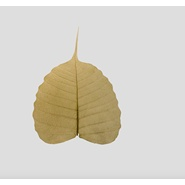

朱震颐
============================

|  |  |
| :--: | :-- |
| [ 朱震颐](https://i.xiami.com/zhuzhen) | **播放数**: 599863 **粉丝数**: 275 **评论数**: 20 **地区**: China 中国大陆 **风格**: 独立流行 Indie Pop  |

## 档案

朱震颐，独立音乐唱作人。毕业于厦门大学艺术学院钢琴表演专业，厦门北极光乐队主唱。

## 专辑

| 名称 | 语种 | 唱片公司 | 发行时间 | 专辑类别 | 专辑风格 |
| :--: | :-- | :-- | :-- | :-- | :-- |
| [ 最美的逆行](./albums/2105842702.md) | 国语 | 艺星文化 | 2020年02月04日 | EP, 单曲 | 国语流行 Mandarin Pop |
| [ Eight Meditation（八步骤）](./albums/2105537215.md) | 国语 |  | 2019年12月02日 | 录音室专辑 | 流行 Pop |
| [ 祇树给孤独园](./albums/2105020894.md) | 国语 |  | 2019年07月25日 | EP, 单曲 | 流行灵魂乐 Pop Soul |
| [ 禅宗无门关](./albums/2104760237.md) | 国语 |  | 2019年04月05日 | 录音室专辑 | 流行 Pop |
| [ 阿兰若处](./albums/2102659352.md) | 国语 | 独立发行 | 2016年12月04日 | 录音室专辑 | 佛教音乐 Buddhist Music |
| [ 大方等陀罗尼经](./albums/2104972121.md) | 其他 |  | 不详 | EP, 单曲 | 流行 Pop |

## 评论

|  |  |  |  |
| :-- | :-- | :-- | :-- |
|  [虾米用户](https://emumo.xiami.com/u/409393101)  2021-01-01 01:28 赞(0) 踩(0) | 
粉
 |
|  [虾米用户](https://emumo.xiami.com/u/43711944) 欣赏、感恩、享受美乐！ 2020-11-13 11:21 赞(0) 踩(0) | 
非常殊胜优美！喜欢编排成了年会节目
 |
|  [虾米用户](https://emumo.xiami.com/u/412781927) 阿弥陀佛 2020-10-04 17:43 赞(0) 踩(0) | 
阿弥陀佛
 |
|  [虾米用户](https://emumo.xiami.com/u/410025370) 若知身无便是佛见 若知实... 2020-05-22 20:25 赞(1) 踩(0) | 
⭐⭐⭐ 闻我名者 断恶修善 ⭐⭐⭐ 见我形者 发菩提心 ⭐⭐⭐ 听我法者 开大智慧 ⭐⭐⭐ 是我心者 立地成佛
 |
|  [虾米用户](https://emumo.xiami.com/u/311365506) 我还没想好要写什么... 2020-04-09 08:41 赞(0) 踩(0) | 
随喜功德   
 |
|  [虾米用户](https://emumo.xiami.com/u/13979322) 一手行愿千手护持 2020-03-19 09:23 赞(0) 踩(0) | 
好听的梵乐曲  喜欢   
 |
|  [虾米用户](https://emumo.xiami.com/u/9415171) 地球兩邊跑的維根小兔 2020-03-16 21:46 赞(0) 踩(0) | 
前段時間聽到你的毗盧遮那佛大灌頂光陀羅尼，感覺震動靈魂。尋找到你的專輯這裡，非常喜歡。希望你能把創作的這些佛曲都放到油管上面，讓更多人聽到這麼與眾不同的佛曲
 |
|  [虾米用户](https://emumo.xiami.com/u/437258928) 我与蓝山咖啡结婚，禁止加... 2020-02-11 13:35 赞(0) 踩(0) | 
  
 |
|  [虾米用户](https://emumo.xiami.com/u/325205625)  2019-11-10 08:57 赞(0) 踩(0) | 
，
 |
|  [虾米用户](https://emumo.xiami.com/u/256783629) 慈悲憐憫是這個世界上最好... 2019-11-06 16:37 赞(0) 踩(0) | 
阿彌陀佛，隨囍功德。
 |
|  [虾米用户](https://emumo.xiami.com/u/325374787)  2019-04-14 09:14 赞(1) 踩(0) | 
好好
 |
|  [虾米用户](https://emumo.xiami.com/u/354066488)  2018-06-21 23:11 赞(1) 踩(0) | 
歌声很柔和
 |
|  [虾米用户](https://emumo.xiami.com/u/40663667)   2018-06-07 19:55 赞(1) 踩(0) | 
不客气，你滋养了我
 |
|  [虾米用户](https://emumo.xiami.com/u/32031632)  2017-04-10 20:43 赞(2) 踩(0) | 
南无阿弥佗佛
 |
|  [虾米用户](https://emumo.xiami.com/u/32031632)  2017-04-10 20:43 赞(2) 踩(0) | 
南无阿弥佗佛
 |
|  [虾米用户](https://emumo.xiami.com/u/39288210)  2015-02-26 22:13 赞(0) 踩(0) | 
朱哥加油 
 |
|  [虾米用户](https://emumo.xiami.com/u/47187667)  2015-02-11 17:05 赞(0) 踩(0) | 
太棒了
 |
|  [虾米用户](https://emumo.xiami.com/u/44806704) 君は冬の夢。 2015-02-08 08:29 赞(0) 踩(0) | 
朱震好棒~
 |
| ⇒ |  [虾米用户](https://emumo.xiami.com/u/47187667)  2015-02-11 17:05 赞(0) 踩(0) | 
一秒变小粉丝哈哈
 |
|  [虾米用户](https://emumo.xiami.com/u/574744) 抖音：@朱震颐 2015-02-07 04:17 赞(0) 踩(0) | 
我刚入驻了虾米音乐人，欢迎大家来我的个人主页，收听我的最新音乐
 |
