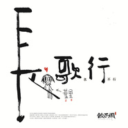

叶里
============================

|  |  |
| :--: | :-- |
| [ 叶里](https://i.xiami.com/yeli) | **地区**: China 中国大陆 **风格**: 中国风 China-Wave, 民谣流行 Folk Pop **播放数**: 6962581 **粉丝数**: 3635 **评论数**: 447  |

## 档案

新浪微博：@叶里_ 
粉丝QQ群：9230880 
专辑售后群：546208125 
叶里首张个人专辑《长歌名行不行》正在乐童火热众筹中！ 
2016年漂流记全国巡演票务通道也已开启！ 
众筹地址： http://www.musikid.com/project/1863 
票务地址： http://www.musikid.com/tour/3740 
感谢大家的支持和厚爱~~！(╯3╰)

## 专辑

| 名称 | 语种 | 唱片公司 | 发行时间 | 专辑类别 | 专辑风格 |
| :--: | :-- | :-- | :-- | :-- | :-- |
| [ 栖凤渡（DJ版）](./albums/5021677566.md) | 国语 | 太声文化 | 2020年10月16日 | EP, 单曲 | 电子 Electronic |
| [ 栖凤渡](./albums/5021174975.md) | 国语 | 太声文化 | 2020年07月30日 | EP, 单曲 | 古风 GuFeng Music |
| [ 恋爱吗？做梦吧！](./albums/5020844321.md) | 国语 | 太声文化 | 2020年05月30日 | 录音室专辑 | 国语流行 Mandarin Pop |
| [ 海底](./albums/5020699524.md) | 国语 |  | 2020年04月19日 | 录音室专辑 |  |
| [ 谪仙](./albums/2106080545.md) | 国语 |  | 2020年02月08日 |  |  |
| [ 南关醉](./albums/2106072864.md) | 国语 |  | 2019年12月27日 |  |  |
| [ 君不在长江头，我也不在长江尾](./albums/2105538772.md) | 国语 | 太声文化 | 2019年12月06日 | EP, 单曲 | 国语流行 Mandarin Pop |
| [ 雨伤](./albums/2104870516.md) | 国语 | 推星传媒 | 2019年05月17日 | EP, 单曲 |  |
| [ 唱TA的歌](./albums/2104797416.md) | 国语 | 太声文化 | 2019年04月23日 | EP, 单曲 | 国语流行 Mandarin Pop |
| [ So into U](./albums/2103907723.md) | 国语 | 太声文化 | 2018年08月13日 | EP, 单曲 |  |
| [ 冠玉](./albums/2102968282.md) | 国语 | 太声文化 | 2017年12月07日 | EP, 单曲 | 中国风 China-Wave |
| [ 碧落](./albums/2102863614.md) | 国语 | 太声文化 | 2017年09月26日 | EP, 单曲 | 中国风 China-Wave |
| [ 葬仙-记狠人大帝](./albums/2102860389.md) | 国语 | 独立发行 | 2017年06月30日 | EP, 单曲 | 中国风 China-Wave |
| [ 莫殊途](./albums/2102745016.md) | 国语 | 太声文化 | 2017年05月09日 | EP, 单曲 | 中国风 China-Wave |
| [ 长歌名行不行](./albums/2100315564.md) | 国语 | 独立发行 | 2016年04月18日 | EP, 单曲 | 神游舞曲 Trip Hop, 迷幻流行 Psychedelic Pop, 中国风 China-Wave |
| [ 锦上《故事》收录曲](./albums/551237.md) | 国语 | 独立发行 | 2015年09月30日 | EP, 单曲 | 新世纪音乐 New Age, 独立电子乐 Indietronica |
| [ 故事](./albums/2103467768.md) | 国语 | 看见文娱 | 2015年03月17日 | 原声带, 影视音乐 | 古风 GuFeng Music |
| [ 无归](./albums/422410409.md) | 国语 |  | 2014年12月13日 | EP, 单曲 | 中国风 China-Wave |
| [ 咏春](./albums/161425256.md) | 国语 | 独立发行 | 2013年02月04日 | EP, 单曲 | 中国风 China-Wave |
| [ 岁岁念](./albums/2103467761.md) | 国语 | 太声文化 | 2000年02月01日 | EP, 单曲 | 中国风 China-Wave |
| [ 我们的歌](./albums/2103467760.md) | 国语 | 独立发行 | 2000年02月01日 | EP, 单曲 |  |
| [ 花重锦官城](./albums/2103467762.md) | 国语 | 太声文化 | 2000年02月01日 | EP, 单曲 |  |
| [ 叶里](./albums/2103467769.md) | 国语 | 太声文化 | 2000年02月01日 | EP, 单曲 |  |
| [ 在我心](./albums/2103467757.md) | 国语 | 太声文化 | 2000年02月01日 | EP, 单曲 |  |

## 评论

|  |  |  |
| :-- | :-- | :-- |
|  [虾米用户](https://emumo.xiami.com/u/358104299) 悲观的唯心存在现实解构虚... 2021-01-02 04:20 赞(0) 踩(0) | 
45055
 |
|  [虾米用户](https://emumo.xiami.com/u/54683805)  2020-12-27 16:47 赞(0) 踩(0) | 
啊居然辞职休息了4个月，什么事都没干 2020要过去了，开始准备准备打工去。
 |
|  [虾米用户](https://emumo.xiami.com/u/20539146)  2020-09-26 22:11 赞(1) 踩(0) | 
里少又有新歌了！
 |
|  [虾米用户](https://emumo.xiami.com/u/20539146)  2020-09-26 22:07 赞(0) 踩(0) | 
一起给里少打电话☎️，奇怪这次总该给我发出来了吧
 |
|  [虾米用户](https://emumo.xiami.com/u/20539146)  2020-09-26 22:05 赞(0) 踩(0) | 
一起给里少打电话☎️
 |
|  [虾米用户](https://emumo.xiami.com/u/54683805)  2020-09-04 08:58 赞(0) 踩(0) | 
可能上火了，眼睛疼蔓延到半边脸刺刺的，今天牙龈也有点症状。只能多喝水啦，可别左脸好了来一套右脸。
 |
|  [虾米用户](https://emumo.xiami.com/u/54683805)  2020-09-02 14:07 赞(0) 踩(0) | 
9月了啊。这个月除了驾照扫尾，就再好好浪吧。
 |
|  [虾米用户](https://emumo.xiami.com/u/54683805)  2020-08-10 12:32 赞(0) 踩(0) | 
想修仙，这样就不会生病了。
 |
|  [虾米用户](https://emumo.xiami.com/u/54683805)  2020-08-05 09:07 赞(0) 踩(0) | 
在纠结要不去曾楠的现场。 看天吧，唉。
 |
|  [虾米用户](https://emumo.xiami.com/u/54683805)  2020-08-01 10:04 赞(0) 踩(0) | 
嗷呜，早上看微博才知道彭晓冉要演君九龄，如果你再唱主题曲就更完美啦哈哈哈哈哈哈哈哈哈哈哈哈哈哈哈
 |
| ⇒ |  [虾米用户](https://emumo.xiami.com/u/54683805)  2020-08-01 10:04 赞(0) 踩(0) | 
不好意思名字打错了ORZ彭小苒
 |
|  [虾米用户](https://emumo.xiami.com/u/54683805)  2020-07-31 09:22 赞(0) 踩(0) | 
距离某个纪念日还有4个月，现在就开始搞事情。
 |
|  [虾米用户](https://emumo.xiami.com/u/54683805)  2020-07-30 09:11 赞(0) 踩(0) | 
手腕酸，可能昨晚睡觉压到了。
 |
|  [虾米用户](https://emumo.xiami.com/u/54683805)  2020-07-29 08:49 赞(0) 踩(0) | 
早啊，又到了星期三。
 |
|  [虾米用户](https://emumo.xiami.com/u/54683805)  2020-07-28 08:45 赞(0) 踩(0) | 
给叶里里打call！
 |
|  [虾米用户](https://emumo.xiami.com/u/54683805)  2020-07-27 08:57 赞(0) 踩(0) | 
一天一苹果，医生远离我。开始补充水果。干巴爹！
 |
|  [虾米用户](https://emumo.xiami.com/u/54683805)  2020-07-25 09:52 赞(0) 踩(0) | 
周六啦，看见新宝说叶里从叶半首升级为叶两句了，太真实了哈哈哈哈哈哈哈哈哈哈哈哈哈哈哈哈哈哈哈哈哈哈
 |
|  [虾米用户](https://emumo.xiami.com/u/54683805)  2020-07-23 14:15 赞(0) 踩(0) | 
周四，中午略困。
 |
|  [虾米用户](https://emumo.xiami.com/u/54683805)  2020-07-22 09:03 赞(0) 踩(0) | 
我感觉到腹肌&amp;hellip;&amp;hellip;的乳酸了，酸爽！
 |
|  [虾米用户](https://emumo.xiami.com/u/54683805)  2020-07-21 10:12 赞(0) 踩(0) | 
开始减脂。 我的目标是马甲线（并不
 |
|  [虾米用户](https://emumo.xiami.com/u/54683805)  2020-07-18 09:24 赞(0) 踩(0) | 
周六愉快。好想休息一个月把驾照考完。
 |
|  [虾米用户](https://emumo.xiami.com/u/54683805)  2020-07-17 10:33 赞(0) 踩(0) | 
这个月迟到3次了，今天直接睡过一小时，够本了咳咳咳
 |
|  [虾米用户](https://emumo.xiami.com/u/54683805)  2020-07-15 09:08 赞(0) 踩(0) | 
发歌啦发歌啦，里里抖音营业好勤奋！
 |
|  [虾米用户](https://emumo.xiami.com/u/54683805)  2020-07-13 16:59 赞(0) 踩(0) | 
里里辛苦了。
 |
|  [虾米用户](https://emumo.xiami.com/u/54683805)  2020-07-04 11:21 赞(0) 踩(0) | 
总觉得最近对&amp;ldquo;无用功&amp;rdquo;的体会加深了，今天做的任务明天返工，难道是我太听话了？人力资源大大的浪费！
 |
|  [虾米用户](https://emumo.xiami.com/u/54683805)  2020-07-03 09:26 赞(0) 踩(0) | 
发歌了诶，情人劫，最近的歌名不怎么友好【手动滑稽】
 |
|  [虾米用户](https://emumo.xiami.com/u/54683805)  2020-07-02 09:19 赞(0) 踩(0) | 
好困啊，无梦果什么时候发。
 |
|  [虾米用户](https://emumo.xiami.com/u/54683805)  2020-07-01 09:04 赞(0) 踩(0) | 
7月了。
 |
|  [虾米用户](https://emumo.xiami.com/u/54683805)  2020-06-30 11:51 赞(0) 踩(0) | 
唉，有点厌世。
 |
|  [虾米用户](https://emumo.xiami.com/u/54683805)  2020-06-29 10:57 赞(0) 踩(0) | 
风水是个玄妙的东西。
 |
|  [虾米用户](https://emumo.xiami.com/u/54683805)  2020-06-18 21:32 赞(0) 踩(0) | 
和朋友吃了饭，好励志。
 |
|  [虾米用户](https://emumo.xiami.com/u/54683805)  2020-06-17 13:54 赞(0) 踩(0) | 
雨还在下。昨晚节奏光剑玩了意中人，节奏感强的歌玩这个游戏蛮好玩的。
 |
|  [虾米用户](https://emumo.xiami.com/u/54683805)  2020-06-16 09:02 赞(0) 踩(0) | 
雨好大。再次提醒里少注意安全。
 |
|  [虾米用户](https://emumo.xiami.com/u/54683805)  2020-06-15 09:57 赞(0) 踩(0) | 
早，事好多。里里注意安全。
 |
|  [虾米用户](https://emumo.xiami.com/u/54683805)  2020-06-13 08:58 赞(0) 踩(0) | 
六月是年中。
 |
|  [虾米用户](https://emumo.xiami.com/u/54683805)  2020-06-12 21:06 赞(0) 踩(0) | 
啊，头疼。 感觉自己进步了好多
 |
|  [虾米用户](https://emumo.xiami.com/u/54683805)  2020-06-10 11:47 赞(0) 踩(0) | 
又让马儿跑，又不给马儿吃草。好饿。
 |
|  [虾米用户](https://emumo.xiami.com/u/54683805)  2020-06-09 10:32 赞(0) 踩(0) | 
啊哒！晚上还是晚了节奏光剑才睡的，老少女hard模式刚刚好，瞅空录个视频发微博哈哈哈哈哈哈哈哈哈哈哈哈哈（等练到全部击中估计好难。
 |
|  [虾米用户](https://emumo.xiami.com/u/54683805)  2020-06-08 11:37 赞(0) 踩(0) | 
昨晚失眠了，头好疼。
 |
|  [虾米用户](https://emumo.xiami.com/u/54683805)  2020-06-07 10:24 赞(0) 踩(0) | 
周日快乐。六月又过去四分之一了。
 |
|  [虾米用户](https://emumo.xiami.com/u/54683805)  2020-06-06 09:37 赞(0) 踩(0) | 
周六愉快，凌晨三点睡的，早上果然迟到了。
 |
|  [虾米用户](https://emumo.xiami.com/u/54683805)  2020-06-05 10:25 赞(0) 踩(0) | 
昨天里里说，明年一起喝酒。小哥弹琴她只唱歌。好的。
 |
|  [虾米用户](https://emumo.xiami.com/u/54683805)  2020-06-04 09:05 赞(0) 踩(0) | 
虾米的《谪仙》什么时候能听呀，昨晚上真是好激动！wuli叶里里真棒！
 |
|  [虾米用户](https://emumo.xiami.com/u/54683805)  2020-06-03 09:40 赞(0) 踩(0) | 
早上好，开始抠图。新图很飒。
 |
|  [虾米用户](https://emumo.xiami.com/u/54683805)  2020-06-02 09:11 赞(0) 踩(0) | 
昨天没有登录。恋爱吗？来做梦吧！梦里什么都有。 可是有些人再也不愿入梦了。
 |
|  [虾米用户](https://emumo.xiami.com/u/54683805)  2020-05-28 10:22 赞(0) 踩(0) | 
啊，我变懒了。
 |
|  [虾米用户](https://emumo.xiami.com/u/54683805)  2020-05-22 09:11 赞(0) 踩(0) | 
恋爱吗？xxx！做梦也想不到这个名字哈哈哈哈哈哈哈哈哈哈哈哈哈哈哈哈
 |
|  [虾米用户](https://emumo.xiami.com/u/54683805)  2020-05-19 20:27 赞(0) 踩(0) | 
放3天假。
 |
|  [虾米用户](https://emumo.xiami.com/u/54683805)  2020-05-18 08:44 赞(0) 踩(0) | 
vr真好玩。就是空间太小，运动不开。
 |
|  [虾米用户](https://emumo.xiami.com/u/54683805)  2020-05-16 08:30 赞(0) 踩(0) | 
早上好。好久不见的老朋友今天晚上一起吃饭。
 |
|  [虾米用户](https://emumo.xiami.com/u/54683805)  2020-05-15 08:20 赞(0) 踩(0) | 
化身带饭工具人。 翻到了无梦果，今年快过去一半了，期待新专。
 |
|  [虾米用户](https://emumo.xiami.com/u/54683805)  2020-05-14 08:38 赞(0) 踩(0) | 
千鸟与目黑的pv发啦！看到有人问歌名什么意思 所以只是地名吗
 |
|  [虾米用户](https://emumo.xiami.com/u/54683805)  2020-05-13 08:59 赞(0) 踩(0) | 
安利狂魔就是我。
 |
|  [虾米用户](https://emumo.xiami.com/u/54683805)  2020-05-12 09:19 赞(0) 踩(0) | 
啊哒！叶里会空降虾米评论区吗
 |
|  [虾米用户](https://emumo.xiami.com/u/54683805)  2020-05-10 09:24 赞(0) 踩(0) | 
吃饭的时候通知说今天不用上班了。但是热爱工作的我还是来到办公室&amp;hellip;&amp;hellip;连打印机。
 |
|  [虾米用户](https://emumo.xiami.com/u/54683805)  2020-05-09 08:52 赞(0) 踩(0) | 
明天居然要上班，单休的我雪上加霜。五一前的周日出去团建，五一后的周日老实上班，假期还占了个周末，所以五一你到底休了啥。
 |
|  [虾米用户](https://emumo.xiami.com/u/54683805)  2020-05-08 07:29 赞(0) 踩(0) | 
下雨了，挺凉快的。如果没有积水会更完美，不想刷鞋。
 |
|  [虾米用户](https://emumo.xiami.com/u/54683805)  2020-05-07 13:41 赞(0) 踩(0) | 
过了一个假期，之前买的酸奶快过期了，早上喝到最后仿佛有絮状物，可能是心理暗示，一上午都没有精神。中午突然就像做个十周年纪念品，然后就来劲了。过来听听歌摸摸鱼，下班搞起来。
 |
|  [虾米用户](https://emumo.xiami.com/u/54683805)  2020-05-01 08:10 赞(0) 踩(0) | 
哥哥等我坐车，结果我把他落车站了2333
 |
|  [虾米用户](https://emumo.xiami.com/u/54683805)  2020-04-30 08:52 赞(0) 踩(0) | 
要放假了，断签5天。
 |
|  [虾米用户](https://emumo.xiami.com/u/54683805)  2020-04-29 09:06 赞(0) 踩(0) | 
里少好勤奋~
 |
|  [虾米用户](https://emumo.xiami.com/u/54683805)  2020-04-28 09:12 赞(0) 踩(0) | 
五一活动搞起来，转发胖三斤【手动doge】
 |
|  [虾米用户](https://emumo.xiami.com/u/54683805)  2020-04-27 09:00 赞(0) 踩(0) | 
谪仙居然发了dj版，其实自带的dj音效更好听一些，可能是我听习惯了吧。 自娱自乐还好，真的发了今天的版本，就low了的感觉&amp;hellip;&amp;hellip;
 |
|  [虾米用户](https://emumo.xiami.com/u/54683805)  2020-04-25 09:26 赞(0) 踩(0) | 
没有休息的周末。
 |
|  [虾米用户](https://emumo.xiami.com/u/54683805)  2020-04-24 10:07 赞(0) 踩(0) | 
想躺着(&amp;brvbar;:ɝ[▓▓]
 |
|  [虾米用户](https://emumo.xiami.com/u/54683805)  2020-04-23 09:16 赞(0) 踩(0) | 
连上到劳动节
 |
|  [虾米用户](https://emumo.xiami.com/u/54683805)  2020-04-23 09:15 赞(0) 踩(0) | 
咦这首没有休息日&amp;hellip;&amp;hellip;
 |
|  [虾米用户](https://emumo.xiami.com/u/54683805)  2020-04-22 08:51 赞(0) 踩(0) | 
周三啦
 |
|  [虾米用户](https://emumo.xiami.com/u/54683805)  2020-04-21 09:14 赞(0) 踩(0) | 
《海底》好悲，想到了《寄给荒野》。嘤嘤嘤。
 |
|  [虾米用户](https://emumo.xiami.com/u/54683805)  2020-04-20 09:14 赞(0) 踩(0) | 
啊，周一了。
 |
|  [虾米用户](https://emumo.xiami.com/u/54683805)  2020-04-18 12:19 赞(0) 踩(0) | 
周末啦，找到一个解决很久没有解决的问题的思路，开心。
 |
|  [虾米用户](https://emumo.xiami.com/u/54683805)  2020-04-17 09:10 赞(0) 踩(0) | 
好忙。
 |
|  [虾米用户](https://emumo.xiami.com/u/54683805)  2020-04-16 09:39 赞(0) 踩(0) | 
那位曾经的姑娘听的时候老是听成&amp;ldquo;那未曾的姑娘&amp;rdquo;，还心想未曾啥2333
 |
|  [虾米用户](https://emumo.xiami.com/u/54683805)  2020-04-15 10:39 赞(0) 踩(0) | 
把工作当成摸鱼会很快乐哈哈哈哈哈哈哈哈哈哈哈哈哈哈
 |
|  [虾米用户](https://emumo.xiami.com/u/54683805)  2020-04-15 10:37 赞(0) 踩(0) | 
想做喜欢的工作。奈何，奈何。
 |
|  [虾米用户](https://emumo.xiami.com/u/54683805)  2020-04-14 09:47 赞(0) 踩(0) | 
九九要发ep了，里少加油啊。无梦果在未来8个月内能发么？
 |
|  [虾米用户](https://emumo.xiami.com/u/54683805)  2020-04-13 09:05 赞(0) 踩(0) | 
渡空也算新歌吧。
 |
|  [虾米用户](https://emumo.xiami.com/u/54683805)  2020-04-11 09:07 赞(0) 踩(0) | 
才发现唱吧发了视频，然鹅没有发微博号召大家关注，里少一如既往地低调。
 |
|  [虾米用户](https://emumo.xiami.com/u/54683805)  2020-04-11 09:06 赞(0) 踩(0) | 
熬夜心口疼ORZ
 |
|  [虾米用户](https://emumo.xiami.com/u/54683805)  2020-04-10 10:59 赞(0) 踩(0) | 
起晚了，断签了。
 |
|  [虾米用户](https://emumo.xiami.com/u/54683805)  2020-04-09 08:53 赞(0) 踩(0) | 
又发歌啦。
 |
|  [虾米用户](https://emumo.xiami.com/u/54683805)  2020-04-08 09:23 赞(0) 踩(0) | 
失去一片叶子，得到一片森林。
 |
|  [虾米用户](https://emumo.xiami.com/u/54683805)  2020-04-07 09:41 赞(0) 踩(0) | 
最怕自我否定。
 |
|  [虾米用户](https://emumo.xiami.com/u/54683805)  2020-04-03 10:02 赞(0) 踩(0) | 
晚上网易云见。
 |
|  [虾米用户](https://emumo.xiami.com/u/54683805)  2020-04-01 09:15 赞(0) 踩(0) | 
老少女发了
 |
|  [虾米用户](https://emumo.xiami.com/u/54683805)  2020-03-30 09:21 赞(0) 踩(0) | 
什么时候发新歌
 |
|  [虾米用户](https://emumo.xiami.com/u/54683805)  2020-03-28 09:24 赞(0) 踩(0) | 
快发新歌吧。
 |
|  [虾米用户](https://emumo.xiami.com/u/54683805)  2020-03-27 09:13 赞(0) 踩(0) | 
键盘一抖，能量到手。
 |
|  [虾米用户](https://emumo.xiami.com/u/54683805)  2020-03-26 09:03 赞(0) 踩(0) | 
早早早。
 |
|  [虾米用户](https://emumo.xiami.com/u/54683805)  2020-03-25 13:22 赞(0) 踩(0) | 
又到了困了听歌的时间。
 |
|  [虾米用户](https://emumo.xiami.com/u/54683805)  2020-03-23 13:00 赞(0) 踩(0) | 
来办公室上班了，好困啊。
 |
|  [虾米用户](https://emumo.xiami.com/u/54683805)  2020-03-05 11:17 赞(0) 踩(0) | 
啊啊啊啊崴到脚了
 |
|  [虾米用户](https://emumo.xiami.com/u/54683805)  2020-03-04 08:28 赞(0) 踩(0) | 
天气渐渐回暖了。
 |
|  [虾米用户](https://emumo.xiami.com/u/54683805)  2020-03-03 08:46 赞(0) 踩(0) | 
好饿。
 |
|  [虾米用户](https://emumo.xiami.com/u/54683805)  2020-02-28 09:45 赞(0) 踩(0) | 
昨晚下雪了，早上起来院子里都是水。
 |
|  [虾米用户](https://emumo.xiami.com/u/54683805)  2020-02-26 08:51 赞(0) 踩(0) | 
早。在家办公不担心迟到，就是有点费流量。
 |
|  [虾米用户](https://emumo.xiami.com/u/54683805)  2020-02-25 10:34 赞(0) 踩(0) | 
保持好心情，保持好心态。
 |
|  [虾米用户](https://emumo.xiami.com/u/54683805)  2020-02-24 09:10 赞(0) 踩(0) | 
回归没有网络的日子好难。这时候才发现很多想听的歌不在一个软件上的痛苦。
 |
|  [虾米用户](https://emumo.xiami.com/u/54683805)  2020-01-08 10:12 赞(0) 踩(0) | 
听歌上头。
 |
|  [虾米用户](https://emumo.xiami.com/u/54683805)  2019-12-31 09:45 赞(0) 踩(0) | 
2019最后一天。
 |
|  [虾米用户](https://emumo.xiami.com/u/54683805)  2019-12-30 11:46 赞(0) 踩(0) | 
又到年终总结了。
 |
|  [虾米用户](https://emumo.xiami.com/u/54683805)  2019-12-28 14:50 赞(0) 踩(0) | 
做好自己的事真的是最好的。
 |
|  [虾米用户](https://emumo.xiami.com/u/54683805)  2019-12-27 09:11 赞(0) 踩(0) | 
有些人表面上光鲜亮丽，实际上她的袜子都滑到脚底板了。
 |
|  [虾米用户](https://emumo.xiami.com/u/54683805)  2019-12-26 09:08 赞(0) 踩(0) | 
吃好喝好睡好，比较好。
 |
|  [虾米用户](https://emumo.xiami.com/u/54683805)  2019-12-25 09:14 赞(0) 踩(0) | 
今天台历开奖，谁会是幸运鹅呢
 |
|  [虾米用户](https://emumo.xiami.com/u/54683805)  2019-12-24 11:14 赞(0) 踩(0) | 
停电了，有点冷。 今天星期二。 不在公司也要回家工作。
 |
|  [虾米用户](https://emumo.xiami.com/u/54683805)  2019-12-23 12:20 赞(0) 踩(0) | 
年轻真好。
 |
|  [虾米用户](https://emumo.xiami.com/u/54683805)  2019-12-21 09:23 赞(0) 踩(0) | 
喜欢一个人，聚少成多。
 |
|  [虾米用户](https://emumo.xiami.com/u/54683805)  2019-12-20 10:45 赞(0) 踩(0) | 
这是我不能唱的诗句。
 |
|  [虾米用户](https://emumo.xiami.com/u/54683805)  2019-12-19 09:27 赞(0) 踩(0) | 
台历报名截止啦
 |
|  [虾米用户](https://emumo.xiami.com/u/54683805)  2019-12-18 09:27 赞(0) 踩(0) | 
三次元忙起来！面基搞起来！
 |
|  [虾米用户](https://emumo.xiami.com/u/54683805)  2019-12-17 09:46 赞(0) 踩(0) | 
持续嗑cp好像忘了正事
 |
|  [虾米用户](https://emumo.xiami.com/u/54683805)  2019-12-16 16:59 赞(0) 踩(0) | 
一旦嗑起来CP，我就好了。以至于新歌听着能理解但是不太好共鸣，兴奋起来自己都怕，这首歌太悲了，并没有在这个状态里（可能再过半个月就会down了
 |
|  [虾米用户](https://emumo.xiami.com/u/54683805)  2019-12-13 14:53 赞(0) 踩(0) | 
想去武汉，看了看票，不知道明天能不能请假。
 |
|  [虾米用户](https://emumo.xiami.com/u/54683805)  2019-12-13 14:53 赞(0) 踩(0) | 
太突然了，明天演出今天发微博
 |
|  [虾米用户](https://emumo.xiami.com/u/54683805)  2019-12-12 09:05 赞(0) 踩(0) | 
有些话说不出口，能画得出来吗，能唱得出来吗。
 |
|  [虾米用户](https://emumo.xiami.com/u/54683805)  2019-12-11 09:14 赞(0) 踩(0) | 
头疼，昨天左边今天右边，这也要疼个遍才行吗。
 |
|  [虾米用户](https://emumo.xiami.com/u/54683805)  2019-12-10 09:29 赞(0) 踩(0) | 
生日快乐。
 |
|  [虾米用户](https://emumo.xiami.com/u/54683805)  2019-12-07 09:45 赞(0) 踩(0) | 
昨天看到吾恩的微博，真是意外，愿早日康复。
 |
|  [虾米用户](https://emumo.xiami.com/u/54683805)  2019-12-06 09:25 赞(0) 踩(0) | 
台历有点贵。
 |
|  [虾米用户](https://emumo.xiami.com/u/54683805)  2019-12-05 09:05 赞(0) 踩(0) | 
吃饭的时候吃饭，睡觉的时候睡觉，工作的时候工作，乱了就不快乐。
 |
|  [虾米用户](https://emumo.xiami.com/u/54683805)  2019-12-04 09:09 赞(0) 踩(0) | 
君不在长江头，我也不在长江尾。和声真好听。
 |
|  [虾米用户](https://emumo.xiami.com/u/54683805)  2019-12-03 11:17 赞(0) 踩(0) | 
变身修电脑的。
 |
|  [虾米用户](https://emumo.xiami.com/u/54683805)  2019-12-02 11:09 赞(0) 踩(0) | 
还了花呗，又下单准备换手机屏幕。希望换了之后能好用多坚持几年。
 |
|  [虾米用户](https://emumo.xiami.com/u/54683805)  2019-11-30 09:41 赞(0) 踩(0) | 
我知道的你是不知道 还是不想知道  我想要的又不敢要 还是不能要
 |
|  [虾米用户](https://emumo.xiami.com/u/54683805)  2019-11-29 09:12 赞(0) 踩(0) | 
新歌真好听。
 |
|  [虾米用户](https://emumo.xiami.com/u/54683805)  2019-11-28 09:21 赞(0) 踩(0) | 
本来打算做某件事，结果被催了，诶嘿，我就先不做了。
 |
|  [虾米用户](https://emumo.xiami.com/u/278231392)  2019-11-27 17:44 赞(0) 踩(0) | 
加油，叶里，让更多的人认识你，很喜欢遮天和记狠人大帝，祝人和声音一样美   
 |
|  [虾米用户](https://emumo.xiami.com/u/54683805)  2019-11-27 10:25 赞(0) 踩(0) | 
想睡到地老天荒
 |
|  [虾米用户](https://emumo.xiami.com/u/54683805)  2019-11-26 09:31 赞(0) 踩(0) | 
今天看什么好像都近了，不知道是不是没睡醒。
 |
|  [虾米用户](https://emumo.xiami.com/u/54683805)  2019-11-25 09:15 赞(0) 踩(0) | 
看完电影，脑海里一直挥之不去的是“啊↗啊↘啊↘↗啊↘”
 |
|  [虾米用户](https://emumo.xiami.com/u/54683805)  2019-11-23 09:13 赞(0) 踩(0) | 
空气要不好啦，戴口罩也肺疼
 |
|  [虾米用户](https://emumo.xiami.com/u/54683805)  2019-11-22 09:09 赞(0) 踩(0) | 
打卡真没必要
 |
|  [虾米用户](https://emumo.xiami.com/u/54683805)  2019-11-21 10:22 赞(0) 踩(0) | 
又想辞职哦。
 |
|  [虾米用户](https://emumo.xiami.com/u/54683805)  2019-11-20 09:33 赞(0) 踩(0) | 
冬天不想起床。
 |
|  [虾米用户](https://emumo.xiami.com/u/54683805)  2019-11-19 09:07 赞(0) 踩(0) | 
很多时候，离别，是为了下一次更好的重逢。
 |
|  [虾米用户](https://emumo.xiami.com/u/54683805)  2019-11-16 09:28 赞(0) 踩(0) | 
不知道穿什么衣服好。
 |
| ⇒ |  [虾米用户](https://emumo.xiami.com/u/375666281)  2019-11-18 21:18 赞(0) 踩(0) | 
哇……你在这里记日记吗？
 |
| ⇒ |  [虾米用户](https://emumo.xiami.com/u/54683805)  2019-11-19 09:06 赞(0) 踩(0) | 
<q><b>心碎小朋友说：</b></q>
 |
| ⇒ |  [虾米用户](https://emumo.xiami.com/u/375666281)  2019-11-19 09:07 赞(0) 踩(0) | 
<q><b>柳彦箐说：</b></q>
 |
|  [虾米用户](https://emumo.xiami.com/u/54683805)  2019-11-15 10:07 赞(0) 踩(0) | 
明天出发。
 |
|  [虾米用户](https://emumo.xiami.com/u/54683805)  2019-11-14 10:06 赞(0) 踩(0) | 
以为叶里只是个歌手，原来她还会后期还会剪辑会写小说，每个人都可以这么宝藏红哈哈哈哈哈哈哈哈哈惚分不清是在夸她还是自夸。
 |
|  [虾米用户](https://emumo.xiami.com/u/54683805)  2019-11-13 09:20 赞(0) 踩(0) | 
时日无多，尽着自己开心。去哪儿无所谓，和喜欢的人一起就可以。
 |
|  [虾米用户](https://emumo.xiami.com/u/54683805)  2019-11-12 09:04 赞(0) 踩(0) | 
香山红叶红满天，一起啊。
 |
|  [虾米用户](https://emumo.xiami.com/u/54683805)  2019-11-11 09:20 赞(0) 踩(0) | 
膝盖的疤被我睡掉了……
 |
|  [虾米用户](https://emumo.xiami.com/u/54683805)  2019-11-09 09:20 赞(0) 踩(0) | 
脑壳疼
 |
|  [虾米用户](https://emumo.xiami.com/u/54683805)  2019-11-07 09:25 赞(0) 踩(0) | 
明天居然要考试了，心慌慌，应该也不算裸考吧…
 |
|  [虾米用户](https://emumo.xiami.com/u/54683805)  2019-11-06 09:04 赞(0) 踩(0) | 
果然头疼睡一觉就好了。
 |
|  [虾米用户](https://emumo.xiami.com/u/54683805)  2019-11-05 09:14 赞(0) 踩(0) | 
哈哈哈哈哈想和叶里里喝酒唱歌
 |
|  [虾米用户](https://emumo.xiami.com/u/54683805)  2019-11-04 13:12 赞(0) 踩(0) | 
排队可以锻炼我的耐心。世上很多事也不是刚刚好的，浪费时间是常态。
 |
|  [虾米用户](https://emumo.xiami.com/u/54683805)  2019-11-02 09:09 赞(0) 踩(0) | 
滴，周六卡。
 |
|  [虾米用户](https://emumo.xiami.com/u/54683805)  2019-11-01 09:04 赞(0) 踩(0) | 
11月了。
 |
|  [虾米用户](https://emumo.xiami.com/u/54683805)  2019-10-31 09:18 赞(0) 踩(0) | 
胃不舒服。
 |
|  [虾米用户](https://emumo.xiami.com/u/54683805)  2019-10-30 09:03 赞(0) 踩(0) | 
感冒多喝热水真的有用。
 |
|  [虾米用户](https://emumo.xiami.com/u/54683805)  2019-10-29 09:44 赞(0) 踩(0) | 
报名好像晚了，赶不上送礼物了。
 |
|  [虾米用户](https://emumo.xiami.com/u/54683805)  2019-10-28 09:22 赞(0) 踩(0) | 
美人好听，应该说里少唱什么都好听。
 |
|  [虾米用户](https://emumo.xiami.com/u/54683805)  2019-10-26 09:02 赞(0) 踩(0) | 
周六啦，打算去学车。
 |
|  [虾米用户](https://emumo.xiami.com/u/54683805)  2019-10-25 09:05 赞(0) 踩(0) | 
被叶里里抖音洗脑。
 |
|  [虾米用户](https://emumo.xiami.com/u/54683805)  2019-10-24 09:42 赞(0) 踩(0) | 
哎呀，开始准备周年庆。
 |
|  [虾米用户](https://emumo.xiami.com/u/54683805)  2019-10-23 09:14 赞(1) 踩(0) | 
当老板很烦的，还是打工更舒心些。
 |
| ⇒ |  [虾米用户](https://emumo.xiami.com/u/287768967) 我要得我要的 2019-10-23 15:37 赞(0) 踩(0) | 
你是魔鬼吗？一大排都是你   
 |
| ⇒ |  [虾米用户](https://emumo.xiami.com/u/54683805)  2019-10-24 09:40 赞(0) 踩(0) | 
<q><b>零碟说：</b></q>
 |
|  [虾米用户](https://emumo.xiami.com/u/54683805)  2019-10-22 09:01 赞(0) 踩(0) | 
一个人生活久了会上瘾。
 |
|  [虾米用户](https://emumo.xiami.com/u/54683805)  2019-10-21 09:17 赞(0) 踩(0) | 
昨天吃火锅锅底太辣了，呜呜呜呜呜呜，以后千万千万不要吃辣的！
 |
| ⇒ |  [虾米用户](https://emumo.xiami.com/u/54683805)  2020-04-09 08:55 赞(0) 踩(0) | 
真香。
 |
|  [虾米用户](https://emumo.xiami.com/u/54683805)  2019-10-19 09:19 赞(0) 踩(0) | 
有朋自远方来。
 |
|  [虾米用户](https://emumo.xiami.com/u/54683805)  2019-10-18 09:10 赞(0) 踩(0) | 
淤青比较吓人，还好最疼的时候已经过去了。
 |
|  [虾米用户](https://emumo.xiami.com/u/54683805)  2019-10-17 11:04 赞(0) 踩(0) | 
可能上火了，耳朵疼。明明用右耳朵听歌多一些，却是左耳疼。
 |
|  [虾米用户](https://emumo.xiami.com/u/54683805)  2019-10-16 09:07 赞(0) 踩(0) | 
又下雨了。
 |
|  [虾米用户](https://emumo.xiami.com/u/54683805)  2019-10-15 09:20 赞(0) 踩(0) | 
学习也要成本的。
 |
|  [虾米用户](https://emumo.xiami.com/u/54683805)  2019-10-14 08:27 赞(0) 踩(0) | 
越来越冷。
 |
|  [虾米用户](https://emumo.xiami.com/u/54683805)  2019-10-12 09:12 赞(0) 踩(0) | 
忙时忙死，闲时闲死，这不跟暴饮暴食一样，影响身心健康。
 |
|  [虾米用户](https://emumo.xiami.com/u/54683805)  2019-10-11 09:25 赞(0) 踩(0) | 
一星期没洗头了，手结疤了。
 |
|  [虾米用户](https://emumo.xiami.com/u/54683805)  2019-10-10 09:52 赞(0) 踩(0) | 
胃不舒服，还没约上胃镜。
 |
|  [虾米用户](https://emumo.xiami.com/u/54683805)  2019-10-09 09:32 赞(0) 踩(0) | 
现在受一点点伤都好得特别慢，难道是老了？
 |
|  [虾米用户](https://emumo.xiami.com/u/54683805)  2019-10-08 09:27 赞(0) 踩(0) | 
能评论了呢。
 |
|  [虾米用户](https://emumo.xiami.com/u/54683805)  2019-09-23 09:14 赞(0) 踩(0) | 
我开始厌烦了。果然女人是嬗变的。
 |
|  [虾米用户](https://emumo.xiami.com/u/54683805)  2019-09-23 09:14 赞(0) 踩(0) | 
我不知道为什么。喜欢一个人，结果要通过另一个人给对方做事。
 |
|  [虾米用户](https://emumo.xiami.com/u/54683805)  2019-09-20 09:11 赞(0) 踩(0) | 
一起得晚我就知道身体内的细胞在打仗对抗病毒，怪不得觉得头晕晕的，可能要感冒，多喝热水。
 |
|  [虾米用户](https://emumo.xiami.com/u/54683805)  2019-09-19 09:01 赞(0) 踩(0) | 
脱发好严重的样子
 |
|  [虾米用户](https://emumo.xiami.com/u/54683805)  2019-09-18 09:15 赞(0) 踩(0) | 
开始柠檬泡水喝，喝着有点酸，有点苦，喝完吃柠檬还感觉酸酸甜甜，味道挺好。
 |
|  [虾米用户](https://emumo.xiami.com/u/54683805)  2019-09-17 09:40 赞(0) 踩(0) | 
等新歌。
 |
|  [虾米用户](https://emumo.xiami.com/u/54683805)  2019-09-16 13:27 赞(0) 踩(0) | 
想起来有人形容吃饭biaji嘴叫吃猪食。
 |
|  [虾米用户](https://emumo.xiami.com/u/54683805)  2019-09-12 09:17 赞(0) 踩(0) | 
今天下班就放假了。
 |
|  [虾米用户](https://emumo.xiami.com/u/54683805)  2019-09-11 09:32 赞(0) 踩(0) | 
我应该是无情的人，怎么总是念旧。和新歌比较，我更喜欢你自己作词作曲的独唱。但是因为是你唱的，我也很喜欢，只是没有很惊喜的感觉了，有趣的一点是从两个声音里找到你独特的嗓音，也会不自觉嘴角微扬。
 |
|  [虾米用户](https://emumo.xiami.com/u/54683805)  2019-09-10 09:57 赞(0) 踩(0) | 
我有好多想法。
 |
|  [虾米用户](https://emumo.xiami.com/u/54683805)  2019-09-09 10:03 赞(0) 踩(0) | 
不太喜欢公司对迟到扣钱，加班不加钱的制度。
 |
|  [虾米用户](https://emumo.xiami.com/u/54683805)  2019-09-06 09:28 赞(0) 踩(0) | 
姨妈疼OTZ
 |
|  [虾米用户](https://emumo.xiami.com/u/54683805)  2019-09-05 08:50 赞(0) 踩(0) | 
重拾仰卧起坐
 |
|  [虾米用户](https://emumo.xiami.com/u/54683805)  2019-09-04 08:49 赞(0) 踩(0) | 
闭关。
 |
|  [虾米用户](https://emumo.xiami.com/u/54683805)  2019-09-03 08:49 赞(0) 踩(0) | 
不太习惯推销自己让别人喜欢。控制引导别人的想法是最费精力的，所以我也很佩服广告人。
 |
|  [虾米用户](https://emumo.xiami.com/u/54683805)  2019-09-02 09:06 赞(0) 踩(0) | 
事与愿违。
 |
|  [虾米用户](https://emumo.xiami.com/u/54683805)  2019-08-31 09:19 赞(0) 踩(0) | 
困
 |
|  [虾米用户](https://emumo.xiami.com/u/54683805)  2019-08-30 09:20 赞(0) 踩(0) | 
哦，又迟到了。
 |
|  [虾米用户](https://emumo.xiami.com/u/54683805)  2019-08-29 09:00 赞(0) 踩(0) | 
他们不是没有凝聚力，是没有信仰。 糟了，我又沉浸在那种世人皆醉我独醒的自恋感里了。
 |
|  [虾米用户](https://emumo.xiami.com/u/54683805)  2019-08-28 09:41 赞(0) 踩(0) | 
今天也是截图的一天呢
 |
|  [虾米用户](https://emumo.xiami.com/u/54683805)  2019-08-27 09:25 赞(0) 踩(0) | 
天啦噜《长城之下》视频好棒！
 |
|  [虾米用户](https://emumo.xiami.com/u/54683805)  2019-08-26 09:16 赞(0) 踩(0) | 
本以为会是轻松的看演出，结果还是很累。既然都很累，还不如看自己喜欢的。 emmmm还好，可以看看其他粉丝在台下是怎么互动的。
 |
|  [虾米用户](https://emumo.xiami.com/u/54683805)  2019-08-24 09:49 赞(0) 踩(0) | 
不喜欢被裹挟。 做一件事[开心]大过[不开心]，我会去做，但是一件事[不开心]的程度大于了我能接受的范围，连这种[开心]我以后都不想再拥有了。
 |
|  [虾米用户](https://emumo.xiami.com/u/54683805)  2019-08-22 09:41 赞(0) 踩(0) | 
心态爆炸。
 |
|  [虾米用户](https://emumo.xiami.com/u/54683805)  2019-08-21 09:10 赞(0) 踩(0) | 
今天早上起晚了，醒来发现手机在地上，三个闹钟都错过了，微博早起打卡失败损失了1块钱，心痛！外面下雨了，没来得及吃东西，披上雨衣跑去骑车还好赶上了公司的打卡，没有损失10块。
 |
|  [虾米用户](https://emumo.xiami.com/u/54683805)  2019-08-20 09:12 赞(0) 踩(0) | 
吃着碗里看着锅里，我还是安心学一样吧23333
 |
|  [虾米用户](https://emumo.xiami.com/u/54683805)  2019-08-19 09:47 赞(0) 踩(0) | 
喜欢和聪明人打交道。
 |
|  [虾米用户](https://emumo.xiami.com/u/54683805)  2019-08-18 08:57 赞(0) 踩(0) | 
睡好了真的是精神好。
 |
|  [虾米用户](https://emumo.xiami.com/u/54683805)  2019-08-17 09:24 赞(0) 踩(0) | 
里少的脚要快快好起来
 |
|  [虾米用户](https://emumo.xiami.com/u/54683805)  2019-08-16 09:13 赞(0) 踩(0) | 
拎得清，很重要。
 |
|  [虾米用户](https://emumo.xiami.com/u/54683805)  2019-08-14 09:00 赞(0) 踩(0) | 
不知道迷茫啥。先管好自己再说，心态和身材。
 |
|  [虾米用户](https://emumo.xiami.com/u/54683805)  2019-08-13 09:00 赞(0) 踩(0) | 
不喜欢小动作
 |
|  [虾米用户](https://emumo.xiami.com/u/54683805)  2019-08-12 09:19 赞(0) 踩(0) | 
一般我头疼是因为没睡好。里少头疼咋知道是颈椎嘞，感觉最好还是去检查一下。
 |
|  [虾米用户](https://emumo.xiami.com/u/54683805)  2019-08-08 09:18 赞(0) 踩(0) | 
发现晚上喝水，早上真的会有眼袋。
 |
|  [虾米用户](https://emumo.xiami.com/u/54683805)  2019-08-07 09:19 赞(0) 踩(0) | 
今天七夕呀，又是一个星期三。
 |
|  [虾米用户](https://emumo.xiami.com/u/54683805)  2019-08-06 09:51 赞(0) 踩(0) | 
../-....-/.-../---/...-/./-....-/-.--/---/..-/
 |
|  [虾米用户](https://emumo.xiami.com/u/54683805)  2019-08-05 09:12 赞(0) 踩(0) | 
下定决心辞职，先找下家。
 |
|  [虾米用户](https://emumo.xiami.com/u/54683805)  2019-08-03 09:01 赞(0) 踩(0) | 
晚睡早起身体好
 |
|  [虾米用户](https://emumo.xiami.com/u/54683805)  2019-08-02 10:28 赞(0) 踩(0) | 
咦？昨天没有签到……emmmm昨天淋了雨，今天头疼，穿着拖孩去上班，继续摸鱼。
 |
|  [虾米用户](https://emumo.xiami.com/u/54683805)  2019-08-01 09:10 赞(0) 踩(0) | 
八月的第一天就迟到了23333看七月除了请假没有一天迟到还以为这个月会拿个全勤结果哈哈哈哈哈哈哈哈哈哈，真是没有女神活动就没有干劲呢。
 |
|  [虾米用户](https://emumo.xiami.com/u/54683805)  2019-07-31 09:37 赞(0) 踩(0) | 
什么！昨天半睡半醒之间我居然下单了一台冰箱？赶紧退款。
 |
|  [虾米用户](https://emumo.xiami.com/u/54683805)  2019-07-30 09:09 赞(0) 踩(0) | 
开始打卡keep啦。
 |
|  [虾米用户](https://emumo.xiami.com/u/54683805)  2019-07-29 09:06 赞(0) 踩(0) | 
emmm胳膊酸。
 |
|  [虾米用户](https://emumo.xiami.com/u/54683805)  2019-07-24 10:11 赞(0) 踩(0) | 
啊今天就要出发去上海了，好紧张。
 |
|  [虾米用户](https://emumo.xiami.com/u/54683805)  2019-07-23 09:21 赞(0) 踩(0) | 
外甥女满月。
 |
|  [虾米用户](https://emumo.xiami.com/u/54683805)  2019-07-22 09:33 赞(0) 踩(0) | 
周一愉快。
 |
|  [虾米用户](https://emumo.xiami.com/u/54683805)  2019-07-21 10:05 赞(0) 踩(0) | 
周末愉快。
 |
|  [虾米用户](https://emumo.xiami.com/u/54683805)  2019-07-20 08:36 赞(0) 踩(0) | 
每个人可以管好自己再说别的。
 |
|  [虾米用户](https://emumo.xiami.com/u/54683805)  2019-07-19 09:15 赞(0) 踩(0) | 
想睡觉。
 |
|  [虾米用户](https://emumo.xiami.com/u/54683805)  2019-07-18 09:13 赞(0) 踩(0) | 
又腰疼……
 |
|  [虾米用户](https://emumo.xiami.com/u/54683805)  2019-07-17 09:07 赞(0) 踩(0) | 
我有一个很棒的脑洞，关于视频片头。
 |
|  [虾米用户](https://emumo.xiami.com/u/54683805)  2019-07-16 08:58 赞(0) 踩(0) | 
叶里的歌一听就会一唱就废哈哈哈哈哈哈哈哈哈哈哈哈哈哈
 |
|  [虾米用户](https://emumo.xiami.com/u/54683805)  2019-07-15 09:05 赞(0) 踩(0) | 
耳朵痒。
 |
|  [虾米用户](https://emumo.xiami.com/u/54683805)  2019-07-13 10:19 赞(0) 踩(0) | 
把后院做大做强。
 |
|  [虾米用户](https://emumo.xiami.com/u/54683805)  2019-07-12 09:10 赞(0) 踩(0) | 
又到了晚睡早起的时候。
 |
|  [虾米用户](https://emumo.xiami.com/u/54683805)  2019-07-11 09:00 赞(0) 踩(0) | 
再接再厉！
 |
|  [虾米用户](https://emumo.xiami.com/u/54683805)  2019-07-10 09:06 赞(0) 踩(0) | 
报了马拉松，还有三个月的时间，每天锻炼一点点。养好身体才能去看叶里里巡演。
 |
|  [虾米用户](https://emumo.xiami.com/u/54683805)  2019-07-09 09:43 赞(0) 踩(0) | 
看着照片你们笑得很开心我也很满足。^-^
 |
|  [虾米用户](https://emumo.xiami.com/u/377559626)  2019-07-08 20:14 赞(0) 踩(0) | 
我只愿意给叶里花钱~嘻嘻
 |
|  [虾米用户](https://emumo.xiami.com/u/377559626)  2019-07-08 20:03 赞(1) 踩(0) | 
叶里，是唱初见的叶里吗？
 |
| ⇒ |  [虾米用户](https://emumo.xiami.com/u/54683805)  2019-07-09 09:43 赞(0) 踩(0) | 
是的，也是唱小狐狸的叶里~~~~
 |
|  [虾米用户](https://emumo.xiami.com/u/54683805)  2019-07-08 10:54 赞(0) 踩(0) | 
昨天有点嗨
 |
|  [虾米用户](https://emumo.xiami.com/u/54683805)  2019-07-04 09:51 赞(0) 踩(0) | 
今天出发去北京。看天气预报明后天有雨，好在7号不那么热。
 |
|  [虾米用户](https://emumo.xiami.com/u/54683805)  2019-07-03 09:05 赞(0) 踩(0) | 
美里你好，期待成片【手动滑稽】
 |
|  [虾米用户](https://emumo.xiami.com/u/54683805)  2019-07-02 09:37 赞(0) 踩(0) | 
上火脸上长了两个疙瘩，去北京还要喝酒撸串吃火锅，不知道见到女神之前能不能下去哈哈哈哈哈哈哈哈哈
 |
|  [虾米用户](https://emumo.xiami.com/u/54683805)  2019-07-01 10:38 赞(0) 踩(0) | 
不留了。
 |
|  [虾米用户](https://emumo.xiami.com/u/54683805)  2019-06-26 09:27 赞(0) 踩(0) | 
转移注意力，看别家的后援会是怎么组织活动的。有种当卧底的感觉哈哈哈哈哈哈。
 |
|  [虾米用户](https://emumo.xiami.com/u/54683805)  2019-06-25 09:10 赞(0) 踩(0) | 
全程乖巧的美食博主叶里里
 |
|  [虾米用户](https://emumo.xiami.com/u/54683805)  2019-06-22 09:22 赞(0) 踩(0) | 
昨天的打卡很美味哈哈哈哈哈哈哈
 |
|  [虾米用户](https://emumo.xiami.com/u/54683805)  2019-06-21 09:21 赞(0) 踩(0) | 
月末情绪激动
 |
|  [虾米用户](https://emumo.xiami.com/u/54683805)  2019-06-20 09:17 赞(0) 踩(0) | 
0620早上醒来8点多了，外面在下雨。打伞出门鞋湿了，好像全国的排水系统都不太好。下次下雨穿拖鞋好了。
 |
|  [虾米用户](https://emumo.xiami.com/u/54683805)  2019-06-18 09:21 赞(0) 踩(0) | 
精神一直紧绷会很累。
 |
|  [虾米用户](https://emumo.xiami.com/u/54683805)  2019-06-17 10:29 赞(0) 踩(0) | 
腰疼。
 |
|  [虾米用户](https://emumo.xiami.com/u/54683805)  2019-06-15 09:38 赞(0) 踩(0) | 
打卡加油。
 |
|  [虾米用户](https://emumo.xiami.com/u/54683805)  2019-06-14 09:01 赞(0) 踩(0) | 
周五加油
 |
|  [虾米用户](https://emumo.xiami.com/u/54683805)  2019-06-13 09:27 赞(0) 踩(0) | 
大数据使人生活方便，大数据使人没有隐私。emmm技术无罪。
 |
|  [虾米用户](https://emumo.xiami.com/u/54683805)  2019-06-12 09:29 赞(0) 踩(0) | 
我一定会爱上你，我一定要爱你…… 年纪越大越喜欢情情爱爱
 |
|  [虾米用户](https://emumo.xiami.com/u/54683805)  2019-06-11 09:14 赞(0) 踩(0) | 
加油，努力成为更好的自己。
 |
|  [虾米用户](https://emumo.xiami.com/u/54683805)  2019-06-10 09:09 赞(0) 踩(0) | 
7.7倒计时28天。
 |
|  [虾米用户](https://emumo.xiami.com/u/54683805)  2019-06-06 09:09 赞(0) 踩(0) | 
明天放假
 |
| ⇒ |  [虾米用户](https://emumo.xiami.com/u/356578850)  2019-06-08 17:03 赞(0) 踩(0) | 
……，为毛你每天都发呢？为啥?_?
 |
| ⇒ |  [虾米用户](https://emumo.xiami.com/u/54683805)  2019-06-08 21:19 赞(0) 踩(0) | 
<q><b>*蘪))o说：</b></q>
 |
|  [虾米用户](https://emumo.xiami.com/u/54683805)  2019-06-05 09:00 赞(0) 踩(0) | 
老老实实追星也会被嫌弃，那不如再张扬一点，反正也会被人说。
 |
|  [虾米用户](https://emumo.xiami.com/u/54683805)  2019-06-03 09:01 赞(0) 踩(0) | 
我要去北京。
 |
|  [虾米用户](https://emumo.xiami.com/u/54683805)  2019-06-02 08:27 赞(0) 踩(0) | 
一到休息日就断签，不知道该做什么表情才好。
 |
|  [虾米用户](https://emumo.xiami.com/u/54683805)  2019-06-01 09:44 赞(0) 踩(0) | 
没有需求的需求最为致命。
 |
|  [虾米用户](https://emumo.xiami.com/u/54683805)  2019-05-31 09:37 赞(0) 踩(0) | 
我可以！
 |
|  [虾米用户](https://emumo.xiami.com/u/54683805)  2019-05-30 08:39 赞(0) 踩(0) | 
审美还是不够啊。
 |
|  [虾米用户](https://emumo.xiami.com/u/54683805)  2019-05-29 09:56 赞(0) 踩(0) | 
现在没有乳酸过多的症状了，不过感觉小肚子还在（笑哭）
 |
|  [虾米用户](https://emumo.xiami.com/u/54683805)  2019-05-28 09:25 赞(0) 踩(0) | 
卷腹三天打鱼两天晒网2333
 |
|  [虾米用户](https://emumo.xiami.com/u/54683805)  2019-05-27 09:04 赞(0) 踩(0) | 
在成都的街头走一走嗷呜嗷呜
 |
|  [虾米用户](https://emumo.xiami.com/u/54683805)  2019-05-25 09:51 赞(0) 踩(0) | 
原来大多数时候他们都不会真诚待人。
 |
|  [虾米用户](https://emumo.xiami.com/u/54683805)  2019-05-24 11:42 赞(0) 踩(0) | 
姨妈和乳酸过多一起，肚子真是一言难尽。
 |
|  [虾米用户](https://emumo.xiami.com/u/54683805)  2019-05-23 09:27 赞(0) 踩(0) | 
看同道大叔发的微博，射手下半年会走大运，虽然不可信但心里还是美滋滋的呢。
 |
|  [虾米用户](https://emumo.xiami.com/u/54683805)  2019-05-22 09:04 赞(0) 踩(0) | 
有很多事要做，一步一步来。分解目标，一点一点攻克。
 |
|  [虾米用户](https://emumo.xiami.com/u/54683805)  2019-05-21 09:59 赞(0) 踩(0) | 
521，叶里我爱你。
 |
|  [虾米用户](https://emumo.xiami.com/u/54683805)  2019-05-20 11:14 赞(0) 踩(0) | 
换了个小床，腾出来地方吃外卖了ORZ
 |
|  [虾米用户](https://emumo.xiami.com/u/54683805)  2019-05-18 09:09 赞(0) 踩(0) | 
越是缺什么就越炫耀什么。起初不懂为什么老板要说“我们想你有自己的时间走出去”，现在发现，呵呵，根本没有自己的时间。说什么不会看到你闲着就安排任务给你，你要有主动性，结果连那个市在哪个省都要问我？？？自己不会搜吗，问我我不是还要搜，真是气笑了呢。现在给我安排各种任务，感谢这个公司让我成为全能型人才。我甚至还有点喜欢真是有病。
 |
|  [虾米用户](https://emumo.xiami.com/u/54683805)  2019-05-17 09:24 赞(0) 踩(0) | 
昨天真是兵荒马乱的一天。
 |
|  [虾米用户](https://emumo.xiami.com/u/54683805)  2019-05-16 13:37 赞(0) 踩(0) | 
今天好忙啊。
 |
|  [虾米用户](https://emumo.xiami.com/u/54683805)  2019-05-15 09:29 赞(0) 踩(0) | 
又到星期三了，花盆准备好【大雾】
 |
|  [虾米用户](https://emumo.xiami.com/u/54683805)  2019-05-14 10:16 赞(0) 踩(0) | 
昨晚半睡半醒之间买了一支口琴。
 |
|  [虾米用户](https://emumo.xiami.com/u/54683805)  2019-05-13 09:22 赞(0) 踩(0) | 
果然只有工作日才会想起来摸鱼红红火火恍恍惚惚
 |
|  [虾米用户](https://emumo.xiami.com/u/54683805)  2019-05-11 10:34 赞(0) 踩(0) | 
周六了呢。
 |
|  [虾米用户](https://emumo.xiami.com/u/54683805)  2019-05-10 09:01 赞(0) 踩(0) | 
心中有爱，真好。
 |
|  [虾米用户](https://emumo.xiami.com/u/54683805)  2019-05-09 09:05 赞(0) 踩(0) | 
又卡点了，感觉迟到一分钟好亏哦。
 |
|  [虾米用户](https://emumo.xiami.com/u/54683805)  2019-05-08 09:22 赞(0) 踩(0) | 
今天迟到了，全公司在等我的钥匙开门。
 |
|  [虾米用户](https://emumo.xiami.com/u/54683805)  2019-05-07 10:51 赞(0) 踩(0) | 
我喜欢工作。
 |
|  [虾米用户](https://emumo.xiami.com/u/54683805)  2019-05-06 10:28 赞(0) 踩(0) | 
每周好像就是从周日开始的。
 |
|  [虾米用户](https://emumo.xiami.com/u/54683805)  2019-05-05 09:21 赞(0) 踩(0) | 
假期结束。能上班果然是一种福气。
 |
|  [虾米用户](https://emumo.xiami.com/u/54683805)  2019-05-01 11:09 赞(0) 踩(0) | 

 |
|  [虾米用户](https://emumo.xiami.com/u/54683805)  2019-04-29 15:32 赞(0) 踩(0) | 
想失联，不带手机，不上网。
 |
|  [虾米用户](https://emumo.xiami.com/u/54683805)  2019-04-29 15:31 赞(0) 踩(0) | 
昨天回家了，果然没有留言。 周六不休，请了周日至周二的假回家，结果非要带电脑，改东改西，头疼。有点怀念以前的工作，私事从不过问，下班时间也绝不谈工作。
 |
|  [虾米用户](https://emumo.xiami.com/u/54683805)  2019-04-27 09:39 赞(0) 踩(0) | 
搜索引擎真强大，当然是以庞大信息为基础的。
 |
|  [虾米用户](https://emumo.xiami.com/u/54683805)  2019-04-26 09:19 赞(0) 踩(0) | 
大鱼头经常偷我音乐能量。
 |
|  [虾米用户](https://emumo.xiami.com/u/54683805)  2019-04-25 09:04 赞(0) 踩(0) | 
每天都不想上班。
 |
|  [虾米用户](https://emumo.xiami.com/u/54683805)  2019-04-24 09:32 赞(0) 踩(0) | 
0424凌晨才睡，今天温度还行，飙车有点爽，早上没有迟到。
 |
|  [虾米用户](https://emumo.xiami.com/u/54683805)  2019-04-23 10:25 赞(0) 踩(0) | 
今天迟到了，好困OTZ
 |
|  [虾米用户](https://emumo.xiami.com/u/54683805)  2019-04-22 09:51 赞(0) 踩(0) | 
周一，新的开始。
 |
|  [虾米用户](https://emumo.xiami.com/u/54683805)  2019-04-21 23:07 赞(0) 踩(0) | 
周日晚安。
 |
|  [虾米用户](https://emumo.xiami.com/u/54683805)  2019-04-20 09:58 赞(0) 踩(0) | 
今天漂流开始报名，都第五届了。
 |
|  [虾米用户](https://emumo.xiami.com/u/54683805)  2019-04-19 08:07 赞(0) 踩(0) | 
今天老爹生日，又降温了，在家要照顾出院的奶奶，老妈还带着七个月的小娃娃，以前工作远了倒没啥，现在离得近更想回家了。 不上班没有工资，上班了没有时间陪家人。还是不够。
 |
|  [虾米用户](https://emumo.xiami.com/u/54683805)  2019-04-18 09:42 赞(0) 踩(0) | 
6月15号成都音乐节演唱会四五十分钟，可惜去不了。
 |
|  [虾米用户](https://emumo.xiami.com/u/54683805)  2019-04-17 09:04 赞(0) 踩(0) | 
每天签个到吧，有能坚持的简单的事情也挺好的。
 |
|  [虾米用户](https://emumo.xiami.com/u/421218862)  2019-04-06 11:42 赞(0) 踩(0) | 
很好听     
 |
|  [虾米用户](https://emumo.xiami.com/u/421218862)  2019-04-06 11:41 赞(0) 踩(0) | 
好
 |
|  [虾米用户](https://emumo.xiami.com/u/325374787)  2019-03-26 23:01 赞(0) 踩(0) | 
好
 |
|  [虾米用户](https://emumo.xiami.com/u/420164039)  2019-03-03 21:49 赞(3) 踩(0) | 
为遮天和完美来到虾米 继续加油姐姐
 |
|  [虾米用户](https://emumo.xiami.com/u/4487129)  2019-02-23 17:18 赞(1) 踩(0) | 
！！！
 |
|  [虾米用户](https://emumo.xiami.com/u/2491956) 我还没想好要写什么... 2019-02-21 11:23 赞(1) 踩(0) | 
看热评，我想了一下，听萨顶顶 华晨宇的一代，和听罗大佑 李宗盛 黄霑的一代，有什么不同？我没想到答案，但我为我是后者而庆幸。
 |
|  [虾米用户](https://emumo.xiami.com/u/94365466) 只要心中有景，何处不是花... 2019-02-19 21:58 赞(2) 踩(0) | 
初见还没有完整版，很桑心
 |
|  [虾米用户](https://emumo.xiami.com/u/239113941) 水中月，镜中花 2019-02-18 04:23 赞(0) 踩(0) | 
看完美世界来的，一人独断万古
 |
|  [虾米用户](https://emumo.xiami.com/u/412314460) 我还没想好要写什么... 2019-01-15 13:45 赞(0) 踩(0) | 
 
 |
|  [虾米用户](https://emumo.xiami.com/u/412289266) 也许只有音乐才能陶醉我的... 2019-01-13 00:49 赞(1) 踩(0) | 
叶姐姐，叶仙女，唱出了遮天中恨人大帝的一生，我幻想不下百遍，请问叶里，叶仙女是叶凡的亲戚吗？仿佛活在梦中。
 |
|  [虾米用户](https://emumo.xiami.com/u/179476990)   2018-11-08 21:46 赞(0) 踩(0) | 
很早就听你的歌了… 刚发现你在虾米音乐里 
 |
|  [虾米用户](https://emumo.xiami.com/u/48935681) 樓閣新晨花欲語，夢中誰是... 2018-11-04 19:30 赞(0) 踩(0) | 
最近迷上她的嗓音了，真不错，谁有新砖天地的无损，可否分享下 
 |
|  [虾米用户](https://emumo.xiami.com/u/11598430)  2018-11-01 00:02 赞(0) 踩(0) | 
想问一下《天地》会发在虾米吗
 |
|  [虾米用户](https://emumo.xiami.com/u/54683805)  2018-10-11 11:04 赞(0) 踩(0) | 

 |
|  [虾米用户](https://emumo.xiami.com/u/95712596) 本就一无所有，所以勇往直... 2018-09-07 23:39 赞(1) 踩(0) | 
&lt;少年我们坐上火车，太好听了，[url=/u/4323739]@叶里[/url] &gt;&lt;4323739&gt;
 |
|  [虾米用户](https://emumo.xiami.com/u/329172341) 君子当自强不息 2018-08-28 06:23 赞(0) 踩(0) | 
ye怎么关注你，很喜欢你的歌
 |
|  [虾米用户](https://emumo.xiami.com/u/401449150) 真正的離開沒有告別 2018-08-26 18:07 赞(0) 踩(0) | 
感谢你为完美唱歌，我很喜欢，很不错，我一直以来只看辰东的书，别人的都不看
 |
|  [虾米用户](https://emumo.xiami.com/u/6055445)  2018-08-08 00:13 赞(0) 踩(0) | 
希望你做更多好的音乐！
 |
|  [虾米用户](https://emumo.xiami.com/u/379043693)  2018-07-24 18:22 赞(0) 踩(0) | 
好好听。
 |
|  [虾米用户](https://emumo.xiami.com/u/13833390) 生まれ生まれて生まれ 死... 2018-07-15 00:39 赞(0) 踩(0) | 

 |
|  [虾米用户](https://emumo.xiami.com/u/336192594)  2018-06-01 20:56 赞(3) 踩(0) | 
我是专门为完美世界来的。力挺小石力挺荒天帝！而且叶里的音色好美。
 |
|  [虾米用户](https://emumo.xiami.com/u/332523618) 这家伙很聪明什么也没留下... 2018-05-13 21:07 赞(1) 踩(0) | 
初听很惊艳 
 |
|  [虾米用户](https://emumo.xiami.com/u/349173886)  2018-04-29 23:53 赞(3) 踩(0) | 
诗意盎然的中国风，我想是无人能及卿 
 |
|  [虾米用户](https://emumo.xiami.com/u/316623510) You are my h... 2018-03-27 06:55 赞(2) 踩(0) | 
喜欢你的歌词，喜欢你的曲风，喜欢你的面庞。
 |
|  [虾米用户](https://emumo.xiami.com/u/20177386) 感谢一切美好的遇见❤️ 2018-03-12 14:17 赞(0) 踩(0) | 

 |
|  [虾米用户](https://emumo.xiami.com/u/337923947)  2018-02-02 10:39 赞(0) 踩(0) | 
666
 |
|  [虾米用户](https://emumo.xiami.com/u/335146533) 该出发了，可愿一道？ 2018-01-14 22:04 赞(1) 踩(0) | 
那个飞呀飞呀飞呀很带感觉，我仿不出来
 |
|  [虾米用户](https://emumo.xiami.com/u/335146533) 该出发了，可愿一道？ 2018-01-14 22:03 赞(4) 踩(0) | 
东大叔用葬仙引我入坑
 |
|  [虾米用户](https://emumo.xiami.com/u/335146533) 该出发了，可愿一道？ 2018-01-14 22:02 赞(3) 踩(0) | 
这个音也是绝了。大师做我师傅吧
 |
|  [虾米用户](https://emumo.xiami.com/u/83591380) 哼一首淡淡的歌。 2018-01-05 14:03 赞(0) 踩(0) | 
声音好听
 |
|  [虾米用户](https://emumo.xiami.com/u/8192902)   2017-12-10 00:33 赞(4) 踩(0) | 
声乐界奇才，从《锦上》到《礼仪之邦》，再到《冠玉》，都是从中国传统艺术中吸收的作品。其中运用的唱腔包括戏剧、民歌、流行、真假音混用、鼻腔音，可见实力不凡！发音结构基本在咽腔、口腔、鼻腔。  而喉腔和胸腔共鸣几乎不用，可见没有练过美声歌剧，当然也不能练，会破坏嗓音！
 |
|  [虾米用户](https://emumo.xiami.com/u/43570078)  2017-12-09 00:23 赞(0) 踩(0) | 
声音很好听
 |
|  [虾米用户](https://emumo.xiami.com/u/272999562)  2017-12-02 14:53 赞(24) 踩(0) | 
有多少人  因为遮天和完美来的   反正我是这么来的
 |
| ⇒ |  [虾米用户](https://emumo.xiami.com/u/336192594)  2018-06-01 20:53 赞(0) 踩(0) | 
我也是
 |
|  [虾米用户](https://emumo.xiami.com/u/52398310)  2017-10-27 23:38 赞(3) 踩(0) | 
微信跟到这里来了
 |
|  [虾米用户](https://emumo.xiami.com/u/325469802) 孤独和烈酒，或许是伤心的... 2017-10-19 17:21 赞(0) 踩(0) | 
继续加油！
 |
|  [虾米用户](https://emumo.xiami.com/u/298948030) 中國詩音樂電影创始人作曲... 2017-10-17 22:08 赞(2) 踩(0) | 
你好
 |
|  [虾米用户](https://emumo.xiami.com/u/2883144) 打我我给你钱 2017-10-16 17:34 赞(1) 踩(0) | 
编曲屌！
 |
|  [虾米用户](https://emumo.xiami.com/u/330154689)  2017-10-14 19:20 赞(8) 踩(0) | 
因为特别喜欢完美世界和遮天，所以特别喜欢无归和葬仙 
 |
|  [虾米用户](https://emumo.xiami.com/u/45857942)  2017-10-12 20:13 赞(1) 踩(0) | 
不火没天理
 |
|  [虾米用户](https://emumo.xiami.com/u/309149710) jace 2017-10-03 15:28 赞(1) 踩(0) | 
666666666
 |
|  [虾米用户](https://emumo.xiami.com/u/273692460) 亲笔签名！ 2017-10-01 12:46 赞(1) 踩(0) | 
6666666
 |
|  [虾米用户](https://emumo.xiami.com/u/326997605)  2017-09-26 22:24 赞(2) 踩(0) | 
空灵
 |
|  [虾米用户](https://emumo.xiami.com/u/262326500) 过往云霄，不如你回暇相濡... 2017-09-26 18:54 赞(3) 踩(0) | 
666
 |
|  [虾米用户](https://emumo.xiami.com/u/262326500) 过往云霄，不如你回暇相濡... 2017-09-26 18:54 赞(2) 踩(0) | 
666
 |
|  [虾米用户](https://emumo.xiami.com/u/262326500) 过往云霄，不如你回暇相濡... 2017-09-26 18:54 赞(3) 踩(0) | 
666
 |
|  [虾米用户](https://emumo.xiami.com/u/204697596)  2017-09-22 10:03 赞(3) 踩(0) | 
求个葬仙的歌词
 |
|  [虾米用户](https://emumo.xiami.com/u/199873363) 鲸投海 鸟投林 2017-09-19 22:14 赞(3) 踩(0) | 
葬仙什么时候出
 |
|  [虾米用户](https://emumo.xiami.com/u/2890054)  2017-09-17 11:47 赞(1) 踩(0) | 
这段时间中了《锦上》的毒，之前是漂洋过海，感觉有点王菲的味道，反正声音很迷人
 |
|  [虾米用户](https://emumo.xiami.com/u/278934953)  2017-07-09 15:19 赞(1) 踩(0) | 
我喜欢无归这首歌
 |
|  [虾米用户](https://emumo.xiami.com/u/278812339)  2017-05-31 22:15 赞(3) 踩(0) | 
哇，第一次听你的歌，好喜欢你的声音
 |
|  [虾米用户](https://emumo.xiami.com/u/11057340) 越单纯越幸福…… 2017-05-29 23:06 赞(0) 踩(0) | 
好喜欢特别的声音
 |
|  [虾米用户](https://emumo.xiami.com/u/296690126) 自信胜过一切！勿忘初心。 2017-05-17 22:19 赞(0) 踩(0) | 
喜欢中国音 
 |
|  [虾米用户](https://emumo.xiami.com/u/295042595) 司空子卿 2017-05-09 15:28 赞(0) 踩(0) | 
最美
 |
|  [虾米用户](https://emumo.xiami.com/u/293013393) 错过过去，珍惜当下 2017-05-07 13:41 赞(4) 踩(0) | 
最爱《无归》  看过完美世界后觉得更好听了&amp;hellip;&amp;hellip;
 |
|  [虾米用户](https://emumo.xiami.com/u/272281243) 愿你所遇之人皆能真诚待你 2017-04-21 17:55 赞(1) 踩(0) | 
为何没有桃花姬？
 |
|  [虾米用户](https://emumo.xiami.com/u/289026792)  2017-04-16 00:26 赞(2) 踩(0) | 
超喜欢无归这首歌，真的太好听了， 
 |
|  [虾米用户](https://emumo.xiami.com/u/224716420) 我还没想好要写什么... 2017-04-02 12:00 赞(0) 踩(0) | 
桃花姬，吴哥窟，这里面听不了，也非常好听
 |
|  [虾米用户](https://emumo.xiami.com/u/14701737) Jane 2017-03-21 14:49 赞(0) 踩(0) | 
赞  早在去年就推荐
 |
|  [虾米用户](https://emumo.xiami.com/u/272101267)  2017-03-04 04:52 赞(0) 踩(0) | 
超级喜欢
 |
|  [虾米用户](https://emumo.xiami.com/u/52087481) 愿音乐的美好旋律伴你我度... 2017-01-21 21:02 赞(0) 踩(0) | 
有特色，好听。
 |
|  [虾米用户](https://emumo.xiami.com/u/230101166) 珍惜系为了更好地拥抱你。 2017-01-05 19:56 赞(0) 踩(0) | 
我喜欢 
 |
|  [虾米用户](https://emumo.xiami.com/u/246783693)  2016-12-10 12:13 赞(0) 踩(0) | 
小叶子 力挺你
 |
|  [虾米用户](https://emumo.xiami.com/u/10435655)  2016-12-01 11:33 赞(1) 踩(0) | 
好听到爆
 |
|  [虾米用户](https://emumo.xiami.com/u/48607549) 一辈子很短，所以，遵从内... 2016-10-30 19:49 赞(1) 踩(0) | 
好听哭了。
 |
|  [虾米用户](https://emumo.xiami.com/u/1813258)  2016-09-12 15:21 赞(1) 踩(0) | 
偶然听到，声音跟王菲太像了。正好最近王菲演唱会想去，被1800的票价吓到，点到叶里，演唱会只要80，唉，这么相似的声音，完全不相同的价格
 |
|  [虾米用户](https://emumo.xiami.com/u/6652575) mbz2006 2016-09-12 14:48 赞(2) 踩(0) | 
OK
 |
|  [虾米用户](https://emumo.xiami.com/u/1625387) 吃米飯的老虎 2016-09-11 00:49 赞(3) 踩(0) | 
也许，因为她，我可以听更多的中国音乐。希望多出点作品，加油，也辛苦了！
 |
| ⇒ |  [虾米用户](https://emumo.xiami.com/u/246783693)  2016-12-10 12:12 赞(0) 踩(0) | 
那你之前吃屎去了吗？华语歌对你来说有这么的排斥那
 |
|  [虾米用户](https://emumo.xiami.com/u/1625387) 吃米飯的老虎 2016-09-11 00:49 赞(33) 踩(0) | 
《长歌名行不行》简直是作得太好了！我是第一次听叶里的歌，但完全被倾倒。这是在华语乐坛，除了萨顶顶、华晨宇之外，第三个让我刮目相看的音乐人（再老一辈，像黄霑那样的就不说了），也是最特别的一个：气息平稳、嗓音不细不粗、读音舌位靠后、真假声转换无障碍，发声方式也是我喜欢的菜；没有同样的歌词唱两遍、词意切入点特别却又非华丽辞藻堆砌；旋律流畅、曲式不俗、编曲手法多样，特别是《星期三的下午……》，既有七、八十年代香港影视音乐的惯用节奏，又有介于摇滚和民谣的慵懒唱腔，还有潇洒自如、豪气干云的侠义之风，简直是爱到不行。当然，她的作品大都很好，除了一首歌，没有听不进去的，这在华语乐坛，对我来说简直是奇迹了~~~
 |
|  [虾米用户](https://emumo.xiami.com/u/37507279) 和lokio交集的痕迹，... 2016-09-10 13:41 赞(2) 踩(0) | 
歌名长度最多可以接受255个字节~
 |
|  [虾米用户](https://emumo.xiami.com/u/2202298) 陪你走过一段最唯美的国度 2016-09-10 00:39 赞(3) 踩(0) | 
感觉会火的，一定会火的...
 |
|  [虾米用户](https://emumo.xiami.com/u/7797443) / / 2016-09-09 22:22 赞(1) 踩(0) | 
意外的不错
 |
|  [虾米用户](https://emumo.xiami.com/u/3496718) idle space 2016-09-09 21:34 赞(0) 踩(0) | 
这个骚年有点妙~~~~
 |
|  [虾米用户](https://emumo.xiami.com/u/3496718) idle space 2016-09-09 21:34 赞(0) 踩(0) | 
这个骚年有点妙~~~~
 |
|  [虾米用户](https://emumo.xiami.com/u/202766839)  2016-08-04 15:15 赞(0) 踩(0) | 
好听   
 |
|  [虾米用户](https://emumo.xiami.com/u/4205948)  2016-04-22 18:59 赞(0) 踩(0) | 
叶少的《故事》都很好听。
 |
|  [虾米用户](https://emumo.xiami.com/u/34284243) 端平一碗粥└(^o^)┘ 2016-04-22 14:11 赞(0) 踩(0) | 
哈哈哈，可爱
 |
|  [虾米用户](https://emumo.xiami.com/u/147181184)  2016-04-22 13:57 赞(0) 踩(0) | 

 |
|  [虾米用户](https://emumo.xiami.com/u/40145703)  2016-04-21 11:38 赞(0) 踩(0) | 
舒服
 |
|  [虾米用户](https://emumo.xiami.com/u/46244250) 腿长两米八 2016-04-20 16:37 赞(0) 踩(0) | 
 
 |
|  [虾米用户](https://emumo.xiami.com/u/142220842)  2016-04-15 21:32 赞(0) 踩(0) | 
就是喜欢 你咬我
 |
|  [虾米用户](https://emumo.xiami.com/u/35513355) post rock fa... 2016-03-18 20:49 赞(0) 踩(0) | 

 |
|  [虾米用户](https://emumo.xiami.com/u/120800746)  2016-03-06 23:19 赞(1) 踩(0) | 
不敢提及的你名字，怕扰了相思。
 |
|  [虾米用户](https://emumo.xiami.com/u/98247162)  2016-03-02 16:59 赞(1) 踩(0) | 
我非常喜欢的内地女歌手之一，嗓音独特，电音结合得非常棒。听叶里唱歌，总有一种心驰神往的感觉。推荐给大家~^_^
 |
| ⇒ |  [虾米用户](https://emumo.xiami.com/u/46851139)  2016-06-02 00:14 赞(0) 踩(0) | 
你喜欢的其他的，方便说下么？谢谢！
 |
|  [虾米用户](https://emumo.xiami.com/u/626935)  2016-03-02 10:25 赞(0) 踩(0) | 
好听得不要不要的
 |
|  [虾米用户](https://emumo.xiami.com/u/100070508)  2016-01-14 17:30 赞(0) 踩(0) | 
很棒！！
 |
|  [虾米用户](https://emumo.xiami.com/u/98444600)  2016-01-09 13:29 赞(0) 踩(0) | 
突然觉得自己的经历和她的声音会有很像
 |
|  [虾米用户](https://emumo.xiami.com/u/1442909)  2015-12-21 11:39 赞(1) 踩(0) | 
耶哟哟~~~恭喜拿到最佳作词！！！叶里好棒好棒~~！！！
 |
|  [虾米用户](https://emumo.xiami.com/u/92390318)  2015-12-17 21:10 赞(0) 踩(0) | 
叶里里我好喜欢里！！！
 |
|  [虾米用户](https://emumo.xiami.com/u/90687368) 二次元渣渣一枚←_←【爱... 2015-12-11 22:29 赞(0) 踩(0) | 
美美美
 |
|  [虾米用户](https://emumo.xiami.com/u/89916460)  2015-12-09 11:31 赞(0) 踩(0) | 
里少好，叶城洛洛前来报道 
 |
|  [虾米用户](https://emumo.xiami.com/u/24024541) 用生活享受音乐 2015-12-03 09:56 赞(0) 踩(0) | 
不错 跟歌曲融合的很好 给个赞 有些部分像王菲的感觉，但是总体还是有自己的感觉
 |
|  [虾米用户](https://emumo.xiami.com/u/87239108)  2015-12-01 01:07 赞(0) 踩(0) | 
女神
 |
|  [虾米用户](https://emumo.xiami.com/u/78581768) 回到最初 2015-11-02 15:59 赞(0) 踩(0) | 
跟着叶里从51到虾米了  
 |
|  [虾米用户](https://emumo.xiami.com/u/38737044)  2015-10-19 23:12 赞(0) 踩(0) | 
好棒 ～最近会经常听 ～
 |
|  [虾米用户](https://emumo.xiami.com/u/73864244) 活的没烟火气，死得不清静 2015-10-17 19:03 赞(0) 踩(0) | 
主人么么哒´▽`
 |
|  [虾米用户](https://emumo.xiami.com/u/73970398)  2015-10-16 00:56 赞(1) 踩(0) | 
从完美开始就在追你了 里少   看我一眼 
 |
|  [虾米用户](https://emumo.xiami.com/u/73999140)  2015-10-16 00:16 赞(0) 踩(0) | 
叶里去参加好声音吧
 |
|  [虾米用户](https://emumo.xiami.com/u/3705719)   2015-10-15 00:56 赞(0) 踩(0) | 

 |
|  [虾米用户](https://emumo.xiami.com/u/73782976)  2015-10-14 18:03 赞(0) 踩(0) | 
里少 
 |
|  [虾米用户](https://emumo.xiami.com/u/73050312)  2015-10-13 17:00 赞(1) 踩(0) | 
里少V5
 |
|  [虾米用户](https://emumo.xiami.com/u/1559841)  2015-10-13 13:09 赞(0) 踩(0) | 
田馥甄，王菲…
 |
|  [虾米用户](https://emumo.xiami.com/u/73479454)  2015-10-12 23:07 赞(0) 踩(0) | 
追逐着自己梦想的人都好强的说
 |
|  [虾米用户](https://emumo.xiami.com/u/7551547) boom，沙卡拉卡。 2015-10-12 10:24 赞(1) 踩(0) | 
女神！
 |
|  [虾米用户](https://emumo.xiami.com/u/69024486) 天下皆白、唯我独黑 2015-10-12 09:55 赞(0) 踩(0) | 
你的作品很不错、我是原创音乐人秦柯枫、可以交流下
 |
|  [虾米用户](https://emumo.xiami.com/u/50647270) 你也是一个心中有江湖的人... 2015-10-12 08:45 赞(0) 踩(0) | 
里少美美噠  
 |
|  [虾米用户](https://emumo.xiami.com/u/73320252) 不过荒凉一梦，不提也罢。 2015-10-12 07:33 赞(1) 踩(0) | 
连着虾米已经三个听歌的app 我突然觉得自己好丧心病狂 里少我对你真的是真爱
 |
| ⇒ |  [虾米用户](https://emumo.xiami.com/u/73965588) 喵呜～ 2015-10-15 13:46 赞(0) 踩(0) | 
我也是
 |
|  [虾米用户](https://emumo.xiami.com/u/42942430)  2015-10-11 20:58 赞(0) 踩(0) | 
里少好
 |
|  [虾米用户](https://emumo.xiami.com/u/73031116)  2015-10-10 21:06 赞(0) 踩(0) | 
里姐我爱你！！！！！！！！Q3Q
 |
|  [虾米用户](https://emumo.xiami.com/u/72945202)  2015-10-10 15:37 赞(1) 踩(0) | 
叶城柳柳
 |
|  [虾米用户](https://emumo.xiami.com/u/72911800)  2015-10-10 10:29 赞(0) 踩(0) | 
呵呵
 |
|  [虾米用户](https://emumo.xiami.com/u/72875200)  2015-10-10 01:39 赞(0) 踩(0) | 
里少好
 |
|  [虾米用户](https://emumo.xiami.com/u/37082351)  2015-10-09 18:25 赞(0) 踩(0) | 
里少怎么都听不够啊ლ(°◕‵ƹ′◕ლ)
 |
|  [虾米用户](https://emumo.xiami.com/u/37082351)  2015-10-09 17:54 赞(0) 踩(0) | 
里少里少么么哒（づ￣3￣）づ╭❤～
 |
|  [虾米用户](https://emumo.xiami.com/u/41845923)  2015-10-09 12:24 赞(1) 踩(0) | 
里少，么么哒
 |
|  [虾米用户](https://emumo.xiami.com/u/72455674)  2015-10-07 23:17 赞(0) 踩(0) | 
里少
 |
|  [虾米用户](https://emumo.xiami.com/u/72310122)  2015-10-07 12:52 赞(1) 踩(0) | 
追到这来了，对你的爱已无法阻止
 |
|  [虾米用户](https://emumo.xiami.com/u/35781745)  2015-10-07 09:34 赞(1) 踩(0) | 
少年不错！
 |
|  [虾米用户](https://emumo.xiami.com/u/72139206)  2015-10-06 20:10 赞(1) 踩(0) | 
相思！！！这首最好听~~
 |
|  [虾米用户](https://emumo.xiami.com/u/35320145) 以音乐为伴，与世无争！ 2015-09-22 21:58 赞(0) 踩(0) | 
...
 |
|  [虾米用户](https://emumo.xiami.com/u/39191756) 泠泠七弦松风寒。 2015-09-22 14:14 赞(0) 踩(0) | 
女神么么哒
 |
|  [虾米用户](https://emumo.xiami.com/u/302058)  2015-09-12 08:24 赞(0) 踩(0) | 
萨菲罗斯
 |
|  [虾米用户](https://emumo.xiami.com/u/55098380)  2015-09-02 17:52 赞(0) 踩(0) | 
完美世界，石昊和火灵儿的无归呢?
 |
|  [虾米用户](https://emumo.xiami.com/u/55098380)  2015-09-02 17:52 赞(0) 踩(0) | 
完美世界，石昊和火灵儿的无归呢?
 |
|  [虾米用户](https://emumo.xiami.com/u/50348634)  2015-05-29 11:12 赞(1) 踩(0) | 
无归呢
 |
|  [虾米用户](https://emumo.xiami.com/u/38487449) 我爱你，比爱我自己还要多 2015-01-08 19:20 赞(0) 踩(0) | 
怎么没有无归？
 |
|  [虾米用户](https://emumo.xiami.com/u/45225709)  2014-12-23 23:02 赞(0) 踩(0) | 
怎么没有无归啊，
 |
|  [虾米用户](https://emumo.xiami.com/u/23750708)  2014-12-13 01:27 赞(0) 踩(0) | 
原创，好听
 |
|  [虾米用户](https://emumo.xiami.com/u/43534613)  2014-11-10 18:09 赞(0) 踩(0) | 
最喜欢
 |
|  [虾米用户](https://emumo.xiami.com/u/37942327)  2014-06-26 12:49 赞(0) 踩(0) | 
肿么关注啊啊啊啊
 |
| ⇒ |  [虾米用户](https://emumo.xiami.com/u/12723082) 嗷~ 2014-08-03 21:26 赞(0) 踩(0) | 
是安九啊啊啊，……假的？话说九九的歌太少了哈多上传嘛
 |
|  [虾米用户](https://emumo.xiami.com/u/37942327)  2014-06-26 12:48 赞(0) 踩(0) | 
评一个
 |
|  [虾米用户](https://emumo.xiami.com/u/4323739) 鸟说我太像人类。 2014-06-26 12:44 赞(145) 踩(0) | 
我刚入驻了虾米音乐人，欢迎大家来我的个人主页，收听我的最新音乐
 |
| ⇒ |  [虾米用户](https://emumo.xiami.com/u/39913148)  2015-01-08 20:51 赞(0) 踩(0) | 
无归呢？
 |
| ⇒ |  [虾米用户](https://emumo.xiami.com/u/73970398)  2015-10-16 00:57 赞(0) 踩(0) | 
喜欢   大爱  超赞
 |
| ⇒ |  [虾米用户](https://emumo.xiami.com/u/74941186)  2015-10-20 03:42 赞(0) 踩(0) | 
无归呢？！
 |
| ⇒ |  [虾米用户](https://emumo.xiami.com/u/43153025) 万事不如杯中酒，人生几见... 2016-01-05 02:04 赞(0) 踩(0) | 
加油
 |
| ⇒ |  [虾米用户](https://emumo.xiami.com/u/202766839)  2016-08-04 15:15 赞(0) 踩(0) | 
你Qq 多少我加你啊
 |
| ⇒ |  [虾米用户](https://emumo.xiami.com/u/202766839)  2016-12-16 18:07 赞(0) 踩(0) | 
<q><b>丿星辰l易梦说：</b></q>
 |
| ⇒ |  [虾米用户](https://emumo.xiami.com/u/291137345)  2017-05-17 12:54 赞(0) 踩(0) | 
希望你能继续写出好的音乐。。                     [文字cool][文字cool][文字cool]
 |
| ⇒ |  [虾米用户](https://emumo.xiami.com/u/282410230) 不赶什么浪潮，也不搭什么... 2017-09-08 23:03 赞(0) 踩(0) | 
支持你，音乐真的很好听，是个很有才的女孩纸 疯狂为你打call 
 |
| ⇒ |  [虾米用户](https://emumo.xiami.com/u/271169707) 找个爱人的啊 2018-05-05 13:24 赞(0) 踩(0) | 
很好听好棒哒好声音      
 |
| ⇒ |  [虾米用户](https://emumo.xiami.com/u/324337911)  2018-09-13 13:02 赞(0) 踩(0) | 
才华横溢，歌声如天籁
 |
|  [虾米用户](https://emumo.xiami.com/u/1937307) 苍云起闲 2014-06-22 15:17 赞(0) 踩(0) | 
叶里爱你千百遍，原创基雪已不见。
 |
