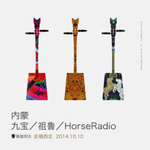

走唱·西北 内蒙九宝乐队专场章鱼现场“走唱·西北”系列演出 第三场
============================

|  |  |
| :--: | :-- |
| [ 走唱·西北 内蒙九宝乐队专场章鱼现场“走唱·西北”系列演出 第三场](https://emumo.xiami.com/album/1416474139) | **艺人**: [九宝乐队](../index.md) **语种**: 蒙古语 **唱片公司**: 章鱼现场, Nine Treasures **发行时间**: 2014年10月10日 **专辑类别**: 现场专辑 **专辑风格**: 民谣金属 Folk Metal **播放数**: 782049 **收藏数**: 803 **评论数**: 50  |

## 简介

IIIIIIIIIIIIIIIIIIIIIIIIIIIIIIIIIIIIIIIIIIIIIIIIIIIIIIIIIIII 虾米音乐人·独家首发 IIIIIIIIIIIIIIIIIIIIIIIIIIIIIIIIIIIIIIIIIIIIIIIIIIIIIIIIIIII

 『章鱼现场』走唱·西北第三场——内蒙新声 九宝/祖鲁/HorseRadio 专场：

 时间：2014年10月10日 

 地点：麻雀瓦舍 

 「走唱·西北」 

 每一个西北人的心中，都有一座西北的城。 

 粗犷，辽阔，苍凉。 

 戈壁，黄土，烈日。 

 那是别人的西北。 

 热情，朴实，家乡话。 

 风烈，酒浓，人情厚。 

 这是西北人的西北。

 西北人的西北，没有鳞次栉比的摩天大楼，只有清晨出门时吆喝问好的老街坊。   西北人的西北，没有满街开店的老马拉面，只有楼下香气四溢馋死人的牛肉面。   西北人的西北，没有帝都魔都的光速运转，只有凌晨两点还喝酒吃肉的自由心。     走，让真正的西北人带你领略纯正的西北风情。   唱，让醉人的西北歌帮离乡的你找回西北味道。     「走唱·西北」   西北城，西北人，西北歌。   属于每个人的西北。     「内蒙新声」   三支乐队、三种风格、三重体验！   最年轻的新生力量，最突破的音乐尝试！   来自内蒙大地的三支摇滚新军，带来最震撼的音乐现场体验！     辽阔如草原，迅疾如雄鹰。 内蒙大地身处边疆却人才济济。而摇滚乐，也在这片苍茫的大地上生根发芽，汇聚成属于内蒙自己的摇滚草原。在这片摇滚的草原上，也生长着许多朝气蓬勃的年轻乐队。     「 九宝（Nine Treasures）乐队」     九宝是来自草原的金属力量。在乐队成立之后，九宝频繁的舞台活动也为他们赢得了大量的曝光和来自业内、歌迷的一致好评。     与传统金属乐不同，九宝善于将中国传统民族音乐融入到西方金属乐之中，产生极具冲击力的听觉享受。让人体验到金戈铁马、铁蹄阵阵的呼啸之势。作为中国金属乐的代表，九宝参加了2013年德国 Wacken 金属音乐节，也为中国的金属音乐在世界上赢得了荣誉。   

## 曲目

## 评论

|  |  |  |
| :-- | :-- | :-- |
|  [虾米用户](https://emumo.xiami.com/u/893917)  2020-11-19 15:17 赞(0) 踩(0) | 
没有sonsii了？！
 |
|  [虾米用户](https://emumo.xiami.com/u/435438832)  2020-04-16 12:07 赞(0) 踩(0) | 
章鱼现场 走唱&amp;middot;西北 系列演出之内蒙主题&amp;mdash;&amp;mdash;第三场 九宝专场 【时间】2014年10月10日 【地点】北京&amp;middot;麻雀瓦舍 【全场高清视频】<a href="http://www.letv.com/ptv/vplay/21136716.html" target="_blank" rel="nofollow noreferrer noopener">http://www.letv.com/ptv/vplay/21136716.html</a>
 |
|  [虾米用户](https://emumo.xiami.com/u/266408067)  2020-02-16 21:02 赞(0) 踩(0) | 
牛逼！
 |
|  [虾米用户](https://emumo.xiami.com/u/19727917)  2019-12-13 09:05 赞(0) 踩(0) | 
民族摇滚听起来感觉很很爽，加油！期待更棒的作品！
 |
|  [虾米用户](https://emumo.xiami.com/u/43786570)  2019-11-29 22:45 赞(0) 踩(0) | 
牛
 |
|  [虾米用户](https://emumo.xiami.com/u/288632945) 吾神克鲁苏 2019-09-13 13:42 赞(0) 踩(0) | 
爱了
 |
|  [虾米用户](https://emumo.xiami.com/u/50343012)  2019-09-07 09:55 赞(1) 踩(0) | 
国内摇滚的一股清流
 |
|  [虾米用户](https://emumo.xiami.com/u/48501718) 我还没想好要写什么... 2019-09-07 09:03 赞(0) 踩(0) | 
豪气冲天！
 |
|  [虾米用户](https://emumo.xiami.com/u/348284590)  2019-07-21 00:29 赞(1) 踩(0) | 
最先听到九宝的歌是在网上看到的视频，深深的吸引了我。最后终于虾米找到了，好听，震撼！关键是整个专辑都特牛！！！
 |
|  [虾米用户](https://emumo.xiami.com/u/95202706)  2019-06-09 11:08 赞(0) 踩(0) | 
民族的才是世界的
 |
|  [虾米用户](https://emumo.xiami.com/u/411232669)  2019-04-17 12:40 赞(1) 踩(0) | 
喜欢这种风格
 |
|  [虾米用户](https://emumo.xiami.com/u/47357376)  2019-03-18 19:25 赞(0) 踩(0) | 
******
 |
|  [虾米用户](https://emumo.xiami.com/u/317057431)  2019-02-27 20:20 赞(0) 踩(0) | 
现场录音效果不太好 但现场的感觉真是不一样
 |
|  [虾米用户](https://emumo.xiami.com/u/3562722) ~ 2019-02-25 11:22 赞(0) 踩(0) | 
听着九宝的歌跑步果然带感，难怪有人一听甩碎石膏，一骑绝尘，到现在都还没找到人
 |
|  [虾米用户](https://emumo.xiami.com/u/354469108)  2018-04-08 11:17 赞(3) 踩(0) | 
酣畅淋漓。。连我两岁不到的儿子听了都HIGH到停不下来！！！
 |
|  [虾米用户](https://emumo.xiami.com/u/43492923) 行到水穷我才开始害怕，夕... 2018-04-03 17:04 赞(0) 踩(0) | 
&amp;phi;
 |
|  [虾米用户](https://emumo.xiami.com/u/8337431) 以乐会友 2017-10-19 02:03 赞(0) 踩(0) | 
经典现场
 |
|  [虾米用户](https://emumo.xiami.com/u/8337431) 以乐会友 2017-10-19 01:14 赞(0) 踩(0) | 
蒙古九宝34
 |
|  [虾米用户](https://emumo.xiami.com/u/47776922) 小马，你以前不是这样的 2017-08-15 20:00 赞(0) 踩(0) | 
除了牛逼 我乔峰还能说什么
 |
|  [虾米用户](https://emumo.xiami.com/u/15263579) ~~~ 2017-06-15 21:17 赞(0) 踩(0) | 
护犊子五星
 |
|  [虾米用户](https://emumo.xiami.com/u/47357376)  2017-04-25 19:51 赞(0) 踩(0) | 
******
 |
|  [虾米用户](https://emumo.xiami.com/u/47357376)  2017-04-18 22:46 赞(0) 踩(0) | 
******
 |
|  [虾米用户](https://emumo.xiami.com/u/47357376)  2017-04-18 21:26 赞(0) 踩(0) | 
******
 |
|  [虾米用户](https://emumo.xiami.com/u/43714694) WeChat：96529... 2017-03-04 23:22 赞(0) 踩(0) | 
吱/音
 |
|  [虾米用户](https://emumo.xiami.com/u/28299938) 我还没想好要写什么... 2016-08-26 11:19 赞(0) 踩(0) | 
忒好听了
 |
|  [虾米用户](https://emumo.xiami.com/u/13620198) 我还没想好要写什么... 2016-05-06 13:06 赞(0) 踩(0) | 
牛逼不解释
 |
|  [虾米用户](https://emumo.xiami.com/u/52557647)  2015-10-18 15:49 赞(0) 踩(0) | 
今天才认识这张专辑，囧。大赞！
 |
|  [虾米用户](https://emumo.xiami.com/u/34024776)  2015-09-20 19:26 赞(0) 踩(0) | 
太棒了！为国人挣脸！
 |
|  [虾米用户](https://emumo.xiami.com/u/49495013)  2015-08-29 21:56 赞(0) 踩(0) | 

 |
|  [虾米用户](https://emumo.xiami.com/u/10130399)  2015-07-30 16:21 赞(1) 踩(0) | 
一个字，爽！
 |
|  [虾米用户](https://emumo.xiami.com/u/45839018)  2015-06-28 18:34 赞(0) 踩(0) | 
这盘能买到吗
 |
|  [虾米用户](https://emumo.xiami.com/u/45839018)  2015-06-28 18:30 赞(0) 踩(0) | 
cd有吗
 |
|  [虾米用户](https://emumo.xiami.com/u/44577674)  2015-04-27 16:34 赞(2) 踩(0) | 
真给内蒙古人长脸！ 民族乐队超赞！！喜欢！！！！！！！！！！
 |
|  [虾米用户](https://emumo.xiami.com/u/49362042) 快乐其实很简单：你和我，... 2015-04-19 09:04 赞(0) 踩(0) | 

 |
|  [虾米用户](https://emumo.xiami.com/u/8668527)  2015-04-12 22:56 赞(0) 踩(0) | 
牛逼！
 |
|  [虾米用户](https://emumo.xiami.com/u/212578) 金属之声 2015-02-18 11:57 赞(0) 踩(0) | 
来云南大理啊。好期盼。
 |
|  [虾米用户](https://emumo.xiami.com/u/45248673)   2014-12-24 19:14 赞(0) 踩(0) | 
挺好
 |
|  [虾米用户](https://emumo.xiami.com/u/40843045) 做不一样的现场演出 2014-12-24 14:23 赞(11) 踩(0) | 
章鱼现场「走唱·西北」系列演出之内蒙主题——内蒙新声专场 【时间】2014年10月10日 【地点】北京·麻雀瓦舍 【全场高清视频】<a href="http://www.letv.com/ptv/vplay/21136716.html" target="_blank" rel="nofollow noreferrer noopener">http://www.letv.com/ptv/vplay/21136716.html</a>
 |
|  [虾米用户](https://emumo.xiami.com/u/1353919) goodnight 2014-12-11 19:17 赞(0) 踩(0) | 
内容已删除
 |
| ⇒ |  [虾米用户](https://emumo.xiami.com/u/917080)  2015-01-04 21:53 赞(0) 踩(0) | 
赞！
 |
| ⇒ |  [虾米用户](https://emumo.xiami.com/u/1715794) 今天你甩了吗 2015-04-11 14:58 赞(0) 踩(0) | 
不错
 |
|  [虾米用户](https://emumo.xiami.com/u/28892475)   2014-12-11 07:52 赞(0) 踩(0) | 
是西安现场吗？  我感觉像是呢天在光圈听的
 |
| ⇒ |  [虾米用户](https://emumo.xiami.com/u/1353919) goodnight 2014-12-11 19:16 赞(0) 踩(0) | 
不是，是在北京麻雀瓦舍
 |
|  [虾米用户](https://emumo.xiami.com/u/40291405)   2014-12-03 18:48 赞(0) 踩(0) | 
喜欢没道理
 |
|  [虾米用户](https://emumo.xiami.com/u/29065032)  2014-11-22 19:46 赞(0) 踩(0) | 
九宝的现场很棒！
 |
|  [虾米用户](https://emumo.xiami.com/u/6733300) 誩 2014-11-21 08:02 赞(0) 踩(0) | 

 |
|  [虾米用户](https://emumo.xiami.com/u/6053083) 很不高兴为您服务 2014-11-20 23:29 赞(0) 踩(0) | 
带感
 |
|  [虾米用户](https://emumo.xiami.com/u/30752796) 我还没想好要写什么... 2014-11-20 21:25 赞(0) 踩(0) | 
好像那谁没来呀？
 |
|  [虾米用户](https://emumo.xiami.com/u/10813478) 黑白分明该杀就杀 2014-11-20 20:32 赞(0) 踩(0) | 
＠_＠
 |
|  [虾米用户](https://emumo.xiami.com/u/28291455) 2019不自闭 2014-11-20 20:20 赞(0) 踩(0) | 
已阅
 |
|  [虾米用户](https://emumo.xiami.com/u/543497) 我聽這種音樂的時候最愛你 2014-11-20 19:00 赞(0) 踩(0) | 
過癮
 |
