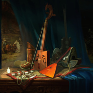

十丈铜嘴(重新缩混版)Arvan Ald Guulin Honshoor
============================

|  |  |
| :--: | :-- |
| [ 十丈铜嘴(重新缩混版)Arvan Ald Guulin Honshoor](https://emumo.xiami.com/album/2100243564) | **艺人**: [九宝乐队](../index.md) **语种**: 其他 **唱片公司**: 独立发行 **发行时间**: 2015年10月21日 **专辑类别**: 录音室专辑 **专辑风格**: 民谣金属 Folk Metal **播放数**: 64803 **收藏数**: 126 **评论数**: 32  |

## 简介

十丈铜嘴重新缩混版

## 曲目

## 评论

|  |  |  |
| :-- | :-- | :-- |
|  [虾米用户](https://emumo.xiami.com/u/446038702)  2020-11-19 00:41 赞(0) 踩(0) | 
重制版依旧令人期待
 |
|  [虾米用户](https://emumo.xiami.com/u/30074304) 天阶夜色凉如水，坐看牵牛... 2020-11-18 11:14 赞(0) 踩(0) | 
✈
 |
|  [虾米用户](https://emumo.xiami.com/u/268017953) 冬去春来 2020-08-04 21:00 赞(0) 踩(0) | 
如同饮酒后草原马背上奔驰的畅快。
 |
|  [虾米用户](https://emumo.xiami.com/u/357272933)  2020-04-01 00:30 赞(0) 踩(0) | 
牛逼
 |
|  [虾米用户](https://emumo.xiami.com/u/125078616) 听歌吧，别想太多。 2019-04-23 07:44 赞(1) 踩(0) | 
封面五星 
 |
|  [虾米用户](https://emumo.xiami.com/u/325875518) 大闹天宫 2019-02-13 20:37 赞(0) 踩(0) | 
非常不错
 |
|  [虾米用户](https://emumo.xiami.com/u/334452982) 矫情 2018-02-21 09:38 赞(1) 踩(0) | 
摇滚多样化发展
 |
|  [虾米用户](https://emumo.xiami.com/u/18053629)  2016-06-19 20:43 赞(0) 踩(0) | 
我宝歌曲名字怎么取得？
 |
|  [虾米用户](https://emumo.xiami.com/u/27224237) 永远在寻找能唤醒我耳朵的... 2015-12-18 10:19 赞(1) 踩(0) | 
♥
 |
|  [虾米用户](https://emumo.xiami.com/u/28038879) 低 2015-12-17 00:27 赞(1) 踩(0) | 
九宝现场太赞
 |
|  [虾米用户](https://emumo.xiami.com/u/34270523)  2015-12-12 01:47 赞(1) 踩(0) | 
在现场火速收了一张！  
 |
|  [虾米用户](https://emumo.xiami.com/u/6358975) 小粉菌 2015-12-11 11:13 赞(0) 踩(0) | 
低音好好听啊
 |
|  [虾米用户](https://emumo.xiami.com/u/22331666)  2015-12-10 20:37 赞(0) 踩(0) | 
留字
 |
|  [虾米用户](https://emumo.xiami.com/u/2641341) Metal Lover 2015-12-08 19:32 赞(0) 踩(0) | 
吉他、鼓还有低音最突出，重很多，有些地方有点不和谐
 |
|  [虾米用户](https://emumo.xiami.com/u/30800139) 我在低俗与高雅间活的很尴... 2015-12-05 17:00 赞(0) 踩(0) | 
。
 |
|  [虾米用户](https://emumo.xiami.com/u/37977)   2015-12-04 23:23 赞(1) 踩(0) | 
封面赞
 |
|  [虾米用户](https://emumo.xiami.com/u/29330915)   2015-12-04 22:45 赞(0) 踩(0) | 
哦，过
 |
|  [虾米用户](https://emumo.xiami.com/u/6551425)  降落 2015-12-03 16:04 赞(0) 踩(0) | 
歌名是啥意思啊
 |
| ⇒ |  [虾米用户](https://emumo.xiami.com/u/50685388)  2016-06-27 21:37 赞(0) 踩(0) | 
“草原上生活这一家牧户：父母与两个孩子，一个姐姐一个弟弟。不幸的是有一天，姐姐突然被妖怪附身成为了举止怪异的人，每天吃家里的牲畜。爸爸经常在她放羊的时候能远远看到姐姐吃羊，明白姐姐已经变成为了妖怪，就和老伴儿商量，我们两口子够呛可以跑得动，一定要让孩子赶紧跑吧。于是和弟弟说，你的姐姐变成了妖怪，家里有两匹马，你要骑着它们一只跑，一直跑到两匹马再也跑不动为止，到时候你就会遇见一家人，就在那户人家歇着吧。年轻的弟弟赶紧骑着马跑，果然两匹马都跑不动的时候看见了一户人家，这家人是一对老夫妇，膝下无子，就对弟弟说，多可怜的孩子啊，当我们的儿子吧。弟弟住下之后格外思念父母，很想前往家里一探究竟，也许姐姐又变回了人？也许父母也都在？这么想的时候，老夫妇看出了他的心思，也同意他回去看看。临走时给了他三样东西：一面镜子、一把梳子和一个钗子。告诉他如果有危险就可以用它们。”  “弟弟骑马回去，远远地就看见父母的尸体高高的悬挂在蒙古包的外面，伤心欲绝的他正要落泪，突然听见姐姐清脆又甜美的声音，啊，亲爱的弟弟回来了。一惊之下他回头看见成了妖怪的姐姐正在蒙古包的门口，身形由于贪吃变得肥硕，长长的头发垂到了地上，形状可怖。他急忙跑向马匹跳上去骑马狂奔，谁料到，妖怪姐姐此刻冲了出来，在后面边追边用手抓马尾巴，眼看着就要抓住的时候，弟弟猛然想起老夫妇给的三样东西，就掏出了镜子向后一扔，镜子落地之后立刻变成了符文困住了姐姐，一心想吃弟弟的姐姐挣脱之后又迅速追赶，弟弟接着又抛出了梳子。梳子落地之后变成了矮小的灌木丛，将身体肥硕的姐姐挤在了灌木丛里，长长的头发也被灌木丛紧紧缠绕，姐姐在里面又气又急，但依然挣脱了出来。弟弟的手里只有一把钗子了，只好把希望全都寄托在钗子上面。钗子落地之后立刻变成了一个高耸入云的巨树，弟弟赶紧下马爬了上去，此时的妖怪姐姐已经从灌木丛里挣脱了出来，见状后立刻化身为十丈铜嘴，开始啃食巨树，每一下都让巨树往下沉，眼见着巨树就要被啃完，弟弟危在旦夕。此刻突然从前面跑出了两条蒙古狗，正是老夫妇养的蒙古狗，老夫妇担心弟弟遇到不测，也担心三样法宝无法制服妖怪，就派了两条狗跟了上来。这两条狗一条叫哈萨尔，一条叫巴萨尔。两条勇猛的蒙古狗见到十丈铜嘴迅速扑了上去，将妖怪姐姐不断撕咬，弟弟获救了。从此之后，弟弟和老夫妇一直平静的生活着。”
 |
| ⇒ |  [虾米用户](https://emumo.xiami.com/u/25615307)  2016-10-04 20:49 赞(0) 踩(0) | 
<q><b>远古的孩子说：</b></q>
 |
|  [虾米用户](https://emumo.xiami.com/u/34243810) 音乐之灵魂解药 2015-12-03 13:55 赞(0) 踩(0) | 
这个好听
 |
|  [虾米用户](https://emumo.xiami.com/u/11395422)  2015-12-03 13:32 赞(0) 踩(0) | 
间奏那里明显比原来好啦！赞！
 |
|  [虾米用户](https://emumo.xiami.com/u/36865066) 脾气很好 2015-12-03 13:26 赞(0) 踩(0) | 
下午老师叫我唱歌我可以的！
 |
|  [虾米用户](https://emumo.xiami.com/u/34510256) 我还没想好要写什么... 2015-12-03 12:36 赞(1) 踩(0) | 
holy high
 |
|  [虾米用户](https://emumo.xiami.com/u/36897148) 再见 2015-12-03 09:50 赞(0) 踩(0) | 
封面好
 |
|  [虾米用户](https://emumo.xiami.com/u/28291455) 2019不自闭 2015-12-03 09:33 赞(0) 踩(0) | 
.
 |
|  [虾米用户](https://emumo.xiami.com/u/2360737) hory doly po... 2015-12-03 08:29 赞(0) 踩(0) | 
撸
 |
|  [虾米用户](https://emumo.xiami.com/u/37125338) 我听这种音乐的时候最爱你 2015-12-02 20:15 赞(0) 踩(0) | 
低频轰隆隆地来了
 |
|  [虾米用户](https://emumo.xiami.com/u/6053083) 很不高兴为您服务 2015-12-02 20:11 赞(0) 踩(0) | 
吉他清晰 漂亮！！！
 |
|  [虾米用户](https://emumo.xiami.com/u/10813478) 黑白分明该杀就杀 2015-12-02 20:06 赞(0) 踩(0) | 
か
 |
|  [虾米用户](https://emumo.xiami.com/u/6053083) 很不高兴为您服务 2015-12-02 20:04 赞(0) 踩(0) | 
这样啊
 |
|  [虾米用户](https://emumo.xiami.com/u/2952413) 我还没想好要写什么... 2015-12-02 19:36 赞(0) 踩(0) | 
吼啊
 |
