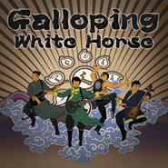

奔驰的白马Galloping White Horse
============================

|  |  |
| :--: | :-- |
| [ 奔驰的白马Galloping White Horse](https://emumo.xiami.com/album/2100243572) | **艺人**: [九宝乐队](../index.md) **语种**: 其他 **唱片公司**: 独立发行 **发行时间**: 2015年01月15日 **专辑类别**: EP, 单曲 **专辑风格**: 民谣金属 Folk Metal **播放数**: 59431 **收藏数**: 117 **评论数**: 30  |

## 简介

九宝乐队2015年最新EP
 

 

 

 

 

 

 

 

 

 

 

 

 

 

 

 

 

 

 

 

 

 

 

 

 

 

 

 

 

 

 

 

 

 

 

 

 

 

 

 

 

 

 

 

 

 

 

 

 

 

 

 

 

 

 

 

 

 

 

 

 

 

 

 

 

 

 

 

 

 

 

 

 

 

 

 

 

 

 

 

 

 

 

 

 

 

 

 

 

 

 

 

 

 

 

 

 

 

 

 

 

 

 

 

 

 

 

 

 

 

 

 

 

 

 

 

 

 

 

 

 

 

 

 

 

 

 

 

 

 

 

 

 

 

 

 

 

 

 

 

 

 

 

 

 

 

 

 

 

 

 

 

 

 

 

 

 

 

 

 

 

 

 

 

 

 

 

 

 

 

 

 

 

 

 

 

 

 

 

 

 

 

 

 

 

 

 

 

 

 

 

 

 

 

 

 

 

 

 

 

 

 

 

 

 

 

 

 

 

 

 

 

 

 

 

 

 

 

 

 

 

 

 

 

 

 

 

 

 

 

 

 

 

 

 

 

 

 

 

 

 

 

 

 

 

 

 

 

 

 

 

 

 

 

 

 

 

 

 

 

 

 

 

 

 

 

 

 

 

 

 

 

 

 

 

 

 

 

 

 

 

 

 

 

 

 

 

 

 

 

 

 

 

 

 

 

 

 

 

 

 

 

 

 

 

 

 

 

 

 

 

 

 

 

 

 

 

 

 

 

 

 

 

 

 

 

 

 

 

 

 
 

 

 

 

 

 

 

 

 

 

 

 

 

 

 

 

 

 

 

 

 

 

 

 

 

 

 

 

 

 

 

 

 

 

 

 

 

 

 

 

 

 

 

 

 

 

 

 

 

 

 

 

 

 

 

 

 

 

 

 

 

 

 

 

 

 

 

 

 

 

 

 

 

 

 

 

 

 

 

 

 

 

 

 

 

 

 

 

 

 

 

 

 

 

 

 

 

 

 

 

 

 

 

 

 

 

 

 

 

 

 

 

 

 

 

 

 

 

 

 

 

 

 

 

 

 

 

 

 

 

 

 

 

 

 

 

 

 

 

 

 

 

 

 

 

 

 

 

 

 

 

 

 

 

 

 

 

 

 

 

 

 

 

 

 

 

 

 

 

 

 

 

 

 

 

 

 

 

 

 

 

 

 

 

 

 

 

 

 

 

 

 

 

 

 

 

 

 

 

 

 

 

 

 

 

 

 

 

 

 

 

 

 

 

 

 

 

 

 

 

 

 

 

 

 

 

 

 

 

 

 

 

 

 

 

 

 

 

 

 

 

 

 

 

 

 

 

 

 

 

 

 

 

 

 

 

 

 

 

 

 

 

 

 

 

 

 

 

 

 

 

 

 

 

 

 

 

 

 

 

 

 

 

 

 

 

 

 

 

 

 

 

 

 

 

 

 

 

 

 

 

 

 

 

 

 

 

 

 

 

 

 

 

 

 

 

 

 

 

 

 

 

 

 

 

 

 

 

 

## 曲目

## 评论

|  |  |  |
| :-- | :-- | :-- |
|  [虾米用户](https://emumo.xiami.com/u/358614424)  2019-12-31 13:45 赞(0) 踩(0) | 
舒服
 |
|  [虾米用户](https://emumo.xiami.com/u/419390911)  2019-12-03 20:48 赞(0) 踩(0) | 
满分！
 |
|  [虾米用户](https://emumo.xiami.com/u/285597490)  2019-07-17 22:01 赞(0) 踩(0) | 
没什么可说的
 |
|  [虾米用户](https://emumo.xiami.com/u/413007737)  2019-05-13 08:00 赞(0) 踩(0) | 
曲风结合了蒙古的传统音乐和新金属摇滚！
 |
|  [虾米用户](https://emumo.xiami.com/u/125802280)  2019-04-07 09:47 赞(0) 踩(0) | 
喜欢
 |
|  [虾米用户](https://emumo.xiami.com/u/2259353) raziyekurban 2017-10-28 00:01 赞(2) 踩(0) | 
“我的白马呦，撩开你的长鬃，舞起你的四蹄快些跑，将我带到情人旁，见到情人那一刻，我会取下嚼子，解下鞍子让你自由撒欢得解放”。。。。。。这首歌让我想起了著名的维吾尔民歌。。
 |
|  [虾米用户](https://emumo.xiami.com/u/8337431) 以乐会友 2017-10-19 01:15 赞(0) 踩(0) | 
24
 |
|  [虾米用户](https://emumo.xiami.com/u/1742487)  2016-07-08 14:23 赞(0) 踩(0) | 
名族的东西很好啊。
 |
|  [虾米用户](https://emumo.xiami.com/u/27224237) 永远在寻找能唤醒我耳朵的... 2015-12-18 10:19 赞(0) 踩(0) | 
♥
 |
|  [虾米用户](https://emumo.xiami.com/u/2641341) Metal Lover 2015-12-08 19:26 赞(2) 踩(0) | 
奔驰的白马第一次是在现场听的，还不错。through pain的编曲一般，如出一辙，似曾相识。期待全长专辑！！
 |
| ⇒ |  [虾米用户](https://emumo.xiami.com/u/14437329) 让一让，母牛们,生命短暂... 2015-12-11 21:44 赞(0) 踩(0) | 
对的，九宝感觉编曲都太相似了。 不过九宝现场超级好玩又好听。
 |
| ⇒ |  [虾米用户](https://emumo.xiami.com/u/2641341) Metal Lover 2015-12-11 23:42 赞(0) 踩(0) | 
<q><b>北卡说：</b></q>
 |
| ⇒ |  [虾米用户](https://emumo.xiami.com/u/29926485) 做一个懂得分享的鬼。 2016-01-06 18:29 赞(0) 踩(0) | 
<q><b>北卡说：</b></q>
 |
|  [虾米用户](https://emumo.xiami.com/u/1031) asca.lu 2015-12-03 15:12 赞(0) 踩(0) | 
虽然听不懂，但感觉好厉害。
 |
|  [虾米用户](https://emumo.xiami.com/u/8135538)  2015-12-02 23:15 赞(0) 踩(0) | 
来了！
 |
|  [虾米用户](https://emumo.xiami.com/u/30800139) 我在低俗与高雅间活的很尴... 2015-12-02 22:57 赞(2) 踩(0) | 
ıllıllıı这̤̤̈̈个̤̤̈̈封̤̤̈̈面̤̤̈̈还̤̤̈̈真̤̤̈̈有̤̤̈̈点̤̤̈̈大̤̤̈̈闹̤̤̈̈天̤̤̈̈宫̤̤̈̈的̤̤̈̈赶̤̤̈̈脚̤̤̈̈llıllı
 |
|  [虾米用户](https://emumo.xiami.com/u/4400366) 再也不见 2015-12-02 22:54 赞(0) 踩(0) | 
囍
 |
|  [虾米用户](https://emumo.xiami.com/u/2360737) hory doly po... 2015-12-02 22:44 赞(0) 踩(0) | 
撸
 |
|  [虾米用户](https://emumo.xiami.com/u/40872947) 不善言谈 却爱跟对味er... 2015-12-02 22:19 赞(0) 踩(0) | 
酷
 |
|  [虾米用户](https://emumo.xiami.com/u/50598816) ꡛꡖꡞ7 2015-12-02 21:44 赞(0) 踩(0) | 
最喜欢马头琴和电吉他声音融合在一起的效果
 |
|  [虾米用户](https://emumo.xiami.com/u/15900712) Sick 2015-12-02 21:31 赞(0) 踩(0) | 
#
 |
|  [虾米用户](https://emumo.xiami.com/u/28291455) 2019不自闭 2015-12-02 20:58 赞(0) 踩(0) | 
呦
 |
|  [虾米用户](https://emumo.xiami.com/u/3592527)  2015-12-02 20:57 赞(2) 踩(0) | 
封面画瘦了。
 |
|  [虾米用户](https://emumo.xiami.com/u/46906455) I just a Mon... 2015-12-02 20:43 赞(0) 踩(0) | 
[带墨镜笑]
 |
|  [虾米用户](https://emumo.xiami.com/u/43547256) 感觉不会乱来 2015-12-02 20:36 赞(0) 踩(0) | 
燥！
 |
|  [虾米用户](https://emumo.xiami.com/u/22331666)  2015-12-02 20:33 赞(0) 踩(0) | 
留字
 |
|  [虾米用户](https://emumo.xiami.com/u/13180134) 敲丫挺的 2015-12-02 20:26 赞(0) 踩(0) | 

 |
|  [虾米用户](https://emumo.xiami.com/u/10813478) 黑白分明该杀就杀 2015-12-02 20:04 赞(0) 踩(0) | 
か
 |
|  [虾米用户](https://emumo.xiami.com/u/6053083) 很不高兴为您服务 2015-12-02 20:01 赞(0) 踩(0) | 
哦
 |
|  [虾米用户](https://emumo.xiami.com/u/3726804)  2015-12-02 20:01 赞(0) 踩(0) | 
赞
 |
