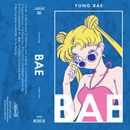

Bae
============================

|  |  |
| :--: | :-- |
| [ Bae](https://emumo.xiami.com/album/2018641920) | **艺人**: [YUNG BAE](../index.md) **语种**: 英语 **唱片公司**: Neoncity Records **发行时间**: 2018年06月01日 **专辑类别**: 录音室专辑 **专辑风格**: 蒸汽波 Vaporwave **播放数**: 1264011 **收藏数**: 1315 **评论数**: 90  |

## 简介

## 曲目

## 评论

|  |  |  |
| :-- | :-- | :-- |
|  [虾米用户](https://emumo.xiami.com/u/376999613)  2020-10-12 11:55 赞(1) 踩(0) | 
看日本动漫变老的阿姨 也爱听
 |
|  [虾米用户](https://emumo.xiami.com/u/42923571)  2020-07-31 16:35 赞(0) 踩(0) | 
各方面都很行
 |
|  [虾米用户](https://emumo.xiami.com/u/52056952) 人生即是到來、相遇、陪伴... 2019-07-29 17:14 赞(0) 踩(0) | 

 |
|  [虾米用户](https://emumo.xiami.com/u/47734998) 我还没想好要写什么... 2019-05-07 21:06 赞(0) 踩(0) | 
可爱
 |
|  [虾米用户](https://emumo.xiami.com/u/10052552)  2019-04-21 22:39 赞(0) 踩(0) | 
奇怪，去年发布的怎么会有4年前的评论？
 |
| ⇒ |  [虾米用户](https://emumo.xiami.com/u/159588) 最美的风景，就是我们头顶... 2019-05-27 01:13 赞(0) 踩(0) | 
就是，在四年之前被网友发布过一次，然后被删，又在去年复活
 |
|  [虾米用户](https://emumo.xiami.com/u/346165752)  2019-03-25 20:18 赞(0) 踩(0) | 
。
 |
|  [虾米用户](https://emumo.xiami.com/u/175885)   2019-03-08 02:42 赞(0) 踩(0) | 
刚从Arkham肥来 
 |
|  [虾米用户](https://emumo.xiami.com/u/701873) Less is More 2019-02-18 10:50 赞(1) 踩(0) | 
感觉到四五十岁还是会喜欢✨
 |
|  [虾米用户](https://emumo.xiami.com/u/344921170) Farewell 2018-11-01 18:45 赞(0) 踩(0) | 
我想保存原封面的..居然换了！
 |
|  [虾米用户](https://emumo.xiami.com/u/320736068)  2018-10-06 08:37 赞(0) 踩(0) | 
五星
 |
|  [虾米用户](https://emumo.xiami.com/u/349659834) 身披浴血的蔷薇 2018-07-24 11:31 赞(0) 踩(0) | 

 |
|  [虾米用户](https://emumo.xiami.com/u/339191478)   2018-07-08 10:46 赞(0) 踩(0) | 
： ）
 |
|  [虾米用户](https://emumo.xiami.com/u/8697915)  2018-07-03 23:14 赞(0) 踩(0) | 
略屌。。
 |
|  [虾米用户](https://emumo.xiami.com/u/22444238) 邱比已搬移至网易云音乐  2018-06-29 22:49 赞(20) 踩(0) | 
Get
 |
| ⇒ |  [虾米用户](https://emumo.xiami.com/u/16040169) 感受。世界~ 2019-04-19 01:20 赞(0) 踩(0) | 
我和邱比比较同类
 |
|  [虾米用户](https://emumo.xiami.com/u/16337726)  2018-06-25 14:04 赞(0) 踩(0) | 
)
 |
|  [虾米用户](https://emumo.xiami.com/u/209408228) 我还没想好要写什么... 2018-06-25 00:05 赞(1) 踩(0) | 
蒸汽波是虾米抛弃的领域么&amp;hellip;
 |
|  [虾米用户](https://emumo.xiami.com/u/6049347)  2018-06-15 15:51 赞(0) 踩(0) | 
换了封面了居然
 |
|  [虾米用户](https://emumo.xiami.com/u/7904288) ✖╹◡╹✖ 2018-06-14 13:08 赞(2) 踩(0) | 
喜歡以前的封面 
 |
|  [虾米用户](https://emumo.xiami.com/u/353250231) ... 2018-06-08 12:43 赞(0) 踩(0) | 
&amp;hearts;
 |
|  [虾米用户](https://emumo.xiami.com/u/31501246) weibo:RocheM... 2018-06-08 10:44 赞(1) 踩(0) | 
太懒了
 |
| ⇒ |  [虾米用户](https://emumo.xiami.com/u/1206707) Easy Mind 新曲... 2018-07-13 23:10 赞(0) 踩(0) | 
同意，会是容易讨巧的音乐，但对原创性表示疑问，我会理解为DJ为在夜店播放而制作的Remix音乐。
 |
| ⇒ |  [虾米用户](https://emumo.xiami.com/u/31501246) weibo:RocheM... 2018-07-13 23:12 赞(0) 踩(0) | 
<q><b>Easy Mind说：</b></q>
 |
| ⇒ |  [虾米用户](https://emumo.xiami.com/u/1206707) Easy Mind 新曲... 2018-07-13 23:16 赞(0) 踩(0) | 
<q><b>Modus说：</b></q>
 |
|  [虾米用户](https://emumo.xiami.com/u/46583488)  2018-06-04 16:37 赞(0) 踩(0) | 
修改封面完成！(〃ﾟ3ﾟ〃)
 |
|  [虾米用户](https://emumo.xiami.com/u/33512641) call me now,... 2018-06-01 23:29 赞(0) 踩(0) | 
磁带已拿 2018.6.1
 |
|  [虾米用户](https://emumo.xiami.com/u/52415194) ♬♩♫♪♡ 2018-03-16 18:58 赞(0) 踩(0) | 
ᵕ᷄≀ ̠˘᷅
 |
|  [虾米用户](https://emumo.xiami.com/u/20147189) 嘘 2018-03-08 14:21 赞(1) 踩(0) | 
砖封满分
 |
|  [虾米用户](https://emumo.xiami.com/u/298022288)  2018-01-11 13:40 赞(3) 踩(0) | 
☁ 常 聽 的 一 張 專 ☁
 |
|  [虾米用户](https://emumo.xiami.com/u/8070377) 爱雾瑞性维欧腐漏 2017-09-26 10:18 赞(2) 踩(0) | 

 |
|  [虾米用户](https://emumo.xiami.com/u/6049347)  2017-09-24 21:17 赞(1) 踩(0) | 
我最苦逼最圆满最幸福的15年！
 |
|  [虾米用户](https://emumo.xiami.com/u/51627949) 大学生，求音乐同好 2017-08-16 19:14 赞(0) 踩(0) | 
也许这就是赛博朋克式浪漫吧
 |
|  [虾米用户](https://emumo.xiami.com/u/42810132) Aprés l'amou... 2017-06-12 16:45 赞(0) 踩(0) | 
何厚铧
 |
|  [虾米用户](https://emumo.xiami.com/u/11046721) Spotify：Unwi... 2017-05-20 01:57 赞(0) 踩(0) | 
x
 |
|  [虾米用户](https://emumo.xiami.com/u/50812128) 网易finefrance... 2017-05-10 15:04 赞(0) 踩(0) | 
：D
 |
|  [虾米用户](https://emumo.xiami.com/u/2885416) 有缘再见 2017-04-26 05:48 赞(1) 踩(0) | 
封面好搞哈哈哈哈
 |
|  [虾米用户](https://emumo.xiami.com/u/264283064) bye  2017-01-31 12:00 赞(1) 踩(0) | 
△
 |
|  [虾米用户](https://emumo.xiami.com/u/12930904) 月亮与六便士 2016-11-06 21:23 赞(0) 踩(0) | 
❤
 |
|  [虾米用户](https://emumo.xiami.com/u/43547593) ♡ 2016-10-27 14:38 赞(0) 踩(0) | 
@
 |
|  [虾米用户](https://emumo.xiami.com/u/2070020) 我还没想好要写什么... 2016-09-29 12:14 赞(0) 踩(0) | 
good
 |
|  [虾米用户](https://emumo.xiami.com/u/42772815) meh 2016-09-29 07:57 赞(0) 踩(0) | 
百听不厌
 |
|  [虾米用户](https://emumo.xiami.com/u/12215830) 我 2016-09-18 21:39 赞(0) 踩(0) | 
蒸，蒸，蒸汽波！
 |
|  [虾米用户](https://emumo.xiami.com/u/37178660) 网易id：jolds 2016-05-05 14:39 赞(0) 踩(0) | 
x
 |
|  [虾米用户](https://emumo.xiami.com/u/43153617) 我还没想好要写什么... 2016-04-29 00:20 赞(1) 踩(0) | 
好
 |
|  [虾米用户](https://emumo.xiami.com/u/9028760) 豆瓣见 spotify ... 2016-04-26 17:49 赞(0) 踩(0) | 
⚗bae
 |
|  [虾米用户](https://emumo.xiami.com/u/2750932) 听网易云我不配 2016-03-08 11:09 赞(0) 踩(0) | 
I LOVE DISCO
 |
|  [虾米用户](https://emumo.xiami.com/u/60455770) 自己喜欢听就好 2016-02-19 12:06 赞(0) 踩(0) | 

 |
|  [虾米用户](https://emumo.xiami.com/u/10121087) 天涼好個秋 2016-02-16 11:22 赞(0) 踩(0) | 
bang
 |
|  [虾米用户](https://emumo.xiami.com/u/11578893) ⚡️她是自動的 2016-02-02 19:03 赞(0) 踩(0) | 
bae
 |
|  [虾米用户](https://emumo.xiami.com/u/39055240)  2015-12-13 20:20 赞(1) 踩(0) | 
像月野兔
 |
|  [虾米用户](https://emumo.xiami.com/u/29700105) disconnected... 2015-12-05 13:01 赞(0) 踩(0) | 
可以
 |
|  [虾米用户](https://emumo.xiami.com/u/2582482)  2015-12-02 23:17 赞(10) 踩(0) | 
NB的不行，这是自我从07听到Daft Punk 后再一次喜欢的E-disco
 |
|  [虾米用户](https://emumo.xiami.com/u/4372646) 可爱又迷人的正派角色IG... 2015-11-29 14:17 赞(0) 踩(0) | 
#
 |
|  [虾米用户](https://emumo.xiami.com/u/3614053)  2015-11-17 22:05 赞(0) 踩(0) | 
封面屌屌的
 |
|  [虾米用户](https://emumo.xiami.com/u/7409676) 由零开始…… 2015-11-10 19:15 赞(0) 踩(0) | 
love
 |
|  [虾米用户](https://emumo.xiami.com/u/9073101)   2015-09-28 10:21 赞(0) 踩(0) | 
封面嗲
 |
|  [虾米用户](https://emumo.xiami.com/u/35185823) 真是不客气，什么也没留下 2015-08-22 12:02 赞(0) 踩(0) | 
喜欢
 |
|  [虾米用户](https://emumo.xiami.com/u/23361931) 想念是会蛋疼的痛。 2015-08-19 15:19 赞(0) 踩(0) | 
hahaha
 |
|  [虾米用户](https://emumo.xiami.com/u/10487639) Funk.Soul.Bl... 2015-08-18 10:46 赞(0) 踩(0) | 
～
 |
|  [虾米用户](https://emumo.xiami.com/u/48411458) ¿ 2015-08-05 17:23 赞(0) 踩(0) | 
m
 |
|  [虾米用户](https://emumo.xiami.com/u/6267501)  2015-07-29 22:07 赞(0) 踩(0) | 
好爽
 |
|  [虾米用户](https://emumo.xiami.com/u/6267501)  2015-07-29 22:07 赞(0) 踩(0) | 
好爽
 |
|  [虾米用户](https://emumo.xiami.com/u/27974448)  2015-07-21 20:25 赞(0) 踩(0) | 
嗯
 |
|  [虾米用户](https://emumo.xiami.com/u/46128112) 一个假泰国人  2015-07-20 13:07 赞(0) 踩(0) | 
฿
 |
|  [虾米用户](https://emumo.xiami.com/u/5863189)  2015-06-29 19:30 赞(0) 踩(0) | 
太酷了！！
 |
| ⇒ |  [虾米用户](https://emumo.xiami.com/u/32829070) 真正的钢丝豆 2015-11-04 12:36 赞(0) 踩(0) | 
吴彦祖高举双手大声高呼着
 |
|  [虾米用户](https://emumo.xiami.com/u/20862728) 柯男 2015-05-18 00:41 赞(0) 踩(0) | 
٩(●̮̮̃●̃)۶ ٩(•̮̮̃•̃)۶ ٩(-̮̮̃-̃)۶ ٩(●̮̮̃•̃)۶ ٩(-̮̮̃•̃)۶
 |
|  [虾米用户](https://emumo.xiami.com/u/7322777) ∮ 2015-05-15 19:19 赞(0) 踩(0) | 
收
 |
|  [虾米用户](https://emumo.xiami.com/u/10729579) 伟大的我 2015-04-12 20:09 赞(0) 踩(0) | 

 |
|  [虾米用户](https://emumo.xiami.com/u/1828555) Omnivore 2015-02-13 00:20 赞(0) 踩(0) | 
封面爱死
 |
|  [虾米用户](https://emumo.xiami.com/u/19812281) 扰乱 就是 扰乱 2015-01-25 02:11 赞(0) 踩(0) | 
vaporwave
 |
|  [虾米用户](https://emumo.xiami.com/u/34670671) 我还没想好要写什么... 2015-01-19 00:48 赞(0) 踩(0) | 
BOOGIE SHIT PFFFFFFFFFFFFFFFFFFFFFFFFF
 |
|  [虾米用户](https://emumo.xiami.com/u/4302754) groovy 2014-12-29 00:30 赞(0) 踩(0) | 
每一首都好棒真受不了
 |
|  [虾米用户](https://emumo.xiami.com/u/9234171) 电音才是男人的浪漫～ 2014-12-20 18:10 赞(0) 踩(0) | 
0.0
 |
|  [虾米用户](https://emumo.xiami.com/u/2480687)  2014-12-20 17:40 赞(0) 踩(0) | 

 |
|  [虾米用户](https://emumo.xiami.com/u/12845416) 23-06-93 2014-12-20 02:18 赞(0) 踩(0) | 
$$
 |
|  [虾米用户](https://emumo.xiami.com/u/2205450) 我还没想好要写什么... 2014-12-19 09:45 赞(0) 踩(0) | 
cbdl
 |
| ⇒ |  [虾米用户](https://emumo.xiami.com/u/18292318) ɧơɬ ɠıཞƖ ᒼᑋᐡ... 2014-12-19 14:10 赞(0) 踩(0) | 
封面把我吸进来了
 |
| ⇒ |  [虾米用户](https://emumo.xiami.com/u/2205450) 我还没想好要写什么... 2014-12-19 14:22 赞(0) 踩(0) | 
<q><b>spacesicknes说：</b></q>
 |
| ⇒ |  [虾米用户](https://emumo.xiami.com/u/18292318) ɧơɬ ɠıཞƖ ᒼᑋᐡ... 2014-12-19 17:49 赞(0) 踩(0) | 
<q><b>Beta sound说：</b></q>
 |
|  [虾米用户](https://emumo.xiami.com/u/9320764) 吃饭时要开心 2014-12-19 09:38 赞(1) 踩(0) | 
:)
 |
|  [虾米用户](https://emumo.xiami.com/u/1886346) #  蒸気住民 2014-12-18 16:52 赞(12) 踩(0) | 
FLAC ⇒ 320k(有几首音源频谱下来很差) Ahhh Yup , Enjoy it !  _(:₃ゝ
 |
| ⇒ |  [虾米用户](https://emumo.xiami.com/u/38867086) P 2014-12-19 13:29 赞(0) 踩(0) | 
感谢发布!! :)
 |
| ⇒ |  [虾米用户](https://emumo.xiami.com/u/1886346) #  蒸気住民 2014-12-19 14:25 赞(0) 踩(0) | 
<q><b>Badhabiiiit说：</b></q>
 |
| ⇒ |  [虾米用户](https://emumo.xiami.com/u/4302754) groovy 2014-12-29 00:17 赞(0) 踩(0) | 
太好听啦呜哇------
 |
| ⇒ |  [虾米用户](https://emumo.xiami.com/u/4302754) groovy 2014-12-29 00:34 赞(0) 踩(0) | 
想要FLAC版本行么qwq
 |
| ⇒ |  [虾米用户](https://emumo.xiami.com/u/1886346) #  蒸気住民 2014-12-29 15:03 赞(0) 踩(0) | 
<q><b>Pancakeee说：</b></q>
 |
| ⇒ |  [虾米用户](https://emumo.xiami.com/u/4302754) groovy 2014-12-31 01:11 赞(0) 踩(0) | 
<q><b># 2107HD说：</b></q>
 |
| ⇒ |  [虾米用户](https://emumo.xiami.com/u/1886346) #  蒸気住民 2015-01-01 16:40 赞(0) 踩(0) | 
<q><b>Pancakeee说：</b></q>
 |
