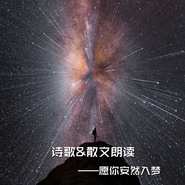
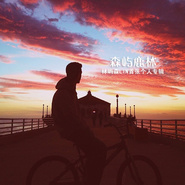

林屿森LIN
============================

|  |  |
| :--: | :-- |
| [ 林屿森LIN](https://i.xiami.com/zuoer6626) | **地区**: United States of America 美国 **风格**: 爵士流行 Jazz Pop, 独立流行 Indie Pop, 国语流行 Mandarin Pop **播放数**: 2983123 **粉丝数**: 221 **评论数**: 17  |

## 档案

林屿森，网络主播新生代，声线干净温柔有磁性且个性、帅气。起初只是为了纪念逝去的爱情，却意外受到关注，并深受众人喜爱，在网络电台圈里小有名气，多次被音乐圈（啪啪）和企鹅FM推荐到热门首页。 
北京人，出生于1987年，现居美国洛杉矶，任美国VINCECHO投资集团董事长、美国英杰生命技术加州总部执行总监。他声线干净温柔有磁性，能给人安定的感觉，各种风格均能驾驭，尤其唱情歌时特别能打动人。 
2015年1月26日创办《森言耳语》网络电台，亲自策划内容并担任主播。同年5月8日发行单曲《恰似你的温柔》，收录在首张EP专辑《森屿鹿林》里。目前正在起点中文网连载个人散文集《森语鹿林》 。 
林屿森是一个平凡而不平庸的85后，他用声音讲述故事，他用声音诠释情感，他用笑颜温暖了岁月。 
英文名：Vincent·L 
曾用名：梵谷de佐誀 
性别：男 
生日：1987年9月30日 
星座：天秤座 
血型：O型 
身高：188cm 
体重：78kg 
鞋码：44码 
出生地：北京（BJ星） 
现居：美国洛杉矶（B612小行星） 
粉丝名：悦誀 
职业：美国VINCECHO投资集团董事长、美国英杰生命技术有限公司加州总部执行总监 
定义：宇宙之神、面瘫大魔王 
血统：外星人 
语言：中、英、日 
爱好：听歌、玩游戏、健身、打篮球、熬夜、吃好吃的、睡觉、动漫 
喜欢的颜色：白、黑、灰、蓝 
喜爱的食物：牛肉、海鲜、火锅、湘菜、日本菜、橙子、苹果、桂圆、菠萝 
喜爱的动物：狗、兔、猫 
喜爱的饰物：钻石耳钉、帽子、包包、手表、戒指 
喜欢的季节：秋天、夏天 
喜欢观看的运动：NBA 
成就：百度音乐人、 虾米音乐人 、新浪微博音乐人（播客）、 网易云音乐人、豆瓣音乐人（DJ） 
翻唱作品：Listen、十年、天涯歌女、会呼吸的痛、催眠、如果你爱我、爱情烟熏眼、天天2003 
念白作品：阳光温热 岁月静好、一生只够爱一个人、时间是冥冥中一切的主宰、你是我嘴角失去的弧度、你知道喝酒跟喝水的分别吗、所有的记忆都是潮湿的、愿你一世安乐无忧、最难欢聚亦别离 惟有长相思、第六个二月十四、这温柔的疯狂的无所谓、一诺倾心再诺而殇、讲不出离别 诉不了思念、思绪里再也没有所谓的忧伤和快乐、相爱穿梭千年之绝笔书、为你读诗 为你静止、我用《诗经》说爱你、心若荒岛囚我终老、曾在岸上行走的鱼 
森言耳语创办人：2015年1月26日创建《森言耳语》网络电台，亲自策划内容并担任主播。 
2015年5月8日在网易云音乐发布了个人单曲EP《恰似你的温柔》，采用原歌词的基础上重新编曲、混缩制作而成。

## 专辑

| 名称 | 语种 | 唱片公司 | 发行时间 | 专辑类别 | 专辑风格 |
| :--: | :-- | :-- | :-- | :-- | :-- |
| [ 诗歌&散文朗读—愿你安然入梦](./albums/2104653892.md) | 国语 | 独立发行 | 2019年03月02日 | 播客 | 流行 Pop, 有声书 Audio Book |
| [ 吉他&钢琴弹奏合集](./albums/2104566510.md) | 其他 | 独立发行 | 2018年06月16日 | 精选集 | 器乐独奏 Solo Instrumental, 轻音乐流行 Light Pop |
| [ 森屿鹿林](./albums/1533440097.md) | 国语 | 独立发行 | 2015年05月08日 | EP, 单曲 |  |
| [ 森言耳语-林屿森LIN的Cover](./albums/2100172495.md) | 国语 | 独立发行 | 2015年01月26日 | 播客 | 国语流行 Mandarin Pop, 粤语流行 Cantopop, 高能量迪斯科 Hi-NRG |
| [ 森言耳语-林屿森LIN的晚安电台](./albums/233443744.md) | 国语 | 独立发行 | 2015年01月26日 | 播客 | 国语流行 Mandarin Pop, 独立流行 Indie Pop |

## 评论

|  |  |  |
| :-- | :-- | :-- |
|  [虾米用户](https://emumo.xiami.com/u/11099680) 心若浮沉，浅笑安然。 2020-05-29 16:48 赞(1) 踩(0) | 
原来你也在这里
 |
|  [虾米用户](https://emumo.xiami.com/u/421021632) 小赞，喜欢你，真的好喜欢... 2019-10-12 07:57 赞(0) 踩(0) | 
喜欢您的声音，备考普通话，听着您的朗诵练习，不知道为什么，会忍不住哭起来。
 |
|  [虾米用户](https://emumo.xiami.com/u/429240858) 随风潜入夜 润物细无声@... 2019-08-31 21:54 赞(0) 踩(0) | 
一个夜晚，思念无眠。为你静止，一听倾心。突然听到2015年你的这首作品，好似倾诉着我的思绪。因这首作品，注册点赞南北半球的距离，高山流水遇知音。香气是一朵花的表白，闪烁是一颗星的心事。在自然中呼吸的万物都有自己的语言，你若安静地听，就懂了。沉默不语是一种选择，或许也可以选择问候。记得打电话给你想念的人，告诉Ta，风中的树叶和今晚的月色说了些什么。而我，静静地听，不说话。谢谢你，林先生！Qin
 |
|  [虾米用户](https://emumo.xiami.com/u/343161186) 17岁了，没谈过恋爱，没... 2019-02-06 22:21 赞(0) 踩(0) | 
能读一下荷塘月色和清塘荷韵吗？
 |
|  [虾米用户](https://emumo.xiami.com/u/301517893)   2019-01-10 08:30 赞(0) 踩(0) | 
声音好听，很特别。
 |
|  [虾米用户](https://emumo.xiami.com/u/4514587)  2018-06-27 12:50 赞(0) 踩(0) | 
声线不干净
 |
|  [虾米用户](https://emumo.xiami.com/u/192371772) 过了，走了，散了。 2017-10-28 00:25 赞(0) 踩(0) | 
看到他的背景详细我一脸懵逼，原来他不是高中生
 |
| ⇒ |  [虾米用户](https://emumo.xiami.com/u/50098103) 我是林屿森LIN也是梵谷... 2018-04-22 03:40 赞(0) 踩(0) | 
从来没说过自己是高中生
 |
|  [虾米用户](https://emumo.xiami.com/u/11791945)  2016-10-18 14:41 赞(0) 踩(0) | 
声音
 |
|  [虾米用户](https://emumo.xiami.com/u/107616728) T A C I T  C... 2016-10-04 12:42 赞(0) 踩(0) | 

 |
|  [虾米用户](https://emumo.xiami.com/u/103010974)  2016-01-25 11:04 赞(0) 踩(0) | 

 |
|  [虾米用户](https://emumo.xiami.com/u/2272070) 人与人之间，开端于相认～ 2015-06-07 22:23 赞(0) 踩(0) | 
唱吧不再更好可惜~
 |
|  [虾米用户](https://emumo.xiami.com/u/7068386) 我还没想好要写什么... 2015-06-05 02:56 赞(0) 踩(0) | 
哈罗大大
 |
|  [虾米用户](https://emumo.xiami.com/u/50572334) 总有些惊奇的际遇，比方说... 2015-06-05 00:28 赞(0) 踩(0) | 

 |
|  [虾米用户](https://emumo.xiami.com/u/50098103) 我是林屿森LIN也是梵谷... 2015-06-05 00:10 赞(10) 踩(0) | 
我刚入驻了虾米音乐人，欢迎大家来我的个人主页，收听我的最新音乐
 |
| ⇒ |  [虾米用户](https://emumo.xiami.com/u/107616728) T A C I T  C... 2016-08-27 01:00 赞(0) 踩(0) | 
嗯
 |
| ⇒ |  [虾米用户](https://emumo.xiami.com/u/420050371)  2019-03-23 17:24 赞(0) 踩(0) | 
你的歌声唱的很有潜力，音准而清晰，音域看来是很广的，我喜欢。
 |
