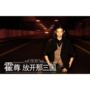

放开那三国
============================

|  |  |
| :--: | :-- |
| [ 放开那三国](https://emumo.xiami.com/album/1894766917) | **艺人**: [霍尊](../index.md) **语种**: 国语 **唱片公司**: 巴别时代 **发行时间**: 2014年03月17日 **专辑类别**: EP, 单曲 **专辑风格**: 国语流行 Mandarin Pop, 中国风 China-Wave **播放数**: 265713 **收藏数**: 517 **评论数**: 118  |

## 简介

霍尊新单曲《放开那三国》  
继《卷珠帘》后再品国风  
  
由巴别时代倾力打造的Q版萌系卡牌手游《放开那三国》以其独特的创新玩法获得了广大玩家的好评。《放开那三国》在2014年成为最热的三国类卡牌手游，而古风题材也受到被誉为“中国风新掌门人”霍尊的支持，由他演唱的同名曲《放开那三国》今日放出。  
  
同名主题曲由霍尊团队为《放开那三国》量身打造，这首歌虽然是以手机游戏为主题创作，但依然让霍尊有了极大的创作发挥空间。并且在歌曲中大胆加入了说唱、嘻哈等曲风元素，让歌曲呈现出一种动感与安静的交错感。  
 

## 曲目

## 评论

|  |  |  |  |
| :-- | :-- | :-- | :-- |
|  [虾米用户](https://emumo.xiami.com/u/354653296)  2018-04-18 21:31 赞(1) 踩(0) | 
摇滚风，躁起来
 |
|  [虾米用户](https://emumo.xiami.com/u/354653296)  2018-04-18 21:31 赞(0) 踩(0) | 
不要越来越娘好吗？
 |
|  [虾米用户](https://emumo.xiami.com/u/354653296)  2018-04-18 21:30 赞(0) 踩(0) | 
感觉霍尊唱这种风格的歌，比那些唱《卷珠帘》什么的好听
 |
|  [虾米用户](https://emumo.xiami.com/u/332617442)  2017-11-01 02:17 赞(0) 踩(0) | 
放开，我来
 |
|  [虾米用户](https://emumo.xiami.com/u/11258310) 穿过你的骨头抚摸你的灵魂 2017-10-28 00:35 赞(3) 踩(0) | 
冠军的永远是靶子，这就是当今中国网民的心态。躲在角落口诛笔伐，几个**就能片刻挥刀砍死伤大片，角落里的勇士那刻就变成了懦弱的逃亡者。鉴赏力这么高，你来做做？如何？
 |
|  [虾米用户](https://emumo.xiami.com/u/317995794) 心简单世界就简单____... 2017-08-08 08:46 赞(0) 踩(0) | 
不同的风格，很喜欢
 |
|  [虾米用户](https://emumo.xiami.com/u/8589748) 天下皆白 唯我独黑 2017-05-29 15:44 赞(1) 踩(0) | 
有种国风林俊杰即听感  戏曲元素部分还是很具有他的特色呢～
 |
|  [虾米用户](https://emumo.xiami.com/u/268984699)  2017-01-30 14:00 赞(0) 踩(0) | 
好听
 |
|  [虾米用户](https://emumo.xiami.com/u/268984699)  2017-01-30 14:00 赞(1) 踩(0) | 
好听
 |
|  [虾米用户](https://emumo.xiami.com/u/34698859)  2016-12-05 11:41 赞(1) 踩(0) | 
霍尊专辑
 |
|  [虾米用户](https://emumo.xiami.com/u/43704803)  2016-09-15 21:41 赞(0) 踩(0) | 
真难听
 |
|  [虾米用户](https://emumo.xiami.com/u/193853620)  2016-06-25 21:54 赞(2) 踩(0) | 
好霸气，喜欢这样的霍尊
 |
|  [虾米用户](https://emumo.xiami.com/u/193853620)  2016-06-25 21:53 赞(1) 踩(0) | 
这种风格也非常棒
 |
|  [虾米用户](https://emumo.xiami.com/u/193853620)  2016-06-25 21:53 赞(1) 踩(0) | 
开口跪
 |
|  [虾米用户](https://emumo.xiami.com/u/42488530)   2016-05-29 22:39 赞(2) 踩(0) | 
哈哈哈尊尊本来平时就很喜欢玩游戏
 |
|  [虾米用户](https://emumo.xiami.com/u/147513484)  2016-04-27 06:05 赞(2) 踩(0) | 
霍尊唯一一首让人听不下去的歌，听的我尴尬症犯了。
 |
|  [虾米用户](https://emumo.xiami.com/u/7757144) 懒癌晚期 2016-04-23 17:00 赞(1) 踩(0) | 
开口跪orz
 |
|  [虾米用户](https://emumo.xiami.com/u/34103474)  2016-04-22 16:09 赞(1) 踩(0) | 
霍尊的另一种风格的突破！！！！！！！！同名游戏主题曲。
 |
|  [虾米用户](https://emumo.xiami.com/u/38778686)  2016-04-22 00:45 赞(2) 踩(0) | 
不一样的霍尊，也挺好听的
 |
|  [虾米用户](https://emumo.xiami.com/u/145851334)  2016-04-20 18:31 赞(3) 踩(0) | 
哈哈哈，霍尊还有这种黑历史，这歌简直是污点的存在啊 。
 |
|  [虾米用户](https://emumo.xiami.com/u/145904020) 只等霍尊的音乐 2016-04-20 13:11 赞(4) 踩(0) | 
不一样的霍尊，完美
 |
|  [虾米用户](https://emumo.xiami.com/u/117916216)  2016-03-31 17:14 赞(0) 踩(0) | 
真不喜欢，越听越脑乱，听一半就掐断了
 |
|  [虾米用户](https://emumo.xiami.com/u/8179400)  2016-03-08 15:54 赞(1) 踩(0) | 
动听
 |
|  [虾米用户](https://emumo.xiami.com/u/2857420) 昨天晚上我梦见你 2015-11-11 07:33 赞(1) 踩(0) | 
放开那三围
 |
|  [虾米用户](https://emumo.xiami.com/u/37950358) 抗忙~北鼻！！巴扎黑~~ 2015-10-14 16:12 赞(0) 踩(0) | 
啧啧啧，就这？国风？算了算了，许山高和汪苏泷还有河图正好三缺一，霍尊你去吧
 |
|  [虾米用户](https://emumo.xiami.com/u/59112838)  2015-09-03 19:58 赞(0) 踩(0) | 
霍尊就是小曲儿吗？ 
 |
|  [虾米用户](https://emumo.xiami.com/u/59112838)  2015-09-03 19:58 赞(0) 踩(0) | 
霍尊就是小曲儿吗？ 
 |
|  [虾米用户](https://emumo.xiami.com/u/9185112)  2015-09-01 18:35 赞(6) 踩(0) | 
有些地方的确不太理想略显平庸，但不时高亢的几句又让我跪了下来...
 |
|  [虾米用户](https://emumo.xiami.com/u/51680395)  2015-08-06 20:15 赞(1) 踩(0) | 
与众不同
 |
|  [虾米用户](https://emumo.xiami.com/u/21282857)  2015-05-18 19:25 赞(2) 踩(0) | 
霍尊也算原创歌手吗 ，这首歌 基本没有惊喜 也没有跳出以前那些三国流行音乐题材的风格里。咬字也很别扭。如果说一首日本海岛音 改改调子的卷珠帘 成就了他 那么之后这些就略显逊了。
 |
| ⇒ |  [虾米用户](https://emumo.xiami.com/u/39448785) yoooo这里一杯水 2016-03-04 05:52 赞(0) 踩(0) | 
这首歌是为了一款网游而创作的主题曲，题材毕竟也是有所限制，推荐听听霍尊的《不送帖》《蝶》《木棉》《东风引》《春宴》，都是非常棒的原创作品，尤其是《春宴》更是自己作曲自己填词_(:з」∠)_
 |
|  [虾米用户](https://emumo.xiami.com/u/3591065)  2015-05-10 20:22 赞(2) 踩(0) | 
喜欢
 |
|  [虾米用户](https://emumo.xiami.com/u/3614877)  2015-04-30 09:12 赞(1) 踩(0) | 
曲子和演唱的都不错的，但是为毛觉得歌词这么别扭呢？
 |
|  [虾米用户](https://emumo.xiami.com/u/7769980) horseman, pa... 2014-11-14 14:51 赞(0) 踩(0) | 
完了，顿时沦为汪苏泷后弦之流了。
 |
| ⇒ |  [虾米用户](https://emumo.xiami.com/u/10708104)  2014-12-08 21:54 赞(0) 踩(0) | 
hahaha....味道不一样，这个感觉要好多了
 |
| ⇒ |  [虾米用户](https://emumo.xiami.com/u/9185112)  2015-09-01 18:31 赞(0) 踩(0) | 
完全不一样，从汪苏泷后弦那里你是找不出荡气回肠的。
 |
|  [虾米用户](https://emumo.xiami.com/u/42470394)  2014-10-14 14:19 赞(1) 踩(0) | 
好听~
 |
|  [虾米用户](https://emumo.xiami.com/u/42470394)  2014-10-14 14:18 赞(1) 踩(0) | 
好听~
 |
|  [虾米用户](https://emumo.xiami.com/u/42485283) 倾听来自云端的声音 2014-10-13 20:33 赞(1) 踩(0) | 
不一样的演绎风格~~~
 |
|  [虾米用户](https://emumo.xiami.com/u/42485283) 倾听来自云端的声音 2014-10-13 20:20 赞(1) 踩(0) | 
又一种不同的风格的演绎~~~
 |
|  [虾米用户](https://emumo.xiami.com/u/42467206)  2014-10-13 10:59 赞(2) 踩(0) | 
霍尊的原创，非常棒
 |
|  [虾米用户](https://emumo.xiami.com/u/33147331)  2014-07-16 08:10 赞(1) 踩(0) | 
有摇滚的节奏，又有抒情感觉，很新鲜的一首歌
 |
|  [虾米用户](https://emumo.xiami.com/u/15530881)  2014-07-14 20:19 赞(1) 踩(0) | 
就是爱
 |
|  [虾米用户](https://emumo.xiami.com/u/38778686)  2014-07-10 21:45 赞(3) 踩(0) | 
一反往日风格，曲风大气欢快，很好听
 |
|  [虾米用户](https://emumo.xiami.com/u/38792476)  2014-07-10 17:00 赞(2) 踩(0) | 
难得的音乐才子！！！
 |
|  [虾米用户](https://emumo.xiami.com/u/18603147)  2014-07-09 19:24 赞(1) 踩(0) | 
好听
 |
|  [虾米用户](https://emumo.xiami.com/u/18603147)  2014-07-09 19:17 赞(1) 踩(0) | 
好听
 |
|  [虾米用户](https://emumo.xiami.com/u/18603147)  2014-07-09 19:17 赞(1) 踩(0) | 
好听
 |
|  [虾米用户](https://emumo.xiami.com/u/14508088) 鬼束千寻的新精选集居然不... 2014-07-08 19:33 赞(0) 踩(0) | 
可惜念白是跟尹俊学的。。。
 |
|  [虾米用户](https://emumo.xiami.com/u/38791753)  2014-07-08 15:37 赞(1) 踩(0) | 
曲风欢快，郎朗上口，京剧唱腔韵味十足。
 |
|  [虾米用户](https://emumo.xiami.com/u/38791753)  2014-07-08 15:33 赞(2) 踩(0) | 
不同风格的曲风，让人看到无限可能性，看来参加国色天香确实学到很多，支持你，加油。
 |
|  [虾米用户](https://emumo.xiami.com/u/38777614)  2014-07-07 22:44 赞(0) 踩(0) | 
阳刚
 |
|  [虾米用户](https://emumo.xiami.com/u/38777100)  2014-07-07 19:51 赞(1) 踩(0) | 
尊
 |
|  [虾米用户](https://emumo.xiami.com/u/7360065) 点击左侧昵称访问他的主页 2014-07-07 18:19 赞(0) 踩(0) | 
林俊杰 曹操的感觉～
 |
|  [虾米用户](https://emumo.xiami.com/u/38777339)  2014-07-07 17:04 赞(0) 踩(0) | 
好听
 |
|  [虾米用户](https://emumo.xiami.com/u/38776533)  2014-07-07 16:21 赞(0) 踩(0) | 
不一样的风格
 |
|  [虾米用户](https://emumo.xiami.com/u/37412546)  2014-07-07 13:27 赞(2) 踩(0) | 
作为游戏歌曲挺好，大胆加入京剧元素有创新，值得鼓励
 |
|  [虾米用户](https://emumo.xiami.com/u/38766869)  2014-07-07 10:46 赞(1) 踩(0) | 
good
 |
|  [虾米用户](https://emumo.xiami.com/u/38766991)   2014-07-07 09:44 赞(1) 踩(0) | 
来~~~呀~~~
 |
|  [虾米用户](https://emumo.xiami.com/u/38766991)   2014-07-07 09:32 赞(1) 踩(0) | 
咔擦咔擦是哪坍塌~~~
 |
|  [虾米用户](https://emumo.xiami.com/u/38764645)  2014-07-07 01:07 赞(1) 踩(0) | 
我喜欢要什么理由，我没理由就是喜欢
 |
|  [虾米用户](https://emumo.xiami.com/u/6491765) 我只是个门外汉。 2014-07-06 08:39 赞(0) 踩(0) | 
感觉做indie都会好很多。。。
 |
|  [虾米用户](https://emumo.xiami.com/u/478527) 好想跟衣服在洗衣机里滚 2014-07-03 13:59 赞(0) 踩(0) | 
直接low成网络歌曲了
 |
|  [虾米用户](https://emumo.xiami.com/u/7333206)  2014-07-01 17:12 赞(2) 踩(0) | 
请放开霍尊
 |
|  [虾米用户](https://emumo.xiami.com/u/33450471)  2014-06-07 23:49 赞(2) 踩(0) | 
哦，这里貌似都是高手啊。霍尊还得加油！不过商业歌曲这个样子很不错啦，耐听。
 |
|  [虾米用户](https://emumo.xiami.com/u/32631066) ACG、华语、水瓶 2014-05-03 16:49 赞(0) 踩(0) | 
放开我真不觉着哪好玩【跑题了
 |
|  [虾米用户](https://emumo.xiami.com/u/35615477) ♪ 2014-04-26 20:58 赞(0) 踩(0) | 
张力
 |
|  [虾米用户](https://emumo.xiami.com/u/12808364) 几个默默写歌的中年小团伙 2014-04-13 09:03 赞(1) 踩(0) | 
就当广告片好了，但是长期搞这种自降身价。
 |
| ⇒ |  [虾米用户](https://emumo.xiami.com/u/400958132)  2018-09-26 23:53 赞(0) 踩(0) | 
那时霍尊身价不高
 |
|  [虾米用户](https://emumo.xiami.com/u/33900275)  2014-04-07 09:37 赞(0) 踩(0) | 
估计霍尊指尖都不想唱。中国歌坛真是····
 |
|  [虾米用户](https://emumo.xiami.com/u/15442375) 生日夏花 2014-04-03 20:26 赞(1) 踩(0) | 
喜欢霍尊富有磁性的声音。
 |
|  [虾米用户](https://emumo.xiami.com/u/10274708) 暂无签名~ 2014-03-24 20:52 赞(0) 踩(0) | 
没感觉也没特色 ，有点失望。期待有更好作品 。你们觉得呢？？
 |
|  [虾米用户](https://emumo.xiami.com/u/15374748) 网易叫子弹房里的机器人 2014-03-24 00:32 赞(1) 踩(0) | 
为什么跟跟林俊杰得中国风得歌曲好类似
 |
|  [虾米用户](https://emumo.xiami.com/u/24340879)  2014-03-23 23:49 赞(1) 踩(0) | 
只觉得挺符合手游的主题
 |
|  [虾米用户](https://emumo.xiami.com/u/2764401)  2014-03-23 21:30 赞(0) 踩(0) | 
有一个被毁的好歌手
 |
| ⇒ |  [虾米用户](https://emumo.xiami.com/u/34471755)  2014-03-26 23:56 赞(0) 踩(0) | 
了一偶各位晚安
 |
|  [虾米用户](https://emumo.xiami.com/u/1143740) 我又不是啥名人~要啥签名 2014-03-22 12:00 赞(0) 踩(0) | 
这是胡彦斌+**+jj么…
 |
|  [虾米用户](https://emumo.xiami.com/u/4804) 签~啊名~啊~签了个名 2014-03-21 22:13 赞(0) 踩(0) | 
这咬字，然后这一句&amp;quot;中国风新掌门人&amp;quot;。。。经纪公司是要毁了他么？
 |
|  [虾米用户](https://emumo.xiami.com/u/6271014) 你能不能别那么中二 2014-03-21 00:03 赞(0) 踩(0) | 
没有人吐槽这个封面吗。。。这眼妆化的。。。。
 |
|  [虾米用户](https://emumo.xiami.com/u/13404111) 人可生如蚁而美如神 2014-03-20 13:10 赞(0) 踩(0) | 
要不要那么快就想着捞钱....这是神马玩意
 |
|  [虾米用户](https://emumo.xiami.com/u/6906852)  2014-03-20 12:02 赞(0) 踩(0) | 
非常平庸的声音
 |
|  [虾米用户](https://emumo.xiami.com/u/1860403) 暂无签名~ 2014-03-20 10:21 赞(0) 踩(0) | 
有点失望，期待有更好作品
 |
|  [虾米用户](https://emumo.xiami.com/u/2040400)  2014-03-20 09:28 赞(0) 踩(0) | 
哈哈哈哈，你是来搞笑的吧
 |
|  [虾米用户](https://emumo.xiami.com/u/16230181) 我还没想好要写什么... 2014-03-20 08:40 赞(0) 踩(0) | 
太叫人失望了，一个歌手不是什么类型的歌都能唱的，多尊重自己和歌迷。
 |
|  [虾米用户](https://emumo.xiami.com/u/13544463) 大梦谁先觉，平生几相知 2014-03-20 00:30 赞(0) 踩(0) | 
神马玩意......
 |
|  [虾米用户](https://emumo.xiami.com/u/7245772)  2014-03-20 00:27 赞(0) 踩(0) | 
咔嚓咔嚓 low爆了 喔艹
 |
|  [虾米用户](https://emumo.xiami.com/u/32045117) 暂无签名~ 2014-03-19 22:05 赞(0) 踩(0) | 
感觉好差！
 |
|  [虾米用户](https://emumo.xiami.com/u/7278341)  2014-03-19 16:32 赞(0) 踩(0) | 
太着急发歌，没有个性的东西，只留下肤浅的形式
 |
|  [虾米用户](https://emumo.xiami.com/u/4308689)  2014-03-19 14:39 赞(0) 踩(0) | 
要命
 |
|  [虾米用户](https://emumo.xiami.com/u/1688191)  2014-03-19 09:24 赞(2) 踩(0) | 
霍尊 有前途的歌手  喜欢声音的味道
 |
|  [虾米用户](https://emumo.xiami.com/u/33668476) 夏日已远，繁花将尽 2014-03-18 21:18 赞(0) 踩(0) | 
这作曲。。。话说《卷珠帘》真的是您写的吗？？
 |
|  [虾米用户](https://emumo.xiami.com/u/1018) 口哨魔法師 2014-03-18 13:11 赞(1) 踩(0) | 
我原本很喜欢你的呀 放开那骚年  别这样啊
 |
|  [虾米用户](https://emumo.xiami.com/u/1018) 口哨魔法師 2014-03-18 13:09 赞(0) 踩(0) | 
=-=我居然听成了林俊杰
 |
|  [虾米用户](https://emumo.xiami.com/u/4833614) 心有猛虎，细嗅蔷薇 2014-03-17 19:50 赞(16) 踩(0) | 
一向温婉的#霍尊#玩起厮杀的#放开那三国#，除了开头，丝毫不见#中孝介#般的细腻，巨大反差着实要人适应适应。该歌犹如立志书，将他抒情外的唱作才华集结展现，布告天下他是个硬朗的男子汉。民族、古典和现代乐器交织出的编曲是一绝。
 |
|  [虾米用户](https://emumo.xiami.com/u/2248465)  2014-03-17 14:17 赞(0) 踩(0) | 
我还是去听吴莫愁吧·····
 |
|  [虾米用户](https://emumo.xiami.com/u/2873982)  2014-03-17 13:49 赞(0) 踩(0) | 
看到名字就犹豫了。。
 |
|  [虾米用户](https://emumo.xiami.com/u/5030255)  2014-03-17 13:21 赞(0) 踩(0) | 
好一般 很像JJ的某首歌 失望
 |
|  [虾米用户](https://emumo.xiami.com/u/9326539) 忧郁的蝎子 2014-03-17 12:32 赞(0) 踩(0) | 
有点失望，应该不会再听这首了。
 |
|  [虾米用户](https://emumo.xiami.com/u/1401579)  2014-03-17 12:18 赞(1) 踩(0) | 
原谅我莫名的笑了。。。。。。
 |
|  [虾米用户](https://emumo.xiami.com/u/11638908) 不明、不智、不乐，然，求... 2014-03-17 11:36 赞(0) 踩(0) | 
狗屎啊！请原谅在下直白了、、、
 |
|  [虾米用户](https://emumo.xiami.com/u/18282119) 我就是我，独一无二 2014-03-15 11:11 赞(0) 踩(0) | 
这张为神马下架啊？？？<a href="http://emumo.xiami.com/u/6630660" target="_blank" rel="nofollow" name_card="6630660">@乱七∞糟</a> <a href="http://emumo.xiami.com/u/30705" target="_blank" rel="nofollow" name_card="30705">@beson</a>
 |
| ⇒ |  [虾米用户](https://emumo.xiami.com/u/6630660) 猜赢涂口红… 2014-03-15 11:17 赞(0) 踩(0) | 
周一上架
 |
| ⇒ |  [虾米用户](https://emumo.xiami.com/u/18282119) 我就是我，独一无二 2014-03-15 11:27 赞(0) 踩(0) | 
<q><b>哈哈哈哈哈哈哈哈哈哈哈皮说：</b></q>
 |
| ⇒ |  [虾米用户](https://emumo.xiami.com/u/6630660) 猜赢涂口红… 2014-03-15 11:28 赞(0) 踩(0) | 
<q><b>______说：</b></q>
 |
| ⇒ |  [虾米用户](https://emumo.xiami.com/u/18282119) 我就是我，独一无二 2014-03-15 11:31 赞(0) 踩(0) | 
<q><b>哈哈哈哈哈哈哈哈哈哈哈皮说：</b></q>
 |
|  [虾米用户](https://emumo.xiami.com/u/4375081)  2014-03-15 10:35 赞(1) 踩(0) | 
温柔的声音尝试霸道演唱 勇气可嘉 曲子耳目一新的感觉 非科班出身写成这样很不错了  第二段编曲感觉力道不太够就是
 |
|  [虾米用户](https://emumo.xiami.com/u/6869784) 豐平川日落 2014-03-15 09:46 赞(1) 踩(0) | 
通知我来听，结果没得听
 |
|  [虾米用户](https://emumo.xiami.com/u/8659226)  2014-03-14 17:20 赞(1) 踩(0) | 
还没听就下了我去
 |
|  [虾米用户](https://emumo.xiami.com/u/9194242) 自賞夢泡後搖氛圍黑 2014-03-14 16:08 赞(0) 踩(0) | 
太毁了
 |
|  [虾米用户](https://emumo.xiami.com/u/8244559)  2014-03-14 15:48 赞(0) 踩(0) | 
******
 |
|  [虾米用户](https://emumo.xiami.com/u/5106725) 我还没想好要写什么... 2014-03-14 15:44 赞(0) 踩(0) | 
没感觉也没特色
 |
|  [虾米用户](https://emumo.xiami.com/u/7844658)  2014-03-14 15:43 赞(0) 踩(0) | 
不好听，失望ing：（
 |
|  [虾米用户](https://emumo.xiami.com/u/847574)  2014-03-14 15:34 赞(0) 踩(0) | 
说句实话，这首歌词与曲没有整合在一起，词没水平。再说句话，如果认为这是中国风，简直污我中国音乐。霍尊唱功更为唱而唱，可能也不能怪他，毕竟这词真无力、无意义。
 |
| ⇒ |  [虾米用户](https://emumo.xiami.com/u/13404111) 人可生如蚁而美如神 2014-03-20 13:11 赞(0) 踩(0) | 
为了钱创作的东东，也就这样。
 |
|  [虾米用户](https://emumo.xiami.com/u/22978)  2014-03-14 15:28 赞(0) 踩(0) | 
声音太细，有点像韩国人了。。。
 |
| ⇒ |  [虾米用户](https://emumo.xiami.com/u/128217) 这个家伙很聪明，只留下了... 2014-03-18 01:07 赞(0) 踩(0) | 
呵呵，他本来就是日本唱法！
 |
|  [虾米用户](https://emumo.xiami.com/u/7788100) 爱 让 每 人 都 有 ... 2014-03-14 14:22 赞(0) 踩(0) | 
pop没感觉
 |
|  [虾米用户](https://emumo.xiami.com/u/1931086) 正义，或许会迟到，但永远... 2014-03-14 14:17 赞(0) 踩(0) | 
虽然不怎么爱玩这个游戏，但还是值得听这首歌曲。
 |
