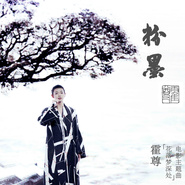

粉墨
============================

|  |  |
| :--: | :-- |
| [ 粉墨](https://emumo.xiami.com/album/2102730055) | **艺人**: [霍尊](../index.md) **语种**: 国语 **唱片公司**: 独立发行 **发行时间**: 2017年04月11日 **专辑类别**: EP, 单曲 **专辑风格**: 国语流行 Mandarin Pop, 中国风 China-Wave **播放数**: 1337557 **收藏数**: 344 **评论数**: 83  |

## 简介

春暖花开 『粉墨』登场  
洗尽铅华 情怀依旧  
  
台上唱戏的人粉墨浓妆，演一段段唯美的情，吸引台下听戏人的目光，  
而当他卸下妆容，沉浸在音乐里，那才是真实的霍尊。  
  
对音乐 一往情深 的霍尊  
以一曲《卷珠帘》成名的霍尊，一路以来都被冠以中国古风歌手的称号，无论是从《卷珠帘》到《花雅禅》，从《伊人如梦》到《素颜》，这些年推出的歌曲作品都深深融入了中国古典音乐与戏曲的元素，这首2017年全新单曲《粉墨》也是延续了古典韵味，将对昆曲的情愫缓缓道来，低吟浅唱，恰如一副泼墨山水画卷徐徐展开。  
所谓“风月无古今，情怀自浅深”，在如今的流行歌曲中，唱尽千古不变的情情爱爱，但风月虽然一样，情怀自有深浅，霍尊就一直秉持着传承中国传统文化的一颗赤子之心，对国学、对雅韵、对丝竹都加以学习，也融入到自己的歌曲作品当中去，在去年与费城交响乐团合作的音乐会上，霍尊与音乐大师们就打造了一场中西合璧的音乐会，其创新之处在于，音乐家们用西洋的弦乐、管乐与打击乐再结合中国乐器二胡的音色，表现出了中国韵律的古典之美，把中国古风歌曲的演绎带上了一个新的台阶，这在华语乐坛上如此执着地向全世界展现属于中国人自己的音乐与表演的歌手中，霍尊绝对称得上佼佼者了。  
霍尊自己一直觉得，与音乐相通的心应该是自然的，这种自然即是遵从内心，不违背它，这也是霍尊在音乐道路上的一种执念，不求功利，不计得失，对于霍尊的音乐来说，他的追求应该是平平淡淡的，而他希望可以打动听众的则是音乐里的内涵与精神上的震撼。  
对昆曲 一见钟情 的霍尊  
  
《粉墨》这首歌曲同时也是霍尊主演的一部文艺电影《花落梦深处》的主题曲，这部电影取材于昆曲名剧《牡丹亭》，其古风唯美的风格也非常符合霍尊的特质。而霍尊对戏曲，尤其是昆曲有着一见钟情的缘分，早在参加《国色天香》节目时，霍尊就迷上了戏曲，他自己也曾说过，作为90后的一代人，其实大多都是不喜欢戏曲的，但在接触到了戏曲之后，才发觉戏曲的伟大之处，一辈辈传下来的，经久不衰，在那种深厚沉淀的魅力里面，就觉得自己真的很渺小。这样的恭敬之心也让他三番两次地将戏曲与流行音乐加以结合作尝试，也是希望能让更多的听众能重新认识到中国传统文化的美妙之处，可谓用心良苦。  
  
虽说是作为流行歌手出道的霍尊，在其音乐发展之路上却不经意地与戏曲合轨，本身集聚在他身上的优雅气质与古典之美竟然与中国古典戏曲如此契合，近期霍尊还真的在拜师学艺，研究昆曲的唱腔，看来霍尊对昆曲的情还真是不一般呢。套用一句影片中的台词来说：“我追赶着春天的脚步匆匆而来，却在一片姹紫嫣红中，与你不期而遇。那一日，花落在了你肩头，而你，落在了我心上。”这本是片中他饰演的男主人公对昆曲女旦的一诉衷肠，却更恰如其分的表达了他对戏曲的一见钟情。  
  
“那一日，昆曲落在了我心上，”霍尊说，“我不想只是玩票，定不负百戏之祖。话已至此，看来霍尊抱着自己对中国传统文化的满腔热情，将给我们带来更多优秀的国风作品，拭目以待。  
  
2017年的霍尊，除了继续潜心投入音乐，创作新歌之外，平时喜欢收集一些古典传统工艺品的霍尊，今年他用自己特有的艺术视角开始打造自己专属的“尊”品牌系列，分别以“花漾”、“雅韵”、“禅心”为主题，即将推出一款款纯手工打造的周边佳品，希望与大家分享一份恬静自然的春意盎然。

## 曲目

## 评论

|  |  |  |  |
| :-- | :-- | :-- | :-- |
|  [虾米用户](https://emumo.xiami.com/u/444883274)  2020-09-14 06:37 赞(0) 踩(0) | 
喜欢这种歌唱风格，仙气缭绕！
 |
|  [虾米用户](https://emumo.xiami.com/u/206431646) 我还没想好要写什么... 2019-05-13 14:27 赞(0) 踩(0) | 
花落梦深处 许你方向
 |
|  [虾米用户](https://emumo.xiami.com/u/306530815)  2018-03-13 00:23 赞(0) 踩(0) | 
上辈子可能也是仙子！
 |
|  [虾米用户](https://emumo.xiami.com/u/345468732)  2018-02-19 22:54 赞(0) 踩(0) | 
喜欢
 |
|  [虾米用户](https://emumo.xiami.com/u/47152430)  2017-11-22 16:50 赞(0) 踩(0) | 
现场炒鸡好听
 |
|  [虾米用户](https://emumo.xiami.com/u/332617442)  2017-11-01 02:16 赞(1) 踩(0) | 
粉墨，如风如魔
 |
|  [虾米用户](https://emumo.xiami.com/u/318041312)  2017-08-10 21:25 赞(0) 踩(0) | 
温柔缠绵，古风古韵
 |
|  [虾米用户](https://emumo.xiami.com/u/288103618)  2017-08-08 22:11 赞(1) 踩(0) | 
在粉墨中忘记自己！
 |
|  [虾米用户](https://emumo.xiami.com/u/317968543)  2017-08-08 20:29 赞(0) 踩(0) | 
好听极了
 |
|  [虾米用户](https://emumo.xiami.com/u/317986248)  2017-08-08 12:47 赞(0) 踩(0) | 
完美
 |
|  [虾米用户](https://emumo.xiami.com/u/317999130)  2017-08-08 07:44 赞(1) 踩(0) | 
转音真的好听
 |
|  [虾米用户](https://emumo.xiami.com/u/317946894)  2017-08-07 23:42 赞(1) 踩(0) | 
曲中满含人间真情，执着的痴、不悔的爱、生死的恨、同穴的愿&amp;hellip;&amp;hellip;，这些，有情的人，自能感同身受
 |
|  [虾米用户](https://emumo.xiami.com/u/317952109)  2017-08-07 22:38 赞(2) 踩(0) | 
很喜欢这一首，这么久了，我还在循环
 |
|  [虾米用户](https://emumo.xiami.com/u/317933142) 平生一顾，至此终年 2017-08-07 21:47 赞(1) 踩(0) | 
好听 没道理
 |
|  [虾米用户](https://emumo.xiami.com/u/276070423) 用真心换真心 2017-06-08 22:05 赞(0) 踩(0) | 
blackpink
 |
|  [虾米用户](https://emumo.xiami.com/u/282359895)  2017-05-26 12:58 赞(2) 踩(0) | 
是那种可以无限循环的歌。。
 |
|  [虾米用户](https://emumo.xiami.com/u/282359895)  2017-05-26 12:57 赞(0) 踩(0) | 
春暖花开，优雅的粉黑登场啦！听不够。
 |
|  [虾米用户](https://emumo.xiami.com/u/225761167) from dawn to... 2017-05-25 10:15 赞(0) 踩(0) | 
blackpink
 |
|  [虾米用户](https://emumo.xiami.com/u/261445457) 随心 2017-05-13 09:43 赞(0) 踩(0) | 
  
 |
|  [虾米用户](https://emumo.xiami.com/u/44236896)  2017-05-08 03:02 赞(0) 踩(0) | 
霍尊唱歌太好聽
 |
|  [虾米用户](https://emumo.xiami.com/u/294089342) 防弹 2017-05-07 18:53 赞(0) 踩(0) | 
系统消息：你所在的视频也被行星饭（劳尔）霸占，请戴好安全帽，系好安全带&amp;hellip;&amp;hellip;
 |
| ⇒ |  [虾米用户](https://emumo.xiami.com/u/225761167) from dawn to... 2017-05-25 10:15 赞(0) 踩(0) | 
&amp;hellip;&amp;hellip;好好听歌
 |
| ⇒ |  [虾米用户](https://emumo.xiami.com/u/294089342) 防弹 2017-05-25 18:36 赞(0) 踩(0) | 
<q><b>千米公里说：</b></q>
 |
| ⇒ |  [虾米用户](https://emumo.xiami.com/u/225761167) from dawn to... 2017-05-25 20:27 赞(0) 踩(0) | 
<q><b>WINGS说：</b></q>
 |
|  [虾米用户](https://emumo.xiami.com/u/294089342) 防弹 2017-05-07 18:53 赞(0) 踩(0) | 
尴尬了
 |
|  [虾米用户](https://emumo.xiami.com/u/294089342) 防弹 2017-05-07 18:53 赞(0) 踩(0) | 
blackpink也叫粉墨&amp;hellip;&amp;hellip;|
 |
|  [虾米用户](https://emumo.xiami.com/u/261445457) 随心 2017-05-05 13:18 赞(0) 踩(0) | 
无限循环
 |
|  [虾米用户](https://emumo.xiami.com/u/3855918) 我还没想好要写什么... 2017-04-25 00:40 赞(1) 踩(0) | 
民族的就是世界的
 |
|  [虾米用户](https://emumo.xiami.com/u/284355807)  2017-04-22 23:32 赞(0) 踩(0) | 
厉害了，尊
 |
| ⇒ |  [虾米用户](https://emumo.xiami.com/u/293027890) 加油！李玉刚！霍尊！加油... 2017-06-09 20:16 赞(0) 踩(0) | 
嘴干净点！叫霍尊
 |
|  [虾米用户](https://emumo.xiami.com/u/87476294)  2017-04-20 20:55 赞(0) 踩(0) | 
霍尊的音乐是治愈心灵的良药
 |
|  [虾米用户](https://emumo.xiami.com/u/87476294)  2017-04-20 20:53 赞(0) 踩(0) | 
⭐️⭐️⭐️⭐️⭐️
 |
|  [虾米用户](https://emumo.xiami.com/u/187473639)  2017-04-19 12:45 赞(0) 踩(0) | 
好听啊
 |
|  [虾米用户](https://emumo.xiami.com/u/289372822)  2017-04-17 11:28 赞(0) 踩(0) | 
霍尊，唱出仙气第一人
 |
|  [虾米用户](https://emumo.xiami.com/u/289372822)  2017-04-17 11:24 赞(2) 踩(0) | 
霍尊的歌越听越有味道，独特的中国韵，这种带有昆曲唱腔也只有霍尊能唱出感觉。
 |
|  [虾米用户](https://emumo.xiami.com/u/192972716) 开吧通博只为尊 2017-04-14 12:02 赞(2) 踩(0) | 
好听极了！循环出不来了！#霍尊花漾粉墨登场#
 |
|  [虾米用户](https://emumo.xiami.com/u/51680395)  2017-04-13 21:41 赞(1) 踩(0) | 
歌不错，歌词也很棒
 |
|  [虾米用户](https://emumo.xiami.com/u/282120348)  2017-04-13 14:07 赞(1) 踩(0) | 
他，唱的歌好听
 |
|  [虾米用户](https://emumo.xiami.com/u/282120348)  2017-04-13 14:06 赞(1) 踩(0) | 
他唱的歌我喜欢听，就是唱不出
 |
|  [虾米用户](https://emumo.xiami.com/u/217312196)  2017-04-13 13:12 赞(1) 踩(0) | 
好听
 |
|  [虾米用户](https://emumo.xiami.com/u/39448785) yoooo这里一杯水 2017-04-13 13:09 赞(1) 踩(0) | 
太好听了呜
 |
|  [虾米用户](https://emumo.xiami.com/u/288332131) 不个性，无签名 2017-04-13 10:28 赞(0) 踩(0) | 

 |
|  [虾米用户](https://emumo.xiami.com/u/210224199)  2017-04-13 01:19 赞(0) 踩(0) | 
｡◕‿◕｡
 |
|  [虾米用户](https://emumo.xiami.com/u/42406671) 我还没想好要写什么... 2017-04-12 23:59 赞(2) 踩(0) | 
特别好听！没想到这是2年前的歌曲，好听！ 
 |
|  [虾米用户](https://emumo.xiami.com/u/19579297)  2017-04-12 22:20 赞(2) 踩(0) | 
天赖之音
 |
|  [虾米用户](https://emumo.xiami.com/u/181168504) 随便。 2017-04-12 20:17 赞(1) 踩(0) | 
    
 |
|  [虾米用户](https://emumo.xiami.com/u/286600539)  2017-04-12 17:37 赞(1) 踩(0) | 
很棒
 |
|  [虾米用户](https://emumo.xiami.com/u/145887680)  2017-04-12 12:15 赞(1) 踩(0) | 
好音质好歌曲 #霍尊# 《粉墨》，千回百转，肝肠寸断！
 |
|  [虾米用户](https://emumo.xiami.com/u/122794666)  2017-04-12 12:07 赞(1) 踩(0) | 
好听
 |
|  [虾米用户](https://emumo.xiami.com/u/935171) 再见虾米 2017-04-12 11:14 赞(1) 踩(0) | 
20个人五星，2人非五星，最后评分6.6？这是怎么个神奇的算法
 |
| ⇒ |  [虾米用户](https://emumo.xiami.com/u/288111436)  2017-04-13 08:43 赞(0) 踩(0) | 
平均分，多点人打分就把平均分给抬上去了
 |
| ⇒ |  [虾米用户](https://emumo.xiami.com/u/935171) 再见虾米 2017-04-13 11:11 赞(0) 踩(0) | 
<q><b>扬羽~北极光说：</b></q>
 |
|  [虾米用户](https://emumo.xiami.com/u/288111436)  2017-04-12 10:47 赞(2) 踩(0) | 
霍尊的唱功越发精进了，对曲调的把控精准到位，转音流畅自然，一定要五星推荐！
 |
|  [虾米用户](https://emumo.xiami.com/u/288111436)  2017-04-12 10:45 赞(1) 踩(0) | 
粉墨终于登场了，不辜负赫兹这么久的期盼，好听好听好听！
 |
|  [虾米用户](https://emumo.xiami.com/u/145960500) 烟台韵儿 2017-04-12 10:20 赞(1) 踩(0) | 
飘飘欲仙的感觉
 |
|  [虾米用户](https://emumo.xiami.com/u/38792476)  2017-04-12 10:11 赞(0) 踩(0) | 
好听！太好听了！ 
 |
|  [虾米用户](https://emumo.xiami.com/u/52532226)  2017-04-12 10:07 赞(1) 踩(0) | 
昆曲唱腔太美了
 |
|  [虾米用户](https://emumo.xiami.com/u/145960500) 烟台韵儿 2017-04-12 10:06 赞(1) 踩(0) | 
就是好听，么办法。
 |
|  [虾米用户](https://emumo.xiami.com/u/145960500) 烟台韵儿 2017-04-12 10:05 赞(0) 踩(0) | 
#亚洲新歌榜# #霍尊花漾粉墨登场# 侧耳细听，越听越好听。
 |
|  [虾米用户](https://emumo.xiami.com/u/288102418)  2017-04-12 09:51 赞(1) 踩(0) | 
感谢 @霍尊 为乐坛贡献了这么好听的歌 ！#霍尊花漾粉墨登场#
 |
|  [虾米用户](https://emumo.xiami.com/u/288102418)  2017-04-12 09:47 赞(1) 踩(0) | 
声声入耳，百转千回  这么好听的歌 #霍尊花漾粉墨登场#
 |
|  [虾米用户](https://emumo.xiami.com/u/52257535)  2017-04-12 09:40 赞(2) 踩(0) | 
#霍尊# #霍尊花漾粉墨登场# 百转千回，绕梁不绝！
 |
|  [虾米用户](https://emumo.xiami.com/u/38776391)  2017-04-12 09:38 赞(1) 踩(0) | 
缠绵悱恻，动人心弦
 |
|  [虾米用户](https://emumo.xiami.com/u/52257535)  2017-04-12 09:38 赞(1) 踩(0) | 
#霍尊# 春暖花开，粉墨登场！强力推荐！
 |
|  [虾米用户](https://emumo.xiami.com/u/52257535)  2017-04-12 09:38 赞(1) 踩(0) | 
#霍尊# 春暖花开，粉墨登场！强力推荐！
 |
|  [虾米用户](https://emumo.xiami.com/u/288093460)  2017-04-12 08:46 赞(1) 踩(0) | 
#霍尊花漾粉墨登场# 声音真好听，百转千回
 |
|  [虾米用户](https://emumo.xiami.com/u/288066948)  2017-04-12 01:54 赞(1) 踩(0) | 
故事短短一折 却是真的，转音真的非常好听！
 |
|  [虾米用户](https://emumo.xiami.com/u/288066568)  2017-04-12 01:49 赞(1) 踩(0) | 
歌声转音调调勾人魂魄，精妙柔情好听！
 |
|  [虾米用户](https://emumo.xiami.com/u/288066383)  2017-04-12 01:42 赞(1) 踩(0) | 
#霍尊花漾粉墨登场#  歌声很撩人，听着让人想哭！
 |
|  [虾米用户](https://emumo.xiami.com/u/288066222)  2017-04-12 01:39 赞(1) 踩(0) | 
#霍尊花漾粉墨登场# 越听越好听，必须大赞一个
 |
|  [虾米用户](https://emumo.xiami.com/u/288066038)  2017-04-12 01:35 赞(1) 踩(0) | 
#霍尊花漾粉墨登场#  又是一首佳做，真的很好听！
 |
|  [虾米用户](https://emumo.xiami.com/u/288065476)  2017-04-12 01:29 赞(2) 踩(0) | 
#霍尊花漾粉墨登场#  霍尊的是治愈心灵的良药，唱功真的太棒了
 |
|  [虾米用户](https://emumo.xiami.com/u/50605158)  2017-04-12 00:20 赞(2) 踩(0) | 
#霍尊花漾粉墨登场# 此歌格调柔美，以声绘情，以情带声，声声句句扣人弦，听着令人深醉感动！
 |
|  [虾米用户](https://emumo.xiami.com/u/66823378)  2017-04-11 21:26 赞(1) 踩(0) | 
一直很喜欢霍尊的声音，男歌手里面少有的灵气与才华
 |
|  [虾米用户](https://emumo.xiami.com/u/50605158)  2017-04-11 19:31 赞(0) 踩(0) | 
以声绘情，以情带声，格调柔美扣人心弦 
 |
|  [虾米用户](https://emumo.xiami.com/u/287906866)  2017-04-11 16:25 赞(0) 踩(0) | 
谁能告诉我，虾米音乐电脑没办法播放MV吗
 |
|  [虾米用户](https://emumo.xiami.com/u/250406549) 清淡一世，静心一生 2017-04-11 12:55 赞(0) 踩(0) | 
粉霍尊不解释
 |
|  [虾米用户](https://emumo.xiami.com/u/282615853)  2017-04-11 10:58 赞(9) 踩(0) | 
又一支高水平的歌曲，可以叫做艺术作品的歌曲！
 |
|  [虾米用户](https://emumo.xiami.com/u/42517986)  2017-04-11 10:53 赞(0) 踩(0) | 
清新治愈
 |
|  [虾米用户](https://emumo.xiami.com/u/42517986)  2017-04-11 10:51 赞(7) 踩(0) | 
这声音，非常灵动，故事画面感超赞，虽不惊艳，却回味悠长，淡而深，循环不愿罢耳。
 |
| ⇒ |  [虾米用户](https://emumo.xiami.com/u/282120348)  2017-04-13 14:09 赞(0) 踩(0) | 
是的
 |
|  [虾米用户](https://emumo.xiami.com/u/14771811) 音乐是上苍最浪漫的恩赐！ 2017-04-11 10:25 赞(22) 踩(0) | 
纤纤霍公子，声声雅韵飘！
 |
|  [虾米用户](https://emumo.xiami.com/u/146298012)  2017-04-11 09:54 赞(0) 踩(0) | 
沙发诶！
 |
