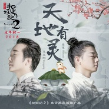

天地有灵
============================

|  |  |
| :--: | :-- |
| [ 天地有灵](https://emumo.xiami.com/album/2102904989) | **艺人**: [霍尊](../index.md) **语种**: 国语 **唱片公司**: 听见时代 **发行时间**: 2017年11月03日 **专辑类别**: EP, 单曲 **专辑风格**: 国语流行 Mandarin Pop, 中国风 China-Wave **播放数**: 1705783 **收藏数**: 402 **评论数**: 45  |

## 简介

万物皆有灵，是非难辨明  
念寻呼与吸，泅渡一世纪  
“刚”好遇见“卷珠帘”  
“玉”见至美 “霍”然开朗  
双“侠”合璧 “妖”你同行！  
李玉刚 霍尊  
「《捉妖记2》风云再起版推广曲」《天地有灵》  
  
2015年，电影《捉妖记》叫好又叫座，小妖王胡巴呆萌形象深入人心。时隔两年，《捉妖记2》携白百何、井柏然等原班人马回归，梁朝伟、李宇春、杨祐宁、大鹏、柳岩、黄磊、吴莫愁、X玖少年团等众多新伙伴加盟，影片将于2018大年初一上映。“妖”风四起，在这场腥风血雨来临之前，力邀中国歌剧舞剧院国家一级演员李玉刚、新生代跨界小天王霍尊两位乐坛顶级古风“双侠”合璧，献唱《捉妖记2》风云再起版推广曲《天地有灵》，唱响中国独一无二的东方美学，用歌声呼唤胡巴和它的小伙伴们。捉妖风云再起，天地有灵，“妖”你同行！  
  
古风“双侠”公开“PK” 风云再起音乐先行  
“捉妖记”系列根据中国神话故事改编，构建了一个人与妖共存的奇幻世界。有“史莱克之父”之称的导演许诚毅一直醉心于中国传统文化，擅长用好莱坞的人物设定和叙事方式，讲述充满浓浓中国风的魔幻故事，打造真正“中国制造”的奇幻大片。而在音乐领域，拥有“贵妃式”唱腔的李玉刚和真假声唱腔驾驭自如的霍尊也始终不忘初心，坚持发扬中国传统文化，不断将古典文化与现代音乐元素相融合，力图打造最具中国特色的古典风格派流行音乐，引领东方音乐的传承和发展。所以此次，作为电影《捉妖记2》的音乐合作伙伴，听见时代传媒全力促成了“最中国”、“最东方”的重磅合作——力邀李玉刚、霍尊“双侠合璧”，为《捉妖记2》掀起首轮音乐风潮。《天地有灵》可以说是李玉刚、霍尊两位古风“双侠”首度合作原创作品，公开“pk”为“捉妖”，成就华语乐坛上又一次现象级作品。对于本次合作，二人表示期待已久：“一直在等待一个好作品能真正合作一次，终于在电影《捉妖记2》中让曾经的想法得以实现”。  
  
《天地有灵》“妖”你同行 传承最东方音乐  
《天地有灵》是电影《捉妖记2》的风云再起版推广曲，是内地影视音乐团队听见时代传媒力邀《卷珠帘》词作者李姝操刀的又一次“中国风”力作，每一句歌词都非常经典与考究，为《捉妖记2》量身定制，也表现出极高的文学境界和意境，获得李玉刚和霍尊的高度赞誉：“她把歌词做到了极致！”歌词给李玉刚的感觉是一切有灵，看似复杂，实则简单清澈，于是他亲自为歌曲命名《天地有灵》。歌词“爱与害，正与邪，一体；明善恶，先降伏，自己；生命一呼一吸，命运微尘一粒，即人亦妖一念而已”蕴含了深刻的哲理。造化万物有灵，灵则是生命，而任何生命起源便存在善恶一体两面，互相制约，这是一切物种的根本属性。降伏自己，改变自己，才能认识整个世界，也才能接受世间的一切。成恶成善，是人亦妖，一念既明心意。  
  
《天地有灵》的编曲则以奇幻开场，中国大鼓雷动像正与邪、善与恶在交战，中国民族乐器和大型管弦融合，刚柔并济，象征西方与东方的结合。霍尊评价：“编曲很到位，用的特色乐器，妖娆的和声部分色彩与《捉妖记2》非常吻合。”歌曲专属于电影，不仅承载着《捉妖记2》风云再起的开篇效应，更体现电影“东方奇幻”特质。大格局，同时兼具代表性及流行度；歌词突出“人与妖”的共通点，体现中国古老文化精神传承，突出“东方奇幻”感，带有《山海经》中的神话色彩；融合京剧与流行元素的宏大格局，奇幻开场，中国民族乐器和大型管弦交相辉映，刚柔并济，将东西方文化达成一次完美结合。  
无论是演唱者李玉刚、霍尊，还是电影《捉妖记2》，都在不断尝试将古典文化融于作品中，宣扬并传承中国传统文化，寻找新东方之美。而《天地有灵》这首歌，无论是音乐，还是视觉，都回归了东方传承，中国戏曲、流行搭配东方魔幻式的电影相得益彰，不仅将电影《捉妖记2》的影片气质，更是将东方大国文化体现得淋漓尽致，给人们带来真正的东方之美。

## 曲目

## 评论

|  |  |  |
| :-- | :-- | :-- |
|  [虾米用户](https://emumo.xiami.com/u/374062390)  2018-05-31 04:57 赞(0) 踩(0) | 
支持你!霍尊,谢谢你的付出 
 |
|  [虾米用户](https://emumo.xiami.com/u/285664805) 从哪里跌倒，就要从哪里站... 2018-03-17 10:18 赞(0) 踩(0) | 

 |
|  [虾米用户](https://emumo.xiami.com/u/303129623)  2018-02-24 15:31 赞(0) 踩(0) | 

 |
|  [虾米用户](https://emumo.xiami.com/u/303129623)  2018-02-24 15:30 赞(0) 踩(0) | 
 
 |
|  [虾米用户](https://emumo.xiami.com/u/16876838) 我还没想好要写什么... 2018-01-14 07:30 赞(0) 踩(0) | 
支持霍尊
 |
|  [虾米用户](https://emumo.xiami.com/u/16876838) 我还没想好要写什么... 2018-01-14 07:29 赞(0) 踩(0) | 
霍尊的歌都喜欢，天籁
 |
|  [虾米用户](https://emumo.xiami.com/u/343105981)  2018-01-06 12:28 赞(0) 踩(0) | 
好听好听
 |
|  [虾米用户](https://emumo.xiami.com/u/308236903)  2017-12-03 18:54 赞(0) 踩(0) | 
了
 |
|  [虾米用户](https://emumo.xiami.com/u/336263070)  2017-11-20 17:47 赞(0) 踩(0) | 
仙气十足
 |
|  [虾米用户](https://emumo.xiami.com/u/3200106) 随心随意 2017-11-14 00:04 赞(1) 踩(0) | 
两山神仙合作了
 |
| ⇒ |  [虾米用户](https://emumo.xiami.com/u/330542938)  2017-11-23 12:30 赞(0) 踩(0) | 
的哦
 |
|  [虾米用户](https://emumo.xiami.com/u/332956125)  2017-11-13 00:19 赞(0) 踩(0) | 
先生们终于合作了！太好听了吧
 |
|  [虾米用户](https://emumo.xiami.com/u/282615853)  2017-11-08 09:03 赞(0) 踩(0) | 
真是天地间有灵气的作品。真是天地间有灵气的作品。
 |
| ⇒ |  [虾米用户](https://emumo.xiami.com/u/330542938)  2017-11-23 12:24 赞(0) 踩(0) | 
去2 18
 |
|  [虾米用户](https://emumo.xiami.com/u/282615853)  2017-11-08 09:03 赞(0) 踩(0) | 
真是天地间有灵气的作品。
 |
|  [虾米用户](https://emumo.xiami.com/u/282615853)  2017-11-08 09:02 赞(0) 踩(0) | 
真是天地间有灵气的作品。
 |
|  [虾米用户](https://emumo.xiami.com/u/317942716) 我只是个赫兹 2017-11-07 23:39 赞(2) 踩(0) | 
俩人的和声很美，让我们看到了世间上的一切的生灵， 尊声天籁，赫兹最爱。 霍尊 李玉刚。
 |
|  [虾米用户](https://emumo.xiami.com/u/2928117) 你好 2017-11-06 20:07 赞(0) 踩(0) | 
李玉刚得罪了P图师吗
 |
|  [虾米用户](https://emumo.xiami.com/u/27731020)  2017-11-06 14:24 赞(0) 踩(0) | 
emmmm&amp;hellip;&amp;hellip;李玉刚这封面是去整容了吗&amp;hellip;&amp;hellip;
 |
|  [虾米用户](https://emumo.xiami.com/u/304898375)  2017-11-06 12:04 赞(0) 踩(0) | 
期待电影
 |
|  [虾米用户](https://emumo.xiami.com/u/50099141)  2017-11-06 08:16 赞(1) 踩(0) | 
好好听 #霍尊#
 |
|  [虾米用户](https://emumo.xiami.com/u/488297)  2017-11-06 07:27 赞(0) 踩(0) | 
[Reply@昵称什么的...]此人只应天上有 
 |
|  [虾米用户](https://emumo.xiami.com/u/318012923)  2017-11-05 11:19 赞(1) 踩(0) | 
猛听得金鼓响画角声震， 唤起我破天门壮志凌云。 想当年桃花马上威风凛凛， 敌血飞溅石榴裙。 有生之日责当尽， 寸土怎能够属于他人。 番王小丑何足论， 我一剑能挡百万兵。&amp;mdash;&amp;mdash;刚刚看了蒙面花絮，鹿由器今晚才艺表演有唱京剧 《穆桂英挂帅》。 听这个京腔，蒙面鹿由器应该就是霍尊了。
 |
|  [虾米用户](https://emumo.xiami.com/u/304898375)  2017-11-05 07:42 赞(0) 踩(0) | 
好
 |
|  [虾米用户](https://emumo.xiami.com/u/317941191) 人一生会遇到两个人，一个... 2017-11-04 23:08 赞(2) 踩(0) | 
&amp;ldquo;玉&amp;rdquo;见至美，&amp;ldquo;霍&amp;rdquo;然开朗
 |
|  [虾米用户](https://emumo.xiami.com/u/317941191) 人一生会遇到两个人，一个... 2017-11-04 23:06 赞(1) 踩(0) | 
&amp;ldquo;刚&amp;rdquo;好遇见&amp;ldquo;卷珠帘&amp;rdquo;。
 |
|  [虾米用户](https://emumo.xiami.com/u/317941191) 人一生会遇到两个人，一个... 2017-11-04 23:04 赞(0) 踩(0) | 
这小嗓。
 |
|  [虾米用户](https://emumo.xiami.com/u/192480440)  2017-11-04 18:39 赞(1) 踩(0) | 
霍尊终于有新歌了又～～好听～喜欢，最喜欢的歌手之一，小嗓好棒！   
 |
|  [虾米用户](https://emumo.xiami.com/u/38793446)  2017-11-04 15:51 赞(0) 踩(0) | 
霍尊的嗓子是真好
 |
|  [虾米用户](https://emumo.xiami.com/u/331961470) 天神哥哥 2017-11-04 06:46 赞(0) 踩(0) | 
我等了好久了
 |
|  [虾米用户](https://emumo.xiami.com/u/331961470) 天神哥哥 2017-11-04 06:46 赞(0) 踩(0) | 
终于
 |
|  [虾米用户](https://emumo.xiami.com/u/325501710) 想飞想上天～ 2017-11-03 22:15 赞(1) 踩(0) | 
我去李玉刚和霍尊！！这是要上天？？
 |
|  [虾米用户](https://emumo.xiami.com/u/277914084) 青松碎云蹁跹，饮风共醉月... 2017-11-03 22:05 赞(0) 踩(0) | 
前排
 |
|  [虾米用户](https://emumo.xiami.com/u/166302128) 冷冷清清的风风火火. 2017-11-03 20:03 赞(0) 踩(0) | 
好怕一觉醒来又听不了 
 |
|  [虾米用户](https://emumo.xiami.com/u/318008332) 為霍尊而申請 2017-11-03 15:51 赞(1) 踩(0) | 
細細品味，這仙曲 
 |
|  [虾米用户](https://emumo.xiami.com/u/18102228)   2017-11-03 15:31 赞(0) 踩(0) | 
太厉害啊这两个人～竟然合作了～～～
 |
|  [虾米用户](https://emumo.xiami.com/u/5715700) 怕麻烦的懒人 2017-11-03 15:12 赞(1) 踩(0) | 
这两个大神合作真是太贴合歌曲了  灵气造化 好听哭了 
 |
|  [虾米用户](https://emumo.xiami.com/u/318309626)  2017-11-03 15:03 赞(0) 踩(0) | 
6人合唱团已经上线！！万物相生皆有灵，主宰是人心！
 |
|  [虾米用户](https://emumo.xiami.com/u/50070886) 霍尊赫兹新闻站，赫兹自己... 2017-11-03 13:36 赞(4) 踩(0) | 
一弦一韵皆有灵，一声一息总醉人&amp;mdash;&amp;mdash;霍尊
 |
|  [虾米用户](https://emumo.xiami.com/u/318012923)  2017-11-03 13:36 赞(1) 踩(0) | 
厉害了霍霍
 |
|  [虾米用户](https://emumo.xiami.com/u/187209372)  2017-11-03 13:31 赞(1) 踩(0) | 
玉先生 
 |
|  [虾米用户](https://emumo.xiami.com/u/318012923)  2017-11-03 13:27 赞(1) 踩(0) | 
好评。每次听霍尊都有新的惊喜。
 |
|  [虾米用户](https://emumo.xiami.com/u/314418260)  2017-11-03 12:41 赞(0) 踩(0) | 
粉丝们快来哟，两位爱豆合作了
 |
|  [虾米用户](https://emumo.xiami.com/u/314418260)  2017-11-03 12:40 赞(1) 踩(0) | 
看来我来得还早呢，赞一个
 |
|  [虾米用户](https://emumo.xiami.com/u/97273870)  2017-11-03 12:39 赞(0) 踩(0) | 

 |
