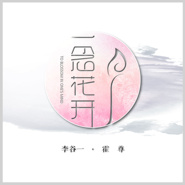

一念花开To Blossom in One's Mind
============================

|  |  |
| :--: | :-- |
| [ 一念花开To Blossom in One's Mind](https://emumo.xiami.com/album/2103465226) | **艺人**: [霍尊](../index.md) **语种**: 国语 **唱片公司**: 星文嘉艺 **发行时间**: 2018年01月18日 **专辑类别**: EP, 单曲 **专辑风格**: 国语流行 Mandarin Pop, 中国风 China-Wave **播放数**: 841632 **收藏数**: 223 **评论数**: 38  |

## 简介

《一念花开》由乐坛实力派歌手李谷一、霍尊联袂演唱，细腻而感性的演绎了一段穿越千年的爱情故事。  
从惊鸿一瞥的初见、到独自凭栏的等候，再到辗转难眠的思念、最终细水流年的相守，其含蓄之美、娴静之美、雅致之美等在“一念花开”中尽现，把最淳朴、最浓郁的东方神韵呈现给了全世界。

## 曲目

## 评论

|  |  |  |
| :-- | :-- | :-- |
|  [虾米用户](https://emumo.xiami.com/u/411968903)  2020-01-15 18:35 赞(1) 踩(0) | 
好美啊
 |
|  [虾米用户](https://emumo.xiami.com/u/49341970) 既然没人认识我，那就——... 2019-11-11 20:43 赞(0) 踩(0) | 
太美了
 |
|  [虾米用户](https://emumo.xiami.com/u/427614239)  2019-07-22 20:36 赞(0) 踩(0) | 
唯美
 |
|  [虾米用户](https://emumo.xiami.com/u/354653296)  2018-04-18 21:46 赞(0) 踩(0) | 
好听，我已醉，，我尊:-* 
 |
|  [虾米用户](https://emumo.xiami.com/u/352013459)  2018-03-05 05:27 赞(0) 踩(0) | 
超好听！
 |
|  [虾米用户](https://emumo.xiami.com/u/345468732)  2018-02-19 22:53 赞(0) 踩(0) | 
很好听！
 |
|  [虾米用户](https://emumo.xiami.com/u/318076290)  2018-02-11 02:43 赞(0) 踩(0) | 
美
 |
|  [虾米用户](https://emumo.xiami.com/u/333102351)  2018-02-09 02:37 赞(1) 踩(0) | 
好听，醉了，喜欢
 |
|  [虾米用户](https://emumo.xiami.com/u/318183155)  2018-01-25 04:06 赞(2) 踩(0) | 
一首唯美动听的歌，太好听了
 |
|  [虾米用户](https://emumo.xiami.com/u/346054578)  2018-01-23 19:20 赞(1) 踩(0) | 
兩位天籟之聲的合作 將此歌曲表達得盡善盡美... 尤其 融入了傳統戲曲的小嗓 真是令人一再驚豔哪!!! 也謝謝幕後團隊的努力創作~~~
 |
|  [虾米用户](https://emumo.xiami.com/u/345689720)  2018-01-21 02:57 赞(2) 踩(0) | 
根本就不是妖艳贱货们能比的
 |
|  [虾米用户](https://emumo.xiami.com/u/37412546)  2018-01-20 17:59 赞(1) 踩(0) | 
最喜欢霍尊对这一段的处理彩蝶双双谁流连
 |
|  [虾米用户](https://emumo.xiami.com/u/345471903) 那年大唐四月雪 2018-01-20 14:53 赞(8) 踩(0) | 
欣赏歌曲的同时，向词作家彭亮老师、作曲家刘岳老师、编曲刘岳老师和毕健博老师、混音师王磊老师、以及幕后的所有工作人员，奉上我们由衷地感谢！在这首优秀作品背后，他们倾注了多少心血！付出了多少个不眠之夜！遇到过多少挫折！这些都是我们难以想象的！再次感谢为音乐、为理想付出的大师们！辛苦啦   
 |
|  [虾米用户](https://emumo.xiami.com/u/34103474)  2018-01-19 23:27 赞(2) 踩(0) | 
前奏优美，两大实力歌手合作献唱古风歌，单曲循环。
 |
|  [虾米用户](https://emumo.xiami.com/u/345471903) 那年大唐四月雪 2018-01-19 20:25 赞(3) 踩(0) | 
老一辈艺术大家李谷一老师与90后天籁之音霍尊的完美演绎！
 |
|  [虾米用户](https://emumo.xiami.com/u/331910045)  2018-01-19 13:47 赞(1) 踩(0) | 
心弦悠悠谁拨乱
 |
|  [虾米用户](https://emumo.xiami.com/u/16876838) 我还没想好要写什么... 2018-01-19 12:27 赞(0) 踩(0) | 
两代歌王的绝妙合作，
 |
| ⇒ |  [虾米用户](https://emumo.xiami.com/u/2454761) 天天被生活QJ 2018-01-19 13:43 赞(0) 踩(0) | 
歌王......你给霍尊封的？
 |
|  [虾米用户](https://emumo.xiami.com/u/146479222)  2018-01-19 11:20 赞(4) 踩(0) | 
霍尊和李谷一老师把这首歌演绎的太惊艳了！霍尊本嗓性感，小嗓妩媚，歌曲中的戏腔部分特别有韵味，喜欢！好听！
 |
|  [虾米用户](https://emumo.xiami.com/u/213533977)  2018-01-19 11:17 赞(1) 踩(0) | 
好听好听好听
 |
|  [虾米用户](https://emumo.xiami.com/u/50130570)   2018-01-19 08:57 赞(14) 踩(0) | 
很惊艳的一首合作歌曲。除了歌曲有中国传统的古风古韵之外，惊艳于李谷一这个年纪还能有这么好的嗓音状态，和她年轻时基本没有大的变化，不服不行；也惊艳于霍尊这么多丰富的唱法在短短一首歌中集中呈现，不愧是年轻一代为数不多的才子加实力唱将
 |
|  [虾米用户](https://emumo.xiami.com/u/50106170) xuehuapaopao 2018-01-18 14:28 赞(3) 踩(0) | 
好喜欢这首歌！好喜欢这新老两代最棒的艺术家！
 |
|  [虾米用户](https://emumo.xiami.com/u/9301514) 独立唱作人 2018-01-18 14:11 赞(3) 踩(0) | 
这首可以一起登春晚，李谷一老师和翩翩公子霍尊
 |
| ⇒ |  [虾米用户](https://emumo.xiami.com/u/342160211) 多谢你如此精彩耀眼，做我... 2018-01-20 07:45 赞(0) 踩(0) | 
要是真登啦我一定要看
 |
| ⇒ |  [虾米用户](https://emumo.xiami.com/u/9301514) 独立唱作人 2018-01-21 10:42 赞(0) 踩(0) | 
<q><b>温暖半夏说：</b></q>
 |
| ⇒ |  [虾米用户](https://emumo.xiami.com/u/342160211) 多谢你如此精彩耀眼，做我... 2018-01-21 10:49 赞(0) 踩(0) | 
<q><b>阿兴爱吃苹果_唱作人思华说：</b></q>
 |
|  [虾米用户](https://emumo.xiami.com/u/344913498)  2018-01-18 10:57 赞(0) 踩(0) | 
太好听了！霍尊的唱法好多变化。整首歌曲非常唯美！
 |
|  [虾米用户](https://emumo.xiami.com/u/121499040)   2018-01-18 10:40 赞(0) 踩(0) | 
李谷一是老前辈，说真的她唱功真的不敢恭维，我不是学音乐专业的，有说得不对的地方，勿喷！
 |
|  [虾米用户](https://emumo.xiami.com/u/5755)  2018-01-18 09:53 赞(0) 踩(0) | 
老艺术家~~~~
 |
|  [虾米用户](https://emumo.xiami.com/u/758252) 就是暂无签名~咋地 2018-01-18 09:15 赞(0) 踩(0) | 
老师 今年春晚不压轴了吗
 |
|  [虾米用户](https://emumo.xiami.com/u/1469748)  2018-01-18 09:11 赞(0) 踩(0) | 
准备上春晚了？
 |
|  [虾米用户](https://emumo.xiami.com/u/282359895)  2018-01-18 08:58 赞(1) 踩(0) | 
李老师和霍尊的声音就是那花开的声音，听到这样的声音，还仿佛闻到了花的芬芳，看到了离自己若远若近的神奇世界&amp;mdash;&amp;mdash;过去、现在、未来？
 |
|  [虾米用户](https://emumo.xiami.com/u/282359895)  2018-01-18 08:54 赞(0) 踩(0) | 
一念花开，心弦悠悠谁拔乱？
 |
|  [虾米用户](https://emumo.xiami.com/u/279072464)  2018-01-18 00:42 赞(1) 踩(0) | 
怎么没有声音
 |
|  [虾米用户](https://emumo.xiami.com/u/11157355) 榕树长青 2018-01-18 00:20 赞(2) 踩(0) | 
十年前有机缘和李老师通过电话，很喜欢您的作品！
 |
|  [虾米用户](https://emumo.xiami.com/u/41932635) 笑嘻嘻地难过着 2018-01-18 00:07 赞(0) 踩(0) | 
李谷一？？？？？？
 |
|  [虾米用户](https://emumo.xiami.com/u/298146946) 谢谢你的微笑，曾经慌乱过... 2018-01-18 00:02 赞(0) 踩(0) | 
前排沙发
 |
|  [虾米用户](https://emumo.xiami.com/u/11157355) 榕树长青 2018-01-18 00:01 赞(1) 踩(0) | 
一念花开
 |
