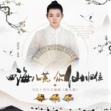

离人泪
============================

|  |  |
| :--: | :-- |
| [ 离人泪](https://emumo.xiami.com/album/2103885110) | **艺人**: [霍尊](../index.md) **语种**: 国语 **唱片公司**: 腾讯游戏 **发行时间**: 2018年08月01日 **专辑类别**: EP, 单曲 **专辑风格**:  **播放数**: 2757 **收藏数**: 57 **评论数**: 5  |

## 简介

四海八荒，众仙归来！知名音乐人霍尊献唱寻仙演唱十周年主题曲——《离人泪》，2018年8月1日全球首发，仙音萦绕，静待聆听！   
  
2008-2018，寻仙作为一款经典的游戏IP，已衍生出包括新寻仙、寻仙2、寻仙手游的产品矩阵，用十年的时间陪伴了喜爱这一IP的玩家们。十周年之际，寻仙推出全新主题曲《离人泪》，由音乐人叶青赛兰创作，霍尊演唱，亚洲爱乐乐团演奏，曲调优美，融入古筝、长笛、萧、大鼓等中国民乐元素，词文充满意境，配合霍尊极具功力的声线，更显仙韵之美。   
  
整首歌以第一视角描述了玩家之间的浓浓深情，不仅关乎于爱情，也关乎于友情。“山长水阔碎我梦，路遥千里烟波，午夜梦回时候你，总萦绕心中，何时能与你再重逢？”一字一句，娓娓道来，却又充满力量，仿佛在诉说着仙友之间的回归期盼。“归隐桃源之境，独成仙太孤寂，没有你一人永生有何益。”在歌曲的结尾，逐渐堆叠的情绪到达巅峰之境，也正象征这寻仙对玩家们的邀请：寻仙十周年，祈愿盼君归！

## 曲目

## 评论

|  |  |  |
| :-- | :-- | :-- |
|  [虾米用户](https://emumo.xiami.com/u/49012743)  2018-12-02 23:17 赞(1) 踩(0) | 
真的非常好听！！！太棒了
 |
|  [虾米用户](https://emumo.xiami.com/u/302056806) 我还没想好要写什么... 2018-08-29 15:54 赞(2) 踩(0) | 
非常好听&amp;hellip;
 |
|  [虾米用户](https://emumo.xiami.com/u/400555797)  2018-08-07 11:58 赞(1) 踩(0) | 
很好听
 |
|  [虾米用户](https://emumo.xiami.com/u/342181822) 不愿说再见。那么，我走了... 2018-08-04 16:02 赞(1) 踩(0) | 
下架了，失望，还有，另一首未摘花已发行，各位可以去网上找
 |
|  [虾米用户](https://emumo.xiami.com/u/342181822) 不愿说再见。那么，我走了... 2018-08-01 19:19 赞(2) 踩(0) | 
如果我没记错，霍尊好像唱过一首《离人》
 |
