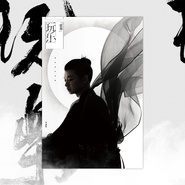

玩乐
============================

|  |  |
| :--: | :-- |
| [ 玩乐](https://emumo.xiami.com/album/2104396885) | **艺人**: [霍尊](../index.md) **语种**: 国语 **唱片公司**: 听见时代 **发行时间**: 2018年12月18日 **专辑类别**: 录音室专辑 **专辑风格**: 国语流行 Mandarin Pop **播放数**: 2937402 **收藏数**: 305 **评论数**: 32  |

## 简介

歌声过电 穿越次元  
突破自我 玩转音乐世界  
心随乐动 乐在其中  
全新创作的音乐理念  
超凡脱俗的视觉呈现  
  
『国风美少年』霍尊  
2018全新专辑【玩乐】  
12.18正式发行  
  
继2015年霍尊的首张专辑《天韵·霍尊》为我们呈现一副古韵悠然的唯美音乐画卷后，在音乐之路上不断前行的仙尊终于推出了第二张个人专辑《玩乐》。说到专辑名字《玩乐》，也正如霍尊的个性一般，亦静亦动，生活中90后活力大男孩的顽皮本性流露无遗，平时日常的兴趣爱好广泛，别看他台上仙气飘飘，生活中却是个爱打篮球，爱玩游戏，还喜欢看二次搭模型收集手办的邻家大男孩，但闪回到另一个纬度里，他又变成爱阅读古籍，闻香品茗的古典美男，在音乐世界里国风美少年的沉稳典雅与意气风发，在这张全新的专辑里充分展现，有对古典音乐的创新，也有对现代流行音乐的精雕细琢，十首作品叙述十个故事，仿佛一个创意无穷大的“莫比斯环”，串起霍尊音乐世界里的幻想空间。  
  
乐，这个字非常奥妙，可谓一字两意，除了代表霍尊的音乐，更体现了他对人生的一种态度，悠然自得，随心所欲。这种坦然放松的乐观心态也让他从音乐中获得了丰富的乐趣。这一次的霍尊要带领大家“乐”玩“乐”开心。不过在筹备第二张专辑《玩乐》中的作品时，可没有想象中那么简单，霍尊首先是想要塑造一个用音乐来述说的主题。在首张专辑《天韵·霍尊》所营造的唯美画面与优美旋律相融合的国风音乐展现了古典艺术的魅力，而《玩乐》的概念则是崇尚自然，回归生活本源的一个转变。这一次的霍尊选择用轻松写意的音乐视角，讲述一个个他关注的话题与故事，有对大自然的关爱，有对情感的珍惜，有对传统文化的追求，还有他对理想的坚持与执着。磨炼出了这张可谓“道法自然”的唱片，霍尊力邀一班志同道合的前辈师长与好友来担纲制作与编曲，著名音乐人郑伟、田汨、严俊、陈致逸、孙伟，著名钢琴家宋思衡，以及新加坡音乐人Terence Teo等老师来合作，填词上也是请到著名词人方文山、甘世佳、田辰明、还有好友全能音乐人兼歌手孟楠、嘻哈歌手罗开元等一起齐心协力，还邀请到圈内著名的前辈音乐人安栋老师来保驾护航，如此众多的音乐大咖们一起发力，共同打造了一场玩兴正浓的音乐大PARTY。  
  
这次的专辑整体设计颇为特别，所谓“大音希声，大象无形”，以《道德经》中崇尚自然的美学观念，视觉呈现出轻烟薄雾，若隐若现的霍尊形象更显得清新高雅，而双封面设计中的一款手绘插画风格的霍尊，用优美的笔触展现了一个花样美男形象十分惊艳，这和二次元属性中的霍尊还真是像极了。  
  
  
歌曲介绍：  
<ul> 
<li><strong>1</strong><strong>、『醒』   </strong><strong>词：甘世佳   曲：霍尊  编曲：严俊 </strong><strong> </strong></li> 
</ul> 
《醒》这首歌源自于初出道时的第一首原创作品，也是打开霍尊音乐创作的一扇门，这首歌就是整张专辑的一个引子，寓意着从149亿年前的宇宙大爆炸之后，混沌宇宙中又诞生了一个全新的星球，让我们随着他的音乐睁开双眼，从梦境中醒来，进入另一个由霍尊为大家营造的奇幻世界，这正如一幅幅音乐画卷的慢慢展开，“玩乐 ”的旅程开始了。  
<ul> 
<li><strong>2</strong><strong>、『穿越吧！猛犸』   </strong><strong>词：孟楠   曲：霍尊  编曲：郑伟</strong></li> 
</ul> 
从宇宙大爆炸后的沉睡中醒来的霍尊要带你认识星球上一群早已消失的远古生物——猛犸，在他天马行空的幻想世界里，猛犸象遭受了宇宙大爆炸后的巨大伤痛，随着时光机器穿越到文明高度发展的当今时代，却依然生活在会被人类掠夺象牙的恐惧阴影之下。一直以来，霍尊的作品都有一种现代流行歌曲中难能可贵的人文情怀，他试图在作品里表达自己对社会，对人与自然的关心与提醒。这样一个超越现实，却又独具现实意义的故事，能看出霍尊对关爱大自然有着严肃的使命感。  
“猛犸”在音乐上也展现了霍尊的另外一面，霍尊也参与到编曲当中，从音乐风格上也能直观地感受到不同以往的改变：从以往仙乐飘飘的风格，转向迷幻与冲撞的电音节奏，霍尊也一改以往温和、清新唱腔，加上了合成器效果，颇有“重‘霍’新声”的快感。  
  
  
<ul> 
<li><strong>3</strong><strong>、『少女与海』    </strong><strong>词：甘世佳   曲：霍尊  编曲：田汨</strong></li> 
</ul> 
拯救了猛犸的少年，又再度启程离开那个安全的港口，独自踏上旅程，途中会有风浪颠簸，这一路上，你会遇见一些不速之客，与你相处，给你希望也给你失望，也可能会残忍的相互厮杀，而你只有比自己的周遭更强大才能保护自己。当然最可怕的是你心中的恐惧和欲望。只有经历过这种种磨炼到达彼岸时，回头看那艘载着你在海上流浪的青春小船已经沉没，那一刻你才会明白什么叫做成长。这首歌里霍尊用不食人间烟火的声音，去解读尘世中的欲望。如果能从中听到那人鱼歌声里的回响，那在平凡生活中我们就能发现更多美好的事物正在闪闪发光。  
<ul> 
<li><strong>4</strong><strong>、『追风筝的人』   </strong><strong>词：石弋洋   曲：石弋洋  编曲：宋思衡</strong></li> 
</ul> 
解读完自己内心的欲望，认清了自己追求的梦想，紧握着风筝的线，追随着梦想的脚步向前奔跑，这首《追风筝的人》一直是霍尊特别钟爱的歌曲，兰天洋老师的原唱就非常的触动人心，这首歌在经过钢琴家宋思衡的重新编排下，完成了这样一首纯钢琴伴奏版本的《追风筝的人》，再配上霍尊假声男高音的唱法来演绎，更为阳春白雪，独具艺术特性。  
<ul> 
<li><strong>5</strong><strong>、『伶仃』        </strong><strong>词：田辰明  曲：霍尊  编曲：</strong><strong>陈致逸</strong>     
&amp;张力尹 虐心恋曲 情深对唱  
这首虐心的对唱情歌《伶仃》，让翩翩仙子霍尊摇身变为落入凡间的痴情小哥哥，扎扎实实地谈了一回虐心之恋。与“Vocal系铂金嗓”女歌手张力尹二人踏实走心的演绎，让我们看到他一步一步，从懵懂少年踏实走来的成长历程，尤其是通过《歌手》舞台，把自己的才华与歌艺展现的淋漓尽致，一路走来，他怀着一颗感恩的心，始终谦逊有礼，始终胸怀宽广，始终不忘初衷，对于每一位爱听他唱歌的听众来说，他依然还是那个敞开胸怀欢迎大家来到他的音乐世界里的少年霍尊，他还会有更多的深情絮语要唱给你们听！</li> 
</ul> 
<ul> 
<li><strong>6</strong><strong>、『未摘花』     </strong><strong>词：甘世佳   曲：霍尊  编曲：田汨</strong>  
“花非花，雾非雾”，等到你错过时方才发现，原来它“来如春梦几多时？去似朝云无觅处。”这种淡淡的忧伤与惋惜之情隐藏在《未摘花》的旋律中，朦胧之中又呈现出一副残缺的美感。而这种遗憾正如属于我们东方传统的美，不要轻易摒弃掉最初的梦，要把握住当下的美好。霍尊的音乐梦境中又怎么会少了东方之美呢？</li> 
</ul> 
  
<ul> 
<li><strong>7</strong><strong>、『九色鹿』      </strong><strong>词：方文山   曲：霍尊   编曲：</strong>Terence Teo  
“九色鹿”这一古老而优美的故事娓娓道来，对于传统文化的传承也一直是霍尊致力于做的事，他把这种属于东方的美，用音乐来表达，并且流传下去。</li> 
</ul> 
<ol> 
<li><strong>、『梨花颂』      </strong><strong>词：翁思再   曲：杨乃林  编曲：郑伟</strong>  
致敬经典 将中华传统文化 薪火相传  
这两年霍尊私下里与戏曲接触颇多，不仅平时爱听京剧，还特地拜师学昆曲，正是这样的熏陶使得他对中国传统文化与流行音乐有了独到的见解。霍尊曾受邀担任戏曲文化节目《喝彩中华》的观察员，他非常高兴能有这样一次学习戏曲文化的机会。在舞台上，看到一位位戏曲艺术家的精彩表演，有创新有融合，有坚持不懈，更有薪火相传，霍尊也是情不自禁地上台展现了自己的才艺，这些都让我们看到了这位年轻的90后音乐人，在戏曲文化的传承中所展现的“创新”理念。  
2016年，在人民大会堂举办的个人演唱会上，霍尊特别献唱了这首歌曲，向梅先生致敬，得到了大家的一致好评。正是这样的一次契机，霍尊与好友制作人郑伟一起把这首歌曲做了兼具古典与现代的创新，加入了电音的元素，再配上霍尊高亢亮丽的声音来演绎，真是傲骨仙风，典则俊雅，将中华传统文化之美展现的淋漓尽致。  
  
<strong>9</strong><strong>、『太极·禅』   </strong><strong>词：霖语彷徨   曲：霍尊   RAP：罗开元  编曲：郑伟、霍尊</strong></li> 
  
  
  
</ol> 
对于这首《太极·禅》，缘自与李连杰老师的一次相遇。今年，霍尊应“太极禅”品牌的邀请担任推广大使，霍尊也对太极文化有着浓厚的兴趣，也表示想要学几招太极招式，没想到好学的霍尊，竟然感动了李连杰老师亲自教学，更没想到就是这次传授太极的机会，杰哥夸赞霍尊天资聪慧，稍加点拨，招式已经有模有样了，那这个拜师的机会可不能错过！为了完成师父布置的任务，为太极文化打造一首主题曲，“太极禅”的传承与突破理念刚好和霍尊的音乐理念不谋而合，这首歌的创作灵感自然而生，霍尊速度给师父交出了一份满意的答卷。  
歌曲和缓又激扬的旋律如一首跌宕的叙事诗诉说着一个少年的起伏人生，音乐上的快慢结合，似娓娓道来又似在抒发豪情。在编曲上，霍尊与制作人郑伟合力大开脑洞，整首歌曲中采用了琵琶、二胡、古筝等传统乐器，又加入了现代鼓的演绎，并融合了最为流行的电音元素，处处彰显古今的情调与别致、中西的碰撞和激情。为此，霍尊还邀请来嘻哈歌手罗开元，让这首新作既披着炫酷外衣，融合嘻哈的时尚元素，又有着深刻的传统文化表达。  
<ol> 
<li><strong>、『泽泊』    </strong><strong>词：田辰明  曲：霍尊  编曲：田汨</strong></li> 
</ol> 
“大音希声，大象无形”，《道德经》里的自然美学，融入到音乐中或许就是《泽泊》这样的感觉，脑海中浮现的画面犹如一副《寒江独钓图》，一帆小舟，一位渔翁在江上垂钓，没有画出一滴水，却能使人感受到烟波浩渺，这就是中国传统文化中的独特魅力——留白。《泽泊》把《玩乐》音乐旅程推向了一个悠远的意境，与《醒》首尾呼应，相得益彰。从过去到未来，从西方到东方，一切都仿佛是一个轮回，一个力量无穷大的莫比斯环，而霍尊正沿着他的音乐之路一直走下去，永远不会停下来。  
  
  
  
 

## 曲目

## 评论

|  |  |  |  |
| :-- | :-- | :-- | :-- |
|  [虾米用户](https://emumo.xiami.com/u/342181822) 不愿说再见。那么，我走了... 2020-05-03 10:16 赞(0) 踩(0) | 
我个人觉得九色鹿和少女与海两首最得我心。从发布听到现在，这张专辑里记忆最深刻的就是这两首（少女与海这首歌必须吹爆 ）
 |
|  [虾米用户](https://emumo.xiami.com/u/342181822) 不愿说再见。那么，我走了... 2020-05-03 10:14 赞(0) 踩(0) | 
这张专辑可以的 绝对不止流行音乐这么简单需要细品 
 |
|  [虾米用户](https://emumo.xiami.com/u/42984609)   2019-07-23 08:26 赞(1) 踩(0) | 
非常好听！
 |
|  [虾米用户](https://emumo.xiami.com/u/299922166)  2019-06-30 20:31 赞(3) 踩(0) | 
首首经典，而且越听越好听啊。
 |
|  [虾米用户](https://emumo.xiami.com/u/302039348) 我还没想好要写什么... 2019-03-04 13:18 赞(4) 踩(0) | 
好大一个世界。。
 |
|  [虾米用户](https://emumo.xiami.com/u/311849816)   …… 2019-03-02 08:44 赞(1) 踩(0) | 
永远喜欢他的声音！还是喜欢他唱伤感的歌！
 |
|  [虾米用户](https://emumo.xiami.com/u/478527) 好想跟衣服在洗衣机里滚 2019-01-27 05:05 赞(0) 踩(0) | 
done
 |
|  [虾米用户](https://emumo.xiami.com/u/411142585)  2019-01-08 16:03 赞(1) 踩(0) | 
支持中国风
 |
|  [虾米用户](https://emumo.xiami.com/u/451249) Miles to Go 2019-01-06 22:54 赞(0) 踩(0) | 
好玩
 |
|  [虾米用户](https://emumo.xiami.com/u/261539118)  2019-01-02 17:31 赞(2) 踩(0) | 
B面？都好听，为尊尊疯狂爆灯！！！
 |
|  [虾米用户](https://emumo.xiami.com/u/43379487) 暂无签名~ 2019-01-01 21:02 赞(4) 踩(0) | 
霍尊厉害的地方是不仅嗓音出众唱歌好，而且有写曲的能力，但是需要找到古风和流行中间的那个点，最大化个人优势，这张全长还不错，但是霍尊可以更好
 |
|  [虾米用户](https://emumo.xiami.com/u/409428135)  2019-01-01 02:56 赞(2) 踩(0) | 
这嗓音真真可惜了……希望有适合你的作品出现！但愿能够惊世绝唱！~
 |
|  [虾米用户](https://emumo.xiami.com/u/48935681) 樓閣新晨花欲語，夢中誰是... 2018-12-24 10:46 赞(0) 踩(0) | 
不错 
 |
|  [虾米用户](https://emumo.xiami.com/u/375537097) 我心由音而涟，我情随乐而... 2018-12-22 18:39 赞(9) 踩(0) | 
玩乐音乐，这是霍尊一生的追求与向往。
 |
|  [虾米用户](https://emumo.xiami.com/u/7402157) 你先让我躺一会 2018-12-22 17:30 赞(1) 踩(0) | 
专辑定位和封面与专辑名称太违和了
 |
| ⇒ |  [虾米用户](https://emumo.xiami.com/u/134189676)  2019-01-26 09:26 赞(0) 踩(0) | 
他说是公司起的，他一开始准备起个其他名字。后来觉得玩音乐或者玩个乐趣也不错，慢慢接受了。这个玩可能是谁写的某本书这种轻松的沉浸，还不是普遍意义的玩。我一开始也觉得这名字不合他专辑。
 |
|  [虾米用户](https://emumo.xiami.com/u/405847509)  2018-12-22 17:21 赞(0) 踩(0) | 
好奇怪，为什么专辑名称叫这个名字？
 |
| ⇒ |  [虾米用户](https://emumo.xiami.com/u/342181822) 不愿说再见。那么，我走了... 2019-01-06 09:17 赞(0) 踩(0) | 
因为尊的生日演唱会有玩乐两字，不觉得很巧合吗？对٩(๑^o^๑)۶，这就是尊为了照应演唱会出的（个人看法，不对勿喷）
 |
|  [虾米用户](https://emumo.xiami.com/u/304884535) Adrian. 2018-12-22 15:38 赞(0) 踩(0) | 
大爱我大尊哥
 |
|  [虾米用户](https://emumo.xiami.com/u/304884535) Adrian. 2018-12-22 15:14 赞(1) 踩(0) | 
赫兹，永远支持我大尊哥！ 
 |
|  [虾米用户](https://emumo.xiami.com/u/47327764) 幻想者。 2018-12-22 10:58 赞(3) 踩(0) | 
最喜欢《伶仃》和《未摘花》，嘿嘿
 |
| ⇒ |  [虾米用户](https://emumo.xiami.com/u/92673290)  2018-12-22 14:27 赞(0) 踩(0) | 
我也是这两首。
 |
| ⇒ |  [虾米用户](https://emumo.xiami.com/u/38776951)  2019-01-30 19:04 赞(0) 踩(0) | 
巧了我也是
 |
|  [虾米用户](https://emumo.xiami.com/u/47327764) 幻想者。 2018-12-22 10:57 赞(2) 踩(0) | 
风格各异，霍尊可塑性很强呀
 |
|  [虾米用户](https://emumo.xiami.com/u/16037926) 艾斯兔一生推 2018-12-22 10:04 赞(0) 踩(0) | 
准备收了
 |
|  [虾米用户](https://emumo.xiami.com/u/261539118)  2018-12-21 20:10 赞(2) 踩(0) | 
啊啊啊啊啊啊虾米终于出了，等到我心碎，尊尊新专，支持支持，喜欢啊啊啊啊啊   
 |
|  [虾米用户](https://emumo.xiami.com/u/134189676)  2018-12-21 18:23 赞(1) 踩(0) | 
新风格却有完整的叙事。
 |
|  [虾米用户](https://emumo.xiami.com/u/2127206) 冬雪小公主 2018-12-21 09:24 赞(1) 踩(0) | 
年底一到，好专辑接踵而来，开心呀
 |
|  [虾米用户](https://emumo.xiami.com/u/354426078) 爱生活、爱音乐爱虾米 2018-12-21 06:35 赞(1) 踩(0) | 
早上醒来发现你发的新专辑好兴奋
 |
|  [虾米用户](https://emumo.xiami.com/u/303361684)  2018-12-21 01:11 赞(2) 踩(0) | 
刚好打开准备听歌睡了 尊尊的新专这时候就出来了 hhhhhhh 可以睡个美觉了
 |
|  [虾米用户](https://emumo.xiami.com/u/10018646) 月神侠叔叔 2018-12-21 00:49 赞(3) 踩(0) | 
把之前的EP跟主题曲加在一起出了一张专辑……
 |
|  [虾米用户](https://emumo.xiami.com/u/404570101) 蜉蝣之羽，衣裳楚楚。 2018-12-21 00:19 赞(0) 踩(0) | 
异域风情
 |
