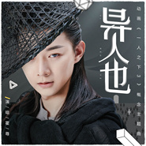
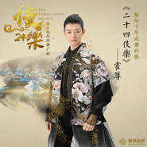
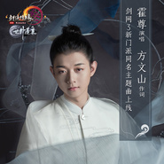
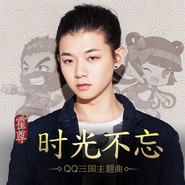
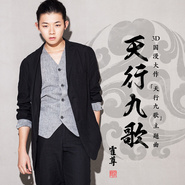

霍尊
============================

|  |  |
| :--: | :-- |
| [ 霍尊](https://i.xiami.com/huozun) | **播放数**: 60459994 **粉丝数**: 26828 **评论数**: 1187 **地区**: China 中国大陆 **风格**: 国语流行 Mandarin Pop, 华语唱作人 Chinese Singer-Songwriter  |

## 档案

霍尊，上海天韵文化签约歌手，著名音乐人火风之子。满族人，1990年9月18日出生于上海，毕业于上海大学悉尼工商学院。2012年获得东方卫视真人秀节目《声动亚洲》亚洲赛区三强，获封“荣耀之星”。 
2014年3月21日，霍尊获得中央电视台综艺频道原创音乐真人秀节目《中国好歌曲》第一季冠军。其原创歌曲《卷珠帘》获封“年度好歌曲” 。4月19日获得天津卫视明星戏曲真人秀节目《国色天香》年度总冠军。 
中文名：霍尊 
外文名：Henry 
民族：满族 
血型：B型 
星座：处女座 
身高：180cm 
生日：1990年9月18日 
职业：歌手 
特长：钢琴、声乐、绘画、篮球 
喜爱歌手：迈克尔杰克逊、中孝介、夏川里美、德永英明 
个人爱好：动漫、sneaker、电影鉴赏 
喜欢颜色：黑色、红色、白色、天蓝色 
喜爱动物：猫、狗、蛇、蜘蛛、貂 
毕业院校：上海大学悉尼工商学院 
经纪公司：上海天韵文化发展有限公司 
2004年10月 上海市学生艺术单项比赛 声乐组银奖 
2005年12月 上海市“魅力浦东——第十届上钢杯青少年钢琴比赛” 中学组三等奖 
2010年11月 上海大学“知音杯”钢琴比赛 金奖 
2010年12月 上海市 “长江杯”钢琴比赛 独奏组三等奖及“柏斯校园钢琴家”称号 
2011年 1月 上海大学新年音乐会 于上海音乐厅演奏《钟》 
2012年7月25日 《声动亚洲》 32进16 霍尊以一票的优势 险胜祁汉 首个晋级16强 
2012年8月30日 《声动亚洲》晋级6强，走进亚洲区比赛 
2012年9月20日 《声动亚洲》前三强，获荣耀之星 
2014年3月21日 《中国好歌曲》第一季冠军   原创歌曲《卷珠帘》获封“年度好歌曲” 
2014年4月19日 《国色天香》年度总冠军

## 专辑

| 名称 | 语种 | 唱片公司 | 发行时间 | 专辑类别 | 专辑风格 |
| :--: | :-- | :-- | :-- | :-- | :-- |
| [ 梦从东方来](./albums/5021857489.md) | 国语 | 唯帆音悦 | 2020年11月09日 | EP, 单曲 | 国语流行 Mandarin Pop |
| [ 逍遥行](./albums/5021322771.md) | 国语 | 光影岁月 | 2020年08月18日 | EP, 单曲 |  |
| [ 雪中行](./albums/5021297218.md) | 国语 | 制作家 | 2020年08月10日 | EP, 单曲 |  |
| [ 少年游 (星河载梦版)](./albums/5021286328.md) | 国语 | 网易游戏 | 2020年08月10日 | EP, 单曲 |  |
| [ 眠眠](./albums/5021173430.md) | 国语 | 芒果TV | 2020年07月27日 | EP, 单曲 |  |
| [ 异人也](./albums/2108411012.md) | 国语 | 臻声文化 | 2020年04月23日 | EP, 单曲 |  |
| [ 北灵少年志之大主宰 电视剧影视原声带·心境篇](./albums/2106060136.md) | 国语 | 听见时代 | 2020年02月18日 | 原声带, 影视音乐 | 国语流行 Mandarin Pop, 电视原声 Television Music |
| [ 二十四伎乐The Twenty-Four Gigakus](./albums/2105730258.md) | 国语 | 大格娱乐 | 2020年01月14日 | EP, 单曲 | 国语流行 Mandarin Pop |
| [ 食物语《食物语》手游同名主题曲](./albums/2105217963.md) | 国语 | 腾讯 | 2019年09月03日 | EP, 单曲 |  |
| [ 霸王别姬 (Live)](./albums/2105048688.md) | 国语 | 独立发行 | 2019年07月31日 | 现场专辑 |  |
| [ 离恨词](./albums/2104652096.md) | 国语 | 东亚星光 | 2019年03月06日 | EP, 单曲 | 国语流行 Mandarin Pop |
| [ 玩乐](./albums/2104396885.md) | 国语 | 听见时代 | 2018年12月18日 | 录音室专辑 | 国语流行 Mandarin Pop |
| [ 世外蓬莱](./albums/2103950361.md) | 国语 | 西山居世游 | 2018年08月29日 | EP, 单曲 | 原声 Soundtrack |
| [ 离人泪](./albums/2103885110.md) | 国语 | 腾讯游戏 | 2018年08月01日 | EP, 单曲 |  |
| [ 风语咒](./albums/2103798740.md) | 国语 | 听见时代 | 2018年07月10日 | EP, 单曲 | 中国风 China-Wave |
| [ 一念花开To Blossom in One's Mind](./albums/2103465226.md) | 国语 | 星文嘉艺 | 2018年01月18日 | EP, 单曲 | 国语流行 Mandarin Pop, 中国风 China-Wave |
| [ 天地有灵](./albums/2102904989.md) | 国语 | 听见时代 | 2017年11月03日 | EP, 单曲 | 国语流行 Mandarin Pop, 中国风 China-Wave |
| [ 桃花雨](./albums/2102809722.md) | 国语 | 自在天浩 | 2017年08月07日 | EP, 单曲 | 国语流行 Mandarin Pop, 中国风 China-Wave |
| [ 梦诛缘·夏聚](./albums/2102757706.md) | 国语 | 青御文化 | 2017年06月02日 | EP, 单曲 | 中国风 China-Wave |
| [ 粉墨](./albums/2102730055.md) | 国语 | 独立发行 | 2017年04月11日 | EP, 单曲 | 国语流行 Mandarin Pop, 中国风 China-Wave |
| [ 时光不忘](./albums/2100356310.md) | 国语 | 佳荧文化 | 2016年06月17日 | EP, 单曲 | 国语流行 Mandarin Pop, 中国风 China-Wave |
| [ 天行九歌](./albums/2100315974.md) | 国语 | 天韵文化 | 2016年04月20日 | EP, 单曲 | 国语流行 Mandarin Pop, 中国风 China-Wave |
| [ 天韵·霍尊](./albums/1404718402.md) | 国语 | 天韵文化 | 2015年05月18日 | 录音室专辑 | 国语流行 Mandarin Pop, 中国风 China-Wave, 华语唱作人 Chinese Singer-Songwriter |
| [ 放开那三国](./albums/1894766917.md) | 国语 | 巴别时代 | 2014年03月17日 | EP, 单曲 | 国语流行 Mandarin Pop, 中国风 China-Wave |

## 评论

|  |  |  |  |
| :-- | :-- | :-- | :-- |
|  [虾米用户](https://emumo.xiami.com/u/342181822) 不愿说再见。那么，我走了... 2020-10-02 19:53 赞(1) 踩(0) | 
弱弱的问一句 版权呢 
 |
|  [虾米用户](https://emumo.xiami.com/u/444235089) Hi 2020-09-17 07:31 赞(0) 踩(0) | 

 |
|  [虾米用户](https://emumo.xiami.com/u/441392255) 凡事三思而后行 2020-08-29 20:39 赞(0) 踩(0) | 
《卷珠帘》歌词没看懂，尤其是&amp;quot;此时难为情&amp;Prime;？怎带了点搞笑，似乎破坏了整个乐曲的伤感情绪？
 |
|  [虾米用户](https://emumo.xiami.com/u/319275235)  2020-08-04 12:16 赞(1) 踩(0) | 
《卷珠帘》 在当时就是根棒子 给那些&amp;ldquo;玩音乐者&amp;rdquo; 的棒喝
 |
|  [虾米用户](https://emumo.xiami.com/u/310739039)  2020-07-30 21:50 赞(2) 踩(0) | 
挺好听，但是依旧是像日本学习的典范，卷珠帘抄袭kokia的一张专辑里的两首歌，唱法模仿自中孝介。小伙子，希望你能够模仿后超越前者
 |
| ⇒ |  [虾米用户](https://emumo.xiami.com/u/5416475) 古风 、NEW AGE  2020-09-02 16:22 赞(0) 踩(0) | 
岛呗唱法有名有姓， 你这个模仿二字。。。
 |
| ⇒ |  [虾米用户](https://emumo.xiami.com/u/444066892) 债见 2021-01-18 19:00 赞(0) 踩(0) | 
你前面还说学习，后面就说抄袭？再后面又说模仿？这三个词不是同类的大哥
 |
|  [虾米用户](https://emumo.xiami.com/u/342181822) 不愿说再见。那么，我走了... 2020-06-02 18:12 赞(2) 踩(0) | 
害 新歌《异人也》没版权啊 
 |
|  [虾米用户](https://emumo.xiami.com/u/362039716) 我还没想好要写什么... 2020-05-24 12:21 赞(1) 踩(0) | 
我从卷珠帘开始一直支持你
 |
|  [虾米用户](https://emumo.xiami.com/u/441056595)  2020-05-20 15:21 赞(2) 踩(0) | 
霍尊，我女儿七岁最喜欢听你的歌，食物语，一拿到手机就听你的歌
 |
|  [虾米用户](https://emumo.xiami.com/u/357893808) 来吧，杀死这只知更鸟 2020-05-15 00:41 赞(4) 踩(0) | 
说霍尊娘的真给笑吐了，他那肌肉能一拳打死你，金针菇们也就只能过过嘴瘾了
 |
|  [虾米用户](https://emumo.xiami.com/u/342181822) 不愿说再见。那么，我走了... 2020-05-11 20:54 赞(1) 踩(0) | 
虾米的版权gkd（手动狗头）
 |
|  [虾米用户](https://emumo.xiami.com/u/77640948)  2020-04-22 15:55 赞(2) 踩(0) | 
霍尊身上有种古典与现代相融的气质 区别于一般的流行歌手
 |
|  [虾米用户](https://emumo.xiami.com/u/362472083)  2020-04-05 16:11 赞(1) 踩(0) | 
当年粉墨刚出来的时候喜欢上的，妈耶
 |
|  [虾米用户](https://emumo.xiami.com/u/186379399) 划落柳树湾 2020-04-05 10:39 赞(0) 踩(0) | 
这声音实在太惊艳了。 
 |
|  [虾米用户](https://emumo.xiami.com/u/379760898) 我不是我       却... 2020-04-04 18:03 赞(0) 踩(0) | 
表白小尊尊喜欢你的声音喜欢你的干净更喜欢你的可爱希望一直这样下去希望优秀作品越来越多
 |
|  [虾米用户](https://emumo.xiami.com/u/441787322) 她很赖，什么也没留下。 2020-03-30 22:25 赞(1) 踩(0) | 
❤️❤️❤️❤️❤️❤️❤️❤️❤️
 |
|  [虾米用户](https://emumo.xiami.com/u/226792554) 云南是我的第二故乡 2020-03-30 01:47 赞(0) 踩(0) | 
这首让我的心都醉了
 |
|  [虾米用户](https://emumo.xiami.com/u/311138514) 生活不光有诗，还有远方！ 2020-03-06 14:12 赞(0) 踩(0) | 
这声音，太喜欢了
 |
|  [虾米用户](https://emumo.xiami.com/u/434152246) 聪明少一些大智慧多一些，... 2020-02-23 06:15 赞(0) 踩(0) | 

 |
|  [虾米用户](https://emumo.xiami.com/u/346713560)  2020-02-21 14:20 赞(0) 踩(0) | 
下巴掉了啊
 |
| ⇒ |  [虾米用户](https://emumo.xiami.com/u/375537097) 我心由音而涟，我情随乐而... 2020-03-06 17:11 赞(0) 踩(0) | 
现在该康复了
 |
|  [虾米用户](https://emumo.xiami.com/u/2796166) 最爱莫文蔚..... 2020-01-20 00:02 赞(1) 踩(0) | 
加油~~~~
 |
|  [虾米用户](https://emumo.xiami.com/u/2796166) 最爱莫文蔚..... 2020-01-20 00:02 赞(1) 踩(0) | 
加油~~~~
 |
|  [虾米用户](https://emumo.xiami.com/u/428598127) 无情之人、哪怕情羁绊 2019-12-15 00:22 赞(2) 踩(0) | 
要是能跟双笙合奏一曲绝对棒
 |
|  [虾米用户](https://emumo.xiami.com/u/431960976)  2019-11-15 22:33 赞(4) 踩(0) | 
从初二也就是2016年的一个星期五放学和同学坐车回家的时候在车上听到有人说霍尊不男不女，那时我就想知道这个被大家说的人是谁，我从同学手机上看到霍尊在一档节目中唱的《卷珠帘》，和初次见他就以经喜欢上这个宝藏男孩了，就从第一次知道霍尊到现在已近有2016－2019做了这么久的大白鹅啦 
 |
|  [虾米用户](https://emumo.xiami.com/u/412642193)  2019-10-21 13:42 赞(0) 踩(0) | 
嘿嘿
 |
|  [虾米用户](https://emumo.xiami.com/u/231321548)  2019-10-15 11:20 赞(0) 踩(0) | 
震惊了。这种声音真是太棒了。 卷珠帘？厉害了
 |
|  [虾米用户](https://emumo.xiami.com/u/2503379)   2019-10-11 23:13 赞(1) 踩(0) | 
霍尊的声音真的好美。。。绝了。。。伴以京剧功底，真的好爱
 |
|  [虾米用户](https://emumo.xiami.com/u/428399517) 康博凯 2019-09-06 18:53 赞(1) 踩(0) | 
霍尊先生唱得太优秀了！！
 |
|  [虾米用户](https://emumo.xiami.com/u/324605761)  2019-08-17 18:56 赞(1) 踩(0) | 
从来都是好听就听，不论谁唱的，从摇滚到伤感流行到中国风到古筝钢琴，并不冲突啊，一个柔中带刚刚中有柔的男人更像男人？
 |
| ⇒ |  [虾米用户](https://emumo.xiami.com/u/425028770)  2019-08-17 23:25 赞(0) 踩(0) | 
他的歌就象一个亲切的大哥哥在诉说故事一般，温暖无比，舒服…
 |
|  [虾米用户](https://emumo.xiami.com/u/24858909) Desire has n... 2019-08-03 21:01 赞(1) 踩(0) | 
尼尼咔咔
 |
|  [虾米用户](https://emumo.xiami.com/u/425028770)  2019-07-04 20:04 赞(2) 踩(0) | 
尊哥的歌首首好听
 |
|  [虾米用户](https://emumo.xiami.com/u/342181822) 不愿说再见。那么，我走了... 2019-07-03 10:17 赞(4) 踩(0) | 
2019.7.3霍尊在虾米音乐里的粉丝达到了24000[带墨镜笑]
 |
|  [虾米用户](https://emumo.xiami.com/u/375537097) 我心由音而涟，我情随乐而... 2019-06-04 21:28 赞(2) 踩(0) | 
霍尊加油
 |
|  [虾米用户](https://emumo.xiami.com/u/409456626)  2019-06-01 22:15 赞(1) 踩(0) | 
他的声音是珍宝 
 |
|  [虾米用户](https://emumo.xiami.com/u/419486383) 三月风景，无君不晴。三千... 2019-06-01 10:27 赞(0) 踩(0) | 
我跪求山居秋瞑版权
 |
|  [虾米用户](https://emumo.xiami.com/u/406448053) 开开心心每一天 2019-05-21 16:02 赞(4) 踩(0) | 
霍尊-我最爱的歌手，看他表演是一种全方位的享受！
 |
| ⇒ |  [虾米用户](https://emumo.xiami.com/u/406448053) 开开心心每一天 2019-05-21 16:03 赞(0) 踩(0) | 

 |
|  [虾米用户](https://emumo.xiami.com/u/283698463)  2019-05-20 16:35 赞(0) 踩(0) | 
不喜欢他的脸 ，其实并不漂亮也不帅，就是嗓音没得说，身材太健美了，一张小脸配个男人的壮硕身材，这都可以称得上美男子？公子？这是什么样的审美不懂了
 |
| ⇒ |  [虾米用户](https://emumo.xiami.com/u/412642193)  2019-06-06 08:15 赞(0) 踩(0) | 
喜欢到长什么样已经无所谓系列，现在就爱看他搞怪，希望他快乐。
 |
| ⇒ |  [虾米用户](https://emumo.xiami.com/u/1834532) 静默 2019-06-10 07:44 赞(0) 踩(0) | 
同意。唱歌归唱歌，别扯太多。
 |
| ⇒ |  [虾米用户](https://emumo.xiami.com/u/324605761)  2019-08-17 18:40 赞(0) 踩(0) | 
现社会，太有力量会伤人，比如信，很多人就不喜欢，霍尊的力量被藏起来了，还有那么人说三道四，我倒是认为刚中有柔才是一个男人该有的，你这样的估计就那种小媳妇男人对胃口，东北那种瘦子说话阴阳怪气的最适合你。
 |
| ⇒ |  [虾米用户](https://emumo.xiami.com/u/186379399) 划落柳树湾 2020-04-05 10:42 赞(0) 踩(0) | 
<q><b>物非人亦说：</b></q>
 |
|  [虾米用户](https://emumo.xiami.com/u/403436716)  2019-05-02 14:03 赞(2) 踩(0) | 
like your songs special voice has so deeply feeling …
 |
|  [虾米用户](https://emumo.xiami.com/u/43492923) 行到水穷我才开始害怕，夕... 2019-04-24 15:38 赞(0) 踩(0) | 
-
 |
|  [虾米用户](https://emumo.xiami.com/u/325374787)  2019-03-27 21:10 赞(0) 踩(0) | 
到此一游
 |
|  [虾米用户](https://emumo.xiami.com/u/409322573)  2019-03-22 16:19 赞(1) 踩(0) | 
再男人点霍尊
 |
|  [虾米用户](https://emumo.xiami.com/u/6895720)   2019-03-17 22:03 赞(5) 踩(0) | 
唯一长头发不违和的男神
 |
|  [虾米用户](https://emumo.xiami.com/u/405847509)  2019-03-05 16:00 赞(1) 踩(0) | 
小伙子真不错，中国未来流行音乐有希望了！
 |
|  [虾米用户](https://emumo.xiami.com/u/336512759)  2019-02-25 07:05 赞(2) 踩(0) | 
你有才有貌有品，非常的优秀，我非常欣赏，感谢你的母亲把你培养的那么好。
 |
|  [虾米用户](https://emumo.xiami.com/u/410401206)  2019-02-11 09:27 赞(5) 踩(0) | 
很治愈的声音，听了内心很平静
 |
|  [虾米用户](https://emumo.xiami.com/u/418566292)  2019-02-08 11:21 赞(2) 踩(0) | 
要是姚贝娜还在，和霍霍哥合唱就好了 
 |
|  [虾米用户](https://emumo.xiami.com/u/418566292)  2019-02-08 11:13 赞(0) 踩(0) | 
被天使吻过的嗓子。 
 |
|  [虾米用户](https://emumo.xiami.com/u/376302080)  2019-02-04 04:18 赞(0) 踩(0) | 
棒  
 |
|  [虾米用户](https://emumo.xiami.com/u/375831880)  2019-02-02 11:18 赞(2) 踩(0) | 
好听，声音实在太美了，我爱你霍尊，我的偶像，唱的歌实在太好听了，希望你再次上春晚，你的歌声可以给李玉刚相比，声音让人舒心，让耳朵有了新的生机。
 |
|  [虾米用户](https://emumo.xiami.com/u/327207888) 好喜欢沉浸在音乐的海洋里... 2019-02-01 16:18 赞(1) 踩(0) | 
等待下首新曲！好听！
 |
|  [虾米用户](https://emumo.xiami.com/u/413000208)  2019-01-28 15:16 赞(0) 踩(0) | 
尊，加油，期待你的新歌
 |
|  [虾米用户](https://emumo.xiami.com/u/413000208)  2019-01-28 15:14 赞(0) 踩(0) | 
加油!       
 |
|  [虾米用户](https://emumo.xiami.com/u/353080013) 我拿出了改作文的劲头 2019-01-27 09:11 赞(5) 踩(0) | 
做自己就好，简直是古风第一人啊，发挥长处就好
 |
|  [虾米用户](https://emumo.xiami.com/u/353080013) 我拿出了改作文的劲头 2019-01-27 09:10 赞(2) 踩(0) | 
尊尊优秀   1120评论打卡   每次听的感受都不同，文化和内涵的力量就是不一样内涵(￣∀￣)
 |
|  [虾米用户](https://emumo.xiami.com/u/410533641) 唯一的爱好就是听听歌！ 2019-01-24 01:05 赞(6) 踩(0) | 
霍公子要做自己！更要做自己的音乐！可以跨界做音乐！
 |
|  [虾米用户](https://emumo.xiami.com/u/411731757) 我还没想好要写什么... 2019-01-23 18:45 赞(0) 踩(0) | 
你为什么不跟你爹一样霸气
 |
|  [虾米用户](https://emumo.xiami.com/u/405847509)  2019-01-21 14:06 赞(2) 踩(0) | 
爱霍尊
 |
|  [虾米用户](https://emumo.xiami.com/u/342147688)  2019-01-20 00:36 赞(5) 踩(0) | 
此乃天籁之音！怎一个“好”字了得！
 |
|  [虾米用户](https://emumo.xiami.com/u/2074925)  2018-12-26 15:37 赞(9) 踩(0) | 
这应该是代表中国走向全世界的音乐
 |
|  [虾米用户](https://emumo.xiami.com/u/279237984) 眸卿一笑，必恋一生。 2018-12-26 12:57 赞(0) 踩(0) | 
内容已删除
 |
| ⇒ |  [虾米用户](https://emumo.xiami.com/u/296775752)  2019-01-02 13:29 赞(0) 踩(0) | 
哈哈哈哈是的
 |
|  [虾米用户](https://emumo.xiami.com/u/376433109)  2018-12-22 00:40 赞(3) 踩(0) | 
第一次听卷珠帘就已无法自拔
 |
|  [虾米用户](https://emumo.xiami.com/u/37107125) 僕の中に、誰がいるの？ 2018-12-19 21:22 赞(1) 踩(0) | 
唱哭刘欢的人
 |
|  [虾米用户](https://emumo.xiami.com/u/348560105) 音乐 2018-12-17 21:28 赞(1) 踩(0) | 
尊，你是最棒的！！！
 |
|  [虾米用户](https://emumo.xiami.com/u/375537097) 我心由音而涟，我情随乐而... 2018-12-15 15:05 赞(3) 踩(0) | 
新专辑支持  
 |
|  [虾米用户](https://emumo.xiami.com/u/871649)  2018-12-04 22:18 赞(1) 踩(0) | 
太优秀！
 |
|  [虾米用户](https://emumo.xiami.com/u/7846738) 这家伙很聪明什么也没留下... 2018-11-21 15:35 赞(4) 踩(0) | 
会不会有人无意中听到中孝介的歌会很兴奋地说像霍尊
 |
|  [虾米用户](https://emumo.xiami.com/u/248324726) 为了成就我一个，千万个人... 2018-11-16 10:37 赞(4) 踩(0) | 
神仙唱歌
 |
|  [虾米用户](https://emumo.xiami.com/u/43841235) 不知道现在世界之喉的灰胡... 2018-10-31 23:35 赞(3) 踩(0) | 
先为力胜，再为智胜，唯有力胜，方可智胜
 |
|  [虾米用户](https://emumo.xiami.com/u/405847509)  2018-10-24 14:06 赞(4) 踩(0) | 
祝霍公子早日找到心目中的那位女神
 |
|  [虾米用户](https://emumo.xiami.com/u/378376584) 除了你，我是什么都不想要... 2018-10-23 20:03 赞(1) 踩(0) | 
哦哦哦哦
 |
|  [虾米用户](https://emumo.xiami.com/u/345591192) 曦澄女孩 2018-10-22 00:56 赞(2) 踩(0) | 
当时是一个宅女的自己，不看手机，不玩电脑，完全与社会脱节，只知道看书，第一次听到卷珠帘，一下被迷住了，然后就听到妈妈说唱这首歌的人很厉害，当时正跟妈妈闹矛盾，他说什么我都要对着干，所以当时说自己讨厌这首歌，再没有听过。过了不知道多久，我又在电视节目上看的这首歌。还是一样的清雅恬静当然现在也一样是个宅女   
 |
|  [虾米用户](https://emumo.xiami.com/u/319243709) 清新呼吸，云游霄外 2018-10-15 18:10 赞(3) 踩(0) | 
介绍了半天是男还是女♀？
 |
| ⇒ |  [虾米用户](https://emumo.xiami.com/u/345591192) 曦澄女孩 2018-10-22 00:45 赞(0) 踩(0) | 
我愣在那里，竟不知如何回答
 |
| ⇒ |  [虾米用户](https://emumo.xiami.com/u/296775752)  2019-01-02 13:29 赞(0) 踩(0) | 
男!
 |
| ⇒ |  [虾米用户](https://emumo.xiami.com/u/413000208)  2019-01-28 15:17 赞(0) 踩(0) | 
男
 |
| ⇒ |  [虾米用户](https://emumo.xiami.com/u/404106366)   2019-02-28 21:05 赞(0) 踩(0) | 
男。
 |
|  [虾米用户](https://emumo.xiami.com/u/314508695)  2018-10-13 22:52 赞(1) 踩(0) | 
说的太对了
 |
|  [虾米用户](https://emumo.xiami.com/u/402681396)  2018-10-07 14:31 赞(4) 踩(0) | 
看到14年你刚上台演唱《卷珠帘》的时候真的很感动。加油
 |
|  [虾米用户](https://emumo.xiami.com/u/339191478)   2018-10-04 16:03 赞(1) 踩(0) | 
❤
 |
|  [虾米用户](https://emumo.xiami.com/u/376648933)  2018-10-03 16:30 赞(6) 踩(0) | 
霍尊在经典咏流传中提到，他并不是从小受此熏陶的，年轻时还迷恋欧美歌曲，后来才发现，这才是根里的东西。这句话很是牵动我，作为一个实实在在的中国人，向往其他文化没有错，但千万不要忘了本真。我小学时尊霍尊为偶像，更在音乐节表演过他的成名曲卷珠帘，可现在，我的播放列表里全是英文歌曲和西语歌曲。那天看了经典咏流传以后，他的话直直戳进心底，我可能是丢失了什么。不管是吴侬软语，还是咿呀唱叹，诉说的都是我们血液中记载的悠悠历史。昆曲，越剧，京剧，川剧变脸，黄梅戏，这些词似乎属于老一辈听着留声机，补着黑白布鞋的时代。如今也应由我们新一代的力量完成走出国门，震撼世界的使命。(各位有没有学习戏曲的渠道劳烦相告，谢谢
 |
|  [虾米用户](https://emumo.xiami.com/u/342181822) 不愿说再见。那么，我走了... 2018-09-18 20:50 赞(6) 踩(0) | 
粉你4年了，尊啊，生日快乐！虽然我没能去听你的生日演唱会（该死的作业&amp;hellip;&amp;hellip;   ），但我一直在支持你啊！我硬是把全班人都拉去听你的歌 ，大家都很喜欢你的歌啊，特别是那首山居秋暝，我们音乐老师在我的N次推荐下要我们学o(^o^)o这首哈哈   我也不知道说什么(ー_ー)!!只愿你不忘初心，安心的做好你自己，做好音乐，加油(ง &amp;bull;̀_&amp;bull;́)ง！身体好好的，别累着！
 |
|  [虾米用户](https://emumo.xiami.com/u/279214276) 我会过得很好... 2018-09-18 15:36 赞(1) 踩(0) | 
生日快乐 也没什么，不过想表达一下，尊尊的歌真的让我很感动，那带入感情的演唱，总是围绕在耳畔，陪伴着我度过一些难熬的时刻
 |
|  [虾米用户](https://emumo.xiami.com/u/301945982) 看似有情 2018-09-18 14:21 赞(3) 踩(0) | 
提前祝你生日快乐
 |
|  [虾米用户](https://emumo.xiami.com/u/331045702)  2018-09-18 10:07 赞(1) 踩(0) | 
生日快乐，加油
 |
|  [虾米用户](https://emumo.xiami.com/u/331045702)  2018-09-18 10:06 赞(2) 踩(0) | 
突然就喜欢上霍尊的歌，每首都那么喜欢。
 |
|  [虾米用户](https://emumo.xiami.com/u/299874502) 你们来尝尝主恩，就知道耶... 2018-09-14 15:20 赞(0) 踩(0) | 
居然是火风之子，第一次知道。
 |
|  [虾米用户](https://emumo.xiami.com/u/403408361)  2018-09-12 10:08 赞(3) 踩(0) | 
他的歌声能令浮躁的心情安静下来。
 |
|  [虾米用户](https://emumo.xiami.com/u/364633278)  2018-09-12 09:33 赞(2) 踩(0) | 
霍尊你仙气满满！
 |
|  [虾米用户](https://emumo.xiami.com/u/342181822) 不愿说再见。那么，我走了... 2018-09-01 19:23 赞(2) 踩(0) | 
尊啊，原谅我因为补课没法去你的生日演唱会！
 |
| ⇒ |  [虾米用户](https://emumo.xiami.com/u/342181822) 不愿说再见。那么，我走了... 2018-09-01 19:26 赞(0) 踩(0) | 
                                       
 |
|  [虾米用户](https://emumo.xiami.com/u/374307814)  2018-08-20 13:17 赞(2) 踩(0) | 
未摘花太好听了，  
 |
| ⇒ |  [虾米用户](https://emumo.xiami.com/u/342181822) 不愿说再见。那么，我走了... 2018-09-01 19:27 赞(0) 踩(0) | 
你可以去听下 时光不忘 也很好听哦
 |
|  [虾米用户](https://emumo.xiami.com/u/298003001)  2018-08-14 20:27 赞(3) 踩(0) | 
《天行九歌》太好听了
 |
|  [虾米用户](https://emumo.xiami.com/u/330275987)  2018-08-14 14:18 赞(0) 踩(0) | 
空灵
 |
|  [虾米用户](https://emumo.xiami.com/u/205707890) ～ 2018-08-13 21:20 赞(8) 踩(0) | 
期待看到霍公子出演一部古装剧  
 |
|  [虾米用户](https://emumo.xiami.com/u/375537097) 我心由音而涟，我情随乐而... 2018-07-31 19:47 赞(3) 踩(0) | 
霍尊的歌很有艺术性，非常值得大家去欣赏，他的作品有好多都是由他本人作曲的，很好听，是一个很有潜力的音乐人，大家一定要多多支持哦！ 
 |
| ⇒ |  [虾米用户](https://emumo.xiami.com/u/342181822) 不愿说再见。那么，我走了... 2018-08-09 16:36 赞(0) 踩(0) | 
我个人，哦不对，是很多尊粉，都认为霍尊不是流行歌手，而是歌唱艺术家
 |
| ⇒ |  [虾米用户](https://emumo.xiami.com/u/375537097) 我心由音而涟，我情随乐而... 2018-08-21 22:17 赞(0) 踩(0) | 
<q><b>❄️羽殇·曲觞❄️说：</b></q>
 |
|  [虾米用户](https://emumo.xiami.com/u/48625164) “你一定喝过洋酒，你一定... 2018-07-25 01:27 赞(3) 踩(0) | 
古风音乐王子，要不要考虑和古风女王张碧晨合作一下？
 |
| ⇒ |  [虾米用户](https://emumo.xiami.com/u/418566292)  2019-02-08 11:17 赞(0) 踩(0) | 
张力尹其实和霍尊合作也是超棒的。
 |
|  [虾米用户](https://emumo.xiami.com/u/51783240)  2018-07-24 10:13 赞(1) 踩(0) | 
感觉，大大是古风范
 |
|  [虾米用户](https://emumo.xiami.com/u/644537)  2018-07-17 20:05 赞(19) 踩(0) | 
怎么作品那么少，该红的发紫。没人可以复制的好嗓子。大爱
 |
| ⇒ |  [虾米用户](https://emumo.xiami.com/u/342181822) 不愿说再见。那么，我走了... 2018-08-01 20:50 赞(0) 踩(0) | 
因为尊哥他太佛系   开个玩笑&amp;hellip;&amp;hellip;应该还是能欣赏的人太少&amp;hellip;&amp;hellip;
 |
| ⇒ |  [虾米用户](https://emumo.xiami.com/u/345591192) 曦澄女孩 2018-10-22 00:43 赞(0) 踩(0) | 
因为现在的人追寻的是更大的刺激和诱惑，恬淡的声音己无法停下他们的脚步
 |
|  [虾米用户](https://emumo.xiami.com/u/356415169)  2018-07-17 10:56 赞(2) 踩(0) | 
喜欢他干净的声音 ，喜欢他对音乐的态度，喜欢他的一切
 |
|  [虾米用户](https://emumo.xiami.com/u/32031632)  2018-07-16 09:56 赞(0) 踩(0) | 
南无阿弥佗佛
 |
|  [虾米用户](https://emumo.xiami.com/u/374519046)  2018-07-14 18:56 赞(2) 踩(0) | 
这首子歌曲很好听？
 |
|  [虾米用户](https://emumo.xiami.com/u/375537097) 我心由音而涟，我情随乐而... 2018-07-11 13:46 赞(8) 踩(0) | 
最喜欢看的港台武打片是&amp;ldquo;霍元甲&amp;rdquo;，最欣赏，最看好的新生代艺人是霍尊     
 |
| ⇒ |  [虾米用户](https://emumo.xiami.com/u/342181822) 不愿说再见。那么，我走了... 2018-08-09 16:37 赞(0) 踩(0) | 
霍尊 不是 流行歌手 而是 歌唱艺术家
 |
|  [虾米用户](https://emumo.xiami.com/u/374828284)  2018-06-18 12:48 赞(4) 踩(0) | 
喜欢霍尊的优柔腔和调，可是听着听着禁不住落泪，避免伤感又不得不换频。。。   
 |
|  [虾米用户](https://emumo.xiami.com/u/346987899)  2018-06-13 14:15 赞(1) 踩(0) | 
你和張韶涵參加了歌手嗎
 |
|  [虾米用户](https://emumo.xiami.com/u/375225290)  2018-06-10 11:32 赞(2) 踩(0) | 
   
 |
|  [虾米用户](https://emumo.xiami.com/u/375225290)  2018-06-10 11:32 赞(8) 踩(0) | 
霍尊你太棒了，我我的同学们都很支持你，我也是一样支持你，我叫韩静文，有一个叫白静文，有一个叫张雨涵，还有几个人都很支持你。
 |
|  [虾米用户](https://emumo.xiami.com/u/374307814)  2018-06-01 16:09 赞(2) 踩(0) | 
每天都听你的歌，太好了   
 |
|  [虾米用户](https://emumo.xiami.com/u/363909386)  2018-05-29 00:23 赞(2) 踩(0) | 
以上都是说出我的心声 
 |
| ⇒ |  [虾米用户](https://emumo.xiami.com/u/342181822) 不愿说再见。那么，我走了... 2018-08-07 19:09 赞(0) 踩(0) | 
机智   
 |
|  [虾米用户](https://emumo.xiami.com/u/372211090) 我还没想好要写什么... 2018-05-28 19:27 赞(3) 踩(0) | 
霍尊唱得好好聼,好欣賞,日後有更好的歌聼就更好,努力加油!
 |
|  [虾米用户](https://emumo.xiami.com/u/302056806) 我还没想好要写什么... 2018-05-24 09:32 赞(3) 踩(0) | 
霍尊的声音非常好听！支持你！
 |
|  [虾米用户](https://emumo.xiami.com/u/369128914)  2018-05-19 14:23 赞(4) 踩(0) | 
明明就是天的宠儿！
 |
|  [虾米用户](https://emumo.xiami.com/u/272416770) 六 2018-05-13 09:12 赞(2) 踩(0) | 
有时间就来看你，只因为我是赫兹
 |
|  [虾米用户](https://emumo.xiami.com/u/267574020)  2018-05-12 18:50 赞(0) 踩(0) | 
                  
 |
|  [虾米用户](https://emumo.xiami.com/u/348828772)  2018-05-12 13:17 赞(2) 踩(0) | 
霍尊你好牛阿
 |
|  [虾米用户](https://emumo.xiami.com/u/365162137)  2018-05-10 12:29 赞(3) 踩(0) | 
喜歡喜歡喜歡   力挺力挺力挺   
 |
|  [虾米用户](https://emumo.xiami.com/u/357674040)  2018-05-09 07:04 赞(0) 踩(0) | 

 |
|  [虾米用户](https://emumo.xiami.com/u/357177202)  2018-05-06 14:34 赞(0) 踩(0) | 
自古烂片出神曲 
 |
| ⇒ |  [虾米用户](https://emumo.xiami.com/u/342181822) 不愿说再见。那么，我走了... 2018-05-10 12:53 赞(0) 踩(0) | 
这里说不带太合适吧这里是艺人评论页。。。。。。
 |
|  [虾米用户](https://emumo.xiami.com/u/352912791) 歌，带给你的是…… 2018-05-05 14:14 赞(1) 踩(0) | 
好秀气
 |
|  [虾米用户](https://emumo.xiami.com/u/352743044) 霍尊永远的经典 2018-05-05 03:25 赞(6) 踩(0) | 
唯你独尊的声音，无人模仿，世上仅此你一人，远的经典，我永远支持你！
 |
|  [虾米用户](https://emumo.xiami.com/u/361930013) 用一朵花开的时间与你相遇 2018-04-30 13:04 赞(4) 踩(0) | 
霍尊好帅
 |
|  [虾米用户](https://emumo.xiami.com/u/353865556) 琪木花芳九叶开 2018-04-25 22:36 赞(4) 踩(0) | 
他心里住了一个古人
 |
| ⇒ |  [虾米用户](https://emumo.xiami.com/u/342181822) 不愿说再见。那么，我走了... 2018-08-07 19:10 赞(0) 踩(0) | 
他自己就是古人
 |
|  [虾米用户](https://emumo.xiami.com/u/359480920)  2018-04-21 11:48 赞(2) 踩(0) | 
霍尊好暖，天使
 |
|  [虾米用户](https://emumo.xiami.com/u/357347306)  2018-04-20 18:14 赞(4) 踩(0) | 
仙气飘飘的小尊尊
 |
|  [虾米用户](https://emumo.xiami.com/u/354653296)  2018-04-18 20:59 赞(3) 踩(0) | 
被天使吻过的嗓子   
 |
|  [虾米用户](https://emumo.xiami.com/u/35225798) 我亦是行人 2018-04-17 18:21 赞(2) 踩(0) | 
天赐的嗓音，只能说每个人都有每个人的命。
 |
|  [虾米用户](https://emumo.xiami.com/u/357896857)  2018-04-14 21:06 赞(2) 踩(0) | 
如烟清流，好喜欢。
 |
|  [虾米用户](https://emumo.xiami.com/u/38750214) 我还没想好要写什么... 2018-04-14 12:59 赞(3) 踩(0) | 
歌手里他一出场，就是带着仙气，温润如玉
 |
|  [虾米用户](https://emumo.xiami.com/u/111232800) 无明所系， 2018-04-13 22:54 赞(7) 踩(0) | 
卷珠帘还是喜欢刚刚出来时的，有古筝吧！那时候没有那么多的油腔滑调，我就听到了深闺怨女的哀情，但是现在找不到了&amp;hellip;&amp;hellip;
 |
| ⇒ |  [虾米用户](https://emumo.xiami.com/u/342181822) 不愿说再见。那么，我走了... 2018-05-10 12:55 赞(0) 踩(0) | 
我也在找，好像只有电脑上有的说。。。。。。
 |
|  [虾米用户](https://emumo.xiami.com/u/349467861)  2018-04-08 23:18 赞(2) 踩(0) | 
不忘初心，方得始终。听歌时我很感动，一个人可以在纷杂的世间活的很正很阳光，好像做梦，想起了我的小时候。感谢你带给我的好歌，感谢我能听到你的歌，这就够了。愿你一直朝着阳光走下去，散发着光芒。谢谢！
 |
|  [虾米用户](https://emumo.xiami.com/u/342181822) 不愿说再见。那么，我走了... 2018-04-08 19:02 赞(4) 踩(0) | 
君子，人不知而不愠者也；君子，待其友如亲人者也。谦谦君子，大家闺秀&amp;mdash;&amp;mdash;指的就是霍尊。我不想多言，闭眼，听上一曲&amp;ldquo;卷珠帘&amp;rdquo;，不正是另一种享受？伤心之时，一首最简单的但却最深情的歌便能打到你的心里。
 |
|  [虾米用户](https://emumo.xiami.com/u/292313044)  2018-04-06 22:26 赞(1) 踩(0) | 
第一次听到霍尊的歌是在声动亚洲这节目上，后面他的每首歌都在听～～
 |
|  [虾米用户](https://emumo.xiami.com/u/258143083)  2018-04-05 16:51 赞(6) 踩(0) | 
被《歌手》的霍尊圈粉 
 |
|  [虾米用户](https://emumo.xiami.com/u/289756053) 输入签名… 2018-04-05 14:27 赞(3) 踩(0) | 
小霍唱一个大花轿什么感觉
 |
| ⇒ |  [虾米用户](https://emumo.xiami.com/u/342181822) 不愿说再见。那么，我走了... 2018-08-09 16:38 赞(0) 踩(0) | 
  
 |
|  [虾米用户](https://emumo.xiami.com/u/251649773)  2018-04-04 19:34 赞(3) 踩(0) | 
又来看你了，什么时候给我签名&amp;hellip; 
 |
|  [虾米用户](https://emumo.xiami.com/u/338419942)  2018-04-01 15:24 赞(1) 踩(0) | 
好好听
 |
|  [虾米用户](https://emumo.xiami.com/u/354020312)  2018-03-31 12:04 赞(0) 踩(0) | 
很好听   
 |
|  [虾米用户](https://emumo.xiami.com/u/351776967)  2018-03-29 15:56 赞(6) 踩(0) | 
干干净净的声音让人叫了自动代入歌曲。
 |
|  [虾米用户](https://emumo.xiami.com/u/35197471) ☀⭐ 2018-03-24 22:50 赞(4) 踩(0) | 
喜欢这个声音
 |
| ⇒ |  [虾米用户](https://emumo.xiami.com/u/355279696)  2018-03-27 20:06 赞(0) 踩(0) | 
 
 |
|  [虾米用户](https://emumo.xiami.com/u/353358638)  2018-03-19 11:20 赞(2) 踩(0) | 
不男不女的，没他爹的风范
 |
| ⇒ |  [虾米用户](https://emumo.xiami.com/u/345591192) 曦澄女孩 2018-03-25 23:20 赞(0) 踩(0) | 
不爱听别听
 |
| ⇒ |  [虾米用户](https://emumo.xiami.com/u/356272669) 粗人非装文艺范儿！ 2018-04-13 22:07 赞(0) 踩(0) | 
霍尊能唱男旦，也能唱男生～～～短衣大裤衩到底理解不了长衫折扇的韵味。
 |
| ⇒ |  [虾米用户](https://emumo.xiami.com/u/352743044) 霍尊永远的经典 2018-05-05 03:21 赞(0) 踩(0) | 
<q><b>何宽说：</b></q>
 |
|  [虾米用户](https://emumo.xiami.com/u/83569582)   2018-03-17 01:43 赞(4) 踩(0) | 
霍尊声音特别好听
 |
|  [虾米用户](https://emumo.xiami.com/u/323987299)  2018-03-14 22:58 赞(0) 踩(0) | 
火风前妻生的
 |
|  [虾米用户](https://emumo.xiami.com/u/354343389)  2018-03-14 12:23 赞(3) 踩(0) | 
谢谢你带给大家这么美的音乐！
 |
|  [虾米用户](https://emumo.xiami.com/u/166123838) 今日穿高跟鞋写公文，明日... 2018-03-14 11:20 赞(7) 踩(0) | 
他的淡定不浮躁吸引了我，哪里看到给人带来春风拂面的感觉，仙
 |
|  [虾米用户](https://emumo.xiami.com/u/351871104)  2018-03-11 10:47 赞(0) 踩(0) | 
火风之子，
 |
|  [虾米用户](https://emumo.xiami.com/u/345591192) 曦澄女孩 2018-03-09 23:08 赞(89) 踩(0) | 
霍尊唱腔特别好，千回百转，空灵而又清澈，中间还含着一丝戏腔  霍尊唱歌不是为了一首歌而唱，而是为了让人们意识到中华传承五千年的文化是多么博大精深，希望大家在学着西方文化在世界上有着越来越多华侨的时候不要忘本，不要忘记自己是中国人，是伟大的华夏子孙！
 |
| ⇒ |  [虾米用户](https://emumo.xiami.com/u/342181822) 不愿说再见。那么，我走了... 2018-03-16 22:32 赞(0) 踩(0) | 
说得对，尊尊的唱腔真的是在华语乐坛独树一帜
 |
| ⇒ |  [虾米用户](https://emumo.xiami.com/u/350980611)  2018-04-08 23:06 赞(0) 踩(0) | 
无与伦比，有仙气好听！
 |
|  [虾米用户](https://emumo.xiami.com/u/345591192) 曦澄女孩 2018-03-09 22:59 赞(18) 踩(0) | 
最喜欢霍尊唱的天行九歌，悲凉中带着豪迈，豪迈中含着温润，温润中包着柔媚
 |
| ⇒ |  [虾米用户](https://emumo.xiami.com/u/356939262) 困了就睡，饿了就吃，跌倒... 2018-06-25 00:05 赞(0) 踩(0) | 
 
 |
| ⇒ |  [虾米用户](https://emumo.xiami.com/u/404570101) 蜉蝣之羽，衣裳楚楚。 2018-12-18 00:33 赞(0) 踩(0) | 
喜欢动漫，霍尊的片头曲把九歌演绎得十分生动
 |
|  [虾米用户](https://emumo.xiami.com/u/345591192) 曦澄女孩 2018-03-09 22:52 赞(15) 踩(0) | 
我是歌手里的红颜劫被惊艳到了，翩翩公子，温文如玉，谦而知礼，翠竹依依
 |
| ⇒ |  [虾米用户](https://emumo.xiami.com/u/1804116) 我还没想好要写什么... 2018-03-10 23:29 赞(0) 踩(0) | 
同感
 |
|  [虾米用户](https://emumo.xiami.com/u/3092399)  2018-03-07 23:31 赞(0) 踩(0) | 
有些像汤唯 
 |
|  [虾米用户](https://emumo.xiami.com/u/248840045)  2018-03-07 09:02 赞(1) 踩(0) | 
中国好歌曲开始
 |
|  [虾米用户](https://emumo.xiami.com/u/353472164) 廖心怡 2018-03-06 18:43 赞(2) 踩(0) | 
我喜欢你唱的歌:天地有灵也喜欢看捉妖记
 |
|  [虾米用户](https://emumo.xiami.com/u/282092107) 一个人的狂欢，一群人的孤... 2018-03-06 09:39 赞(4) 踩(0) | 
唱腔很惊艳，第一次特别喜欢一个人的声调，以前只是喜欢各种歌手各种歌，现在特别喜欢他唱的所有音乐。希望能听到更多他的音乐
 |
|  [虾米用户](https://emumo.xiami.com/u/201391232) 最快的方法是先抱抱 2018-03-03 23:26 赞(0) 踩(0) | 
彡
 |
|  [虾米用户](https://emumo.xiami.com/u/352803566)  2018-03-03 19:31 赞(0) 踩(0) | 
男神
 |
|  [虾米用户](https://emumo.xiami.com/u/225131659) 叶落 2018-03-01 17:19 赞(1) 踩(0) | 
磁性，清晰，清澈
 |
|  [虾米用户](https://emumo.xiami.com/u/57905202)  2018-02-27 21:09 赞(2) 踩(0) | 
上歌手唱天行九歌吧卷珠帘也可以，虽然我是花花粉，还是要祝霍尊加油，棒棒哒
 |
|  [虾米用户](https://emumo.xiami.com/u/319309746)  2018-02-26 10:57 赞(2) 踩(0) | 
怎么办！一听你的歌就喜欢上你了。你估计是我心中那个完美的&amp;ldquo;古风&amp;rdquo;。好喜欢你！期待(๑˙ー˙๑)你以后的歌
 |
|  [虾米用户](https://emumo.xiami.com/u/54528613) 生命就是一次倒计时 2018-02-26 01:44 赞(0) 踩(0) | 
搬好小板凳！
 |
|  [虾米用户](https://emumo.xiami.com/u/54528613) 生命就是一次倒计时 2018-02-26 01:39 赞(0) 踩(0) | 
！！！！！！
 |
|  [虾米用户](https://emumo.xiami.com/u/303129623)  2018-02-24 15:33 赞(0) 踩(0) | 

 |
|  [虾米用户](https://emumo.xiami.com/u/257405615) forever 2018-02-21 11:45 赞(1) 踩(0) | 
喜欢尊尊和玉先生   
 |
|  [虾米用户](https://emumo.xiami.com/u/313252082) 无所畏惧边伯贤 2018-02-16 22:48 赞(2) 踩(0) | 
霍尊加油(ง &amp;bull;̀_&amp;bull;́)ง
 |
|  [虾米用户](https://emumo.xiami.com/u/350571688)  2018-02-15 13:08 赞(1) 踩(0) | 
他好帅帅的！！歌也好听。
 |
|  [虾米用户](https://emumo.xiami.com/u/318872962)  2018-02-03 22:35 赞(3) 踩(0) | 
霍尊，按照年龄是你比我大，那么我就应该叫你哥了。霍尊哥你唱歌真好听。
 |
|  [虾米用户](https://emumo.xiami.com/u/335619749)  2018-02-03 22:10 赞(2) 踩(0) | 
了不起！
 |
|  [虾米用户](https://emumo.xiami.com/u/346602569)  2018-02-03 17:37 赞(2) 踩(0) | 
霍尊.你微信是多少.看到回信
 |
| ⇒ |  [虾米用户](https://emumo.xiami.com/u/278480631) 想带你一起流浪沐浴阳光。 2018-02-21 02:31 赞(0) 踩(0) | 
哈哈哈笑出声
 |
|  [虾米用户](https://emumo.xiami.com/u/321366485)  2018-02-01 00:10 赞(2) 踩(0) | 
天行九歌敲好听ww
 |
|  [虾米用户](https://emumo.xiami.com/u/256163048)  2018-01-24 21:59 赞(1) 踩(0) | 
希望尊出更多好作品，超越自己，给粉丝继续惊艳
 |
|  [虾米用户](https://emumo.xiami.com/u/222460536) 天知道 2018-01-24 14:20 赞(3) 踩(0) | 
谦谦君子  温文如玉
 |
|  [虾米用户](https://emumo.xiami.com/u/345287620)  2018-01-22 19:34 赞(1) 踩(0) | 
  
 |
|  [虾米用户](https://emumo.xiami.com/u/264383334)  2018-01-22 00:50 赞(4) 踩(0) | 
以后去ktv，全点我霍十三的歌，爱你
 |
| ⇒ |  [虾米用户](https://emumo.xiami.com/u/282615853)  2018-02-14 08:44 赞(0) 踩(0) | 
那你一定是高手，霍尊的歌好听难唱，我。。。
 |
| ⇒ |  [虾米用户](https://emumo.xiami.com/u/280459049)  2018-04-28 19:35 赞(0) 踩(0) | 
<q><b>藏宝89说：</b></q>
 |
|  [虾米用户](https://emumo.xiami.com/u/303527089) 帮你不是为了感激-是为了... 2018-01-21 12:43 赞(1) 踩(0) | 
我想说的:你们特么的都说了
 |
|  [虾米用户](https://emumo.xiami.com/u/345471903) 那年大唐四月雪 2018-01-19 19:25 赞(7) 踩(0) | 
青丝绾发髻，朝天之伏犀，盈盈秋水里，楚楚袭白衣。不管他是霍仙儿还是那霍十三，永远支持他！
 |
|  [虾米用户](https://emumo.xiami.com/u/265314021)  2018-01-16 19:07 赞(0) 踩(0) | 
音乐上，就喜欢霍霍，，霍霍就是我听歌的信仰，，
 |
|  [虾米用户](https://emumo.xiami.com/u/2763753) The best is ... 2018-01-16 13:03 赞(0) 踩(0) | 
～
 |
|  [虾米用户](https://emumo.xiami.com/u/344913498)  2018-01-15 18:04 赞(0) 踩(0) | 
新歌《少女与海》超级好听
 |
|  [虾米用户](https://emumo.xiami.com/u/332409794)  2018-01-15 13:42 赞(0) 踩(0) | 
ijij
 |
|  [虾米用户](https://emumo.xiami.com/u/10753675) Keep going, ... 2018-01-10 14:57 赞(3) 踩(0) | 
有没有人和我一样？他的歌，不管歌词，曲调与我的精神花园契合
 |
|  [虾米用户](https://emumo.xiami.com/u/334895126)  2018-01-09 19:05 赞(4) 踩(0) | 
人帅歌更美！永远支持喜欢你 
 |
|  [虾米用户](https://emumo.xiami.com/u/334895126)  2018-01-09 18:44 赞(0) 踩(0) | 
  
 |
|  [虾米用户](https://emumo.xiami.com/u/317942716) 我只是个赫兹 2018-01-03 22:52 赞(62) 踩(0) | 
世上人如玉，公子世无双。大概说的就是霍尊吧，
 |
| ⇒ |  [虾米用户](https://emumo.xiami.com/u/333817086) 签名是不需要的 2019-05-01 20:06 赞(0) 踩(0) | 
否认三联:我不是，我没有，别瞎说
 |
|  [虾米用户](https://emumo.xiami.com/u/329409510)  2017-12-25 12:14 赞(3) 踩(0) | 
因《桃花雨》找到他   
 |
|  [虾米用户](https://emumo.xiami.com/u/327539442) 行百里者半九十。 2017-12-21 10:01 赞(0) 踩(0) | 
内容已删除
 |
| ⇒ |  [虾米用户](https://emumo.xiami.com/u/284923183)  2018-01-03 15:29 赞(0) 踩(0) | 
火风。。。。
 |
|  [虾米用户](https://emumo.xiami.com/u/255937997) 薇亞 2017-12-20 23:35 赞(12) 踩(0) | 
因孤芳不自賞主題曲找到了這位至寶加油，霍尊最棒 
 |
|  [虾米用户](https://emumo.xiami.com/u/333002990) 涂山！我罩的！懂！ 2017-12-19 19:53 赞(6) 踩(0) | 
因《天行九歌》找到他
 |
|  [虾米用户](https://emumo.xiami.com/u/325079516)  2017-12-18 16:50 赞(3) 踩(0) | 
唱的真好听
 |
|  [虾米用户](https://emumo.xiami.com/u/325079516)  2017-12-18 16:49 赞(2) 踩(0) | 
好听
 |
|  [虾米用户](https://emumo.xiami.com/u/338235133)  2017-12-03 16:52 赞(2) 踩(0) | 
喜欢
 |
|  [虾米用户](https://emumo.xiami.com/u/337595625)  2017-11-28 23:33 赞(2) 踩(0) | 
脸好小好萌
 |
|  [虾米用户](https://emumo.xiami.com/u/335878829)  2017-11-17 21:01 赞(4) 踩(0) | 
唱得很好听，永远喜欢
 |
|  [虾米用户](https://emumo.xiami.com/u/298146946) 谢谢你的微笑，曾经慌乱过... 2017-11-15 10:04 赞(2) 踩(0) | 
疯狂打call,助力999
 |
|  [虾米用户](https://emumo.xiami.com/u/292770323)   2017-11-14 00:35 赞(1) 踩(0) | 
我来了❤️
 |
|  [虾米用户](https://emumo.xiami.com/u/238975249)  喜欢简单的事物干净的东... 2017-11-12 01:22 赞(11) 踩(0) | 
陌上人如玉 公子世无双
 |
|  [虾米用户](https://emumo.xiami.com/u/6820570) 这是语言的变调，承接醒来... 2017-11-12 00:01 赞(4) 踩(0) | 
中毒了中毒了，莫名想起了《霸王别姬》，希望他在这嗓音之外另有一份幸福。
 |
|  [虾米用户](https://emumo.xiami.com/u/252531440)  2017-11-11 17:11 赞(6) 踩(0) | 
就是喜欢上你了，霍尊。谦谦君子，温润如玉，古意少年，清新脱俗
 |
|  [虾米用户](https://emumo.xiami.com/u/44968144)  2017-11-02 14:54 赞(2) 踩(0) | 
好听
 |
|  [虾米用户](https://emumo.xiami.com/u/332765220)   2017-11-02 00:46 赞(2) 踩(0) | 
加油
 |
|  [虾米用户](https://emumo.xiami.com/u/190626482) 在劫难逃 2017-10-31 23:14 赞(4) 踩(0) | 
陌上人如玉，公子世无双。
 |
|  [虾米用户](https://emumo.xiami.com/u/32104365) 顾问 全能音乐人 主播 2017-10-30 21:21 赞(3) 踩(0) | 
支持，很喜欢卷珠帘哦。
 |
|  [虾米用户](https://emumo.xiami.com/u/39448785) yoooo这里一杯水 2017-10-28 00:38 赞(3) 踩(0) | 
掉进花雅禅和不送帖里出不来qwqq尊尊太棒！！！
 |
|  [虾米用户](https://emumo.xiami.com/u/277723131)  2017-10-28 00:26 赞(1) 踩(0) | 
唯爱小霍霍   
 |
|  [虾米用户](https://emumo.xiami.com/u/42506512)  2017-10-28 00:15 赞(7) 踩(0) | 
每一首歌都是越听越好听，近期最喜欢听《恰好》，就好像漂浮在波涛中，有期待、有慰藉
 |
| ⇒ |  [虾米用户](https://emumo.xiami.com/u/252531440)  2017-11-11 17:09 赞(0) 踩(0) | 
我也是，最近简直觉得恰好太好听，一直单曲循环 
 |
|  [虾米用户](https://emumo.xiami.com/u/9948577) 夜里狂歌纵酒不许谈明天 2017-10-27 23:27 赞(1) 踩(0) | 
这几吧就是中孝介的声音，模仿的太他妈像了
 |
|  [虾米用户](https://emumo.xiami.com/u/1642186)  2017-10-27 23:22 赞(3) 踩(0) | 
我在这里留言天韵文化公司的人能看到不？各位大神～～霍尊的那首曾经在声动亚洲决赛上唱过的《醒》，会出碟吗？？那首歌我很喜欢啊～～
 |
|  [虾米用户](https://emumo.xiami.com/u/329416)  2017-10-27 23:07 赞(0) 踩(0) | 
音乐无国界，真希望有个已经解决争端、和平的亚洲。
 |
|  [虾米用户](https://emumo.xiami.com/u/3811989) 聆听音乐，感悟生活! 2017-10-27 23:03 赞(0) 踩(0) | 
比起你老爸来说，你更有出息！你老爸年轻时在太平洋艺术团，那时还叫霍烽，也没改名，曾经来过我们汕头演出，我也看了现场的表演，那是九十年代的时候，你应该很小，一转眼这么多年过去了，你现在很了不起，唱功很好，声音很有特色，希望你以后有更大的发展，为中国的原创音乐做出更多的贡献！ 祝福你：霍尊！
 |
|  [虾米用户](https://emumo.xiami.com/u/3811989) 聆听音乐，感悟生活! 2017-10-27 23:03 赞(12) 踩(0) | 
比起你老爸来说，你更有出息！你老爸年轻时在太平洋艺术团，那时叫霍烽，还没改名，曾经来过我们汕头演出，我也看了现场的表演，那是九十年代的时候，你应该很小，一转眼这么多年过去了，你现在很了不起，唱功很好，声音很有特色，希望你以后有更大的发展，为中国的原创音乐做出更多的贡献！ 祝福你：霍尊！
 |
|  [虾米用户](https://emumo.xiami.com/u/298948030) 中國詩音樂電影创始人作曲... 2017-10-17 21:56 赞(0) 踩(0) | 
你好
 |
|  [虾米用户](https://emumo.xiami.com/u/17449055) 风和音乐哪个更自由？ 2017-10-17 16:01 赞(0) 踩(0) | 
中国版中孝介
 |
|  [虾米用户](https://emumo.xiami.com/u/279863292)   2017-10-17 15:18 赞(2) 踩(0) | 
听歌首选
 |
|  [虾米用户](https://emumo.xiami.com/u/317181389) 一 2017-10-16 20:42 赞(0) 踩(0) | 
我那天看到了你爸爸
 |
|  [虾米用户](https://emumo.xiami.com/u/279453843) 人面不知何处去 春风是你... 2017-10-14 16:51 赞(4) 踩(0) | 
不得不说  自从遇见尊尊  我韩星都没追了   
 |
| ⇒ |  [虾米用户](https://emumo.xiami.com/u/252531440)  2017-11-11 17:10 赞(0) 踩(0) | 
哈哈哈哈看了他以后，再也不想看那些流量小生了，找到了真正的追求
 |
|  [虾米用户](https://emumo.xiami.com/u/5832319) 生之囚徒 声之门徒 2017-10-12 12:49 赞(7) 踩(0) | 
卷珠帘一曲绕梁三日，有岛呗的影子，却也演绎出中国古典神韵。这声音真好！赞叹！中国好歌曲上，目前最喜欢的是莫西子诗和霍尊。
 |
|  [虾米用户](https://emumo.xiami.com/u/67808) 我还没想好要写什么... 2017-10-11 16:05 赞(1) 踩(0) | 
天使
 |
|  [虾米用户](https://emumo.xiami.com/u/296037225) 秦时升明月，天行颂九歌。... 2017-10-10 23:11 赞(3) 踩(0) | 
来给我尊再加一条评论~东方卫视中秋晚会我看了，我尊还会喊麦，厉害了，哈哈~
 |
|  [虾米用户](https://emumo.xiami.com/u/329451811)  2017-10-10 19:53 赞(1) 踩(0) | 
温柔的有点心碎
 |
|  [虾米用户](https://emumo.xiami.com/u/329122476)  2017-10-08 17:05 赞(1) 踩(0) | 
好聽
 |
|  [虾米用户](https://emumo.xiami.com/u/238037426)  2017-10-07 22:01 赞(4) 踩(0) | 
反正就是公子世无双
 |
|  [虾米用户](https://emumo.xiami.com/u/246503018) 春夜沉沉动春酌，灯前细雨... 2017-10-07 06:30 赞(3) 踩(0) | 
自带仙气的男孩
 |
|  [虾米用户](https://emumo.xiami.com/u/328839727)  2017-10-06 23:35 赞(14) 踩(0) | 
天呐，秦时绝配的嗓音，温文尔雅，与世无争，哀而不伤，轻欢婉转，有磁性又能京腔，唱出了韩非的洒脱不羁，唱出了卫庄的孤绝傲然，道尽乱世中佳人流离，英雄肝胆，瞬间圈粉
 |
|  [虾米用户](https://emumo.xiami.com/u/312609191)  2017-10-06 10:11 赞(0) 踩(0) | 
   好帅好帅！ 
 |
|  [虾米用户](https://emumo.xiami.com/u/326067987)  2017-10-04 16:41 赞(7) 踩(0) | 
喜欢他的独特嗓音!
 |
|  [虾米用户](https://emumo.xiami.com/u/327825232)  2017-10-03 23:42 赞(1) 踩(0) | 
喜欢
 |
|  [虾米用户](https://emumo.xiami.com/u/321690955)  2017-10-03 14:43 赞(8) 踩(0) | 
我不知道为什么，看到他第一眼的感觉就是好美啊，身为一个女子，自愧不如啊
 |
|  [虾米用户](https://emumo.xiami.com/u/317494676)   2017-09-26 19:49 赞(1) 踩(0) | 
    
 |
|  [虾米用户](https://emumo.xiami.com/u/324322881)  2017-09-10 12:58 赞(1) 踩(0) | 
卷珠帘
 |
|  [虾米用户](https://emumo.xiami.com/u/296037225) 秦时升明月，天行颂九歌。... 2017-09-08 13:07 赞(14) 踩(0) | 
喜欢霍尊是从《天行九歌》开始的，借君三十年，繁华万里好江山，真像子房唱给韩非听的一样。还有就是，我奶奶也喜欢你，她是听了芈月传主题曲喜欢你的。霍尊超级棒，加油，赫兹一直都在O(&amp;cap;_&amp;cap;)O
 |
| ⇒ |  [虾米用户](https://emumo.xiami.com/u/300245086) 白玉雪高 2017-10-05 11:38 赞(0) 踩(0) | 
我怎么觉得应该是韩非唱给卫庄听的呢
 |
|  [虾米用户](https://emumo.xiami.com/u/322767213)   2017-09-01 15:27 赞(1) 踩(0) | 
喜欢你的声音，很棒！
 |
|  [虾米用户](https://emumo.xiami.com/u/317931467) 哪怕做你怀里的一只猫，啊... 2017-08-30 14:18 赞(2) 踩(0) | 
我想在你身边，那怕，当一只猫。
 |
|  [虾米用户](https://emumo.xiami.com/u/306475789) 知足常乐 2017-08-26 16:03 赞(3) 踩(0) | 
我最爱霍尊的歌。天籁之音。   
 |
|  [虾米用户](https://emumo.xiami.com/u/181354092)  2017-08-23 21:42 赞(3) 踩(0) | 
这种海岛唱腔让人听了好舒服
 |
|  [虾米用户](https://emumo.xiami.com/u/272416770) 六 2017-08-21 13:15 赞(2) 踩(0) | 
好期待尊的电影
 |
|  [虾米用户](https://emumo.xiami.com/u/319927292)  2017-08-17 18:20 赞(8) 踩(0) | 
从卷珠帘开始爱了
 |
|  [虾米用户](https://emumo.xiami.com/u/312229050) 孤独患者 2017-08-16 22:32 赞(7) 踩(0) | 
从我是明星开始就喜欢霍尊了，声音很入我心
 |
| ⇒ |  [虾米用户](https://emumo.xiami.com/u/312229050) 孤独患者 2017-08-16 22:33 赞(0) 踩(0) | 
我不是明星
 |
|  [虾米用户](https://emumo.xiami.com/u/228397437)   2017-08-16 14:29 赞(4) 踩(0) | 
就没有人评论污王  
 |
|  [虾米用户](https://emumo.xiami.com/u/319358568)  2017-08-14 18:53 赞(11) 踩(0) | 
我六岁的时候看好歌曲入坑了，然后整天沉醉在那天籁之音里，但是我最近才发现我和尊哥哥有很多共同点，比如名字都是28画。。。真的有时候会觉得我成为赫兹并不是一个巧合，也许是命中注定呢
 |
|  [虾米用户](https://emumo.xiami.com/u/305160345)  2017-08-12 13:07 赞(9) 踩(0) | 
声动亚洲的时候，无意间看到他了，就喜欢了，再也忘不了了
 |
|  [虾米用户](https://emumo.xiami.com/u/318457185)  2017-08-10 13:05 赞(4) 踩(0) | 
单曲循环中
 |
|  [虾米用户](https://emumo.xiami.com/u/318457185)  2017-08-10 13:03 赞(4) 踩(0) | 
好听好听好听好听好听好听，道爆炸，一直单曲循环
 |
|  [虾米用户](https://emumo.xiami.com/u/318363636) 爱听音乐的我(ง •̀_... 2017-08-09 22:23 赞(6) 踩(0) | 
声音好听，长得好看有气质，有素养，对赫兹们很好的一位粉丝，喜欢 
 |
|  [虾米用户](https://emumo.xiami.com/u/318026274)  2017-08-09 22:04 赞(4) 踩(0) | 
听着舒服的赶脚
 |
|  [虾米用户](https://emumo.xiami.com/u/317998285)  2017-08-09 21:10 赞(6) 踩(0) | 
台上仙气飘飘的霍公子 生活里的孝顺baby、中二逗比、无比亲近  永远的大爱  
 |
|  [虾米用户](https://emumo.xiami.com/u/318026834)  2017-08-09 19:02 赞(2) 踩(0) | 
超级喜欢霍尊
 |
|  [虾米用户](https://emumo.xiami.com/u/52034644) 身体会跳舞 2017-08-08 20:41 赞(1) 踩(0) | 
帅是帅 在胖点就好
 |
|  [虾米用户](https://emumo.xiami.com/u/262326500) 过往云霄，不如你回暇相濡... 2017-08-08 17:47 赞(0) 踩(0) | 
666
 |
|  [虾米用户](https://emumo.xiami.com/u/242308786)   2017-08-08 16:24 赞(2) 踩(0) | 
治愈系歌手，如轻风拂过疲惫的心灵
 |
|  [虾米用户](https://emumo.xiami.com/u/312718812)  2017-08-08 15:33 赞(2) 踩(0) | 
喜欢你的《卷珠帘》喜欢你的中国风
 |
|  [虾米用户](https://emumo.xiami.com/u/318058538) 邓紫棋 2017-08-08 13:50 赞(2) 踩(0) | 
好好听  
 |
|  [虾米用户](https://emumo.xiami.com/u/317937893)  2017-08-08 13:17 赞(2) 踩(0) | 
歌神 歌聲美 天籟之音 古典俊美男
 |
|  [虾米用户](https://emumo.xiami.com/u/318041730)  2017-08-08 12:28 赞(3) 踩(0) | 
你是独一无二的！永远爱护支持你！   
 |
|  [虾米用户](https://emumo.xiami.com/u/50130570)   2017-08-08 12:00 赞(4) 踩(0) | 
霍尊有一代大师的潜质
 |
|  [虾米用户](https://emumo.xiami.com/u/42510448)  2017-08-08 11:29 赞(4) 踩(0) | 
霍尊有德有才有貌！
 |
|  [虾米用户](https://emumo.xiami.com/u/3407905) 我还没想好要写什么... 2017-08-08 11:01 赞(4) 踩(0) | 
卷珠帘，木棉，心动的歌。声线像花瓣的经脉~
 |
|  [虾米用户](https://emumo.xiami.com/u/318008866)  2017-08-08 09:10 赞(9) 踩(0) | 
从没喜欢哪个星，霍尊是第一个。他是个内外兼修的歌手。
 |
|  [虾米用户](https://emumo.xiami.com/u/317995794) 心简单世界就简单____... 2017-08-08 08:39 赞(4) 踩(0) | 
支持霍尊
 |
|  [虾米用户](https://emumo.xiami.com/u/317941542)  2017-08-08 08:35 赞(3) 踩(0) | 
我心里独一无二的霍尊，会一直支持你。
 |
|  [虾米用户](https://emumo.xiami.com/u/317958060)  2017-08-07 22:55 赞(307) 踩(0) | 
被霍尊惊艳到了！躲得了韩流，挡得了欧美！拒得了各种鲜肉。居然还是被国产小仙肉圈粉了！小嗓一出太惊艳，怎么有这么干净通透的嗓音！不刺耳不牵强不捌扭。混然天成！台风淡然大气！有修养！小包子脸还很萌很好的孩子，虽然长发却并不娘，蓝球打的很棒，脸小的让人忘了是身高180的肌肉男，长得比较清秀，性格温和人畜无害！不张扬。温柔却内心强大，少有的强二代，孝顺母亲，肯陪母亲看电影的孩子并不多！知道感恩的90后。
 |
| ⇒ |  [虾米用户](https://emumo.xiami.com/u/329451811)  2017-10-10 19:50 赞(0) 踩(0) | 
说到完美了
 |
| ⇒ |  [虾米用户](https://emumo.xiami.com/u/280459049)  2018-04-28 19:28 赞(0) 踩(0) | 
 
 |
| ⇒ |  [虾米用户](https://emumo.xiami.com/u/342181822) 不愿说再见。那么，我走了... 2018-05-16 20:17 赞(0) 踩(0) | 
先为你的认真点赞（｡&amp;ograve; &amp;forall; &amp;oacute;｡）再为你的文笔点赞（｡&amp;ograve; &amp;forall; &amp;oacute;｡）
 |
| ⇒ |  [虾米用户](https://emumo.xiami.com/u/344207619)  2018-08-26 15:42 赞(0) 踩(0) | 
说得太对了
 |
| ⇒ |  [虾米用户](https://emumo.xiami.com/u/411210156) 不要找我，故事讲不完 2019-03-11 22:17 赞(0) 踩(0) | 
霍尊     
 |
|  [虾米用户](https://emumo.xiami.com/u/48834400) 全职太太 2017-08-07 22:32 赞(7) 踩(0) | 
能认识到你的人都三生有幸！三世不忘！幸福满满！   
 |
|  [虾米用户](https://emumo.xiami.com/u/317958512)  2017-08-07 22:24 赞(4) 踩(0) | 
霍尊喜欢你
 |
|  [虾米用户](https://emumo.xiami.com/u/288103402)  2017-08-07 22:09 赞(7) 踩(0) | 
喜欢他的天籁嗓音动听歌声。
 |
|  [虾米用户](https://emumo.xiami.com/u/317929416)  2017-08-07 20:43 赞(8) 踩(0) | 
霍尊，你这声音太感动人了！
 |
|  [虾米用户](https://emumo.xiami.com/u/317929416)  2017-08-07 20:41 赞(8) 踩(0) | 
霍尊，继续保持你的干净！娱乐圈里你是一股清流，继续这样做音乐！
 |
|  [虾米用户](https://emumo.xiami.com/u/317929416)  2017-08-07 20:40 赞(4) 踩(0) | 
霍尊，我嫁给你好吗！
 |
|  [虾米用户](https://emumo.xiami.com/u/317927740)  2017-08-07 20:26 赞(12) 踩(0) | 
开始只觉得歌美哭我，一看到霍尊本人硬生生被掰成颜饭，从来不知道男人长发那么帅！帅得一塌糊涂  
 |
|  [虾米用户](https://emumo.xiami.com/u/242462041) 唔...... 2017-08-02 12:16 赞(9) 踩(0) | 
好帅的小哥哥，声音也好好 
 |
|  [虾米用户](https://emumo.xiami.com/u/1630681) 世事洞明皆学问 ◕‿-｡... 2017-08-01 12:15 赞(182) 踩(0) | 
霍尊如中國文人筆下的 &amp;ldquo;翩翩俗世佳公子&amp;rdquo;, 脱俗清透, 古韵天成,  温文有礼, 笑容可掬, 浓浓的贵族气息。受父母熏陶的尊尊, 有着较全面的音乐素养, 能弹能唱, 能创作, 独特的天籁嗓音，首次！接触国粹的他, 唱京剧同样了得, 厉害！特别喜欢温文儒雅的他, 素质高, 家教好, 品学兼优, 非常优秀, 本人给予最高的评价。
 |
|  [虾米用户](https://emumo.xiami.com/u/255088279) 在需要力量的日子里，有个... 2017-07-30 13:09 赞(10) 踩(0) | 
霍尊，希望以后可以去你的演唱会，你一定要继续有演唱会啊  
 |
| ⇒ |  [虾米用户](https://emumo.xiami.com/u/304884535) Adrian. 2017-07-31 00:39 赞(0) 踩(0) | 
同感  
 |
| ⇒ |  [虾米用户](https://emumo.xiami.com/u/255088279) 在需要力量的日子里，有个... 2017-07-31 14:49 赞(0) 踩(0) | 
<q><b>monster说：</b></q>
 |
|  [虾米用户](https://emumo.xiami.com/u/79956636) 花无言 2017-07-29 12:05 赞(1) 踩(0) | 
感觉他唱的很好音色也好，就是选的曲不好。没有爆发没有起伏。听久了会觉得很好听，但却没有眼前一亮的感觉。
 |
|  [虾米用户](https://emumo.xiami.com/u/281343006)             ... 2017-07-28 13:44 赞(9) 踩(0) | 
好听，希望能一直听到
 |
|  [虾米用户](https://emumo.xiami.com/u/266040524) 是梦...是幻... 2017-07-28 12:26 赞(10) 踩(0) | 
好特别的声线
 |
|  [虾米用户](https://emumo.xiami.com/u/234332006) 小泽玛利亚 2017-07-24 21:46 赞(9) 踩(0) | 
穿上古装简直完全符合我对古言小说里完美男主形象的幻想 
 |
|  [虾米用户](https://emumo.xiami.com/u/310781899)  2017-07-22 19:43 赞(8) 踩(0) | 
天才
 |
|  [虾米用户](https://emumo.xiami.com/u/310781899)  2017-07-22 19:42 赞(10) 踩(0) | 
霍尊世界上最帅。
 |
|  [虾米用户](https://emumo.xiami.com/u/304990584)  2017-07-22 15:48 赞(13) 踩(0) | 
从12岁开始知道你，从声动亚洲看到你，如今我成年了，你的声音陪了我整整6年，也会在以后一直陪我。始终喜欢你。 
 |
| ⇒ |  [虾米用户](https://emumo.xiami.com/u/305160345)  2017-08-12 13:10 赞(0) 踩(0) | 
(⊙o⊙)哇，我们一样啊，六年，十二岁起，声动亚洲赫兹家人
 |
| ⇒ |  [虾米用户](https://emumo.xiami.com/u/304990584)  2017-08-15 12:37 赞(0) 踩(0) | 
<q><b>墨雪卿说：</b></q>
 |
| ⇒ |  [虾米用户](https://emumo.xiami.com/u/305160345)  2017-09-14 23:34 赞(0) 踩(0) | 
<q><b>幽水静流,沧笙踏歌说：</b></q>
 |
|  [虾米用户](https://emumo.xiami.com/u/18355644)  2017-07-19 15:50 赞(6) 踩(0) | 
世间唯一纯净天籁的声音，让我泪流满面。
 |
|  [虾米用户](https://emumo.xiami.com/u/311385292)  2017-07-15 21:25 赞(15) 踩(0) | 
我喜欢霍尊歌声中那种世外飞仙的飘逸、恬淡、与世无争、无上的尊贵、淡淡的忧伤的感觉。 
 |
|  [虾米用户](https://emumo.xiami.com/u/304884535) Adrian. 2017-07-14 16:04 赞(9) 踩(0) | 
&amp;ldquo;陌上人如玉   君子世无双&amp;rdquo;，这是我们赫兹的独一无二的霍尊  
 |
|  [虾米用户](https://emumo.xiami.com/u/305160345)  2017-07-14 12:19 赞(37) 踩(0) | 
唱出了你的气质，唱进了我的心，谢谢你陪我走过近六年的时光，你依旧是我心中的唯一  
 |
| ⇒ |  [虾米用户](https://emumo.xiami.com/u/317998285)  2017-08-09 21:07 赞(0) 踩(0) | 
嘎，六年？尊哥出道不才最多五年吗
 |
| ⇒ |  [虾米用户](https://emumo.xiami.com/u/115940454)  2017-09-04 22:45 赞(0) 踩(0) | 
哈哈哈，这就尴尬了
 |
| ⇒ |  [虾米用户](https://emumo.xiami.com/u/305160345)  2017-09-14 23:34 赞(0) 踩(0) | 
<q><b>mingmiang说：</b></q>
 |
| ⇒ |  [虾米用户](https://emumo.xiami.com/u/165581430) 我还没想好要写什么... 2017-11-21 18:29 赞(0) 踩(0) | 
还有一年发生了什么。 
 |
|  [虾米用户](https://emumo.xiami.com/u/218821895) 爱我所爱的。 2017-07-13 14:20 赞(10) 踩(0) | 
喜欢尊尊，喜欢了三年 
 |
|  [虾米用户](https://emumo.xiami.com/u/310571952)  2017-07-08 09:42 赞(4) 踩(0) | 
不一样的气质美男。
 |
|  [虾米用户](https://emumo.xiami.com/u/310571952)  2017-07-08 09:41 赞(3) 踩(0) | 
宝宝有点腐   
 |
|  [虾米用户](https://emumo.xiami.com/u/52034644) 身体会跳舞 2017-07-08 00:56 赞(1) 踩(0) | 
有点帅
 |
| ⇒ |  [虾米用户](https://emumo.xiami.com/u/310329793)  2017-07-18 20:47 赞(0) 踩(0) | 
不止一点
 |
|  [虾米用户](https://emumo.xiami.com/u/295928074)  2017-07-06 20:45 赞(4) 踩(0) | 
霍尊，古风少年
 |
|  [虾米用户](https://emumo.xiami.com/u/26206753)  2017-07-04 20:06 赞(49) 踩(0) | 
突然很嫉妒那些可以轻而易举走进你生活，分享你点滴的人，哪怕你们只有一个擦肩，也比我们多一份让人眼红的缘。
 |
|  [虾米用户](https://emumo.xiami.com/u/81309836)  2017-07-03 11:54 赞(1) 踩(0) | 
想起一个和他类似的歌手，许嵩。
 |
| ⇒ |  [虾米用户](https://emumo.xiami.com/u/227695) 梦想☞听遍全世界的民族音... 2017-07-07 20:44 赞(0) 踩(0) | 
vae那个非主流难登大雅之堂
 |
| ⇒ |  [虾米用户](https://emumo.xiami.com/u/81309836)  2017-07-09 07:42 赞(0) 踩(0) | 
<q><b>靡幻说：</b></q>
 |
|  [虾米用户](https://emumo.xiami.com/u/307864033)  2017-06-27 14:45 赞(3) 踩(0) | 
《卷珠帘》好听
 |
|  [虾米用户](https://emumo.xiami.com/u/249925285)  2017-06-24 20:13 赞(2) 踩(0) | 
我的生日也是9月18日 
 |
|  [虾米用户](https://emumo.xiami.com/u/298748980)  2017-06-22 00:29 赞(3) 踩(0) | 
百听不厌
 |
|  [虾米用户](https://emumo.xiami.com/u/288594743)  2017-06-19 07:20 赞(2) 踩(0) | 

 |
|  [虾米用户](https://emumo.xiami.com/u/304489747)  2017-06-14 19:42 赞(6) 踩(0) | 
他的歌没有一首不喜欢的，怎么办 
 |
|  [虾米用户](https://emumo.xiami.com/u/12092523)  2017-06-12 22:04 赞(2) 踩(0) | 
一曲《卷珠帘》吸引了我
 |
|  [虾米用户](https://emumo.xiami.com/u/12092523)  2017-06-12 22:04 赞(1) 踩(0) | 
《卷珠帘》
 |
|  [虾米用户](https://emumo.xiami.com/u/293027890) 加油！李玉刚！霍尊！加油... 2017-06-09 12:40 赞(1) 踩(0) | 
加油！
 |
|  [虾米用户](https://emumo.xiami.com/u/38776951)  2017-06-05 00:55 赞(115) 踩(0) | 
他的声音是珍宝 
 |
| ⇒ |  [虾米用户](https://emumo.xiami.com/u/166123838) 今日穿高跟鞋写公文，明日... 2018-03-14 11:22 赞(0) 踩(0) | 
气质和风格更宝贵  
 |
|  [虾米用户](https://emumo.xiami.com/u/224606302) 质本洁来还洁去 2017-06-04 21:03 赞(3) 踩(0) | 
好听
 |
|  [虾米用户](https://emumo.xiami.com/u/253143308) 为了边伯贤 2017-06-04 13:09 赞(4) 踩(0) | 
霍尊这名字霸气啊2333
 |
|  [虾米用户](https://emumo.xiami.com/u/293385164)  2017-06-01 16:35 赞(2) 踩(0) | 
就是好听
 |
|  [虾米用户](https://emumo.xiami.com/u/293385164)  2017-06-01 16:35 赞(1) 踩(0) | 
就是好听
 |
|  [虾米用户](https://emumo.xiami.com/u/273203432)  2017-05-31 08:25 赞(0) 踩(0) | 
胡彦斌生不逢时啊！
 |
|  [虾米用户](https://emumo.xiami.com/u/297549619) Good luck to... 2017-05-28 11:33 赞(3) 踩(0) | 
I love you.     
 |
|  [虾米用户](https://emumo.xiami.com/u/298297637)  2017-05-22 11:34 赞(3) 踩(0) | 
好爱你。喜欢你的一切   
 |
| ⇒ |  [虾米用户](https://emumo.xiami.com/u/293027890) 加油！李玉刚！霍尊！加油... 2017-06-14 17:56 赞(0) 踩(0) | 
呃
 |
|  [虾米用户](https://emumo.xiami.com/u/298297637)  2017-05-22 11:32 赞(10) 踩(0) | 
我好喜欢这个包子脸的霍尊。好好听的歌！听了他的歌心就静下来了 
 |
|  [虾米用户](https://emumo.xiami.com/u/296322662)  2017-05-21 17:16 赞(10) 踩(0) | 
希望霍尊多出一些歌曲，声音真的很好听
 |
|  [虾米用户](https://emumo.xiami.com/u/296141344)  2017-05-16 00:30 赞(8) 踩(0) | 
喜欢他，闪闪发亮的样子。
 |
|  [虾米用户](https://emumo.xiami.com/u/295919491)  2017-05-13 10:08 赞(6) 踩(0) | 
很有旋律古风的音乐，给个赞。
 |
|  [虾米用户](https://emumo.xiami.com/u/293933030)  2017-05-05 03:53 赞(4) 踩(0) | 
小帅哥，你美妙特有的韵味的歌声打动多少中国人的❤️！非常喜欢你的歌和你敢作敢为的行为！你是最棒的歌星！我也是一个迟来的歌手，作为一个中国人，有你这样出色的歌手，我感到非常自豪！在国外，能欣赏你的歌！非常高兴！谢谢你！
 |
|  [虾米用户](https://emumo.xiami.com/u/292042100)  2017-04-28 16:33 赞(3) 踩(0) | 
好听
 |
|  [虾米用户](https://emumo.xiami.com/u/248121361) gccdjnndhhdh... 2017-04-28 14:11 赞(0) 踩(0) | 
hhhd
 |
|  [虾米用户](https://emumo.xiami.com/u/248121361) gccdjnndhhdh... 2017-04-28 14:11 赞(0) 踩(0) | 
sggg
 |
|  [虾米用户](https://emumo.xiami.com/u/280332546)  2017-04-26 20:53 赞(0) 踩(0) | 
:-D
 |
|  [虾米用户](https://emumo.xiami.com/u/270298876)  2017-04-23 07:13 赞(3) 踩(0) | 
好好听      
 |
|  [虾米用户](https://emumo.xiami.com/u/7402594)  2017-04-18 06:35 赞(0) 踩(0) | 
声音很好，歌曲是抄袭日本的
 |
| ⇒ |  [虾米用户](https://emumo.xiami.com/u/49220121)  2017-04-30 00:01 赞(0) 踩(0) | 
有何凭证 
 |
| ⇒ |  [虾米用户](https://emumo.xiami.com/u/310851876) 此生何用声声叹道不尽流年... 2017-07-09 14:53 赞(0) 踩(0) | 
未见何处抄袭啊！  
 |
| ⇒ |  [虾米用户](https://emumo.xiami.com/u/311385292)  2017-07-15 21:28 赞(0) 踩(0) | 
为什么说是抄袭日本鬼子的？就因为风格上有一点点类似吗？要知道，鬼子的文化大多是他们的先人克隆我们的。所以不奇怪
 |
| ⇒ |  [虾米用户](https://emumo.xiami.com/u/310329793)  2017-08-20 15:37 赞(0) 踩(0) | 
你不会是日本人吧，这么清楚日本歌，叛国
 |
|  [虾米用户](https://emumo.xiami.com/u/43859125) Wechat同号 2017-04-18 00:03 赞(0) 踩(0) | 
Nice
 |
|  [虾米用户](https://emumo.xiami.com/u/229463798) LOVE NEVER D... 2017-04-16 16:30 赞(1) 踩(0) | 
@此生独爱Anita不懂欣赏就别评论
 |
|  [虾米用户](https://emumo.xiami.com/u/289057766)  2017-04-16 15:11 赞(7) 踩(0) | 
像从古代的踏歌而来的翩翩公子
 |
|  [虾米用户](https://emumo.xiami.com/u/289056426)  2017-04-16 14:10 赞(0) 踩(0) | 
喜欢他的歌
 |
|  [虾米用户](https://emumo.xiami.com/u/236821152)  2017-04-15 22:23 赞(0) 踩(0) | 
喜欢霍尊的音乐！伊人已醉~
 |
|  [虾米用户](https://emumo.xiami.com/u/288103618)  2017-04-15 11:41 赞(1) 踩(0) | 
喜欢听尊歌，确切滴说已经听了三年了！ 
 |
| ⇒ |  [虾米用户](https://emumo.xiami.com/u/305160345)  2017-08-12 12:59 赞(0) 踩(0) | 
六年了
 |
|  [虾米用户](https://emumo.xiami.com/u/258682053)  2017-04-15 08:54 赞(1) 踩(0) | 
好喜欢她，感觉听他的歌仿佛就会到了以前
 |
|  [虾米用户](https://emumo.xiami.com/u/284556865)  2017-04-13 22:49 赞(1) 踩(0) | 
先喜欢他的歌，有喜欢他的人，真诚，更喜欢他的家庭，满满正能量，给人温暖！
 |
|  [虾米用户](https://emumo.xiami.com/u/284556865)  2017-04-13 22:39 赞(0) 踩(0) | 
很喜欢他的声音！
 |
|  [虾米用户](https://emumo.xiami.com/u/288330990)  2017-04-13 10:12 赞(2) 踩(0) | 
他的歌曲令人感动！
 |
|  [虾米用户](https://emumo.xiami.com/u/288111436)  2017-04-13 08:40 赞(3) 踩(0) | 
天籁之声，用心做音乐的仙尊！
 |
|  [虾米用户](https://emumo.xiami.com/u/284290800)  2017-04-12 21:50 赞(0) 踩(0) | 
不错
 |
|  [虾米用户](https://emumo.xiami.com/u/285994364) 鄭景分 2017-04-04 14:38 赞(0) 踩(0) | 
好聽
 |
|  [虾米用户](https://emumo.xiami.com/u/285343241) 世界上没有最好，只有更好... 2017-04-02 14:49 赞(2) 踩(0) | 
霍尊，你真的很棒。继续加油，你会有更好的作品！
 |
|  [虾米用户](https://emumo.xiami.com/u/224553364)  2017-04-01 22:55 赞(1) 踩(0) | 
一首《卷珠帘》对你刮目相看，后起之秀，前程无量！
 |
|  [虾米用户](https://emumo.xiami.com/u/285121220)  2017-04-01 19:28 赞(4) 踩(0) | 
这个年纪突然被这个歌声深深的打动
 |
|  [虾米用户](https://emumo.xiami.com/u/283828044) 九曲黄河浪里沙，人生前途... 2017-04-01 17:23 赞(0) 踩(0) | 
加油霍尊，
 |
| ⇒ |  [虾米用户](https://emumo.xiami.com/u/276752332) 我从不信正义，可笑，我就... 2017-05-26 19:10 赞(0) 踩(0) | 
加油
 |
|  [虾米用户](https://emumo.xiami.com/u/278213333)  2017-04-01 10:59 赞(0) 踩(0) | 
喜欢。
 |
|  [虾米用户](https://emumo.xiami.com/u/191378517)  2017-03-30 13:18 赞(2) 踩(0) | 
喜欢霍尊的婉转的中国风腔调
 |
|  [虾米用户](https://emumo.xiami.com/u/284355807)  2017-03-30 12:41 赞(0) 踩(0) | 
尊尊我爱你
 |
| ⇒ |  [虾米用户](https://emumo.xiami.com/u/276752332) 我从不信正义，可笑，我就... 2017-05-26 19:11 赞(0) 踩(0) | 
我也是
 |
|  [虾米用户](https://emumo.xiami.com/u/283888621)  2017-03-27 21:10 赞(0) 踩(0) | 
霍尊！加油↖(^&amp;omega;^)↗我支持你。
 |
|  [虾米用户](https://emumo.xiami.com/u/282941069)  2017-03-24 15:34 赞(1) 踩(0) | 
很好听
 |
|  [虾米用户](https://emumo.xiami.com/u/112947616) 初心不变.方得始终 2017-03-24 14:09 赞(1) 踩(0) | 
喜欢
 |
|  [虾米用户](https://emumo.xiami.com/u/49402915)  还没想好要写什么... 2017-03-24 12:27 赞(1) 踩(0) | 
赞
 |
|  [虾米用户](https://emumo.xiami.com/u/282359895)  2017-03-24 08:46 赞(2) 踩(0) | 
真正爱音乐，有音乐天赋的人！
 |
|  [虾米用户](https://emumo.xiami.com/u/282615853)  2017-03-23 08:59 赞(2) 踩(0) | 
独特的嗓音，优雅的音乐。
 |
|  [虾米用户](https://emumo.xiami.com/u/64003188) 我还没想好要写什么... 2017-03-21 20:10 赞(2) 踩(0) | 
听了七朵莲花过来的，其实声音也蛮适合唱佛经的
 |
|  [虾米用户](https://emumo.xiami.com/u/224744048)   2017-03-20 04:09 赞(33) 踩(0) | 
认识霍尊以前，从来不能真心接受男生马尾发型。唯有他的模样例外，不仅不狂浪不邋遢，反而是那么的清新脱俗。 
 |
|  [虾米用户](https://emumo.xiami.com/u/281596115)  2017-03-19 11:25 赞(16) 踩(0) | 
是仙子下凡，一定要保持，不要被铜气污染。最要感谢的是他的母亲仲老师，让世人知道音乐还有可以这样玩 
 |
|  [虾米用户](https://emumo.xiami.com/u/269221192)  2017-03-19 07:57 赞(1) 踩(0) | 
喜欢他的歌
 |
|  [虾米用户](https://emumo.xiami.com/u/281239672)  2017-03-18 10:10 赞(3) 踩(0) | 
霍尊的歌很好听
 |
|  [虾米用户](https://emumo.xiami.com/u/266664692) 开心快乐！ 2017-03-16 21:25 赞(3) 踩(0) | 
霍尊《卷珠簾》把我唱醉了。  
 |
| ⇒ |  [虾米用户](https://emumo.xiami.com/u/276752332) 我从不信正义，可笑，我就... 2017-05-26 19:11 赞(0) 踩(0) | 
是啊666666666666666666666666
 |
|  [虾米用户](https://emumo.xiami.com/u/280816550)  2017-03-16 17:59 赞(1) 踩(0) | 
好听  
 |
|  [虾米用户](https://emumo.xiami.com/u/234636988)  2017-03-12 15:18 赞(1) 踩(0) | 
喜欢你的歌声
 |
|  [虾米用户](https://emumo.xiami.com/u/279683907)  2017-03-12 07:00 赞(2) 踩(0) | 
天籁嗓音霍尊，大爱！感觉他的音色和唱法跟常石磊有点相似之处，两个人的音乐都喜欢，但是更爱霍尊！     
 |
|  [虾米用户](https://emumo.xiami.com/u/279434760)  2017-03-11 11:30 赞(0) 踩(0) | 
霍尊的调调就是独特
 |
|  [虾米用户](https://emumo.xiami.com/u/272416770) 六 2017-03-10 19:35 赞(0) 踩(0) | 
很不错
 |
|  [虾米用户](https://emumo.xiami.com/u/260544271)  2017-03-07 11:40 赞(2) 踩(0) | 
霍尊让我看到了一种新的音乐态度。结合了民族与世界。
 |
|  [虾米用户](https://emumo.xiami.com/u/278422358)  2017-03-07 05:40 赞(0) 踩(0) | 
帅气歌好听
 |
|  [虾米用户](https://emumo.xiami.com/u/276826706)  2017-03-06 00:07 赞(0) 踩(0) | 
  
 |
|  [虾米用户](https://emumo.xiami.com/u/274300747)  2017-03-04 23:01 赞(0) 踩(0) | 
喜欢，一见钟情，不加修饰。余音绕梁，千日不绝。
 |
|  [虾米用户](https://emumo.xiami.com/u/203442739)  2017-03-04 19:04 赞(0) 踩(0) | 
     
 |
|  [虾米用户](https://emumo.xiami.com/u/273050136)  2017-03-04 06:53 赞(0) 踩(0) | 
 
 |
|  [虾米用户](https://emumo.xiami.com/u/276889943)  2017-03-03 12:09 赞(0) 踩(0) | 
喜欢的
 |
|  [虾米用户](https://emumo.xiami.com/u/273050136)  2017-03-02 20:34 赞(0) 踩(0) | 
我也喜欢唱歌霍尊   你能做我的老师吗？
 |
|  [虾米用户](https://emumo.xiami.com/u/273050136)  2017-03-02 20:27 赞(0) 踩(0) | 
我爱你霍霍
 |
|  [虾米用户](https://emumo.xiami.com/u/273050136)  2017-03-02 20:27 赞(0) 踩(0) | 
阳光
 |
|  [虾米用户](https://emumo.xiami.com/u/273050136)  2017-03-02 20:27 赞(0) 踩(0) | 
帅气
 |
|  [虾米用户](https://emumo.xiami.com/u/273050136)  2017-03-02 20:26 赞(0) 踩(0) | 
可爱
 |
|  [虾米用户](https://emumo.xiami.com/u/276338399)  2017-03-02 17:35 赞(0) 踩(0) | 
李玉刚的歌跟你差不多
 |
| ⇒ |  [虾米用户](https://emumo.xiami.com/u/272416770) 六 2017-03-11 18:32 赞(0) 踩(0) | 
霍尊，HZ，喜欢你的歌曲，不是因为你帅，现在的演艺圈，个个明星靠颜值吃饭，而你仅仅因为独特的嗓音，你的声音是让人不可模仿的，  
 |
|  [虾米用户](https://emumo.xiami.com/u/276882436)  2017-03-02 08:42 赞(0) 踩(0) | 
真的是落入凡间的仙子，喜欢霍尊
 |
|  [虾米用户](https://emumo.xiami.com/u/276198328)  2017-03-01 20:02 赞(0) 踩(0) | 
好听 不错 
 |
|  [虾米用户](https://emumo.xiami.com/u/267168302) 冰冷的我 2017-02-25 20:43 赞(0) 踩(0) | 
             
 |
|  [虾米用户](https://emumo.xiami.com/u/269605129)  2017-02-25 14:36 赞(0) 踩(0) | 
喜欢喜欢
 |
|  [虾米用户](https://emumo.xiami.com/u/271327740) I lIke YUO--... 2017-02-24 23:31 赞(0) 踩(0) | 
很好啊
 |
|  [虾米用户](https://emumo.xiami.com/u/266933541) 信步娴婷于天地 2017-02-24 15:27 赞(0) 踩(0) | 
太喜欢他了，没有语言可以形容，就这样。
 |
|  [虾米用户](https://emumo.xiami.com/u/270849409) (峰)回路转，唯你独(尊... 2017-02-22 21:43 赞(2) 踩(0) | 
这世界上最难得的是知道自己喜欢什么，把自己喜欢的做到最好，然后分享给大家一起感受这美好，感谢霍尊，带给我们这样好听的歌声，喜欢你，支持你，继续加油！ 
 |
|  [虾米用户](https://emumo.xiami.com/u/275028437) 好德善终知足常乐念隨欲转... 2017-02-21 09:30 赞(0) 踩(0) | 
喜欢听你唱戏曲！   
 |
|  [虾米用户](https://emumo.xiami.com/u/273050032)  2017-02-18 13:40 赞(0) 踩(0) | 
尊尊加油   
 |
|  [虾米用户](https://emumo.xiami.com/u/267689997)   2017-02-17 22:23 赞(0) 踩(0) | 
好听
 |
|  [虾米用户](https://emumo.xiami.com/u/273050136)  2017-02-16 21:26 赞(0) 踩(0) | 
我喜欢你霍尊
 |
|  [虾米用户](https://emumo.xiami.com/u/273050136)  2017-02-13 19:48 赞(0) 踩(0) | 
 完美的艺术
 |
|  [虾米用户](https://emumo.xiami.com/u/273050136)  2017-02-12 22:57 赞(0) 踩(0) | 
霍尊我永远是你的粉丝
 |
|  [虾米用户](https://emumo.xiami.com/u/273050136)  2017-02-12 22:55 赞(0) 踩(0) | 

 |
|  [虾米用户](https://emumo.xiami.com/u/273050136)  2017-02-12 22:55 赞(0) 踩(0) | 
霍尊的歌超好听我喜欢
 |
|  [虾米用户](https://emumo.xiami.com/u/267168302) 冰冷的我 2017-02-12 18:21 赞(0) 踩(0) | 
  
 |
|  [虾米用户](https://emumo.xiami.com/u/272967427) 李玉刚 2017-02-12 18:12 赞(0) 踩(0) | 
歌真好听
 |
|  [虾米用户](https://emumo.xiami.com/u/250406549) 清淡一世，静心一生 2017-02-10 13:23 赞(1) 踩(0) | 
人帅，歌美
 |
|  [虾米用户](https://emumo.xiami.com/u/269221192)  2017-02-08 22:49 赞(0) 踩(0) | 

 |
|  [虾米用户](https://emumo.xiami.com/u/253130469)  2017-02-06 23:07 赞(2) 踩(0) | 
霍尊越看越喜欢
 |
|  [虾米用户](https://emumo.xiami.com/u/253130469)  2017-02-06 23:07 赞(1) 踩(0) | 
声音好听
 |
|  [虾米用户](https://emumo.xiami.com/u/505375)  2017-02-06 02:17 赞(0) 踩(0) | 
霍尊和梁博都是九零后歌者的皎皎者！比他爹《大花轿》高雅太多了哈哈，不知他爹怎么想？
 |
|  [虾米用户](https://emumo.xiami.com/u/270849409) (峰)回路转，唯你独(尊... 2017-02-05 01:00 赞(0) 踩(0) | 
哥美  歌美
 |
|  [虾米用户](https://emumo.xiami.com/u/269854041) 樱花飞舞，命运轮回，幸福... 2017-02-01 16:46 赞(0) 踩(0) | 
太棒了
 |
|  [虾米用户](https://emumo.xiami.com/u/33216686) 十块钱都不花，怎么做个企... 2017-01-30 23:39 赞(0) 踩(0) | 
实力派
 |
|  [虾米用户](https://emumo.xiami.com/u/268866016)  2017-01-29 00:27 赞(3) 踩(0) | 
陌上人如玉，君子世无双，空灵纯净透人心扉的声音
 |
|  [虾米用户](https://emumo.xiami.com/u/259632663)   2017-01-28 22:45 赞(3) 踩(0) | 
记得声动亚洲那会儿你说：要做亚洲最治愈系的男声～加油，支持你 
 |
|  [虾米用户](https://emumo.xiami.com/u/268749859)  2017-01-28 21:40 赞(2) 踩(0) | 
天行九歌真心不错，支持小伙子。
 |
|  [虾米用户](https://emumo.xiami.com/u/207377272) 不怕死的妹子 2017-01-26 01:01 赞(1) 踩(0) | 
霍尊气质真的不错，眼神好媚气 
 |
|  [虾米用户](https://emumo.xiami.com/u/266271301)  2017-01-23 22:43 赞(1) 踩(0) | 
霍尊加油，我永远支持你
 |
|  [虾米用户](https://emumo.xiami.com/u/266055074) 生命那么短，世界那么乱，... 2017-01-23 18:20 赞(2) 踩(0) | 
您的歌很好听，我会继续关注您，您的嗓音真好听，您唱的古风歌很有韵味。
 |
|  [虾米用户](https://emumo.xiami.com/u/264750079)  2017-01-20 09:00 赞(1) 踩(0) | 
喜欢霍尊的歌声，时而明媚，时而温暖，时而温柔入骨。
 |
|  [虾米用户](https://emumo.xiami.com/u/7844403)  2017-01-13 09:20 赞(3) 踩(0) | 
音乐上好坏不说，至少比他老子强多了
 |
|  [虾米用户](https://emumo.xiami.com/u/36773127)  2017-01-12 02:35 赞(13) 踩(0) | 
声音脱俗清透，古韵天成；外形飘逸儒雅，内敛难掩雍容；态度淡泊超然，又志向坚定高远——他不是歌手，是未来的艺术家，陪伴和见证艺术家成长的过程，是很享受的事。
 |
|  [虾米用户](https://emumo.xiami.com/u/261038101) 慢。慢。慢 2017-01-11 12:04 赞(0) 踩(0) | 
慢慢听，谢谢
 |
|  [虾米用户](https://emumo.xiami.com/u/259837834)  2017-01-08 11:55 赞(1) 踩(0) | 
阳光男孩霍尊？
 |
|  [虾米用户](https://emumo.xiami.com/u/259837834)  2017-01-08 11:54 赞(0) 踩(0) | 
我喜欢霍尊？
 |
|  [虾米用户](https://emumo.xiami.com/u/257973820)  2017-01-07 13:17 赞(1) 踩(0) | 
有才华的音乐人！
 |
|  [虾米用户](https://emumo.xiami.com/u/259407943)  2017-01-05 08:50 赞(0) 踩(0) | 
我听到的最美声音。
 |
|  [虾米用户](https://emumo.xiami.com/u/257930691)  2016-12-30 00:42 赞(2) 踩(0) | 
天籁之音
 |
|  [虾米用户](https://emumo.xiami.com/u/98252556)   2016-12-22 00:32 赞(3) 踩(0) | 
没别的意思，挺帅的
 |
|  [虾米用户](https://emumo.xiami.com/u/98252556)   2016-12-22 00:32 赞(0) 踩(0) | 
的确很像华妃娘娘啊 
 |
|  [虾米用户](https://emumo.xiami.com/u/142917824) 自在 2016-12-15 04:17 赞(0) 踩(0) | 
古风
 |
|  [虾米用户](https://emumo.xiami.com/u/1703786)  2016-12-07 21:55 赞(0) 踩(0) | 
会唱夏夕空的人
 |
|  [虾米用户](https://emumo.xiami.com/u/83181704)  2016-12-03 21:49 赞(0) 踩(0) | 

 |
|  [虾米用户](https://emumo.xiami.com/u/251828009)  2016-12-03 19:06 赞(1) 踩(0) | 
哎！比我大两月，结果天壤之别，自身加起步都很重要啊！
 |
|  [虾米用户](https://emumo.xiami.com/u/250774965)  2016-11-29 14:27 赞(0) 踩(0) | 
您好!斯昊天@霍尊
 |
|  [虾米用户](https://emumo.xiami.com/u/250774965)  2016-11-29 13:39 赞(0) 踩(0) | 
您好!斯昊天
 |
|  [虾米用户](https://emumo.xiami.com/u/250774965)  2016-11-29 13:38 赞(0) 踩(0) | 
您好!斯昊天
 |
|  [虾米用户](https://emumo.xiami.com/u/154186498)  2016-11-29 08:52 赞(1) 踩(0) | 
最美的声音，最真挚的音乐。
 |
|  [虾米用户](https://emumo.xiami.com/u/5991194)  2016-11-25 22:07 赞(2) 踩(0) | 
就是喜欢
 |
| ⇒ |  [虾米用户](https://emumo.xiami.com/u/250774965)  2016-11-29 13:38 赞(0) 踩(0) | 
您好!斯昊天
 |
|  [虾米用户](https://emumo.xiami.com/u/42100089) 能安静听个歌就很好 2016-11-23 22:41 赞(2) 踩(0) | 
长得受 声音也受 
 |
|  [虾米用户](https://emumo.xiami.com/u/54651842)  2016-11-20 16:20 赞(0) 踩(0) | 
我有时候觉得他长得好像朴有天我是一个人吗？？
 |
| ⇒ |  [虾米用户](https://emumo.xiami.com/u/262933219)  2017-01-30 09:31 赞(0) 踩(0) | 
你是一个人 
 |
|  [虾米用户](https://emumo.xiami.com/u/8562998) 将柳荫当做芙蓉帐 2016-11-15 14:31 赞(3) 踩(0) | 
矫揉造作，卖弄，岁数不大非得唱一些很深度的东西，还有快改了学人家那个演歌腔，跟个二逼似的。
 |
| ⇒ |  [虾米用户](https://emumo.xiami.com/u/272144548)  2017-02-15 21:22 赞(0) 踩(0) | 
人家的这个嗓音独特，再说了，谁说有深度的歌年轻人不能唱了
 |
|  [虾米用户](https://emumo.xiami.com/u/94598860)  2016-11-13 00:26 赞(1) 踩(0) | 
嗯嗯
 |
|  [虾米用户](https://emumo.xiami.com/u/5128687)  2016-11-10 12:48 赞(1) 踩(0) | 
喜欢没理由
 |
|  [虾米用户](https://emumo.xiami.com/u/36773127)  2016-10-23 23:18 赞(25) 踩(0) | 
有人说霍尊“曲风单一”，我勒个大去——想必这些“资深音乐人”，是把银耳莲子羹倒进麻辣火锅里搅合着吃的。中国流行音乐多元化发展，要包容风格各异的创作，为多种风格并列展示提供宽泛的空间，而不是要求大家都变成火锅周边，这只能使中国流行音乐进一步谄媚市场与世俗标准，是用乱炖扼杀多元化。霍尊曲风缥缈空灵古韵天然；嗓音清透婉转，超然中带有淡淡的幽怨；世家公子清雅出尘的舞台表现力看似温润入玉，实则感染力十分强大——他的歌在KTV很难流行、改变成广场舞容易演绎成太极，这非常令人欣慰。公子无双。但愿那些在中国流行音乐最羸弱时期靠给企业唱堂会红起来的泥腿子暴发户“资深音乐人”们，别拱了霍尊这个好白菜
 |
| ⇒ |  [虾米用户](https://emumo.xiami.com/u/342181822) 不愿说再见。那么，我走了... 2019-07-03 10:19 赞(0) 踩(0) | 
哈哈哈 把我看笑了第一段
 |
|  [虾米用户](https://emumo.xiami.com/u/36773127)  2016-10-23 22:56 赞(19) 踩(0) | 
《国色天香》中展示了霍尊在京剧上的极高可塑性：小嗓干净高亢透亮，甜脆中带着几分俏皮；五官线条柔和，脸型轮廓没有突兀的棱角，扮相珠圆玉润靓丽可人；悟性奇高，短时间内嗓音从云遮月到透壁，吐字唱腔均有板有眼，以耳濡目染的经验负责任的说：霍尊开唱前的几声吊嗓，听起来已俨然是个角儿了。京剧是童子功，短时间有如此造诣，虽是皮毛，也实属难得，实在是太难得的男旦苗子，旧时百八十个班子也难得一个，男旦是班子的未来和饭票，有个好苗子，班主要乐得上房揭瓦了。说句“过火”的大实话：当前的京剧当红男旦，先天条件比霍尊差了几条街。人各有志，霍尊或许并不想成为一位男旦，只是想玩好票。可惜了。
 |
| ⇒ |  [虾米用户](https://emumo.xiami.com/u/193828168)  2016-11-14 19:53 赞(0) 踩(0) | 
哈哈，看到霍尊脑海浮现出:陌上人如玉 君子世无双
 |
|  [虾米用户](https://emumo.xiami.com/u/237566154)  2016-10-17 15:46 赞(2) 踩(0) | 
真儒雅啊 
 |
|  [虾米用户](https://emumo.xiami.com/u/159375298)   2016-09-23 09:39 赞(3) 踩(0) | 
很好听！
 |
|  [虾米用户](https://emumo.xiami.com/u/228172806)  2016-09-20 02:20 赞(3) 踩(0) | 
二十年不喜欢音乐没想给一首歌着迷上来了，当年他爸的哥也影响我们不少
 |
|  [虾米用户](https://emumo.xiami.com/u/226815281)  2016-09-16 07:56 赞(2) 踩(0) | 
霍尊  大牌范儿  爱你
 |
|  [虾米用户](https://emumo.xiami.com/u/208346032) 本就姓陈，何必心沉 2016-08-26 23:42 赞(1) 踩(0) | 
好好听 
 |
|  [虾米用户](https://emumo.xiami.com/u/121499040)   2016-08-26 16:11 赞(4) 踩(0) | 
说实话我很想听他本人的真声！！
 |
|  [虾米用户](https://emumo.xiami.com/u/136891012) 我还没想好要写什么... 2016-08-22 11:29 赞(7) 踩(0) | 
霍尊，声音有灵气的歌者， 
 |
|  [虾米用户](https://emumo.xiami.com/u/215218825)  2016-08-19 22:55 赞(7) 踩(0) | 
永爱白衣公子尊，尊，你是我们赫兹的唯一
 |
| ⇒ |  [虾米用户](https://emumo.xiami.com/u/206616630)  2016-08-21 20:56 赞(0) 踩(0) | 
？？
 |
|  [虾米用户](https://emumo.xiami.com/u/2106870) 如果没有音乐，我一定用冰... 2016-08-14 23:18 赞(2) 踩(0) | 
一连听7、8首，觉得挺难听，没一首能值得听完，小伙子，不要让《卷珠帘》成为绝唱....
 |
| ⇒ |  [虾米用户](https://emumo.xiami.com/u/216715434)  2016-09-06 08:30 赞(0) 踩(0) | 
呵呵哒，没人逼你听啊～觉得难听就不要听啊～
 |
| ⇒ |  [虾米用户](https://emumo.xiami.com/u/32277777)  2016-11-12 14:05 赞(0) 踩(0) | 
唱功不错，主要是曲要选对，曲作好了，才耐人寻味。
 |
|  [虾米用户](https://emumo.xiami.com/u/180349984) Xback小仙女 2016-08-10 08:08 赞(4) 踩(0) | 
霍尊和他的歌声来自天堂，自有灵性。
 |
|  [虾米用户](https://emumo.xiami.com/u/210579047) 提笔道尽万千却忍不住思念 2016-08-09 18:29 赞(2) 踩(0) | 
好美，愿君梨落，纵任长安，一曲珠帘醉
 |
|  [虾米用户](https://emumo.xiami.com/u/4032390) 向上看 2016-07-21 16:10 赞(1) 踩(0) | 
谁在烟云处琴声颤～～～～～～～
 |
|  [虾米用户](https://emumo.xiami.com/u/98081452) 微薄不互粉 2016-07-15 23:14 赞(1) 踩(0) | 
棒棒哒。只此一家。
 |
|  [虾米用户](https://emumo.xiami.com/u/196353349)  2016-07-09 14:03 赞(4) 踩(0) | 
如果有缘，长大后，我会找你！
 |
| ⇒ |  [虾米用户](https://emumo.xiami.com/u/200783810)  2016-07-14 11:41 赞(0) 踩(0) | 
我也要！啊啊啊
 |
| ⇒ |  [虾米用户](https://emumo.xiami.com/u/203363632)  2016-07-21 13:48 赞(0) 踩(0) | 
你要去嫁给他吗？
 |
|  [虾米用户](https://emumo.xiami.com/u/47510315)  2016-07-08 02:11 赞(2) 踩(0) | 
留个长发像女孩一样
 |
|  [虾米用户](https://emumo.xiami.com/u/198242962)  2016-07-07 09:34 赞(2) 踩(0) | 
打着游戏听着歌，快被嫩哭了。
 |
|  [虾米用户](https://emumo.xiami.com/u/196575437)  2016-07-03 22:20 赞(0) 踩(0) | 
verygood 
 |
|  [虾米用户](https://emumo.xiami.com/u/196575437)  2016-07-03 22:15 赞(3) 踩(0) | 
这首歌曲是我听过最优美的歌。撒花！✿✿ヽ(ﾟ▽ﾟ)ノ✿
 |
|  [虾米用户](https://emumo.xiami.com/u/31693299)  2016-07-01 08:18 赞(3) 踩(0) | 
清雅治愈系的歌声，儒雅温柔的气质
 |
|  [虾米用户](https://emumo.xiami.com/u/145824926) 霍尊天行九歌，一曲荡气回... 2016-06-30 10:32 赞(2) 踩(0) | 
不管过去多少年，我们依然记得你的模样！  
 |
|  [虾米用户](https://emumo.xiami.com/u/145824926) 霍尊天行九歌，一曲荡气回... 2016-06-30 10:31 赞(1) 踩(0) | 
首首经典，让人难忘 
 |
|  [虾米用户](https://emumo.xiami.com/u/150460784)  2016-06-29 22:50 赞(1) 踩(0) | 
时光依旧，人依旧
 |
|  [虾米用户](https://emumo.xiami.com/u/194283137)  2016-06-26 14:00 赞(3) 踩(0) | 
听过很多版的卷珠帘，也只有霍尊唱的最能循环往复的听下去
 |
|  [虾米用户](https://emumo.xiami.com/u/194152392)  2016-06-26 07:08 赞(1) 踩(0) | 
只有你才配得上这首歌
 |
|  [虾米用户](https://emumo.xiami.com/u/194152392)  2016-06-26 07:06 赞(0) 踩(0) | 
小伙子加油↖(^ω^)↗
 |
|  [虾米用户](https://emumo.xiami.com/u/193695585)  2016-06-25 21:46 赞(2) 踩(0) | 
支持霍尊！大爱尊！
 |
|  [虾米用户](https://emumo.xiami.com/u/193853620)  2016-06-25 21:36 赞(2) 踩(0) | 
即使很忙，却总是想听你的歌
 |
|  [虾米用户](https://emumo.xiami.com/u/193853620)  2016-06-25 21:35 赞(1) 踩(0) | 
好一阵子一直听你的小嗓，虽然一直有好多的新歌手新的歌曲从排行榜上冒出来，但我一直把你的歌添加在我最喜爱的歌单里，从来没删除过
 |
|  [虾米用户](https://emumo.xiami.com/u/193853620)  2016-06-25 21:31 赞(2) 踩(0) | 
你唱的旧上海的老歌凤凰于飞真够悦耳的，台风也好喜欢，很有那个时代的感觉
 |
|  [虾米用户](https://emumo.xiami.com/u/193853620)  2016-06-25 21:30 赞(0) 踩(0) | 
因为爱情改编的好好听，没听一次都会落泪，超越了原版
 |
|  [虾米用户](https://emumo.xiami.com/u/193853620)  2016-06-25 21:28 赞(1) 踩(0) | 
国色天香里的你扮相太惊艳了
 |
|  [虾米用户](https://emumo.xiami.com/u/193853620)  2016-06-25 21:28 赞(0) 踩(0) | 
喜欢你的戏歌
 |
|  [虾米用户](https://emumo.xiami.com/u/193853620)  2016-06-25 21:27 赞(0) 踩(0) | 
茉莉花太有魔力了，每一版都听了
 |
|  [虾米用户](https://emumo.xiami.com/u/193853620)  2016-06-25 21:27 赞(0) 踩(0) | 
花雅禅好厉害
 |
|  [虾米用户](https://emumo.xiami.com/u/193929574)  2016-06-25 16:03 赞(2) 踩(0) | 
喜欢看你笑的样子
 |
|  [虾米用户](https://emumo.xiami.com/u/193929574)  2016-06-25 16:03 赞(3) 踩(0) | 
肚子里除了吃的饭装的就是你
 |
|  [虾米用户](https://emumo.xiami.com/u/193929574)  2016-06-25 16:02 赞(1) 踩(0) | 
昨天的花雅禅太好听了
 |
|  [虾米用户](https://emumo.xiami.com/u/193929574)  2016-06-25 16:01 赞(1) 踩(0) | 
霍尊无敌
 |
|  [虾米用户](https://emumo.xiami.com/u/145824002) 思宇 2016-06-25 13:37 赞(1) 踩(0) | 
我儿子对我科普了“周指活”，说是这周指望某个剧或什么活着，我这周指望你的“时光不忘”活着了！不，今生指望你的无穷魅力的歌声活着了…… 
 |
|  [虾米用户](https://emumo.xiami.com/u/193866562)  2016-06-25 12:57 赞(1) 踩(0) | 
真是活久见
 |
|  [虾米用户](https://emumo.xiami.com/u/193866562)  2016-06-25 12:57 赞(1) 踩(0) | 
活了这么久居然迷上个小屁孩儿
 |
|  [虾米用户](https://emumo.xiami.com/u/193866562)  2016-06-25 12:56 赞(1) 踩(0) | 
最近迷上小嗓的我
 |
|  [虾米用户](https://emumo.xiami.com/u/193811826)  2016-06-25 10:37 赞(1) 踩(0) | 
在婉转曼妙的歌声中享受着独有的纯净美好
 |
|  [虾米用户](https://emumo.xiami.com/u/193728511) 时光深处,岁月静好，浅笑... 2016-06-25 01:16 赞(1) 踩(0) | 
手控党超级喜欢你的美手
 |
|  [虾米用户](https://emumo.xiami.com/u/193728511) 时光深处,岁月静好，浅笑... 2016-06-25 01:13 赞(2) 踩(0) | 
你要是做主持人或主播，我给满分
 |
|  [虾米用户](https://emumo.xiami.com/u/193728511) 时光深处,岁月静好，浅笑... 2016-06-25 01:11 赞(1) 踩(0) | 
说话的声音也好好听，好爱你大声说话
 |
|  [虾米用户](https://emumo.xiami.com/u/193728511) 时光深处,岁月静好，浅笑... 2016-06-25 01:10 赞(2) 踩(0) | 
超级喜欢你的中低音，很有磁性
 |
|  [虾米用户](https://emumo.xiami.com/u/193728511) 时光深处,岁月静好，浅笑... 2016-06-25 01:09 赞(2) 踩(0) | 
还有你自己词曲包办的春宴，真的好好听，还有画面好美
 |
|  [虾米用户](https://emumo.xiami.com/u/193728511) 时光深处,岁月静好，浅笑... 2016-06-25 01:08 赞(1) 踩(0) | 
东风引无论是你做的曲还是词，都好喜欢好喜欢好喜欢 
 |
|  [虾米用户](https://emumo.xiami.com/u/193728511) 时光深处,岁月静好，浅笑... 2016-06-25 01:05 赞(1) 踩(0) | 
凤凰于飞唱的太惊艳了
 |
|  [虾米用户](https://emumo.xiami.com/u/193728511) 时光深处,岁月静好，浅笑... 2016-06-25 01:04 赞(2) 踩(0) | 
当初一曲恰好圈的粉，让我无限循环至今每晚必听。
 |
|  [虾米用户](https://emumo.xiami.com/u/193728511) 时光深处,岁月静好，浅笑... 2016-06-25 01:02 赞(2) 踩(0) | 
会弹钢琴，会唱戏，还唱的吸引戏迷，引得大师喝彩的新生代真的不多见
 |
|  [虾米用户](https://emumo.xiami.com/u/193728511) 时光深处,岁月静好，浅笑... 2016-06-25 00:59 赞(2) 踩(0) | 
霍尊算是90后中最低调的歌手了
 |
|  [虾米用户](https://emumo.xiami.com/u/193728511) 时光深处,岁月静好，浅笑... 2016-06-25 00:58 赞(2) 踩(0) | 
霍尊确实挺有才的，什么歌都能唱出美感来，声音真的是上天的恩赐
 |
|  [虾米用户](https://emumo.xiami.com/u/182622578)  2016-06-24 23:18 赞(1) 踩(0) | 
绝对是茉莉花味的，芬芳美丽满枝桠
 |
|  [虾米用户](https://emumo.xiami.com/u/182622578)  2016-06-24 23:17 赞(1) 踩(0) | 
爱你就像爱空气清新剂
 |
|  [虾米用户](https://emumo.xiami.com/u/48559059) 那时光 2016-06-24 22:34 赞(1) 踩(0) | 
听你的歌真的有画面浮现，会毫不犹豫地跟你的声音相恋。
 |
|  [虾米用户](https://emumo.xiami.com/u/182622578)  2016-06-24 19:59 赞(2) 踩(0) | 
一见（听）倾心，再见（听）钟情 ，至今已深度沉迷其中，无法自拔，求治疗 
 |
|  [虾米用户](https://emumo.xiami.com/u/182622578)  2016-06-24 19:53 赞(2) 踩(0) | 
绝对是舞台上一道独特的风景
 |
|  [虾米用户](https://emumo.xiami.com/u/182622578)  2016-06-24 19:52 赞(1) 踩(0) | 
每首歌都能唱出自己的风格 
 |
|  [虾米用户](https://emumo.xiami.com/u/182622578)  2016-06-24 19:19 赞(4) 踩(0) | 
没想到啊，霍尊哥哥还会唱戏，尽然是临时学的，下巴都给我惊掉了，不仅扮相美的无与伦比，而且，而且唱的婉转动听，几乎可以媲美专业啦，惊艳啊啊啊啊啊啊啊，我要跪了，膜拜大神   
 |
|  [虾米用户](https://emumo.xiami.com/u/182622578)  2016-06-24 19:14 赞(2) 踩(0) | 
听过卷珠帘，恰好，玫瑰堡垒，醒，蝶，唐诗，东风引，春宴，放开那三国，伊人如梦，惜春词，梨花落，天行九歌，一秒时光，时光不忘，非常的不错 ，各种风格都能很好地驾驭，而且会自己作曲作词，太有才了 ，大爱这种长的又帅，又不张扬，气质又好，修养也高的男孩 
 |
|  [虾米用户](https://emumo.xiami.com/u/182622578)  2016-06-24 19:08 赞(2) 踩(0) | 
霍尊，无论是歌还是人品都让人忍不住喜欢，给人一种舒服的感觉
 |
|  [虾米用户](https://emumo.xiami.com/u/182622578)  2016-06-24 19:06 赞(1) 踩(0) | 
霍尊給流行乐坛注入了一股清新高雅的中国风，让人耳目一新，听他的歌，好比炎炎夏日里的一片冰镇西瓜，来的恰好。喜欢这个神奇的少年 
 |
|  [虾米用户](https://emumo.xiami.com/u/148079734) 幼师 2016-06-23 22:06 赞(0) 踩(0) | 
有你是最美时光！
 |
|  [虾米用户](https://emumo.xiami.com/u/148079734) 幼师 2016-06-23 22:03 赞(0) 踩(0) | 
还记得初见你的时光！心花绽放芬芳！未来光阴依旧！我还在你身旁！尊尊！认识你是我最美时光！
 |
|  [虾米用户](https://emumo.xiami.com/u/42517986)  2016-06-23 09:16 赞(0) 踩(0) | 
霍尊的歌，每一首都如此耐人品味，清香优雅，沁人心脾
 |
|  [虾米用户](https://emumo.xiami.com/u/192972716) 开吧通博只为尊 2016-06-22 21:39 赞(2) 踩(0) | 
5000一遇的音乐才子霍天籁!人歌合一，干净清爽!
 |
|  [虾米用户](https://emumo.xiami.com/u/186156350)  2016-06-22 17:08 赞(4) 踩(0) | 
尊尊一点都不娘 谁说他娘我和谁急  每个人都有自己喜欢的明星不是吗 这么说尊尊好吗 就看颜值咋的 尊尊要颜值有颜值要啥有啥 就喜欢尊尊你能把我咋的   
 |
| ⇒ |  [虾米用户](https://emumo.xiami.com/u/209634330) 笔名落花有意，求关注英语... 2016-08-06 16:19 赞(0) 踩(0) | 
说得很多
 |
|  [虾米用户](https://emumo.xiami.com/u/145882796)   2016-06-21 10:32 赞(3) 踩(0) | 
分享艺人 霍尊 艺人主页：<a href="http://www.xiami.com/artist/113422" target="_blank" rel="nofollow noreferrer noopener">http://www.xiami.com/artist/113422</a>（分享自@虾米音乐）
 |
|  [虾米用户](https://emumo.xiami.com/u/185579068)  2016-06-04 10:45 赞(1) 踩(0) | 
尊尊太美了
 |
|  [虾米用户](https://emumo.xiami.com/u/185579068)  2016-06-04 10:42 赞(1) 踩(0) | 
好听满意 
 |
|  [虾米用户](https://emumo.xiami.com/u/50495999)  2016-05-23 21:06 赞(3) 踩(0) | 
和他爹正好反过来的风格
 |
|  [虾米用户](https://emumo.xiami.com/u/169951414) 喜欢你的任信。 2016-05-21 11:12 赞(2) 踩(0) | 
喜欢霍尊
 |
|  [虾米用户](https://emumo.xiami.com/u/174796456)  2016-05-20 20:23 赞(1) 踩(0) | 
额
 |
|  [虾米用户](https://emumo.xiami.com/u/165733944)  2016-05-18 22:02 赞(1) 踩(0) | 
《霍尊世界巡回演唱会-北京站》官网微博怎么没有发布消息！！！但在北京各大票务公司网站都有信息了，哪位大虾知道，求解...
 |
| ⇒ |  [虾米用户](https://emumo.xiami.com/u/38793446)  2016-05-19 12:08 赞(0) 踩(0) | 
霍尊和公司现在准备5月21日的上海演唱会，等上海唱完估计会宣传9月3日的北京演唱会了
 |
|  [虾米用户](https://emumo.xiami.com/u/42100089) 能安静听个歌就很好 2016-05-16 22:16 赞(2) 踩(0) | 
大耳朵图图 
 |
|  [虾米用户](https://emumo.xiami.com/u/138190710)  2016-05-14 23:32 赞(2) 踩(0) | 
清流舒雅，实为上仙之歌。
 |
|  [虾米用户](https://emumo.xiami.com/u/60055182) 那一天的黄昏，有彩霞映照 2016-05-12 23:28 赞(4) 踩(0) | 
这么久我居然没发现没有关注尊尊=_=
 |
|  [虾米用户](https://emumo.xiami.com/u/9902531) 浪漫指南 2016-05-12 13:08 赞(4) 踩(0) | 
嫁给我 行吗 ？
 |
| ⇒ |  [虾米用户](https://emumo.xiami.com/u/209634330) 笔名落花有意，求关注英语... 2016-08-06 16:21 赞(0) 踩(0) | 
我去
 |
| ⇒ |  [虾米用户](https://emumo.xiami.com/u/9902531) 浪漫指南 2016-08-06 18:58 赞(0) 踩(0) | 
<q><b>月咏歌呗.本公主是书呆子说：</b></q>
 |
| ⇒ |  [虾米用户](https://emumo.xiami.com/u/209634330) 笔名落花有意，求关注英语... 2016-08-07 07:48 赞(0) 踩(0) | 
<q><b>筒甜说：</b></q>
 |
| ⇒ |  [虾米用户](https://emumo.xiami.com/u/9902531) 浪漫指南 2016-08-07 10:28 赞(0) 踩(0) | 
<q><b>月咏歌呗.本公主是书呆子说：</b></q>
 |
| ⇒ |  [虾米用户](https://emumo.xiami.com/u/209634330) 笔名落花有意，求关注英语... 2016-08-07 11:29 赞(0) 踩(0) | 
<q><b>筒甜说：</b></q>
 |
|  [虾米用户](https://emumo.xiami.com/u/166681148)  2016-05-11 07:53 赞(3) 踩(0) | 
喜欢霍尊纯净的声音，宛如天籁
 |
|  [虾米用户](https://emumo.xiami.com/u/165733944)  2016-05-09 21:38 赞(2) 踩(0) | 
看到尊尊9月份，北京人民大会堂演唱会了，期待....
 |
|  [虾米用户](https://emumo.xiami.com/u/42488530)   2016-05-07 21:19 赞(1) 踩(0) | 
留名
 |
|  [虾米用户](https://emumo.xiami.com/u/145267988)  2016-05-07 13:23 赞(1) 踩(0) | 
每一首歌都好听，包括他翻唱或改编别人的歌，都有他自己的风格在里面，霍尊是唯一让我这么真正喜欢的歌手！
 |
|  [虾米用户](https://emumo.xiami.com/u/145267988)  2016-05-07 13:17 赞(1) 踩(0) | 
等着新的专辑来！ 
 |
|  [虾米用户](https://emumo.xiami.com/u/145267988)  2016-05-07 13:11 赞(1) 踩(0) | 
喜欢霍尊的声音和唱歌的处理技巧！对的！声音干净，人也干净，最爱霍尊！
 |
|  [虾米用户](https://emumo.xiami.com/u/162669886)  2016-05-06 15:04 赞(0) 踩(0) | 
干净
 |
|  [虾米用户](https://emumo.xiami.com/u/37408968)  2016-05-03 21:15 赞(1) 踩(0) | 
喜欢霍尊的天籁之音，嗓音干净，人也干净。加油！
 |
|  [虾米用户](https://emumo.xiami.com/u/151112708) 念念不忘，必有回响。 2016-04-28 21:11 赞(2) 踩(0) | 
歌好听，人也好！加油啊！每一首都值得单曲循环，建筑学刷图必备呀 
 |
|  [虾米用户](https://emumo.xiami.com/u/147120536) 《尊尊》你，我，一生的依... 2016-04-27 11:04 赞(4) 踩(0) | 
天行九歌，古风悠扬，温柔侠骨还不失荡气回肠，带入感很强，节奏顺畅，好听又有意境的一首古风歌曲！
 |
|  [虾米用户](https://emumo.xiami.com/u/148351266)  2016-04-26 22:19 赞(1) 踩(0) | 
太棒了
 |
|  [虾米用户](https://emumo.xiami.com/u/22219147)  2016-04-26 12:32 赞(3) 踩(0) | 
霍尊唱歌时对于尾音的处理很特别，声音悠远绵长
 |
| ⇒ |  [虾米用户](https://emumo.xiami.com/u/145267988)  2016-05-07 13:12 赞(0) 踩(0) | 
同感
 |
|  [虾米用户](https://emumo.xiami.com/u/147120536) 《尊尊》你，我，一生的依... 2016-04-26 09:51 赞(2) 踩(0) | 
天行九歌   
 |
|  [虾米用户](https://emumo.xiami.com/u/148666974)  2016-04-23 19:02 赞(4) 踩(0) | 
霍尊的音乐清新脱俗，高雅唯美，古韵悠长，他的声音有一种特殊的魅力，余音绕梁三日不绝
 |
|  [虾米用户](https://emumo.xiami.com/u/145893496)   2016-04-23 13:31 赞(1) 踩(0) | 
5.21上海演唱会好期待！攒钱去看你！  
 |
|  [虾米用户](https://emumo.xiami.com/u/50553474)  2016-04-23 10:40 赞(0) 踩(0) | 
好听
 |
|  [虾米用户](https://emumo.xiami.com/u/146223154)  2016-04-22 20:14 赞(2) 踩(0) | 
称霍尊为“音乐天行者”，嗯，还真是名副其实！
 |
|  [虾米用户](https://emumo.xiami.com/u/8287565)  2016-04-22 14:26 赞(1) 踩(0) | 
大耳朵图图
 |
| ⇒ |  [虾米用户](https://emumo.xiami.com/u/145267988)  2016-05-07 13:14 赞(0) 踩(0) | 
嗯！觉得他的耳朵很好看！
 |
|  [虾米用户](https://emumo.xiami.com/u/146071448)  2016-04-22 13:36 赞(0) 踩(0) | 
越听越醉！循环着 
 |
|  [虾米用户](https://emumo.xiami.com/u/146223154)  2016-04-21 21:38 赞(4) 踩(0) | 
霍尊的声音有魔力，貌似轻轻柔柔，听着却能让人心灵震撼，荡气回肠！
 |
|  [虾米用户](https://emumo.xiami.com/u/145946858)  2016-04-21 18:23 赞(3) 踩(0) | 
尊尊的歌声洗涤了我心灵上的尘埃！
 |
|  [虾米用户](https://emumo.xiami.com/u/145938354)  2016-04-21 16:53 赞(4) 踩(0) | 
男神诶，好喜欢  
 |
|  [虾米用户](https://emumo.xiami.com/u/50183027)  2016-04-21 11:07 赞(0) 踩(0) | 
喜欢霍尊
 |
|  [虾米用户](https://emumo.xiami.com/u/50183027)  2016-04-21 11:07 赞(1) 踩(0) | 
喜欢霍尊
 |
|  [虾米用户](https://emumo.xiami.com/u/145211380) 尊贵生活wy 2016-04-21 06:50 赞(1) 踩(0) | 
霍尊唱的太好了 
 |
|  [虾米用户](https://emumo.xiami.com/u/145240516)  2016-04-21 06:36 赞(3) 踩(0) | 
天行九歌，霍尊的新作品，赞，循环中
 |
|  [虾米用户](https://emumo.xiami.com/u/146215164) 天韵仙声 泼墨成歌 2016-04-21 04:45 赞(7) 踩(0) | 
哇！天行九歌苏炸了！好听得我要成仙了 美妙的滋味
 |
|  [虾米用户](https://emumo.xiami.com/u/43404070) 今天下雨吗 2016-04-21 04:19 赞(2) 踩(0) | 
讲真 他的现场真的好看 人特别好看 那天在黄浦江边 背光站真的超美！！
 |
|  [虾米用户](https://emumo.xiami.com/u/145887680)  2016-04-20 22:01 赞(4) 踩(0) | 
霍尊的天行九歌好听!
 |
|  [虾米用户](https://emumo.xiami.com/u/145139754) 我是为你在夜间为你点亮的... 2016-04-20 19:46 赞(1) 踩(0) | 
霍尊最棒
 |
|  [虾米用户](https://emumo.xiami.com/u/50183022)  2016-04-20 18:55 赞(2) 踩(0) | 
有才，有貌，又有品的创作歌手数霍尊！ 
 |
|  [虾米用户](https://emumo.xiami.com/u/145882796)   2016-04-20 18:49 赞(4) 踩(0) | 
霍尊天行九歌 好听
 |
|  [虾米用户](https://emumo.xiami.com/u/146065222)  2016-04-20 18:18 赞(1) 踩(0) | 
霍尊的声音很美，美得很仙
 |
|  [虾米用户](https://emumo.xiami.com/u/146065222)  2016-04-20 18:18 赞(2) 踩(0) | 
霍尊的声音很美，美得很仙
 |
|  [虾米用户](https://emumo.xiami.com/u/145881482)  2016-04-20 18:13 赞(3) 踩(0) | 
新歌天行九歌不错！
 |
|  [虾米用户](https://emumo.xiami.com/u/47152430)  2016-04-20 16:16 赞(2) 踩(0) | 

 |
|  [虾米用户](https://emumo.xiami.com/u/145938354)  2016-04-20 14:28 赞(3) 踩(0) | 
喜欢霍尊～ 
 |
|  [虾米用户](https://emumo.xiami.com/u/145896544)  2016-04-20 12:49 赞(2) 踩(0) | 
好棒但是没钱买啊 
 |
| ⇒ |  [虾米用户](https://emumo.xiami.com/u/38793446)  2016-04-21 00:26 赞(0) 踩(0) | 
2元钱
 |
| ⇒ |  [虾米用户](https://emumo.xiami.com/u/145267988)  2016-05-07 13:16 赞(0) 踩(0) | 
2元就好了 
 |
|  [虾米用户](https://emumo.xiami.com/u/39371770) Stay hungry ... 2016-04-20 12:20 赞(3) 踩(0) | 
一听霍尊的歌我就会想到日本歌手中孝介
 |
| ⇒ |  [虾米用户](https://emumo.xiami.com/u/145267988)  2016-05-07 13:17 赞(0) 踩(0) | 
现在尊有自己的风格了，我觉得现在的尊不像中孝介了！
 |
|  [虾米用户](https://emumo.xiami.com/u/145847746)   2016-04-20 11:18 赞(10) 踩(0) | 
我可以对别人夸赞你万千，可是对着你却一句话都说不出来。望你一切安好
 |
|  [虾米用户](https://emumo.xiami.com/u/39969410)   2016-04-20 00:14 赞(1) 踩(0) | 
等了好久 为啥还没有新砖 
 |
|  [虾米用户](https://emumo.xiami.com/u/39969410)   2016-04-20 00:13 赞(1) 踩(0) | 
快出新歌 
 |
|  [虾米用户](https://emumo.xiami.com/u/34103474)  2016-04-19 14:33 赞(4) 踩(0) | 
霍尊的独特嗓音 纯净 干净 又是音乐天行者，呆萌
 |
|  [虾米用户](https://emumo.xiami.com/u/34103474)  2016-04-19 14:33 赞(0) 踩(0) | 
霍尊的独特嗓音 纯净 干净 又是音乐天行者，呆萌
 |
|  [虾米用户](https://emumo.xiami.com/u/143866372)  2016-04-17 16:49 赞(0) 踩(0) | 
太好听了…【卷珠帘】
 |
|  [虾米用户](https://emumo.xiami.com/u/721393)  2016-04-04 00:17 赞(0) 踩(0) | 
比想象中的好
 |
|  [虾米用户](https://emumo.xiami.com/u/35858742)  2016-04-03 15:02 赞(0) 踩(0) | 
声音真好听！ 喜欢的为数不多的音乐人
 |
|  [虾米用户](https://emumo.xiami.com/u/38735273)  2016-04-02 15:35 赞(0) 踩(0) | 
男神
 |
|  [虾米用户](https://emumo.xiami.com/u/590841)  2016-03-24 04:02 赞(7) 踩(0) | 
听声有点像中孝介得唱腔，但是配合他的包装，有些挑战主流乐坛的感觉。想起赵传的出道经历，早期渲染的很神秘，神龙见首不见尾，就单纯做个录音室歌手，后来人气火到位了才露面，或许这个路子会适合他。
 |
|  [虾米用户](https://emumo.xiami.com/u/90830230)  2016-03-20 17:09 赞(0) 踩(0) | 
喜欢 
 |
|  [虾米用户](https://emumo.xiami.com/u/121499040)   2016-03-11 16:53 赞(6) 踩(0) | 
直到今天才知道原来霍尊真的很有才勒
 |
| ⇒ |  [虾米用户](https://emumo.xiami.com/u/145267988)  2016-05-07 13:19 赞(0) 踩(0) | 
那是呢！有才还低调呢！
 |
|  [虾米用户](https://emumo.xiami.com/u/55081347)  2016-03-09 10:14 赞(0) 踩(0) | 
******
 |
|  [虾米用户](https://emumo.xiami.com/u/75588122)  2016-03-06 12:11 赞(0) 踩(0) | 
词  曲 及 演唱的韵味  透着 和谐美感     很棒
 |
|  [虾米用户](https://emumo.xiami.com/u/47152449)  2016-02-27 16:11 赞(0) 踩(0) | 
(๑•̀ω•́๑)
 |
| ⇒ |  [虾米用户](https://emumo.xiami.com/u/47152430)  2016-04-20 16:16 赞(0) 踩(0) | 
这是我啊
 |
|  [虾米用户](https://emumo.xiami.com/u/100921134)  2016-02-26 22:22 赞(0) 踩(0) | 
好听
 |
|  [虾米用户](https://emumo.xiami.com/u/49569798) 卿卿 2016-02-26 22:05 赞(0) 踩(0) | 
尊尊不入住虾米
 |
|  [虾米用户](https://emumo.xiami.com/u/115084052) 人生就一场历练 2016-02-25 17:42 赞(0) 踩(0) | 
《伊人如梦》比卷珠帘更好听呢
 |
|  [虾米用户](https://emumo.xiami.com/u/78492138)  2016-02-18 15:17 赞(0) 踩(0) | 
有特色的声音 听起来很舒服
 |
|  [虾米用户](https://emumo.xiami.com/u/78492138)  2016-02-18 15:17 赞(0) 踩(0) | 
有特色的声音 听起来很舒服
 |
|  [虾米用户](https://emumo.xiami.com/u/114177860)  2016-02-18 15:09 赞(0) 踩(0) | 
太棒了！
 |
|  [虾米用户](https://emumo.xiami.com/u/114177860)  2016-02-18 15:08 赞(0) 踩(0) | 

 |
|  [虾米用户](https://emumo.xiami.com/u/114177860)  2016-02-18 14:52 赞(0) 踩(0) | 

 |
|  [虾米用户](https://emumo.xiami.com/u/112303956)  2016-02-09 22:53 赞(1) 踩(0) | 
尊，对于你，我已中毒
 |
|  [虾米用户](https://emumo.xiami.com/u/48985111)  2016-02-09 09:06 赞(0) 踩(0) | 
好
 |
|  [虾米用户](https://emumo.xiami.com/u/49775200) 能被荒废的喜欢都不算是真... 2016-02-08 22:06 赞(0) 踩(0) | 
就是喜欢啊……不需要理由
 |
|  [虾米用户](https://emumo.xiami.com/u/106078116)  2016-02-03 12:41 赞(0) 踩(0) | 
我只想说好奇葩的声音 
 |
|  [虾米用户](https://emumo.xiami.com/u/46782104) 皈依秀姑娘 2016-02-02 14:05 赞(1) 踩(0) | 
就是喜欢你！尊尊
 |
|  [虾米用户](https://emumo.xiami.com/u/7780550) 不一样的烟火 2016-01-22 13:45 赞(0) 踩(0) | 
霍尊兄弟，在微信上给你听的那首独奏曲我已经发行专辑了，收集那个开门红黑金唱片里，应该比那个好很多
 |
|  [虾米用户](https://emumo.xiami.com/u/38500782)  2016-01-21 19:31 赞(0) 踩(0) | 
可惜了一个特别嗓音的歌手！早点出来 以前的好作曲家能让他唱几首好歌...现在只能捡遇或翻唱了
 |
|  [虾米用户](https://emumo.xiami.com/u/5120818) 你是智智智全面发展的三好... 2016-01-18 14:55 赞(1) 踩(0) | 
想听霍尊唱《夕山谣》2333
 |
|  [虾米用户](https://emumo.xiami.com/u/45605714) 刷牙 2016-01-17 13:00 赞(0) 踩(0) | 
正常唱是垃圾 有人指点嗓子不好只能这么唱
 |
|  [虾米用户](https://emumo.xiami.com/u/45605714) 刷牙 2016-01-17 12:58 赞(0) 踩(0) | 
唱功太差 只能走歪道 那些有争论的 一首卷珠帘 那个操作啊 很不好 不会唱歌就别硬来没发展的
 |
| ⇒ |  [虾米用户](https://emumo.xiami.com/u/61186398) 左撇子男饭安然 2016-02-14 14:25 赞(0) 踩(0) | 
唱功太差？别逗了，他用的是岛歌唱法，这叫唱功太差？我了个去。唱功相当不错！
 |
|  [虾米用户](https://emumo.xiami.com/u/70940082)  2016-01-14 02:09 赞(1) 踩(0) | 
霍尊不仅仅是一名优秀的原创歌手，他是一个走在音乐家道路上的男人
 |
|  [虾米用户](https://emumo.xiami.com/u/1144506) Bitchy 2016-01-06 15:41 赞(0) 踩(0) | 
竟然比我小
 |
|  [虾米用户](https://emumo.xiami.com/u/6006167) 音樂是海洋，我就是波浪 2016-01-05 13:46 赞(1) 踩(0) | 
汉人模范当代才子形象
 |
|  [虾米用户](https://emumo.xiami.com/u/53733263)  2016-01-02 19:39 赞(0) 踩(0) | 
真好听，有味道
 |
|  [虾米用户](https://emumo.xiami.com/u/93393322)  2015-12-21 15:55 赞(8) 踩(0) | 
那么清秀竟然是火风的儿子！！！千万不要发福啊哈哈哈
 |
|  [虾米用户](https://emumo.xiami.com/u/51897137)  2015-12-19 15:33 赞(2) 踩(0) | 
霍尊的歌很特别.人也很特别真是与众不同啊
 |
|  [虾米用户](https://emumo.xiami.com/u/25791437)  2015-12-17 14:24 赞(0) 踩(0) | 
很有特色。
 |
|  [虾米用户](https://emumo.xiami.com/u/91661990)  2015-12-15 21:32 赞(0) 踩(0) | 
被他歌声吸引，太好听了
 |
|  [虾米用户](https://emumo.xiami.com/u/7457595)   2015-12-14 22:26 赞(1) 踩(0) | 
唐詩太好聽了
 |
|  [虾米用户](https://emumo.xiami.com/u/90669652)  2015-12-11 21:40 赞(0) 踩(0) | 
新秀
 |
|  [虾米用户](https://emumo.xiami.com/u/37209181)  2015-12-11 21:00 赞(2) 踩(0) | 
太棒了 中国需要更多霍尊这样的歌手
 |
|  [虾米用户](https://emumo.xiami.com/u/8406417) 让风吹 2015-12-11 11:30 赞(2) 踩(0) | 
你老爹火风跟你路线完全不同。。
 |
|  [虾米用户](https://emumo.xiami.com/u/6818589) 我还没想好要写什么... 2015-12-10 11:05 赞(1) 踩(0) | 
早晨突然被惊艳到了。恰好，恰好的音乐，让人愉悦纯净。
 |
|  [虾米用户](https://emumo.xiami.com/u/88867480)   2015-12-05 13:35 赞(0) 踩(0) | 
喜欢霍尊！支持你✨✨✨听你的音乐
 |
|  [虾米用户](https://emumo.xiami.com/u/14265718) wx:osakarock... 2015-12-05 10:49 赞(1) 踩(0) | 
反正我在卷珠帘之前就已经认识他...很棒！
 |
| ⇒ |  [虾米用户](https://emumo.xiami.com/u/18714830)  2015-12-12 18:53 赞(0) 踩(0) | 
我也是，他之前参加亚洲好声音，得了第二。之后就去参加了中国好歌曲，有了卷珠帘。
 |
| ⇒ |  [虾米用户](https://emumo.xiami.com/u/14265718) wx:osakarock... 2015-12-12 19:28 赞(0) 踩(0) | 
<q><b>雪姬的音乐说：</b></q>
 |
| ⇒ |  [虾米用户](https://emumo.xiami.com/u/14265718) wx:osakarock... 2015-12-12 19:28 赞(0) 踩(0) | 
<q><b>雪姬的音乐说：</b></q>
 |
|  [虾米用户](https://emumo.xiami.com/u/42193188) 婉 2015-11-30 19:50 赞(1) 踩(0) | 
很喜欢，新时代的歌声
 |
|  [虾米用户](https://emumo.xiami.com/u/6770643) 谨言慎行，戒急用忍 2015-11-29 22:21 赞(1) 踩(0) | 
看这手机上的艺人头像，如此温文尔雅，差点以为是女扮男装
 |
| ⇒ |  [虾米用户](https://emumo.xiami.com/u/106078116)  2016-02-03 12:43 赞(0) 踩(0) | 
同感同感。百度上有关于他姓别的话题
 |
|  [虾米用户](https://emumo.xiami.com/u/85252182) (๑‾̑⊖‾̑๑) (◔... 2015-11-26 23:26 赞(9) 踩(0) | 
第一次看见了90后这么有实力的，突然觉得内地音乐还是有希望的，那些假唱混饭吃的可以歇歇了
 |
|  [虾米用户](https://emumo.xiami.com/u/9310970) 爱乐 2015-11-24 20:07 赞(2) 踩(0) | 
先听霍尊之后去听刘珂矣，还是喜欢后者，没办法，实在欣赏不了男唱女声，太娘炮，鸡皮疙瘩掉满地，还是觉得大道至简，正常点吧！于平凡自然中体悟道禅。
 |
|  [虾米用户](https://emumo.xiami.com/u/85793428) 一米阳光丷几度温暖 2015-11-23 18:45 赞(1) 踩(0) | 
喜欢喜欢       有些人不喜欢不要听     别再那说有的没的     无不无聊      那样只能说明你的肤浅     欣赏不了尊尊的美
 |
|  [虾米用户](https://emumo.xiami.com/u/85792538)  2015-11-23 18:42 赞(0) 踩(0) | 

 |
|  [虾米用户](https://emumo.xiami.com/u/900591) 无音乐不生活~ 2015-11-21 20:30 赞(0) 踩(0) | 
国际化！
 |
|  [虾米用户](https://emumo.xiami.com/u/44040471)  2015-11-17 11:32 赞(1) 踩(0) | 
第一次听霍尊的卷珠帘，然后就沦陷了。。好喜欢你的声音。瞬间被治愈
 |
|  [虾米用户](https://emumo.xiami.com/u/3407045) 小虾米，请你不要走，再陪... 2015-11-16 20:12 赞(1) 踩(0) | 
太监音！
 |
|  [虾米用户](https://emumo.xiami.com/u/38764645)  2015-11-16 12:36 赞(0) 踩(0) | 
刚才路过无意间听到了《伊人如梦》挺好的，是我喜欢的类型，听着这首歌闭目养神时的感觉挺好，嗯嗯心里很舒服 
 |
|  [虾米用户](https://emumo.xiami.com/u/4080788)  2015-11-15 10:11 赞(0) 踩(0) | 
独特的嗓音～
 |
|  [虾米用户](https://emumo.xiami.com/u/263347) 旦那様、お帰りなさい 2015-11-13 21:11 赞(0) 踩(0) | 
卷珠帘好听哭 
 |
|  [虾米用户](https://emumo.xiami.com/u/38777180)  2015-11-12 22:23 赞(2) 踩(0) | 
委婉中感受着醉人的绝唱！曼妙中享受着独有纯净！
 |
|  [虾米用户](https://emumo.xiami.com/u/38777180)  2015-11-12 22:18 赞(0) 踩(0) | 
委婉中感受着醉人的绝唱！
 |
|  [虾米用户](https://emumo.xiami.com/u/38777180)  2015-11-12 22:18 赞(0) 踩(0) | 
委婉中感受着醉人的绝唱！
 |
|  [虾米用户](https://emumo.xiami.com/u/34353908) 穷写小说的。 2015-11-12 16:21 赞(0) 踩(0) | 
我一直以为是个妹子
 |
|  [虾米用户](https://emumo.xiami.com/u/42164179) 9 crimes 2015-11-10 16:49 赞(0) 踩(0) | 
唱法有胡彦斌的感觉
 |
|  [虾米用户](https://emumo.xiami.com/u/89262) 音乐于我这乏味的一生如同... 2015-11-09 23:39 赞(1) 踩(0) | 
这也太漂亮了吧！
 |
|  [虾米用户](https://emumo.xiami.com/u/8329786) 加我不要停 2015-11-09 20:18 赞(1) 踩(0) | 
感觉像中孝介
 |
|  [虾米用户](https://emumo.xiami.com/u/13315828)  2015-11-09 14:57 赞(3) 踩(0) | 
0.0看专辑封面一直以为是个妹纸
 |
|  [虾米用户](https://emumo.xiami.com/u/13474274) 剪辑师 2015-11-09 14:01 赞(1) 踩(0) | 
霍尊
 |
|  [虾米用户](https://emumo.xiami.com/u/73904156)  2015-10-27 14:27 赞(3) 踩(0) | 
如果是纯粹的中国古乐器为音乐背景，演唱出的韵味我会更喜欢，支持中国古文化的复兴，我爱古中国
 |
|  [虾米用户](https://emumo.xiami.com/u/16112163)  2015-10-04 09:57 赞(1) 踩(0) | 
嗓音好听
 |
|  [虾米用户](https://emumo.xiami.com/u/3200106) 随心随意 2015-10-01 11:51 赞(2) 踩(0) | 
《之子于归》循环中，霍尊唱出了韵味和底蕴。单独长安两字就好美，长久平安，繁华盛世。我中毒了。。。
 |
|  [虾米用户](https://emumo.xiami.com/u/18674600)  2015-09-29 11:41 赞(0) 踩(0) | 
細膩啊
 |
|  [虾米用户](https://emumo.xiami.com/u/25923000)  2015-09-29 11:21 赞(12) 踩(0) | 
因为小的时候听过他爸的砖，所以怎么也不相信他们是父子。。。
 |
|  [虾米用户](https://emumo.xiami.com/u/51629842) 走过路过千万不要错过哦哦... 2015-09-20 22:57 赞(0) 踩(0) | 
听了n遍了
 |
|  [虾米用户](https://emumo.xiami.com/u/42255915) 贱人就是矫情 2015-09-06 13:46 赞(0) 踩(0) | 
卷珠帘的背景音乐跟整首歌实在不搭，怎么听怎变扭。。
 |
|  [虾米用户](https://emumo.xiami.com/u/8526267)  2015-09-06 01:00 赞(1) 踩(0) | 
霍尊，上海天韵文化签约歌手，著名音乐人火风之子。满族人，1990年9月18日出生于上海，毕业于上海大学悉尼工商学院。其原创经典歌曲《卷珠帘》。
 |
|  [虾米用户](https://emumo.xiami.com/u/46775984) 鼠年大吉吧 2015-09-03 22:28 赞(0) 踩(0) | 
通古斯野猪 
 |
|  [虾米用户](https://emumo.xiami.com/u/6357751) 无言无语 2015-09-02 14:36 赞(2) 踩(0) | 
卷珠帘和不送贴毁在了交响背景上。
 |
| ⇒ |  [虾米用户](https://emumo.xiami.com/u/8726486)  2015-09-05 08:57 赞(0) 踩(0) | 
赞同，我第一次听查了半天后台程序，以为同时放着别的歌呢
 |
|  [虾米用户](https://emumo.xiami.com/u/32437809)   2015-09-01 23:42 赞(0) 踩(0) | 
原来是90后……
 |
|  [虾米用户](https://emumo.xiami.com/u/2875)  2015-09-01 10:48 赞(1) 踩(0) | 
鸡皮疙瘩是对歌者最好的赞赏吧~
 |
|  [虾米用户](https://emumo.xiami.com/u/52602981)  2015-08-31 23:04 赞(2) 踩(0) | 
原来是男的啊！
 |
| ⇒ |  [虾米用户](https://emumo.xiami.com/u/1008170) 音乐杂食者 2015-09-01 00:08 赞(0) 踩(0) | 
听《之子于归》时我也以为是女的
 |
|  [虾米用户](https://emumo.xiami.com/u/59671914)  2015-08-31 17:53 赞(2) 踩(0) | 
音色、唱功、才气、人品、颜值俱佳！太难得！以前不待见的歌经他一演绎都变好听了 太神奇...
 |
|  [虾米用户](https://emumo.xiami.com/u/59671914)  2015-08-31 17:49 赞(1) 踩(0) | 
音色、唱功、才气、人品、颜值俱佳！太难得
 |
|  [虾米用户](https://emumo.xiami.com/u/59671914)  2015-08-31 17:44 赞(1) 踩(0) | 
独特嗓音,音色美，唱功棒，纯净 干净,人品佳...
 |
|  [虾米用户](https://emumo.xiami.com/u/505973) 没小仇，忘我也只是种追求 2015-08-28 15:16 赞(1) 踩(0) | 
谦谦君子～声音独特
 |
|  [虾米用户](https://emumo.xiami.com/u/28784247) 我还没想好要写什么... 2015-08-25 09:46 赞(1) 踩(0) | 
娘炮。
 |
| ⇒ |  [虾米用户](https://emumo.xiami.com/u/50741001)   2015-08-30 16:47 赞(0) 踩(0) | 
no gay black metal
 |
|  [虾米用户](https://emumo.xiami.com/u/1894746)  2015-08-19 18:43 赞(0) 踩(0) | 
喜欢这人的声音
 |
|  [虾米用户](https://emumo.xiami.com/u/8790349)  2015-08-16 00:00 赞(1) 踩(0) | 
一听就上瘾
 |
|  [虾米用户](https://emumo.xiami.com/u/46782104) 皈依秀姑娘 2015-08-15 07:57 赞(1) 踩(0) | 
霍尊是日本的岛式唱腔，真的很美，听不腻，但是对某张的高丽唱腔真是一点都喜欢不起来…
 |
|  [虾米用户](https://emumo.xiami.com/u/50049479) 爱乐 2015-08-13 10:15 赞(2) 踩(0) | 
居然和我生日是一天，小弟弟。
 |
|  [虾米用户](https://emumo.xiami.com/u/50049479) 爱乐 2015-08-13 10:15 赞(0) 踩(0) | 
居然和我生日是一天，小弟弟。
 |
|  [虾米用户](https://emumo.xiami.com/u/50049479) 爱乐 2015-08-13 10:15 赞(0) 踩(0) | 
居然和我生日是一天，小弟弟。
 |
|  [虾米用户](https://emumo.xiami.com/u/50049479) 爱乐 2015-08-13 10:15 赞(0) 踩(0) | 
居然和我生日是一天！
 |
|  [虾米用户](https://emumo.xiami.com/u/51680395)  2015-08-10 17:22 赞(1) 踩(0) | 
小伙子唱歌很打动人,很有真情
 |
|  [虾米用户](https://emumo.xiami.com/u/54091710) 似粥温柔的人 2015-07-31 19:18 赞(1) 踩(0) | 
歌坛第一人 加油 我们永远支持你
 |
|  [虾米用户](https://emumo.xiami.com/u/10090166)   2015-07-26 18:39 赞(2) 踩(0) | 
霍尊的嗓音真的太好听了
 |
|  [虾米用户](https://emumo.xiami.com/u/6349607)  2015-07-25 07:07 赞(3) 踩(0) | 
不送贴真好听，霍尊声音真好听，真棒！霍尊年轻有为，有才华，加油！
 |
|  [虾米用户](https://emumo.xiami.com/u/41391774)   2015-07-24 02:51 赞(4) 踩(0) | 
虾米点赞是不是不能取消啊？上次点错了心有余悸。。。霍尊唱得很好，音色就得天独厚了～
 |
|  [虾米用户](https://emumo.xiami.com/u/51866345) 做你想做的，只爱爱你的 2015-07-22 20:38 赞(1) 踩(0) | 
我好喜欢霍尊唱的喝
 |
|  [虾米用户](https://emumo.xiami.com/u/31539491)  2015-07-21 08:51 赞(3) 踩(0) | 
对一个卓越的新人应给以支持和爱护！霍尊，加油！
 |
|  [虾米用户](https://emumo.xiami.com/u/52700718)  2015-07-18 16:17 赞(2) 踩(0) | 
很好，特别好！
 |
|  [虾米用户](https://emumo.xiami.com/u/24867147) Swag! 2015-07-16 23:36 赞(2) 踩(0) | 
有没有觉得小霍霍很可爱的
 |
| ⇒ |  [虾米用户](https://emumo.xiami.com/u/37858477)  2015-07-18 13:34 赞(0) 踩(0) | 
有有有 
 |
|  [虾米用户](https://emumo.xiami.com/u/43082951) 音乐 2015-07-16 12:34 赞(1) 踩(0) | 
喜欢你的音色    [中国旗帜]
 |
|  [虾米用户](https://emumo.xiami.com/u/52571188)  2015-07-15 08:18 赞(2) 踩(0) | 
霍尊加油！
 |
|  [虾米用户](https://emumo.xiami.com/u/52571188)  2015-07-15 08:18 赞(2) 踩(0) | 
霍尊加油！
 |
|  [虾米用户](https://emumo.xiami.com/u/51629842) 走过路过千万不要错过哦哦... 2015-07-08 22:27 赞(2) 踩(0) | 
好听 
 |
|  [虾米用户](https://emumo.xiami.com/u/28398218) 每只鞋啊。 2015-07-06 13:57 赞(2) 踩(0) | 
木棉好听
 |
|  [虾米用户](https://emumo.xiami.com/u/43963013) ‭ 2015-07-05 17:37 赞(0) 踩(0) | 
满足的？
 |
|  [虾米用户](https://emumo.xiami.com/u/36536789) 深锁广寒宫殿 2015-07-02 00:24 赞(3) 踩(0) | 
红红火火
 |
|  [虾米用户](https://emumo.xiami.com/u/51736556)   2015-06-25 22:09 赞(1) 踩(0) | 
唱功、嗓音没话说！
 |
|  [虾米用户](https://emumo.xiami.com/u/28113352)   2015-06-25 09:46 赞(12) 踩(0) | 
这孩子长得太漂亮了
 |
|  [虾米用户](https://emumo.xiami.com/u/50613906) 双张版陆花一生推！！ 2015-06-24 21:32 赞(1) 踩(0) | 
太美
 |
|  [虾米用户](https://emumo.xiami.com/u/48312426)  2015-06-14 13:19 赞(1) 踩(0) | 
good
 |
|  [虾米用户](https://emumo.xiami.com/u/50800121)  2015-06-14 10:40 赞(1) 踩(0) | 
好听
 |
|  [虾米用户](https://emumo.xiami.com/u/50613906) 双张版陆花一生推！！ 2015-06-10 13:30 赞(2) 踩(0) | 
新歌太好听了！！！唐诗和不送帖简直了！！！！！
 |
| ⇒ |  [虾米用户](https://emumo.xiami.com/u/38500782)  2016-01-21 19:56 赞(0) 踩(0) | 
最爱尧大
 |
|  [虾米用户](https://emumo.xiami.com/u/25920235) 我还没想好要写什么... 2015-06-09 22:33 赞(1) 踩(0) | 
挺喜欢他的
 |
|  [虾米用户](https://emumo.xiami.com/u/39448785) yoooo这里一杯水 2015-06-06 03:32 赞(2) 踩(0) | 
喜欢动漫超可爱23333之前在哔哩哔哩拜年祭结尾中看到尊哥还吓了一跳orz
 |
| ⇒ |  [虾米用户](https://emumo.xiami.com/u/39448785) yoooo这里一杯水 2015-08-01 20:48 赞(0) 踩(0) | 
诶呦woc
 |
|  [虾米用户](https://emumo.xiami.com/u/50343731)  2015-05-27 14:18 赞(0) 踩(0) | 
一听就入迷 
 |
|  [虾米用户](https://emumo.xiami.com/u/3472046)  2015-05-27 13:00 赞(9) 踩(0) | 
各种中式高大上，让我知道不用舔洋菊也可以这么爽
 |
| ⇒ |  [虾米用户](https://emumo.xiami.com/u/3472046)  2015-05-27 22:32 赞(0) 踩(0) | 
<q><b>sususu说：</b></q>
 |
| ⇒ |  [虾米用户](https://emumo.xiami.com/u/47736446) 上传了最后一首 2015-05-28 13:48 赞(0) 踩(0) | 
<q><b>SMBeats说：</b></q>
 |
| ⇒ |  [虾米用户](https://emumo.xiami.com/u/47736446) 上传了最后一首 2017-10-27 23:31 赞(0) 踩(0) | 
hahahahaha
 |
|  [虾米用户](https://emumo.xiami.com/u/714582) 夢想家 2015-05-27 12:03 赞(0) 踩(0) | 
哎 中華島唄
 |
|  [虾米用户](https://emumo.xiami.com/u/2136664) 我还没想好要写什么... 2015-05-26 09:25 赞(0) 踩(0) | 
彪形大汉居然生了个女儿！平时候当男人是为了伪装！
 |
| ⇒ |  [虾米用户](https://emumo.xiami.com/u/106078116)  2016-02-03 12:46 赞(0) 踩(0) | 
生男生女貌似和体格木有关系。。。
 |
|  [虾米用户](https://emumo.xiami.com/u/243754) 我还没想好要写什么... 2015-05-25 20:02 赞(0) 踩(0) | 
从他资料 看到他喜欢的歌手是谁后 就知道为什么他的歌声是这样了 嗯不稀奇 变中文而已
 |
|  [虾米用户](https://emumo.xiami.com/u/13438298)  2015-05-22 12:44 赞(6) 踩(0) | 
这人的卷珠帘不是抄kokia的吗？
 |
| ⇒ |  [虾米用户](https://emumo.xiami.com/u/54119854)  2015-08-05 23:33 赞(0) 踩(0) | 
不是。合法的。
 |
| ⇒ |  [虾米用户](https://emumo.xiami.com/u/13438298)  2015-08-06 02:24 赞(0) 踩(0) | 
<q><b>观楼奕风说：</b></q>
 |
|  [虾米用户](https://emumo.xiami.com/u/12382365) 反闻闻自性、性成无上道 2015-05-22 02:22 赞(2) 踩(0) | 
天生的歌者充满灵性
 |
|  [虾米用户](https://emumo.xiami.com/u/20862728) 柯男 2015-05-21 22:56 赞(0) 踩(0) | 
٩(๑ᵒ̴̶̷͈᷄ᗨᵒ̴̶̷͈᷅)و ٩(๑ᵒ̴̶̷͈᷄ᗨᵒ̴̶̷͈᷅)و ٩(๑ᵒ̴̶̷͈᷄ᗨᵒ̴̶̷͈᷅)و
 |
|  [虾米用户](https://emumo.xiami.com/u/42488056) 大家都来听玫瑰堡垒吧，越... 2015-05-20 22:13 赞(0) 踩(0) | 
偶非常喜欢
 |
|  [虾米用户](https://emumo.xiami.com/u/30705594) 虾米，虾么^_^ 2015-05-18 12:47 赞(0) 踩(0) | 
    
 |
|  [虾米用户](https://emumo.xiami.com/u/8375839) 阿弥陀佛 2015-05-18 09:18 赞(1) 踩(0) | 
声线细腻妩媚 有穿越感，期待更多好作品迷醉耳朵！
 |
|  [虾米用户](https://emumo.xiami.com/u/13095182) 喵~ 2015-05-17 22:11 赞(0) 踩(0) | 
怎么没有东风引呀！！
 |
|  [虾米用户](https://emumo.xiami.com/u/45738107)  2015-05-17 21:20 赞(0) 踩(0) | 
卷珠帘——大唐之古风
 |
|  [虾米用户](https://emumo.xiami.com/u/5983325)  2015-05-17 15:55 赞(0) 踩(0) | 
很独特的雌雄桑嗓。
 |
|  [虾米用户](https://emumo.xiami.com/u/5983325)  2015-05-17 15:55 赞(0) 踩(0) | 
很独特的雌雄桑嗓。
 |
|  [虾米用户](https://emumo.xiami.com/u/2270024) DeeJay Flea 2015-05-17 11:43 赞(0) 踩(0) | 
听前两句我还以为是林俊杰。。
 |
|  [虾米用户](https://emumo.xiami.com/u/18919050) 可我最爱是天然 2015-05-17 00:36 赞(4) 踩(0) | 
想请问粉丝 东风引什么时候才会出啊 我从过年在电视上听了一次后就心心念念到现在 之前有粉丝跟我说四月会出的 哭
 |
| ⇒ |  [虾米用户](https://emumo.xiami.com/u/47992780)  2015-05-30 19:15 赞(0) 踩(0) | 
东风引不会在专辑中出，那首歌是专门写给东方卫视的，网上可以搜到的
 |
|  [虾米用户](https://emumo.xiami.com/u/50122024)  2015-05-17 00:34 赞(0) 踩(0) | 
最爱尊尊!
 |
|  [虾米用户](https://emumo.xiami.com/u/42488530)   2015-05-16 19:54 赞(0) 踩(0) | 
喜欢霍尊的声音，听他的歌心灵会不知不觉的宁静
 |
|  [虾米用户](https://emumo.xiami.com/u/1794887) 谢谢虾米，谢谢你们，我在... 2015-05-16 15:06 赞(10) 踩(0) | 
和他爸不是一个画风的啊
 |
|  [虾米用户](https://emumo.xiami.com/u/40716758) 暂无签名~ 2015-05-15 01:43 赞(2) 踩(0) | 
  
 |
|  [虾米用户](https://emumo.xiami.com/u/38792890)   2015-05-14 23:59 赞(0) 踩(0) | 
霍尊的专辑，收了啊  
 |
|  [虾米用户](https://emumo.xiami.com/u/31825593) Miss.D&M 2015-05-14 18:27 赞(1) 踩(0) | 
为木棉而来，专辑呢？
 |
| ⇒ |  [虾米用户](https://emumo.xiami.com/u/2496044) 暂无签名~ 2015-06-27 08:50 赞(0) 踩(0) | 
klll
 |
|  [虾米用户](https://emumo.xiami.com/u/11220729) 口味混杂体！ 2015-05-14 00:47 赞(0) 踩(0) | 
国内有这样的歌手实为可幸，是民族流行演歌京剧都已不重要了，舒服就好
 |
|  [虾米用户](https://emumo.xiami.com/u/37094167) piu…… 2015-05-01 14:22 赞(2) 踩(0) | 
坚持做最初自己就好  不需要其他的附加点缀
 |
|  [虾米用户](https://emumo.xiami.com/u/27731020)  2015-04-29 15:19 赞(2) 踩(0) | 
新砖快放开试听！！！！！！！！！！话说我钱都交了，还要那么长时间拿到专辑真是撒鼻息
 |
|  [虾米用户](https://emumo.xiami.com/u/49197676)  2015-04-14 13:58 赞(0) 踩(0) | 
悦耳！   
 |
|  [虾米用户](https://emumo.xiami.com/u/3803809) 人生得意须尽欢 2015-04-02 23:27 赞(2) 踩(0) | 
长得真好看
 |
|  [虾米用户](https://emumo.xiami.com/u/941310) 我还没想好要写什么... 2015-03-27 10:00 赞(2) 踩(0) | 
脸好小……
 |
|  [虾米用户](https://emumo.xiami.com/u/2637413) 松上有风飏 2015-03-22 20:33 赞(0) 踩(0) | 
没有唐诗啊！
 |
|  [虾米用户](https://emumo.xiami.com/u/47970030)  2015-03-09 10:53 赞(0) 踩(0) | 
想把他的歌加进空间里
 |
|  [虾米用户](https://emumo.xiami.com/u/47970030)  2015-03-09 10:53 赞(0) 踩(0) | 
想把他的歌加进空间里
 |
|  [虾米用户](https://emumo.xiami.com/u/35197471) ☀⭐ 2015-03-03 18:38 赞(0) 踩(0) | 
a
 |
|  [虾米用户](https://emumo.xiami.com/u/10490807)  2015-02-26 13:22 赞(0) 踩(0) | 
一听就看上
 |
|  [虾米用户](https://emumo.xiami.com/u/32250086) 爱生活爱音乐 2015-02-11 18:38 赞(0) 踩(0) | 
沉沦
 |
|  [虾米用户](https://emumo.xiami.com/u/47152449)  2015-02-10 18:22 赞(0) 踩(0) | 
三种唱法都是尊嗝儿唱的～
 |
|  [虾米用户](https://emumo.xiami.com/u/35197471) ☀⭐ 2015-02-08 15:39 赞(0) 踩(0) | 
就喜欢
 |
|  [虾米用户](https://emumo.xiami.com/u/41288482) 我还没想好要写什么... 2015-01-22 14:16 赞(0) 踩(0) | 
期待新专。
 |
|  [虾米用户](https://emumo.xiami.com/u/30962671) Fiat Lux 2015-01-20 20:43 赞(0) 踩(0) | 
真缘分~崔遵居然是我同事的校友~她推荐我的这首卷珠帘 的确一鸣惊人~
 |
|  [虾米用户](https://emumo.xiami.com/u/904309)  2015-01-19 15:50 赞(0) 踩(0) | 
火风之子。。
 |
|  [虾米用户](https://emumo.xiami.com/u/505973) 没小仇，忘我也只是种追求 2015-01-18 16:54 赞(0) 踩(0) | 
啥时候再出几首好歌啊
 |
|  [虾米用户](https://emumo.xiami.com/u/37311514)  2015-01-13 15:24 赞(2) 踩(0) | 
一首《卷珠帘》确实好听！比起那个庞什么郎的《我的滑板鞋》。。。。算了，《我的滑板鞋》不算音乐，我也不知道是啥，反正比不了，还是不比了，免得把《卷珠帘》侮辱了
 |
|  [虾米用户](https://emumo.xiami.com/u/2798071) 轮回，羯磨 2015-01-05 10:44 赞(0) 踩(0) | 
嗓音好
 |
|  [虾米用户](https://emumo.xiami.com/u/44997406) 占位符 2014-12-31 17:12 赞(0) 踩(0) | 
独特的京剧唱腔
 |
|  [虾米用户](https://emumo.xiami.com/u/8833102) 伟❤️375882267 2014-12-25 01:15 赞(0) 踩(0) | 
这里的歌真好听圣诞快乐  ！！！
 |
| ⇒ |  [虾米用户](https://emumo.xiami.com/u/1730251)  2015-03-10 20:33 赞(0) 踩(0) | 
这里
 |
|  [虾米用户](https://emumo.xiami.com/u/43454252)   2014-12-24 18:54 赞(0) 踩(0) | 
歌都很棒啊
 |
|  [虾米用户](https://emumo.xiami.com/u/25005286)  2014-12-21 22:15 赞(0) 踩(0) | 
虾米上霍尊的歌怎么这么少，才五首。
 |
|  [虾米用户](https://emumo.xiami.com/u/6084685)  2014-12-20 16:23 赞(0) 踩(0) | 
美！
 |
|  [虾米用户](https://emumo.xiami.com/u/12385334) 灵魂在游走 2014-12-20 01:04 赞(0) 踩(0) | 
我听了对鸟来的  谁知道没有  霍尊很帅很有气质
 |
|  [虾米用户](https://emumo.xiami.com/u/34498297)  2014-12-15 21:16 赞(0) 踩(0) | 
刚听霍尊版本的烟花易冷简直骚气满满，可是现在虾米又！没！有！
 |
|  [虾米用户](https://emumo.xiami.com/u/20214337)  2014-12-15 12:15 赞(0) 踩(0) | 
微殇
 |
|  [虾米用户](https://emumo.xiami.com/u/40716758) 暂无签名~ 2014-12-11 02:04 赞(0) 踩(0) | 
支持你
 |
|  [虾米用户](https://emumo.xiami.com/u/40716758) 暂无签名~ 2014-12-11 02:04 赞(0) 踩(0) | 
你的歌很好听
 |
|  [虾米用户](https://emumo.xiami.com/u/40716758) 暂无签名~ 2014-12-11 02:03 赞(0) 踩(0) | 
尊尊，加油，你好棒
 |
|  [虾米用户](https://emumo.xiami.com/u/43441992) 疏疏一树五更寒。爱他明月... 2014-12-09 02:03 赞(0) 踩(0) | 
继续坚持你的梦想吧。
 |
|  [虾米用户](https://emumo.xiami.com/u/43441992) 疏疏一树五更寒。爱他明月... 2014-12-09 02:02 赞(1) 踩(0) | 
谢谢你的声音陪伴了我。谢谢你带给大家的感动。
 |
|  [虾米用户](https://emumo.xiami.com/u/43441992) 疏疏一树五更寒。爱他明月... 2014-12-09 02:01 赞(0) 踩(0) | 
尊尊，高三党，压力太大。要听着你的声音才能睡着。
 |
|  [虾米用户](https://emumo.xiami.com/u/43441992) 疏疏一树五更寒。爱他明月... 2014-12-09 01:55 赞(0) 踩(0) | 
尊尊加油!一直支持你
 |
|  [虾米用户](https://emumo.xiami.com/u/10708104)  2014-12-08 21:56 赞(0) 踩(0) | 
好
 |
|  [虾米用户](https://emumo.xiami.com/u/38802198)  2014-11-29 18:01 赞(1) 踩(0) | 
霍尊的人跟他的歌曲和声音一样干净、纯粹，喜欢这个90后的新人
 |
|  [虾米用户](https://emumo.xiami.com/u/44206987)  2014-11-29 14:36 赞(0) 踩(0) | 
民族的现代的国际的才是真的时尚的。
 |
| ⇒ |  [虾米用户](https://emumo.xiami.com/u/8269111) 有了滑板鞋天黑都不怕 2014-12-02 21:39 赞(0) 踩(0) | 
歌是那个风格 人不是
 |
|  [虾米用户](https://emumo.xiami.com/u/6022984)  2014-11-24 19:20 赞(2) 踩(0) | 
恩恩，有时候像中孝介~
 |
| ⇒ |  [虾米用户](https://emumo.xiami.com/u/43443404) 暂无签名~ 2014-12-16 22:03 赞(0) 踩(0) | 
(●°u°●)​&nbsp;」
 |
|  [虾米用户](https://emumo.xiami.com/u/43998355)  2014-11-23 16:18 赞(0) 踩(0) | 
美就一个字
 |
|  [虾米用户](https://emumo.xiami.com/u/43841697) YOLO 2014-11-21 13:20 赞(1) 踩(0) | 
声音抓人,中国风
 |
|  [虾米用户](https://emumo.xiami.com/u/43536602)   2014-11-18 22:10 赞(0) 踩(0) | 
尊尊加油！
 |
|  [虾米用户](https://emumo.xiami.com/u/993741) 晚安(´-ωก`) 2014-11-17 14:44 赞(1) 踩(0) | 
人美歌甜
 |
|  [虾米用户](https://emumo.xiami.com/u/2950878) 知音如你(﹏ 2014-11-12 20:08 赞(7) 踩(0) | 
我觉得他很会选发型。。。
 |
|  [虾米用户](https://emumo.xiami.com/u/1810594) 喜欢hiphop但不懂 2014-11-02 22:22 赞(1) 踩(0) | 
我觉得霍尊有前途 中国好歌曲出来的原创音乐人质量都极高 比中国好声音好很多倍
 |
|  [虾米用户](https://emumo.xiami.com/u/6057536) 那些走远的，也许从来就没... 2014-11-01 02:43 赞(1) 踩(0) | 
挺不错的他，唱功曲风都好！！！可是上次mv自攻自受实在是雷到我了……………………
 |
|  [虾米用户](https://emumo.xiami.com/u/9631700) 作死人 2014-10-29 09:04 赞(0) 踩(0) | 
好好听的声音，而且还有才，佩服
 |
|  [虾米用户](https://emumo.xiami.com/u/43059016)  2014-10-27 00:04 赞(0) 踩(0) | 
我想报名第二季中国好歌曲，但一直不知道要怎么报名！你能帮帮我吗？拜托了！
 |
|  [虾米用户](https://emumo.xiami.com/u/4319153) 也许所谓生。 2014-10-22 22:38 赞(1) 踩(0) | 
为啥这么像大SSSSSSSSSSSSSSSSSS.....
 |
|  [虾米用户](https://emumo.xiami.com/u/36188751) 心齋 2014-10-20 21:20 赞(0) 踩(0) | 
帅
 |
|  [虾米用户](https://emumo.xiami.com/u/8128176) 好好活着 2014-10-19 04:55 赞(0) 踩(0) | 
曲子好棒
 |
|  [虾米用户](https://emumo.xiami.com/u/13088255)  2014-10-17 09:03 赞(0) 踩(0) | 
声音这么特别，这歌好有难度
 |
|  [虾米用户](https://emumo.xiami.com/u/38853708)  2014-10-16 16:40 赞(0) 踩(0) | 
感恩天籁...继续加油......
 |
|  [虾米用户](https://emumo.xiami.com/u/634315)  2014-10-16 15:22 赞(1) 踩(0) | 
仔细听了一下，哦买噶。。转音处的电子痕迹太明显了。。整个嗓音如果加了金箔的猪油冰淇淋，腻，并且猛的听一下觉得逼格挺高的。。。这种是最能吸引dama跟小媳妇儿了。。弃。。摊手
 |
| ⇒ |  [虾米用户](https://emumo.xiami.com/u/725399) 我还没想好要写什么... 2014-10-20 13:11 赞(0) 踩(0) | 
youcanyouup
 |
| ⇒ |  [虾米用户](https://emumo.xiami.com/u/34616249) 音律融入血液 2014-10-29 00:04 赞(0) 踩(0) | 
你就是那种典型的见识少还专爱找人多的地方去丢人现眼的人
 |
| ⇒ |  [虾米用户](https://emumo.xiami.com/u/61245)  2014-11-12 14:36 赞(0) 踩(0) | 
反复听了好多次，哪来的电子痕迹？？？？他就这嗓子，转音技巧不算完美，但不觉得有加电子效果。
 |
| ⇒ |  [虾米用户](https://emumo.xiami.com/u/40029287) 暂无签名~ 2014-12-08 23:51 赞(0) 踩(0) | 
呵呵，不喜欢也别喷的太过分
 |
| ⇒ |  [虾米用户](https://emumo.xiami.com/u/634315)  2014-12-12 10:48 赞(0) 踩(0) | 
<q><b>樱木夕颜说：</b></q>
 |
| ⇒ |  [虾米用户](https://emumo.xiami.com/u/634315)  2015-02-04 20:35 赞(0) 踩(0) | 
<q><b>伶音说：</b></q>
 |
| ⇒ |  [虾米用户](https://emumo.xiami.com/u/634315)  2015-02-04 20:36 赞(0) 踩(0) | 
<q><b>—______—#。。。说：</b></q>
 |
| ⇒ |  [虾米用户](https://emumo.xiami.com/u/634315)  2015-02-04 20:37 赞(0) 踩(0) | 
<q><b>说：</b></q>
 |
| ⇒ |  [虾米用户](https://emumo.xiami.com/u/634315)  2015-02-04 20:38 赞(0) 踩(0) | 
<q><b>樱木夕颜说：</b></q>
 |
| ⇒ |  [虾米用户](https://emumo.xiami.com/u/725399) 我还没想好要写什么... 2015-02-05 11:45 赞(0) 踩(0) | 
<q><b>嘻哈小鱼说：</b></q>
 |
| ⇒ |  [虾米用户](https://emumo.xiami.com/u/634315)  2015-02-06 15:28 赞(0) 踩(0) | 
<q><b>—______—#。。。说：</b></q>
 |
| ⇒ |  [虾米用户](https://emumo.xiami.com/u/725399) 我还没想好要写什么... 2015-02-07 20:53 赞(0) 踩(0) | 
<q><b>嘻哈小鱼说：</b></q>
 |
| ⇒ |  [虾米用户](https://emumo.xiami.com/u/7081313)  2015-05-19 20:59 赞(0) 踩(0) | 
<q><b>嘻哈小鱼说：</b></q>
 |
|  [虾米用户](https://emumo.xiami.com/u/40011134) 每一首歌都是我的生命 2014-10-16 14:38 赞(0) 踩(0) | 
刚刚录完音，诚邀您能来鉴赏一下，欢迎指教：我的新歌“已不再是那个青春年代”（人声版）<a href="http://i.xiami.com/airejake/demo/1773632606?spm=a1z1s.6639473.471965917.2.yZoW3p" target="_blank" rel="nofollow noreferrer noopener">http://i.xiami.com/airejake/demo/1773632606?spm=a1z1s.6639473.471965917.2.yZoW3p</a>
 |
|  [虾米用户](https://emumo.xiami.com/u/38853708)  2014-10-16 11:14 赞(0) 踩(0) | 
#霍尊# 很棒，继续不骄不躁给大家做好音乐。
 |
|  [虾米用户](https://emumo.xiami.com/u/38853708)  2014-10-16 10:26 赞(0) 踩(0) | 
#霍尊# 很棒，继续不骄不躁给大家做好音乐。
 |
|  [虾米用户](https://emumo.xiami.com/u/42274367) 坎坎坷坷才不信你 2014-10-15 11:48 赞(0) 踩(0) | 
android
 |
|  [虾米用户](https://emumo.xiami.com/u/9225628)  2014-10-14 22:13 赞(0) 踩(0) | 
曲风不错的感觉:))
 |
|  [虾米用户](https://emumo.xiami.com/u/29903483) 暂无签名~ 2014-10-14 17:28 赞(0) 踩(0) | 
霍氏唱腔啊！醉在你的歌声里不愿醒
 |
|  [虾米用户](https://emumo.xiami.com/u/8403300)  2014-10-14 11:03 赞(0) 踩(0) | 
我敢说说“玫瑰堡垒&amp;quot;是&amp;quot;恰好”的姊妹‘篇吗？充分展示了霍尊同学超强大的唱功，以及霍式嗓音的表达能力～
 |
|  [虾米用户](https://emumo.xiami.com/u/8403300)  2014-10-14 10:57 赞(0) 踩(0) | 
看来是被小霍同学吃定了，没救了。。。玫瑰堡垒的ｍｖ更好听
 |
| ⇒ |  [虾米用户](https://emumo.xiami.com/u/39489548) 我还没想好要写什么... 2014-10-14 13:49 赞(0) 踩(0) | 
mv好听，也是醉了
 |
|  [虾米用户](https://emumo.xiami.com/u/8403300)  2014-10-14 10:56 赞(0) 踩(0) | 
看来是被小霍同学吃定了，没救了。。。ｍｖ更好听
 |
|  [虾米用户](https://emumo.xiami.com/u/1861213)  2014-10-14 10:53 赞(0) 踩(0) | 
卷珠帘
 |
|  [虾米用户](https://emumo.xiami.com/u/36646226) 粉丝多也许是我有魅力吧 2014-10-14 09:24 赞(0) 踩(0) | 
霍尊应该是走高端大气上档次的路线吧？怎么会走请水军这种LOW咖才选的路线呢？❤
 |
|  [虾米用户](https://emumo.xiami.com/u/38853708)  2014-10-14 08:48 赞(1) 踩(0) | 
#霍尊# 很棒，继续不骄不躁给大家做好音乐。
 |
|  [虾米用户](https://emumo.xiami.com/u/42496382)  2014-10-13 23:27 赞(0) 踩(0) | 
霍尊天籁的嗓音将这首歌演绎的很是到位 ！！！赞呐！！！
 |
|  [虾米用户](https://emumo.xiami.com/u/5596496)  2014-10-13 22:23 赞(2) 踩(0) | 
也就卷帘门好点，其他好装！
 |
|  [虾米用户](https://emumo.xiami.com/u/42498761)  2014-10-13 22:05 赞(1) 踩(0) | 
复古的编曲，衬得霍尊的声音迷幻撩人。这歌低l音低的好难唱的感觉啊，高高低低随意穿梭，太牛了！
 |
|  [虾米用户](https://emumo.xiami.com/u/1182761) 松任谷由实的迷弟 2014-10-13 21:01 赞(3) 踩(0) | 
恶心极了。无论天韵这家公司处心积虑把常石磊本来写给黄龄的《恰好》给你唱，还是把常石磊这首“压箱底”旧歌拿来唱都没用——啥好曲子 一到他嘴里，永远能唱成一股子廉价网游主题曲味来（脑残粉美其名曰“古风”
 |
| ⇒ |  [虾米用户](https://emumo.xiami.com/u/42707844)  2014-10-18 19:00 赞(0) 踩(0) | 
那个是电影配乐好不，
 |
| ⇒ |  [虾米用户](https://emumo.xiami.com/u/1182761) 松任谷由实的迷弟 2014-11-09 21:14 赞(0) 踩(0) | 
<q><b>说：</b></q>
 |
|  [虾米用户](https://emumo.xiami.com/u/16676726)  2014-10-13 20:42 赞(0) 踩(0) | 
干净的转音，喜欢～～
 |
|  [虾米用户](https://emumo.xiami.com/u/33147331)  2014-10-13 19:41 赞(1) 踩(0) | 
这个男声太好听了，声音很有魅惑力，让人过耳不忘
 |
|  [虾米用户](https://emumo.xiami.com/u/42487989) 只听顺耳的，不论谁唱的 2014-10-13 19:19 赞(0) 踩(0) | 
转音小王子的歌，不服输的来挑战吧！
 |
|  [虾米用户](https://emumo.xiami.com/u/42487989) 只听顺耳的，不论谁唱的 2014-10-13 19:18 赞(0) 踩(0) | 
本以为恰好已经够难学的了，结果这首更难学。尊先生，请收下俺的膝盖！
 |
|  [虾米用户](https://emumo.xiami.com/u/38892431) 暂无签名~ 2014-10-13 18:32 赞(0) 踩(0) | 
声音太梦幻了，好听
 |
|  [虾米用户](https://emumo.xiami.com/u/42485283) 倾听来自云端的声音 2014-10-13 17:55 赞(1) 踩(0) | 
魅惑的嗓音~~~不自觉的绕进去了~~~
 |
| ⇒ |  [虾米用户](https://emumo.xiami.com/u/42707844)  2014-10-18 18:59 赞(0) 踩(0) | 

 |
|  [虾米用户](https://emumo.xiami.com/u/38885728)  2014-10-13 17:37 赞(1) 踩(0) | 
玫瑰堡垒，感觉霍尊唱得很有味道，嗓音独特，这首歌他的声音还有点魅惑的味道。很喜欢他的演绎
 |
|  [虾米用户](https://emumo.xiami.com/u/4230075)   2014-10-12 18:12 赞(0) 踩(0) | 
喜欢
 |
|  [虾米用户](https://emumo.xiami.com/u/36259628)  2014-09-30 14:16 赞(0) 踩(0) | 
霍尊,独特嗓音,中国好声音,
 |
|  [虾米用户](https://emumo.xiami.com/u/41816288)  2014-09-29 06:52 赞(0) 踩(0) | 
xihuanshengyin
 |
|  [虾米用户](https://emumo.xiami.com/u/8396459) 我还没想好要写什么... 2014-09-25 15:36 赞(0) 踩(0) | 
第一次听卷珠帘就被惊艳到了，再后来的恰好，也是百听不厌，声音很美，转音十分自然，这样的音乐应该多听
 |
|  [虾米用户](https://emumo.xiami.com/u/6989574)  2014-09-25 15:05 赞(0) 踩(0) | 
好妖娆的声音~~非常稀饭，特别是拍的恰好的mv
 |
|  [虾米用户](https://emumo.xiami.com/u/6989574)  2014-09-25 15:03 赞(1) 踩(0) | 
好喜他拍的那个恰好的mv~~~美cry~~听醉了
 |
|  [虾米用户](https://emumo.xiami.com/u/11833664)  2014-09-24 18:19 赞(0) 踩(0) | 
歌很好听，希望能够更自然，更随心一些
 |
|  [虾米用户](https://emumo.xiami.com/u/9998634) 迷墙 2014-09-22 22:38 赞(1) 踩(0) | 
路转粉啊啊啊《恰好》太抓耳了！！MV好虐QAQ
 |
|  [虾米用户](https://emumo.xiami.com/u/13541379) 兄诱弟攻，弟不得不攻。 2014-09-21 03:11 赞(1) 踩(0) | 
看了《恰好》的MV之后喷了一屏幕老血。这么腐的MV真的大丈夫？哥哥何苦这么腹黑伤了弟弟的心。
 |
|  [虾米用户](https://emumo.xiami.com/u/6210356) 人们生来就是孤独 2014-09-20 20:24 赞(1) 踩(0) | 
听《恰好》对霍尊路转粉了 他唱救救火的时候听的人真的受不了…听得我只想找人来救我的火…（搭配MV风味更佳
 |
|  [虾米用户](https://emumo.xiami.com/u/1931086) 正义，或许会迟到，但永远... 2014-09-18 19:56 赞(0) 踩(0) | 
霍尊，生日快乐。
 |
|  [虾米用户](https://emumo.xiami.com/u/382846)  2014-09-18 07:59 赞(0) 踩(0) | 
霍尊生日虾小米156个通知疯了吗
 |
| ⇒ |  [虾米用户](https://emumo.xiami.com/u/6377726) 低头思故乡…… 2014-09-18 15:18 赞(0) 踩(0) | 
+1 ￣▽￣；
 |
|  [虾米用户](https://emumo.xiami.com/u/40716758) 暂无签名~ 2014-09-17 01:07 赞(0) 踩(0) | 
尊尊，加油，你好棒？？？
 |
|  [虾米用户](https://emumo.xiami.com/u/40716758) 暂无签名~ 2014-09-17 01:05 赞(0) 踩(0) | 
尊尊，你太帅了！！！！！
 |
|  [虾米用户](https://emumo.xiami.com/u/40716758) 暂无签名~ 2014-09-17 01:02 赞(0) 踩(0) | 
好喜欢听你唱《恰好》
 |
|  [虾米用户](https://emumo.xiami.com/u/17106742) 啊~~ 2014-09-14 19:27 赞(0) 踩(0) | 
好爱~~~
 |
|  [虾米用户](https://emumo.xiami.com/u/13552)  2014-09-12 14:52 赞(0) 踩(0) | 
卷珠帘
 |
|  [虾米用户](https://emumo.xiami.com/u/40142942) 人生不在于身处的位置，在... 2014-09-10 05:53 赞(0) 踩(0) | 
卷珠帘的原唱？
 |
|  [虾米用户](https://emumo.xiami.com/u/40634246)  2014-09-08 22:26 赞(0) 踩(0) | 
古风？？？？？？
 |
|  [虾米用户](https://emumo.xiami.com/u/40716758) 暂无签名~ 2014-09-08 20:39 赞(0) 踩(0) | 
霍尊，中秋节快乐。
 |
|  [虾米用户](https://emumo.xiami.com/u/40716758) 暂无签名~ 2014-09-06 00:01 赞(0) 踩(0) | 
恰好，喜欢，好有古风的味道。
 |
|  [虾米用户](https://emumo.xiami.com/u/7133174) 我还没想好要写什么... 2014-09-05 02:52 赞(0) 踩(0) | 
我是因为他才认识中孝介的 = =
 |
|  [虾米用户](https://emumo.xiami.com/u/40716758) 暂无签名~ 2014-09-04 11:15 赞(0) 踩(0) | 
霍尊，你的声音很独特，给力，加油。
 |
|  [虾米用户](https://emumo.xiami.com/u/40716758) 暂无签名~ 2014-09-04 11:09 赞(0) 踩(0) | 
永远支持霍尊
 |
|  [虾米用户](https://emumo.xiami.com/u/38874984) 暂无签名~ 2014-09-02 15:21 赞(1) 踩(0) | 
治愈之尊，天籁之声。
 |
|  [虾米用户](https://emumo.xiami.com/u/40716758) 暂无签名~ 2014-09-02 00:42 赞(1) 踩(0) | 
好好听
 |
|  [虾米用户](https://emumo.xiami.com/u/3265314) 用音乐致青春 2014-09-01 11:14 赞(0) 踩(0) | 
很有才气
 |
|  [虾米用户](https://emumo.xiami.com/u/9326684)  2014-08-30 22:03 赞(0) 踩(0) | 
演歌、古风、
 |
|  [虾米用户](https://emumo.xiami.com/u/40281739)  2014-08-23 00:31 赞(0) 踩(0) | 
尊，我爱你，从12年到现在，我一直在。
 |
|  [虾米用户](https://emumo.xiami.com/u/39884097)  2014-08-10 19:48 赞(0) 踩(0) | 
好听，特别是七朵莲花，让人感到很平静！支持你！！！
 |
|  [虾米用户](https://emumo.xiami.com/u/39228562)  2014-08-10 10:59 赞(0) 踩(0) | 
天籁之音，百听不厌
 |
|  [虾米用户](https://emumo.xiami.com/u/35142533)  2014-08-07 23:19 赞(1) 踩(0) | 
纯净 干净,独特嗓音,
 |
|  [虾米用户](https://emumo.xiami.com/u/11454479) 失恋有害健康 2014-08-05 21:50 赞(0) 踩(0) | 
我一直以为他是女生！！！！！！
 |
|  [虾米用户](https://emumo.xiami.com/u/2651187)  2014-08-04 13:14 赞(0) 踩(0) | 
男生女声分不清 妖冶嗓音独具魅力
 |
|  [虾米用户](https://emumo.xiami.com/u/36057872) 网易/BC: Breat... 2014-08-02 14:32 赞(1) 踩(0) | 
膜拜中孝介
 |
|  [虾米用户](https://emumo.xiami.com/u/36057872) 网易/BC: Breat... 2014-08-02 14:32 赞(0) 踩(0) | 
盗版中孝介我会乱说(&amp;gt;﹏
 |
|  [虾米用户](https://emumo.xiami.com/u/10637) 音乐唱作人 2014-07-31 22:25 赞(1) 踩(0) | 
恰好！赞！
 |
|  [虾米用户](https://emumo.xiami.com/u/28989512)  2014-07-31 21:11 赞(0) 踩(0) | 
喜欢他纯纯的声音
 |
|  [虾米用户](https://emumo.xiami.com/u/37408968)  2014-07-31 20:50 赞(1) 踩(0) | 
空灵般的声音，太美了。霍尊心静、人静、声音干净！喜欢你没商量！
 |
|  [虾米用户](https://emumo.xiami.com/u/5885235)  2014-07-31 18:23 赞(0) 踩(0) | 
被唱片公司给坑害了，把《卷珠帘》改成什么了！混蛋！
 |
|  [虾米用户](https://emumo.xiami.com/u/38831296)  2014-07-29 15:47 赞(0) 踩(0) | 
小霍不愧是治愈系的达人，这歌时不时就要听听了，每听还要循环几次人，才过瘾。
 |
|  [虾米用户](https://emumo.xiami.com/u/35657163)  2014-07-28 23:24 赞(1) 踩(0) | 
不愧治愈系的歌手～让我心里安静～
 |
|  [虾米用户](https://emumo.xiami.com/u/4392814) 做人如水 做事如山 2014-07-24 13:26 赞(1) 踩(0) | 
加油小子
 |
|  [虾米用户](https://emumo.xiami.com/u/36085038)  2014-07-23 18:23 赞(1) 踩(0) | 
霍尊的歌百听不厌!!!
 |
|  [虾米用户](https://emumo.xiami.com/u/34810867) 我还没想好要写什么... 2014-07-18 23:49 赞(1) 踩(0) | 
很空灵特別的聲音，百聽不厭，卷珠簾很適合他。
 |
|  [虾米用户](https://emumo.xiami.com/u/39124932)  2014-07-18 21:14 赞(1) 踩(0) | 
霍尊一曲《卷珠簾》把日本演歌唱法婉轉頓挫的唱腔用到有中文古典詩意的歌詞上，融合得恰如其分，詞美曲幽，妙極！
 |
|  [虾米用户](https://emumo.xiami.com/u/38831296)  2014-07-18 09:50 赞(0) 踩(0) | 
每天来听听，说说，这样的好声音如何听都吸引人。
 |
|  [虾米用户](https://emumo.xiami.com/u/38766267) 爱生活爱音乐 2014-07-17 00:22 赞(1) 踩(0) | 
听不够，恰好！霍尊加油！
 |
|  [虾米用户](https://emumo.xiami.com/u/9485486) 犹记多情，曾为系归舟。 2014-07-16 08:32 赞(1) 踩(0) | 
哪有水军啦，没看到。
 |
|  [虾米用户](https://emumo.xiami.com/u/38784582) 只做好听的音乐 2014-07-15 11:47 赞(1) 踩(0) | 
不错，欢迎听一下我的原创音乐<a href="http://i.xiami.com/yangzhengao/demo/1773347556" target="_blank" rel="nofollow noreferrer noopener">http://i.xiami.com/yangzhengao/demo/1773347556</a>
 |
|  [虾米用户](https://emumo.xiami.com/u/15530881)  2014-07-14 20:30 赞(1) 踩(0) | 
反正就是喜欢
 |
|  [虾米用户](https://emumo.xiami.com/u/6184359)  2014-07-14 15:32 赞(1) 踩(0) | 
之前我就觉得他唱法好像中孝介，这种岛歌唱法太特别了。果然他喜欢的艺人有中孝介❤
 |
|  [虾米用户](https://emumo.xiami.com/u/21316486) 暂无签名~ 2014-07-14 08:37 赞(1) 踩(0) | 
歌坛新秀
 |
|  [虾米用户](https://emumo.xiami.com/u/38831296)  2014-07-13 16:27 赞(1) 踩(0) | 
即使是中音，声音也是那么流畅，干净。以前不知道什么声音叫有修养，听了霍尊的声音才知道，就是这样的，无论怎么样唱都是那么优美。
 |
|  [虾米用户](https://emumo.xiami.com/u/38831296)  2014-07-13 16:15 赞(0) 踩(0) | 
听了好多遍，越听越觉好听，其实人生不需要那么多惊艳，要的是那份细水长流的安好，恬静。
 |
|  [虾米用户](https://emumo.xiami.com/u/38805671)  2014-07-12 20:52 赞(1) 踩(0) | 
百听不厌，越听越有味。
 |
|  [虾米用户](https://emumo.xiami.com/u/5596673) 讲道理，这么多人关注我干... 2014-07-12 20:47 赞(1) 踩(0) | 
根本不像他爸！！！
 |
|  [虾米用户](https://emumo.xiami.com/u/38777614)  2014-07-12 10:51 赞(1) 踩(0) | 
无与伦比的歌声
 |
|  [虾米用户](https://emumo.xiami.com/u/38782920)  2014-07-11 21:31 赞(1) 踩(0) | 
，对霍尊进行了投票!想听你的偶像歌手演唱会
 |
|  [虾米用户](https://emumo.xiami.com/u/1599277)  2014-07-11 21:29 赞(1) 踩(0) | 
卷珠帘 很好。
 |
|  [虾米用户](https://emumo.xiami.com/u/36085038)  2014-07-11 19:55 赞(2) 踩(0) | 
霍尊给人的感觉就是人美,声美,歌美,让人陶醉,无人能比,让霍尊沉醉在音乐里,让我们陶醉在他的歌声里,太强了!!!!1
 |
|  [虾米用户](https://emumo.xiami.com/u/3177372)  2014-07-11 18:21 赞(1) 踩(0) | 
好像邱比…
 |
|  [虾米用户](https://emumo.xiami.com/u/38874984) 暂无签名~ 2014-07-11 15:44 赞(2) 踩(0) | 
温暖治愈，天籁之声~
 |
|  [虾米用户](https://emumo.xiami.com/u/38831296)  2014-07-11 12:29 赞(1) 踩(0) | 
你，你的声音就是带领我们拨开重重迷雾，卸下千年负担的人吧？无论是救我，还是救火，你都是那股清泉。恰恰好，你来了，恰恰好，我们在。
 |
|  [虾米用户](https://emumo.xiami.com/u/836798) 心很净。 2014-07-11 03:06 赞(1) 踩(0) | 
尊尊最棒~
 |
|  [虾米用户](https://emumo.xiami.com/u/1579453)   2014-07-11 00:49 赞(1) 踩(0) | 
声音好！
 |
|  [虾米用户](https://emumo.xiami.com/u/38873632)  2014-07-10 22:20 赞(1) 踩(0) | 
最爱他空灵干净的声音！
 |
|  [虾米用户](https://emumo.xiami.com/u/28641165) 创造内心中最渴望的声音！ 2014-07-10 18:41 赞(1) 踩(0) | 
声线优美
 |
|  [虾米用户](https://emumo.xiami.com/u/38856534)  2014-07-10 13:08 赞(1) 踩(0) | 
卷珠帘是迄今为止最喜爱的一首歌曲，古韵今风的美感让我在听到的刹那间被强烈震了一下，说不出的淡然忧伤和感动，没过多的关注歌词却已随着旋律和歌者的情感沉醉在歌声里。
 |
|  [虾米用户](https://emumo.xiami.com/u/36302339)  2014-07-10 09:20 赞(1) 踩(0) | 
在飙高音的潮流中，霍尊的风格让人心旷神怡！！！好听好听好好听！！！
 |
|  [虾米用户](https://emumo.xiami.com/u/19556952)   2014-07-10 03:25 赞(0) 踩(0) | 
常石磊就是厉害
 |
|  [虾米用户](https://emumo.xiami.com/u/5574252) Hello, goodb... 2014-07-09 23:45 赞(0) 踩(0) | 
音乐太棒了，没想到声音能如此干净，如天外之音。
 |
|  [虾米用户](https://emumo.xiami.com/u/37067939)  2014-07-09 21:46 赞(9) 踩(0) | 
这些年，音乐人的界限越来越模糊，最早还会把歌坛众者分为偶像或是实力派，随着细分市场越来越小，大家已经各自为阵或是一而统之：唱作人。这个说法不能说不对，但也不全对，唱是肯定的，但是作，是曲、词还是编，还是制作或兼而有之才谓之作？初听卷曲，并不觉惊艳，但基于初出茅芦能有如此表现还是颇为称颂，至少不是逐流随波之风。但对于后面一轮甚过一轮的拔高之举还是略感意外，尽管它确实诞于比赛。唱，姑且算是独树一帜，尽管众说纷芸，如有中孝介之影，但学人之长拿为已用非这个行业所特有，何况他才初入江湖。但作，恕我直言，现在还不是作评断的时候。希望霍在如此良好开端动作之下，埋首潜心，别被物移声动，作一个真正的唱作人
 |
| ⇒ |  [虾米用户](https://emumo.xiami.com/u/73904156)  2015-10-27 14:28 赞(0) 踩(0) | 
支持
 |
|  [虾米用户](https://emumo.xiami.com/u/38782920)  2014-07-09 21:08 赞(2) 踩(0) | 
尊把上辈人纯美爱情诗情画意的唱出来。那种内心狂热和外表矜持的含蓄好有意境。很美！
 |
|  [虾米用户](https://emumo.xiami.com/u/38782920)  2014-07-09 21:05 赞(1) 踩(0) | 
尊把上辈人纯美爱情诗情画意的唱出来。那种内心狂热和外表矜持的含蓄好有意境。很美！
 |
|  [虾米用户](https://emumo.xiami.com/u/38782920)  2014-07-09 21:05 赞(1) 踩(0) | 
尊把上辈人纯美爱情诗情画意的唱出来。那种内心狂热和外表矜持的含蓄好有意境。很美！
 |
|  [虾米用户](https://emumo.xiami.com/u/38823615)  2014-07-09 13:21 赞(1) 踩(0) | 
静静地听，入心，感动。霍尊唱的好动情。
 |
|  [虾米用户](https://emumo.xiami.com/u/11004989) おはちゅ(*'-'*)ﾉ 2014-07-09 02:03 赞(2) 踩(0) | 
处女评，初听卷珠帘的时候，脑中即时浮现了似古时难以一窥尊容却已名传天下的顶级歌姬，清冷的声音，冰凉的眉眼，如墨般披散下来的长发，听着歌声，仿佛已然穿越到了过去，倾城美人就在眼前吟唱。
 |
| ⇒ |  [虾米用户](https://emumo.xiami.com/u/37507446) STOP 2014-07-09 02:20 赞(0) 踩(0) | 
说的好漂亮啊 喜欢
 |
|  [虾米用户](https://emumo.xiami.com/u/3888436) 穷逼会员 2014-07-09 00:29 赞(1) 踩(0) | 
挺好听
 |
|  [虾米用户](https://emumo.xiami.com/u/35820440)  2014-07-08 22:36 赞(1) 踩(0) | 
音乐天才，嗓音天籁~
 |
|  [虾米用户](https://emumo.xiami.com/u/37348602)  2014-07-08 21:37 赞(0) 踩(0) | 
我也觉得相当一般，反串视觉上还行，听觉来说完全没意义！
 |
|  [虾米用户](https://emumo.xiami.com/u/13047760)  2014-07-08 21:11 赞(1) 踩(0) | 
又是一个靠抄袭出名的人
 |
|  [虾米用户](https://emumo.xiami.com/u/37631900) 更吹落，星如雨 2014-07-08 18:31 赞(2) 踩(0) | 
真心不怎样，所以根本不失望，意料之中的，毕竟抄袭都不承认的人又能怎样。最讨厌卷珠帘，和菩萨蛮完全没有可比性，还说好听，别作了。
 |
|  [虾米用户](https://emumo.xiami.com/u/2187649)  2014-07-08 17:59 赞(1) 踩(0) | 
水军神烦....
 |
|  [虾米用户](https://emumo.xiami.com/u/711830)  2014-07-08 16:35 赞(0) 踩(0) | 
我只想说一句《卷珠帘》没有《要死就一定要死在你手里》好听以及，看封面还以为是个美女...
 |
|  [虾米用户](https://emumo.xiami.com/u/28196968)  2014-07-08 16:20 赞(0) 踩(0) | 
头发不错。。。
 |
|  [虾米用户](https://emumo.xiami.com/u/8194637) 飘浮 2014-07-08 15:17 赞(0) 踩(0) | 
温暖的小伙儿~
 |
|  [虾米用户](https://emumo.xiami.com/u/38783031)  2014-07-08 14:52 赞(0) 踩(0) | 
这里是听音乐谈感受的地方，喜欢他的歌声你可以说喜欢，不喜欢他的歌声你可以说不喜欢，对不？
 |
|  [虾米用户](https://emumo.xiami.com/u/37918524)  2014-07-08 12:52 赞(0) 踩(0) | 
我居然以为是个女的在唱。。。。
 |
| ⇒ |  [虾米用户](https://emumo.xiami.com/u/48312426)  2015-06-14 13:20 赞(0) 踩(0) | 
meto
 |
|  [虾米用户](https://emumo.xiami.com/u/7893945)  2014-07-08 11:34 赞(1) 踩(0) | 
别水了好吗  看着烦
 |
|  [虾米用户](https://emumo.xiami.com/u/38791829)  2014-07-08 10:53 赞(1) 踩(0) | 
没有炫技，没有卖弄，只有真情的表达，演绎的恰好到位，不欠不过
 |
|  [虾米用户](https://emumo.xiami.com/u/38791829)  2014-07-08 10:46 赞(0) 踩(0) | 
单曲循环一上午了，好
 |
|  [虾米用户](https://emumo.xiami.com/u/38791829)  2014-07-08 10:42 赞(0) 踩(0) | 
真好，情感把控到恰好
 |
|  [虾米用户](https://emumo.xiami.com/u/38777154)  2014-07-08 09:43 赞(0) 踩(0) | 
听他的歌是一种享受
 |
|  [虾米用户](https://emumo.xiami.com/u/4798514) 听，你的容颜 2014-07-08 09:41 赞(0) 踩(0) | 
本来觉得还行来着，可是这么扭、伊斯特的童鞋们，瞬间觉得low炸了。
 |
|  [虾米用户](https://emumo.xiami.com/u/5487745) 因为好奇，所以神秘。 2014-07-08 01:42 赞(0) 踩(0) | 
他的声线以及唱腔太美太治愈了！！大爱！加油！
 |
|  [虾米用户](https://emumo.xiami.com/u/38779002)  2014-07-07 21:50 赞(0) 踩(0) | 
天籁之音！！！
 |
|  [虾米用户](https://emumo.xiami.com/u/1393420) 似是遥远往事，白云在天上... 2014-07-07 20:39 赞(0) 踩(0) | 
水军怎么那么多……地球怎么办！！！！！
 |
| ⇒ |  [虾米用户](https://emumo.xiami.com/u/38786403)  2014-07-07 22:48 赞(0) 踩(0) | 
何谓水军
 |
| ⇒ |  [虾米用户](https://emumo.xiami.com/u/361477)  2014-07-08 13:56 赞(0) 踩(0) | 
水军确实有点凶猛
 |
|  [虾米用户](https://emumo.xiami.com/u/38781675)  2014-07-07 20:36 赞(0) 踩(0) | 
霍尊的艺人档案有待完善，声动亚洲写到荣耀之星就可以了，下面应该是中国好歌曲总冠军、国色天香年度戏王
 |
|  [虾米用户](https://emumo.xiami.com/u/18603147)  2014-07-07 19:54 赞(0) 踩(0) | 
天籁之声！
 |
|  [虾米用户](https://emumo.xiami.com/u/38780078)  2014-07-07 19:27 赞(0) 踩(0) | 
听着尊尊的歌，看着尊尊的微笑，超享受
 |
|  [虾米用户](https://emumo.xiami.com/u/38780078)  2014-07-07 19:26 赞(0) 踩(0) | 
尊尊的歌声是种享受
 |
|  [虾米用户](https://emumo.xiami.com/u/10853166) 她眷恋 梨花泪 静化红妆... 2014-07-07 17:21 赞(0) 踩(0) | 
加了个油 支持你思密达♡
 |
|  [虾米用户](https://emumo.xiami.com/u/10853166) 她眷恋 梨花泪 静化红妆... 2014-07-07 17:21 赞(0) 踩(0) | 
全亚洲最治愈系男声*^_^*
 |
|  [虾米用户](https://emumo.xiami.com/u/10853166) 她眷恋 梨花泪 静化红妆... 2014-07-07 17:20 赞(0) 踩(0) | 
中国好偶像(&amp;gt;^ω^
 |
|  [虾米用户](https://emumo.xiami.com/u/10853166) 她眷恋 梨花泪 静化红妆... 2014-07-07 17:20 赞(0) 踩(0) | 
大爱尊尊萌萌哒~\(≧▽≦)/~
 |
|  [虾米用户](https://emumo.xiami.com/u/38776523)  2014-07-07 16:41 赞(0) 踩(0) | 
好听啊，有才啊
 |
|  [虾米用户](https://emumo.xiami.com/u/38777139)  2014-07-07 16:40 赞(0) 踩(0) | 
怎么听怎么好听！虽然恰好本不属于你，但恰好与你有缘，恰好你又唱得那么好听！一切都是那么恰好！
 |
|  [虾米用户](https://emumo.xiami.com/u/38776951)  2014-07-07 16:35 赞(0) 踩(0) | 
尊声天籁，唯尊至爱！
 |
|  [虾米用户](https://emumo.xiami.com/u/3378834) 我还没想好要写什么... 2014-07-03 18:03 赞(0) 踩(0) | 
霍尊！！！你爹爹比你帅！抱一抱抱一抱 我着我的妹妹上花轿！
 |
|  [虾米用户](https://emumo.xiami.com/u/33803933)  2014-07-03 17:14 赞(0) 踩(0) | 
沧桑的嗓音
 |
|  [虾米用户](https://emumo.xiami.com/u/2691052) 且看那青山綠水別來無恙。 2014-06-30 21:43 赞(0) 踩(0) | 
你来了！
 |
|  [虾米用户](https://emumo.xiami.com/u/1630681) 世事洞明皆学问 ◕‿-｡... 2014-06-30 17:34 赞(0) 踩(0) | 
霍尊;  你来啦！真好！热烈欢迎！
 |
|  [虾米用户](https://emumo.xiami.com/u/38574965) 天韵霍尊 2014-06-30 13:51 赞(31) 踩(0) | 
我刚入驻了虾米音乐人，欢迎大家来我的个人主页，收听我的最新音乐
 |
| ⇒ |  [虾米用户](https://emumo.xiami.com/u/7531798) 赤脚在非洲 2014-06-30 19:53 赞(0) 踩(0) | 
曾同时和刘欢老师一起被你唱得流泪过，请继续加油！！
 |
| ⇒ |  [虾米用户](https://emumo.xiami.com/u/2691052) 且看那青山綠水別來無恙。 2014-06-30 21:44 赞(0) 踩(0) | 
欢迎哈哈哈哈哈
 |
| ⇒ |  [虾米用户](https://emumo.xiami.com/u/38766267) 爱生活爱音乐 2014-07-08 08:44 赞(0) 踩(0) | 
霍尊你来了所以我来了，加油！
 |
| ⇒ |  [虾米用户](https://emumo.xiami.com/u/255088279) 在需要力量的日子里，有个... 2017-07-30 13:21 赞(0) 踩(0) | 
霍尊，我的愿望之一是可以去看 你的演唱会，所以未来你一定要继续有演唱会呀    
 |
| ⇒ |  [虾米用户](https://emumo.xiami.com/u/255088279) 在需要力量的日子里，有个... 2017-07-30 13:25 赞(0) 踩(0) | 
期待你哦  
 |
|  [虾米用户](https://emumo.xiami.com/u/18282119) 我就是我，独一无二 2014-06-30 10:32 赞(0) 踩(0) | 
欢迎加入虾米音乐人。
 |
|  [虾米用户](https://emumo.xiami.com/u/37384571)  2014-06-09 13:35 赞(0) 踩(0) | 
为啥只有一首歌啊？！
 |
|  [虾米用户](https://emumo.xiami.com/u/5209786)  2014-05-14 12:36 赞(3) 踩(0) | 
卷珠帘有抄袭嫌疑呀。。吉田亚纪子 クルマレテ
 |
| ⇒ |  [虾米用户](https://emumo.xiami.com/u/4311514)  2014-05-16 13:15 赞(0) 踩(0) | 
喜欢KOKIA
 |
| ⇒ |  [虾米用户](https://emumo.xiami.com/u/11770469)  2014-05-19 14:30 赞(0) 踩(0) | 
并不是整首歌都像，而是其中一句有相似之处，就算是抄袭，也只能说抄了0.8句而已.....整首歌不存在抄袭的问题。
 |
| ⇒ |  [虾米用户](https://emumo.xiami.com/u/26581909)  2014-05-21 17:23 赞(0) 踩(0) | 
这抄袭的厉害在哪？偶尔有一两个调调像而已吧。。。
 |
| ⇒ |  [虾米用户](https://emumo.xiami.com/u/5209786)  2014-05-22 22:20 赞(0) 踩(0) | 
<q><b>云雀他姐姐说：</b></q>
 |
| ⇒ |  [虾米用户](https://emumo.xiami.com/u/5209786)  2014-05-22 22:20 赞(0) 踩(0) | 
<q><b>5689jidk6608说：</b></q>
 |
| ⇒ |  [虾米用户](https://emumo.xiami.com/u/5209786)  2014-05-22 22:21 赞(0) 踩(0) | 
<q><b>杜若说：</b></q>
 |
| ⇒ |  [虾米用户](https://emumo.xiami.com/u/32394120)  2014-07-07 18:17 赞(0) 踩(0) | 
霍尊没有抄袭，只是有相似，但是小节数不够，所以达不成抄袭。你说这话之前请先查找相关数据，谢谢了。
 |
| ⇒ |  [虾米用户](https://emumo.xiami.com/u/5209786)  2014-07-09 09:40 赞(0) 踩(0) | 
<q><b>孙胜利99说：</b></q>
 |
| ⇒ |  [虾米用户](https://emumo.xiami.com/u/38865696)  2014-07-10 17:46 赞(0) 踩(0) | 
我懂你，真的很那什么！
 |
| ⇒ |  [虾米用户](https://emumo.xiami.com/u/5209786)  2014-07-10 20:40 赞(0) 踩(0) | 
<q><b>轻文艺 微复古说：</b></q>
 |
| ⇒ |  [虾米用户](https://emumo.xiami.com/u/6377726) 低头思故乡…… 2014-09-18 15:23 赞(0) 踩(0) | 
<q><b>孙胜利99说：</b></q>
 |
|  [虾米用户](https://emumo.xiami.com/u/36302339)  2014-05-06 21:39 赞(0) 踩(0) | 
好听好听！！！百听不厌！！！
 |
|  [虾米用户](https://emumo.xiami.com/u/36272677) 想你时你在天边 想你时你... 2014-05-06 18:24 赞(0) 踩(0) | 
喜欢霍尊是因为那首《卷珠帘》。他空灵如天籁般的嗓音让人听过就再难忘记。从此后无论多忙都会留意他的动态。没想到自己还会像小女生一样追星，这样的感觉既美好又酸涩。
 |
|  [虾米用户](https://emumo.xiami.com/u/35381950)  2014-04-25 13:37 赞(0) 踩(0) | 
百听不厌
 |
|  [虾米用户](https://emumo.xiami.com/u/35381950)  2014-04-25 13:04 赞(0) 踩(0) | 
就是喜欢
 |
|  [虾米用户](https://emumo.xiami.com/u/8032897)  2014-04-08 03:00 赞(1) 踩(0) | 
有天赋，人努力，好学，谦虚，望尊尊能走得更远~~
 |
|  [虾米用户](https://emumo.xiami.com/u/3690940) 随音符流转,,, 2014-04-03 20:46 赞(2) 踩(0) | 
词优、意美，大唐风格…空灵便是最好的注脚。既然惊艳何必拘泥唱腔。
 |
|  [虾米用户](https://emumo.xiami.com/u/286463) 音乐不是歌 2014-03-29 17:44 赞(0) 踩(0) | 
实在没法和春晚上那个霍尊关联起来
 |
|  [虾米用户](https://emumo.xiami.com/u/34589790)  2014-03-29 13:10 赞(0) 踩(0) | 
感慨《卷珠帘》美妙的音乐、华丽的词。宛如前朝的女子淡淡然移步过你的身旁……嗅得见她身上隐隐的墨香，看得见她脸上薇薇的忧伤……她不是世间最美的女子哦却让人暮然间回首惊艳她那颗眉心的痣……
 |
|  [虾米用户](https://emumo.xiami.com/u/34537367)  2014-03-28 13:59 赞(1) 踩(0) | 
难得的歌者,肯定会有大的发展,力挺
 |
|  [虾米用户](https://emumo.xiami.com/u/653215) 无须解释 2014-03-25 21:24 赞(0) 踩(0) | 
《卷珠帘》真的很好听，这个孩子比他老爹品位高！有前途！
 |
|  [虾米用户](https://emumo.xiami.com/u/11036584) 我还没想好要写什么... 2014-03-24 20:23 赞(1) 踩(0) | 
太喜欢了~治愈系~
 |
|  [虾米用户](https://emumo.xiami.com/u/34234893) 昔我往矣，杨柳依依。 2014-03-18 20:21 赞(0) 踩(0) | 
霍尊
 |
|  [虾米用户](https://emumo.xiami.com/u/588121) 我还没想好要写什么... 2014-03-12 20:41 赞(2) 踩(0) | 
就像失恋了几个世纪的小道士
 |
|  [虾米用户](https://emumo.xiami.com/u/5937800) 老狼老狼挤点蜡 2014-03-10 15:32 赞(0) 踩(0) | 
娘们鸡鸡
 |
|  [虾米用户](https://emumo.xiami.com/u/2145473) 别回复我…你们都很专业 2014-03-03 13:04 赞(15) 踩(0) | 
单凭他岛呗唱腔和卷珠帘那个旋律。。。你确定这很中国风而不是和风？？？模仿中孝介唱法就不说了，你说因为KOKIA的クルマレテ不是热门曲子。。。我就不能接受。。。对，我也觉得可能只是模仿了一段旋律，不是抄袭抑或潜移默化的就用了一小节。但是你竟然说不是热门歌曲，言下之意就是你听过并且知道它不是热门才用了一段。。。真可惜。。。顺便说一句：KOKIA也许是不如你爹火风在中国出名，并不代表没人知道她。
 |
| ⇒ |  [虾米用户](https://emumo.xiami.com/u/3261480)  2014-03-03 20:55 赞(0) 踩(0) | 
本来我也感觉这种借鉴可以接受，后来我发现不太对，跟着KOKIA那首曲子我居然能把他的中文歌词都唱上去。。。
 |
| ⇒ |  [虾米用户](https://emumo.xiami.com/u/2145473) 别回复我…你们都很专业 2014-03-04 14:26 赞(0) 踩(0) | 
<q><b>天籁纸鸢说：</b></q>
 |
| ⇒ |  [虾米用户](https://emumo.xiami.com/u/34234893) 昔我往矣，杨柳依依。 2014-03-18 20:26 赞(0) 踩(0) | 
但卷珠帘就是红了，我就是知道霍尊而不知道KOKIA，存在自有存在的意义。
 |
| ⇒ |  [虾米用户](https://emumo.xiami.com/u/2145473) 别回复我…你们都很专业 2014-03-19 23:46 赞(0) 踩(0) | 
<q><b>璧秦说：</b></q>
 |
| ⇒ |  [虾米用户](https://emumo.xiami.com/u/5597345)  2014-03-29 00:29 赞(0) 踩(0) | 
<q><b>璧秦说：</b></q>
 |
| ⇒ |  [虾米用户](https://emumo.xiami.com/u/32394120)  2014-07-07 18:20 赞(0) 踩(0) | 
这并不是模仿中孝介的唱法，这是岛式唱腔，是一种唱法、唱腔，并不存在模不模仿。
 |
| ⇒ |  [虾米用户](https://emumo.xiami.com/u/2145473) 别回复我…你们都很专业 2014-07-08 12:51 赞(0) 踩(0) | 
<q><b>孙胜利99说：</b></q>
 |
|  [虾米用户](https://emumo.xiami.com/u/33362027)  2014-03-02 09:57 赞(1) 踩(0) | 
卷珠帘好歌曲，地道的中国风。优美的旋律，打开一幅唐代美女的画面。依窗瞭望，等待佳人归回。凄美！悲壮！霍尊-未来的苗木。支持你！
 |
|  [虾米用户](https://emumo.xiami.com/u/25352898)  2014-02-26 21:28 赞(0) 踩(0) | 
只是声线诱人 只是
 |
|  [虾米用户](https://emumo.xiami.com/u/381985) 唯有音乐直击灵魂。 2014-02-25 12:40 赞(1) 踩(0) | 
在《我不是明星》里最有音乐细胞的选手
 |
|  [虾米用户](https://emumo.xiami.com/u/1109314)  2014-02-25 11:14 赞(0) 踩(0) | 
干净天籁的声音，大爱
 |
|  [虾米用户](https://emumo.xiami.com/u/3632476)  2014-02-24 18:12 赞(0) 踩(0) | 
喜欢,天籁
 |
|  [虾米用户](https://emumo.xiami.com/u/5119965) 有的人注定成为一个谜。 2014-02-23 21:06 赞(0) 踩(0) | 
歌呢？
 |
|  [虾米用户](https://emumo.xiami.com/u/260853) 少听音乐多上火 2014-02-21 16:16 赞(0) 踩(0) | 
对面抄袭质疑，唯一办法就是写出更多好歌，要不会被别人揪住不放
 |
|  [虾米用户](https://emumo.xiami.com/u/1820549)  2014-02-12 15:01 赞(7) 踩(0) | 
总觉得雌雄莫辨。
 |
|  [虾米用户](https://emumo.xiami.com/u/1695352) 我还没想好要写什么... 2014-02-10 18:05 赞(1) 踩(0) | 
好听啊~~~~第一次听他的歌还是声动亚洲那时候 那一曲茉莉花啊 太好听了~~~~
 |
|  [虾米用户](https://emumo.xiami.com/u/862049) 拿得起，放得下 2014-02-08 11:34 赞(0) 踩(0) | 
春晚让我眼前一亮
 |
|  [虾米用户](https://emumo.xiami.com/u/1618810) 毙 2014-02-07 09:16 赞(2) 踩(0) | 
对长发男毫无抵抗
 |
|  [虾米用户](https://emumo.xiami.com/u/1182212) · 2014-02-06 10:11 赞(0) 踩(0) | 
想一个女孩儿
 |
|  [虾米用户](https://emumo.xiami.com/u/6666474) shuiruyan 2014-02-04 00:17 赞(2) 踩(0) | 
他的歌声余音绕梁三日不绝，纯净的飘逸的声音太好听啦！
 |
|  [虾米用户](https://emumo.xiami.com/u/6127736)  2014-02-02 20:06 赞(0) 踩(0) | 
卷珠帘听了确实会眼泛泪花
 |
|  [虾米用户](https://emumo.xiami.com/u/132141) HEY、提督ぅー！ 2014-02-02 18:21 赞(1) 踩(0) | 
原来是火风的儿子啊，完全看不出
 |
|  [虾米用户](https://emumo.xiami.com/u/6235829)  2014-02-02 15:02 赞(10) 踩(0) | 
霍尊，一个音乐天才，小伙子很棒。霍尊演唱的《卷珠帘》，旋律美，嗓音美，有很高的欣赏性。这才叫正尔八经的歌唱，这才叫正尔八经的音乐。我已反复欣赏了好几十遍啦，还舍不得放下。整个演唱的配器，已有拨弹，最好再加进一组拉弦（小提与大提的和弦）。拉弦与拨弹配合，那简直是绝配。再是，结尾略显得有点急促了些（整个歌唱只有2:50分钟）。第三段词唱完，接着可以把副歌再重复两遍，这一点也不为过。
 |
|  [虾米用户](https://emumo.xiami.com/u/2682483)  2014-02-02 11:17 赞(0) 踩(0) | 
中孝介之后又找到一位令人感动的歌手。加油！
 |
|  [虾米用户](https://emumo.xiami.com/u/11469531) Hej då. 2014-02-02 10:06 赞(0) 踩(0) | 
男神
 |
|  [虾米用户](https://emumo.xiami.com/u/31908580) 一整个宇宙换一颗红豆 2014-02-01 20:12 赞(0) 踩(0) | 
爱，如果非要理由，那就是触动了内心，打心眼里喜欢@老杨
 |
|  [虾米用户](https://emumo.xiami.com/u/9616922) 陪伴是最长情的告白。 2014-02-01 01:28 赞(0) 踩(0) | 
惊艳！
 |
|  [虾米用户](https://emumo.xiami.com/u/13920127)  2014-01-31 23:55 赞(1) 踩(0) | 
实在是好听，很惊艳。这歌难度挺高啊。不好学呢。
 |
|  [虾米用户](https://emumo.xiami.com/u/13962)  2014-01-31 21:35 赞(1) 踩(0) | 
这样一个长得精灵般的男人怎么可以把我喜欢的爱尔兰风情的空灵飘渺，古风的凄美忧伤和岛国特有的转音全都占了？！
 |
|  [虾米用户](https://emumo.xiami.com/u/9301821) 专注花心20年 2014-01-31 19:21 赞(9) 踩(0) | 
小伙子我一度以为你是妹子，但我能确定的是你一定是从古代穿越至今来融化我们的耳朵净化我们的听觉的！
 |
|  [虾米用户](https://emumo.xiami.com/u/1124003)  2014-01-31 15:47 赞(1) 踩(0) | 
昨晚看春晚，最后都睡着了，这首歌把我惊醒了。。希望能够继续保持这种干净的声音
 |
|  [虾米用户](https://emumo.xiami.com/u/28604416)  2014-01-30 21:58 赞(1) 踩(0) | 
好听，音乐无国界！打动灵魂的升华，何必拘泥于世俗？
 |
|  [虾米用户](https://emumo.xiami.com/u/32276414)  2014-01-30 21:47 赞(0) 踩(0) | 
喜欢
 |
|  [虾米用户](https://emumo.xiami.com/u/16792137) 喜欢古典音乐 2014-01-22 13:58 赞(3) 踩(0) | 
怎么能把歌唱成这样，男神！
 |
|  [虾米用户](https://emumo.xiami.com/u/13789738)  2014-01-20 11:05 赞(0) 踩(0) | 
唱得真好，原创作品也相当不错。
 |
|  [虾米用户](https://emumo.xiami.com/u/6368846)  2014-01-16 15:01 赞(1) 踩(0) | 
《卷珠帘》太好听了，听的时候感觉都喘不上气了，想屏住呼吸听完的感觉。
 |
|  [虾米用户](https://emumo.xiami.com/u/8246136) 很高兴给你带来短暂的快乐... 2014-01-15 22:21 赞(1) 踩(0) | 
踏实唱歌 低调做人 支持！
 |
|  [虾米用户](https://emumo.xiami.com/u/1226197)  2014-01-12 23:46 赞(7) 踩(0) | 
请保持本色 低调 走远
 |
|  [虾米用户](https://emumo.xiami.com/u/31520808)  2014-01-12 16:04 赞(2) 踩(0) | 
星二代的楷模，但愿低调、平实走很远。。。。。。
 |
|  [虾米用户](https://emumo.xiami.com/u/3347700)  2014-01-09 11:20 赞(0) 踩(0) | 
原创  天簌
 |
|  [虾米用户](https://emumo.xiami.com/u/31290123) 陸燕南 2014-01-08 15:23 赞(227) 踩(0) | 
霍尊一曲《卷珠簾》把日本演歌唱法婉轉頓挫的唱腔用到有中文古典詩意的歌詞上，融合得恰如其分，詞美曲幽，妙極！天才！期待更多作品！
 |
| ⇒ |  [虾米用户](https://emumo.xiami.com/u/1007657) 懒懒一枚。。。 2014-01-13 14:29 赞(0) 踩(0) | 
额……为嘛俺觉着是岛歌唱法呢……哪来的演歌？
 |
| ⇒ |  [虾米用户](https://emumo.xiami.com/u/163156)  2014-01-15 10:54 赞(0) 踩(0) | 
<q><b>もしも说：</b></q>
 |
| ⇒ |  [虾米用户](https://emumo.xiami.com/u/1007657) 懒懒一枚。。。 2014-01-15 20:08 赞(0) 踩(0) | 
<q><b>无道刹那说：</b></q>
 |
| ⇒ |  [虾米用户](https://emumo.xiami.com/u/6461644)  2014-01-23 16:35 赞(0) 踩(0) | 
<q><b>もしも说：</b></q>
 |
| ⇒ |  [虾米用户](https://emumo.xiami.com/u/11671136) 会拍电影的李良可 2014-01-24 22:45 赞(0) 踩(0) | 
跟演歌没关系吧。是爱尔兰民族唱法。包括编曲都是爱尔兰风格。
 |
| ⇒ |  [虾米用户](https://emumo.xiami.com/u/8192020)  2014-01-29 22:19 赞(0) 踩(0) | 
<q><b>李良可说：</b></q>
 |
| ⇒ |  [虾米用户](https://emumo.xiami.com/u/11671136) 会拍电影的李良可 2014-01-30 06:53 赞(0) 踩(0) | 
<q><b>悠牧者说：</b></q>
 |
| ⇒ |  [虾米用户](https://emumo.xiami.com/u/32551496)  2014-02-09 16:16 赞(0) 踩(0) | 
日本演歌唱法？搞笑呢？
 |
| ⇒ |  [虾米用户](https://emumo.xiami.com/u/9258259) 删音乐中 2014-02-10 21:20 赞(0) 踩(0) | 
<q><b>李良可说：</b></q>
 |
| ⇒ |  [虾米用户](https://emumo.xiami.com/u/13721511) ラルクは文化！ 2014-07-08 21:10 赞(0) 踩(0) | 
是岛呗不是演歌
 |
| ⇒ |  [虾米用户](https://emumo.xiami.com/u/9052760) 无悔一生 2014-09-01 20:09 赞(0) 踩(0) | 
分明是中国风的曲调和霍尊独特的唱腔，模仿戏曲声调，怎么扯到日本唱法上了。我也听日本歌，可是没听过他们把一个歌唱出中国戏曲风格的
 |
| ⇒ |  [虾米用户](https://emumo.xiami.com/u/10781751) see u next l... 2014-09-07 15:30 赞(0) 踩(0) | 
<q><b>酸奶说：</b></q>
 |
| ⇒ |  [虾米用户](https://emumo.xiami.com/u/9052760) 无悔一生 2014-09-28 20:34 赞(0) 踩(0) | 
<q><b>forgotten说：</b></q>
 |
| ⇒ |  [虾米用户](https://emumo.xiami.com/u/5120254) 你的海豚音比玛丽亚凯莉低 2014-10-13 18:27 赞(0) 踩(0) | 
好像不是演歌的唱法
 |
| ⇒ |  [虾米用户](https://emumo.xiami.com/u/132772646)  2016-06-08 09:43 赞(0) 踩(0) | 
天才桑子
 |
| ⇒ |  [虾米用户](https://emumo.xiami.com/u/244380973) 举觞白眼望青天，皎如玉树... 2017-03-14 10:17 赞(0) 踩(0) | 
仿中孝介
 |
| ⇒ |  [虾米用户](https://emumo.xiami.com/u/11671136) 会拍电影的李良可 2017-10-27 23:30 赞(0) 踩(0) | 
他用的一种发音方式其实很多风格里都有。但是，不能用一种发音方式来定整体风格。比较他唱的不是呼麦。对吧。只有呼麦才是一听就只能属于蒙古长调里的东西。只能说他用的方法里面演歌和岛歌里都有运用。但是整体下来绝对是爱尔兰民族的东西。
 |
| ⇒ |  [虾米用户](https://emumo.xiami.com/u/6944)  2017-10-28 00:33 赞(0) 踩(0) | 
是正宗的岛歌……跟演歌没有半毛钱关系……
 |
| ⇒ |  [虾米用户](https://emumo.xiami.com/u/319275235)  2020-08-04 12:10 赞(0) 踩(0) | 
什么日本演歌唱法 分明是中国古典唱法 日本是汉化比较严重的国家之一  呵呵 
 |
|  [虾米用户](https://emumo.xiami.com/u/11148116) 音乐能净化灵魂 2014-01-07 23:17 赞(0) 踩(0) | 
真是个音乐天才呀，卷珠帘这首歌我一连听了五遍，真是好声音
 |
|  [虾米用户](https://emumo.xiami.com/u/1137473) 我还没想好要写什么... 2014-01-07 17:23 赞(1) 踩(0) | 
卷珠帘 太屌~ 单曲一周。
 |
|  [虾米用户](https://emumo.xiami.com/u/9575413) 我还没想好要写什么... 2014-01-07 15:18 赞(1) 踩(0) | 
太棒了；触动心灵的声音。喜欢你的声音。霍尊《卷珠帘》中国风获盛赞 刘欢激动飙泪视频<a href="http://v.qq.com/page/p/0/b/p0013z4b0zb.html" target="_blank" rel="nofollow noreferrer noopener">http://v.qq.com/page/p/0/b/p0013z4b0zb.html</a>《卷珠帘》再配《新红楼梦》 古风古韵展唯美<a href="http://v.qq.com/cover/2/2vf51ne4kal228g/x0013em5b4d.html" target="_blank" rel="nofollow noreferrer noopener">http://v.qq.com/cover/2/2vf51ne4kal228g/x0013em5b4d.html</a>
 |
|  [虾米用户](https://emumo.xiami.com/u/3541525) 暂无签名~ 2014-01-07 08:51 赞(0) 踩(0) | 
Good Job  不是每个人能唱出这种感觉的~
 |
|  [虾米用户](https://emumo.xiami.com/u/10412115) 怎么不知不觉就听了两万八... 2014-01-07 02:11 赞(2) 踩(0) | 
有没有八一下神奇的luna是谁啊？到处找不到
 |
| ⇒ |  [虾米用户](https://emumo.xiami.com/u/1479224) 野火燎原 2014-01-10 16:03 赞(0) 踩(0) | 
<a href="http://site.douban.com/luna" target="_blank" rel="nofollow noreferrer noopener">http://site.douban.com/luna</a><a href="http://weibo.com/606016868" target="_blank" rel="nofollow noreferrer noopener">http://weibo.com/606016868</a>另外那首词是Luna与李姝合作完成的~
 |
| ⇒ |  [虾米用户](https://emumo.xiami.com/u/3048688) 洛天依官碟转手有意者敲我 2014-01-19 13:38 赞(0) 踩(0) | 
<a href="http://i.xiami.com/luna?spm=a1z1s.6625985.0.0.xgKe0n" target="_blank" rel="nofollow noreferrer noopener">http://i.xiami.com/luna?spm=a1z1s.6625985.0.0.xgKe0n</a>
 |
|  [虾米用户](https://emumo.xiami.com/u/22062375)  2014-01-06 01:33 赞(0) 踩(0) | 
好
 |
|  [虾米用户](https://emumo.xiami.com/u/2348141)  2014-01-05 19:27 赞(2) 踩(0) | 
他找到了适合自己嗓音的岛式唱腔。不过刚刚知道……《卷珠帘》的填词其实是Luna姑娘不是他【。略感遗憾。
 |
|  [虾米用户](https://emumo.xiami.com/u/6215042) 欢迎关注同名音乐公众号 2014-01-05 14:06 赞(0) 踩(0) | 
火风的儿子 是亲生的么
 |
| ⇒ |  [虾米用户](https://emumo.xiami.com/u/11671136) 会拍电影的李良可 2017-10-27 23:30 赞(0) 踩(0) | 
看你关注那点！就是知道你比三八妇女还三八！谁生这么个儿子才叫丢人。就爱评论别人。只有狗俩腿之间都不是的玩意儿。才爱平白无故的指手画脚的说别人。
 |
|  [虾米用户](https://emumo.xiami.com/u/8613383)  2014-01-05 13:38 赞(0) 踩(0) | 
唱得坎坎坷坷的，好像粗茶淡飯卻不失精緻
 |
|  [虾米用户](https://emumo.xiami.com/u/31110922)  2014-01-05 04:24 赞(0) 踩(0) | 
非常棒的音乐非常棒的小伙第一次听这首歌一种以前httphuijiayoutaobaocom从没感受过的曲风
 |
|  [虾米用户](https://emumo.xiami.com/u/3711481)  2014-01-05 01:13 赞(0) 踩(0) | 
求卷珠帘，太美了_(:з」∠)_
 |
|  [虾米用户](https://emumo.xiami.com/u/7111610)  2014-01-04 22:34 赞(291) 踩(0) | 
看他在台上，就像失恋了几个世纪的小道士《卷珠帘》要是再加一点儿和声就更棒了小伙子有戏
 |
|  [虾米用户](https://emumo.xiami.com/u/506787) 有人问我是与非，说是与非 2014-01-04 21:49 赞(1) 踩(0) | 
一直都很喜欢他的声音，自从《声动亚洲》后就没有他的消息了，很感谢这些层出不穷的选秀节目，让我能再次聆听他的声音。《卷珠帘》无疑是浮躁的城市喧嚣中一股清泉。
 |
|  [虾米用户](https://emumo.xiami.com/u/568292) 云时雨 2014-01-04 21:47 赞(0) 踩(0) | 
火风的好儿子
 |
|  [虾米用户](https://emumo.xiami.com/u/2491956) 我还没想好要写什么... 2014-01-04 21:40 赞(0) 踩(0) | 
卷猪脸
 |
|  [虾米用户](https://emumo.xiami.com/u/8042970)  2014-01-04 21:34 赞(0) 踩(0) | 
《卷珠帘》！
 |
|  [虾米用户](https://emumo.xiami.com/u/2170988) 人在道中，道在人中。 2014-01-04 20:39 赞(0) 踩(0) | 
不错
 |
|  [虾米用户](https://emumo.xiami.com/u/4289123)  2014-01-04 18:41 赞(1) 踩(0) | 
《卷珠帘》惊艳
 |
|  [虾米用户](https://emumo.xiami.com/u/847574)  2014-01-04 16:56 赞(1) 踩(0) | 
&amp;quot;千家文,都泛黄.夜静谧,窗纱微微亮＂这句歌词最美，中国古典吟唱，轻淌静静的、难以言明的忧伤，以前不喜欢霍尊的改编和唱法，不过，这首歌《卷珠帘》真的很打动我，为之流泪。吉他伴奏让歌曲有了现代与古典、中国与西洋，相信这首歌会流传到N年，经典之作，简单的节奏和旋律，传诵静谧的忧伤，如镌刻心上，耐唱耐听千遍不烦。
 |
|  [虾米用户](https://emumo.xiami.com/u/26000246)   2014-01-04 12:14 赞(0) 踩(0) | 
同等啊~第一次听卷珠帘就彻底被迷住了！什么时候才能出啊~~~等不及了！
 |
|  [虾米用户](https://emumo.xiami.com/u/3456059)  2014-01-04 10:50 赞(0) 踩(0) | 
同等《卷珠帘》！
 |
|  [虾米用户](https://emumo.xiami.com/u/6212105) 没有支付宝，暂时滚蛋 2014-01-04 09:51 赞(407) 踩(0) | 
我只能说一曲《卷珠帘》让“艺术”和“商业”之间的界限失去了探讨的意义，小伙子很棒，继续不骄不躁给大家做好音乐。
 |
| ⇒ |  [虾米用户](https://emumo.xiami.com/u/6171804) 为何你总笑个没够 2015-05-22 04:03 赞(0) 踩(0) | 
yo
 |
| ⇒ |  [虾米用户](https://emumo.xiami.com/u/2496044) 暂无签名~ 2015-06-27 08:48 赞(0) 踩(0) | 
olPl
 |
| ⇒ |  [虾米用户](https://emumo.xiami.com/u/200783810)  2016-07-14 11:38 赞(0) 踩(0) | 
小道士？……是挺像滴！不过是帅帅的道士噢！
 |
| ⇒ |  [虾米用户](https://emumo.xiami.com/u/200783810)  2016-07-14 11:38 赞(0) 踩(0) | 
小道士？……是挺像滴！不过是帅帅的道士噢！
 |
| ⇒ |  [虾米用户](https://emumo.xiami.com/u/268843743) 快乐生活！ 2017-01-30 11:47 赞(0) 踩(0) | 
说的太对了٩(&nbsp;•̀㉨•́&nbsp;)و get！
 |
|  [虾米用户](https://emumo.xiami.com/u/315742) 说时似悟，对境生迷。 2014-01-03 22:59 赞(0) 踩(0) | 
等着《卷珠帘》~TUT
 |
|  [虾米用户](https://emumo.xiami.com/u/2691052) 且看那青山綠水別來無恙。 2014-01-03 22:18 赞(0) 踩(0) | 
棒呆了T T
 |
|  [虾米用户](https://emumo.xiami.com/u/1226197)  2013-12-17 10:54 赞(0) 踩(0) | 
为嘛还没有歌曲
 |
|  [虾米用户](https://emumo.xiami.com/u/1931086) 正义，或许会迟到，但永远... 2013-10-31 11:49 赞(0) 踩(0) | 
霍尊加油。
 |
|  [虾米用户](https://emumo.xiami.com/u/836798) 心很净。 2013-10-08 20:15 赞(0) 踩(0) | 
尊尊加油。
 |
|  [虾米用户](https://emumo.xiami.com/u/1966468)   2013-08-07 23:02 赞(2) 踩(0) | 
赶快出专辑吧亲
 |
|  [虾米用户](https://emumo.xiami.com/u/5822478) 暂无签名~ 2013-07-15 14:01 赞(2) 踩(0) | 
比中孝介差得远了去
 |
|  [虾米用户](https://emumo.xiami.com/u/10421015)   2013-05-01 11:20 赞(1) 踩(0) | 
真假音转换完美，声音独一无二
 |
|  [虾米用户](https://emumo.xiami.com/u/6043630) Chilly beehi 2013-04-12 09:38 赞(0) 踩(0) | 
都还素木油歌T T
 |
|  [虾米用户](https://emumo.xiami.com/u/4049961)  2013-02-24 21:09 赞(0) 踩(0) | 
岛歌王子
 |
|  [虾米用户](https://emumo.xiami.com/u/12889827) 霍尊迷，是吃货 2013-02-24 00:56 赞(1) 踩(0) | 
岛歌王子，喜欢他呆呆的样子，喜欢他的十三
 |
|  [虾米用户](https://emumo.xiami.com/u/8335475)  2013-02-04 15:04 赞(0) 踩(0) | 
火风的儿子？
 |
|  [虾米用户](https://emumo.xiami.com/u/6034251)  2013-01-15 15:06 赞(0) 踩(0) | 
期待歌啊歌！
 |
|  [虾米用户](https://emumo.xiami.com/u/836798) 心很净。 2013-01-04 05:02 赞(0) 踩(0) | 
阿尊治愈我。。。
 |
|  [虾米用户](https://emumo.xiami.com/u/7639752)  2012-09-28 16:25 赞(0) 踩(0) | 
《醒》！哪儿？！！！！
 |
|  [虾米用户](https://emumo.xiami.com/u/4001175)  2012-09-27 15:47 赞(0) 踩(0) | 
歌呢~~？？
 |
|  [虾米用户](https://emumo.xiami.com/u/318205)  2012-09-23 19:33 赞(0) 踩(0) | 
怎么歌都没了，什么情况？？
 |
|  [虾米用户](https://emumo.xiami.com/u/266509)  2012-09-22 13:48 赞(0) 踩(0) | 
原来就藏在我们学校！我不知道~~~
 |
|  [虾米用户](https://emumo.xiami.com/u/10530278)  2012-09-18 22:59 赞(0) 踩(0) | 
喜欢他的声音，加油！
 |
|  [虾米用户](https://emumo.xiami.com/u/10568234) 懒家伙 2012-09-11 12:46 赞(0) 踩(0) | 
非常非常喜欢他的声音，天籁！
 |
|  [虾米用户](https://emumo.xiami.com/u/7909659)  2012-09-09 19:23 赞(1) 踩(0) | 
前几周没看比赛，昨天一下补了6集，scarborough fair让我惊艳，完全没想到sarah brightman的歌能被这样演绎，而我只在乎你更是让我哭了，不知道为什么，除了送给妈妈的原因之外，歌本身就是让我很感动
 |
|  [虾米用户](https://emumo.xiami.com/u/10553010)  2012-09-09 10:05 赞(0) 踩(0) | 
好久都没有听到这么好听的声音了，支持加油
 |
|  [虾米用户](https://emumo.xiami.com/u/7716994)  2012-09-06 12:33 赞(0) 踩(0) | 
非常独特感人的声音
 |
|  [虾米用户](https://emumo.xiami.com/u/10422177) 逆风的方向更适合飞翔 2012-09-03 10:31 赞(0) 踩(0) | 
声音打动人心
 |
|  [虾米用户](https://emumo.xiami.com/u/8252595)  2012-08-31 16:25 赞(0) 踩(0) | 
快出唱片啦~！我要买我要买~~~~
 |
|  [虾米用户](https://emumo.xiami.com/u/8252595)  2012-08-31 16:23 赞(0) 踩(0) | 
加油啊！霍尊！！！！超喜欢你
 |
|  [虾米用户](https://emumo.xiami.com/u/1612677)  2012-08-30 10:22 赞(0) 踩(0) | 
喜欢无需理由
 |
|  [虾米用户](https://emumo.xiami.com/u/9539017)  2012-08-27 18:22 赞(0) 踩(0) | 
应该是亚洲第一
 |
|  [虾米用户](https://emumo.xiami.com/u/5058860)   2012-08-25 22:26 赞(0) 踩(0) | 
呆萌
 |
|  [虾米用户](https://emumo.xiami.com/u/10333696)  2012-08-23 13:56 赞(0) 踩(0) | 
纯净的声音
 |
|  [虾米用户](https://emumo.xiami.com/u/9539017)  2012-08-23 03:49 赞(0) 踩(0) | 
好华丽的声音，应该是中国赛区的第一名
 |
|  [虾米用户](https://emumo.xiami.com/u/10029210)  2012-08-22 23:23 赞(0) 踩(0) | 
说真的，期待你的亚洲第一~
 |
|  [虾米用户](https://emumo.xiami.com/u/10316660)  2012-08-22 09:49 赞(0) 踩(0) | 
第一次特地留言支持一个歌手，以前从来没有过，太喜欢的的声音了，霍尊，加油....
 |
|  [虾米用户](https://emumo.xiami.com/u/10266372)  2012-08-18 15:41 赞(0) 踩(0) | 
支持你，，加油，，，声音动听，，，
 |
|  [虾米用户](https://emumo.xiami.com/u/366046) @粥粥 2012-08-13 16:20 赞(0) 踩(0) | 
美丽的声音
 |
|  [虾米用户](https://emumo.xiami.com/u/884280)  2012-08-12 12:51 赞(0) 踩(0) | 
** 中孝介
 |
|  [虾米用户](https://emumo.xiami.com/u/136244)  2012-08-10 23:45 赞(0) 踩(0) | 
因为嗓音
 |
|  [虾米用户](https://emumo.xiami.com/u/10078295) 哈哈哈哈~ 2012-08-10 16:31 赞(0) 踩(0) | 
很特别
 |
|  [虾米用户](https://emumo.xiami.com/u/8252595)  2012-08-10 15:07 赞(0) 踩(0) | 
真是太特别了，真是太好听了，真是太喜欢了！期待发专辑啊！
 |
|  [虾米用户](https://emumo.xiami.com/u/5782152)  2012-08-09 18:02 赞(1) 踩(0) | 
干净、清静、有风一样的声音、水一样的声音。
 |
|  [虾米用户](https://emumo.xiami.com/u/5782152)  2012-08-09 17:51 赞(0) 踩(0) | 
国际级标准音
 |
|  [虾米用户](https://emumo.xiami.com/u/10143611)  2012-08-09 00:15 赞(0) 踩(0) | 
好听
 |
|  [虾米用户](https://emumo.xiami.com/u/10043075)  2012-08-06 23:15 赞(1) 踩(0) | 
很特别的嗓音，很独特的唱功，很喜欢；
 |
|  [虾米用户](https://emumo.xiami.com/u/7909659)  2012-08-04 23:12 赞(1) 踩(0) | 
可以叫他霍尊小王子吗。。呵呵
 |
|  [虾米用户](https://emumo.xiami.com/u/9375343) 二货一枚 2012-08-03 10:21 赞(0) 踩(0) | 
声音很特别啊！
 |
|  [虾米用户](https://emumo.xiami.com/u/1109328)  2012-08-03 00:04 赞(0) 踩(0) | 
love
 |
|  [虾米用户](https://emumo.xiami.com/u/10022509)  2012-08-02 11:15 赞(0) 踩(0) | 
霍尊，加油、
 |
|  [虾米用户](https://emumo.xiami.com/u/10003233)  2012-07-31 20:47 赞(0) 踩(0) | 
超级喜欢，霍尊加油，希望你多唱些歌给我们听，无论唱什么歌我都很喜欢听！
 |
|  [虾米用户](https://emumo.xiami.com/u/10033817)  2012-07-31 11:11 赞(0) 踩(0) | 
生生世世
 |
|  [虾米用户](https://emumo.xiami.com/u/10022509)  2012-07-30 14:16 赞(1) 踩(0) | 
感觉很有修养，声音好听，人也帅，真的很喜欢，加油霍尊，
 |
|  [虾米用户](https://emumo.xiami.com/u/10022509)  2012-07-30 14:14 赞(0) 踩(0) | 
喜欢霍尊，支持霍尊，加油，
 |
|  [虾米用户](https://emumo.xiami.com/u/10019339)  2012-07-30 09:54 赞(0) 踩(0) | 
超喜欢，，，
 |
|  [虾米用户](https://emumo.xiami.com/u/7909659)  2012-07-29 21:25 赞(0) 踩(0) | 
亚洲第一！如果我是评委就给他第一！
 |
|  [虾米用户](https://emumo.xiami.com/u/9999571)  2012-07-28 19:33 赞(0) 踩(0) | 
太喜欢了
 |
|  [虾米用户](https://emumo.xiami.com/u/2984710)  2012-07-28 16:58 赞(1) 踩(0) | 
中孝介和火凤合体！
 |
|  [虾米用户](https://emumo.xiami.com/u/9984236)  2012-07-27 17:03 赞(1) 踩(0) | 
我从未听到过这么特别的声音     自从一次偶然听到  我就是那么怀恋你的歌声。加油~
 |
|  [虾米用户](https://emumo.xiami.com/u/9984236)  2012-07-27 16:54 赞(0) 踩(0) | 
霍尊 很喜欢你  喜欢你特别的声音。
 |
|  [虾米用户](https://emumo.xiami.com/u/1076074) 暂无签名~ 2012-07-13 17:21 赞(0) 踩(0) | 
极具特色
 |
|  [虾米用户](https://emumo.xiami.com/u/9223347)  2012-07-12 22:36 赞(1) 踩(0) | 
喜欢你没道理~!
 |
