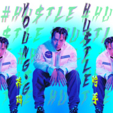

哈手HU$TLE
============================

|  |  |
| :--: | :-- |
| [ 哈手HU$TLE](https://emumo.xiami.com/album/2103216110) | **艺人**: [养鸡YoungG](../index.md) **语种**: 国语 **唱片公司**: 天娱传媒 **发行时间**: 2017年12月24日 **专辑类别**: EP, 单曲 **专辑风格**: 流行说唱 Pop Rap **播放数**: 14605 **收藏数**: 40 **评论数**: 7  |

## 简介

理想是裹在钞票外面粉饰的锡箔糖纸  
幸福不是入口即化的一次性消费  
面包和爱情两手攥紧  
大脑和钱包同步武装  
  
2017全能嘻哈-电音鬼才-养鸡YOUNG-G  
YOUNG-G首支原创主打歌曲惊叹发声我行我素  
致嘻哈元年里叛逆而虔诚的“哈手”信仰  
来自Song Writing Camp两日灵感迸进之作，辗转浮沉后的戏谑式独立宣言，打破“谈钱色变”的文艺腔调，直面功名利禄的洪水猛兽，养鸡YOUNG-G在大声宣读这个时代人心中敢想不敢言的“灰色地带”；  
“HU$TLE”一词在嘻哈术语中原指略带匪气的“拼命赚钱”之意，在歌词中共出现33次，振臂高呼式的口号，极富煽动性的呐喊，在养鸡YOUNG-G眼里，这些不过是人类最真诚与朴素的追求，HU$TLE的结果不意味着挥金如土，不意味着高高在上，而是“给妈妈买栋高楼”，是“别对我的兄弟家人姐妹们乱来”，是“把赚来的钱都放在音乐和设备里面”这些因善良而闪闪发光的愿望；用挚爱的音乐保护挚爱之人，这之间所谓的“金钱怪兽”，不过是达成夙愿的温驯坐骑罢了，我们歌颂为大义“视金钱为粪土”，歌颂“不为五斗米折腰”，更应该歌颂为梦想为守护为幸福而努力快乐赚钱的平凡之人。  
  
拿到养鸡YOUNG-G的曲时，制作人Daryl K将一个简单原始的beat做了全新的改编，融入美式的swag，加上American electron trap Style 的“新鲜”感，第一段主歌从舒缓轻松的钢琴加上distorted filtered supersaw pad换到drop之后进入不同层次的音色，又在第二个主歌开始加入了低沉的distorted sine wave，想象力十足。养鸡YOUNG-G对编曲也非常有自己的见解，完全理解Daryl K的艺术创作，二人沟通很顺利。经过两天半的时间，一首全新的电子Trap新鲜出炉。  
  
单曲视觉由90后“复古女王”、知名造型师陈星如操刀，造型大胆前卫，作为中国新生代IT Girl的她，和养鸡YOUNG-G一拍即合，两人都喜欢, 银河的蒸汽波，空间的霓虹，街头的聚焦，“YOUNG”“WILD”“FREE”在养鸡YOUNG-G身上举行了一次够疯狂够新潮的合作：所有照片均采用胶片拍摄，场景、光影别出心裁，镜头抓拍自由随性，色调、构图简单粗暴又时尚新潮个性，用与众不同的镜头语言来重塑经典、解构经典和颠覆经典，给人跌破观念的视觉冲击；单曲封面更是重新解构了大众对美与和谐的固有枷锁，“喜欢的人狂热膜拜，不喜欢的人避而远之”，养鸡YOUNG-G坦言“比赛时不走寻常路，不按套路出牌，我行我素造就了现在的养鸡YOUNG-G，那为什么现在的我反而要回到壳里做一只安全、规矩、不温不火的鹌鹑呢？”  
  
或许“嘻哈人”根植在骨子里的率真与坚持，让他们曾在贫穷里仰望天空，在主流中逆行穿梭，在underground嘈杂与拥挤中怀抱梦想，而今天的养鸡YOUNG-G，在最好的时代用嘻哈铿锵有力的诉说，点燃更多逆流而上的龙门锦鲤，我们需要物质的甘霖，也需要精神的沐浴，在这个纷繁的世界一起HU$TLE吧！

## 曲目

## 评论

|  |  |  |  |
| :-- | :-- | :-- | :-- |
|  [虾米用户](https://emumo.xiami.com/u/256528576)  2018-06-16 11:44 赞(0) 踩(0) | 
好听
 |
|  [虾米用户](https://emumo.xiami.com/u/111095838)  2018-04-07 22:35 赞(0) 踩(0) | 
不错
 |
|  [虾米用户](https://emumo.xiami.com/u/346875522)  2018-02-19 08:44 赞(0) 踩(0) | 
超级好听
 |
|  [虾米用户](https://emumo.xiami.com/u/346028559)  2018-01-24 09:47 赞(0) 踩(0) | 
不做万人迷.只做养鸡 
 |
| ⇒ |  [虾米用户](https://emumo.xiami.com/u/346398830)  2018-04-11 18:04 赞(0) 踩(0) | 
对
 |
|  [虾米用户](https://emumo.xiami.com/u/312934897) 喜欢你 2017-12-31 09:36 赞(0) 踩(0) | 
养鸡！
 |
|  [虾米用户](https://emumo.xiami.com/u/7776040)  2017-12-29 13:13 赞(0) 踩(0) | 
烦人，版权呢
 |
