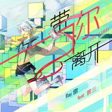

带你离开 -重制版-Take you away(Remastered Ver.)
============================

|  |  |
| :--: | :-- |
| [ 带你离开 -重制版-Take you away(Remastered Ver.)](https://emumo.xiami.com/album/2100204470) | **艺人**: [Days乐团](../index.md) **语种**: 国语 **唱片公司**: 独立发行 **发行时间**: 2015年09月21日 **专辑类别**: EP, 单曲 **专辑风格**: 实验摇滚 Experimental Rock, 独立摇滚 Indie Rock, 另类摇滚 Alternative Rock **播放数**: 15070 **收藏数**: 40 **评论数**: 8  |

## 简介

乐团乐师Ray雷去年写的一首言和的歌的重置版本。这次是由真人演唱，编曲已重制改编。更多单曲请访问Ray雷的个人单曲集：<a title="Purple Memories" href="http://www.xiami.com/album/304286090" style="line-height: 21.6000003814697px; font-size: 12px; text-decoration: none; border: 0px; margin: 0px; outline: 0px; padding: 0px; color: rgb(51, 102, 204); cursor: pointer; -webkit-tap-highlight-color: rgb(254, 150, 0);">Purple Memories</a>
 

封面绘制：狼语
 

封面设计：F≠ma
 

  

## 曲目

## 评论

|  |  |  |  |
| :-- | :-- | :-- | :-- |
|  [虾米用户](https://emumo.xiami.com/u/27139903) 再也不见 2015-10-01 14:59 赞(0) 踩(0) | 
封面棒棒哒
 |
|  [虾米用户](https://emumo.xiami.com/u/4400366) 再也不见 2015-09-23 03:57 赞(0) 踩(0) | 
囍
 |
|  [虾米用户](https://emumo.xiami.com/u/63611754)  2015-09-22 20:37 赞(0) 踩(0) | 
三哥帅帅帅
 |
|  [虾米用户](https://emumo.xiami.com/u/63611754)  2015-09-22 20:34 赞(0) 踩(0) | 
三哥帅cry！
 |
|  [虾米用户](https://emumo.xiami.com/u/49081478) 微笑是我们最初的信仰。 2015-09-22 18:10 赞(0) 踩(0) | 
赞！
 |
|  [虾米用户](https://emumo.xiami.com/u/44033778) 无论什么最好 我希望它属... 2015-09-22 13:23 赞(1) 踩(0) | 
前奏简直不能更赞
 |
|  [虾米用户](https://emumo.xiami.com/u/6975678) 生命如此短暂我比烟花灿烂 2015-09-22 00:32 赞(0) 踩(0) | 
终于整理完毕！抢个沙发！
 |
|  [虾米用户](https://emumo.xiami.com/u/6975678) 生命如此短暂我比烟花灿烂 2015-09-22 00:32 赞(0) 踩(0) | 
终于整理完毕！抢个沙发！
 |
