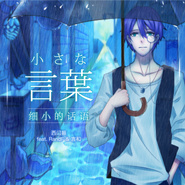

小さな言葉 / 细小的话语
============================

|  |  |
| :--: | :-- |
| [ 小さな言葉 / 细小的话语](https://emumo.xiami.com/album/2100283794) | **艺人**: [Days乐团](../index.md) **语种**: 国语 **唱片公司**: 独立发行 **发行时间**: 2016年03月01日 **专辑类别**: EP, 单曲 **专辑风格**: 流行摇滚 Pop Rock **播放数**: 3232 **收藏数**: 38 **评论数**: 5  |

## 简介

 

和西门还有飞哥2013年就挖好的大坑，辗转了好长时间总算是填上啦，当时只是飞哥在西门家随意弹了一个特别好听的旋律，结果两人就把旋律写成了曲子，西门这两年编曲上也是进步神速，重编后的曲子更加饱满，更加丰富了，MUE的词出的特别快，而且写的特别有意境，感谢所有为这首曲子付出的伙伴们，大家辛苦啦，有幸能演唱这首曲子真是太棒了，希望各位也能喜欢~
 

 
 

作曲：飞木、西门振
 

编曲：西门振
 

VOCALOID调音：西门振
 

作词：MUE、安之
 

混音：小透叔叔
 

和声，修音：墨橙
 

曲绘：尤米一YJY
 

PV：寒雨
 

出品：DAYS乐团
 

## 曲目

## 评论

|  |  |  |  |
| :-- | :-- | :-- | :-- |
|  [虾米用户](https://emumo.xiami.com/u/8975976) 我还没想好要写什么... 2016-03-14 09:57 赞(1) 踩(0) | 
好听=3=
 |
|  [虾米用户](https://emumo.xiami.com/u/16037926) 艾斯兔一生推 2016-03-01 23:05 赞(1) 踩(0) | 
封面赞
 |
|  [虾米用户](https://emumo.xiami.com/u/12732083)  2016-03-01 22:51 赞(1) 踩(0) | 
封面好评(*´罒`*)
 |
|  [虾米用户](https://emumo.xiami.com/u/51850646) 我好帅 2016-03-01 18:49 赞(0) 踩(0) | 
第二
 |
|  [虾米用户](https://emumo.xiami.com/u/58343064)  2016-03-01 11:27 赞(0) 踩(0) | 
good
 |
