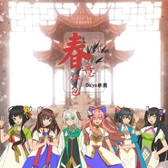

春意红包 - EP哔哩哔哩2017年拜年祭 开场曲
============================

|  |  |
| :--: | :-- |
| [ 春意红包 - EP哔哩哔哩2017年拜年祭 开场曲](https://emumo.xiami.com/album/2102691306) | **艺人**: [Days乐团](../index.md) **语种**: 国语 **唱片公司**: 独立发行 **发行时间**: 2017年02月10日 **专辑类别**: EP, 单曲 **专辑风格**:  **播放数**: 377094 **收藏数**: 93 **评论数**: 10  |

## 简介

<strong>哔哩哔哩2017年拜年祭 开场曲 </strong>
 

<strong>泠鸢yousa:</strong><strong><strong style="color: rgb(204, 0, 0);">Wing翼:</strong></strong>“希望通过这首普通的'年味儿'歌让大家找回真正过年的感觉～希望这样传统的年味儿不会在我们这代人里消失掉。
 

  
 

作曲编曲：Wing翼
 

作词：泠鸢yousa
 

吉他录制：Ray雷
 

民鼓编配：西门振
 

笛子：水玥儿
 

混音：CuTTle FiSh
 

人声修音：泠鸢yousa
 

VC版调教：动点P、清风之恋、折V
 

演唱：三无Marblue/祖娅纳惜/泠鸢yousa/小缘/洛萱/不才
 

映画：Alice映画
 

41Days/坏掉化的黑岩/糯米黑兔
 

绘图：Vinoker
 

音乐制作：Days乐团
 

Special Thanks：千叶草_阑小逝
 

 

## 曲目

## 评论

|  |  |  |
| :-- | :-- | :-- |
|  [虾米用户](https://emumo.xiami.com/u/421880507)  2019-06-21 19:49 赞(1) 踩(0) | 
超愛
 |
|  [虾米用户](https://emumo.xiami.com/u/5150363) -_-# 2018-01-05 20:13 赞(0) 踩(0) | 
顶起来速度速度
 |
|  [虾米用户](https://emumo.xiami.com/u/6975678) 生命如此短暂我比烟花灿烂 2017-10-28 00:39 赞(2) 踩(0) | 
【维护日志0209】虾米资料库不能添加非收录表演者。少的两位唱见名字在和小编沟通中。乐曲不能播放可能是因为转码问题，等待系统自动处理
 |
|  [虾米用户](https://emumo.xiami.com/u/75905444) 大家好，我是小叶 2017-05-13 21:54 赞(1) 踩(0) | 
because i like
 |
|  [虾米用户](https://emumo.xiami.com/u/8975976) 我还没想好要写什么... 2017-03-25 16:38 赞(1) 踩(0) | 
好听
 |
|  [虾米用户](https://emumo.xiami.com/u/5834654)  2017-02-12 14:39 赞(2) 踩(0) | 
B站拜年祭第一喜欢作品
 |
|  [虾米用户](https://emumo.xiami.com/u/11391357) 就是爱听 2017-02-10 17:46 赞(1) 踩(0) | 
非常好听，祝所有人新年大吉！喵喵=v=！
 |
|  [虾米用户](https://emumo.xiami.com/u/49096430) すきなんだ。 2017-02-10 13:03 赞(1) 踩(0) | 
b站今早才看到投稿w
 |
|  [虾米用户](https://emumo.xiami.com/u/166913896) 再见了，也许再也不见 2017-02-10 00:03 赞(1) 踩(0) | 
前排
 |
|  [虾米用户](https://emumo.xiami.com/u/85055814) 走向群山的企鹅 2017-02-09 23:52 赞(1) 踩(0) | 
沙发
 |
