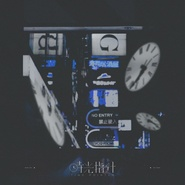

时光指针 - Days乐团音乐企划
============================

|  |  |
| :--: | :-- |
| [ 时光指针 - Days乐团音乐企划](https://emumo.xiami.com/album/2103953189) | **艺人**: [Days乐团](../index.md) **语种**: 国语 **唱片公司**: 独立发行 **发行时间**: 2018年08月31日 **专辑类别**: 录音室专辑 **专辑风格**: 流行摇滚 Pop Rock, 独立摇滚 Indie Rock, 国语流行 Mandarin Pop **播放数**: 5053 **收藏数**: 13 **评论数**: 3  |

## 简介

 Days乐团全新企划——「时光指针」
 

 ♪企划简介 由Days乐团成员Wing翼和Ray雷创设的音乐企划，旨在合作探索，拓展两人自身新的音乐风格。 企划将会注重词曲的质量和创作者之间的交流，不定期发布单曲。 时光指针，一方文艺怀旧，一方面向未来。用音符镌刻时光，探索内心的指向。   
 ♪企划成员 
 

Wing翼，乐师 Ray雷，乐师&amp;吉他手 Rain雨，策划&amp;监督 西门振，混音   
 ♪时光指针与Days 
 

时光指针是Days乐团名下的企划。Days乐团此前一直是一个半开放的合作社团，今后也会加强这一点，成为一个歌曲发布的出品方的角色。   
 ♪时光的指针 现在 开始转动...   

 

♪Now the time pointer starts spinning...
 
  

 LOGO设计：@地插dx  
 

## 曲目

## 评论

|  |  |  |
| :-- | :-- | :-- |
|  [虾米用户](https://emumo.xiami.com/u/8975976) 我还没想好要写什么... 2018-09-17 17:34 赞(0) 踩(0) | 
来了来了
 |
|  [虾米用户](https://emumo.xiami.com/u/87310168) 头像是Osanzi的一首... 2018-09-02 22:29 赞(1) 踩(0) | 
赞哦
 |
|  [虾米用户](https://emumo.xiami.com/u/34419476)  2018-09-02 16:22 赞(2) 踩(0) | 
这将是一个持续发布新作的企划专辑，新动态将会以公告栏的方式向大家推送！
 |
