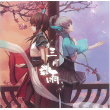

三月雨
============================

|  |  |
| :--: | :-- |
| [ 三月雨](https://emumo.xiami.com/album/460144264) | **艺人**: [Days乐团](../index.md) **语种**: 国语 **唱片公司**: 独立发行 **发行时间**: 2012年12月14日 **专辑类别**: 录音室专辑 **专辑风格**: 流行摇滚 Pop Rock, 中国风 China-Wave **播放数**: 186345 **收藏数**: 810 **评论数**: 58  |

## 简介

根据洛天依原创PV“三月雨”制作。  
故事内容主要描述天依和阿绫轮回转世从相遇到离别的故事。分为三个篇章：从汉代篇到民国篇再到现代篇。通过音乐和绘本来描述轮回转世的两人在不同时代的不同故事。 

## 曲目

## 评论

|  |  |  |
| :-- | :-- | :-- |
|  [虾米用户](https://emumo.xiami.com/u/291828514)  2017-06-23 17:28 赞(1) 踩(0) | 
音乐不分国界，喜欢听哪首随自己，而不是他人。
 |
|  [虾米用户](https://emumo.xiami.com/u/46165149) 骚年，要来点音乐吗(๑•... 2016-03-25 17:31 赞(4) 踩(0) | 
虾米通知说出了新专辑，评论都是年前的。。。
 |
| ⇒ |  [虾米用户](https://emumo.xiami.com/u/6975678) 生命如此短暂我比烟花灿烂 2016-04-02 14:57 赞(0) 踩(0) | 
我把音源更新成了WAV的。音质提高了
 |
|  [虾米用户](https://emumo.xiami.com/u/20374181) 暂无签名~ 2015-02-08 11:49 赞(1) 踩(0) | 
ask大大的封面好美_(:_」∠)_
 |
|  [虾米用户](https://emumo.xiami.com/u/40600959) 我想见你 2014-11-29 10:04 赞(0) 踩(0) | 
期待阿绫的声源。
 |
|  [虾米用户](https://emumo.xiami.com/u/5800563)  2014-06-05 18:27 赞(0) 踩(0) | 
真的很好听很有特色！嘻嘻嘻
 |
|  [虾米用户](https://emumo.xiami.com/u/3208690) 快乐的猫猫 2014-05-16 10:24 赞(1) 踩(0) | 
一错眼还以为左边的是灵梦
 |
|  [虾米用户](https://emumo.xiami.com/u/34123893)  2014-05-10 21:48 赞(0) 踩(0) | 
天依本命[扑~
 |
|  [虾米用户](https://emumo.xiami.com/u/10895868) 暂无签名~ 2014-05-06 10:43 赞(0) 踩(0) | 
洛天依！！！
 |
|  [虾米用户](https://emumo.xiami.com/u/670090)  2014-04-22 12:35 赞(0) 踩(0) | 
洛天依什么的（趴
 |
|  [虾米用户](https://emumo.xiami.com/u/2658289) 呜呜呜。 2014-04-20 14:44 赞(1) 踩(0) | 
啊啊啊啊ASK太太的封面看多少遍舔多少遍prpr ///△///
 |
|  [虾米用户](https://emumo.xiami.com/u/11636387) 坑爹才是生活的一种特性 2014-04-20 11:24 赞(0) 踩(0) | 
封面这俩都是女的么。。。？
 |
|  [虾米用户](https://emumo.xiami.com/u/2711464)  2014-04-18 13:09 赞(0) 踩(0) | 
...我第一眼看成了大和和时雨
 |
|  [虾米用户](https://emumo.xiami.com/u/14243420) 在巷口等我好不好 2014-04-16 00:05 赞(0) 踩(0) | 
为什么没有三月雨•﹏•
 |
| ⇒ |  [虾米用户](https://emumo.xiami.com/u/34419476)  2014-04-16 12:51 赞(0) 踩(0) | 
你好，《三月雨》这张专辑本来就没有《三月雨》这首曲子哈，钢琴版在《summer days》 里面
 |
| ⇒ |  [虾米用户](https://emumo.xiami.com/u/14243420) 在巷口等我好不好 2014-04-16 23:56 赞(0) 踩(0) | 
<q><b>Days乐团说：</b></q>
 |
| ⇒ |  [虾米用户](https://emumo.xiami.com/u/34419476)  2014-04-17 12:54 赞(0) 踩(0) | 
<q><b>肖秃秃说：</b></q>
 |
| ⇒ |  [虾米用户](https://emumo.xiami.com/u/14243420) 在巷口等我好不好 2014-04-18 22:39 赞(0) 踩(0) | 
<q><b>Days乐团说：</b></q>
 |
|  [虾米用户](https://emumo.xiami.com/u/3483407)  2013-11-09 19:03 赞(0) 踩(0) | 
呵呵，听完后想去买正版
 |
|  [虾米用户](https://emumo.xiami.com/u/4326461)  2013-10-16 19:23 赞(0) 踩(0) | 
别的不说了 天依最爱
 |
|  [虾米用户](https://emumo.xiami.com/u/4990070)  2013-10-16 17:08 赞(0) 踩(0) | 
天依赛高=W=
 |
|  [虾米用户](https://emumo.xiami.com/u/4802713) 有个梯子 2013-10-14 22:36 赞(0) 踩(0) | 
中国古典风
 |
|  [虾米用户](https://emumo.xiami.com/u/4802713) 有个梯子 2013-10-14 22:36 赞(0) 踩(0) | 
nice
 |
|  [虾米用户](https://emumo.xiami.com/u/11378411)  2013-10-07 16:23 赞(0) 踩(0) | 
我说真的，洛天依的声音让我想起了miku，很像中文版的miku有木有！感觉她五音不全和发音不准这点和miku简直一模一样嘛。
 |
| ⇒ |  [虾米用户](https://emumo.xiami.com/u/1007657) 懒懒一枚。。。 2013-10-24 12:27 赞(0) 踩(0) | 
童鞋，洛天依就和Miku算是一家族的
 |
| ⇒ |  [虾米用户](https://emumo.xiami.com/u/11378411)  2013-10-25 17:41 赞(0) 踩(0) | 
<q><b>もしも说：</b></q>
 |
| ⇒ |  [虾米用户](https://emumo.xiami.com/u/1007657) 懒懒一枚。。。 2013-10-25 18:00 赞(0) 踩(0) | 
<q><b>Kyo说：</b></q>
 |
|  [虾米用户](https://emumo.xiami.com/u/10551352) 想要个2次元老婆 2013-10-01 11:54 赞(0) 踩(0) | 
大爱
 |
|  [虾米用户](https://emumo.xiami.com/u/5656412)  2013-09-14 23:32 赞(0) 踩(0) | 
一直很喜欢，没想到虾米有=-=
 |
|  [虾米用户](https://emumo.xiami.com/u/5656412)  2013-09-14 23:31 赞(0) 踩(0) | 
嘛..做一回天依党..壮哉大三月雨~
 |
|  [虾米用户](https://emumo.xiami.com/u/5068880) 为我施与音乐的魔法 2013-07-07 19:27 赞(0) 踩(0) | 
这张要是人声翻唱绝对是神作..... 感谢上传歌词的朋友。
 |
|  [虾米用户](https://emumo.xiami.com/u/8271014) 暂无签名~ 2013-06-17 01:31 赞(0) 踩(0) | 
超好
 |
|  [虾米用户](https://emumo.xiami.com/u/10134901)   2013-06-13 18:47 赞(0) 踩(0) | 
虾歌竟然有三月雨专辑！！！！！！碉堡了
 |
|  [虾米用户](https://emumo.xiami.com/u/9542856) 心在乌云上 2013-06-10 21:59 赞(1) 踩(0) | 
怎么找不到《风萤月》呐
 |
|  [虾米用户](https://emumo.xiami.com/u/12386645) 正常并健康 2013-06-06 18:02 赞(1) 踩(0) | 
没有第一张好
 |
|  [虾米用户](https://emumo.xiami.com/u/9756018)  2013-06-03 09:06 赞(1) 踩(0) | 
古风大推荐
 |
|  [虾米用户](https://emumo.xiami.com/u/12023630) ☆(*ˉ︶ˉ*) 2013-05-06 14:16 赞(1) 踩(0) | 
太美了~
 |
|  [虾米用户](https://emumo.xiami.com/u/10579003)  2013-04-05 00:25 赞(1) 踩(0) | 
其实我想听泠鸢
 |
|  [虾米用户](https://emumo.xiami.com/u/13693934) 假情假意 2013-03-26 22:32 赞(1) 踩(0) | 
好聽~
 |
|  [虾米用户](https://emumo.xiami.com/u/2008001) 一曲肝肠断，天涯何处觅知... 2013-03-16 22:15 赞(0) 踩(0) | 
~~！
 |
|  [虾米用户](https://emumo.xiami.com/u/11730260)  2013-03-16 00:31 赞(0) 踩(0) | 
推荐三月雨嗯
 |
|  [虾米用户](https://emumo.xiami.com/u/12359315)  2013-03-13 22:16 赞(0) 踩(0) | 
因为这张碟已经入手了，所以可以在这里正大光明地宣传：如果大家喜欢就将碟子入手吧。
 |
|  [虾米用户](https://emumo.xiami.com/u/12276280)  2013-03-10 19:17 赞(0) 踩(0) | 
大爱天依~~
 |
|  [虾米用户](https://emumo.xiami.com/u/7491178)  2013-03-09 19:27 赞(8) 踩(0) | 
请支持正版,支持国产谢谢！有爱的孩子请出一份力支持洛洛 支持days~ <a href="http://item.taobao.com/item.htm?spm=a1z10.1.4004-666935397.2.k9HRAh&amp;amp;id=21503532388" target="_blank" rel="nofollow noreferrer noopener">http://item.taobao.com/item.htm?spm=a1z10.1.4004-666935397.2.k9HRAh&amp;amp;id=21503532388</a>
 |
|  [虾米用户](https://emumo.xiami.com/u/2658168)  2013-03-09 18:27 赞(6) 踩(0) | 
Days幻梦年华乐团-三月雨.7z，大小：295.76MB 115**礼包接收地址：<a href="http://115.com/lb/5lb42ba" target="_blank" rel="nofollow noreferrer noopener">http://115.com/lb/5lb42ba</a> 115**礼包码：5lb42ba (wav 无损）
 |
| ⇒ |  [虾米用户](https://emumo.xiami.com/u/34419476)  2014-04-21 11:40 赞(0) 踩(0) | 
你好，我们已经在艺人主页上公开了全盘资源（mp3+电子BK），请不要公开放置这种无损资源，如果喜欢请支持正版！
 |
|  [虾米用户](https://emumo.xiami.com/u/3083305)  2013-03-09 10:24 赞(1) 踩(0) | 
暗夜下的飞翔这首的前奏真心不错，有POP的感觉~
 |
|  [虾米用户](https://emumo.xiami.com/u/13431685)  2013-03-08 23:03 赞(1) 踩(0) | 
已入，美哭QAQ
 |
|  [虾米用户](https://emumo.xiami.com/u/3083305)  2013-03-08 10:26 赞(1) 踩(0) | 
三月雨系列曲真心好听！今生如梦虽说是粤语但是也好棒！！！
 |
|  [虾米用户](https://emumo.xiami.com/u/2801768)  2013-03-07 23:50 赞(1) 踩(0) | 
哟，发布了，抓紧下载，说不定神马时候又没有了
 |
|  [虾米用户](https://emumo.xiami.com/u/4782340)  2013-03-07 19:13 赞(0) 踩(0) | 
戏曲···有意识吖~
 |
|  [虾米用户](https://emumo.xiami.com/u/12456480)  2013-03-05 12:55 赞(0) 踩(0) | 
原先就发布了的歌曲变成未发布，看样子黑幕不小一 一+
 |
| ⇒ |  [虾米用户](https://emumo.xiami.com/u/7491178)  2013-03-09 19:24 赞(0) 踩(0) | 
不是的..原先是我准备发布的..因为发布的时候电脑一黑..传输不成功了..然后脱了很久也没有时间上网..于是发布就给别人了...
 |
| ⇒ |  [虾米用户](https://emumo.xiami.com/u/2658168)  2013-03-17 12:49 赞(0) 踩(0) | 
<q><b>雪....说：</b></q>
 |
|  [虾米用户](https://emumo.xiami.com/u/9917246) 哦呀呀~ 2013-03-04 15:24 赞(1) 踩(0) | 
什么时候才发布啊
 |
|  [虾米用户](https://emumo.xiami.com/u/3083305)  2013-02-27 16:55 赞(1) 踩(0) | 
嘤嘤快发布啊！！！！
 |
|  [虾米用户](https://emumo.xiami.com/u/12523925)  2013-02-15 15:21 赞(1) 踩(0) | 
天依~~
 |
|  [虾米用户](https://emumo.xiami.com/u/7491178)  2013-02-06 23:03 赞(1) 踩(0) | 
三月雨是洛天依当之无愧的整殿神曲..值得一听
 |
