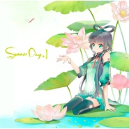

Summer Days夏日
============================

|  |  |
| :--: | :-- |
| [ Summer Days夏日](https://emumo.xiami.com/album/530070) | **艺人**: [Days乐团](../index.md) **语种**: 国语 **唱片公司**: 独立发行 **发行时间**: 2012年07月21日 **专辑类别**: 录音室专辑 **专辑风格**: 摇滚 Rock & Roll **播放数**: 165603 **收藏数**: 491 **评论数**: 66  |

## 简介

全球首张Vocaloid中文音源原创同人音乐专辑-SummerDays  
Producer ： Days幻梦年华乐团   
  
Schemer ＆ Original ： Wing翼   
  
Composer &amp; Arranger：   
Wing翼   
Ray   
胡多多   
兔子Jei   
  
Vocaloid Training：   
鬼照   
Wing翼   
兔子Jei   
  
Guitar &amp; Bass &amp; dizi:   
Wing翼   
兔子Jei   
杀手唐尼   
胡多多   
  
Lyric ：   
千里山   
Wing翼   
圣月樱泪   
Ray   
  
Illustrator ：   
月色火焰   
  
Art Designer ： 雕小抽   
  
Special Thanks:   
阿正   
草纸   
阿蛋   
海舟   
  
Website： weibo.com/daysdays   
  
曲目LIST：   
1.夏夕空   
2.夏日恋歌   
3.荧光蝶   
4.透明的幻境   
5.雨夏轻吟   
6.夏日的梦   
7. 三月雨ver.Piano 

## 曲目

## 评论

|  |  |  |
| :-- | :-- | :-- |
|  [虾米用户](https://emumo.xiami.com/u/37584402) 失落，失落，失落！ 2014-11-30 09:14 赞(0) 踩(0) | 
这首我愿意单曲循环366天~
 |
|  [虾米用户](https://emumo.xiami.com/u/26156168)  2014-08-15 17:44 赞(0) 踩(0) | 
还是洛天依的好听
 |
|  [虾米用户](https://emumo.xiami.com/u/9274692) はあ 2014-07-11 12:53 赞(0) 踩(0) | 
矮油，不错哦
 |
|  [虾米用户](https://emumo.xiami.com/u/34161723) 暂无签名~ 2014-06-25 20:42 赞(0) 踩(0) | 
好听！！
 |
|  [虾米用户](https://emumo.xiami.com/u/681476) 衣不如新，人不如故 2014-05-10 15:49 赞(0) 踩(0) | 
中华墨水娘，收藏来听听^^
 |
|  [虾米用户](https://emumo.xiami.com/u/7187271) Invoke(this)... 2014-04-18 14:10 赞(0) 踩(0) | 
天依的这种感觉好清爽=-=~
 |
|  [虾米用户](https://emumo.xiami.com/u/6879731) 失终人口回归 2014-03-12 22:08 赞(0) 踩(0) | 
好棒好棒。。。
 |
|  [虾米用户](https://emumo.xiami.com/u/4802713) 有个梯子 2013-10-14 22:36 赞(0) 踩(0) | 
ncie
 |
|  [虾米用户](https://emumo.xiami.com/u/11378411)  2013-10-07 16:26 赞(1) 踩(0) | 
第一反应是中文版的miku和miku一样发音不准（还有就是五音不全）
 |
|  [虾米用户](https://emumo.xiami.com/u/3862964) 有一天，我死了… 2013-08-30 22:53 赞(0) 踩(0) | 
因为爱上了天依妹妹~~
 |
|  [虾米用户](https://emumo.xiami.com/u/7616714)  2013-08-20 14:57 赞(0) 踩(0) | 
洛天依的新作集！不要错过哦！
 |
|  [虾米用户](https://emumo.xiami.com/u/9498196)  2013-06-29 19:20 赞(0) 踩(0) | 
因为是比较早的专辑，能调教成这样已经很不错了
 |
|  [虾米用户](https://emumo.xiami.com/u/8271014) 暂无签名~ 2013-06-17 01:35 赞(0) 踩(0) | 
3
 |
|  [虾米用户](https://emumo.xiami.com/u/8595763) 壳子 2013-03-21 14:17 赞(0) 踩(0) | 
个人最喜欢的是诸位播放最少的《夏日的梦》。
 |
|  [虾米用户](https://emumo.xiami.com/u/2008001) 一曲肝肠断，天涯何处觅知... 2013-03-16 22:20 赞(0) 踩(0) | 
~~3
 |
|  [虾米用户](https://emumo.xiami.com/u/12456480)  2013-03-05 13:02 赞(0) 踩(0) | 
洛天依发布的专辑貌似2张未发布，一张无缘无故被删除。特么坑爹啊
 |
|  [虾米用户](https://emumo.xiami.com/u/3083305)  2013-02-27 16:53 赞(0) 踩(0) | 
原来天依的歌在这里！！！！！！！！！ 才发现……
 |
|  [虾米用户](https://emumo.xiami.com/u/4731922) 我思，故我在 2013-02-22 00:22 赞(0) 踩(0) | 
很好听~~
 |
|  [虾米用户](https://emumo.xiami.com/u/3661789) 暂无签名~ 2012-11-28 13:54 赞(0) 踩(0) | 
发音差点
 |
|  [虾米用户](https://emumo.xiami.com/u/11271182)  2012-10-30 12:28 赞(0) 踩(0) | 
超好听
 |
|  [虾米用户](https://emumo.xiami.com/u/7491178)  2012-10-01 12:19 赞(0) 踩(0) | 
差了一首歌..是前奏..肿么办？
 |
|  [虾米用户](https://emumo.xiami.com/u/10744301)  2012-09-23 01:33 赞(0) 踩(0) | 
好棒好棒的!
 |
|  [虾米用户](https://emumo.xiami.com/u/10551352) 想要个2次元老婆 2012-09-09 10:47 赞(0) 踩(0) | 
我喜欢夏日恋歌
 |
|  [虾米用户](https://emumo.xiami.com/u/10551352) 想要个2次元老婆 2012-09-09 10:38 赞(0) 踩(0) | 
好听
 |
|  [虾米用户](https://emumo.xiami.com/u/10551352) 想要个2次元老婆 2012-09-09 10:37 赞(0) 踩(0) | 
好听，不需要理由
 |
|  [虾米用户](https://emumo.xiami.com/u/8437121)  2012-08-26 13:27 赞(0) 踩(0) | 
虽然听着很别扭，但还是支持一下吧
 |
|  [虾米用户](https://emumo.xiami.com/u/7081023) 人类love 2012-08-17 09:54 赞(0) 踩(0) | 
beautiful
 |
|  [虾米用户](https://emumo.xiami.com/u/1272599) o_OL.pinme 2012-08-16 20:55 赞(1) 踩(0) | 
乐器声音略大，经常听不出在唱什么=。=
 |
|  [虾米用户](https://emumo.xiami.com/u/286463) 音乐不是歌 2012-08-13 22:14 赞(0) 踩(0) | 
让我再好好听听
 |
|  [虾米用户](https://emumo.xiami.com/u/8976748)  2012-08-09 20:00 赞(0) 踩(0) | 
喜欢V家，喜欢洛天依！更喜欢MIKU！
 |
|  [虾米用户](https://emumo.xiami.com/u/852998) 西尔德斯神话 2012-08-09 10:14 赞(0) 踩(0) | 
荧光蝶美了，前奏迷幻空灵，歌曲燃，调教优，有种阿信的感觉。
 |
|  [虾米用户](https://emumo.xiami.com/u/5943855)   2012-08-08 19:52 赞(0) 踩(0) | 
我想买！！但是没得卖了！！！
 |
|  [虾米用户](https://emumo.xiami.com/u/4322757)  2012-08-08 14:19 赞(1) 踩(0) | 
夏日的梦有一丝蛋蛋的40mp的赶脚
 |
|  [虾米用户](https://emumo.xiami.com/u/6732458)  2012-08-08 10:58 赞(0) 踩(0) | 
入手入手！
 |
|  [虾米用户](https://emumo.xiami.com/u/9998626)  2012-08-07 13:46 赞(0) 踩(0) | 
我在决定要不要入……
 |
|  [虾米用户](https://emumo.xiami.com/u/2698026) 最多12个鸽子 2012-08-06 23:52 赞(0) 踩(0) | 
比起初音确实还是有距离、但是40大洋的价格也把初音撂的远远的了、不支持下怎么行、支持正版~就算是收藏了~
 |
|  [虾米用户](https://emumo.xiami.com/u/7491178)  2012-08-06 16:19 赞(0) 踩(0) | 
我想说...CD里面其实还有一首歌..不过是曲目01 相当于序这样...没有唱..只有音乐..
 |
|  [虾米用户](https://emumo.xiami.com/u/3183340) 助けて欲しかった。 2012-08-06 13:40 赞(0) 踩(0) | 
其实觉得伴奏和人声的调子不太符…但是整体很好~
 |
|  [虾米用户](https://emumo.xiami.com/u/9931261)  2012-08-04 23:33 赞(0) 踩(0) | 
好可爱的嗓音&amp;gt;&amp;lt;
 |
|  [虾米用户](https://emumo.xiami.com/u/3573871)  2012-08-03 12:53 赞(0) 踩(0) | 
明日之星~什么时候出游戏呀~~
 |
|  [虾米用户](https://emumo.xiami.com/u/1433360)  2012-08-01 23:42 赞(0) 踩(0) | 
CD想入
 |
|  [虾米用户](https://emumo.xiami.com/u/9716210)  2012-08-01 19:07 赞(0) 踩(0) | 
洛天依的专辑
 |
|  [虾米用户](https://emumo.xiami.com/u/9716210)  2012-08-01 19:02 赞(0) 踩(0) | 
好好好好好好！！！
 |
|  [虾米用户](https://emumo.xiami.com/u/7645830)  2012-07-29 15:47 赞(0) 踩(0) | 
嘤嘤！还不错
 |
|  [虾米用户](https://emumo.xiami.com/u/440070) 牙好胃口就好 2012-07-29 01:36 赞(1) 踩(0) | 
很怪的感觉,是不是音源不太好?
 |
| ⇒ |  [虾米用户](https://emumo.xiami.com/u/6975678) 生命如此短暂我比烟花灿烂 2012-07-31 23:10 赞(0) 踩(0) | 
已经很好了，，，，山新的配音。。。。这是没办法的事情，机器合成的和人唱的就是有点不一样。 其实已经做得很好了，毕竟洛天依还在起步阶段，多点支持吧
 |
|  [虾米用户](https://emumo.xiami.com/u/6975678) 生命如此短暂我比烟花灿烂 2012-07-28 22:37 赞(0) 踩(0) | 
太唯美了！！
 |
|  [虾米用户](https://emumo.xiami.com/u/9642105)  2012-07-27 19:50 赞(0) 踩(0) | 
表示喜欢荧光蝶- -泪牛满面- -这才是我追求的国产- -比高牌请明星更有爱- -萌就是正义
 |
|  [虾米用户](https://emumo.xiami.com/u/9642105)  2012-07-27 19:47 赞(0) 踩(0) | 
必须支持= =话说等动画都要把桌子啃了
 |
|  [虾米用户](https://emumo.xiami.com/u/2328911) 兕 2012-07-27 17:29 赞(0) 踩(0) | 
还是不错的
 |
|  [虾米用户](https://emumo.xiami.com/u/2576304) 圣德太子与苏我马子 2012-07-26 22:20 赞(0) 踩(0) | 
这样随便放流大丈夫吗？
 |
| ⇒ |  [虾米用户](https://emumo.xiami.com/u/7491178)  2012-07-27 13:53 赞(0) 踩(0) | 
看有木有人举报...咯...
 |
|  [虾米用户](https://emumo.xiami.com/u/4992169) ________流亡者。 2012-07-26 21:55 赞(0) 踩(0) | 
嘤嘤嘤嘤天依！
 |
|  [虾米用户](https://emumo.xiami.com/u/7491178)  2012-07-26 17:44 赞(0) 踩(0) | 
！！！！！调教好！！！！！！
 |
|  [虾米用户](https://emumo.xiami.com/u/2254757) Otaku_kis 2012-07-26 12:55 赞(0) 踩(0) | 
国人必顶呢！！
 |
|  [虾米用户](https://emumo.xiami.com/u/2254757) Otaku_kis 2012-07-26 12:55 赞(0) 踩(0) | 
国人必顶呢！！
 |
|  [虾米用户](https://emumo.xiami.com/u/132141) HEY、提督ぅー！ 2012-07-25 09:32 赞(0) 踩(0) | 
吃货公主大人
 |
|  [虾米用户](https://emumo.xiami.com/u/132141) HEY、提督ぅー！ 2012-07-25 09:30 赞(0) 踩(0) | 
吃货公主SAMA
 |
|  [虾米用户](https://emumo.xiami.com/u/1007657) 懒懒一枚。。。 2012-07-24 20:24 赞(0) 踩(0) | 
第一吃货公主一定要支持！！！
 |
|  [虾米用户](https://emumo.xiami.com/u/9888480) 大爱天依！~ 2012-07-24 20:09 赞(0) 踩(0) | 
最爱天依！！！~
 |
|  [虾米用户](https://emumo.xiami.com/u/7626010) 我要欧拜 2012-07-24 14:54 赞(0) 踩(0) | 
速度支持啊
 |
|  [虾米用户](https://emumo.xiami.com/u/7491178)  2012-07-24 14:29 赞(0) 踩(0) | 
哇塞..这速度....!!!
 |
|  [虾米用户](https://emumo.xiami.com/u/5) 三男一狗 2012-07-24 13:57 赞(0) 踩(0) | 
为什么有绿坝娘的感觉....
 |
| ⇒ |  [虾米用户](https://emumo.xiami.com/u/7491178)  2012-07-24 14:21 赞(0) 踩(0) | 
咦？
 |
|  [虾米用户](https://emumo.xiami.com/u/7491178)  2012-07-24 13:06 赞(0) 踩(0) | 
....洛洛的专辑....！无条件支持！
 |
|  [虾米用户](https://emumo.xiami.com/u/7491178)  2012-07-24 13:00 赞(0) 踩(0) | 
效率啊...小编辛苦了..
 |
