Days乐团
============================

|  |  |
| :--: | :-- |
| [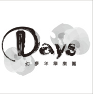<br>Days乐团](https://i.xiami.com/daysband) | **地区**: China 中国大陆<br>**风格**: 同人音乐 DouJin, 流行 Pop, 流行摇滚 Pop Rock, 独立摇滚 Indie Rock<br>**播放数**: 6821093<br>**粉丝数**: 3615<br>**评论数**: 132<br> |

## 档案

<div>
Days乐团，2007年初步成立，初期以翻唱ACG歌曲参加LIVE为主的乐队，后逐渐转型为创作型网络团队。在接下来第二年又自行组织了LIVEDAYS 2，这时的乐队开始慢慢有了雏形。到第三年2010年，在LIVE DAYS 3之后，DAYS乐团正式成立。音乐创作方向非常多元化：古风，摇滚，民谣，治愈系，世界音乐，流行电子乐等都有涉及，因为涉及面太广，至今也没有一种特有的音乐风格能定义乐团的音乐。乐团以平均8个月左右的周期出一张专辑。从最初的2次创作到后来的纯原创。‘失落的机械城’这张专辑算是乐团正式步入纯原创阶段。之后很长一段时间都在以Vocaloid China‘洛天依’为主进行创作。先后创作了‘Summer Days’ ‘三月雨’ ‘忆香’三张专辑。并有大量非专辑收录单曲在BILIBILI等视频网站发布。2014年乐团正在创作‘失落的机械城续篇’现乐团因成员变动很大，开始以同人音乐制作为主。<br>
>>>>>>>>>>>现任成员<br>
【Wing翼】简介：音乐人<br>
在08年时开过一家Maiddays女仆咖啡屋。在开店的过程中结识了一些爱好动漫音乐的的朋友,并且成立了一支ACG翻唱乐队,也就是 ‘Days幻梦年华楽団’的前身‘Days乐团’。开始与乐团一起陆续在全国各大同人展登台演出。并且组织了LiveDays动漫音乐祭这个演出平台,起初是以Days乐团专场演出的平台，后来慢慢做成了一个人人都可以报名参与的综合性大规模的LIVE平台 。在此期间担任了多张同人音乐专辑的监督和制作。主要以主催的身份在做各个同人项目。主要活动于同人音乐加绘本的形式的出品。另外除了音乐制作外，业余时间也要出一些动漫COSPLAY。<br>
【Ray雷】简介：音乐人<br>
20​07年初期组建过一些地下乐队参加过一些演出，由于理念不同及其他因素离队后不接触地下音乐圈。在2010年初夏在一次乐器行排练中结识了Wing翼，初步了解了ACG（动漫/漫画/游戏）的同人文化后深受一定的影响，不仅喜欢觉得理念也很相投便一起组建了乐团。几年期间参与游戏项目制作组制作音乐中担任过作曲/编曲/词作/演奏/录音等项目后，平时业余时间也要写写自己喜欢的风格曲子，偶尔不定期会发布一些同人作品以及其他音乐作品和一些吉他演奏视频，在演出舞台上演出偶尔会COSPALY一下。<br>
个人虾米链接：    http://i.xiami.com/raylee<br>
【Sora-Megami】简介：LiveDays动漫同人音乐祭主催<br>
起初作为观众第一次观看了第四届livedays深受影响后，喜欢上了LiveDays活动带来的感觉，通过认识后加入了乐团社团组织，起初负责后援团活动。2013年正式加入乐团后开始策划了第6届LiveDays动漫音乐同人祭。2014年在海外留学过程中也经常在策划一些线上线下活动，偶尔会翻唱一些热门动漫歌曲或同人歌曲，目标是想做一名优秀的声优。<br>
【折V】简介：Vocaloid调音师，见习PV&画手<br>
2013年左右了解到Vocaloid，并在浏览作品期间认识了Days乐团，于是开始尝试进行Vocaloid调音。于2015年暑假参与调教了《失落的机械城2》中部分曲目，并正式加入了Days。平时喜欢画画，并尝试将其运用到PV制作中。<br>
【西门振】简介：乐师<br>
2015年通过days前成员小透介绍，认识并加入了Days乐团。于2015年参与《Travel days》创作《页角情书》一曲。爱好包括摄影，DJ，写真和作画。
</div>

## 专辑

| 名称 | 语种 | 唱片公司 | 发行时间 | 专辑类别 | 专辑风格 |
| :--: | :-- | :-- | :-- | :-- | :-- |
| [<br>关于我"时光指针"收录曲](./albums/2104592532.md) | 国语 | 独立发行 | 2019年02月10日 | EP, 单曲 | 国语流行 Mandarin Pop, 新灵魂乐 Neo-Soul, 轻音乐流行 Light Pop |
| [<br>League of Legends（2018ver.）英雄联盟同名原创曲2018ver](./albums/2104170822.md) | 英语 | 独立发行 | 2018年10月26日 | EP, 单曲 | 流行摇滚 Pop Rock, 同人音乐 DouJin |
| [<br>废墟中的花朵（中文填词ver.）廃墟に咲け花（Chinese Ver.）](./albums/2104035730.md) | 国语 | 独立发行 | 2018年09月16日 | EP, 单曲 | 日本动漫游戏 Japanese ACG, 流行摇滚 Pop Rock, 同人音乐 DouJin |
| [<br>过竹乡Days&踏云社合作出品](./albums/2104014386.md) | 国语 | 独立发行 | 2018年09月06日 | EP, 单曲 | 古风 GuFeng Music, 国语流行 Mandarin Pop, 中国风 China-Wave |
| [<br>时光指针 - Days乐团音乐企划](./albums/2103953189.md) | 国语 | 独立发行 | 2018年08月31日 | 录音室专辑 | 流行摇滚 Pop Rock, 独立摇滚 Indie Rock, 国语流行 Mandarin Pop |
| [<br>飞鸟 - EP](./albums/2103699256.md) | 国语 | 独立发行 | 2018年04月30日 | EP, 单曲 | 流行 Pop, 同人音乐 DouJin |
| [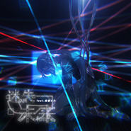<br>迷失未来 feat.初音ミクLost in future](./albums/2103698179.md) | 国语 | 独立发行 | 2018年04月27日 | EP, 单曲 | 流行摇滚 Pop Rock, 同人音乐 DouJin, 实验摇滚 Experimental Rock |
| [<br>埋葬（乐正绫ver.）](./albums/2103465549.md) | 国语 | 独立发行 | 2017年12月31日 | EP, 单曲 | 流行摇滚 Pop Rock, 同人音乐 DouJin |
| [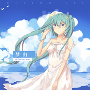<br>梦由 - EP](./albums/2102726967.md) | 国语 | 独立发行 | 2017年04月04日 | EP, 单曲 | 梦幻流行 Dream Pop, 同人音乐 DouJin |
| [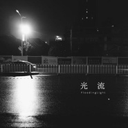<br>光流 ft.Wing翼Wing翼个人单曲作品](./albums/2102695886.md) | 国语 | 独立发行 | 2017年02月19日 | EP, 单曲 | 轻音乐 Easy Listening, 新世纪音乐 New Age |
| [<br>春意红包 - EP哔哩哔哩2017年拜年祭 开场曲](./albums/2102691306.md) | 国语 | 独立发行 | 2017年02月10日 | EP, 单曲 |  |
| [<br>前前前世 ft.泠鸢yousa（Slow Ver.）《前前前世》慢版 / 动画电影《你的名字》插曲 改编版](./albums/2102662492.md) | 日语 | 独立发行 | 2016年12月11日 | EP, 单曲 | 日本动漫游戏 Japanese ACG, 同人音乐 DouJin, 轻摇滚 Soft Rock |
| [<br>Fantastic Feel ~ 月之章 ~](./albums/2100336756.md) | 国语 | 独立发行 | 2016年05月18日 | EP, 单曲 | 爵士摇滚 Jazz Rock, 电音流行 Electropop |
| [<br>宅圆舞曲 - EP](./albums/2100322336.md) | 国语 | 独立发行 | 2016年04月25日 | EP, 单曲 | 流行舞曲 Dance-Pop, 同人音乐 DouJin, 国语流行 Mandarin Pop |
| [<br>秋色为衣 - EP](./albums/2100309762.md) | 国语 | 独立发行 | 2016年04月09日 | EP, 单曲 |  |
| [<br>春雨 - EP'三月雨' 乐正绫视角前传](./albums/2100300956.md) | 国语 | 独立发行 | 2016年03月26日 | EP, 单曲 | 流行摇滚 Pop Rock |
| [<br>小さな言葉 / 细小的话语](./albums/2100283794.md) | 国语 | 独立发行 | 2016年03月01日 | EP, 单曲 | 流行摇滚 Pop Rock |
| [<br>气流 - EPAirflow](./albums/2100277272.md) | 国语 | 独立发行 | 2016年02月18日 | EP, 单曲 | 后朋克 Post-Punk, 独立摇滚 Indie Rock |
| [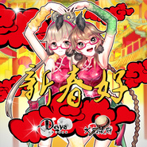<br>新春好 - EP](./albums/2100274794.md) | 国语 | 独立发行 | 2016年02月12日 | EP, 单曲 | 中国民乐 Chinese Folk Music |
| [<br>页角情书 - EP《Travel Days》收录曲](./albums/2100268176.md) | 国语 | 独立发行 | 2016年01月29日 | EP, 单曲 | 流行摇滚 Pop Rock, 国语流行 Mandarin Pop |
| [<br>Christmas Diary(2015 Ver.)圣诞日记（2015版）](./albums/2100250518.md) | 英语 | 独立发行 | 2015年12月24日 | EP, 单曲 | 流行摇滚 Pop Rock |
| [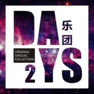<br>Days乐团 原创单曲集 Vol.2Days band Original Singles Collection Vol.2](./albums/2100230970.md) | 国语 | 独立发行 | 2015年11月01日 | 精选集 | 国语流行 Mandarin Pop, 流行摇滚 Pop Rock, 同人音乐 DouJin |
| [<br>桃花笑](./albums/2100229560.md) | 国语 | 独立发行 | 2015年10月29日 | EP, 单曲 | 中国民乐 Chinese Folk Music, 中国风 China-Wave |
| [<br>带你离开 -重制版-Take you away(Remastered Ver.)](./albums/2100204470.md) | 国语 | 独立发行 | 2015年09月21日 | EP, 单曲 | 实验摇滚 Experimental Rock, 独立摇滚 Indie Rock, 另类摇滚 Alternative Rock |
| [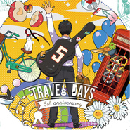<br>Travel Days旅行日](./albums/2100246134.md) | 国语 | 独立发行 | 2015年08月30日 | 录音室专辑 | 流行摇滚 Pop Rock, 同人音乐 DouJin, 国语流行 Mandarin Pop, 古风 GuFeng Music |
| [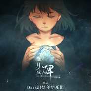<br>岁月成碑《Travel Days》先行曲 EP/《三体》叶文洁同人曲](./albums/2100184246.md) | 国语 | 独立发行 | 2015年08月22日 | EP, 单曲 | 流行摇滚 Pop Rock |
| [<br>高考恋爱一百天 原声音乐集Gaokao.Love.100Days Original Soundtracks](./albums/1036753479.md) | 国语 | 独立发行 | 2015年06月25日 | 原声带, 影视音乐 | 原声 Soundtrack, 游戏配乐 Video Game Music, 独立摇滚 Indie Rock |
| [<br>Days乐团 原创单曲集Days band Original Singles Collection](./albums/1424094383.md) | 国语 | 独立发行 | 2015年02月16日 | 精选集 |  |
| [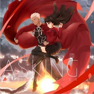<br>Asking feat.泠鸢yousaFate Stay Night 弓凛主题原创同人曲](./albums/1422897687.md) | 英语 | 独立发行 | 2015年01月03日 | EP, 单曲 | 摇滚 Rock & Roll |
| [<br>My Christmas我的圣诞](./albums/24092702.md) | 国语 | 独立发行 | 2014年12月24日 | EP, 单曲 | 摇滚 Rock & Roll |
| [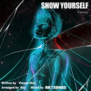<br>SHOW YOURSELF By Vienna Solo Ver.失落机械城II虚浮之都-子弹与利刃呼啸（English Ver.）](./albums/822898207.md) | 英语 | 独立发行 | 2014年08月06日 | EP, 单曲 | 独立摇滚 Indie Rock |
| [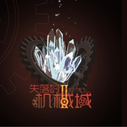<br>失落的机械城Ⅱ：虚浮之都The Lost City of Andriods Ⅱ](./albums/1598789538.md) | 国语 | 独立发行 | 2014年05月01日 | 录音室专辑 |  |
| [<br>憶香](./albums/1281816776.md) | 国语 | 独立发行 | 2013年08月25日 | 录音室专辑 | 轻摇滚 Soft Rock, 流行摇滚 Pop Rock |
| [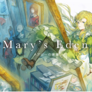<br>Mary's Eden Concept MusicKanaplus同人作品《メアリーの楽園》 概念曲](./albums/2100243248.md) | 日语 | 独立发行 | 2013年08月18日 | EP, 单曲 | 器乐独奏 Solo Instrumental, 轻音乐 Easy Listening |
| [<br>三月雨](./albums/460144264.md) | 国语 | 独立发行 | 2012年12月14日 | 录音室专辑 | 流行摇滚 Pop Rock, 中国风 China-Wave |
| [<br>Summer Days夏日](./albums/530070.md) | 国语 | 独立发行 | 2012年07月21日 | 录音室专辑 | 摇滚 Rock & Roll |
| [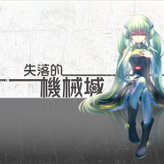<br>失落的机械城边境小镇物语](./albums/499098.md) | 日语 | Days乐团 | 2012年02月18日 | 录音室专辑 | 凯尔特摇滚 Celtic Rock, 迷幻摇滚 Psychedelic Rock |
| [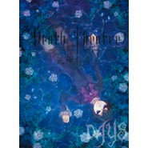<br>Death Theatre·死神剧场-goodnight,my lord死神剧场-晚安,我的主](./albums/533220.md) | 国语 | 独立发行 | 2010年12月04日 | 录音室专辑 |  |

## 评论

|  |  |  |
| :-- | :-- | :-- |
| <br>[虾米用户](https://emumo.xiami.com/u/412977498)<br><br>2019-08-16 05:52<br>赞(1) 踩(0) | <div>你的歌曲我很喜欢。我很喜欢听，我收藏了。还有，谢谢你的关注我，作品的歌曲很好听。我很喜欢。我都收藏了。</div> |
| <br>[虾米用户](https://emumo.xiami.com/u/422926330)<br>但见樱花落<br>2019-04-06 22:23<br>赞(1) 踩(0) | <div>我其实是玩高考恋爱一百天，听到的背景音乐«沉默的夜晚»而找到的 很好听</div> |
| <br>[虾米用户](https://emumo.xiami.com/u/48379032)<br>最后警告，谢绝野蛮人，，...<br>2018-08-25 10:12<br>赞(1) 踩(0) | <div>好</div> |
| <br>[虾米用户](https://emumo.xiami.com/u/58401310)<br><br>2017-11-15 23:41<br>赞(1) 踩(0) | <div>支持支持</div> |
| <br>[虾米用户](https://emumo.xiami.com/u/155731924)<br>0430wekownot...<br>2017-08-11 10:26<br>赞(0) 踩(0) | <div>感觉对了，就是喜欢啊</div> |
| <br>[虾米用户](https://emumo.xiami.com/u/53541975)<br><br>2017-03-31 19:38<br>赞(1) 踩(0) | <div>祝days越来越好！</div> |
| <br>[虾米用户](https://emumo.xiami.com/u/10539153)<br>暂无签名~<br>2016-05-31 21:51<br>赞(1) 踩(0) | <div>虾米有没有什么一键专辑付费的功能啊，想支持可一首一首买太慢了w</div> |
| ⇒ | <br>[虾米用户](https://emumo.xiami.com/u/6975678)<br>生命如此短暂我比烟花灿烂<br>2016-07-04 02:23<br>赞(0) 踩(0) | <div>现在购买操作貌似都是手机完成，你试试在专辑页面进行操作？或者你去TB店买专辑电子版也可以，省钱</div> |
| <br>[虾米用户](https://emumo.xiami.com/u/6601765)<br>我还没想好要写什么...<br>2016-03-03 05:36<br>赞(0) 踩(0) | <div></div> |
| <br>[虾米用户](https://emumo.xiami.com/u/58343064)<br><br>2016-03-01 11:35<br>赞(0) 踩(0) | <div>^_^ </div> |
| <br>[虾米用户](https://emumo.xiami.com/u/68926276)<br><br>2016-03-01 10:11<br>赞(3) 踩(0) | <div>关注days这么久我竟然不知道有专辑。。我是个不合格的粉丝 </div> |
| ⇒ | <br>[虾米用户](https://emumo.xiami.com/u/34419476)<br><br>2016-03-01 12:13<br>赞(0) 踩(0) | <div>打屁股！【虎摸</div> |
| ⇒ | <br>[虾米用户](https://emumo.xiami.com/u/68926276)<br><br>2016-03-01 12:25<br>赞(0) 踩(0) | <div><q><b>Days乐团说：</b></q></div> |
| <br>[虾米用户](https://emumo.xiami.com/u/43466037)<br>凛的冒险。釜山行（尾）。...<br>2016-02-22 23:27<br>赞(14) 踩(0) | <div>days乐团无论作曲和作词都独具匠心，极具震撼力</div> |
| <br>[虾米用户](https://emumo.xiami.com/u/43466037)<br>凛的冒险。釜山行（尾）。...<br>2016-02-22 23:25<br>赞(1) 踩(0) | <div>希望乐团多调阿绫，因为阿绫才刚出来，比起天依更喜欢阿绫</div> |
| <br>[虾米用户](https://emumo.xiami.com/u/43466037)<br>凛的冒险。釜山行（尾）。...<br>2016-02-22 23:18<br>赞(1) 踩(0) | <div>我不求乐团火，我只是希望有更多具有音乐赏识的人，去欣赏音乐。</div> |
| <br>[虾米用户](https://emumo.xiami.com/u/43466037)<br>凛的冒险。釜山行（尾）。...<br>2016-02-22 23:13<br>赞(0) 踩(0) | <div>与v家结合并且能受到许多同人音乐歌姬的亲睐，pv也是数不胜数，这是我见过最有诚意的音乐集团，我会一直关注的 。</div> |
| <br>[虾米用户](https://emumo.xiami.com/u/30125411)<br>红魔馆妹抖小舞<br>2016-02-09 17:58<br>赞(0) 踩(0) | <div>新年快乐~\(≧▽≦)/~</div> |
| <br>[虾米用户](https://emumo.xiami.com/u/47395989)<br><br>2016-02-05 17:19<br>赞(1) 踩(0) | <div>喜欢wing翼</div> |
| <br>[虾米用户](https://emumo.xiami.com/u/105979702)<br><br>2016-02-01 16:28<br>赞(0) 踩(0) | <div>高考恋爱一百天的原声做的不要太好(✪▽✪)</div> |
| <br>[虾米用户](https://emumo.xiami.com/u/14860927)<br>回忆再完美都有极限<br>2016-01-02 04:21<br>赞(0) 踩(0) | <div>越来越棒了</div> |
| <br>[虾米用户](https://emumo.xiami.com/u/44692016)<br>已死<br>2015-12-03 17:30<br>赞(0) 踩(0) | <div>国产的希望</div> |
| <br>[虾米用户](https://emumo.xiami.com/u/38498256)<br>这家伙很聪明什么也没留下...<br>2015-11-16 20:50<br>赞(4) 踩(0) | <div>我也来留个言（路过路过）</div> |
| ⇒ | <br>[虾米用户](https://emumo.xiami.com/u/34419476)<br><br>2015-11-18 18:21<br>赞(0) 踩(0) | <div>欢迎来耍哈~新曲子加油</div> |
| <br>[虾米用户](https://emumo.xiami.com/u/12425675)<br><br>2015-10-29 19:45<br>赞(0) 踩(0) | <div>厉害厉害 </div> |
| <br>[虾米用户](https://emumo.xiami.com/u/2900399)<br>云雀叫了一整天<br>2015-10-23 22:22<br>赞(0) 踩(0) | <div><a href="http://www.bilibili.com/video/av3104645/" target="_blank" rel="nofollow noreferrer noopener">http://www.bilibili.com/video/av3104645/</a>   请问七分钟开始的坷垃笑原曲是啥？</div> |
| ⇒ | <br>[虾米用户](https://emumo.xiami.com/u/34419476)<br><br>2015-10-29 15:49<br>赞(0) 踩(0) | <div>是乐师西门振为“双面乐府”系列创作的一首单曲《桃花笑》，近期会上线</div> |
| ⇒ | <br>[虾米用户](https://emumo.xiami.com/u/2900399)<br>云雀叫了一整天<br>2015-10-31 14:29<br>赞(0) 踩(0) | <div><q><b>Days乐团说：</b></q></div> |
| <br>[虾米用户](https://emumo.xiami.com/u/44968015)<br> <br>2015-09-07 21:47<br>赞(12) 踩(0) | <div>叶文洁同人那首好棒</div> |
| ⇒ | <br>[虾米用户](https://emumo.xiami.com/u/50335919)<br> <br>2015-11-29 11:57<br>赞(0) 踩(0) | <div>岁月成碑？</div> |
| ⇒ | <br>[虾米用户](https://emumo.xiami.com/u/34419476)<br><br>2016-01-30 09:27<br>赞(0) 踩(0) | <div><q><b>千本克拉说：</b></q></div> |
| <br>[虾米用户](https://emumo.xiami.com/u/40279180)<br>Wenevernever...<br>2015-08-29 19:13<br>赞(0) 踩(0) | <div>告白不才女神</div> |
| <br>[虾米用户](https://emumo.xiami.com/u/10257940)<br><br>2015-08-21 18:50<br>赞(0) 踩(0) | <div>我觉得是越做越好了。从三月雨关注到现在。</div> |
| <br>[虾米用户](https://emumo.xiami.com/u/10257940)<br><br>2015-08-21 18:50<br>赞(0) 踩(0) | <div>我觉得是越做越好了。从三月雨关注到现在。</div> |
| <br>[虾米用户](https://emumo.xiami.com/u/54728493)<br><br>2015-08-07 21:09<br>赞(0) 踩(0) | <div>这边有在维护啊，感觉网易云那边已经被抛弃了QAQ</div> |
| ⇒ | <br>[虾米用户](https://emumo.xiami.com/u/6975678)<br>生命如此短暂我比烟花灿烂<br>2015-08-13 10:58<br>赞(0) 踩(0) | <div>应该是两边的机制不一样吧，给网易那边提供了更新信息的</div> |
| <br>[虾米用户](https://emumo.xiami.com/u/5447769)<br>喜欢古典、轻音乐、OST...<br>2015-07-29 20:02<br>赞(0) 踩(0) | <div>很不错!</div> |
| <br>[虾米用户](https://emumo.xiami.com/u/14860927)<br>回忆再完美都有极限<br>2015-07-18 16:40<br>赞(1) 踩(0) | <div>嘛，你们不打算用阿绫调下三月雨吗</div> |
| ⇒ | <br>[虾米用户](https://emumo.xiami.com/u/6975678)<br>生命如此短暂我比烟花灿烂<br>2015-07-22 22:41<br>赞(0) 踩(0) | <div>我们在做特别版，重新编曲的那种。</div> |
| ⇒ | <br>[虾米用户](https://emumo.xiami.com/u/14860927)<br>回忆再完美都有极限<br>2015-07-24 18:56<br>赞(0) 踩(0) | <div><q><b>Rain.Penber说：</b></q></div> |
| <br>[虾米用户](https://emumo.xiami.com/u/46351231)<br>OK<br>2015-07-11 00:36<br>赞(0) 踩(0) | <div>居然还有pv！好感动</div> |
| <br>[虾米用户](https://emumo.xiami.com/u/7187271)<br>Invoke(this)...<br>2015-06-27 20:51<br>赞(1) 踩(0) | <div>逛B站还发现了Days乐团做的很多后摇向的DEMO曲啊【</div> |
| ⇒ | <br>[虾米用户](https://emumo.xiami.com/u/7187271)<br>Invoke(this)...<br>2015-06-27 23:53<br>赞(0) 踩(0) | <div><q><b>说：</b></q></div> |
| ⇒ | <br>[虾米用户](https://emumo.xiami.com/u/7187271)<br>Invoke(this)...<br>2015-06-28 00:03<br>赞(0) 踩(0) | <div><q><b>说：</b></q></div> |
| <br>[虾米用户](https://emumo.xiami.com/u/18244944)<br>親友だな<br>2015-06-11 13:57<br>赞(0) 踩(0) | <div>很强大</div> |
| <br>[虾米用户](https://emumo.xiami.com/u/10257940)<br><br>2015-05-09 02:43<br>赞(0) 踩(0) | <div>mv和音乐配合的简直。太好了！不得不赞一个。遗憾就是没有高清版。希望以后多多出些。</div> |
| ⇒ | <br>[虾米用户](https://emumo.xiami.com/u/6975678)<br>生命如此短暂我比烟花灿烂<br>2015-05-09 13:12<br>赞(0) 踩(0) | <div>高清是虾米的问题，我们弄的文件都是高清的</div> |
| ⇒ | <br>[虾米用户](https://emumo.xiami.com/u/6975678)<br>生命如此短暂我比烟花灿烂<br>2015-06-27 22:52<br>赞(0) 踩(0) | <div>有啦~23个PV已经全部搬运完毕~</div> |
| <br>[虾米用户](https://emumo.xiami.com/u/47703730)<br>暂无签名~<br>2015-03-14 10:47<br>赞(1) 踩(0) | <div>都听哭了</div> |
| <br>[虾米用户](https://emumo.xiami.com/u/41558957)<br>acg古风轻音乐v家曲爱...<br>2015-02-11 12:39<br>赞(0) 踩(0) | <div>哇哇很厉害的编曲团队</div> |
| ⇒ | <br>[虾米用户](https://emumo.xiami.com/u/34419476)<br><br>2015-02-14 17:41<br>赞(0) 踩(0) | <div>作编奏都可以的 = = +</div> |
| <br>[虾米用户](https://emumo.xiami.com/u/41312593)<br><br>2015-01-31 23:56<br>赞(0) 踩(0) | <div>1</div> |
| <br>[虾米用户](https://emumo.xiami.com/u/7668790)<br> <br>2015-01-17 17:14<br>赞(0) 踩(0) | <div>在被窝听到了你们的歌，于是过来找你们！美哭</div> |
| ⇒ | <br>[虾米用户](https://emumo.xiami.com/u/34419476)<br><br>2017-10-30 10:11<br>赞(0) 踩(0) | <div>如果希望快速了解我们的话可以听这张精选集：<a href="http://www.xiami.com/song/showcollect/id/30711507" target="_blank" rel="nofollow noreferrer noopener">http://www.xiami.com/song/showcollect/id/30711507</a><br>百度百科：<a href="http://baike.baidu.com/view/5923693.htm" target="_blank" rel="nofollow noreferrer noopener">http://baike.baidu.com/view/5923693.htm</a><br>B站作品集合：<a href="http://www.bilibili.com/sp/DAYS%E4%B9%90%E5%9B%A2" target="_blank" rel="nofollow noreferrer noopener">http://www.bilibili.com/sp/DAYS%E4%B9%90%E5%9B%A2</a><br>以及：<a href="http://space.bilibili.com/15312" target="_blank" rel="nofollow noreferrer noopener">http://space.bilibili.com/15312</a></div> |
| <br>[虾米用户](https://emumo.xiami.com/u/30125411)<br>红魔馆妹抖小舞<br>2014-12-27 10:07<br>赞(0) 踩(0) | <div>~\(≧▽≦)/~三月雨众筹加油</div> |
| <br>[虾米用户](https://emumo.xiami.com/u/2868841)<br>听说虾米要凉？！！<br>2014-12-25 23:09<br>赞(0) 踩(0) | <div>三月雨！已支持！话说为什么不弄淘宝，搞得烦死</div> |
| ⇒ | <br>[虾米用户](https://emumo.xiami.com/u/34419476)<br><br>2015-01-14 12:58<br>赞(0) 踩(0) | <div>看看我们的微博已经放出淘宝了<br><a href="http://item.taobao.com/item.htm?spm=a1z10.3-c.w4002-666933334.15.zASwAL&amp;amp;id=43251110671" target="_blank" rel="nofollow noreferrer noopener">http://item.taobao.com/item.htm?spm=a1z10.3-c.w4002-666933334.15.zASwAL&amp;amp;id=43251110671</a></div> |
| <br>[虾米用户](https://emumo.xiami.com/u/12166822)<br>微博，公众号同名。主要听...<br>2014-11-21 23:34<br>赞(0) 踩(0) | <div>为什么不入驻虾米音乐人呢</div> |
| ⇒ | <br>[虾米用户](https://emumo.xiami.com/u/34419476)<br><br>2014-11-28 21:00<br>赞(0) 踩(0) | <div>。。。。我们不已经入驻了么</div> |
| ⇒ | <br>[虾米用户](https://emumo.xiami.com/u/12166822)<br>微博，公众号同名。主要听...<br>2014-11-29 12:23<br>赞(0) 踩(0) | <div><q><b>Days乐团说：</b></q></div> |
| ⇒ | <br>[虾米用户](https://emumo.xiami.com/u/34419476)<br><br>2014-12-03 20:53<br>赞(0) 踩(0) | <div><q><b>沉默的冬青说：</b></q></div> |
| <br>[虾米用户](https://emumo.xiami.com/u/6081973)<br>我还没想好要写什么...<br>2014-11-03 11:53<br>赞(0) 踩(0) | <div>Days的買有正版CD的說。。</div> |
| <br>[虾米用户](https://emumo.xiami.com/u/4400366)<br>再也不见<br>2014-10-16 19:30<br>赞(0) 踩(0) | <div>。</div> |
| <br>[虾米用户](https://emumo.xiami.com/u/10168417)<br><br>2014-07-27 19:54<br>赞(0) 踩(0) | <div>galgame《高考恋爱一百天》也是你们负责的嘛？听起来非常不错～</div> |
| ⇒ | <br>[虾米用户](https://emumo.xiami.com/u/34419476)<br><br>2014-08-11 20:07<br>赞(0) 踩(0) | <div>主题曲《未来的志愿书》是乐师wing翼的曲子~</div> |
| ⇒ | <br>[虾米用户](https://emumo.xiami.com/u/10168417)<br><br>2014-08-11 20:10<br>赞(0) 踩(0) | <div><q><b>Days乐团说：</b></q></div> |
| <br>[虾米用户](https://emumo.xiami.com/u/35633205)<br>雪花飘落之冬，与之邂逅<br>2014-07-26 09:18<br>赞(0) 踩(0) | <div>额，感觉中国的古风不是东方古风所能匹敌的，但综合比较还是喜欢东方的古风啊</div> |
| ⇒ | <br>[虾米用户](https://emumo.xiami.com/u/34419476)<br><br>2014-07-26 21:03<br>赞(0) 踩(0) | <div>古风并不是我们的强项哟，古风界的前辈们已经很厉害了。<br>口味大家各有取舍吧~</div> |
| ⇒ | <br>[虾米用户](https://emumo.xiami.com/u/7187271)<br>Invoke(this)...<br>2014-08-11 21:57<br>赞(0) 踩(0) | <div>这话……怎么听起来怪怪的？【可能我语死早T_T</div> |
| <br>[虾米用户](https://emumo.xiami.com/u/10257940)<br><br>2014-07-21 14:32<br>赞(1) 踩(0) | <div>其实人声才是最美得。人声演绎的电脑软件永远无法模仿。呵呵！不要在乎我的观点，也许没有v家就没有你们呢。加油！我是很欣赏你们乐团的！加油</div> |
| ⇒ | <br>[虾米用户](https://emumo.xiami.com/u/34419476)<br><br>2014-07-23 22:20<br>赞(0) 踩(0) | <div>我们准备暂时放弃V家CHINA了，谢谢你的支持！</div> |
| ⇒ | <br>[虾米用户](https://emumo.xiami.com/u/10257940)<br><br>2014-08-26 17:26<br>赞(0) 踩(0) | <div><q><b>Days乐团说：</b></q></div> |
| <br>[虾米用户](https://emumo.xiami.com/u/10257940)<br><br>2014-07-21 14:27<br>赞(1) 踩(0) | <div>知道日本的歌曲软件，yousa能完全驾驭你们写的歌。说实在，听日语的初音的也就是新鲜感。以前也超级喜欢，后来听过有歌手翻唱的，或者有些原版的，感觉很好听，不过初音重新编曲的还是有点特色，我觉得一首歌可以两种都有，各人喜好不一样，你们的歌都很有感觉，不过呢，我比较喜欢yousa.声音。我听音乐蛮挑的，每首歌做词作曲都好！听你们的歌，有画面感。不过v家的那种声音听太多，感觉脑袋遭不住。。不怎么柔和的感觉。。</div> |
| <br>[虾米用户](https://emumo.xiami.com/u/10257940)<br><br>2014-07-14 17:19<br>赞(0) 踩(0) | <div>很好听，不过喜欢yousa唱的。电脑合成声音。。。各有各的喜欢吧！</div> |
| ⇒ | <br>[虾米用户](https://emumo.xiami.com/u/6975678)<br>生命如此短暂我比烟花灿烂<br>2014-07-20 00:26<br>赞(0) 踩(0) | <div>我们准备回归原声，放弃VC了。等等......话说你连VOCALOID是啥都不知道哈？？</div> |
| ⇒ | <br>[虾米用户](https://emumo.xiami.com/u/6975678)<br>生命如此短暂我比烟花灿烂<br>2014-07-20 00:26<br>赞(0) 踩(0) | <div>总之，谢谢支持啦</div> |
| <br>[虾米用户](https://emumo.xiami.com/u/6053457)<br>幸福的一番<br>2014-07-03 16:43<br>赞(1) 踩(0) | <div>晚上花些时间听听，好像不错</div> |
| ⇒ | <br>[虾米用户](https://emumo.xiami.com/u/34419476)<br><br>2014-07-04 11:24<br>赞(0) 踩(0) | <div>如果希望快速了解我们的话可以听这张精选集：<a href="http://www.xiami.com/song/showcollect/id/30711507" target="_blank" rel="nofollow noreferrer noopener">http://www.xiami.com/song/showcollect/id/30711507</a><br>百度百科：<a href="http://baike.baidu.com/view/5923693.htm" target="_blank" rel="nofollow noreferrer noopener">http://baike.baidu.com/view/5923693.htm</a><br>B站作品集合：<a href="http://www.bilibili.com/sp/DAYS%E4%B9%90%E5%9B%A2" target="_blank" rel="nofollow noreferrer noopener">http://www.bilibili.com/sp/DAYS%E4%B9%90%E5%9B%A2</a><br>以及：<a href="http://space.bilibili.com/15312" target="_blank" rel="nofollow noreferrer noopener">http://space.bilibili.com/15312</a></div> |
| ⇒ | <br>[虾米用户](https://emumo.xiami.com/u/34419476)<br><br>2014-07-04 16:50<br>赞(0) 踩(0) | <div>另外附新专辑《失落的机械城2》宣传PV:<a href="http://t.cn/8smktVL" target="_blank" rel="nofollow noreferrer noopener">http://t.cn/8smktVL</a></div> |
| <br>[虾米用户](https://emumo.xiami.com/u/28951920)<br>暂无签名~<br>2014-06-28 22:45<br>赞(1) 踩(0) | <div>恭喜进驻多米！days大赞！</div> |
| ⇒ | <br>[虾米用户](https://emumo.xiami.com/u/28951920)<br>暂无签名~<br>2014-06-29 07:10<br>赞(0) 踩(0) | <div>妈蛋太激动打成多米...</div> |
| <br>[虾米用户](https://emumo.xiami.com/u/11227845)<br>放弃幻想，开始战斗。<br>2014-06-19 00:22<br>赞(1) 踩(0) | <div>呵呵，老夫还买了忆香的cd。不过权当做收藏，听歌还是要上网。</div> |
| <br>[虾米用户](https://emumo.xiami.com/u/6081166)<br>路过人，过路人～<br>2014-05-28 11:10<br>赞(0) 踩(0) | <div>不好意思想问个问题，有在国内买到版权么？如果有的话应该在普通音乐店里也能买得到吧～？（激动）但是听说很难搞到，所以顺便问一下在哪里能有的买～^_^（跳舞）</div> |
| ⇒ | <br>[虾米用户](https://emumo.xiami.com/u/34419476)<br><br>2014-05-28 11:42<br>赞(0) 踩(0) | <div>你好，谢谢你的支持，新专辑《失落的机械城2》已经开始贩售，可以看看PV（<a href="http://bilibili.kankanews.com/video/av1093124" target="_blank" rel="nofollow noreferrer noopener">http://bilibili.kankanews.com/video/av1093124</a>），购买地址是：<a href="http://www.dwz.cn/sldjxc2" target="_blank" rel="nofollow noreferrer noopener">http://www.dwz.cn/sldjxc2</a> （淘宝店名：Days乐团），链接在艺人主页推荐板块也可以找到。场贩信息可以关注我们的微博：weibo.com/daysdays</div> |
| <br>[虾米用户](https://emumo.xiami.com/u/6081166)<br>路过人，过路人～<br>2014-05-28 11:05<br>赞(0) 踩(0) | <div>很好听～能听到国人做出这么好的音乐，对未来有信心了～（我也要加油～！！！）谢谢你给我的勇气～</div> |
| <br>[虾米用户](https://emumo.xiami.com/u/16745497)<br>我还没想好要写什么...<br>2014-05-12 07:35<br>赞(0) 踩(0) | <div>仅支持原创|~</div> |
| <br>[虾米用户](https://emumo.xiami.com/u/3941451)<br>能屈能伸可软可萌只攻不受<br>2014-04-30 14:10<br>赞(0) 踩(0) | <div>声音好荡漾``````````简直不能忍</div> |
| ⇒ | <br>[虾米用户](https://emumo.xiami.com/u/6975678)<br>生命如此短暂我比烟花灿烂<br>2014-05-17 08:57<br>赞(0) 踩(0) | <div>是不是觉得泠鸢的声音糖分好高~~ = =+</div> |
| ⇒ | <br>[虾米用户](https://emumo.xiami.com/u/3941451)<br>能屈能伸可软可萌只攻不受<br>2014-05-20 06:39<br>赞(0) 踩(0) | <div><q><b>Rain.Penber说：</b></q></div> |
| <br>[虾米用户](https://emumo.xiami.com/u/22913167)<br>i'm looking ...<br>2014-04-29 10:30<br>赞(0) 踩(0) | <div>其实我只是来听 yousa 的 lost ruins 的, 居然还扯出个乐团什么的... 太shock了</div> |
| ⇒ | <br>[虾米用户](https://emumo.xiami.com/u/22913167)<br>i'm looking ...<br>2014-04-29 17:32<br>赞(0) 踩(0) | <div><q><b>Days乐团说：</b></q></div> |
| ⇒ | <br>[虾米用户](https://emumo.xiami.com/u/34419476)<br><br>2017-10-28 00:35<br>赞(0) 踩(0) | <div>你好，因为yousa和我们乐团保持长期合作关系，这首DEMO也是我们的原创哈，最近小编我在整理资料，要了授权就搬运过来了~~</div> |
| ⇒ | <br>[虾米用户](https://emumo.xiami.com/u/34419476)<br><br>2017-10-28 00:36<br>赞(0) 踩(0) | <div><q><b>卡卡Aの木森林说：</b></q></div> |
| <br>[虾米用户](https://emumo.xiami.com/u/11786384)<br>虾米丶说不出的再见<br>2014-04-24 23:31<br>赞(0) 踩(0) | <div>罪过..</div> |
| <br>[虾米用户](https://emumo.xiami.com/u/7187271)<br>Invoke(this)...<br>2014-04-21 13:10<br>赞(0) 踩(0) | <div>=-=<br>西南交大过来组团报道【喂</div> |
| <br>[虾米用户](https://emumo.xiami.com/u/14243420)<br>在巷口等我好不好<br>2014-04-20 11:07<br>赞(0) 踩(0) | <div>来顶顶~</div> |
| <br>[虾米用户](https://emumo.xiami.com/u/12337323)<br>只是想听一些声音<br>2014-04-17 21:08<br>赞(0) 踩(0) | <div>很不错的说，加油&amp;gt;v&amp;lt; 相信VC的曲子会越来越自然好听的</div> |
| <br>[虾米用户](https://emumo.xiami.com/u/1625387)<br>吃米飯的老虎<br>2014-04-16 16:45<br>赞(0) 踩(0) | <div>哎哟，Days也来了啊~~<br>除了《Summer Days》，原创专辑全部入手的路过~~ 算不算铁杆啊…… 笑~~ 话说，还有专辑没有搬过来吧？<br>嗯，其中，最喜欢的是《失落的機械城》，个人认为是国内最好的同人专辑之一，百听不厌！构思、质量和排序简直不摆了！这次说要出第二辑的，结果貌似跳票了？？？<br>Days的创作速度不错，在国内很难得，有的出一、两张就没戏了，很可惜；加之音乐在国内也算是比较重口的了，而且很多元化，所以很喜欢。（不喜欢清淡的音乐，果然跟川菜有关么 -0- 味厚、味浓、味重+复合味型）</div> |
| ⇒ | <br>[虾米用户](https://emumo.xiami.com/u/34419476)<br><br>2014-04-16 16:51<br>赞(0) 踩(0) | <div>啊啊，一口气说了好多呢~~感谢你的支持，专辑我们会选择性的搬来，资源也会逐步向大家开放。新专辑大约20号左右发售，敬请期待！</div> |
| ⇒ | <br>[虾米用户](https://emumo.xiami.com/u/1625387)<br>吃米飯的老虎<br>2014-04-18 14:08<br>赞(0) 踩(0) | <div><q><b>Days乐团说：</b></q></div> |
| ⇒ | <br>[虾米用户](https://emumo.xiami.com/u/1625387)<br>吃米飯的老虎<br>2014-04-18 14:21<br>赞(0) 踩(0) | <div><q><b>Days乐团说：</b></q></div> |
| <br>[虾米用户](https://emumo.xiami.com/u/34419476)<br><br>2014-04-16 13:14<br>赞(89) 踩(0) | <div>大家好，我是Days乐团 驻虾米网代理人Penber，我们在公告区开放了部分资源，其余资源会陆续发出，请大家支持正版，Penber代乐团谢谢敏娜桑了~~</div> |
| ⇒ | <br>[虾米用户](https://emumo.xiami.com/u/24805577)<br><br>2016-02-06 09:48<br>赞(0) 踩(0) | <div>求问Days的bandcamp小站地址~</div> |
| ⇒ | <br>[虾米用户](https://emumo.xiami.com/u/34419476)<br><br>2016-02-13 21:32<br>赞(0) 踩(0) | <div><q><b>雨点说：</b></q></div> |
| ⇒ | <br>[虾米用户](https://emumo.xiami.com/u/58343064)<br><br>2016-03-01 11:35<br>赞(0) 踩(0) | <div>^_^</div> |
| <br>[虾米用户](https://emumo.xiami.com/u/2801768)<br><br>2014-04-15 22:42<br>赞(0) 踩(0) | <div>欢迎光临～请问你是小虾米忽悠过来的么</div> |
| <br>[虾米用户](https://emumo.xiami.com/u/2502181)<br>爱动漫,爱东方<br>2014-04-15 18:46<br>赞(0) 踩(0) | <div>发现入驻了~来看看<br>=w=</div> |
| <br>[虾米用户](https://emumo.xiami.com/u/34419476)<br><br>2014-04-15 16:07<br>赞(0) 踩(0) | <div>我刚入驻了虾米音乐人，欢迎大家来我的个人主页，收听我的最新音乐</div> |
| <br>[虾米用户](https://emumo.xiami.com/u/5511496)<br>◜◡◝<br>2014-01-30 15:47<br>赞(0) 踩(0) | <div>w</div> |
| <br>[虾米用户](https://emumo.xiami.com/u/9913735)<br>乐动一生<br>2014-01-29 16:44<br>赞(0) 踩(0) | <div>我找到了，也许是我想要的</div> |
| <br>[虾米用户](https://emumo.xiami.com/u/32035614)<br><br>2014-01-22 21:40<br>赞(0) 踩(0) | <div>= =</div> |
| <br>[虾米用户](https://emumo.xiami.com/u/8751214)<br><br>2013-12-28 12:36<br>赞(0) 踩(0) | <div>不错</div> |
| <br>[虾米用户](https://emumo.xiami.com/u/3862964)<br>有一天，我死了…<br>2013-10-10 23:05<br>赞(0) 踩(0) | <div>求几许盼歌词~</div> |
| <br>[虾米用户](https://emumo.xiami.com/u/3862964)<br>有一天，我死了…<br>2013-08-30 22:51<br>赞(0) 踩(0) | <div>想买忆香那张专辑来着,但是好贵啊~</div> |
| <br>[虾米用户](https://emumo.xiami.com/u/7711592)<br>幻想乡常驻居民<br>2013-08-17 00:34<br>赞(0) 踩(0) | <div>来晚/▽\在没出天依的时候发誓这辈子不碰中文歌现在麻麻再也不用担心X3</div> |
| <br>[虾米用户](https://emumo.xiami.com/u/1700002)<br>V5_ORZZZZZ<br>2013-07-10 10:25<br>赞(0) 踩(0) | <div>路过听听</div> |
| <br>[虾米用户](https://emumo.xiami.com/u/6975678)<br>生命如此短暂我比烟花灿烂<br>2013-03-16 21:41<br>赞(0) 踩(0) | <div>请原谅我那么晚才收集，，迟来的喜爱</div> |
| <br>[虾米用户](https://emumo.xiami.com/u/13508276)<br><br>2013-03-13 20:04<br>赞(0) 踩(0) | <div>艾揉玛太喜欢TUT</div> |
| <br>[虾米用户](https://emumo.xiami.com/u/11137096)<br>人生数载，每一刻都要活到<br>2013-03-09 23:05<br>赞(0) 踩(0) | <div>竟然有，过来果断地支持！</div> |
| <br>[虾米用户](https://emumo.xiami.com/u/4731922)<br>我思，故我在<br>2013-02-22 00:25<br>赞(0) 踩(0) | <div>很有才</div> |
| <br>[虾米用户](https://emumo.xiami.com/u/10551352)<br>想要个2次元老婆<br>2012-09-09 10:30<br>赞(0) 踩(0) | <div>终于找到了，支持</div> |
| <br>[虾米用户](https://emumo.xiami.com/u/6129009)<br>安于日常的OTAKU<br>2012-08-03 11:03<br>赞(0) 踩(0) | <div>支持。</div> |
| <br>[虾米用户](https://emumo.xiami.com/u/203227)<br>在隔壁云村活动，这里只剩...<br>2012-07-24 14:44<br>赞(0) 踩(0) | <div>失落的机械城也是这社团的吧</div> |
| ⇒ | <br>[虾米用户](https://emumo.xiami.com/u/7491178)<br><br>2012-07-24 14:50<br>赞(0) 踩(0) | <div>是啊....但是失落的机械城发布在虾米上的时候还没有加这个艺人...我已经报错了...小编压力大..【我又看见你了...】</div> |
| ⇒ | <br>[虾米用户](https://emumo.xiami.com/u/203227)<br>在隔壁云村活动，这里只剩...<br>2012-07-24 14:50<br>赞(0) 踩(0) | <div><q><b>雪....说：</b></q></div> |
| ⇒ | <br>[虾米用户](https://emumo.xiami.com/u/7491178)<br><br>2012-07-24 14:51<br>赞(0) 踩(0) | <div><q><b>菜籽酱说：</b></q></div> |
| ⇒ | <br>[虾米用户](https://emumo.xiami.com/u/203227)<br>在隔壁云村活动，这里只剩...<br>2012-07-24 14:53<br>赞(0) 踩(0) | <div><q><b>雪....说：</b></q></div> |
| ⇒ | <br>[虾米用户](https://emumo.xiami.com/u/7491178)<br><br>2012-07-24 14:56<br>赞(0) 踩(0) | <div><q><b>菜籽酱说：</b></q></div> |
| ⇒ | <br>[虾米用户](https://emumo.xiami.com/u/203227)<br>在隔壁云村活动，这里只剩...<br>2012-07-24 14:57<br>赞(0) 踩(0) | <div><q><b>雪....说：</b></q></div> |
| ⇒ | <br>[虾米用户](https://emumo.xiami.com/u/7491178)<br><br>2012-07-24 15:02<br>赞(0) 踩(0) | <div><q><b>菜籽酱说：</b></q></div> |
| ⇒ | <br>[虾米用户](https://emumo.xiami.com/u/203227)<br>在隔壁云村活动，这里只剩...<br>2012-07-24 15:05<br>赞(0) 踩(0) | <div><q><b>雪....说：</b></q></div> |
| ⇒ | <br>[虾米用户](https://emumo.xiami.com/u/7491178)<br><br>2012-07-24 15:06<br>赞(0) 踩(0) | <div><q><b>菜籽酱说：</b></q></div> |
