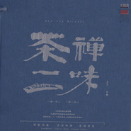

茶禅一味作曲   覃晔     古筝   苏畅     笛箫   王华
============================

|  |  |
| :--: | :-- |
| [ 茶禅一味作曲   覃晔     古筝   苏畅     笛箫   王华](https://emumo.xiami.com/album/1604637540) | **艺人**: [覃晔](../index.md) **语种**: 国语 **唱片公司**: 火烈鸟唱片 **发行时间**: 2014年06月20日 **专辑类别**: 录音室专辑 **专辑风格**: 民族融合新世纪 Ethnic Fusion New Age, 古风 GuFeng Music **播放数**: 10782581 **收藏数**: 7043 **评论数**: 258  |

## 简介

茶与禅，中华传统文化中最富文人色彩的两个标志性符号！希望它们所代表的休闲、空灵与超脱能给繁忙劳碌的都市人带来一次久违的放松！

## 曲目

## 评论

|  |  |  |  |
| :-- | :-- | :-- | :-- |
|  [虾米用户](https://emumo.xiami.com/u/426892144)  2020-11-25 08:35 赞(0) 踩(0) | 
没有办法表达，在我内心真的有股暖流。
 |
|  [虾米用户](https://emumo.xiami.com/u/49334418) ～ 2020-10-23 11:12 赞(1) 踩(0) | 
～
 |
|  [虾米用户](https://emumo.xiami.com/u/335002792) 天地无限 2020-09-10 09:05 赞(0) 踩(0) | 
非常点赞的一张专辑！！！旋律优美，大气又有深度！！！中国音乐的骄傲，年轻有为！！！   
 |
|  [虾米用户](https://emumo.xiami.com/u/47043861)  2020-08-22 20:26 赞(1) 踩(0) | 
此类古典乐器与电子乐相结合的配器作曲手法，可以为更多的国人普及中国感觉的乐器，甚好！
 |
|  [虾米用户](https://emumo.xiami.com/u/37690033)  2020-08-06 16:14 赞(0) 踩(0) | 
空灵、干净、飘渺！爱了爱了！
 |
|  [虾米用户](https://emumo.xiami.com/u/351518682)  2020-07-14 16:29 赞(0) 踩(0) | 
非常好听
 |
|  [虾米用户](https://emumo.xiami.com/u/444095609) 感恩一切 2020-07-13 06:39 赞(0) 踩(0) | 
出尘之音，仙乐。
 |
|  [虾米用户](https://emumo.xiami.com/u/411341763)  2020-07-11 07:17 赞(1) 踩(0) | 
非常爱的曲子，五音润心❤
 |
|  [虾米用户](https://emumo.xiami.com/u/276944698) 不要自我设限..... 2020-06-30 19:56 赞(0) 踩(0) | 

 |
|  [虾米用户](https://emumo.xiami.com/u/377269892)  2020-06-13 06:56 赞(0) 踩(0) | 
touching my heart. LOVE very much!
 |
|  [虾米用户](https://emumo.xiami.com/u/411975151)  2020-05-06 19:09 赞(1) 踩(0) | 
古音新声，心旷神怡！
 |
|  [虾米用户](https://emumo.xiami.com/u/379002920)  2020-04-30 23:05 赞(0) 踩(0) | 
能让心静下来，很喜欢。谢谢！
 |
|  [虾米用户](https://emumo.xiami.com/u/66823378)  2020-04-15 13:11 赞(0) 踩(0) | 

 |
|  [虾米用户](https://emumo.xiami.com/u/411341763)  2020-04-10 12:24 赞(1) 踩(0) | 
谁能告诉我，这里都有什么乐器，古筝，笛，萧，还有么？
 |
|  [虾米用户](https://emumo.xiami.com/u/411341763)  2020-04-10 11:43 赞(1) 踩(0) | 
这一味，正中下怀   
 |
|  [虾米用户](https://emumo.xiami.com/u/40058372) 静则神藏，躁则消亡 2020-03-23 12:51 赞(0) 踩(0) | 
有灵气
 |
|  [虾米用户](https://emumo.xiami.com/u/27906871)  2020-03-22 01:40 赞(0) 踩(0) | 
已入盘安静，有意境，最喜欢莲
 |
|  [虾米用户](https://emumo.xiami.com/u/13212504) 别走的太快，等一等你的灵... 2020-03-20 08:51 赞(1) 踩(0) | 
赞
 |
|  [虾米用户](https://emumo.xiami.com/u/421336987) 音乐如诗，音乐如画，陶醉... 2020-03-10 14:07 赞(4) 踩(0) | 

 |
|  [虾米用户](https://emumo.xiami.com/u/34505162)  2020-03-08 14:36 赞(1) 踩(0) | 
真的好听，作者和演奏家的精神境界很高，是真正意义的中国古文化
 |
|  [虾米用户](https://emumo.xiami.com/u/419979938)  2020-03-04 11:23 赞(2) 踩(0) | 
幽幽仙风古音，飘飘然然竹林中，一袭长发暮然回望，把酒手中长剑，已是两行泪潸然，只叹在今朝
 |
| ⇒ |  [虾米用户](https://emumo.xiami.com/u/403891135) 听一首歌，品一盏茶，思人... 2020-04-28 14:13 赞(0) 踩(0) | 
兄弟，古代已远去，珍惜今朝人
 |
| ⇒ |  [虾米用户](https://emumo.xiami.com/u/419979938)  2020-12-04 00:21 赞(0) 踩(0) | 
<q><b>听音者说：</b></q>
 |
|  [虾米用户](https://emumo.xiami.com/u/256663390)  2020-02-14 20:16 赞(0) 踩(0) | 
非常喜欢，支持
 |
|  [虾米用户](https://emumo.xiami.com/u/2174696) 思想上的女流氓，生活里的... 2020-02-08 19:48 赞(1) 踩(0) | 
彼时少年，明月山川，忘川河岸，雾霭流岚，幸览人间。
 |
|  [虾米用户](https://emumo.xiami.com/u/377130499)  2020-02-06 19:38 赞(1) 踩(0) | 
好听   经典精髓
 |
|  [虾米用户](https://emumo.xiami.com/u/403591939)  2020-01-30 16:32 赞(0) 踩(0) | 
听得舒心，很温柔的曲子
 |
|  [虾米用户](https://emumo.xiami.com/u/403304941)  2020-01-07 13:27 赞(0) 踩(0) | 
意境深远，观之难得一赏！
 |
|  [虾米用户](https://emumo.xiami.com/u/129800848) 只想聆听 2019-12-30 11:07 赞(2) 踩(0) | 
一直在听，一直在品，一直在醉，一直在盼。
 |
|  [虾米用户](https://emumo.xiami.com/u/81170690)  2019-11-23 13:30 赞(1) 踩(0) | 
每一曲都值得一听、细细的品。收藏了很久的，现在听又多些许感悟，满分推荐！！！
 |
| ⇒ |  [虾米用户](https://emumo.xiami.com/u/81170690)  2019-11-23 13:38 赞(0) 踩(0) | 
要按着顺序听呀！
 |
|  [虾米用户](https://emumo.xiami.com/u/401765746)  2019-11-15 00:31 赞(0) 踩(0) | 
喜欢这乐曲
 |
|  [虾米用户](https://emumo.xiami.com/u/363822108) 轻听自然，音乐我心 2019-10-22 01:01 赞(3) 踩(0) | 
禅音唤起，不如归去，归去来兮，胡不归，吾谁与归，空山新雨，远山悠然，静听叆叇，坐观乌啼：覃晔之禅茶一味。
 |
|  [虾米用户](https://emumo.xiami.com/u/363342346)  2019-10-15 05:51 赞(2) 踩(0) | 
伴唱是画蛇添足了……
 |
| ⇒ |  [虾米用户](https://emumo.xiami.com/u/47043861)  2020-08-22 20:24 赞(0) 踩(0) | 
伴唱俗气
 |
|  [虾米用户](https://emumo.xiami.com/u/309576322)  2019-10-14 07:52 赞(0) 踩(0) | 
少有的作品
 |
|  [虾米用户](https://emumo.xiami.com/u/8337431) 以乐会友 2019-10-10 02:31 赞(0) 踩(0) | 
221
 |
|  [虾米用户](https://emumo.xiami.com/u/275815301)  2019-10-07 23:32 赞(2) 踩(0) | 
素净淡雅，适合安静时聆听！
 |
|  [虾米用户](https://emumo.xiami.com/u/282541118)  2019-09-24 16:09 赞(0) 踩(0) | 
欧洲轻音乐听多了，现在回家听听
 |
|  [虾米用户](https://emumo.xiami.com/u/314233892)  2019-09-20 21:29 赞(0) 踩(0) | 

 |
|  [虾米用户](https://emumo.xiami.com/u/421053753)  2019-09-20 12:03 赞(0) 踩(0) | 
没有理由！
 |
|  [虾米用户](https://emumo.xiami.com/u/403912836)  2019-08-23 07:59 赞(2) 踩(0) | 
收藏《醒》之后，今天听听专辑其它几首，索性收藏整张专辑，是我喜欢的风格
 |
|  [虾米用户](https://emumo.xiami.com/u/16178749) 愿各自安好………………  2019-08-19 13:02 赞(3) 踩(0) | 

 |
|  [虾米用户](https://emumo.xiami.com/u/414231670)  2019-07-14 10:34 赞(0) 踩(0) | 
茶曲合一，中国人的梦想天堂
 |
|  [虾米用户](https://emumo.xiami.com/u/409621011)  2019-07-08 18:34 赞(0) 踩(0) | 
喜欢你 没道理
 |
|  [虾米用户](https://emumo.xiami.com/u/266884065)  2019-06-30 11:55 赞(1) 踩(0) | 
非常喜欢，放松心情于山水香茗之中，舒服之极！
 |
|  [虾米用户](https://emumo.xiami.com/u/409853371) Oo... 2019-06-21 07:47 赞(1) 踩(0) | 
不觉得在听什么的舒服
 |
|  [虾米用户](https://emumo.xiami.com/u/196693355) 我还没想好要写什么... 2019-05-30 04:14 赞(1) 踩(0) | 
第一次虾米评分，沉醉于这种风格，希望有更多类似的优秀的作品。
 |
|  [虾米用户](https://emumo.xiami.com/u/319660594) 我还没想好要写什么... 2019-05-26 14:53 赞(0) 踩(0) | 
serenity.
 |
|  [虾米用户](https://emumo.xiami.com/u/21640389) 摩羯座 2019-05-26 08:19 赞(1) 踩(0) | 
宁静致远。意境深远。
 |
|  [虾米用户](https://emumo.xiami.com/u/359648296)  2019-05-22 23:20 赞(1) 踩(0) | 
整个专辑很好听，相见恨晚
 |
|  [虾米用户](https://emumo.xiami.com/u/412385026)  2019-05-13 20:25 赞(2) 踩(0) | 
一壶香茶，一曲古风，余音绕梁，回荡在寂静的夜晚！茶未醉人，曲已醉人！
 |
|  [虾米用户](https://emumo.xiami.com/u/304601434)  2019-05-12 22:29 赞(0) 踩(0) | 
世界是如此的纯净和美好
 |
|  [虾米用户](https://emumo.xiami.com/u/358688746)  2019-05-08 22:05 赞(0) 踩(0) | 
创造属于这个时代的传统
 |
|  [虾米用户](https://emumo.xiami.com/u/301171460) 瑜伽。冥想是有意识的睡觉... 2019-05-03 08:17 赞(3) 踩(0) | 
音乐灵性清扬能达到修心养性的效果
 |
|  [虾米用户](https://emumo.xiami.com/u/15256072)   2019-04-25 22:59 赞(1) 踩(0) | 
就喜欢这样清雅淡淡地味道 ..........
 |
|  [虾米用户](https://emumo.xiami.com/u/292501543)  2019-04-22 10:50 赞(0) 踩(0) | 
随心
 |
|  [虾米用户](https://emumo.xiami.com/u/297129080) 你不曾离去.始终留在心里 2019-04-21 19:26 赞(1) 踩(0) | 
让人安静
 |
|  [虾米用户](https://emumo.xiami.com/u/305449824)  2019-04-19 16:55 赞(1) 踩(0) | 
那麼美好的節奏和編曲，重新愛上中國風純音樂。
 |
|  [虾米用户](https://emumo.xiami.com/u/143417998) 心若有结  万般皆是劫 2019-04-19 16:09 赞(1) 踩(0) | 
很棒的专辑，禅悟人生！
 |
|  [虾米用户](https://emumo.xiami.com/u/414732080)  2019-04-07 06:48 赞(2) 踩(0) | 
优美动听，百听不厌，感谢虾米
 |
|  [虾米用户](https://emumo.xiami.com/u/14425737) 逢时遇景，拾翠寻芳。 2019-03-29 19:45 赞(0) 踩(0) | 
一醒一悟
 |
|  [虾米用户](https://emumo.xiami.com/u/3490392)  2019-03-28 21:19 赞(1) 踩(0) | 
细腻 动听
 |
|  [虾米用户](https://emumo.xiami.com/u/261977209) 心如白云飘自在，意如流水... 2019-03-28 11:49 赞(1) 踩(0) | 
很好的一个专辑
 |
|  [虾米用户](https://emumo.xiami.com/u/219294068)  2019-03-22 22:26 赞(0) 踩(0) | 
“念念不忘，必有回响。我脑子里，出现了很多熟悉的往事和旧知。虽然这些人事已经离我好远好远，不再有任何联系，彼此也没有任何交集的可能。但那种相处的感动，靠近的心动仍然随时被唤醒。一个人独处的几个小时里，那些我生命中真正使我感动，温存，诗意的画面一幅幅游离在脑际。那个人，那张笑脸，那几条夜雨绵绵的道路，像一道道灿烂的伤口，欢笑着，也灰暗着。知己，爱人，像是我人生永远都捉不住的风筝，他们钟意过我，但他们更钟意别人。我无知地消遣真心，我鲁莽地碰碎了爱情。如果换作今夜，我们必定心心相印，你能感觉到我，我能感觉到你。我与美好错过，常常责怪时间的过错，为什么不等我变成如今的我再安排那场相遇呢？”
 |
|  [虾米用户](https://emumo.xiami.com/u/411043260)  2019-03-22 17:45 赞(0) 踩(0) | 
好听
 |
|  [虾米用户](https://emumo.xiami.com/u/186248668)   2019-03-11 13:02 赞(0) 踩(0) | 
平复心情很好
 |
|  [虾米用户](https://emumo.xiami.com/u/327078996) 淡淡的来，好好的去… 2019-03-08 20:03 赞(2) 踩(0) | 
曲子让人远离烦躁，也可去除杂念。
 |
| ⇒ |  [虾米用户](https://emumo.xiami.com/u/9819937)  2019-03-09 10:44 赞(0) 踩(0) | 
感谢支持
 |
|  [虾米用户](https://emumo.xiami.com/u/160060706) 声波～无形的艺术！ 2019-03-06 16:06 赞(0) 踩(0) | 
心烦心累心乱时可以静心
 |
| ⇒ |  [虾米用户](https://emumo.xiami.com/u/9819937)  2019-03-09 10:44 赞(0) 踩(0) | 
希望音乐真的能帮到你 
 |
|  [虾米用户](https://emumo.xiami.com/u/38520490) Le ciel est ... 2019-03-06 12:56 赞(0) 踩(0) | 
悟 这一曲，真的太美。只是，感觉曲子所述更像是“悟过”，而不是“悟觉”呀。清和明柔，万物朝生。
 |
| ⇒ |  [虾米用户](https://emumo.xiami.com/u/9819937)  2019-03-09 10:45 赞(0) 踩(0) | 
感恩支持
 |
|  [虾米用户](https://emumo.xiami.com/u/376400402) 我还没想好要写什么... 2019-03-05 19:31 赞(0) 踩(0) | 
我性格比较孤僻，平时一个人在家，喜欢这种风格的音乐。听着音乐，身心放松，愉悦自己。
 |
| ⇒ |  [虾米用户](https://emumo.xiami.com/u/9819937)  2019-03-09 10:45 赞(0) 踩(0) | 
感谢
 |
|  [虾米用户](https://emumo.xiami.com/u/31925298) 用一杯水的单纯，面对一辈... 2019-02-27 21:56 赞(0) 踩(0) | 
不增不减，不垢不净，平和正觉的体验
 |
|  [虾米用户](https://emumo.xiami.com/u/280912523) 最佳奇異歌曲收聽者 2019-02-23 20:26 赞(2) 踩(0) | 
静心远比财富重要
 |
|  [虾米用户](https://emumo.xiami.com/u/277409554)  2019-02-21 06:32 赞(0) 踩(0) | 
覃晔这类曲风的曲子是曾经陪我走出人生低谷时期的心灵仙
 |
| ⇒ |  [虾米用户](https://emumo.xiami.com/u/9819937)  2019-03-09 10:46 赞(0) 踩(0) | 
很开心，音乐能帮助你 
 |
| ⇒ |  [虾米用户](https://emumo.xiami.com/u/277409554)  2019-03-24 22:24 赞(0) 踩(0) | 
<q><b>覃晔说：</b></q>
 |
|  [虾米用户](https://emumo.xiami.com/u/11284494)  2019-02-19 08:49 赞(0) 踩(0) | 
好听
 |
|  [虾米用户](https://emumo.xiami.com/u/26429731) 音乐是思维着的声音。——... 2019-02-17 00:32 赞(0) 踩(0) | 
静谧宁静祥和
 |
|  [虾米用户](https://emumo.xiami.com/u/127822770) The baddest ... 2019-02-11 19:53 赞(0) 踩(0) | 
非常喜欢
 |
|  [虾米用户](https://emumo.xiami.com/u/59966566)  2019-01-31 15:24 赞(0) 踩(0) | 
很好听，有意境。梦一曲唢呐真的很棒。进而开始搜索了很多相关音乐，听了谭晶的九儿，罗大佑的情丝。还有很多很多以前觉得听不惯的民乐。让我这个一贯只喜欢英文歌的人有了耐心去倾听。谢谢这专辑帮我打开了一扇新世界的大门。
 |
| ⇒ |  [虾米用户](https://emumo.xiami.com/u/9819937)  2019-01-31 23:44 赞(0) 踩(0) | 
感谢你的支持与肯定 
 |
|  [虾米用户](https://emumo.xiami.com/u/356611941)  2018-12-25 09:20 赞(0) 踩(0) | 
很美，听到心坎里去了
 |
|  [虾米用户](https://emumo.xiami.com/u/52259218)  2018-12-17 13:58 赞(0) 踩(0) | 
超级棒！
 |
|  [虾米用户](https://emumo.xiami.com/u/52259218)  2018-12-17 13:55 赞(1) 踩(0) | 
超棒！每一首都是我喜欢！ 
 |
|  [虾米用户](https://emumo.xiami.com/u/5819278) 面朝大海 春暖花开 2018-12-02 16:24 赞(0) 踩(0) | 
音乐很好，录音还有待提高，声音太尖
 |
|  [虾米用户](https://emumo.xiami.com/u/339377309)  2018-11-21 16:48 赞(2) 踩(0) | 
凡尘俗世气难静，听君一曲了烦恼。 
 |
|  [虾米用户](https://emumo.xiami.com/u/305475016)  2018-11-20 01:08 赞(1) 踩(0) | 
我也很想学笛萧哎
 |
|  [虾米用户](https://emumo.xiami.com/u/8832213) 我还没想好要写什么... 2018-10-31 16:28 赞(1) 踩(0) | 
这专辑很合我口味，真的是太屌了。
 |
|  [虾米用户](https://emumo.xiami.com/u/378095879) 君问去路何处有提剑笑饮江... 2018-10-19 15:54 赞(0) 踩(0) | 
听此辑可静心养心，修身养性，悠悠琴鸣，大道直出。
 |
|  [虾米用户](https://emumo.xiami.com/u/343247514) 与花草为邻 与土壤相亲 ... 2018-10-17 10:35 赞(0) 踩(0) | 
14~18年…… 的确是相恨见晚 幸好没有错过你
 |
|  [虾米用户](https://emumo.xiami.com/u/199380324)  2018-10-10 19:32 赞(0) 踩(0) | 
给你的爱一直很安静，谢谢你
 |
|  [虾米用户](https://emumo.xiami.com/u/361287195) 暖暖的幸福(^o^)o甜... 2018-09-22 00:24 赞(0) 踩(0) | 
❤️
 |
|  [虾米用户](https://emumo.xiami.com/u/362403255) 尽墨满纸，一笑若白 2018-07-29 15:50 赞(1) 踩(0) | 
此处无尘埃，何处曾相逢
 |
| ⇒ |  [虾米用户](https://emumo.xiami.com/u/9819937)  2018-10-10 17:59 赞(0) 踩(0) | 
谢谢支持
 |
|  [虾米用户](https://emumo.xiami.com/u/15477519) 爱  是生命的和弦，而不... 2018-07-26 15:21 赞(3) 踩(0) | 
好东西一定要慢慢的 品&amp;hellip;
 |
| ⇒ |  [虾米用户](https://emumo.xiami.com/u/9819937)  2018-10-10 18:01 赞(0) 踩(0) | 
谢谢你
 |
| ⇒ |  [虾米用户](https://emumo.xiami.com/u/15477519) 爱  是生命的和弦，而不... 2018-10-10 18:54 赞(0) 踩(0) | 
<q><b>覃晔说：</b></q>
 |
|  [虾米用户](https://emumo.xiami.com/u/267350163)  2018-07-19 00:55 赞(0) 踩(0) | 
音乐一响起，感觉世界都宁静了！好听好听！
 |
| ⇒ |  [虾米用户](https://emumo.xiami.com/u/9819937)  2018-10-10 18:01 赞(0) 踩(0) | 
谢谢  希望音乐能给你那份宁静
 |
|  [虾米用户](https://emumo.xiami.com/u/334730963) 倾听美好~ 2018-07-14 08:04 赞(0) 踩(0) | 
定为这段时间的背景音乐了 
 |
| ⇒ |  [虾米用户](https://emumo.xiami.com/u/9819937)  2018-10-10 18:02 赞(0) 踩(0) | 
感谢  希望以后的新作品也能成为你背景音乐
 |
|  [虾米用户](https://emumo.xiami.com/u/351748376)  2018-07-06 14:13 赞(0) 踩(0) | 
相当不错的乐曲！加油加油加油！
 |
| ⇒ |  [虾米用户](https://emumo.xiami.com/u/9819937)  2018-10-10 18:02 赞(0) 踩(0) | 
嗯  努力  加油
 |
|  [虾米用户](https://emumo.xiami.com/u/220587)  2018-06-30 15:00 赞(0) 踩(0) | 
边看书边听，完美
 |
| ⇒ |  [虾米用户](https://emumo.xiami.com/u/9819937)  2018-10-10 18:02 赞(0) 踩(0) | 
哈哈   享受   随喜
 |
|  [虾米用户](https://emumo.xiami.com/u/72502) 音乐可以改变人的心情！ 2018-06-25 12:51 赞(0) 踩(0) | 
美妙！！
 |
| ⇒ |  [虾米用户](https://emumo.xiami.com/u/9819937)  2018-10-10 18:02 赞(0) 踩(0) | 
感恩
 |
|  [虾米用户](https://emumo.xiami.com/u/337083607)  2018-06-22 17:55 赞(0) 踩(0) | 
好美的音乐，超凡脱俗的感觉！已经分享到我的朋友圈了。  
 |
| ⇒ |  [虾米用户](https://emumo.xiami.com/u/9819937)  2018-10-10 18:03 赞(0) 踩(0) | 
感谢你的分享   愿你一切都好
 |
|  [虾米用户](https://emumo.xiami.com/u/259447140) 据说音乐可以和灵魂产生共... 2018-06-02 15:24 赞(1) 踩(0) | 
我单曲重复喜欢的音乐
 |
| ⇒ |  [虾米用户](https://emumo.xiami.com/u/9819937)  2018-10-10 18:04 赞(0) 踩(0) | 
感谢你的支持
 |
|  [虾米用户](https://emumo.xiami.com/u/259447140) 据说音乐可以和灵魂产生共... 2018-06-02 15:22 赞(1) 踩(0) | 
我也喜欢，谢谢大师，好美的音乐，尤其水！   
 |
| ⇒ |  [虾米用户](https://emumo.xiami.com/u/9819937)  2018-06-21 11:42 赞(0) 踩(0) | 
感恩
 |
|  [虾米用户](https://emumo.xiami.com/u/252495187) 王君 2018-05-26 18:17 赞(0) 踩(0) | 
非常喜欢，睡眠不好的人正好用
 |
| ⇒ |  [虾米用户](https://emumo.xiami.com/u/9819937)  2018-06-21 11:42 赞(0) 踩(0) | 
希望能帮到你的睡眠
 |
|  [虾米用户](https://emumo.xiami.com/u/302830785)  2018-05-18 10:26 赞(1) 踩(0) | 
******
 |
|  [虾米用户](https://emumo.xiami.com/u/310823086) 积极，生活，运动 2018-04-29 19:02 赞(1) 踩(0) | 
好听到不得了
 |
| ⇒ |  [虾米用户](https://emumo.xiami.com/u/9819937)  2018-06-21 11:42 赞(0) 踩(0) | 
谢谢  随喜
 |
|  [虾米用户](https://emumo.xiami.com/u/284996948)   2018-04-06 21:09 赞(1) 踩(0) | 
音乐。是一把打开初心的钥匙。你的音乐是红尘中通往清静的门。愿不忘初心，方得始终。
 |
| ⇒ |  [虾米用户](https://emumo.xiami.com/u/9819937)  2018-06-21 11:44 赞(0) 踩(0) | 
嗯  继续努力  感谢你的支持
 |
|  [虾米用户](https://emumo.xiami.com/u/341590435)  2018-03-23 17:42 赞(1) 踩(0) | 
非常喜欢，睡眠不好的人正好用来睡前冥想用 
 |
| ⇒ |  [虾米用户](https://emumo.xiami.com/u/9819937)  2018-06-21 11:44 赞(0) 踩(0) | 
多听听  调整好呼吸   感谢支持
 |
|  [虾米用户](https://emumo.xiami.com/u/30800139) 我在低俗与高雅间活的很尴... 2018-02-27 21:20 赞(0) 踩(0) | 
。
 |
|  [虾米用户](https://emumo.xiami.com/u/18371533) 如梦幻泡影 如露亦如电 2018-02-21 12:38 赞(0) 踩(0) | 
大爱
 |
|  [虾米用户](https://emumo.xiami.com/u/9891050) 大同 2018-01-21 16:23 赞(2) 踩(0) | 
自然者，天地也；天地也，父母也。顺其自然者，得养生之道也。
 |
|  [虾米用户](https://emumo.xiami.com/u/9891050) 大同 2018-01-21 16:22 赞(0) 踩(0) | 
基督教有他们的颂歌，佛教有各种咒，想找到体现道家感觉的歌好难啊。这张专辑让我悟&amp;ldquo;道&amp;rdquo;了。
 |
| ⇒ |  [虾米用户](https://emumo.xiami.com/u/9819937)  2018-06-21 11:45 赞(0) 踩(0) | 
希望能帮到你   感谢
 |
|  [虾米用户](https://emumo.xiami.com/u/9891050) 大同 2018-01-21 16:18 赞(2) 踩(0) | 
我能说我学中医就是听这张专辑静心以体悟人体的吗？&amp;ldquo;精神内守，病安从来？&amp;rdquo; 
 |
|  [虾米用户](https://emumo.xiami.com/u/334946725)  2018-01-17 20:44 赞(2) 踩(0) | 
极喜欢这种意境，清净悠远，古筝悠扬！赞！
 |
| ⇒ |  [虾米用户](https://emumo.xiami.com/u/9819937)  2018-06-21 11:47 赞(0) 踩(0) | 
两位演奏家的势力给这张专辑加分不少  感谢你的支持
 |
|  [虾米用户](https://emumo.xiami.com/u/245159953)  2017-12-26 13:19 赞(2) 踩(0) | 
很荣幸能听到这么好的音乐作品！一遍又一遍的循环，就像在洗涤心灵，去除世间留在心灵里的污垢，让人回归本元。期待更多优秀的作品，感谢作者！可以付费吗？
 |
| ⇒ |  [虾米用户](https://emumo.xiami.com/u/9819937)  2018-06-21 11:47 赞(0) 踩(0) | 
非常感谢你的支持，这个都是免费的听的，喜欢可以收藏。我会继续努力！
 |
|  [虾米用户](https://emumo.xiami.com/u/3127219) 寻找听上去像她的音乐。。... 2017-12-07 13:37 赞(0) 踩(0) | 
感觉耳朵和心情都被條洗了一遍 很好听(ง &amp;bull;̀_&amp;bull;́)ง
 |
|  [虾米用户](https://emumo.xiami.com/u/3510038) 海天之恋 2017-12-05 00:41 赞(32) 踩(0) | 
每首都很好听，好棒棒！曲名极简style，却蕴含深意。感谢曲名给予我灵感，将十个字化为两句诗，又添了两句，些许惬意，愿与你分享。梦醒听水远，乐善悟莲归。宇宙终无极，茶禅共一味。
 |
| ⇒ |  [虾米用户](https://emumo.xiami.com/u/9819937)  2017-12-08 18:05 赞(0) 踩(0) | 
妙哉  随喜
 |
|  [虾米用户](https://emumo.xiami.com/u/173670384) 衣不如新，人不如旧 2017-11-23 01:23 赞(0) 踩(0) | 
最喜欢莲，希望可以在多多出这种好作品啊，期待！！
 |
|  [虾米用户](https://emumo.xiami.com/u/51675097)  2017-10-31 07:59 赞(1) 踩(0) | 
听到这些音乐，有一种荡彻内心，洗涤心灵的感觉，对视镜中自己，陌生的熟悉。
 |
| ⇒ |  [虾米用户](https://emumo.xiami.com/u/9819937)  2017-11-14 15:50 赞(0) 踩(0) | 
感恩  一切都好
 |
|  [虾米用户](https://emumo.xiami.com/u/5573537) 音乐彩塑心灵 2017-10-28 00:43 赞(1) 踩(0) | 
很清纯，很深挚，悦人耳更慰人心；其格调颇近于“和乐”中特别东方的韵味，尤某些曲段，或可说与东瀛大师之作稍分伯仲焉。
 |
| ⇒ |  [虾米用户](https://emumo.xiami.com/u/9819937)  2017-11-14 15:51 赞(0) 踩(0) | 
感恩  谢谢你的大力支持
 |
|  [虾米用户](https://emumo.xiami.com/u/6950773) 聽..  風在哪唱歌 2017-10-21 22:47 赞(1) 踩(0) | 
水
 |
|  [虾米用户](https://emumo.xiami.com/u/6462523)  2017-10-10 15:56 赞(1) 踩(0) | 
非常唯美，箫声恰到好处，弦之有意境，很棒
 |
|  [虾米用户](https://emumo.xiami.com/u/323726070)  2017-10-09 20:30 赞(1) 踩(0) | 
每一首都像一幅山水画那样美，很惊艳，很期待后续的作品。
 |
|  [虾米用户](https://emumo.xiami.com/u/281952885)  2017-09-19 16:44 赞(0) 踩(0) | 
最喜欢归和水两首
 |
|  [虾米用户](https://emumo.xiami.com/u/221529115)   2017-09-13 13:09 赞(0) 踩(0) | 
茶禅一味，山水之间。
 |
|  [虾米用户](https://emumo.xiami.com/u/240553461) 沉醉在美化的过去是种罪 2017-08-22 23:53 赞(0) 踩(0) | 
好听，喜欢  
 |
|  [虾米用户](https://emumo.xiami.com/u/23417829) 入落枕中。 2017-08-08 10:19 赞(0) 踩(0) | 
苏畅老师&amp;bull;真女神。
 |
|  [虾米用户](https://emumo.xiami.com/u/24530461)  2017-07-20 12:15 赞(0) 踩(0) | 
民族融合-----好听的古风。
 |
|  [虾米用户](https://emumo.xiami.com/u/10999385)   2017-07-13 16:47 赞(0) 踩(0) | 
真是太喜欢了
 |
| ⇒ |  [虾米用户](https://emumo.xiami.com/u/9819937)  2017-07-19 15:26 赞(0) 踩(0) | 
谢谢你的聆听  感恩
 |
| ⇒ |  [虾米用户](https://emumo.xiami.com/u/10999385)   2017-07-25 14:58 赞(0) 踩(0) | 
<q><b>覃晔说：</b></q>
 |
|  [虾米用户](https://emumo.xiami.com/u/43711944) 欣赏、感恩、享受美乐！ 2017-06-27 22:47 赞(1) 踩(0) | 
绝对值得拥有！绝美之乐！好好欣赏享受，感恩音乐人制作的如此完美的作品！
 |
| ⇒ |  [虾米用户](https://emumo.xiami.com/u/9819937)  2017-06-30 09:38 赞(0) 踩(0) | 
谢谢支持  随喜
 |
|  [虾米用户](https://emumo.xiami.com/u/43711944) 欣赏、感恩、享受美乐！ 2017-06-27 07:32 赞(0) 踩(0) | 
我等有福欣赏到如此境界的美乐，感恩音乐人，非常难得的音乐才俊！年轻有为有才气，前途无量！祝福您前程似锦，在音乐的道路上越走越美好！
 |
|  [虾米用户](https://emumo.xiami.com/u/7896113)  2017-06-11 15:52 赞(0) 踩(0) | 
茶禅一味
 |
|  [虾米用户](https://emumo.xiami.com/u/302534651)  2017-06-08 21:53 赞(0) 踩(0) | 
太好听了。
 |
|  [虾米用户](https://emumo.xiami.com/u/31072246) 轮回有度 思域无边 2017-06-06 20:11 赞(0) 踩(0) | 
清静
 |
|  [虾米用户](https://emumo.xiami.com/u/247422185) 念及因缘，心即坦然。 2017-05-25 13:05 赞(0) 踩(0) | 
很不错! 我很喜欢!
 |
|  [虾米用户](https://emumo.xiami.com/u/247422185) 念及因缘，心即坦然。 2017-05-25 13:03 赞(1) 踩(0) | 
这乐，听来令人宁静、恬淡。我旁边有人听了，也感慨不已：此人前途无量啊!
 |
|  [虾米用户](https://emumo.xiami.com/u/280453109) yangmei 2017-05-10 19:51 赞(0) 踩(0) | 
禅茶一味
 |
|  [虾米用户](https://emumo.xiami.com/u/19749180) They shine 2017-05-09 22:59 赞(0) 踩(0) | 
这封面写的难道不是&amp;ldquo;茶禅二味&amp;rdquo;吗？还是我眼瞎？
 |
| ⇒ |  [虾米用户](https://emumo.xiami.com/u/49959471)  2017-05-22 00:46 赞(0) 踩(0) | 
下面的那一横不是字，是古筝
 |
| ⇒ |  [虾米用户](https://emumo.xiami.com/u/7408939) 活着可真麻烦。 2017-06-15 12:23 赞(0) 踩(0) | 
<q><b>fdbx1300说：</b></q>
 |
| ⇒ |  [虾米用户](https://emumo.xiami.com/u/49959471)  2017-11-02 20:35 赞(0) 踩(0) | 
<q><b>狸花猫说：</b></q>
 |
|  [虾米用户](https://emumo.xiami.com/u/18210561) 何以解忧，唯有暴富 2017-05-03 16:40 赞(0) 踩(0) | 
1
 |
|  [虾米用户](https://emumo.xiami.com/u/286400111)  2017-04-28 10:29 赞(0) 踩(0) | 
茶禅道
 |
|  [虾米用户](https://emumo.xiami.com/u/6463750) 清风拂山岗 2017-04-13 15:07 赞(0) 踩(0) | 
静坐无尘，淡香心定......
 |
|  [虾米用户](https://emumo.xiami.com/u/13340967)  2017-04-09 12:43 赞(0) 踩(0) | 
喜欢
 |
|  [虾米用户](https://emumo.xiami.com/u/250479561)  2017-03-15 11:10 赞(0) 踩(0) | 
这碟专辑真不错
 |
|  [虾米用户](https://emumo.xiami.com/u/13933838)  2017-03-07 11:56 赞(0) 踩(0) | 

 |
|  [虾米用户](https://emumo.xiami.com/u/103962568)  2017-02-22 15:04 赞(0) 踩(0) | 
妙音！大赞！
 |
|  [虾米用户](https://emumo.xiami.com/u/16757460)  2017-02-09 13:45 赞(0) 踩(0) | 
见性成道~~阿弥陀佛~
 |
|  [虾米用户](https://emumo.xiami.com/u/17005519) 暂无签名~ 2017-01-23 01:51 赞(0) 踩(0) | 
還是不免俗味。但是坐在明清風格的茶館聽著喝茶，還是充滿世俗愜意的。
 |
|  [虾米用户](https://emumo.xiami.com/u/1834532) 静默 2017-01-04 22:54 赞(1) 踩(0) | 
收藏，循环播放
 |
|  [虾米用户](https://emumo.xiami.com/u/205207322) 音乐是人生美好之旅，也是... 2017-01-02 01:45 赞(0) 踩(0) | 
一听就喜欢了，非常棒的中国风音乐，意境很美！
 |
|  [虾米用户](https://emumo.xiami.com/u/7769823) allt og ekke... 2016-12-31 19:03 赞(0) 踩(0) | 
一切万物都是虚幻短暂的
 |
|  [虾米用户](https://emumo.xiami.com/u/7165946) 作词，作曲，编曲 2016-12-12 08:25 赞(1) 踩(0) | 
中国风
 |
|  [虾米用户](https://emumo.xiami.com/u/50042370) 我爱生活，爱旅行，爱淘宝... 2016-12-05 19:30 赞(40) 踩(0) | 
整张专辑非常不错，听着舒适，有种相见恨晚的感觉，你好，我很高兴刚认识你
 |
| ⇒ |  [虾米用户](https://emumo.xiami.com/u/9819937)  2017-07-19 15:26 赞(0) 踩(0) | 
感谢你的支持  感恩
 |
| ⇒ |  [虾米用户](https://emumo.xiami.com/u/9819937)  2017-11-14 15:48 赞(0) 踩(0) | 
感谢您的支持
 |
| ⇒ |  [虾米用户](https://emumo.xiami.com/u/352421494)  2018-04-06 21:21 赞(0) 踩(0) | 
<q><b>覃晔说：</b></q>
 |
| ⇒ |  [虾米用户](https://emumo.xiami.com/u/9819937)  2018-06-21 11:41 赞(0) 踩(0) | 
谢谢你的支持！
 |
| ⇒ |  [虾米用户](https://emumo.xiami.com/u/411341763)  2020-04-10 12:01 赞(0) 踩(0) | 
你的名字好可爱
 |
|  [虾米用户](https://emumo.xiami.com/u/33703158) 自信自然出色 2016-12-05 01:45 赞(1) 踩(0) | 
听到音乐人内心茶与禅的一股强流，不能用很好听来讲，应该用非常好听来形容。。。
 |
|  [虾米用户](https://emumo.xiami.com/u/2022341) 懶似精靈。。。。 2016-11-14 19:28 赞(0) 踩(0) | 
各飲一壺清茶和濁酒
 |
|  [虾米用户](https://emumo.xiami.com/u/9406218) 要有树的沉静和花的狂放 2016-11-07 19:57 赞(0) 踩(0) | 
因为一个人，喜欢一类音乐
 |
|  [虾米用户](https://emumo.xiami.com/u/1562787)  2016-10-31 22:45 赞(0) 踩(0) | 
因为给我安静的思考空间
 |
|  [虾米用户](https://emumo.xiami.com/u/49125150) 一念心清净 2016-10-22 20:55 赞(1) 踩(0) | 
非常不错，有种相见恨晚的感觉
 |
|  [虾米用户](https://emumo.xiami.com/u/43213713) 音乐，意境和治愈。探索者... 2016-10-08 23:07 赞(1) 踩(0) | 
不错的意境，可能受过姬神的影响
 |
| ⇒ |  [虾米用户](https://emumo.xiami.com/u/43634108) 感谢虾米6年多的陪伴V信... 2017-01-06 20:24 赞(0) 踩(0) | 
姬神哪跟哪啊！
 |
|  [虾米用户](https://emumo.xiami.com/u/173670384) 衣不如新，人不如旧 2016-10-03 13:44 赞(1) 踩(0) | 
这个专辑可以听一万年
 |
|  [虾米用户](https://emumo.xiami.com/u/231642764)  2016-09-30 22:17 赞(0) 踩(0) | 
静……
 |
|  [虾米用户](https://emumo.xiami.com/u/226529798)  2016-09-17 10:50 赞(0) 踩(0) | 
清晰雅致！
 |
|  [虾米用户](https://emumo.xiami.com/u/283897)  2016-09-06 13:39 赞(0) 踩(0) | 
禅茶一味
 |
|  [虾米用户](https://emumo.xiami.com/u/9287926) 音乐是灵魂的完美表现 2016-09-04 17:54 赞(0) 踩(0) | 
大赞
 |
|  [虾米用户](https://emumo.xiami.com/u/26851546)  2016-08-29 22:59 赞(0) 踩(0) | 
旋律如何？意境如何？
 |
|  [虾米用户](https://emumo.xiami.com/u/58011866)  2016-08-24 20:22 赞(0) 踩(0) | 
好听，收藏了备用
 |
|  [虾米用户](https://emumo.xiami.com/u/66974856)  2016-08-16 15:04 赞(0) 踩(0) | 
在一个淘宝店铺发现的，是卖香的。呵呵
 |
|  [虾米用户](https://emumo.xiami.com/u/121165694)  2016-07-27 12:15 赞(0) 踩(0) | 
无意中发现，太美妙了！
 |
|  [虾米用户](https://emumo.xiami.com/u/2249408)  2016-07-23 14:08 赞(0) 踩(0) | 
不错
 |
|  [虾米用户](https://emumo.xiami.com/u/13330601) 致虚极，守静笃。 2016-07-23 11:58 赞(0) 踩(0) | 
《远》是太极张三丰配乐《随缘》的旋律。
 |
|  [虾米用户](https://emumo.xiami.com/u/44256891)  2016-07-21 07:48 赞(0) 踩(0) | 
境
 |
|  [虾米用户](https://emumo.xiami.com/u/14239967) 我和音乐有个约会 2016-06-26 20:56 赞(0) 踩(0) | 
茶禅一味，越听越有味
 |
|  [虾米用户](https://emumo.xiami.com/u/43205859) 秦木子 2016-06-17 05:01 赞(0) 踩(0) | 
百听不厌！
 |
|  [虾米用户](https://emumo.xiami.com/u/3609908) 飘飘何所似 风起舞动时 2016-06-03 22:12 赞(1) 踩(0) | 
古筝者苏畅是中央音乐学院青年教师  弹得真棒
 |
|  [虾米用户](https://emumo.xiami.com/u/1528871)  2016-06-01 14:21 赞(0) 踩(0) | 
清溪石上流
 |
|  [虾米用户](https://emumo.xiami.com/u/32031632)  2016-05-22 09:44 赞(0) 踩(0) | 
禅境很深远，整个编曲，录音都有很极至，好好深造，有大师的潜力！
 |
|  [虾米用户](https://emumo.xiami.com/u/167060752)  2016-05-11 18:20 赞(0) 踩(0) | 
大赞！
 |
|  [虾米用户](https://emumo.xiami.com/u/32031632)  2016-04-27 08:58 赞(0) 踩(0) | 
好曲目，赞！
 |
|  [虾米用户](https://emumo.xiami.com/u/42932120)  2016-03-24 19:33 赞(0) 踩(0) | 
就是喜欢
 |
|  [虾米用户](https://emumo.xiami.com/u/91139962)  2016-03-13 09:59 赞(0) 踩(0) | 
好一副山溪听琴图 意境大美
 |
|  [虾米用户](https://emumo.xiami.com/u/9933215)  2016-03-09 12:11 赞(0) 踩(0) | 
醒
 |
|  [虾米用户](https://emumo.xiami.com/u/32031632)  2016-02-21 08:59 赞(0) 踩(0) | 
好曲目，赞！
 |
|  [虾米用户](https://emumo.xiami.com/u/40466851) 踏歌而行。 2016-01-15 15:39 赞(0) 踩(0) | 
非常好听！惊喜
 |
|  [虾米用户](https://emumo.xiami.com/u/12874355)   2016-01-07 19:32 赞(0) 踩(0) | 
古筝 笛箫
 |
|  [虾米用户](https://emumo.xiami.com/u/32031632)  2015-12-18 11:27 赞(0) 踩(0) | 
好曲目，赞！
 |
|  [虾米用户](https://emumo.xiami.com/u/91592168)  2015-12-14 22:01 赞(0) 踩(0) | 
好听
 |
|  [虾米用户](https://emumo.xiami.com/u/8098168) 天上寂静 2015-12-07 16:39 赞(1) 踩(0) | 
这张里的《莲》前部分很明显用的贾鹏芳的《睡莲》的调子！
 |
| ⇒ |  [虾米用户](https://emumo.xiami.com/u/17132003) 一个开始认真养虾米的人 2016-01-27 11:53 赞(0) 踩(0) | 
哇哦，这么细微的背景音都能听出来，赞叹！
 |
|  [虾米用户](https://emumo.xiami.com/u/10517016)  2015-10-20 10:03 赞(0) 踩(0) | 
喜欢
 |
| ⇒ |  [虾米用户](https://emumo.xiami.com/u/2628776)  2015-11-04 14:52 赞(0) 踩(0) | 
爱姐姐，没想到在这遇见你
 |
| ⇒ |  [虾米用户](https://emumo.xiami.com/u/10517016)  2015-11-05 10:48 赞(0) 踩(0) | 
<q><b>晨荷雨露说：</b></q>
 |
|  [虾米用户](https://emumo.xiami.com/u/37372145) 人间不值得，你值得。 2015-09-20 13:36 赞(0) 踩(0) | 
真心赞一个！好美。悦耳动听
 |
|  [虾米用户](https://emumo.xiami.com/u/46326762)  2015-07-30 04:15 赞(0) 踩(0) | 
古风
 |
|  [虾米用户](https://emumo.xiami.com/u/13553166)  2015-07-04 13:28 赞(0) 踩(0) | 
古筝
 |
|  [虾米用户](https://emumo.xiami.com/u/49738596)  2015-06-21 10:02 赞(1) 踩(0) | 
有没有听蛙的  
 |
|  [虾米用户](https://emumo.xiami.com/u/37715239)  2015-05-05 13:17 赞(0) 踩(0) | 
很喜欢这样的曲风
 |
|  [虾米用户](https://emumo.xiami.com/u/1390907)  2015-04-18 21:10 赞(0) 踩(0) | 
宁静飘远
 |
|  [虾米用户](https://emumo.xiami.com/u/25050885) 疏星朗照倚風軒，淡墨青衫... 2015-04-02 00:05 赞(0) 踩(0) | 
好沉迷这张专辑
 |
|  [虾米用户](https://emumo.xiami.com/u/10337057) 独自穿行于空灵之境 2015-04-01 20:10 赞(0) 踩(0) | 
~~~
 |
|  [虾米用户](https://emumo.xiami.com/u/31825593) Miss.D&M 2015-04-01 19:56 赞(0) 踩(0) | 
0.0
 |
|  [虾米用户](https://emumo.xiami.com/u/9209818)  2015-03-25 13:10 赞(0) 踩(0) | 
古筝
 |
|  [虾米用户](https://emumo.xiami.com/u/48384315)  2015-03-22 11:50 赞(0) 踩(0) | 
好
 |
|  [虾米用户](https://emumo.xiami.com/u/19379802) 暂无签名~ 2015-03-18 19:19 赞(0) 踩(0) | 
我经常来回反复听着好几遍 好喜欢 梦的这首最喜欢
 |
|  [虾米用户](https://emumo.xiami.com/u/9543598)  2015-03-08 01:20 赞(0) 踩(0) | 
茶禅一味作曲 覃晔 古筝 苏畅 笛箫 王华 2014
 |
|  [虾米用户](https://emumo.xiami.com/u/18266886) 是谁来自山川湖海，却囿于... 2015-03-06 22:38 赞(0) 踩(0) | 
听为你读诗..被这首背景音乐惊艳了..真好听.
 |
|  [虾米用户](https://emumo.xiami.com/u/28471239)  2015-02-27 15:07 赞(0) 踩(0) | 
不错
 |
|  [虾米用户](https://emumo.xiami.com/u/46977052)  2015-02-05 20:58 赞(0) 踩(0) | 
花了8块钱把这10首歌  都下载了！
 |
|  [虾米用户](https://emumo.xiami.com/u/4319855) when the sto... 2014-12-06 20:25 赞(0) 踩(0) | 
莲太像睡莲了
 |
|  [虾米用户](https://emumo.xiami.com/u/43733164)  2014-11-15 21:56 赞(0) 踩(0) | 
好喜欢这个专辑，下走了，欧巴。
 |
|  [虾米用户](https://emumo.xiami.com/u/39488733)   2014-11-11 00:09 赞(0) 踩(0) | 
其声清越。
 |
|  [虾米用户](https://emumo.xiami.com/u/43167710)  2014-10-30 13:32 赞(0) 踩(0) | 
禅境很深远，整个编曲，录音都有很极至，好好深造，有大师的潜力！
 |
|  [虾米用户](https://emumo.xiami.com/u/17792738) 闭上眼睛，听，听，听…… 2014-09-27 15:09 赞(1) 踩(0) | 
王华的箫听起来像借鉴了日本尺八的吹奏方法，加上整张专辑的曲风、编曲，整个儿感觉是模仿日本的同类音乐，不过在中国目前一潭死水一样的创作环境中，这样的一个作品还是很值得支持。
 |
|  [虾米用户](https://emumo.xiami.com/u/10547530) 生于白昼，隐与黑夜。 2014-09-26 09:42 赞(0) 踩(0) | 
这个时代所最需要的东西。禅意，茶味，静心。一场国乐，澄澈明净，繁花开遍，本是落寞。
 |
|  [虾米用户](https://emumo.xiami.com/u/29795812)  2014-08-31 22:12 赞(0) 踩(0) | 
听着这些音乐，让我感觉在世外桃源，我的压力和烦恼瞬间全无！
 |
|  [虾米用户](https://emumo.xiami.com/u/309484) 生活的最高级是另一种生活... 2014-08-15 15:21 赞(0) 踩(0) | 
萧与古筝的完美对话。制作人覃晔在编曲上融入了电子、New Age以及中国古典音乐的营养，在每首音乐的速度、承接方面精心设计。演奏家则是当代华人音乐圈最具代表性的两位国乐演奏家：笛箫演奏家王华，古筝演奏家苏畅。完美的编曲，精湛的演奏，使整张专辑将中国“茶禅一味”的文化表现的淋漓尽致。值得收藏。
 |
|  [虾米用户](https://emumo.xiami.com/u/33783313) 沾枕头就着 2014-08-09 12:44 赞(0) 踩(0) | 
赞
 |
| ⇒ |  [虾米用户](https://emumo.xiami.com/u/9819937)  2014-08-11 12:35 赞(0) 踩(0) | 
谢谢哈哈
 |
|  [虾米用户](https://emumo.xiami.com/u/16574013) 百善孝为先 2014-08-04 17:23 赞(0) 踩(0) | 
好听，喜欢享受那份恬静的~
 |
| ⇒ |  [虾米用户](https://emumo.xiami.com/u/9819937)  2014-08-06 13:06 赞(0) 踩(0) | 
谢谢支持！
 |
|  [虾米用户](https://emumo.xiami.com/u/28777662) 我还没想好要写什么... 2014-07-20 12:36 赞(0) 踩(0) | 
此音只在天上有！ 苏畅老师的筝配上箫真是世间绝唱！
 |
| ⇒ |  [虾米用户](https://emumo.xiami.com/u/9819937)  2014-08-06 13:06 赞(0) 踩(0) | 
谢谢支持！
 |
|  [虾米用户](https://emumo.xiami.com/u/60241)  2014-07-16 12:44 赞(0) 踩(0) | 
很好的原创曲集，支持中国传统音乐的新世纪来临~
 |
| ⇒ |  [虾米用户](https://emumo.xiami.com/u/9819937)  2014-07-19 22:10 赞(0) 踩(0) | 
谢谢你的支持！
 |
