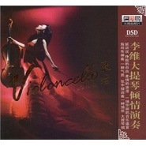

琴话大提琴独奏
============================

|  |  |
| :--: | :-- |
| [ 琴话大提琴独奏](https://emumo.xiami.com/album/2102755846) | **艺人**: [覃晔](../index.md) **语种**: 国语 **唱片公司**: 广东火烈鸟文化发展有限公司 **发行时间**: 2012年07月15日 **专辑类别**: 录音室专辑 **专辑风格**: 器乐独奏 Solo Instrumental **播放数**: 300494 **收藏数**: 71 **评论数**: 9  |

## 简介

 
 

李维大提琴倾情演奏，指间传神着一种气质 弦中倾诉着一种情怀。听乐曲中深沉流露的情感演绎，让光阴沉淀，然后漫溢流淌，当一切尘埃落地后，再感慨往事并不如烟……（由于版权问题本人只上传了这一首由本人作曲的作品） 
 

 
 

 

## 曲目

## 评论

|  |  |  |
| :-- | :-- | :-- |
|  [虾米用户](https://emumo.xiami.com/u/425653197)  2020-10-18 21:01 赞(0) 踩(0) | 
扯着心弦
 |
|  [虾米用户](https://emumo.xiami.com/u/355865) Let it go, l... 2019-02-17 00:29 赞(0) 踩(0) | 
重复：<a href="http://www.xiami.com/album/422162" target="_blank" rel="nofollow noreferrer noopener">http://www.xiami.com/album/422162</a>
 |
|  [虾米用户](https://emumo.xiami.com/u/11469213) 刚睡醒 2018-08-26 17:51 赞(0) 踩(0) | 
韵味悠长，寓意深远
 |
|  [虾米用户](https://emumo.xiami.com/u/30800139) 我在低俗与高雅间活的很尴... 2018-02-27 21:20 赞(0) 踩(0) | 
。
 |
|  [虾米用户](https://emumo.xiami.com/u/12876004) ` 2017-06-02 14:27 赞(0) 踩(0) | 
。
 |
| ⇒ |  [虾米用户](https://emumo.xiami.com/u/9819937)  2017-06-30 09:50 赞(0) 踩(0) | 
这沙发做的好  赞一个 哈哈
 |
| ⇒ |  [虾米用户](https://emumo.xiami.com/u/5174183) 我还没想好要写什么... 2017-06-30 15:00 赞(0) 踩(0) | 
<q><b>覃晔说：</b></q>
 |
| ⇒ |  [虾米用户](https://emumo.xiami.com/u/9819937)  2017-07-19 15:31 赞(0) 踩(0) | 
<q><b>sanduan168说：</b></q>
 |
