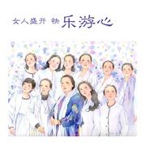

乐游心
============================

|  |  |
| :--: | :-- |
| [ 乐游心](https://emumo.xiami.com/album/2103725024) | **艺人**: [覃晔](../index.md) **语种**: 国语 **唱片公司**: 恬音文化 **发行时间**: 2018年05月31日 **专辑类别**: EP, 单曲 **专辑风格**:  **播放数**: 7070 **收藏数**: 15 **评论数**: 6  |

## 简介

懂爱的女人有幸福  
懂美的女人有品质  
懂价值的女人有智慧  
  
---乐游心

## 曲目

## 评论

|  |  |  |
| :-- | :-- | :-- |
|  [虾米用户](https://emumo.xiami.com/u/411105883)  2019-10-24 00:19 赞(0) 踩(0) | 
   
 |
|  [虾米用户](https://emumo.xiami.com/u/355033692)  2019-04-11 06:11 赞(1) 踩(0) | 
覃老师，这首歌是给哪个机构做的？
 |
| ⇒ |  [虾米用户](https://emumo.xiami.com/u/9819937)  2019-04-12 14:25 赞(0) 踩(0) | 
就是乐游心机构
 |
|  [虾米用户](https://emumo.xiami.com/u/379834301) 你在这里，而我也在这里，... 2019-03-22 19:41 赞(1) 踩(0) | 
歌曲歌词写得很棒！传递人间大爱，愿善意满人间，爱心遍环宇。
 |
|  [虾米用户](https://emumo.xiami.com/u/375716571) 最近迷上了听音乐 2018-07-03 12:01 赞(1) 踩(0) | 
这类歌曲还真不容易找到！ 
 |
|  [虾米用户](https://emumo.xiami.com/u/212457105) 漫步云端 2018-05-31 19:58 赞(1) 踩(0) | 
 
 |
