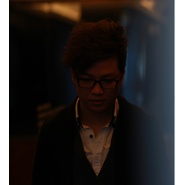

覃晔
============================

|  |  |
| :--: | :-- |
| [ 覃晔](https://i.xiami.com/qinye) | **播放数**: 11529406 **粉丝数**: 3043 **评论数**: 107 **地区**: China 中国大陆 **风格**: 佛教, 世界音乐, 民谣, 电子, 古典  |

## 档案

覃晔，80后新锐音乐创、制作人、唱作人，擅长作词、作曲、编曲、演唱。入行以来制作唱片百余张，与众多艺人合作，创作风格多变。2006年正式步入音乐圈，同年签约广东省火烈鸟唱片，并担任其公司专职作曲、编曲、录音、监制等工作。2009年10月进驻北京发展独立音乐人。 
合作歌手 
文章、谭维维、白燕升、乌兰托娅、吉祥三宝、乌达木、雪莲三姐妹、吴琼、陈明真、黑鸭子、阿宝、张咪、郭蓉、刘媛媛、敬善媛、耿宁 、高保利 、于海燕、师鹏 、 黄琦雯 、王雅洁 、乌兰托娅 、彭芳 、哈琳、 雨天、 李尤 、李绍继 、汤飞 、李函曦 、张磊、茸芭尔娜 、蓝首峰、袁洁琼 等 。 
合作乐手 
民乐：伍国忠、林文曾、苏畅、王华、黄江琴、缪晓铮、何绮雯等 
西乐：江建民、陈焕明、张毅、高志坚、钟慧常、李娟等

## 专辑

| 名称 | 语种 | 唱片公司 | 发行时间 | 专辑类别 | 专辑风格 |
| :--: | :-- | :-- | :-- | :-- | :-- |
| [ 如果我是你的影子影子咖啡](./albums/2104988434.md) | 国语 |  | 2019年07月12日 | EP, 单曲 | 城市民谣 Urban Folk, 民谣流行 Folk Pop |
| [ 乐游心](./albums/2103725024.md) | 国语 | 恬音文化 | 2018年05月31日 | EP, 单曲 |  |
| [ 量子意识能量健康法](./albums/2102750394.md) | 国语 | 独立发行 | 2017年03月15日 | 有声书 | 宗教新世纪 Religionary New Age |
| [ 中华成语奇遇记中国首部儿童国学古装电视连续剧](./albums/2102674014.md) | 国语 | 独立发行 | 2015年10月05日 | 原声带, 影视音乐 | 古风 GuFeng Music |
| [ 茶禅一味作曲   覃晔     古筝   苏畅     笛箫   王华](./albums/1604637540.md) | 国语 | 火烈鸟唱片 | 2014年06月20日 | 录音室专辑 | 民族融合新世纪 Ethnic Fusion New Age, 古风 GuFeng Music |
| [ 城市越大越孤单](./albums/1772131840.md) | 国语 | 酝星文化 | 2013年07月17日 | 录音室专辑 |  |
| [ 琴话大提琴独奏](./albums/2102755846.md) | 国语 | 广东火烈鸟文化发展有限公司 | 2012年07月15日 | 录音室专辑 | 器乐独奏 Solo Instrumental |

## 评论

|  |  |  |  |
| :-- | :-- | :-- | :-- |
|  [虾米用户](https://emumo.xiami.com/u/47043861)  2020-10-10 16:51 赞(0) 踩(0) | 
请问曲子的箫是谁演奏的？
 |
|  [虾米用户](https://emumo.xiami.com/u/348411959)  2020-08-21 13:44 赞(0) 踩(0) | 
  &amp;hellip;&amp;hellip;♡ ♪﹊
 |
|  [虾米用户](https://emumo.xiami.com/u/276944698) 不要自我设限..... 2020-06-30 19:56 赞(0) 踩(0) | 

 |
|  [虾米用户](https://emumo.xiami.com/u/120618420) 我还没想好要写什么... 2020-06-08 22:47 赞(1) 踩(0) | 
这是我在虾米的第二条评论，因为我的确觉得这里有问题。请大家听一下张帅的曲子《冬雪》，那首曲子是2007年发行的，只要听听，就能听出二者旋律基本一致。当然，如果大家只想听音乐不想管版权那我也没办法，但这样的事总不是一件什么好事。如果大家支持原创，拒绝抄袭。请移步听一下那首冬雪。并能说说自己的看法。
 |
|  [虾米用户](https://emumo.xiami.com/u/411341763)  2020-04-10 11:29 赞(2) 踩(0) | 
你是谁？呼唤我的灵魂做么？醒来需要痛彻心扉  ，我哪有这么勇敢与坚韧 
 |
|  [虾米用户](https://emumo.xiami.com/u/1358999)   2020-03-25 13:48 赞(1) 踩(0) | 
一首《醒》听了三年
 |
|  [虾米用户](https://emumo.xiami.com/u/425591903)  2020-03-17 21:24 赞(0) 踩(0) | 
知音难觅
 |
|  [虾米用户](https://emumo.xiami.com/u/349166912)  2020-03-13 22:30 赞(1) 踩(0) | 

 |
|  [虾米用户](https://emumo.xiami.com/u/434152246) 聪明少一些大智慧多一些，... 2020-02-22 15:46 赞(0) 踩(0) | 

 |
|  [虾米用户](https://emumo.xiami.com/u/7151428) 暖暖的～～ 2019-11-22 11:43 赞(1) 踩(0) | 

 |
|  [虾米用户](https://emumo.xiami.com/u/10537792)  2019-10-18 05:47 赞(1) 踩(0) | 
✨
 |
|  [虾米用户](https://emumo.xiami.com/u/8337431) 以乐会友 2019-10-10 02:33 赞(0) 踩(0) | 

 |
|  [虾米用户](https://emumo.xiami.com/u/125138490) 一个【单眼皮】【双子座】... 2019-08-15 20:51 赞(2) 踩(0) | 
谢谢你的音乐，让我获得了半刻的放松和愉悦
 |
|  [虾米用户](https://emumo.xiami.com/u/325374787)  2019-06-30 12:54 赞(0) 踩(0) | 
好
 |
|  [虾米用户](https://emumo.xiami.com/u/31028791) 网易和q也是神圣剑帝 2019-04-04 21:27 赞(2) 踩(0) | 
很好   
 |
|  [虾米用户](https://emumo.xiami.com/u/8192902)   2019-03-22 12:30 赞(1) 踩(0) | 
80后兴新乐人何止他一个，
 |
|  [虾米用户](https://emumo.xiami.com/u/335879843) 即使痛不欲生我亦谈笑风生... 2019-03-02 19:21 赞(2) 踩(0) | 
喜欢这个风格
 |
|  [虾米用户](https://emumo.xiami.com/u/337817552) 我还没想好要写什么... 2019-02-28 08:17 赞(2) 踩(0) | 
怎么会有这么好听的音乐，太好听了，每天上班都听，
 |
| ⇒ |  [虾米用户](https://emumo.xiami.com/u/269372347)  2019-03-24 10:37 赞(0) 踩(0) | 
是吧!(^O^)y
 |
|  [虾米用户](https://emumo.xiami.com/u/347769419)  2019-02-15 00:49 赞(8) 踩(0) | 
突然像一滴水打在莲花上，顿时盛开来，幻化做无数清莲随溪河弯弯绕绕，流啊，流经这禅化的山，山中的僧侣，已静坐了多少年，飘落的黄叶，推着江湖远去的孤舟，隐没在沧海横流。
 |
|  [虾米用户](https://emumo.xiami.com/u/242100318) 新的一天 我还有你 2019-01-07 20:04 赞(2) 踩(0) | 
有温度，有思想，有境界，这才是音乐
 |
|  [虾米用户](https://emumo.xiami.com/u/404405990) 最重要的是听着要舒服！！... 2018-12-29 01:20 赞(3) 踩(0) | 
不管好不好，听着舒服才是最重要的，交响乐好，但有几个能听懂的  
 |
|  [虾米用户](https://emumo.xiami.com/u/410428420)  2018-12-22 16:05 赞(2) 踩(0) | 
覃晔老师  能不能分享一下简谱呢 谢谢
 |
|  [虾米用户](https://emumo.xiami.com/u/409387227) 我还没想好要写什么... 2018-11-25 20:51 赞(2) 踩(0) | 
抄袭！！恶心的小人！真的配不上音乐人三个字！！
 |
|  [虾米用户](https://emumo.xiami.com/u/6610459)  2018-11-23 20:49 赞(3) 踩(0) | 
音律泛着灵性，禅意倾泻在指尖，怡情养性的好作品！为年轻有为的覃晔鼓掌点赞！希望多出（茶禅一味）类，荡涤心灵的好音乐！
 |
|  [虾米用户](https://emumo.xiami.com/u/376523473)  2018-11-22 10:24 赞(1) 踩(0) | 
加油 
 |
|  [虾米用户](https://emumo.xiami.com/u/9584304) Bonjour 2018-10-12 13:38 赞(1) 踩(0) | 
好听~~！！
 |
|  [虾米用户](https://emumo.xiami.com/u/277409554)  2018-08-31 08:54 赞(0) 踩(0) | 
   
 |
|  [虾米用户](https://emumo.xiami.com/u/223234413)  2018-07-28 16:19 赞(0) 踩(0) | 
看到介绍眼前一亮，人很年轻，作品很有质感，
 |
| ⇒ |  [虾米用户](https://emumo.xiami.com/u/9819937)  2018-10-11 09:36 赞(0) 踩(0) | 
感恩  支持
 |
| ⇒ |  [虾米用户](https://emumo.xiami.com/u/409387227) 我还没想好要写什么... 2018-11-25 20:54 赞(0) 踩(0) | 
<q><b>覃晔说：</b></q>
 |
| ⇒ |  [虾米用户](https://emumo.xiami.com/u/409387227) 我还没想好要写什么... 2018-11-26 11:58 赞(0) 踩(0) | 
覃晔是抄袭的  配不上音乐人三个字   人品有问题
 |
| ⇒ |  [虾米用户](https://emumo.xiami.com/u/26163946) 暂无签名~ 2019-03-22 01:25 赞(0) 踩(0) | 
<q><b>大胆的毛衣说：</b></q>
 |
| ⇒ |  [虾米用户](https://emumo.xiami.com/u/283919655) 水一般的男子 2019-07-24 12:58 赞(0) 踩(0) | 
<q><b>大胆的毛衣说：</b></q>
 |
| ⇒ |  [虾米用户](https://emumo.xiami.com/u/226833808) 梦里见 2020-01-16 19:44 赞(0) 踩(0) | 
<q><b>大胆的毛衣说：</b></q>
 |
| ⇒ |  [虾米用户](https://emumo.xiami.com/u/411341763)  2020-04-10 11:49 赞(0) 踩(0) | 
<q><b>一杯白水说：</b></q>
 |
|  [虾米用户](https://emumo.xiami.com/u/346952592) 行如风  做如松  最美... 2018-07-24 20:38 赞(4) 踩(0) | 
没想到！没想到！没想到！年龄与其作品差距太大了吧    
 |
| ⇒ |  [虾米用户](https://emumo.xiami.com/u/9819937)  2018-07-27 12:07 赞(0) 踩(0) | 
感恩你的支持，心里有它就在。
 |
| ⇒ |  [虾米用户](https://emumo.xiami.com/u/26163946) 暂无签名~ 2018-08-05 00:21 赞(0) 踩(0) | 
<q><b>覃晔说：</b></q>
 |
| ⇒ |  [虾米用户](https://emumo.xiami.com/u/9819937)  2018-10-10 18:05 赞(0) 踩(0) | 
<q><b>雁过无声说：</b></q>
 |
| ⇒ |  [虾米用户](https://emumo.xiami.com/u/409387227) 我还没想好要写什么... 2018-11-25 20:56 赞(0) 踩(0) | 
他是赤裸裸的抄袭！请移步网易云听原创张帅的《冬雪》做对比！
 |
| ⇒ |  [虾米用户](https://emumo.xiami.com/u/440794563)  2020-05-26 19:09 赞(0) 踩(0) | 
<q><b>大胆的毛衣说：</b></q>
 |
| ⇒ |  [虾米用户](https://emumo.xiami.com/u/120618420) 我还没想好要写什么... 2020-06-08 22:49 赞(0) 踩(0) | 
<q><b>大胆的毛衣说：</b></q>
 |
|  [虾米用户](https://emumo.xiami.com/u/16121508) 我爱音乐爱我 2018-07-07 11:51 赞(0) 踩(0) | 
您的音乐呈现出诗情画意的景象，在庸常的日子里显得格外甘洌，醒脑
 |
| ⇒ |  [虾米用户](https://emumo.xiami.com/u/9819937)  2018-07-27 12:08 赞(0) 踩(0) | 
感恩，真心希望我的音乐能帮助你。
 |
|  [虾米用户](https://emumo.xiami.com/u/144620702)  2018-05-18 21:55 赞(1) 踩(0) | 
（）
 |
|  [虾米用户](https://emumo.xiami.com/u/277211839)  2018-05-03 12:58 赞(1) 踩(0) | 
国之真传   啊&amp;hellip;&amp;hellip;胜过八十年代之港台！！！
 |
| ⇒ |  [虾米用户](https://emumo.xiami.com/u/9819937)  2018-07-27 12:09 赞(0) 踩(0) | 
感谢你的支持！继续努力！
 |
|  [虾米用户](https://emumo.xiami.com/u/20177386) 感谢一切美好的遇见❤️ 2018-02-20 10:46 赞(0) 踩(0) | 

 |
|  [虾米用户](https://emumo.xiami.com/u/336917119)  2018-01-07 08:32 赞(1) 踩(0) | 
第一首听了醒，在我打坐的时候，有一些新的感觉！然后就听了您的一些其它作品，都很棒，很多都适合在禅修的时候听会有很大的收获，感恩您创作了这么多的好作品！   如果有机会邀请您来参加我们的禅修，应该也能带给您一些灵感！随缘！ 
 |
| ⇒ |  [虾米用户](https://emumo.xiami.com/u/9819937)  2018-01-08 12:23 赞(0) 踩(0) | 
谢谢你的支持  感恩
 |
|  [虾米用户](https://emumo.xiami.com/u/43711944) 欣赏、感恩、享受美乐！ 2017-12-05 22:05 赞(1) 踩(0) | 
烦请老师看看，专题介绍了莲&amp;amp;悟，您可以点击今晚天籁之音查看！我真想发给你看看！可以没有您的联系方式！祝福你的佳作得到大众的认可，希望有更多的能听到！   
 |
|  [虾米用户](https://emumo.xiami.com/u/43711944) 欣赏、感恩、享受美乐！ 2017-12-05 22:02 赞(1) 踩(0) | 
覃华老师，今天看见有微信专题介绍您的作品，好开心啊！真心希望有更多的媒体宣传您的佳作！ 
 |
|  [虾米用户](https://emumo.xiami.com/u/227454954) 独当千古错，冷漠自逍遥。 2017-11-14 01:41 赞(2) 踩(0) | 
最喜欢 醒  ，该从过去中醒来了
 |
|  [虾米用户](https://emumo.xiami.com/u/272808458)  2017-10-15 11:04 赞(0) 踩(0) | 
喜欢，非常喜欢
 |
|  [虾米用户](https://emumo.xiami.com/u/3330714) nono 2017-10-02 20:42 赞(0) 踩(0) | 
最喜，醒，古雅空灵
 |
|  [虾米用户](https://emumo.xiami.com/u/32031632)  2017-10-01 17:24 赞(0) 踩(0) | 
南无阿弥佗佛
 |
|  [虾米用户](https://emumo.xiami.com/u/32031632)  2017-10-01 17:24 赞(3) 踩(0) | 
南无阿弥佗佛
 |
|  [虾米用户](https://emumo.xiami.com/u/13846145) 她的心是一个世界，一盏烛... 2017-08-29 23:17 赞(1) 踩(0) | 
厉害，喜欢这是我心中的中国古风，绝非二次元之类
 |
|  [虾米用户](https://emumo.xiami.com/u/308821509)  2017-08-14 05:38 赞(3) 踩(0) | 
谢谢你带给我们美妙的音乐作品！
 |
|  [虾米用户](https://emumo.xiami.com/u/291817381)  2017-08-09 19:52 赞(2) 踩(0) | 
非常喜欢听，给人心情舒畅， 
 |
|  [虾米用户](https://emumo.xiami.com/u/153013324) 粤语经典，古风禅乐new... 2017-08-06 12:19 赞(1) 踩(0) | 
随喜赞叹，阿弥陀佛
 |
|  [虾米用户](https://emumo.xiami.com/u/316223065)  2017-07-30 23:17 赞(0) 踩(0) | 
第一次听，马上收藏，其他的醒⋯⋯收藏收藏，赞！
 |
|  [虾米用户](https://emumo.xiami.com/u/12221090) 逍遥于天地而心意自得 2017-07-29 23:48 赞(0) 踩(0) | 
赞
 |
|  [虾米用户](https://emumo.xiami.com/u/2746326)  2017-07-29 00:00 赞(2) 踩(0) | 
炎炎夏日，写论文，听茶禅一味，感谢清凉的音乐。期待更多更好的作品。
 |
|  [虾米用户](https://emumo.xiami.com/u/42932120)  2017-07-25 17:22 赞(0) 踩(0) | 
就是喜欢
 |
|  [虾米用户](https://emumo.xiami.com/u/43711944) 欣赏、感恩、享受美乐！ 2017-06-27 22:42 赞(6) 踩(0) | 
国内难得一遇的有才气的年轻音乐人，绝对不亚于大牌知名音乐人的作品！您绝对有实力，作品风格多样，无论是歌唱还是纯音乐都是用心在做，有的中国风作品绝对是佳作精品，堪称完美极致，我从心底感激感动为你感到高兴，继续加油，我会继续关注您，支持您！许多虾米听众朋友感叹我们国乐被日本等国外音乐人侵占&amp;hellip;&amp;hellip;中国民族风，需要你们这样的音乐人坚守发扬光大！好音乐自然会有更多人喜欢，我看好你！前途无量！请坚持中国名族风，愿您在音乐的道路上越走越远&amp;hellip;&amp;hellip;（言多必失，有点激动，不到之处见谅！） 
 |
| ⇒ |  [虾米用户](https://emumo.xiami.com/u/9819937)  2017-06-30 09:39 赞(0) 踩(0) | 
谢谢你的支持  感恩 随喜
 |
|  [虾米用户](https://emumo.xiami.com/u/1151468)  2017-06-09 14:14 赞(1) 踩(0) | 
一听就喜欢！尤其是听到&amp;ldquo;水&amp;rdquo;，整个人均舒畅 
 |
| ⇒ |  [虾米用户](https://emumo.xiami.com/u/9819937)  2017-06-30 09:43 赞(0) 踩(0) | 
谢谢 常来听 随喜
 |
|  [虾米用户](https://emumo.xiami.com/u/282022014) 音樂………………：人類自... 2017-06-09 01:33 赞(1) 踩(0) | 
你的音乐风格，别具一格，非常畅想你 
 |
| ⇒ |  [虾米用户](https://emumo.xiami.com/u/9819937)  2017-06-30 09:43 赞(0) 踩(0) | 
谢谢支持 随喜
 |
|  [虾米用户](https://emumo.xiami.com/u/12221090) 逍遥于天地而心意自得 2017-06-03 22:37 赞(0) 踩(0) | 
赞
 |
| ⇒ |  [虾米用户](https://emumo.xiami.com/u/9819937)  2017-06-30 09:44 赞(0) 踩(0) | 
感恩
 |
|  [虾米用户](https://emumo.xiami.com/u/282022014) 音樂………………：人類自... 2017-05-30 12:17 赞(0) 踩(0) | 
喜爱喜欢！除了喜爱喜欢还是喜爱喜欢！   
 |
| ⇒ |  [虾米用户](https://emumo.xiami.com/u/9819937)  2017-06-30 09:44 赞(0) 踩(0) | 
谢谢你  感恩
 |
|  [虾米用户](https://emumo.xiami.com/u/7044835)  2017-05-23 20:45 赞(2) 踩(0) | 
我太喜欢您这样带有古乐风却又很优雅风格的纯音乐，我会一直关注 
 |
| ⇒ |  [虾米用户](https://emumo.xiami.com/u/9819937)  2017-06-30 09:44 赞(0) 踩(0) | 
谢谢你的支持
 |
|  [虾米用户](https://emumo.xiami.com/u/282022014) 音樂………………：人類自... 2017-05-22 10:24 赞(2) 踩(0) | 
你的优雅风格与内涵情感非常到位！年轻的音乐家！   
 |
| ⇒ |  [虾米用户](https://emumo.xiami.com/u/9819937)  2017-06-30 09:45 赞(0) 踩(0) | 
谢谢你的肯定  常来听
 |
|  [虾米用户](https://emumo.xiami.com/u/288356164)  2017-04-17 15:23 赞(0) 踩(0) | 
很喜欢听覃老师的禅茶一味。
 |
| ⇒ |  [虾米用户](https://emumo.xiami.com/u/9819937)  2017-06-30 09:45 赞(0) 踩(0) | 
谢谢你的信任  感恩
 |
|  [虾米用户](https://emumo.xiami.com/u/269245815) 偷得浮生半日闲，写意潇洒... 2017-04-16 14:06 赞(0) 踩(0) | 
您的曲子我都非常喜欢下载了好多首，喜欢滴不要不要的，大有相见恨晚之叹。总之大爱？希望您再接再厉多多带给我们惊喜噢
 |
| ⇒ |  [虾米用户](https://emumo.xiami.com/u/9819937)  2017-06-30 09:45 赞(0) 踩(0) | 
恩 努力中  希望多多支持
 |
| ⇒ |  [虾米用户](https://emumo.xiami.com/u/269245815) 偷得浮生半日闲，写意潇洒... 2017-06-30 14:14 赞(0) 踩(0) | 
<q><b>覃晔说：</b></q>
 |
|  [虾米用户](https://emumo.xiami.com/u/12876004) ` 2017-04-15 22:10 赞(0) 踩(0) | 
~`
 |
|  [虾米用户](https://emumo.xiami.com/u/97747450) 我还没想好要写什么... 2017-03-30 23:00 赞(0) 踩(0) | 
9239
 |
|  [虾米用户](https://emumo.xiami.com/u/221775861)  2017-03-16 13:30 赞(0) 踩(0) | 
    
 |
|  [虾米用户](https://emumo.xiami.com/u/2010751)  2017-03-14 13:07 赞(1) 踩(0) | 
好音乐，很喜欢，赞一个
 |
| ⇒ |  [虾米用户](https://emumo.xiami.com/u/9819937)  2017-06-30 09:46 赞(0) 踩(0) | 
谢谢你
 |
|  [虾米用户](https://emumo.xiami.com/u/121165694)  2016-07-27 12:12 赞(1) 踩(0) | 
超赞
 |
| ⇒ |  [虾米用户](https://emumo.xiami.com/u/9819937)  2017-06-30 09:46 赞(0) 踩(0) | 
感谢  感恩
 |
|  [虾米用户](https://emumo.xiami.com/u/13330601) 致虚极，守静笃。 2016-07-23 11:59 赞(3) 踩(0) | 
《茶禅一味》，支持老师，支持老师的佛教音乐！
 |
|  [虾米用户](https://emumo.xiami.com/u/49189600)  2016-03-23 00:32 赞(1) 踩(0) | 
超赞！！！难得找到听到后眼前一亮的！！！  
 |
|  [虾米用户](https://emumo.xiami.com/u/46484091)   2015-12-23 01:24 赞(3) 踩(0) | 
好感動！作曲家演奏家的水平都不得了啊！其中一首歸曲用簫自己經常模仿吹。
 |
|  [虾米用户](https://emumo.xiami.com/u/4487129)  2015-04-01 20:43 赞(0) 踩(0) | 
顶。。。。
 |
|  [虾米用户](https://emumo.xiami.com/u/31825593) Miss.D&M 2015-04-01 20:07 赞(10) 踩(0) | 
水,顶赞 ♡ ♡ ♡<a href="http://emumo.xiami.com/u/12068445" target="_blank" rel="nofollow" name_card="12068445">@就你脸小</a> <a href="http://emumo.xiami.com/u/4935021" target="_blank" rel="nofollow" name_card="4935021">@遗忘</a> <a href="http://emumo.xiami.com/u/4487129" target="_blank" rel="nofollow" name_card="4487129">@泡泡</a><a href="http://emumo.xiami.com/u/8898150" target="_blank" rel="nofollow" name_card="8898150">@翌朝</a> <a href="http://emumo.xiami.com/u/273065" target="_blank" rel="nofollow" name_card="273065">@蓝色冰点</a> <a href="http://emumo.xiami.com/u/1393420" target="_blank" rel="nofollow" name_card="1393420">@永烁星光之地</a> <a href="http://emumo.xiami.com/u/2790925" target="_blank" rel="nofollow" name_card="2790925">@独自等待</a><a href="http://emumo.xiami.com/u/10337057" target="_blank" rel="nofollow" name_card="10337057">@空灵骑圣</a><a href="http://emumo.xiami.com/u/6592758" target="_blank" rel="nofollow" name_card="6592758">@gengxiangzi</a> <a href="http://emumo.xiami.com/u/36966565" target="_blank" rel="nofollow" name_card="36966565">@宝和鱼</a>
 |
| ⇒ |  [虾米用户](https://emumo.xiami.com/u/6592758)  2015-04-01 21:54 赞(0) 踩(0) | 
******
 |
| ⇒ |  [虾米用户](https://emumo.xiami.com/u/7097982) EVERYTHING 2015-04-02 10:15 赞(0) 踩(0) | 
先MARK 最近的心态不能静下来听这些
 |
|  [虾米用户](https://emumo.xiami.com/u/47942550)  2015-03-08 12:20 赞(0) 踩(0) | 
支持！
 |
|  [虾米用户](https://emumo.xiami.com/u/12723049) get money 2015-03-05 00:51 赞(0) 踩(0) | 
吊
 |
|  [虾米用户](https://emumo.xiami.com/u/20424722) 静静聆听 2014-11-17 17:41 赞(0) 踩(0) | 
《天上天下无如佛〉，唱得太好了，天籁之音！赞！！！
 |
|  [虾米用户](https://emumo.xiami.com/u/309484) 生活的最高级是另一种生活... 2014-08-14 13:26 赞(1) 踩(0) | 
茶禅一味真的好听
 |
|  [虾米用户](https://emumo.xiami.com/u/11065541) 从音乐中找感觉 2013-08-26 22:54 赞(0) 踩(0) | 
大部分的歌都是他自己写的词。声音也不错呀。顶下。
 |
| ⇒ |  [虾米用户](https://emumo.xiami.com/u/9819937)  2014-07-29 15:38 赞(0) 踩(0) | 
谢谢推荐！
 |
|  [虾米用户](https://emumo.xiami.com/u/14138237)  2013-07-04 19:03 赞(0) 踩(0) | 
老同学
 |
| ⇒ |  [虾米用户](https://emumo.xiami.com/u/9819937)  2014-07-29 15:38 赞(0) 踩(0) | 
谢谢支持！
 |
