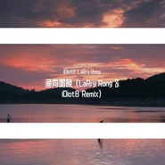
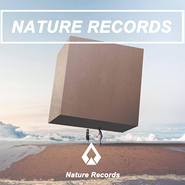
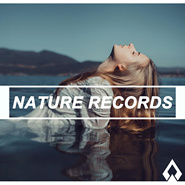
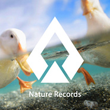

LaRry Rong
============================

|  |  |
| :--: | :-- |
| [ LaRry Rong](https://i.xiami.com/djlarryr) | **播放数**: 11107997 **粉丝数**: 1915 **评论数**: 152 **地区**: China 中国大陆 **风格**: 浩室舞曲 House, 深浩室舞曲 Deep House, 热带浩室 Tropical House, 未来浩室 Future House  |

## 档案

可持续关注：iDiot8

## 专辑

| 名称 | 语种 | 唱片公司 | 发行时间 | 专辑类别 | 专辑风格 |
| :--: | :-- | :-- | :-- | :-- | :-- |
| [ 3号线 (Chengdu)](./albums/5022460138.md) | 国语 | 独立发行 | 2021年01月12日 | EP, 单曲 | 深浩室舞曲 Deep House |
| [ 渔舟唱晚 (LaRry Rong & iDiot8 Remix)](./albums/5022114233.md) | 纯音乐 | 独立发行 | 2020年12月05日 | EP, 单曲 | 浩室舞曲 House |
| [ Astronomia (LaRry Rong Bootleg)](./albums/2108333033.md) | 其他 | 独立发行 | 2020年04月12日 | EP, 单曲 | 浩室舞曲 House, 热带浩室 Tropical House |
| [ WE LIKE](./albums/2105586878.md) | 英语 |  | 2019年12月15日 | EP, 单曲 | 前卫浩室 Progressive House |
| [ Sensational Love (i love ü)](./albums/2105234124.md) | 英语 |  | 2019年09月10日 | EP, 单曲 | 热带浩室 Tropical House |
| [ Sound Of My Dream (iDiot8 & LaRry Rong Bootleg)](./albums/2105160329.md) | 英语 | 独立发行 | 2019年08月18日 | EP, 单曲 | 深浩室舞曲 Deep House |
| [ The Way That I Feel](./albums/2104955417.md) | 英语 | Nature Records | 2019年06月21日 | EP, 单曲 | 热带浩室 Tropical House |
| [ Last Dance (iDiot8 & LaRry Rong Peppa Pig Remix)](./albums/2103690162.md) | 英语 | 独立发行 | 2018年04月19日 | EP, 单曲 | 回响贝斯 Dubstep |
| [ 把你手交给我](./albums/2102873838.md) | 国语 | 独立发行 | 2017年10月18日 | EP, 单曲 | 电子 Electronic, 电子舞曲 EDM / Electronic Dance Music, 浩室舞曲 House |
| [ Set off Immediately](./albums/2102821893.md) | 英语 | 独立发行 | 2017年08月28日 | EP, 单曲 | 雷鬼 Reggae |
| [ 还钱 (LaRry Rong Remix)](./albums/2102797486.md) | 国语 | 独立发行 | 2017年07月17日 | EP, 单曲 | 嘻哈 Hip-Hop, 陷阱说唱 Trap Rap |
| [ I Want You To Be Mine](./albums/2102776162.md) | 英语 | Nature Records | 2017年07月03日 | 录音室专辑 | 浩室舞曲 House |
| [ Something Just Like This (LaRry Rong Remix)](./albums/2102771620.md) | 英语 | 独立发行 | 2017年06月25日 | EP, 单曲 | 浩室舞曲 House, 深浩室舞曲 Deep House |
| [ Don't Wanna Fall (LaRry Rong & Dora Remix)](./albums/2102720925.md) | 英语 | Nature Records | 2017年03月24日 | EP, 单曲 | 弛放 Chillout, 深浩室舞曲 Deep House |
| [ Breathe Again (LaRry Rong Remix)](./albums/2102678595.md) | 英语 | Nature Records | 2017年01月10日 | EP, 单曲 | 浩室舞曲 House, 深浩室舞曲 Deep House |
| [ I Love Sky (D.va)](./albums/2102670679.md) | 英语 | Nature Records | 2016年12月21日 | EP, 单曲 | 深浩室舞曲 Deep House |
| [ Party Li (Original Mix)](./albums/2102664953.md) | 国语 | Nature Records | 2016年12月16日 | EP, 单曲 | 陷阱舞曲 Trap |
| [ Greatest Day (LaRry Rong Remix)](./albums/2102406757.md) | 英语 | Nature Records | 2016年10月15日 | EP, 单曲 |  |
| [ Summertime Sadness (LaRry Rong Remix)](./albums/2100382689.md) | 英语 | Nature Records | 2016年08月24日 | EP, 单曲 |  |
| [ Love Evolution （LaRry Rong Remix）](./albums/2100389821.md) | 英语 | Carlo Cavalli Music Group Edizioni Musicali | 2016年07月30日 | EP, 单曲 |  |
| [ Like Home (LaRry Rong Remix)](./albums/2100371909.md) | 英语 | 独立发行 | 2016年07月25日 | EP, 单曲 |  |
| [ Run Away (LaRry Rong Remix)](./albums/2100356096.md) | 英语 | Nature Records | 2016年06月19日 | EP, 单曲 | 浩室舞曲 House, 深浩室舞曲 Deep House |
| [ Your Side (LaRry Rong Remix)](./albums/2100354653.md) | 其他 | Nature Records | 2016年06月15日 | EP, 单曲 | 浩室舞曲 House, 深浩室舞曲 Deep House |
| [ Magic In The Night (Original Mix)](./albums/2100352057.md) | 英语 | Nature Records | 2016年06月06日 | EP, 单曲 | 浩室舞曲 House, 未来车库舞曲 Future Garage |
| [ Shoreline (LaRry Rong Remix)](./albums/2100349427.md) | 英语 | Nature Records | 2016年06月01日 | EP, 单曲 | 浩室舞曲 House, 深浩室舞曲 Deep House |
| [ Where To Find Me (LaRry Rong Remix)](./albums/2100347354.md) | 英语 | Nature Records | 2016年05月30日 | EP, 单曲 | 浩室舞曲 House, 深浩室舞曲 Deep House |
| [ Take Me Away (LaRry Rong Remix)](./albums/2100337592.md) | 英语 | Nature Records | 2016年05月16日 | EP, 单曲 | 浩室舞曲 House, 放克电子 Electro (Electro-Funk) |
| [ Innocence （LaRry Rong Remix）](./albums/2100332872.md) | 英语 | Nature Records | 2016年05月09日 | EP, 单曲 | 浩室舞曲 House |
| [ My Heart Will Go On （LaRry Rong Remix）](./albums/2100321484.md) | 其他 | Nature Records | 2016年04月25日 | EP, 单曲 | 电子民谣 Folktronica, 浩室舞曲 House, 深浩室舞曲 Deep House |
| [ Elastic Heart (LaRry Rong Remix)](./albums/2100306768.md) | 英语 | Nature Records | 2016年04月05日 | EP, 单曲 | 浩室舞曲 House, 碎拍 Breakbeat |
| [ Manse feat Alice Berg - Freeze Time (LaRry Rong & Dj Tea Remix)](./albums/2100301810.md) | 英语 | Nature Records | 2016年03月28日 | EP, 单曲 | 浩室舞曲 House |
| [ Touch (LaRry Rong Remix)](./albums/2100295524.md) | 英语 | Nature Records | 2016年03月17日 | EP, 单曲 | 浩室舞曲 House |
| [ Faded（LaRry Rong Remix）](./albums/2100289540.md) | 英语 | 独立发行 | 2016年03月09日 | EP, 单曲 | 浩室舞曲 House |
| [ Nature Radio Intros](./albums/2100281092.md) | 英语 | Nature Records | 2016年02月24日 | 播客 | 独立电子乐 Indietronica |
| [ Counting Down The Days (LaRry Rong Remix)](./albums/2100265980.md) | 英语 | Nature Records | 2016年01月26日 | EP, 单曲 | 浩室舞曲 House |
| [ Whistling](./albums/2100253902.md) | 其他 | 独立发行 | 2016年01月01日 | EP, 单曲 | 浩室舞曲 House, 深浩室舞曲 Deep House |
| [ Nature Records - China Step（试听版）](./albums/2100265466.md) | 国语 | Nature Records | 2016年01月01日 | 录音室专辑 | 回响贝斯 Dubstep |
| [ Colors (LaRry Rong Remix)](./albums/2100246236.md) | 英语 | 独立发行 | 2015年12月12日 | EP, 单曲 | 浩室舞曲 House, 深浩室舞曲 Deep House |
| [ Duang Duang Duang](./albums/2100240814.md) | 英语 | 独立发行 | 2015年11月24日 | EP, 单曲 | 浩室舞曲 House, 深浩室舞曲 Deep House |
| [ Nothing Stopping Me (LaRry Rong Remix)](./albums/2100228156.md) | 英语 | 独立发行 | 2015年10月26日 | EP, 单曲 | 浩室舞曲 House, 深浩室舞曲 Deep House, 独立电子乐 Indietronica |
| [ Memories (LaRry Rong Tropical Remix)](./albums/2100217238.md) | 英语 | 独立发行 | 2015年10月12日 | EP, 单曲 | 深浩室舞曲 Deep House |
| [ Deep Sensation](./albums/2100181584.md) | 英语 | 独立发行 | 2015年10月01日 | EP, 单曲 | 浩室舞曲 House, 深浩室舞曲 Deep House |
| [ Love Evolution](./albums/2100198478.md) | 英语 | Smilax Records | 2015年09月14日 | EP, 单曲 | 浩室舞曲 House, 深浩室舞曲 Deep House |
| [ 西游记Journey to the West](./albums/2100187046.md) | 英语 | 独立发行 | 2015年09月01日 | EP, 单曲 | 浩室舞曲 House, 放克电子 Electro (Electro-Funk) |
| [ Martin Garrix ft. Aleesia - Gold Skies (LaRry Rong Remix)](./albums/2100177178.md) | 英语 | 独立发行 | 2015年08月11日 | EP, 单曲 | 浩室舞曲 House |
| [ You (LaRry Rong Love Remix)](./albums/2100174371.md) | 英语 | 独立发行 | 2015年08月03日 | EP, 单曲 | 碎拍 Breakbeat |
| [ Armin Van Buuren - This Is What It Feels Like (LaRry Rong Remix)](./albums/2100172833.md) | 英语 | 独立发行 | 2015年07月30日 | EP, 单曲 | 浩室舞曲 House, 放克电子 Electro (Electro-Funk) |
| [ Dreamland (LaRry Rong Remix)](./albums/1734547102.md) | 英语 | 独立发行 | 2015年06月17日 | EP, 单曲 | 浩室舞曲 House |
| [ Avicii & Nicky Romero - I Could Be The One (LaRry Rong Love Mix)](./albums/530506299.md) | 英语 | 独立发行 | 2015年05月01日 | EP, 单曲 | 欧美流行 Western Pop |
| [ Don't U Know (JIanG.x vs LaRry Rong Remix)](./albums/1528556129.md) | 英语 | 独立发行 | 2015年04月09日 | EP, 单曲 | 浩室舞曲 House |
| [ You (LaRry Rong Remix)](./albums/1127200325.md) | 英语 | 独立发行 | 2015年03月24日 | EP, 单曲 | 浩室舞曲 House |
| [ Faded (LaRry Rong Extended Mix Demo)ZHU - Faded (LaRry Rong Extended Mix Demo)](./albums/227116436.md) | 英语 | 独立发行 | 2015年03月23日 | EP, 单曲 | 浩室舞曲 House, 深浩室舞曲 Deep House |
| [ 我爱骑行音乐电台Intros](./albums/326758589.md) | 国语 | 独立发行 | 2015年03月19日 | 播客 | 电音流行 Electropop |

## 评论

|  |  |  |  |
| :-- | :-- | :-- | :-- |
|  [虾米用户](https://emumo.xiami.com/u/439866413) 从今天开始，我要做一个脱... 2020-08-25 02:52 赞(1) 踩(0) | 
哈哈我是因为那个电音西游记才来的 
 |
| ⇒ |  [虾米用户](https://emumo.xiami.com/u/439866413) 从今天开始，我要做一个脱... 2020-08-25 03:00 赞(0) 踩(0) | 
那歌贼可爱&amp;lt;(￣︶￣)/
 |
|  [虾米用户](https://emumo.xiami.com/u/358732837) 嗨皮૧(●´৺`●)૭૧... 2020-08-08 11:40 赞(0) 踩(0) | 
好听 
 |
|  [虾米用户](https://emumo.xiami.com/u/279746713) 我深似是那浮萍，飘零到你... 2020-04-26 18:39 赞(0) 踩(0) | 
soso
 |
|  [虾米用户](https://emumo.xiami.com/u/339073071)  2020-04-12 22:30 赞(0) 踩(0) | 
好音乐 棒极了
 |
| ⇒ |  [虾米用户](https://emumo.xiami.com/u/43144581)  2020-04-12 23:48 赞(0) 踩(0) | 
谢谢
 |
|  [虾米用户](https://emumo.xiami.com/u/423947424) Wnt to be ma... 2020-01-28 14:38 赞(0) 踩(0) | 
很棒！！dont wanna fall开头我居然听出来future base的感觉，妙
 |
| ⇒ |  [虾米用户](https://emumo.xiami.com/u/329008508) 你的蠢材 2020-03-11 17:00 赞(0) 踩(0) | 
小号在做Future Bass哟
 |
|  [虾米用户](https://emumo.xiami.com/u/431310681) 做难事必有所得 2019-12-29 21:18 赞(1) 踩(0) | 
今天我和她聊天了我怀着忐忑不安的心，等待着&amp;hellip;&amp;hellip;她回复了我了，
 |
|  [虾米用户](https://emumo.xiami.com/u/40548253) 愿你找到亲爱的 不负热爱... 2019-12-26 18:06 赞(0) 踩(0) | 
好听，哇咔咔～我心情低落就喜欢听电音，谢谢
 |
|  [虾米用户](https://emumo.xiami.com/u/364023571)  2019-12-01 23:34 赞(0) 踩(0) | 
也太棒了吧！现在入股还来得及吗！
 |
|  [虾米用户](https://emumo.xiami.com/u/42066129) 我爱虾米 2019-09-03 19:49 赞(0) 踩(0) | 
我来成都了 你在成都吗 还会看到你的音乐会吗
 |
| ⇒ |  [虾米用户](https://emumo.xiami.com/u/43144581)  2019-09-06 14:48 赞(0) 踩(0) | 
可以呀
 |
| ⇒ |  [虾米用户](https://emumo.xiami.com/u/42066129) 我爱虾米 2019-09-06 15:11 赞(0) 踩(0) | 
<q><b>LaRry Rong说：</b></q>
 |
| ⇒ |  [虾米用户](https://emumo.xiami.com/u/43144581)  2019-09-10 22:04 赞(0) 踩(0) | 
<q><b>jesen说：</b></q>
 |
|  [虾米用户](https://emumo.xiami.com/u/326165803) 我还没想好要写什么... 2019-07-25 08:02 赞(0) 踩(0) | 
阿荣你都是用什么软件做音乐呐
 |
| ⇒ |  [虾米用户](https://emumo.xiami.com/u/43144581)  2019-12-11 00:45 赞(0) 踩(0) | 
FL Studio
 |
|  [虾米用户](https://emumo.xiami.com/u/335999338)  2019-07-04 22:48 赞(0) 踩(0) | 
加油，很好听！！
 |
|  [虾米用户](https://emumo.xiami.com/u/43144581)  2019-06-05 20:41 赞(4) 踩(0) | 
我还在做音乐，也在演出，还继续在旅游，但是我换了一个名字：iDiot8
 |
|  [虾米用户](https://emumo.xiami.com/u/424630222)  2019-06-01 13:14 赞(0) 踩(0) | 
fucksinh
 |
|  [虾米用户](https://emumo.xiami.com/u/366300784) lmz1979 2019-05-05 16:02 赞(1) 踩(0) | 
god bless you
 |
|  [虾米用户](https://emumo.xiami.com/u/324879742)   2019-03-29 02:58 赞(0) 踩(0) | 
.
 |
|  [虾米用户](https://emumo.xiami.com/u/54434609) 这家伙很聪明 2019-03-20 16:34 赞(0) 踩(0) | 

 |
|  [虾米用户](https://emumo.xiami.com/u/325374787)  2019-03-18 20:15 赞(1) 踩(0) | 
好
 |
|  [虾米用户](https://emumo.xiami.com/u/248226583) take my hand... 2019-03-01 23:26 赞(2) 踩(0) | 
你可真牛逼，歌真好听
 |
|  [虾米用户](https://emumo.xiami.com/u/406221037) Life is a bl... 2019-02-09 04:58 赞(0) 踩(0) | 
谢谢，很不错的作品 
 |
|  [虾米用户](https://emumo.xiami.com/u/105451946) 亲们网易云见昵称：摩羯天... 2019-02-04 08:42 赞(1) 踩(0) | 
加油
 |
|  [虾米用户](https://emumo.xiami.com/u/43220514) 从愿意获得变为渴望付出 2019-02-03 01:28 赞(0) 踩(0) | 
良品乐铺 
 |
|  [虾米用户](https://emumo.xiami.com/u/359025518) 梦幻缥缈的音乐，心旷神怡... 2018-08-27 14:19 赞(0) 踩(0) | 
好听的音乐，令人心旷神怡，令人神往，令人羡慕，令人难以忘怀。
 |
|  [虾米用户](https://emumo.xiami.com/u/269771964) 天基王---鹤熙 2018-08-17 14:37 赞(1) 踩(0) | 
你的歌可以，虽说是Remix但很return nurture
 |
|  [虾米用户](https://emumo.xiami.com/u/265828744)  2018-07-09 20:30 赞(0) 踩(0) | 
支持你 
 |
|  [虾米用户](https://emumo.xiami.com/u/314628056) 您拨打的电话已注销 2018-04-21 15:12 赞(1) 踩(0) | 
中国电音的领导者，是大佬本人没错了，什么美国鸡就不要出现了，还没出现就一败涂地了。
 |
| ⇒ |  [虾米用户](https://emumo.xiami.com/u/3604175)  2018-05-19 00:10 赞(0) 踩(0) | 
你这是嫉妒吗？
 |
| ⇒ |  [虾米用户](https://emumo.xiami.com/u/315950236) 共亿 2019-04-20 21:44 赞(0) 踩(0) | 
呵呵，您是没听完别人作品啊
 |
| ⇒ |  [虾米用户](https://emumo.xiami.com/u/423947424) Wnt to be ma... 2020-01-28 14:39 赞(0) 踩(0) | 
<q><b>临天说：</b></q>
 |
| ⇒ |  [虾米用户](https://emumo.xiami.com/u/315950236) 共亿 2020-02-02 09:28 赞(0) 踩(0) | 
<q><b>XvX，永远的虾米遗民说：</b></q>
 |
|  [虾米用户](https://emumo.xiami.com/u/327835810) 烟民 2018-02-09 21:11 赞(2) 踩(0) | 
可以啊
 |
|  [虾米用户](https://emumo.xiami.com/u/329136695)  2018-01-27 12:43 赞(1) 踩(0) | 
太喜欢这个风格了 大赞！
 |
|  [虾米用户](https://emumo.xiami.com/u/338880760) 我是施瓦辛格 2018-01-04 15:02 赞(1) 踩(0) | 
宝贝儿，你是什么人种？
 |
|  [虾米用户](https://emumo.xiami.com/u/8583581) 音乐赋予了我们情感 2017-12-11 09:02 赞(1) 踩(0) | 
池塘里水满了、雨也停了 田边的稀泥里到处是泥鳅。 天天我等着你、等着你捉泥鳅 大哥哥好不好，咱们去捉泥鳅
 |
|  [虾米用户](https://emumo.xiami.com/u/260893311) 待我衣锦归来。 2017-12-06 23:16 赞(0) 踩(0) | 
可以
 |
|  [虾米用户](https://emumo.xiami.com/u/4400366) 再也不见 2017-11-14 04:23 赞(0) 踩(0) | 
囍
 |
|  [虾米用户](https://emumo.xiami.com/u/143401552) 我没有能力我有野心 2017-08-01 14:31 赞(2) 踩(0) | 
混得好听
 |
|  [虾米用户](https://emumo.xiami.com/u/16132066)  2017-07-14 22:36 赞(3) 踩(0) | 
国人赞，年轻有为
 |
|  [虾米用户](https://emumo.xiami.com/u/286446757)  2017-04-08 21:37 赞(13) 踩(0) | 
三年来一直听着阿荣的MIX作品，音乐吸引了爱歌的人，你的音乐吸引了懂音乐的人，阿荣加油！
 |
|  [虾米用户](https://emumo.xiami.com/u/45918153) 沉醉该沉醉的地方。 2017-03-28 11:22 赞(1) 踩(0) | 
牛逼
 |
|  [虾米用户](https://emumo.xiami.com/u/275404417) 音乐给我了动力 2017-03-23 22:31 赞(1) 踩(0) | 
666
 |
|  [虾米用户](https://emumo.xiami.com/u/88621108) 嗨到凌晨四点 2017-01-13 21:42 赞(1) 踩(0) | 
赞爆了，
 |
|  [虾米用户](https://emumo.xiami.com/u/57515548)  2017-01-12 23:48 赞(2) 踩(0) | 
哇塞 是中国人 6666必须支持
 |
|  [虾米用户](https://emumo.xiami.com/u/198245168) Fakeuphrosyn... 2017-01-12 07:57 赞(0) 踩(0) | 

 |
|  [虾米用户](https://emumo.xiami.com/u/257156933) veniaminkrem 2017-01-11 09:39 赞(0) 踩(0) | 
rll0
 |
|  [虾米用户](https://emumo.xiami.com/u/257156933) veniaminkrem 2017-01-11 09:39 赞(0) 踩(0) | 
rll0
 |
|  [虾米用户](https://emumo.xiami.com/u/35096337) 我还没想好要写什么... 2016-12-26 13:21 赞(1) 踩(0) | 
喜欢喜欢！！
 |
|  [虾米用户](https://emumo.xiami.com/u/256361417)  2016-12-23 15:49 赞(0) 踩(0) | 
电
 |
|  [虾米用户](https://emumo.xiami.com/u/75346412)   2016-09-21 09:11 赞(0) 踩(0) | 
。
 |
|  [虾米用户](https://emumo.xiami.com/u/16745497) 我还没想好要写什么... 2016-09-10 22:33 赞(1) 踩(0) | 
敢不敢来点儿纯原创...？？
 |
|  [虾米用户](https://emumo.xiami.com/u/15427197) 程序搬运工 2016-09-10 20:08 赞(1) 踩(0) | 
非常棒
 |
|  [虾米用户](https://emumo.xiami.com/u/15427197) 程序搬运工 2016-09-10 20:03 赞(1) 踩(0) | 
曲子太好了
 |
|  [虾米用户](https://emumo.xiami.com/u/15427197) 程序搬运工 2016-09-10 11:17 赞(1) 踩(0) | 
电音，听说不错
 |
|  [虾米用户](https://emumo.xiami.com/u/196705551) ♡    Enjoy i... 2016-09-03 02:16 赞(0) 踩(0) | 
你这个版本目前最爱
 |
|  [虾米用户](https://emumo.xiami.com/u/50878892)  2016-08-24 18:00 赞(0) 踩(0) | 
有范儿
 |
|  [虾米用户](https://emumo.xiami.com/u/12500959)  2016-08-21 16:15 赞(0) 踩(0) | 
好！我喜欢！！
 |
|  [虾米用户](https://emumo.xiami.com/u/6048799)  2016-08-17 10:48 赞(0) 踩(0) | 
求安利
 |
|  [虾米用户](https://emumo.xiami.com/u/6048799)  2016-08-17 10:48 赞(0) 踩(0) | 
中毒了！
 |
|  [虾米用户](https://emumo.xiami.com/u/191909058) 浓墨重彩一笔过，轻描淡写... 2016-08-11 19:58 赞(1) 踩(0) | 
加油！
 |
|  [虾米用户](https://emumo.xiami.com/u/191909058) 浓墨重彩一笔过，轻描淡写... 2016-08-11 19:58 赞(0) 踩(0) | 
棒棒的
 |
|  [虾米用户](https://emumo.xiami.com/u/209230921) Nothing bett... 2016-08-09 10:41 赞(0) 踩(0) | 
很棒
 |
|  [虾米用户](https://emumo.xiami.com/u/9035988) 世界微尘里，吾宁爱与憎➕... 2016-07-27 13:42 赞(0) 踩(0) | 
被洗脑，求入教
 |
| ⇒ |  [虾米用户](https://emumo.xiami.com/u/43144581)  2016-08-11 10:56 赞(0) 踩(0) | 
来吧
 |
| ⇒ |  [虾米用户](https://emumo.xiami.com/u/9035988) 世界微尘里，吾宁爱与憎➕... 2016-08-11 11:03 赞(0) 踩(0) | 
<q><b>LaRry Rong说：</b></q>
 |
| ⇒ |  [虾米用户](https://emumo.xiami.com/u/43144581)  2016-08-11 11:18 赞(0) 踩(0) | 
<q><b>Riim说：</b></q>
 |
|  [虾米用户](https://emumo.xiami.com/u/52056952) 人生即是到來、相遇、陪伴... 2016-07-13 12:42 赞(0) 踩(0) | 

 |
|  [虾米用户](https://emumo.xiami.com/u/50733676) 我还没想好要写什么... 2016-07-04 23:52 赞(0) 踩(0) | 
 
 |
|  [虾米用户](https://emumo.xiami.com/u/93081992) so what 2016-07-04 08:39 赞(0) 踩(0) | 
爱你哦！我要去看演唱会！
 |
| ⇒ |  [虾米用户](https://emumo.xiami.com/u/43144581)  2016-07-09 04:37 赞(0) 踩(0) | 
30号晚上有我的演出 现在可以私信我
 |
|  [虾米用户](https://emumo.xiami.com/u/58369876) Hiphop Dance... 2016-06-30 03:56 赞(0) 踩(0) | 
小狗好可爱
 |
|  [虾米用户](https://emumo.xiami.com/u/84571136) 唯有音乐不离不弃 2016-06-19 22:59 赞(1) 踩(0) | 
<a href="https://itunes.apple.com/fr/album/larry-ep/id1121420163?l=en" target="_blank" rel="nofollow noreferrer noopener">https://itunes.apple.com/fr/album/larry-ep/id1121420163?l=en</a><a href="http://emumo.xiami.com/u/36057872" target="_blank" rel="nofollow" name_card="36057872">@扎扎~</a>
 |
|  [虾米用户](https://emumo.xiami.com/u/46292977) Music Drug 2016-06-19 11:05 赞(0) 踩(0) | 
好喜欢你的tropical house
 |
|  [虾米用户](https://emumo.xiami.com/u/49116186) (:3_ヽ)_ 2016-06-18 22:52 赞(0) 踩(0) | 
.狗狗么  
 |
|  [虾米用户](https://emumo.xiami.com/u/125829952) 我还没想好要写什么... 2016-06-18 15:59 赞(0) 踩(0) | 
哇塞哇塞喜欢喜欢 
 |
|  [虾米用户](https://emumo.xiami.com/u/49402915)  还没想好要写什么... 2016-06-01 22:43 赞(0) 踩(0) | 

 |
|  [虾米用户](https://emumo.xiami.com/u/111659756)   2016-05-26 12:07 赞(31) 踩(0) | 
喜欢就付费下载，不喜欢没人强迫，为自己喜欢的音乐掏钱不是很正常么？
 |
|  [虾米用户](https://emumo.xiami.com/u/6947292)  2016-05-23 23:52 赞(28) 踩(0) | 
大陆的吗？我一直对国内音乐人没有好感，但这首重置，真的不错，作为一个普通听众，我得说游离的感觉很到位，良品5星，含1分情怀。
 |
| ⇒ |  [虾米用户](https://emumo.xiami.com/u/268650299)  2017-02-19 23:45 赞(0) 踩(0) | 
成都，我加了他群
 |
| ⇒ |  [虾米用户](https://emumo.xiami.com/u/326165803) 我还没想好要写什么... 2019-07-25 08:00 赞(0) 踩(0) | 
<q><b>唐小发这个名字被人占了说：</b></q>
 |
|  [虾米用户](https://emumo.xiami.com/u/9192026)  2016-05-23 22:04 赞(0) 踩(0) | 
其他音乐人都没收费 就你特殊
 |
| ⇒ |  [虾米用户](https://emumo.xiami.com/u/43144581)  2016-05-23 23:51 赞(0) 踩(0) | 
我的劳动成果不该值钱？有问题你找虾米啊
 |
| ⇒ |  [虾米用户](https://emumo.xiami.com/u/9192026)  2016-06-01 22:48 赞(0) 踩(0) | 
<q><b>说：</b></q>
 |
| ⇒ |  [虾米用户](https://emumo.xiami.com/u/48453147) 电音小马达 2018-12-08 12:59 赞(0) 踩(0) | 
没钱就是没钱，废什么话
 |
| ⇒ |  [虾米用户](https://emumo.xiami.com/u/273844623) 2016说唱救了我，20... 2019-03-06 23:06 赞(0) 踩(0) | 
<q><b>LaRry Rong说：</b></q>
 |
|  [虾米用户](https://emumo.xiami.com/u/9192026)  2016-05-20 12:24 赞(0) 踩(0) | 
下载要付费 太坑了吧
 |
| ⇒ |  [虾米用户](https://emumo.xiami.com/u/43144581)  2016-05-20 12:27 赞(0) 踩(0) | 
这个问题相当于：你上班还要工资？太坑了吧
 |
| ⇒ |  [虾米用户](https://emumo.xiami.com/u/9192026)  2016-05-23 22:02 赞(0) 踩(0) | 
<q><b>LaRry Rong说：</b></q>
 |
| ⇒ |  [虾米用户](https://emumo.xiami.com/u/43144581)  2016-05-23 23:33 赞(0) 踩(0) | 
<q><b>河豚说：</b></q>
 |
| ⇒ |  [虾米用户](https://emumo.xiami.com/u/2494430) Summer 2016-06-10 15:57 赞(0) 踩(0) | 
<q><b>LaRry Rong说：</b></q>
 |
|  [虾米用户](https://emumo.xiami.com/u/172715728)  2016-05-20 11:38 赞(0) 踩(0) | 
只是喜欢，没有理由
 |
|  [虾米用户](https://emumo.xiami.com/u/36372534) 音乐抚慰我脆弱的心灵 2016-05-19 10:43 赞(0) 踩(0) | 
来支持一下 LaRry Rong
 |
|  [虾米用户](https://emumo.xiami.com/u/93081992) so what 2016-05-18 11:16 赞(0) 踩(0) | 
有才
 |
|  [虾米用户](https://emumo.xiami.com/u/49402915)  还没想好要写什么... 2016-05-12 15:00 赞(0) 踩(0) | 

 |
|  [虾米用户](https://emumo.xiami.com/u/45019593)  2016-05-09 21:50 赞(0) 踩(0) | 
加油  
 |
|  [虾米用户](https://emumo.xiami.com/u/138140600) 玉人只怨春归去 不道槐云... 2016-05-06 22:26 赞(1) 踩(0) | 
国人吗 很好啊
 |
|  [虾米用户](https://emumo.xiami.com/u/101289178) 我还没想好要写什么... 2016-04-27 10:25 赞(0) 踩(0) | 

 |
|  [虾米用户](https://emumo.xiami.com/u/3375763) 热爱音乐 2016-04-25 21:23 赞(0) 踩(0) | 
好听
 |
|  [虾米用户](https://emumo.xiami.com/u/42693847) ❤️ 搬至云村同名 2016-04-24 22:03 赞(0) 踩(0) | 

 |
|  [虾米用户](https://emumo.xiami.com/u/53532610) wolfgang 2016-04-24 00:55 赞(0) 踩(0) | 

 |
|  [虾米用户](https://emumo.xiami.com/u/57384370)   2016-04-23 15:31 赞(0) 踩(0) | 
Faded很好。其他的请怪我不懂欣赏。
 |
|  [虾米用户](https://emumo.xiami.com/u/23174461) Always Liste... 2016-04-21 10:49 赞(1) 踩(0) | 
Faded 太好了！
 |
|  [虾米用户](https://emumo.xiami.com/u/52717662)  2016-04-20 18:32 赞(0) 踩(0) | 
第一次听电音你的风格有点耳目一新加油
 |
|  [虾米用户](https://emumo.xiami.com/u/9192026)  2016-04-17 21:49 赞(0) 踩(0) | 
感觉歌都是一个套路
 |
|  [虾米用户](https://emumo.xiami.com/u/53040874)   2016-04-16 20:08 赞(1) 踩(0) | 
兄弟，你是中国电音的希望啊  
 |
|  [虾米用户](https://emumo.xiami.com/u/47269554) 一个不会挖掘机的厨师不是... 2016-04-08 02:12 赞(0) 踩(0) | 
必须顶起
 |
|  [虾米用户](https://emumo.xiami.com/u/44955178) Run  2016-04-07 11:01 赞(0) 踩(0) | 
好听！
 |
|  [虾米用户](https://emumo.xiami.com/u/44955178) Run  2016-04-07 11:01 赞(0) 踩(0) | 

 |
|  [虾米用户](https://emumo.xiami.com/u/45561151) 电音控 ✈  2016-03-23 13:05 赞(0) 踩(0) | 
一直关注，支持一个 
 |
|  [虾米用户](https://emumo.xiami.com/u/11917054) 『常年卧底医院并乔装成医... 2016-03-19 08:29 赞(0) 踩(0) | 
ゝ(･ωゝ(･ωゝ(･ω･)〆ω･)〆ω･)〆五人众参上！
 |
|  [虾米用户](https://emumo.xiami.com/u/61071644) Eapy 2016-03-17 00:59 赞(0) 踩(0) | 
我的新对象哈哈哈   
 |
|  [虾米用户](https://emumo.xiami.com/u/3968001) 旋律是人类共通的语言 2016-02-29 22:42 赞(0) 踩(0) | 
好厉害，呆呆的听...
 |
|  [虾米用户](https://emumo.xiami.com/u/2999594)  2016-01-23 01:12 赞(0) 踩(0) | 
larry你在成都哪里？
 |
| ⇒ |  [虾米用户](https://emumo.xiami.com/u/43144581)  2016-01-24 21:45 赞(0) 踩(0) | 
双流
 |
| ⇒ |  [虾米用户](https://emumo.xiami.com/u/2999594)  2016-01-24 21:48 赞(0) 踩(0) | 
<q><b>LaRry Rong说：</b></q>
 |
| ⇒ |  [虾米用户](https://emumo.xiami.com/u/43144581)  2016-01-26 00:38 赞(0) 踩(0) | 
<q><b>cccccc520说：</b></q>
 |
| ⇒ |  [虾米用户](https://emumo.xiami.com/u/59743266)  2016-01-27 21:43 赞(0) 踩(0) | 
<q><b>LaRry Rong说：</b></q>
 |
| ⇒ |  [虾米用户](https://emumo.xiami.com/u/48321823)   2016-02-12 10:28 赞(0) 踩(0) | 
<q><b>LaRry Rong说：</b></q>
 |
| ⇒ |  [虾米用户](https://emumo.xiami.com/u/4727768)  2016-03-22 20:07 赞(0) 踩(0) | 
<q><b>LaRry Rong说：</b></q>
 |
| ⇒ |  [虾米用户](https://emumo.xiami.com/u/43144581)  2016-03-23 14:12 赞(0) 踩(0) | 
<q><b>cccccc520说：</b></q>
 |
| ⇒ |  [虾米用户](https://emumo.xiami.com/u/43144581)  2016-03-23 14:12 赞(0) 踩(0) | 
<q><b>桥根说：</b></q>
 |
| ⇒ |  [虾米用户](https://emumo.xiami.com/u/43144581)  2016-03-23 14:13 赞(0) 踩(0) | 
<q><b>贺伊流的大家族说：</b></q>
 |
|  [虾米用户](https://emumo.xiami.com/u/5670706)   2015-12-11 10:51 赞(0) 踩(0) | 
关注
 |
|  [虾米用户](https://emumo.xiami.com/u/31658125) DJ 2015-11-29 02:31 赞(0) 踩(0) | 
支持
 |
|  [虾米用户](https://emumo.xiami.com/u/44090835) Qlimax 2015-11-20 12:07 赞(0) 踩(0) | 
我是KkK 8   
 |
|  [虾米用户](https://emumo.xiami.com/u/82370228)  2015-11-12 19:16 赞(0) 踩(0) | 
死逗比
 |
|  [虾米用户](https://emumo.xiami.com/u/53552819) ⁽⁽ૢ(⁎❝ົཽω❝ົཽ... 2015-10-28 16:55 赞(0) 踩(0) | 
莱瑞。..好久不见 
 |
|  [虾米用户](https://emumo.xiami.com/u/54331318) 遗憾的是我们再也不能相见 2015-10-05 10:26 赞(0) 踩(0) | 
西西音乐
 |
|  [虾米用户](https://emumo.xiami.com/u/32434247) 通吃/啥都做 2015-08-29 23:34 赞(0) 踩(0) | 
mix
 |
|  [虾米用户](https://emumo.xiami.com/u/32434247) 通吃/啥都做 2015-08-29 23:34 赞(0) 踩(0) | 
顶！期待自己的mic
 |
| ⇒ |  [虾米用户](https://emumo.xiami.com/u/43144581)  2015-08-29 23:59 赞(0) 踩(0) | 
!!! thanks
 |
|  [虾米用户](https://emumo.xiami.com/u/50455260) 所谓伊人，在水一方～ 2015-08-10 13:53 赞(0) 踩(0) | 
叼毛我顶你顶你顶你
 |
|  [虾米用户](https://emumo.xiami.com/u/53711861)  2015-07-28 18:34 赞(0) 踩(0) | 
一休来给你扎起
 |
|  [虾米用户](https://emumo.xiami.com/u/48437345)  2015-03-23 22:13 赞(0) 踩(0) | 
哟呵呵 必须给荣哥顶一个
 |
|  [虾米用户](https://emumo.xiami.com/u/48324016) 暂无签名~ 2015-03-20 18:15 赞(0) 踩(0) | 
给荣哥扎起
 |
|  [虾米用户](https://emumo.xiami.com/u/46365410)  2015-01-23 00:02 赞(1) 踩(0) | 
西西音乐
 |
|  [虾米用户](https://emumo.xiami.com/u/43899636)  2015-01-13 16:49 赞(0) 踩(0) | 
支持
 |
|  [虾米用户](https://emumo.xiami.com/u/45639934)  2015-01-04 18:51 赞(0) 踩(0) | 
嘻嘻
 |
|  [虾米用户](https://emumo.xiami.com/u/43144581)  2014-10-31 23:25 赞(101) 踩(0) | 
我刚入驻了虾米音乐人，欢迎大家来我的个人主页，收听我的最新音乐
 |
| ⇒ |  [虾米用户](https://emumo.xiami.com/u/43597422)  2014-11-12 10:14 赞(0) 踩(0) | 
支持一个，好听
 |
| ⇒ |  [虾米用户](https://emumo.xiami.com/u/43144581)  2014-11-12 10:36 赞(0) 踩(0) | 
<q><b>青春没有终点说：</b></q>
 |
| ⇒ |  [虾米用户](https://emumo.xiami.com/u/93049624) 爱上下雨天。 2016-04-30 13:08 赞(0) 踩(0) | 
很独特
 |
| ⇒ |  [虾米用户](https://emumo.xiami.com/u/72577034) 品意境 2016-05-14 14:04 赞(0) 踩(0) | 
中国电音的带头人，顶你    
 |
| ⇒ |  [虾米用户](https://emumo.xiami.com/u/2929982)   2016-07-25 21:05 赞(0) 踩(0) | 
感谢带给我们这么棒的曲子，听原曲惊艳了一下下，你的remix版让我忘了原曲。加油！
 |
| ⇒ |  [虾米用户](https://emumo.xiami.com/u/258175491) 住在海边喜欢浪… 2017-02-22 12:08 赞(0) 踩(0) | 
66666666666
 |
| ⇒ |  [虾米用户](https://emumo.xiami.com/u/321582961)  2018-05-12 17:18 赞(0) 踩(0) | 
好听呢     力挺  兄台您。。。。
 |
| ⇒ |  [虾米用户](https://emumo.xiami.com/u/325052739) 音乐让我今入想你的世界，... 2018-09-26 22:33 赞(0) 踩(0) | 
节奏动感，好听，得劲儿
 |
